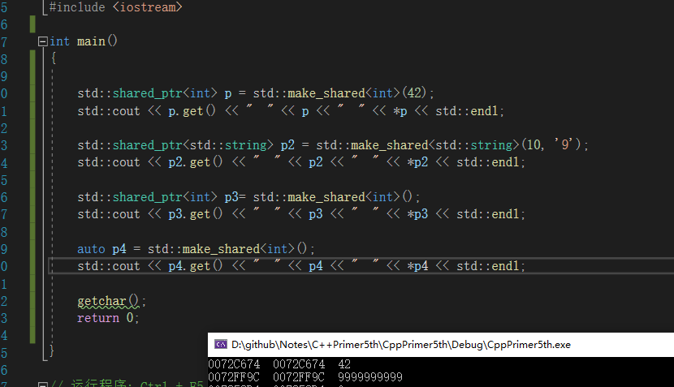

之前一直说来看看，但书买来以后一直没有看，虽然很多人都说是吧当成字典来查阅，但是，都不知道概念，那我去查找的关键字是什么都不知道，怎么查阅啊。因此，此次看的一个目的就是加大自己的知识范围，有可能会记录有不完善的地方。

-------------------------

# 标准库部分

# 第八章   IO库

C++语言，不直接处理输入输出，通过定义在标准库中的类型来处理IO，这些类型支持从设备读取数据，向设备写入数据的IO操作，**设备可以是文件，控制台窗口等，还有一些允许内存IO，即从 string 读取，向 string 写入。**

### 8.1   IO类

| 头文件     | 类型                                                         | 说明                                                   |
| ---------- | ------------------------------------------------------------ | ------------------------------------------------------ |
| `iostream` | `istream`,`wistream` `ostream`，`wostream` `iostream`，`wiostream` | 输入流，提供输入操作 向流写入数据 读写流     |
| `fstream`  | `ifstream`，`wifstream` `ofstream`，`wofstream` `fstream`，`wfstream` | 从文件读取数据 向文件写入数据 读写文件       |
| `sstream`  | `istringstream`，`wistringstream` `ostringstream`，`wostringstream` `stringstream`，`wstringstream` | 从string读取数据 向string写入数据 读写string |

#### 8.1.1  IO对象无拷贝或赋值

~~~c++
ofstream out1, out2;
out1 = out2; // 错误，不能赋值
ofstream print(ofstream);	// 不能初始化ofstream 参数
out2 = print(out2);	// 错误，不能拷贝流对象
~~~

读写一个 IO 对象，会改变他的状态，因此也不能用 `const` 修饰。

#### 8.2.2 条件状态

定义了一些可能发生的错误，具体见源码

~~~c++
    enum _Iostate { // constants for stream states
        _Statmask = 0x17
    };

    static constexpr _Iostate goodbit = static_cast<_Iostate>(0x0);
    static constexpr _Iostate eofbit  = static_cast<_Iostate>(0x1);
    static constexpr _Iostate failbit = static_cast<_Iostate>(0x2);
    static constexpr _Iostate badbit  = static_cast<_Iostate>(0x4);
~~~

查询流状态，上面的可以作为一个**位集合**来操作。

管理流状态，就是 clear()，清除状态位。

#### 8.1.3  管理输出缓冲

每一个输出流都有一个缓冲区，用来保存程序读写的数据。好比：执行下面的语句

~~~c++
os << "please enter a value";
~~~

可能被立刻输出，也可能保存在缓冲区里面。随后在打印。这么做主要为了提升性能， IO 操作很耗时的，有缓冲区，一次性的，就少耗时得多。

导致缓冲刷新的操作：

* 程序正常结束，main 中  return 了。
* 缓冲区满了，刷新了新数据才能继续写入。
* 使用 `endl` 操作符
* 每个输出操作之后，使用操作符 `unitbuf` 设置流的内部状态，清空缓冲区。默认情况，对 `cerr` 是设置 `unitbuf`的，因此写道`cerr`的内容都是立刻刷新。
* 一个输出流关联到另一个流，这种情况下，关联的流会被先刷新。例如 `cin `和`cerr`都关联到`cout`，因此，读`cin`或写`cerr`都会导致 `cout`的缓冲区被刷新。

**刷新输出缓冲区**

* `flush`：刷新缓冲区，不输出额外字符。   `cin << "hi" << flush;`
* `ends`：插入一个空字符，然后刷新缓冲区。`cin << "hi" << ends;`
* `endl`：插入一个换行，然后刷新缓冲区。`cin << "hi" << endl;`

**`unitbuf  nounitbuf `** 操作符

如果要每次输出操作后都立刻刷新缓冲区，我们可以使用 `unitbuf`操作符。告诉流在接下来的每次写操作之后都进行一次 `flush`操作。`nounitbuf`操作符则重置流，使其回复使用正常的系统管理缓冲区机制

~~~c++
cout << unitbuf;  // 所有输出操作后都立刻刷新
// TODO
cout << nounitbuf;	// 恢复正常的缓冲方式
~~~

> 如果程序崩溃输出缓冲区不会立刻被刷新，

# 第12章 动态内存

就是显示的释放的内存，除了 栈，静态存储区的，每个程序都有一个内存池，叫做自由空间（`free stroe`）或者 堆 （`heap`）

## 12.1 动态内存和智能指针

new ：申请内存

delete ： 释放内存

有时候会忘了，所以，新的标准库提供了两种智能指针（smart pointer）类型来管理对象。

智能指针行为类似于常规指针，区别是他会自动释放所指向的对象。

* `shared_ptr`：允许多个指针指向同一个对象
* `unique_ptr`：独占所指向的对象
* `weak_ptr`：弱引用，指向`shared_ptr`所管理的对象。

> 上述三个都在 memory 头文件中

### 12.1.1 `shared_ptr `

使用的方式和普通指针差不多，

~~~c++
if (p && p->empty())
    *p = "hi";
~~~

**make_shared()**

最安全的分配和使用动态内存的方法。该函数，自动动态的分配一个内存，并且初始化他

~~~c++
    make_shared(_Types&&... _Args) { // make a shared_ptr to non-array object
    const auto _Rx = new _Ref_count_obj2<_Ty>(_STD forward<_Types>(_Args)...);
    shared_ptr<_Ty> _Ret;
    _Ret._Set_ptr_rep_and_enable_shared(_STD addressof(_Rx->_Storage._Value), _Rx);
    return _Ret;
}
~~~

~~~c++
// 指向一个值为42的int的shared_Ptr
std::shared_ptr<int> p = std::make_shared<int>(42);
// 指向一个 “9999999999” 的 string
std::shared_ptr<std::string> p2 = std::make_shared<std::string>(10, '9');
// 指向 为 0 的 int 指针
std::shared_ptr<int> p3= std::make_shared<int>();
~~~

就是用 T 的初始化来初始化就行。

简单一点的 使用 `auto`

~~~c++
auto p4 = std::make_shared<int>();
~~~

**`shared_ptr的拷贝和赋值`**

~~~c++
auto r = make_shared<int>(10);	// r 指向的int只有一个引用
r = q;		// 给 r 赋值，令他指向另一个地址
		    // 递增 q 指向的对象的引用计数
             // 递减 r 原来指向的对象的引用计数
			// r 原来指向的对象已没有引用者，会自动释放
~~~

**`shared_ptr` 自动销毁所管理的对象**

通过析构函数，当引用计数为 0 的时候，就自动销毁。

**`shared_ptr` 还会自动释放相关联的内存**

~~~c++
shared_ptr<Foo> factory(T arg)
{
    return make_shared<Foo>(arg);
}

// 1
void use_factory(T arg)
{
    shared_ptr<Foo> p = factory(arg);
    
    // 当离开程序的时候，p的引用计数减一，因此这个 指针被销毁
}// 离开作用于，p 指向的内存被销毁

// 2
shared_ptr<Foo> use_factory(T arg)
{
    shared_ptr<Foo> p = factory(arg);
    return p;
}// p 离开了作用于，他所指向的内存没有被销毁

~~~

因此，只要保证没有对 `shared_ptr` 的引用后，他所指向的内存就会被销毁。

