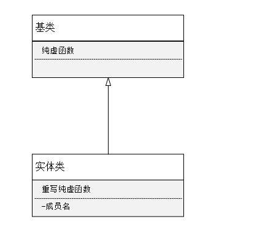

# 场景

如果一个 `dll`要给第三方使用，就需要给一个头文件，一个`dll`，但是又不想暴露内部数据成员，那么就可以再添加一个纯虚接口的类，然后把自己的类继承自这个类，实现里面的纯虚函数，这样，给到第三方的就只是一个拥有一系列的纯虚函数的头文件了，很好的实现了隐藏。

# `UML`



大概类似这样，对外暴露的就是【基类】，真正实现的就是【实体类】


# 代码

一个工程拥有两个子工程：

* 一个 `dll`工程，叫`DllDemo`
* 一个调用 `dll`的工程叫`MainConsole`


## `DllDemo`工程


~~~c++
//dlldemo.h
#ifndef DLLDEMO_H
#define DLLDEMO_H

#include "DllDemo_global.h"

class DLLDEMO_EXPORT DllDemo
{
public:
    DllDemo();
};

#endif // DLLDEMO_H
~~~

`DllDemo`工程主要是第三方使用，所以，如果我直接在 `class DllDemo` 中增加成员和接口，那么势必会暴露我的这一个类设计，**这就属于没有封装好了**

> # 封装
>
>  封装，即**隐藏对象的属性和实现细节，仅对外公开接口**，控制在程序中属性的读和修改的访问级别；将抽象得到的数据和行为（或功能）相结合，形成一个有机的整体，也就是将[数据](https://baike.baidu.com/item/数据/5947370)与操作数据的[源代码](https://baike.baidu.com/item/源代码/3814213)进行有机的结合，形成“类”，其中数据和函数都是类的成员。
>
> 封装将复杂模块或系统的逻辑实现细节隐藏，让使用者只需要关心这个模块或系统怎么使用，而不用关心这个模块或系统是怎么实现的。在面向对象的的编程中，我们一般通过接口来描述某个系统或模块具体什么功能，然后再通过继承或者其它方式实现这个接口（隐藏实现细节）
>
> 只关心怎么使用，那就让他只关心怎么使用到底，全部给接口去调用就好了

比如：

~~~c++
//dlldemo.h
#ifndef DLLDEMO_H
#define DLLDEMO_H

#include "DllDemo_global.h"

class DLLDEMO_EXPORT DllDemo
{
public:
    DllDemo();
    
private:
    int a;
};

#endif // DLLDEMO_H
~~~

这里，我添加了一个 `int a`，那么会有两个方面的问题

* 如果别人正在使用，那就需要将`.h`和 `dll`均升级，才可以升级使用
* 使用者还需要完全重新编译，因为类的空间存储结构变了，所以需要重新编译才行

这样就导致使用很麻烦

所以这就需要将类里面的接口，提取出来，形成一个纯虚接口的类

所以，修改后的类的，增加一个接口作为演示

所以现在的程序结构


类

~~~c++
#ifndef ABSTRACTDLLDEMO_H
#define ABSTRACTDLLDEMO_H

#include "DllDemo_global.h"

class DLLDEMO_EXPORT IAbstractDllDemo
{
public:
    IAbstractDllDemo();
    virtual ~IAbstractDllDemo();

    virtual void print() = 0;
};

// 这里因为需要调用一个接口来显示，所以，增加一个全局获取单例的接口作为测试
DLLDEMO_EXPORT IAbstractDllDemo* GetDllDemoInstance();

#endif // ABSTRACTDLLDEMO_H
~~~

```c++
// dlldemo.h
#ifndef DLLDEMO_H
#define DLLDEMO_H

#include "abstractdlldemo.h"

class DllDemo : public IAbstractDllDemo
{
public:
    static DllDemo& GetInstance();

public:
    DllDemo();
    ~DllDemo();

    // AbstractDllDemo interface
public:
    void print() override;
};

#endif // DLLDEMO_H

// cpp
#include "dlldemo.h"
#include <QDebug>

// 实现这个单例接口，通过他来调用单例，从而再次达到隐藏的目的
IAbstractDllDemo* GetDllDemoInstance()
{
    return &DllDemo::GetInstance();
}

DllDemo& DllDemo::GetInstance()
{
    static DllDemo demo;
    return demo;
}

DllDemo::DllDemo()
{
}

DllDemo::~DllDemo()
{
}

void DllDemo::print()
{
    qDebug() << __FILE__ << __FUNCTION__;
}

```


## `MainConsole ` 工程


`pro` 文件肯定要添加引用咯，我是直接添加的，因为做测试，没有把 `dll` 和 `.h` 输出和复制到对应的路径下面去


代码

~~~c++
#include <QCoreApplication>

// 只是给了对外的接口
#include "../DllDemo/abstractdlldemo.h"

int main(int argc, char *argv[])
{
    QCoreApplication a(argc, argv);

    // 封装了 dll 真正的实现
    GetDllDemoInstance()->print();

    return a.exec();
}
~~~

输出结果


# 结论

虽然对编写代码的时候，是会有一定的难度，而且代码的量变大了，但是，后期维护的时候，或者对外使用的时候，是很方便的


# 延展

## 和 `PIMPL` 对比

### [`PIMPL`](https://github.com/GuidoLuo0521/Blog/blob/master/%E7%BC%96%E7%A8%8B/%E8%AE%BE%E8%AE%A1%E6%A8%A1%E5%BC%8F/PIMPL.md)


《effective C++》 条款31：将文件间的编译关系降至最低

`PIMPL ` 主要是讲编译关系降到最低，提升编译效率和使用的效率，如果修改一个文件之后，需要重新编译，那么就会造成时间的浪费。主要是一个工程的使用，和编译维护。

### 这种设计模式

主要是第三方的使用方便，升级的方便，指更新 `dll` 就可以了


### 对比和相同

#### 对比

* ### 主要用途不同

  * `PIMPL ` 主要是针对自己的使用和编译，程序的编译阶段
  * 抽象技术，主要是第三方使用的方便

* #### 实现方式不同

  * `PIMPL ` 通过采用定义私有指针，然后通过私有指针来调用实现函数
  * 抽象技术  通过继承，实现虚接口实现

* #### 使用的地方不同

  * `PIMPL` 如果需要很多类都需要给第三方，那就可以用这个实现隐藏

    ~~~c++
    // 好比我有 Person 基类
    // 子类 有 Worker, Teacher, Employers
    
    // main.cpp
    int main()
    {
        Person * worker = new Worker;
        Person * worker = new Teacher;
        Person * worker = new Employers;
    }
    
    // 这种情况下，我需要明确的知道子类是什么的情况下，就没办法了，也需要给子类的头文件了
    // 所以，这时候就可以采用 PIMPL 技术，使用前置声明，这样就不会暴露了
    // Person.h
    
    #ifndef PERSON_H_
    #define PERSON_H_
    #include <memory>
    
    struct PersonImpl;
    struct Person
    {
      Person()
      void print()
    protected:// 只允许子类赋值
        Person(std::shared_ptr<PersonImpl> impl)
     private:
      std::shared_ptr<PersonImpl> pImpl;
    };
    
    struct WorkerImpl;	// WorkerImpl 继承自 PersonImpl
    struct Worker : public Person
    {
        Worker() : Person(new WorkerImpl)
      	void print();
    };
    
    // or
    struct WorkerImpl;
    struct Worker
    {
      void print();
     private:
      std::shared_ptr<WorkerImpl> pImpl;
    };
    #endif
    int main()
    {
        Person * worker = new Worker;
        Person * worker = new Teacher;
        Person * worker = new Employers;
    }
    ~~~

    * 抽象技术   单个类的实现的时候，可以采用，就好比举例子的单例模式封装

* #### 层面

  * `PIMPL` 上升到二进制的层面
  * 抽象接口 没有上升到二进制层面

* ### 跨平台

  * `PIMPL` 也可实现跨平台的使用
  * 抽象接口也可跨平台方便

#### 相同

其实思想应该都是差不多的，就是将实现用另外的类来实现，达到封装的目的


# 参考

## [桥接模式（别名Handle/Body）、与接口、抽象接口](https://blog.csdn.net/yockie/article/details/52628842)

在C++中封装的概念是把一个对象的外观接口同实际工作方式（实现）分离开来，但是C++的封装是不完全的，编译器必须知道一个对象的所有部分的声明，以便创建和管理它。我们可以想象一种只需声明一个对象的公共接口部分的编程语言，而将私有的实现部分隐藏起来。C + +在编译期间要尽可能多地做静态类型检查。这意味着尽早捕获错误，也意味着程序具有更高的效率。然而这对私有的实现部分来说带来两个影响：一是即使程序员不能轻易地访问实现部分，但他可以看到它；二是造成一些不必要的重复编译。

 然而C++并没有将这个原则应用到二进制层次上，这是因为C++的类既是描述了一个接口同时也描述了实现的过程,示例如下：

```c++
class CMyString
    {
    private:
        const int m_cch;
        char *m_psz;
    public:
        CMyString(const char *psz);
        ~CMyString();
        int Length() const;
        int Index(const char *psz) const;
    }
```

`CMyStirng`对外过多的暴露了内存布局实现的细节，这些信息过度的依赖于这些成员变量的大小和顺序，从而导致了客户过度依赖于可执行代码之间的二进制耦合关系，这样的接口不利于跨语言跨平台的软件开发和移植。

 

###  **Handle-Body** 模式

解决这个问题的技术叫句柄类（ handle classes）。有关实现的任何东西都消失了，只剩一个单一的指针“**m_pThis**”。该指针指向一个结构，该结构的定义与其所有的成员函数的定义一样出现在实现文件中。这样，只要接口部分不改变，头文件就不需变动。而实现部分可以按需要任意更动，完成后只要对实现文件进行重新编译，然后再连接到项目中。

  这里有这项技术的简单例子。头文件中只包含公共的接口和一个简单的没有完全指定的类指针。

```c++
class CMyStringHandle
    {
    private:
        class CMyString；
        CMyString *m_pThis;
    public:
        CMyStringHandle (const char *psz);
        ~ CMyStringHandle ();
        int Length() const;
        int Index(const char *psz) const;
    }；
    CMyStringHandle:: CMyStringHandle(const char *psz)
    :m_pThis(new CMyString(psz));
    {
    }
    CMyStringHandle::~ CMyStringHandle()
    {
         delete m_pThis;
    }
    int CMyStringHandle::Length()
    {
        return m_pThis->Length();
    }
    int CMyStringHandle::Index(const char *psz)
    {
     return m_pThis->Index(psz);
    }
```


这是所有客户程序员都能看到的。这行

`   class CMyString;`

是一个没有完全指定的类型说明或类声明（一个类的定义包含类的主体）。它告诉编译器，`cheshire` 是一个结构的名字，但没有提供有关该结构的任何东西。这对产生一个指向结构的指针来说已经足够了。但我们在提供一个结构的主体部分之前不能创建一个对象。在这种技术里，包含具体实现的结构主体被隐藏在实现文件中。

在设计模式中，这就叫做Handle-Body 模式，**Handle-Body**只含有一个实体指针，服务的数据成员永远被封闭在服务系统中。

Handle-Body模式如下：


**Handle-Body**的布局结构永远不会随着实现类数据成员的加入或者删除或者修改而导致**Handle-Body**的修改，即**Handle-Body**协议不依赖于C++实现类的任何细节。这就有效的对用户的编译器隐藏了这些斜街，用户在使用对这项技术时候，**Handle-Body** 接口成了它唯一的入口。

然而**Handle-Body**模式也有自己的弱点：

1、接口类必须把每一个方法调用显示的传递给实现类，这在一个只有一个构造和一个析构的类来说显然不构成负担，但是如果一个庞大的类库，它有上百上千个方法时候，光是编写这些方法传递就有可能非常冗长，这也增加了出错的可能性。

2、对于关注于性能的应用每一个方法都得有两层的函数调用，嵌套的开销也不理想

3、由于句柄的存在依然存在编译连接器兼容性问题。

接口和实现分离的Handle-Body。

### **抽象接口**

使用了“接口与实现的分离”技术的 **Handle-Body** 解决了编译器/链接器的大部分问题，而C++面向对象编程中的抽象接口同样是运用了“接口与实现分离”的思想，而采用抽象接口对于解决这

类问题是一个极其完美的解决方案。

1、抽象接口的语言描述：

```c++
class IMyString
{
    virtual int Length() const = 0;  //这表示是一个纯虚函数，具有纯虚函数的接口
    virtual int Index(const char *psz) const = 0;
}；
```

2.抽象接口的内存结构


3.抽象接口的实现代码：

```c++
//接口：
class IMyString
{
            virtual int Length() const = 0;  //这表示是一个纯虚函数，具有纯虚函数的接口
            virtual int Index(const char *psz) const = 0;
}；

//实现：
class CMyString：public IMyString
    {
    private:
        const int m_cch;
        char *m_psz;
    public:
        CMyString(const char *psz);
        virtual ~CMyString();
        int Length() const;
        int Index(const char *psz) const;
    }
```

从上面采用抽象接口的实例来看，抽象接口解决了Handle-Body所遗留下来的全部缺陷。

抽象接口的一个典型应用：

抽象工厂（`AbstractFactroy`）


