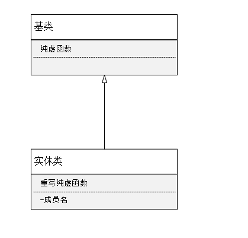
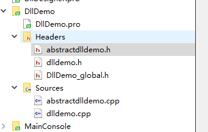
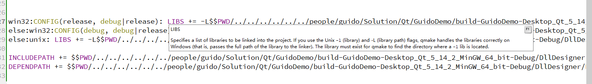
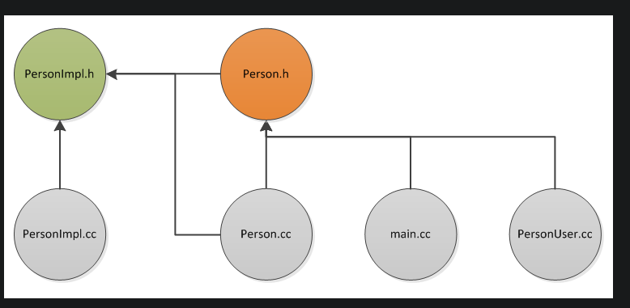
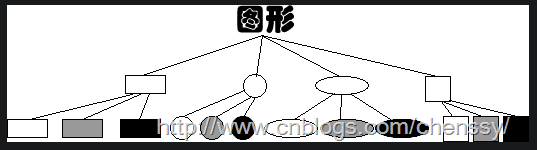
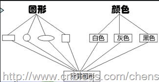
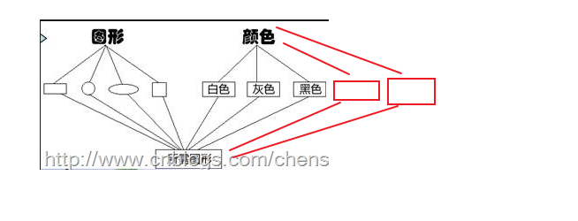

# 场景

如果一个 `dll`要给第三方使用，就需要给一个头文件，一个`dll`，但是又不想暴露内部数据成员，那么就可以再添加一个纯虚接口的类，然后把自己的类继承自这个类，实现里面的纯虚函数，这样，给到第三方的就只是一个拥有一系列的纯虚函数的头文件了，很好的实现了隐藏。

# `UML`



大概类似这样，对外暴露的就是【基类】，真正实现的就是【实体类】


# 代码

一个工程拥有两个子工程：

* 一个 `dll`工程，叫`DllDemo`
* 一个调用 `dll`的工程叫`MainConsole`


## `DllDemo`工程


~~~c++
//dlldemo.h
#ifndef DLLDEMO_H
#define DLLDEMO_H

#include "DllDemo_global.h"

class DLLDEMO_EXPORT DllDemo
{
public:
    DllDemo();
};

#endif // DLLDEMO_H
~~~

`DllDemo`工程主要是第三方使用，所以，如果我直接在 `class DllDemo` 中增加成员和接口，那么势必会暴露我的这一个类设计，**这就属于没有封装好了**

> # 封装
>
>  封装，即**隐藏对象的属性和实现细节，仅对外公开接口**，控制在程序中属性的读和修改的访问级别；将抽象得到的数据和行为（或功能）相结合，形成一个有机的整体，也就是将[数据](https://baike.baidu.com/item/数据/5947370)与操作数据的[源代码](https://baike.baidu.com/item/源代码/3814213)进行有机的结合，形成“类”，其中数据和函数都是类的成员。
>
> 封装将复杂模块或系统的逻辑实现细节隐藏，让使用者只需要关心这个模块或系统怎么使用，而不用关心这个模块或系统是怎么实现的。在面向对象的的编程中，我们一般通过接口来描述某个系统或模块具体什么功能，然后再通过继承或者其它方式实现这个接口（隐藏实现细节）
>
> 只关心怎么使用，那就让他只关心怎么使用到底，全部给接口去调用就好了

比如：

~~~c++
//dlldemo.h
#ifndef DLLDEMO_H
#define DLLDEMO_H

#include "DllDemo_global.h"

class DLLDEMO_EXPORT DllDemo
{
public:
    DllDemo();
    
private:
    int a;
};

#endif // DLLDEMO_H
~~~

这里，我添加了一个 `int a`，那么会有两个方面的问题

* 如果别人正在使用，那就需要将`.h`和 `dll`均升级，才可以升级使用
* 使用者还需要完全重新编译，因为类的空间存储结构变了，所以需要重新编译才行

这样就导致使用很麻烦

所以这就需要将类里面的接口，提取出来，形成一个纯虚接口的类

所以，修改后的类的，增加一个接口作为演示

所以现在的程序结构



类

~~~c++
#ifndef ABSTRACTDLLDEMO_H
#define ABSTRACTDLLDEMO_H

#include "DllDemo_global.h"

class DLLDEMO_EXPORT IAbstractDllDemo
{
public:
    IAbstractDllDemo();
    virtual ~IAbstractDllDemo();

    virtual void print() = 0;
};

// 这里因为需要调用一个接口来显示，所以，增加一个全局获取单例的接口作为测试
DLLDEMO_EXPORT IAbstractDllDemo* GetDllDemoInstance();

#endif // ABSTRACTDLLDEMO_H
~~~

```c++
// dlldemo.h
#ifndef DLLDEMO_H
#define DLLDEMO_H

#include "abstractdlldemo.h"

class DllDemo : public IAbstractDllDemo
{
public:
    static DllDemo& GetInstance();

public:
    DllDemo();
    ~DllDemo();

    // AbstractDllDemo interface
public:
    void print() override;
};

#endif // DLLDEMO_H

// cpp
#include "dlldemo.h"
#include <QDebug>

// 实现这个单例接口，通过他来调用单例，从而再次达到隐藏的目的
IAbstractDllDemo* GetDllDemoInstance()
{
    return &DllDemo::GetInstance();
}

DllDemo& DllDemo::GetInstance()
{
    static DllDemo demo;
    return demo;
}

DllDemo::DllDemo()
{
}

DllDemo::~DllDemo()
{
}

void DllDemo::print()
{
    qDebug() << __FILE__ << __FUNCTION__;
}

```


## `MainConsole ` 工程


`pro` 文件肯定要添加引用咯，我是直接添加的，因为做测试，没有把 `dll` 和 `.h` 输出和复制到对应的路径下面去



代码

~~~c++
#include <QCoreApplication>

// 只是给了对外的接口
#include "../DllDemo/abstractdlldemo.h"

int main(int argc, char *argv[])
{
    QCoreApplication a(argc, argv);

    // 封装了 dll 真正的实现
    GetDllDemoInstance()->print();

    return a.exec();
}
~~~

输出结果


# 结论

虽然对编写代码的时候，是会有一定的难度，而且代码的量变大了，但是，后期维护的时候，或者对外使用的时候，是很方便的


# 延展

## 和 `PIMPL` 对比

### [`PIMPL`](https://github.com/GuidoLuo0521/Blog/blob/master/%E7%BC%96%E7%A8%8B/%E8%AE%BE%E8%AE%A1%E6%A8%A1%E5%BC%8F/PIMPL.md)



《effective C++》 条款31：将文件间的编译关系降至最低

`PIMPL ` 主要是讲编译关系降到最低，提升编译效率和使用的效率，如果修改一个文件之后，需要重新编译，那么就会造成时间的浪费。主要是一个工程的使用，和编译维护。

### 这种设计模式

主要是第三方的使用方便，升级的方便，指更新 `dll` 就可以了


### 对比和相同

#### 对比

* ### 主要用途不同

  * `PIMPL ` 主要是针对自己的使用和编译，程序的编译阶段
  * 抽象技术，主要是第三方使用的方便

* #### 实现方式不同

  * `PIMPL ` 通过采用定义私有指针，然后通过私有指针来调用实现函数
  * 抽象技术  通过继承，实现虚接口实现

* #### 使用的地方不同

  * `PIMPL` 如果需要很多类都需要给第三方，那就可以用这个实现隐藏

    ~~~c++
    // 好比我有 Person 基类
    // 子类 有 Worker, Teacher, Employers
    
    // main.cpp
    int main()
    {
        Person * worker = new Worker;
        Person * worker = new Teacher;
        Person * worker = new Employers;
    }
    
    // 这种情况下，我需要明确的知道子类是什么的情况下，就没办法了，也需要给子类的头文件了
    // 所以，这时候就可以采用 PIMPL 技术，使用前置声明，这样就不会暴露了
    // Person.h
    
    #ifndef PERSON_H_
    #define PERSON_H_
    #include <memory>
    
    struct PersonImpl;
    struct Person
    {
      Person()
      void print()
    protected:// 只允许子类赋值
        Person(std::shared_ptr<PersonImpl> impl)
     private:
      std::shared_ptr<PersonImpl> pImpl;
    };
    
    struct WorkerImpl;	// WorkerImpl 继承自 PersonImpl
    struct Worker : public Person
    {
        Worker() : Person(new WorkerImpl)
      	void print();
    };
    
    // or
    struct WorkerImpl;
    struct Worker
    {
      void print();
     private:
      std::shared_ptr<WorkerImpl> pImpl;
    };
    #endif
    int main()
    {
        Person * worker = new Worker;
        Person * worker = new Teacher;
        Person * worker = new Employers;
    }
    ~~~

    * 抽象技术   单个类的实现的时候，可以采用，就好比举例子的单例模式封装

* #### 层面

  * `PIMPL` 上升到二进制的层面
  * 抽象接口 没有上升到二进制层面

* ### 跨平台

  * `PIMPL` 也可实现跨平台的使用
  * 抽象接口也可跨平台方便


* ### 倾向性

  * <font color=red>`PIMLP`倾向于表述类和类之前编译的耦合性 </font>

  * <font color=red>桥接模式，倾向于功能维度上的变化</font>

    > 可参考    ----   [桥接模式](https://www.runoob.com/w3cnote/bridge-pattern2.html)


#### 相同

其实思想应该都是差不多的，就是将实现用另外的类来实现，达到封装的目的


# 再谈桥接和`PIMPL`模式

## 功能

桥接模式更多侧重与对于功能的扩展和组合，如类与类之间的关系，泛化，实现，观念，聚合，组合，依赖

桥接模式可能更多的是一种组合的关系

<font size=9>**几个类的功能组合成一种新的类，而非每个类去实现所有功能**</font>

## 例子

拿下面的参考中的例子说明，绘图（S）和上色（C）

要绘制图形：长方形，正方形，圆形，

要上色颜色：红色，绿色，黄色

那么目前就有两种实现的方案

* 所有图形，每个图形都绘制一个颜色那么就是  `3S * 3C ` = 9

  

* 图形和颜色进行组合 `3S + 3C` = 6

  


### 扩展

如果这时候，我要增加图形n个和颜色m个，那么两种设计方案的优劣性就显示出来了

#### 第一种 全部都绘制

> 所有图形，每个图形都绘制一个颜色那么就是  `3S * 3C ` = 9

那么就是 (3 + n) * (3+m) 个图形绘制方式，而且还需要去更改已经写好的类，这是不理智，而且不符合设计规范的，写好的类最好不要去碰他

#### 第二种，组合方式

> 图形和颜色进行组合 `3S + 3C` = 6

我只需要再添加图形和颜色就可以了，原来的工程可以不用动，类多继承一个就可以了




## 总结

桥接模式，是维度上的增加，靠的就是一个组装来节省扩展和修改的成本

某物的实现（“主体”）通过间接级别（“句柄”）与其接口分离。客户端代码对句柄进行操作，然后对主体进行操作

可看 【`ShapeDllDemo`】


# 参考

## [桥接模式（别名Handle/Body）、与接口、抽象接口](https://blog.csdn.net/yockie/article/details/52628842)

## [桥接模式 - W3](https://www.runoob.com/w3cnote/bridge-pattern2.html)

## [HandleBodyPattern](https://wiki.c2.com/?HandleBodyPattern)
