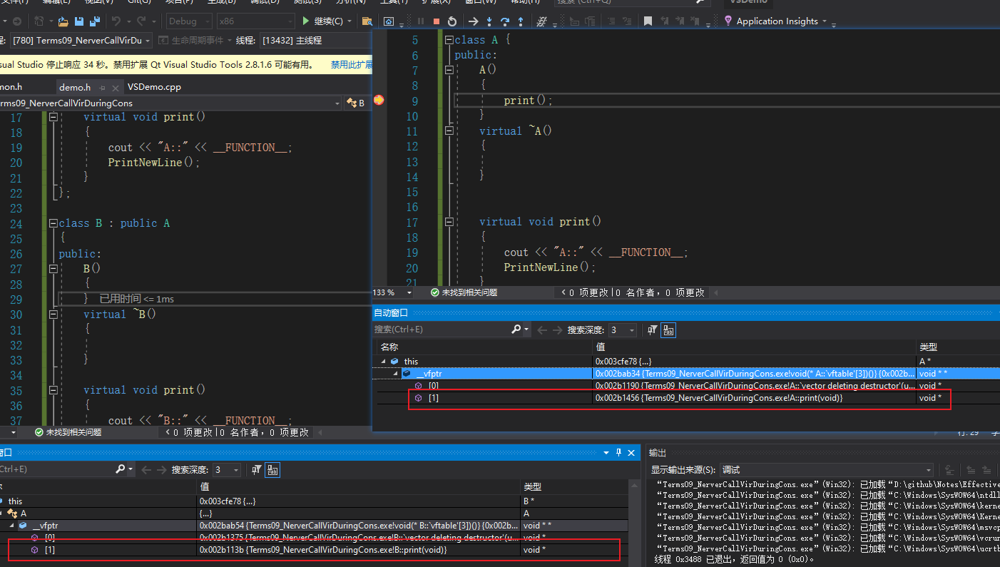
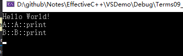
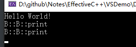
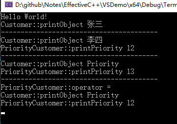
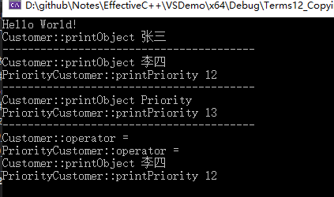

> 记录阅读过程中的摘录和理解

# 让自己习惯`C++`

## 条款1  视C++为一个语言联邦

今天的C++是一个 **多重范型编程语言** ，一个同时支持 **过程形式，面向对象形式，函数形式，泛型形式，元编程形式** 的语言

过多的支持导致了用法的不确定性，所有的路都可以走通，怎么选择就是最大的问题了。如何选择才最适合。

最简单的方法就是，将C++视为一个 **由相关语言组成的联邦而非单一的语言，在其某个次语言中，各种守则与通例都倾向简单，直观易懂，并且容易记住，当从一个次语言移往另一个次语言，守则可能改变**

### C++ 的次语言分类

* C
* Object-Oriented C++
* Template c++
* STL

### C

说到底，C++ 仍然是以C为基础

> 区块： `｛｝`包括起来
>
> 语句：`；`结束
>
> 预处理器： `##define`
>
> 内置数据类型： `int`，`bool`
>
> 数组：` [ ]` 
>
> 指针： `* `
>
> 。。。

上面这一部分，都是来自 C，所以很多时候，C++的问题不过就是高级一点的 C 的解法。

所以，当用 C 的成分来工作的时候，高效编程守则就映照出 **C 语言的局限，没有模板，没有异常，没有重载...**

### Object-Oriented C++  

面向对象

这部分就是 C with class 所诉求的，classes（构造函数和析构函数）

> 封装：将数据成员隐藏
>
> 继承：子类获取父类的方法，成员等
>
> 多态：不同数据类型的实体提供统一的接口，
>
> virtual函数（动态绑定：就是运行到的时候，才指向）
>
> 。。。

这一部分，是面向对象设计之古典守则在C++上的最直接实施。

### Template C++

C++ 的泛型编程

> 发明一种语言机制，能够帮助实现一个通用的标准容器库。所谓通用的标准容器库，就是要能够做到，比如用一个[List](https://baike.baidu.com/item/List/4825101)类存放所有可能类型的对象这样的事；泛型编程让你编写完全一般化并可重复使用的算法，其效率与针对某特定数据类型而设计的算法相同。泛型即是指具有在多种[数据类型](https://baike.baidu.com/item/数据类型/10997964)上皆可操作的含义，与模板有些相似。`STL`巨大，而且可以扩充，它包含很多计算机基本算法和[数据结构](https://baike.baidu.com/item/数据结构/1450)，而且将算法与数据结构完全分离，其中算法是泛型的，不与任何特定数据结构或对象类型系在一起。

Template 的相关考虑与设计已经弥漫整个 C++ ,良好的守则中，唯 template 适用的条款并不罕见（条款 46）。

由于 Template 的威力强大，他们带来崭新的编程范型，也就是（`TMP`，模板元编程），`TMP`相关的规则很少与C++主流编程互相影响。

### `STL`

`STL`是一个 ` template ` 程序库

他对 容器（ containers），迭代器（iterators），算法（algorithms）以及函数对象（function objects）的约束有极佳的紧密配合与协调，然而 template 及程序库也可以用其他的想法构建出来。`STL`有自己的办事方式，所以要用他的时候，就自己遵守它的规定。、

### 总结

所以，当在上面四个类型切换的时候，要变换策略

* 内置类型（ **C**）值传递比引用传递更高效，
* 从 **C**到 **Object-Oriented C++**的时候，由于用户自定义构造函数和析构函数的存在，`const` 的引用传递（`pass by reference to const` ）更好，运用 Template C++ 的时候尤其如此，因为到时候，不知道处理的是什么类型。
* 当跨入 `STL`的时候，你又会了解到，迭代器和函数对象都是在 C 指针上塑造出来的，所以，对 `STL`的迭代器和函数对象而言，旧式的 C `pass by value`守则再次适用。

**所以，守则就是在这四个类型上面切换策略。**

## 条款2 尽量以 `const`，`enum`，` inline`替换 `##define`

这个条款或许改成  **宁可以编译器替换预处理器**

因为， `##define` 不被视为语言的一部分，这正是问题所在。所以，当定义一个宏

~~~c++
##define ASPECT_RATIO 1.63
~~~

 记号名称 `ASPECT_RATIO` 也许从未被编译器看见；也许在编译器开始处理源代码之前它就被预处理器移走了。于是，`ASPECT_RATIO` 可能就没有进入记号表`sysbol table`。于是，在运用此常量，但是又获得一个编译错误信息的时候，就可能会带来疑惑，因为这错误提到的是 `1.63` 而非 `ASPECT_RATIO` ，但是又对此记号毫无概念，那么查找的时候就会很麻烦，从而浪费时间。

​	解决方法以一个常亮替换上面的宏

~~~c++
const double ASpectRation = 1.63;
~~~

所以，作为一个常量，那就肯迪会被记号表看到。

### **以常量替换 `##define` 的两种特殊情况**

* 定义常量指针

  > 因为常量指针通常放在头文件中，所以如果要在头文件中写常量指针，最好写两次
  >
  > ~~~c++
  > const char* const author = "guido";
  > // 更好的是
  > const std::string author = "guido";
  > ~~~
  >
  > 

* `class` 专属常量

  > 要将常量的作用域（scope）限制在`class`之中，那必须让它成为 `class` 的一个成员
  >
  > ~~~c++
  > // .h
  > class GamePlayer
  > {
  >     private:
  >     static const int NumTurns = 5; // 常量声明，而非定义，就是说明，此时还没有给内存空间。
  >     int m_scores[NumTurns]; // 使用常量
  > }
  > //.cpp
  > const int GamPlayer::NumTurns;	// 常量定义，就是要内存空间了。因为声明的时候有值了，所以，此时就可以不设初值了
  > ~~~
  >
  > ！！！ 但是，没办利用 `##define` 为 `class` 创建一个专属常量，因为 `##define` 不重视作用域（scope）
  >
  > 一旦被定义，他就在其后的编译过程中有效（除非 `##undef`），所以，`##define` 不具备封装性。而 `const` 是可以被封装的。

### 需要在 `class` 编译期间知道一个 `class` 常量值怎么办

因为有的编译器不支持 `in class 初值设定`，那么上面的定义 `static const int NumTurns = 5;` 就获取不了这个值了。。

也有替换方式，使用 `enum`

~~~c++
// .h
class GamePlayer
{
    private:
    enum { NumTurns = 5 };	// the enum hack
    int m_scores[NumTurns]; // 使用常量
}
//.cpp
const int GamPlayer::NumTurns;	// 常量定义，就是要内存空间了。因为声明的时候有值了，所以，此时就可以不设初值了
~~~

### `enum hack`

**好处** 

* 不能对 `enum` 常量值取地址，所以，别人不能更改，如果使用 pointer 或 reference，那就可能被别人使用取地址，更换值。造成错误
* 实用主义，其他别人用到了，所以必须认识它。
* 是 `template metaprogramming`（模板元编程）的基础技术（条款48）

### 宏函数

虽然，宏函数没有调用开销，但是，带参数的宏错误的可能性却很大

~~~c++
// 以 a 和 b 的较大值调用 f
##define CALL_WITH_MAX(a, b) f((a) > (b) ? (a) : (b))

// 情况
int a = 5, b = 0;
CALL_WITH_MAX( ++a, b); 			// a 被累加两次
CALL_WITH_MAX( ++a, b + 10); 		// a 被累加一次
~~~

所以，上面的情况就可能出错，那么更好的替换的情况就是， **使用模板函数来替换** 就可以获得同等的效率和安全性

`template inline` （条款30）

~~~c++
template<typename T>
inline void callWithMax(const T& a, const T& b)
{
    f( a > b ? a : b );
}
~~~

有了 `consts`，`enums`和 `inlines`，我们对预处理器（特别是`##define`）的需求降低了，但并非完全消除。

`##include ` 任然是必需品，而`##indef / ##ifndef`也继续扮演 **控制编译** 的重要角色

### 总结

* 对于单纯常量，最好使用 `const`对象或 `enums` 替换 `##defines`
* 对于形似函数的宏`macros`，最好改用 `inline`函数替换 `##define`

## 条款3	尽可能使用`const`

`const` 允许你指定一个语义约束（即，指定一个不该改动的对象），而编译器会强制实施这项约束。它允许你告诉编译器和其他程序员，某值应该保持不变。只要某值保持不变是事实，那么，就应该明确的说出来，因为，说出来就可以获得编译器的帮助，确保这条约束不被违反。

`const`可以修饰的东西太多了

*  指针
* 数值
* 函数
* 。。。

虽然使用的很多，但是并不高深。法则如下

* 如果关键字 `const` 出现在星号的左边，表示被指物是常量
* 如果关键字 `const` 出现在星号的右边，则表示指针自身是常量。（这就话就是，出现在右边的只有指针咯，函数也算指针~~）
* 如果两边都出现，那就是物和指针都是常量

> 如果物是常量，有两种写法
>
> ~~~c++
> void f1( const Widget* pw);		// f1 获得一个指针，指向一个常量的 Widget 对象
> void f2( Widget const * pw);	// f2 一样
> ~~~
>
> 那就是看 `const` 后面跟的是什么
>
> ~~~c++
> 第一个 const 后面是 Widget ;
> 第二个 const 后面是 *pw;			都表示一个对象
> 还是第一条法则，如果关键字 `const` 出现在星号的左边，表示被指物是常量
> ~~~

### `STL` 迭代器

`stl` 迭代器系列，就是以指针为根据塑造出来的，所以，迭代器的作用就像 `T*`指针。

声明迭代器为 `const` 就像声明指针为 `const` 一样（即，声明一个 `T* const `）, 表明，这个指针不能更改，但是，指针指向的对象可以更改。

如果，希望迭代器所指的东西不可被改动（即：一个 `const T*` 指针），那就可以用 `const_iterator`

~~~c++
std::vector<int> vec;
const std::vector<int>::iterator iter = vec.begin();	// 声明迭代器为 const ，指针不能更改，指向内容可以更改
*iter = 10;		// 正确
++iter;			// 错误

std::vector<int>::const_iterator citer = vec.begin(); // 声明一个常量迭代器，说明，迭代器可更改，但是指向内容不可更改
*citer = 10;	// 错误	
++citer;		// 正确
~~~

### `const` 成员函数

两个重要的理由

* 使得 `class` 接口比较容易理解，得知哪个函数可以改变内容，哪个函数不可以改变内容。
* 使操作 `const` 对象成为可能。

**如果两个成员函数只是常量性不同，是可以被重载的，这也是c++的一大特性。**

~~~c++
class TextBlock {
    public : 
	    const char& operator [] (std::size_t position) const { return text[position]; }  // 重载 [] 为一个 const 对象	
    	char& operator [] (std::size_t position) const { return text[position]; }		// 重载 [] 为一个非 const 对象 ( non-const ) 
    private:
    	std::string text;
}

// 例子 1
fun()
{
    TextBlock ta("Hello");
    std::cout << ta[0];	 	// 调用的是 non-const
    ta[0] = 'j';		// 可以，因为返回的是 non-const
    
    const TextBlock tb("World");
    std::cout << tb[0];		// 调用的是 const
    tb[0] = 'j';		// 错误，因为返回的是 const
}
~~~

最后写一个，可以在 `const` 成员函数内部更改值的方式

~~~c++
// .h
class TextBlock {
    public : 
	    const char& operator [] (std::size_t position) const { return text[position]; }  // 重载 [] 为一个 const 对象	
    	char& operator [] (std::size_t position) const { return text[position]; }		// 重载 [] 为一个非 const 对象 ( non-const ) 
    
    	std::size_t length() const;
    private:
    	std::string text;
    	mutable std::size_t textLength;		// 这个修饰的成员变量，总能在 const 函数内被修改
}

// .cpp
std::size_t length() const
{
    // 这里只做演示，真实情况自己判定，仅仅为了演示关键字  mutable 
    textLength = 10;
    return textLength;
}
~~~

感觉后面的对实际开发的意义就不大了~~，就不写了，下面总结最后一条会写到。

### 总结

* 尽可能使用 `const`来帮助编译器侦测出错误， `const ` 可被施加于任何作用域内的对象，函数参数，函数返回类型，成员函数本体。
* 当 `const`和 `non-const `成员函数有着实质等价的实现的时候，令 `non-const` 版本调用 `const` 版本可避免代码重复。

## 条款4  确定对象使用前已被初始化

### 常规初始化

对于部分编译器，可能程序并不会初始化，**你可以永远相信宋义进，但是永远不要相信编译器**

~~~c++
int a;
~~~

这种，声明了，但是也可能没有初始化，这就会导致程序运行错误。

**所以，无论何时，变量都初始化是最好的。**

* 对于内置类型，手动初始化

  > ~~~c++
  > int a = 0;
  > const char* text = "abc";
  > 
  > double b;
  > std::cin >> b;
  > ~~~
  >
  > 

* 对于自定义类型，构造的时候初始化

  > ~~~c++
  > class PhoneNumber{};
  > class ABEntry {
  > public: 
  >     ABEntry(const std::string& name, const std::& address, const std::list<PhoneNumber>& phones);
  > 
  > private: 
  >     std::string m_name;
  >     std::string m_address;
  >     std::list<PhoneNumber> m_phones;
  >     int m_numTimesConsulted;
  > }
  > 
  > ABEntry::ABEntry(const std::string& name, const std::& address, const std::list<PhoneNumber>& phones)
  > {
  >     m_name = name;	// 赋值
  >     m_address = address;
  >     m_phones = phones;
  >     m_numTimesConsulted = 0;
  > }
  > ~~~
  >
  > 上述会导致成员变量带我期望的值，但是并不是最佳的做法。因为不是被初始化，而是被赋值
  >
  > **C++规定，对象的成员变量的初始化动作发生在进入构造函数本体之前**
  >
  > 初始化的发生时间是在这些**成员变量的默认构造（default）**被调用的时候。
  >
  > 所以，最好的做法是增加初始化列表（initialization list）
  >
  > ~~~c++
  > ABEntry::ABEntry(const std::string& name, const std::& address, const std::list<PhoneNumber>& phones)
  >     ： m_name(name)	// 初始化
  >     ， m_address(address)
  >     ,  m_phones(phones)
  >     ,  m_numTimesConsulted(0)
  > {
  >     // m_name = name;	// 赋值
  >     // m_address = address;
  >     // m_phones = phones;
  >     // m_numTimesConsulted = 0;
  > }
  > ~~~
  >
  > 下面这一版本的效率比上面高，因为上面会调用默认构造，然后再进行赋值，而下面的就调用赋值（拷贝）构造
  >
  > 当我们构造也没有参数的时候，也最好调用一下，赋一个初值。
  >
  > ~~~c++
  > ABEntry::ABEntry(const std::string& name, const std::& address, const std::list<PhoneNumber>& phones)
  >     ： m_name()	// 初始化
  >     ， m_address()
  >     ,  m_phones()
  >     ,  m_numTimesConsulted(0)
  > {
  > }
  > ~~~

  

### 不同编译单元内定义的非本地静态对象

  解释一下上面这句话

  * 不同编译单元：编译的时候每个`cpp`生成的` .obj `文件
  * 非本地的：就是不同的 `cpp` 之间的调用

  代码解释，比如有一个文件系统的类，这个肯定是一个单例的类了，全局只有一个

  ~~~c++
  // 
  class FileSystem {
  public:
      std::size_t numDisk() const;    
  };
  
  extern FileSystem tfs;	// 预备给客户使用的
  ~~~

  `FileSystem` 对象绝对不是稀松平常，无关痛痒的对象。因此，如果调用者在 `tfs` 对象构造前就使用它，就会得到惨重的灾情。

  **举例**

  ~~~c++
  class Directory {	// 由程序库客户建立
  public:
      Directory(params);
  }
  
  Directory::Directory(params )
  {
      std::size_t disks = tfs.numDisk();
  }
  
  // 使用
  Directory dir(params);
  ~~~

  上述代码中，如果在调用 `Directory(params)`的时候，`tfs` 并没有初始化，那就完球了。

  因为 **c++ 对于定义在不同编译单元内的 non-local static 对象，并没有明确的先后顺序**

### 解决方案 

`local` 代替  `non-local`

一个小设计就可以使得这个问题消除。因为 **c++ 对于定义在不同编译单元内的 non-local static 对象，并没有明确的先后顺序**，那么，我在本地初始化不就行了。

**c++ 保证，函数内的 local static 对象会在 该函数调用期间 首次遇上该对象的定义式的时候被初始化。**

所以，如果我以返回一个`reference` 指向一个 `local static` 对象替换成直接访问 non-local static 对象，那么就能保证肯定被初始化咯。下面看代码

~~~c++
// 
class FileSystem {
public:
    std::size_t numDisk() const;    
};

//extern FileSystem tfs;	// 预备给客户使用的
// 替换成
FileSystem& tfs()
{
    static FileSystem fs;
    return fs;
}

// 调用
Directory::Directory(params )
{
    std::size_t disks = tfs().numDisk();
}
~~~

这样就能保证每次肯定先被初始化了。

### 多线程的时候

上面的返回 `reference` 比较简单，对于单线程的时候是可以使用的，但是如果遇到多线程同时调用的时候。这个时候问题就来了。`static FileSystem fs`就有不确定性了。所以，处理这个麻烦的一种做法就是，在单线程的时候手动的调用一下所有的 `reference returning`。消除多线程的**竞速形式**。

### 总结

* 为内置类型，手动初始化
* 构造函数最好使用初始化列表，列出的值应该与声明的值相同
* 为免除**跨编译单元的初始化顺序**问题，采用 `local` 替代 `non-local`

# 构造，析构，赋值运算

## 条款5  了解C++默默编写并调用了哪些函数

如果写的 `空class`，那么 `C++`会自动帮他声明一个 `copy 构造函数`，一个`copy assignment操作符`和一个`析构函数`。

好比，如果定义下面的一个类

~~~c++
class Empty{
    
};
~~~

就好比写成了下面这种，编译器自动帮你声明一个默认构造，为`public` 且 `inline` 的

~~~c++
class Empty{
    public:
    Empty(){}						// 默认构造 default
	Empty(const Empty& rhs){}		 // 拷贝构造 copy 
    ~Empty(){};						// 析构，是否为virtual，看是否含有虚函数
    
    Empty& operator = (const Empty& rhs){}	// 赋值构造  assignment
};
~~~

只有当这些函数需要被调用的时候，才会被创建出来，怎么理解这句话，看下面代码

~~~C++
Empty e1;	// default 构造，析构 ，创建对象的时候，才创建
Empty e2(e1);	// copy 构造
e2 = e1;		// copy assignment 操作符
~~~

### 不会创建默认函数

~~~c++
class Empty{  
    private:
    std::string& m_name;
    const int m_object;
};
~~~

因为 c++ 规定了，**不让reference 改指向不同的对象，更改 `const` 成员是不合法的**，所以，就不会创建上述说的函数

### 总结

* 如果有必要，自己把这几个函数都写好

## 条款6  若不想使用编译器自动生成的函数，就应该明确拒绝

好比有一个表示叶子的类，人说，世界上没有两片叶子是相同的，既然这样，那么就不应该能让该函数出现拷贝或者赋值而生成一个副本。

~~~c++
class Leaf{
    
};

// 所以，下面的两个写法应该是失败的，甚至，不应该让他通过编译
Leaf l1;
Leaf l2;
Leaf l3(l1);	// 错误，不应该通过编译，拷贝构造
l2 = l1;		// 不应该通过编译	，赋值
~~~

但是阻止这类的方法却不是很直观

* 因为常规情况下，如果希望不支持这个函数，那么不声明就行了，但是条款5，他会自动帮你生成，所以也不行。

* 声明为 `private` ，这样外界也不能调用，但是也不行，因为 `member` 函数或`friend`函数却可以调用。所以也不行。

* 只声明，不实现。这样的话，在调用的时候，会出现一个链接错误，这样也好。所以，在大多数情况下，还是很多人使用这个方法。

  ~~~c++
  class Leaf{
      public:
      Leaf(const Leaf&);				// 只声明，cpp 中不实现
      Leaf& operator = (const Leaf&);	 // 只声明，cpp 中不实现
  };
  ~~~

  所以，如果有这样的声明，那么其他在调用它的时候，就会报编译器链接错误

### 连接期移动到编译器

通常，越往前报错肯定越容易找到

那么，从链接期，移动到编译器就是最好的了，也是一个简单方法。

其解决方法就是，声明一个基类，然后将此基类的拷贝构造和赋值构造声明为 `private`，因为调用子类的拷贝构造和赋值构造的时候，会调用基类的拷贝构造或赋值，而基类的又是`private`的，那么，就成功阻止了拷贝构造和赋值构造。

~~~c++
class Uncopyable{
    protected:
	    Uncopyable(){}
    	/*virtual*/ ~Uncopyable(){}
    private:
    	Uncopyable(const Uncopyable&);
    	Uncopyable& operator = (const Uncopyable&);
};

class Leaf : public Uncopyable {
    // 这时候 Leaf 就不会在自动生成拷贝构造和赋值函数了
}
~~~

**类不自动生成拷贝构造和赋值函数的方式就是：不满足默认的条件**

### 总结

明确拒绝的自动生成函数的方式

* 主动声明构造函数

* 将自动生成的函数声明为 `private`

* 只声明，不实现

* 声明一个带 `private`的拷贝和赋值基类，**:+1: 最好**的方式

  ~~~c++
  // C++ 11 中
  class UnCopyable
  {
  protected:
      UnCopyable();
      virtual ~UnCopyable();
  
  private:
      Q_DISABLE_COPY(UnCopyable)
  };
  
  //c++11
  ##define Q_DISABLE_COPY(Class) \
      Class(const Class &) = delete;\
      Class &operator=(const Class &) = delete;
  ~~~

## 条款7 为多态基类声明 virtual 析构函数

###   例子 记录时间

记录时间的方式有很多种，因此，设计一个`TimeKeeper`的`base class`和一些`derived class` （派生类）作为不同的计时方法，是比较合理的：

~~~c++
class TimeKeeper {
    public:
    TimeKeeper();
    ~TimeKeeper();
}

class AtomicClock : public TimeKeeper;
class WaterClock : public TimeKeeper;
class WristClock : public TimeKeeper;	// 手腕
~~~

如果客户只是想使用时间，而非计算的细节。那么这时候就可以设计一个 `factory` 函数，返回指针指向一个计时对象

~~~c++
TimeKeeper * getTimeKeeper();//返回一个指针，指向一个 TimeKeeper 的派生类
~~~

因为返回对象是堆中的，所以，删除也很重要

~~~c++
TimeKeeper * ptk = getTimerKeeper();
...;
delete ptk;    
~~~

但是，在这里，如果依赖客户去删除，这是比较危险的。因为这里的 `getTimerKeeper()`，返回的是一个 `dervied class`，而这个对象却经由 `base class`去删除，而`base class` 却有一个  `non-virtual` 析构函数。

所以，这就是一个灾难，**c++明白指出，当 `derived class` 对象经由一个`base class`删除，而该`base class`带着一个`non-virtual` 析构函数，其结果未有定义 --- 通常的情况是，`base`的删除了，但是`derived`的却没有删除，这一种局部释放的诡异现象，从而造成内存泄漏，数据破坏的。

~~~C++
##include <iostream>

void PrintNewLine()
{
	std::cout << '\n';
}

class A
{
public :
	A() {
		std::cout << __FUNCTION__ ;
		PrintNewLine();
	}
	~A() {
		std::cout << __FUNCTION__;
		PrintNewLine();
	}
};

class B : public A
{
public:
	B() {
		std::cout << __FUNCTION__;
		PrintNewLine();
	}
	~B() {
		std::cout << __FUNCTION__;
		PrintNewLine();
	}

private:

};

int main()
{
    std::cout << "Hello World!\n";

	A* p = new B;

	delete p;

	getchar();

	return 0;
}
~~~

~~~tex
// 输出内容
Hello World!
A::A
B::B
A::~A
~~~

而将 `class A` 修改为虚析构后

~~~c++
class A
{
public :
	A() {
		std::cout << __FUNCTION__ ;
		PrintNewLine();
	}
	~A() {
		std::cout << __FUNCTION__;
		PrintNewLine();
	}
};
~~~

~~~tex
// 输出内容
Hello World!
A::A
B::B
B::~B
A::~A
~~~

### 解决方案

上面问题的解决方案也很简单，给 `base class` 一个 `virtual`析构函数。此后删除 `derived class`对象就会如你想的那般，会销毁。

~~~c++
class TimeKeeper {
    public:
    TimeKeeper();
    virtual ~TimeKeeper();
}

TimeKeeper * ptk = getTimerKeeper();
...;
delete ptk;   	// 行为正确 
~~~

**任何一个 `class`，只要带有 `virtual`函数都可以几乎确定应该也有一个 `virtual`析构函数**

所以，如果 `class `不含 `virtual`函数，通常表示它并不意图被做为一个 `base class`。当 `class`不企图被当做`base class`，令其析构函数为 `virtual`则是一个馊主意。看下面的例子

~~~c++
class Point {
public:
    Point(int x, int y);
    ~Point();
private:
    int x, y;
}
~~~

如果`int`占`32 bits`，那么他可以被塞入一个 `64bits`，如果传给其他语言如 `C FORTRAN`撰写的函数。当 `Point`的析构函数为`virtual`的时候，就引起了变化。

因为要实现 `virtual`函数，对象就会包含一个 叫`virtual table`的东西，所以，当`Point class`含有 `virtual`函数，对象的体积就会增加；在`32bits `的计算机中占用 `64 ~ 96 bit`，因为要增加一个虚表指针。所以对象的体积增加了 50%~100%，这就不能够塞入一个 `64bits`的缓存器中了。

所以，无端的把所有的析构函数声明为 `virtual`，就像从未声明它们为 `virtual`一样也是错误的，一种经验是：

**只有当class 内含有至少一个 `virtual`函数的时候，才为它声明`virtual`析构函数。**

### 抽象类

如果希望拥有一个抽象类，但是类中没有任何纯虚函数怎么办？

这时候，就可以吧析构作为纯虚函数咯。但是这里有一个窍门，必须为 `pure virtual`提供一份定义。

~~~c++
// pure virtual
class VA
{
public:
    virtual ~VA() = 0;
};

// `pure virtual` 的定义
VA::~VA(){
    std::cout << __FUNCTION__ ;
    PrintNewLine();
}

class VB : public VA
{
public:
    VB() {
        std::cout << __FUNCTION__ ;
        PrintNewLine();
    }
    ~VB() {
        std::cout << __FUNCTION__ ;
        PrintNewLine();
    }
};
~~~

给 `base class`一个 `virtual`析构函数，这个规则只适用于 `polymorphic`（带多态性质）的`base classes`身上。

这种类（有虚函数的）的设计目的就是为了 `base classes` 处理 `derived class`对象。

也有并不是用来处理 `derived classes`的 `base classes`，所以，他们就不必需要`virtual`析构函数。条款6中的`Uncopyable`。

### 总结

* `polymorphic`（带多态性质的）`base classes`应该声明一个 `virtual`析构函数。如果 `class`带有任何 `virtual`函数，它就应该拥有一个`virtual`析构函数。
* Class 的目的不是为了作为`base classes`使用，或者不是为了具备`polymorphically`的形态，就不应该声明为`virtual`析构函数。

## 条款8  别让异常逃离析构函数

c++ 并不禁止析构函数吐出异常，但它也不鼓励你这样做。这是有理由的，考虑如下代码

~~~C++
class Widget {
    public:
    ~Widget(){};
}

void func()
{
    std::vector<Widget> v;
}	// v 在这里被自动销毁
~~~

当V销毁的时候，会自动销毁内部的 `Widgets`。

假设内部有 10 个 `Widget`，而销毁第一个的时候就出现了异常。其他 9 个 `Widget`还是应该被销毁（否则就发生了资源泄漏），但是假设调用`Widget`析构的时候，第二个异常又抛出来了，那么 程序就可能结束执行或导致不明确的行为。

### 例子 数据库关闭

如果使用一个 `class` 负责数据库的连接

~~~c++
class DBConnection {
    public :
    static DBConnection create();
    
    void close();
}
~~~

那么，为了确保客户不忘记关闭连接，那么一个合理的做法就是在 析构的时候调用一次 `close()`

~~~c++
class DBConnection {
    public :
    static DBConnection create();
    
    void close();
}

// 
class DBConn {
    public :
    	~DBConn() {
			m_db.close();	// 调用一次 close();
    	}
    private:
    	DBConnection m_db;
}
~~~

所以，这时候就允许客户写出这样的代码

~~~c++
void func()
{
    DBconn dbc(DBConnection::create());
    
}	// 结束的时候自动关闭
~~~

只要调用 `close()` 正常，那么一切都很美好。但是如果调用异常，那么就会出现麻烦了。

有两个办法可以避免这一问题。`DBConn` 的析构函数可以：

* 如果 `close() `抛出异常就结束程序，通常通过调用 `abort()` 结束程序。

  ~~~c++
      ~DBConn() {
          try {
              close();
          }
          catch( ... ) {
              // 打日志，记录调用失败
              std::abort();
          }          
      }
  ~~~

* 吞下因调用 `close()` 而发生的异常

  ~~~c++
      ~DBConn() {
          try {
              close();
          }
          catch( ... ) {
              // 打日志，记录调用失败
              
          }          
      }
  ~~~

  ​	但是，吞下异常是个坏主意，因为压制了"某些动作失败"的重要信息

上述两种方法都不是太好。问题的原因在于，两者都无法对“异常 close() 抛出异常”的情况作出反应。

那么就设计一个接口，让用户有机会对可能出现的问题作出反应。

~~~c++
class DBConn {
    public :
    	~DBConn() {
            if( !closed ){
                try {
		            close();
        		}
        		catch( ... ) {
            		// 打日志，记录调用失败
            		std::abort();
        		}    
            }
    	}
    
    	void close(){
            m_db.close();
            m_closed = true;
        }
    private:
    	DBConnection m_db;
	    bool m_closed;
}
~~~

上述的做法就是，把调用  `close()`的责任从 `DBConn` 析构函数的手上移动到 `DBConn`的客户手上，然后在析构的时候增加一个【双保险】。

**如果某个操作可能在失败的时候抛出异常，而又存在某种需要必须处理该异常，那么这个异常必须来自析构以外的某个函数**

### 总结

* 析构函数绝对不要吐出异常。如果一个被析构函数调用的函数可能抛出异常，**析构函数应该捕捉任何异常，然后吞下他们（不进行后面的传播），结束程序。**
* 如果客户需要对某个操作函数运行期间抛出的异常做出反应，那么 `class`应该提供一个普通函数（而非析构）来执行。

## 条款9  绝不在构造和析构过程中调用 `virtual` 函数

这条比较简单，因为 `virtual` 会寻找子类的，如果子类没有，那么就会调用基类的，因为这时候，还没有创建子类，所以无法找到子类的虚函数，也就没法调用子类的虚函数，其原理是因为，子类创建的时候，才把子类虚函数的地址加入到基类的虚表中。

~~~C++
##pragma once

##include "../Common/common.h"

class A {
public:
	A(){print();}
	virtual ~A(){}
	virtual void print()	{
		cout << "A::" << __FUNCTION__;
		PrintNewLine();
	}
};

class B : public A{
public:
	B(){}
	virtual ~B(){}

	virtual void print()	{
		cout << "B::" << __FUNCTION__;
		PrintNewLine();
	}
};
~~~

进行到B的时候，A中的虚表地址就更改了。

所以，如下调用，输出结果。如下图，并没有进入到子类的虚函数中

~~~c++
    std::cout << "Hello World!\n";
    B b;
    b.print();
~~~

但是如果将虚函数调用到 B 的也就是 `derived class`，那么，就是如下代码

~~~c++
##pragma once

##include "../Common/common.h"

class A {
public:
	A(){		//print();	}
	virtual ~A(){}

	virtual void print()	{
		cout << "A::" << __FUNCTION__;
		PrintNewLine();
	}
};

class B : public A
{
public:
	B()	{
		print();
	}
	virtual ~B()	{
	}

	virtual void print()	{
		cout << "B::" << __FUNCTION__;
		PrintNewLine();
	}
};
~~~

### 总结

最好不要在析构或者构造中调用 `virtual`函数，因为这类调用从不下降到`derived class`（比起当前执行构造函数和析构函数的那层。）

## 条款 10 令 operator= 返回一个 reference to *this

关于赋值，可以写成如下，连续形式

~~~c++
int x, y, z;
x = y = z = 10; // 赋值连锁形式
~~~

同时，这也是应该遵守的一个协议：

~~~c++
class A {
public:
	A() : a(++count){}

	A& operator= (const A& a)
	{
		this->a = a.a;
		return *this;
	}

	void print(const string& flag)
	{
		cout << __FUNCTION__ << " " << flag << " " << a;
		PrintNewLine();
	}
private:
	int a;

	static int count;
};

int A::count = 0;
~~~

调用

~~~c++
    A a; 
    a.print("a");
    A a1;
    a1.print("a1");
    a1 = a = a1;	// 连续赋值
    a.print("a");
    a1.print("a1");
~~~

输出

~~~tex
Hello World!
A::print a 1
A::print a1 2
A::print a 2
A::print a1 2
~~~

### 总结

赋值操作返回引用 `reference to *this`。

## 条款11 在 `operator=` 中处理“自我复制”

> 自我赋值，发生在对象被赋值给自己的时候

~~~c++
class Widget;
Widget w;
w = w;	// 明显的

a[i] = a[j];	// i == j
*px = *py;		// px 与 py 指向同一个东西

class Base{};
class Derived : public Base {}

void func(const Base& rb, Derived* pd);	// 这里的 rb 和 *pd 可能也是同一个东西
~~~

如果要尝试自行管理资源的时候就可能会出现在**停止使用前意外的释放了它**。看下面代码

~~~c++
class Bitmap{};
class Widget  {
private:
    Bitmap * pb;	// 指针：指向一个从 heap 分配的对象
}
~~~

下面是 `operator=`实现代码，表面是合理的，实际上并不安全。

~~~c++
Widget& Widget::operator= (const Widget& rhs)
{
    delete pb;
    pb = new Bitmap(*rhs.pb);
    return *this;
}
~~~

上面代码并不安全的地方在于，如果 `rhs`和`*this`是同一个东西，那么就会出现，`pb` 已经被删除了，而在 `new Bitmap(*rhs.pb)`的时候，发现`*rhs.pb`指向了一个被删除的对象，这里就有问题了！！！很难不保证客户没有这么蠢。

### 证同测试

所以，要阻止上面的错误，就可以先做一个 **证同测试**，就判定两个对象是否相同。

~~~c++
Widget& Widget::operator= (const Widget& rhs)
{
    if(this == &rhs)
    {
        return *this;	// 如果相同，就不做任何事情，直接赋值
    }
    
    delete pb;
    pb = new Bitmap(*rhs.pb);
    return *this;
}
~~~

现在这个版本，虽然安全性可以了，但是异常的问题还是有，代码的两个考虑方向。

* 安全性
* 异常性

因为 **new Bitmap 会导致异常**（内存不足或者是Bitmap的copy构造抛出的异常。）`Widget`最终都会指向一个被删除的`Bitmap`，这是极其错误的，而且客户也不能够发现，无法删除，甚至无法安全读取。

现在，越来越多的人对**异常安全**的关注度比**自我赋值**考虑得更多，而且考虑**异常安全性**也常常可以获得**自我赋值安全**。

### 异常处理

异常安全的处理方法其实很简单，就是一个目的，在赋值之前不要删除 

~~~c++
Widget& Widget::operator= (const Widget& rhs)
{
    if(this == &rhs)
    {
        return *this;	// 如果相同，就不做任何事情，直接赋值
    }
    
    Bitmap* temp = pb;			// 赋值给其他指针
    pb = new Bitmap(*rhs.pb);	// 将新的对象赋值给pb ，就算异常了，pb 仍然指向一部分内存.因为下面一句代码并不执行
    delete temp;			   // 没异常，删除原来的 temp
    return *this;
}
~~~

### copy and swap 技术

由于这个技术和 **异常处理**还是很有联系，而且，是一个常见的比较好的 `operator=` 的方法，所以，可以介绍一下。

~~~c++
class Widget{
    void swap(Widget& rhs);	// rhs 数据和 *this 交换
}

Widget& Widget::operator=(const Widget& rhs)
{
    Widget temp(rhs);		// 建立一个副本，如果超过栈空间，编译器还会报错，就没有了异常提醒。
    swap(temp);			    // 和 *this 数据交换
    return *this;			// 返回*this
}
~~~

很巧妙，虽然失去了代码的清晰性，但是还是换来了更多的好处。可以值得一学习。

### 总结

* 确保当对象自我赋值的时候，`operator=`有良好行为。其中技术包括比较“来源对象”和“目标对象”的地址（证同测试），还有合理的语句安排以及`copy and swap`。
* 确定任何函数如果操作一个以上的对象，而其中多个对象是同一对象的时候，其行为仍然正确。

## 条款12 复制对象时勿忘每一个成分

良好的封装是将对象的内部封装起来，留两个函数负责对象拷贝（复制），称之为 `copying` 函数

* 拷贝构造
* 赋值函数 （operator=）

当我们自己实现 `copying`函数的时候，编译器又不会自动帮我们生成函数了，（条款5）

### 修改成员变量时，`copying` 函数也要添加

当我们考虑一个 `class`用来表现顾客，然后手动写出`copying`函数，使得外界对它们的调用会被日志记录下来。

~~~c++
void logCall(const std::string& funcName);

class Customer {
    public: 
    Customer( const Customer& rhs);
    Customer& operator= (const Customer& rhs);
    
    private:
    std::string m_name;
}

    Customer::Customer( const Customer& rhs)
        : m_name(rhs.m_name)
    {
            logCall(__FUNCTION__);
    }
    Customer& Customer::operator= (const Customer& rhs)
    {
        m_name = rhs.m_name;
        logCall(__FUNCTION__);
        
        return *this;
    }

~~~

上面的情况都很不错，常规使用的时候也很正常，但是，当我们突然要增加一个变量的时候，这就有问题了。

~~~c++
class Customer {
    public: 
    Customer( const Customer& rhs);
    Customer& operator= (const Customer& rhs);
    
    private:
    std::string m_name;
    std::string m_date;		// 新增变量
}
~~~

**在新增变量的时候，要记得拷贝和赋值都需要增加，**

### 继承类的复制

~~~c++
class PriorityCustomer : public Customer
{
    public :
	PriorityCustomer( const PriorityCustomer& rhs);
    PriorityCustomer& operator= (const PriorityCustomer& rhs);
    
    private:
    int m_priority;
 
}

    PriorityCustomer::PriorityCustomer( const PriorityCustomer& rhs)
        ：Customer(rhs)
        , m_priority(rhs.m_priority)
    {
            logCall(__FUNCTION__);
    }
    PriorityCustomer& PriorityCustomer::operator= (const PriorityCustomer& rhs)
    {
        m_priority = rhs.m_priority;
        logCall(__FUNCTION__);
        
        return *this;
    }

~~~

上面的代码，迷惑性还是很大，看起来复制了所有的，但是**基类**的部分，**没有复制**！！！（具体可看项目代码）

修改：

~~~c++
    PriorityCustomer& PriorityCustomer::operator= (const PriorityCustomer& rhs)
    {
        m_priority = rhs.m_priority;
        Customer::opeerator=(rhs);	// 增加基类的赋值
        logCall(__FUNCTION__);
        
        return *this;
    }

~~~

增加后，调用了一次**基类的 `operator=`**，则结果正确。（具体代码看项目中）

### 声明

* 复制所有 `Local` 成员变量

* 调用所有 `base class`内的适当的 `copying`函数

  > 这里要说明一下，如果是`operator=`的就调用`operator=`
  >
  > 如果是拷贝构造的就调用拷贝构造，混合调用是不合理的
  >
  > **赋值就是赋值，新建对象就是新建对象**

### 优化

如果赋值和拷贝构造中的大部分代码相同，就可以新增一个 私有的`init()`的函数，供两个调用。

* 方便管理，容易查找错误
* 减少代码重复

### 总结

* `copying`函数，应该确保对象内的所有成员变量及所有`base class`的变量
* 不要尝试以某个`copying`函数实现另一个`copying`函数，应该将共同机能的放进第三个函数，然后`copying`函数通过调用，达到目的。

# 资源管理

## 条款13   以对象管理资源

现在看下面例子

假设我们使用一个塑模投资行为（例如股票，债券等等）的程序集，其中，各式各样的投资类型继承自一个 `root class  Investment`：

~~~c++
class Investment {	// 投资类型的 root class 
    static Investment* create( Type type);	//
}
~~~

通过一个静态函数创建投资行为，那么调用端使用了这个函数返回的对象后，就有责任删除它。

~~~c++
void func()
{
    Investment * p = Investment::create(type);
    // todo
    
    delete p;
    p = nullptr;
}
~~~

但是，一直强调的就是，**把用户当傻子，帮他考虑到一切他没有考虑到的。   如果他没删怎么办**

* 长久过后，中间增加了很多逻辑，直接 `return`了。
* 其他程序员动了这坨屎山，接手的又不知道
* 。。。

这时候，没删除的可能性就会增加。。。内存泄漏的可能性就会增加。

### `auto_ptr`

上面的情况就会导致内存泄漏等等问题。。。

但是，如果我们在离开这个函数的时候，自动给他删除了不久好了么。

这时候，标准库（std）中提供的，`auto_ptr`就是这种类型的特制产品。

`auto_ptr`是一个**类指针对象**，他的析构函数，自动帮他释放掉，看下面的例子。

~~~c++
void func() {
    std::auto_ptr<Investment> inv(Investment::create());
    // todo
}
~~~

### 两个关键的想法

* 获得资源后，立刻放入 **管理对象**内。

  > 上述代码就是，创建后，立刻放入（立刻初始化）管理对象 `auto_ptr inv` 中

* 管理对象，采用析构函数，将资源释放掉，如果析构异常，那么参见条款8。

### 注意事项

因为`auto_ptr`被销毁的时候，会自动删除它的所指之物，所以，一定要注意，不能让多个 `auto_ptr`指向同一个对象。如果这样，那么这个对象就可能被删除多次，从而引发异常。

所以，为了预防这个问题，如果使用 `auto_ptr copying`函数的时候，他们就会变成`null`，而复制所得的指针就将取得资源的唯一拥有权。

### 引用计数

~~~c++
std::auto_ptr<Investment> inv(Investment::create());	// inv 指向对象
std::auto_ptr<Investment> inv1(inv);				   // inv1 指向对象 ,inv == nullptr
inv = inv1;											// inv 指向对象，inv1 == nullptr
~~~

因为 `std` 函数，要求元素能够**正常的发挥复制行为，因为，这些容器就**容不得 `auto_ptr`

所以，`auto_ptr`就出现了替代产品，`reference-counting smart pointer`，就是自动追踪共有多少对象指向某笔资源，并在没人使用的时候，自动删除

> 那就是在赋值或者拷贝的时候，引用计数增加 1.

~~~c++
void  func() 
{
    std::shared_ptr<Investment> inv(Investment::create());	 // inv 指向对象
    std::shared_ptr<Investment> inv1(inv);				   // inv1 指向对象 
	inv = inv1;						// 无改变，因为两个都指向同一个对象
}
~~~

> 上述解决了`std的不能复制问题`

### 注意

`auto_ptr`和`shared_ptr`都是在析构内做的**delete 而非 delete[]**，所以，使用 `array`到 `auto_ptr`或者 `stared_ptr`是一个馊主意。虽然不能这样使用，但是部分编译器却没有检查，仍然可以使用

~~~c++
void  func() 
{
    std::shared_ptr<Investment> inv(new std::string[10]);	 // inv 指向对象
}	// 这里如果使用 析构就错了 是 delete [] 而非 delete
~~~

### 总结

* 为了防止资源泄漏，请使用 **`RAII`**(resource acquisition is initialization，资源获取就初始化)对象。他们在构造函数中获得资源，在析构函数中释放
* 两个常被使用的 **`RAII`** 的`calss` 分别是 `shared_ptr`和`auto_ptr`。前者通常是较佳的选择，因为 `copy `行为比较直观，若选择 `auto_ptr`，复制会是它（复制物），指向 null。

## 条款14 在资源管理类中小心 `copying`行为

> 这个条款就是说的 `Qt`里面 `QMutexLocker`的实现这种用法

条款 13 说了这样一种观念，**在资源取得的时机便是初始化时机（`RAII`）**

`std::auto_ptr` ，`std::shared_ptr` 就是使用这种模式，有时候，并非所有的资源都是在**堆**上建立的，这时候就需要我们自己去实现自己的资源管理类了。

### `Mutex`

假设 `Mutex`有两个接口 

* lock()		，锁资源
* unlock()    ，解锁资源

那么可能在编程的时候就会出现，我是用了 lock()，但是函数中途退出了，那么这个资源就一直被锁上了。

那么，这时候，就需要我们来建立一个，自动会解锁的`Mutex`了，实现他的主要的方式就是**在作用域块退出的时候自动 `unlock()`**

那么，这个实现就好比下面的代码

~~~c++
class MutexManager
{
    MutexManager(const Mutex* mutex)	// 构造的时候记录
        : m_mutex(mutex)	// 这里没判断是否为空
    {
        mutex->lock();
    }
    
    ~MutexManager()
    {
        m_mutex->unlock()
    }
    
    private:
    Mutex* m_mutex
}

Mutex mutex;
void func()
{
	MutexManager(&mutex);
}	// 退出后，自动 unlock()
~~~

这样，我们就创建了一个永远会自动解锁的 锁管理器

### `RAII` 对象被复制的时候

因为是指针指向的对象，所以，不能深拷贝，两种解决方式

* 禁用拷贝构造

  > 条款 6 中有写到，

  ~~~c++
  class Uncopyable
  {
      
  }
  ~~~

  

* 对底层资源采用 **引用计数**

  > 如果希望保有资源，直到最后一个使用者不使用了才销毁，那就可以采用这种方式了，**智能指针**就是这种方式
  >
  > 在上述例子中，在离开作用域的时候，我们是 `unlock()`而非删除，所以，常规的方式(`auto_ptr`)是不行的
  >
  > 比较有趣的是，`std::shared_ptr` 是可以自己指定删除器的

  ~~~c++
  class MutexManager
  {
      MutexManager(const Mutex* mutex)	// 构造的时候记录
          : m_mutex(mutex, unlock)	// 这里没判断是否为空
      {
          mutex->lock();
      }
  
      
      private:
      std::shared_ptr<Mutex> m_mutex
  }
  ~~~

  这里可以查看 `QMutexLocker`的源码

### 总结

* 复制 `RAII`对象，必须一并复制它所管理的资源，所以，资源的`copying`行为，决定了`RAII`对象的 `copying`行为，毕竟管理的是资源
* 普遍而常见的`RAII class copying`行为是
  * 抑制拷贝
  * 采用引用计数

## 条款15 在资源管理类中提供对原始资源的访问

> .条款 13 有这样一个观念：使用智能指针如 `auto_ptr`或`tr1::shared_ptr`保存`factory`函数，如 `createInvestment`的调用结果
>
> ~~~c++
> std::tr1::shared_ptr<Inverstment> pinv (createInvestment());
> ~~~

现在，如果我需要以某个函数处理 `Inverstment`对象

~~~c++
int daysHeld(const Inverstment* pi);// 获取投资天数
~~~

如果想采用下面的方式调用它

> ~~~c++
> daysHeld(pinv);
> ~~~
>
> 那么，编译都会出错误。

因为，`pinv` 并不是一个 `Inverstment*`，而是需要的一个 `RAII class`对象（本例子中的`auto_ptr或shared_ptr`）转换为原始对象。

那么，有两种方法可以达到这个目的

* 显示转换

  ~~~c++
  pinv->get(); 	// 直接内部返回，像qt 一样
  ~~~
  
* 隐式转换

  ~~~c++
  // 资源管理类，类似 shared_ptr	
  // FontHandle 为资源
  class Font		
  {
      public: 
      explic Font(FontHandle fh):f(fh){}
      ~Font(){releaseFont(f);}
   
      FontHandle get() const {return f;}			// 显示转换
      operator FontHandle() const {return f;}		// 隐式转换
      
      private:
      FontHandle f;    
  }
  ~~~

  > 具体看项目代码

### 总结

隐式或显式，取决于项目，并不一定谁好谁坏

* 显式的要多调用一次，比较安全
* 隐式的可能出现安全隐患，比如赋值给另一个，另一个删除了，客户方便

但是，要明白 `RAII class` 出现的目的，不是为了封装，而是为了，**更好的释放资源**

**所以**

每一个 `RAII class`都应该提供一个能够访问原始资源的方法。

