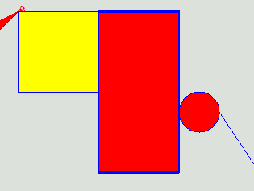
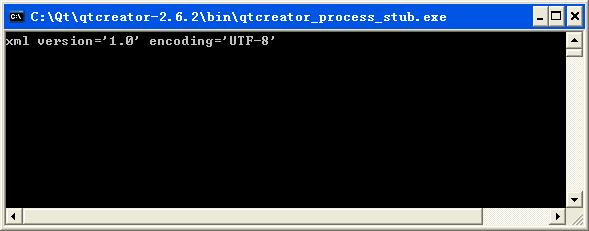

# QT教程

## 图形篇

### 绘制简单图形

Qt中提供了强大的2D绘图系统，可以使用相同的API在屏幕和绘图设备上进行绘制，它主要基于`QPainter`、`QPaintDevice`和`QPaintEngine`这三个类。其中`QPainter`用来执行绘图操作；`QPaintDevice`提供绘图设备，它是一个二维空间的抽象，可以使用`QPainter`在其上进行绘制；`QPaintEngine`提供了一些接口，可以用于`QPainter`在不同的设备上进行绘制。

在绘图系统中由`QPainter`来完成具体的绘制操作，`QPainter`类提供了大量高度优化的函数来完成GUI编程所需要的大部分绘制工作。`QPainter`可以绘制一切想要的图形，从最简单的一条直线到其他任何复杂的图形，它还可以用来绘制文本和图片。`QPainter`可以在继承自`QPaintDevice`类的任何对象上进行绘制操作。

`QPainter`一般在一个部件的重绘事件（`Paint Event`）的处理函数`paintEvent()`中进行绘制，首先要创建`QPainter`对象，然后进行图形的绘制，最后销毁`QPainter`对象。


**就好比 `QPainter`使用`QPaintEngine`在`QPaintDevice`上绘**图。

### 在控件上绘图

Qt 之所以不能在在任意控件上面绘图，是因为Qt的事件过滤器把控件的绘图事件给过滤了。

**“在事件过滤器`eventFilter()` 中拦截 Label 的 `QEvent::Paint` 事件”**

所以，要在控件上绘图，应该自己在过滤器中进行处理

~~~c++
bool MilletChat::eventFilter(QObject *watched, QEvent *event)
{
    if(watched == ui->label && event->type() == QEvent::Paint)
    {
        DrawOnLaybel();
    }
    return QWidget::eventFilter(watched,event);
}
~~~

然后实现 `DrawOnLaybel()`

~~~c++
void MilletChat::DrawOnLaybel()
{
    QPainter painter(ui->label);
    QPen pen; //画笔
    pen.setColor(QColor(255, 0, 0));
    QBrush brush(QColor(0, 255, 0, 125)); //画刷
    painter.setPen(pen); //添加画笔
    painter.setBrush(brush); //添加画刷
    painter.drawRect(50, 50, 200, 100); //绘制矩形
}
~~~

当然，必不可少的一步，为控件**安装过滤器**

~~~c++
ui->label->installEventFilter(this);
~~~

### 渐变填充

在前一节提到了在画刷中可以使用渐变填充。`QGradient`类就是用来和`QBrush`一起指定渐变填充的。Qt现在支持三种类型的渐变填充：

- 线性渐变（linear gradient）在开始点和结束点之间插入颜色；
- 辐射渐变（radial gradient）在焦点和环绕它的圆环间插入颜色；
- 锥形渐变（Conical）在圆心周围插入颜色。

这三种渐变分别由`QGradient`的三个子类来表示，`QLinearGradient`表示线性渐变，`QRadialGradient`表示辐射渐变，`QConicalGradient`表示锥形渐变。

~~~c++
    //线性渐变
    QLinearGradient linearGradient(QPointF(40, 190), QPointF(70, 190));
    //插入颜色
    linearGradient.setColorAt(0, Qt::yellow);
    linearGradient.setColorAt(0.5, Qt::red);
    linearGradient.setColorAt(1, Qt::green);
    //指定渐变区域以外的区域的扩散方式
    linearGradient.setSpread(QGradient::RepeatSpread);
    //使用渐变作为画刷
    painter.setBrush(linearGradient);
    painter.drawRect(10, 20, 90, 40);

//辐射渐变
    QRadialGradient radialGradient(QPointF(100, 190),50,QPointF(275,200));
    radialGradient.setColorAt(0, QColor(255, 255, 100, 150));
    radialGradient.setColorAt(1, QColor(0, 0, 0, 50));
    painter.setBrush(radialGradient);
    painter.drawEllipse(QPointF(100, 190), 50, 50);

//锥形渐变
    QConicalGradient conicalGradient(QPointF(250, 190), 60);
    conicalGradient.setColorAt(0.2, Qt::cyan);
    conicalGradient.setColorAt(0.9, Qt::black);
    painter.setBrush(conicalGradient);
    painter.drawEllipse(QPointF(250, 190), 50, 50);
~~~

### 绘制文字

 Qt中除了绘制图形以外，还可以使用`QPainter::darwText()`函数来绘制文字，也可以使用`QPainter::setFont()`设置文字所使用的字体，使用`QPainter::fontInfo()`函数可以获取字体的信息，它返回`QFontInfo`类对象。在绘制文字时会**默认使用抗锯齿。** 

~~~c++
    // 绘制文字
// 对坐标系沿着 x 轴移动 dx、沿 y 轴移动 dy
    painter.translate(QPoint(ui->label->width()/2, ui->label->height()/2));
    painter.rotate(30);
    painter.drawText(0,0, "Hello World");

    painter.rotate(30);
    painter.drawText(0,0, "Hello World");
~~~


### 绘制路径

 如果要绘制一个复杂的图形，尤其是要重复绘制这样的图形，那么可以使用`QPainterPath`类，然后使用`QPainter::drawPath()`来进行绘制。`QPainterPath`类为绘制操作提供了一个容器，可以用来创建图形并且重复使用。一个绘图路径就是由多个矩形、椭圆、线条或者曲线等组成的对象，一个路径可以是封闭的，例如矩形和椭圆；也可以是非封闭的，例如线条和曲线。 

#### 简单路径

~~~c++
    QPainterPath path;
    path.addEllipse(100, 100, 50, 50);
    path.lineTo(200, 200);
    QPainter painter(this);
    painter.setPen(Qt::blue);
    painter.setBrush(Qt::red);
    painter.drawPath(path);
~~~

#### 复制路径

~~~c++
QPainterPath path2;
path2.addPath(path);
path2.translate(100,0);
painter.drawPath(path2);
~~~

####  绘制图形时的当前位置 

~~~c++
    QPainterPath path;
	path.moveTo(200,200);
    path.lineTo(100,100);
    path.lineTo(200,100);
    QPainter painter(this);
    painter.drawPath(path);
~~~

### 绘制图片

 Qt提供了四个类来处理图像数据：`QImage`、`QPixmap`、`QBitmap`和`QPicture`，它们也都是常用的绘图设备。其中`QImage`主要用来进行I/O处理，它对I/O处理操作进行了优化，而且也可以用来直接访问和操作像素；

* `QPixmap`主要用来在屏幕上显示图像，它对在屏幕上显示图像进行了优化；
* `QBitmap`是`QPixmap`的子类，它是一个便捷类，用来处理颜色深度为1的图像，即只能显示黑白两种颜色；
* `QPicture`用来记录并重演`QPainter`命令。


### 绘图系统

前面一节我们讲解了图片的显示，其中很多地方都用到了坐标的变化。这一节我们将讲解Qt的坐标系统，分为两部分来讲解：第一部分主要讲解前面一节的那几个函数，它们分别是`translate()`平移变换、`scale()`比例变换、`rotate()`旋转变换、`shear()`扭曲变换。最后还会介绍两个有用的函数`save()`和`restore()`，利用它们来保存和弹出坐标系的状态，从而实现快速利用几个变换函数来绘图。

第二部分会和大家一起来研究一下Qt的坐标系统，其中可能会涉及到多个坐标，大家一定要亲自动手操作感悟一下，不然很难理解的！

- 第一部分 Qt坐标系统应用
  - 一、坐标系统简介
  - 二、坐标系统变换
  - 三、坐标系统的保存
- 第二部分 坐标系统深入研究
  - 一、获得坐标信息
  - 二、研究变换后的坐标系统
  - 三、研究绘图设备的坐标系统

####  Qt坐标系统应用

##### 简介

左上角为 （0，0） 和 `MFC` 这些都一样

~~~c++
    painter.setBrush(Qt::red);
    painter.drawRect(0, 0, 100, 100);
    painter.setBrush(Qt::yellow);
    painter.drawRect(-50, -50, 100, 100);
~~~


只看得到黄色矩形的1/4 因为 -50  ,-50 在左上角，实际上是蓝色区域，只是没有显示。

#####  坐标系统变换 

 默认的，`QPainter`在相关设备的坐标系统上进行绘制，在进行绘图时，可以使用

`QPainter::scale()`函数缩放坐标系统；
`QPainter::rotate()`函数顺时针旋转坐标系统；`QPainter::translate()`函数平移坐标系统；
`QPainter::shear()`围绕原点来扭曲坐标系统。如下图所示。 


* **平移**

  ~~~c++
      // 平移变换
      QPainter painter(this);
      painter.setBrush(Qt::yellow);
      painter.drawRect(0, 0, 50, 50);
      painter.translate(100, 100);  //将点（100，100）设为原点
      painter.setBrush(Qt::red);
      painter.drawRect(0, 0, 50, 50);
      painter.translate(-100, -100);
      painter.drawLine(0, 0, 20, 20);
  ~~~


* **缩放**

  ~~~c++
      // 缩放
      QPainter painter(this);
      painter.setBrush(Qt::yellow);
      painter.drawRect(0, 0, 100, 100);
      painter.scale(2, 4); //放大2倍 4倍
      painter.setBrush(Qt::red);
      painter.drawRect(50, 0, 50, 50);
  ~~~

  

 可以看到，当我们使用`scale()`函数将坐标系统的横、纵坐标都放大两倍以后，逻辑上的`（50， 50）`点变成了窗口上的`（100, 100）`点，而逻辑上的长度50，绘制到窗口上的长度却是100。 相当于全部放大 2 倍。

*先计算点，在对点缩放。*

* **扭曲**

  ~~~c++
      // 扭曲    
      painter.setBrush(Qt::yellow);
      painter.drawRect(50, 0, 50, 50);
      painter.shear(0, 2); //纵向扭曲变形
      painter.setBrush(Qt::red);
      painter.drawRect(50, 0, 50, 50);
  
  ~~~

   `shear()`有两个参数，第一个是对横向进行扭曲，第二个是对纵向进行扭曲，而取值就是扭曲的程度。比如程序中对纵向扭曲值为2，那么就是红色正方形左边的边下移2个单位，右边的边下移两个单位，值为2就表明右边的边比左边的边多下移2个单位。大家可以更改取值，测试效果。 

  

*对纵向进行操作，设置的值为左边下移的单位（x距离原点的距离）。*

* **旋转**

~~~c++
      QPainter painter(this);   
      painter.drawLine(0, 0, 100, 0);   
      painter.rotate(30); //以原点为中心，顺时针旋转30度    
      painter.drawLine(0, 0, 100, 0);     
      painter.rotate(-30); // 反向旋转     
      painter.translate(100, 100);    
      painter.rotate(30);    
      painter.drawLine(0, 0, 100, 0);
~~~

这次我们在移动原点以前先将坐标系统反向旋转，可以看到，第二次旋转也是从水平方向开始的。

其实，前面讲到的这几个变换函数都是如此，他们改变了坐标系统以后，如果不进行逆向操作，坐标系统是无法自动复原的。针对这个问题，下面我们将讲解两个非常实用的函数来实现坐标系统的保存和还原。

#####  坐标系统的保存 

 我们可以先利用`save()`函数来保存坐标系现在的状态，然后进行变换操作，操作完之后，再用`restore()`函数将以前的坐标系状态恢复，其实就是一个入栈和出栈的操作。下面来看一个具体的例子，更改`paintEvent()`函数如下： 

~~~c++
   QPainter painter(this);
    painter.save(); //保存坐标系状态
    painter.translate(100,100);
    painter.drawLine(0, 0, 50, 50);
    painter.restore(); //恢复以前的坐标系状态
    painter.drawLine(0, 0, 50, 50);
~~~

####   坐标系统深入研究 

#####  获得坐标信息 

 前面图形的变换都是我们眼睛看到的，为了更具有说服力，下面将获取具体的坐标数据，通过参考数据来进一步了解坐标变换。 

 `QPainter painter(this)`，`this`就表明了是在窗口上进行绘图，所以利用`painter`进行的绘图都是在窗口部件上的，`painter`进行的坐标变换，是变化的窗口的坐标系；而利用`pp`进行的绘图都是在画布上进行的，如果它进行坐标变化，就是变化的画布的坐标系。 

~~~c++
    QPixmap pix(200, 200);
    pix.fill(Qt::red);
    //新建QPainter类对象，在pix上进行绘图
    QPainter pp(&pix);
    pp.translate(50,50);
    //在pix上的（0，0）点和（50，50）点之间绘制直线
    pp.drawLine(0, 0, 50, 50);
    painter.drawPixmap(100, 100, pix);
~~~


### 图形视图框架

 如果需要同时绘制很多个相同或不同的图形，并且要控制它们的移动，检测它们的碰撞和叠加；或者我们想让自己绘制的图形可以拖动位置，进行缩放和旋转等操作。实现这些功能，要是还使用以前的方法，那么会十分困难。解决这些问题，可以使用Qt提供的图形视图框架。 

 图形视图可以对大量定制的`2D`图形项进行管理和相互作用。视图部件可以让所有图形项可视化，它还提供了缩放和旋转功能。我们在帮助中搜索`Graphics View`关键字，内容如下图： 

 这里一开始对这个框架进行了简单介绍，整个图形视图结构主要包含三部分：场景（`Scene`）、视图（`View`）和图形项（`Item`），它们分别对应 `QGraphicsScene` 、`QGraphicsView` 、QGraphicsItem三个类。其实图形视图框架是一组类的集合，在帮助中可以看到所有与它相关的类。下面我们就开始结合程序对整个框架进行介绍。 

- 一、基本应用
- 二、图形项（`QGraphicsItem`）
  - （一）自定义图形项
  - （二）光标和提示
  - （三）拖放
  - （四）键盘与鼠标事件
  - （五）碰撞检测
  - （六）移动
  - （七）动画
  - （八）右键菜单

## 数据库篇

###  数据库简介 

Qt中的`QtSql`模块提供了对数据库的支持，该模块中的众多类基本上可以分为三层，如下图所示。


**驱动层：**为具体的数据库和`SQL`接口层之间提供了底层的桥梁；

**`SQL`接口层：**提供了对数据库的访问，

* `QSqlDatabase` 类用来创建连接
* `QSqlQuery`类可以使用`SQL`语句来实现与数据库交互，其他几个类对该层提供了支持；

**用户接口层：**几个类实现了将数据库中的数据链接到窗口部件上，这些类是使用前一章的模型/视图框架实现的，它们是更高层次的抽象，即便不熟悉`SQL`也可以操作数据库。如果要使用`QtQql`模块中的这些类，<font color=red>需要在项目文件（.pro文件）中添加`QT += sql`这一行代码</font>。对应数据库部分的内容，大家可以在帮助中查看`SQL Programming`关键字。

###  数据库驱动 

 `QtSql`模块使用数据库驱动来和不同的数据库接口进行通信。由于Qt的`SQL`模型的接口是独立于数据库的，所以所有数据库特定的代码都包含在了这些驱动中。Qt现在支持的数据库驱动如下图所示。 

 需要说明的是，由于`GPL`许可证的兼容性问题，并不是这里列出的所有驱动插件都提供给了Qt的开源版本。下面我们通过程序来查看一下现在版本的Qt中可用的数据库插件。 

~~~c++
    QCoreApplication a(argc, argv);
    qDebug() << "Available drivers:";
    QStringList drivers = QSqlDatabase::drivers();
    foreach(QString driver, drivers)
        qDebug() << driver;
    return a.exec();
~~~


 可以发现，现在只支持三个数据库。这里要重点提一下`SQLite`数据库，它是一款轻型的文件型数据库，主要应用于嵌入式领域，支持跨平台，而且Qt对它提供了很好的默认支持，所以在本章后面的内容中，我们将使用该数据库作为例子来进行讲解 。

三、简单的数据库应用

下面使用`QSLite`数据库来进行一个简单的演示，创建一个数据库表，然后查找其中的数据并进行输出。我们更改`main.cpp`文件的内容如下：

~~~c++
    QCoreApplication a(argc, argv);

    //添加数据库驱动
    QSqlDatabase db = QSqlDatabase::addDatabase("QSQLITE");
    //设置数据库名称
    db.setDatabaseName(":memory:");
    //打开数据库
    if(!db.open())
    {
        return false;
    }

    //以下执行相关sql语句
    QSqlQuery query;

    //新建student表，id设置为主键，还有一个name项
    query.exec("create table student(id int primary key,name varchar)");

    //向表中插入3条记录
    query.exec("insert into student values(1,'xiaogang')");
    query.exec("insert into student values(2,'xiaoming')");
    query.exec("insert into student values(3,'xiaohong')");

    //查找表中id >=2 的记录的id项和name项的值
    query.exec("select id,name from student where id >= 2");

    //query.next()指向查找到的第一条记录，然后每次后移一条记录
    while(query.next())
    {
        //query.value(0)是id的值，将其转换为int型
        int value0 = query.value(0).toInt();
        QString value1 = query.value(1).toString();
        //输出两个值
        qDebug() << value0 << value1 ;
    }

    return a.exec();
~~~

 这里使用了`SQLite`数据库，数据库名为`:memory:`表示这是建立在内存中的数据库，也就是说该数据库只在程序运行期间有效。如果需要保存该数据库文件，我们可以将它更改为实际的文件路径。程序中使用到的`QSqlQuery`类，将在后面的内容中讲到。运行程序，结果如下图所示。 


### 利用`QSqlQuery`类执行`SQL`语句

` SQL`即结构化查询语言，是关系数据库的标准语言。前面两节中已经在Qt里利用`QSqlQuery`类执行了`SQL`语句，这一节我们将详细讲解该类的使用。需要说明，因为我们重在讲解Qt中的数据库使用，而非专业的讲解数据库知识，所以不会对数据库中的一些知识进行深入讲解。 

#### 创建数据库连接

前面我们是在主函数中创建数据库连接，然后打开并使用。实际中为了明了方便，一般将数据库连接单独放在一个头文件中。下面来看一个例子。

1．新建Qt Gui应用，项目名称为`myquery`，基类为`QMainWindow`，类名为`MainWindow`。完成后打开`myquery.pro`并将第一行代码更改为：

~~~c++
QT += core gui
QT += sql
~~~

 向项目中添加新的C++头文件，名称为`connection.`h，然后打开该文件，更改如下： 

~~~c++
#ifndef CONNECTION_H
#define CONNECTION_H
#include <QMessageBox>
#include <QSqlDatabase>
#include <QSqlQuery>
static bool createConnection()
{
    QSqlDatabase db = QSqlDatabase::addDatabase("QSQLITE");
    db.setDatabaseName(":memory:");
    if (!db.open()) {
       QMessageBox::critical(0, qApp->tr("Cannot open database"),
           qApp->tr("Unable to establisha database connection."
                     ), QMessageBox::Cancel);
       return false;
    }
    QSqlQuery query;
    query.exec("create table student (id int primary key, "
               "name varchar(20))");
    query.exec("insert into student values(0, 'first')");
    query.exec("insert into student values(1, 'second')");
    query.exec("insert into student values(2, 'third')");
    query.exec("insert into student values(3, 'fourth')");
    query.exec("insert into student values(4, 'fifth')");
    return true;
}
#endif // CONNECTION_H
~~~

 在这个头文件中我们添加了一个建立连接的函数，使用这个头文件的目的就是要简化主函数中的内容。这里先创建了一个`SQLite`数据库的默认连接，设置数据库名称时使用了`“:memory:”`，表明这个是建立在内存中的数据库，也就是说该数据库只在程序运行期间有效，等程序运行结束时就会将其销毁。当然，大家也可以将其改为一个具体的数据库名称，比如`“my.db”`，这样就会在项目目录中创建该数据库文件了。下面使用`open()`函数将数据库打开，如果打开失败，则弹出提示对话框。最后使用`QSqlQuery`创建了一个`student`表，并插入了包含`id`和`name`两个属性的五条记录，如下图所示。其中，`id`属性是`int`类型的，`“primary key”`表明该属性是主键，它不能为空，而且不能有重复的值；而`name`属性是`varchar`类型的，并且不大于20个字符。这里使用的`SQL`语句都要包含在双引号中，如果一行写不完，那么分行后，每一行都要使用两个双引号引起来。 


 需要注意，代码中的`query`没有进行任何指定就可以操作前面打开的数据库，这是因为现在只有一个数据库连接，它就是默认连接，这时候所有的操作都是针对该连接的。但是如果要同时操作多个数据库连接，就需要进行指定了。

#### 操作结果集

在前面的程序中，我们使用`query.exec("select * from student");`查询出表中所有的内容。其中的 SQL 语句`“select * from student”`中`“*”`号表明查询表中记录的所有属性。而当`query.exec("select * from student");`这条语句执行完后，我们便获得了相应的执行结果，因为获得的结果可能不止一条记录，所以称之为结果集。

结果集其实就是查询到的所有记录的集合，在`QSqlQuery`类中提供了多个函数来操作这个集合，需要注意这个集合中的记录是从0开始编号的。最常用的操作有：

- `seek(int n)` ：`query`指向结果集的第n条记录；
- `first()` ：`query`指向结果集的第一条记录；
- `last()` ：`query`指向结果集的最后一条记录；
- `next()` ：`query`指向下一条记录，每执行一次该函数，便指向相邻的下一条记录；
- `previous()` ：`query`指向上一条记录，每执行一次该函数，便指向相邻的上一条记录；
- `record()` ：获得现在指向的记录；
- `value(int n)` ：获得属性的值。其中`n`表示你查询的第n个属性，比方上面我们使用`“select * from student`”就相当于`“select id, name from student”`，那么`value(0)`返回`id`属性的值，`value(1)`返回`name`属性的值。该函数返回`QVariant`类型的数据，关于该类型与其他类型的对应关系，可以在帮助中查看QVariant。
- `at()` ：获得现在`query`指向的记录在结果集中的编号。

需要特别注意，刚执行完`query.exec("select *from student");`这行代码时，`query`是指向结果集以外的，我们可以利用`query.next()`使得 `query`指向结果集的第一条记录。当然我们也可以利用`seek(0)`函数或者`first()`函数使`query`指向结果集的第一条记录。但是为了节省内存开销，推荐的方法是，在`query.exec("select * from student");`这行代码前加上`query.setForwardOnly(true);`这条代码，此后只能使用`next()`和`seek()`函数。

下面我们通过例子来演示一下这些函数的使用。将槽更改如下：

~~~c++
void MainWindow::on_pushButton_clicked()
{
    QSqlQuery query;
    query.exec("select * from student");
    qDebug() << "exec next() :";
    //开始就先执行一次next()函数，那么query指向结果集的第一条记录
    if(query.next())
    {
       //获取query所指向的记录在结果集中的编号
       int rowNum = query.at();
       //获取每条记录中属性（即列）的个数
       int columnNum = query.record().count();
       //获取"name"属性所在列的编号，列从左向右编号，最左边的编号为0
       int fieldNo = query.record().indexOf("name");
       //获取id属性的值，并转换为int型
       int id = query.value(0).toInt();
       //获取name属性的值
       QString name = query.value(fieldNo).toString();
       //将结果输出
       qDebug() << "rowNum is : " << rowNum
                 << " id is : " << id
                 << " name is : " << name
                 << " columnNum is : " << columnNum;
    }
	//定位到结果集中编号为2的记录，即第三条记录，因为第一条记录的编号为0
    qDebug() << "exec seek(2) :";
    if(query.seek(2))
    {
       qDebug() << "rowNum is : " << query.at()
                 << " id is : " << query.value(0).toInt()
                 << " name is : " << query.value(1).toString();
    }
    //定位到结果集中最后一条记录
    qDebug() << "exec last() :";
    if(query.last())
    {
       qDebug() << "rowNum is : " << query.at()
                 << " id is : " << query.value(0).toInt()
                 << " name is : " << query.value(1).toString();
    }
}
~~~

 最后在`mainwindow.cpp`中添加`#include `头文件包含，运行程序，点击查询按钮，输出结果如下图所示。 


### SQL查询模型`QSqlQueryModel`

Qt中使用了自己的机制来避免使用`SQL`语句，为我们提供了更简单的数据库操作及数据显示模型，分别是只读的`QSqlQueryModel`，操作单表的`QSqlTableModel`和以及可以支持外键的`QSqlRelationalTableModel`。这次我们先讲解`QSqlQueryModel`。      

- 一、简单的查询操作
- 二、`QSqlQueryModel`常用操作
- 三、创建自定义`QSqlQueryModel`

 **一、简单的查询操作** 

将模型显示到视图上

~~~c++
    QSqlQueryModel *model = new QSqlQueryModel;
    model->setQuery("select * from student");
    model->setHeaderData(0, Qt::Horizontal, tr("id"));
    model->setHeaderData(1, Qt::Horizontal, tr("name"));
    QTableView *view = new QTableView;
    view->setModel(model);
    view->show();
~~~

**二、`QSqlQueryModel`常用操作**

~~~c++
#include <QSqlRecord>
#include <QModelIndex>
#include <QDebug>

int column= model->columnCount(); //获得列数
int row = model->rowCount();    // 获得行数
QSqlRecord record = model->record(1); //获得一条记录
QModelIndex index = model->index(1,1);   //获得一条记录的一个属性的值
qDebug() << "column numis:" << column << endl
        << "row num is:" << row << endl
        <<"the second record is:" << record << endl
        << "the data of index(1,1) is:"<< index.data();
~~~

** 三、创建自定义`QSqlQueryModel` **

 前面我们讲到这个模型默认是只读的，所以在窗口上并不能对表格中的内容进行修改。但是我们可以创建自己的模型，然后按照自己的意愿来显示数据和修改数据。要想使其可读写，需要自己的类继承自`QSqlQueryModel`，并且重写`setData()` 和 `flags()` 两个函数。如果我们要改变数据的显示，就要重写`data()` 函数。 

~~~c++
// h
#ifndef MYSQLQUERYMODEL_H
#define MYSQLQUERYMODEL_H

#include <QObject>
#include <QSqlQueryModel>

class MySqlQueryModel : public QSqlQueryModel
{
    Q_OBJECT
public:
    explicit MySqlQueryModel(QObject *parent = nullptr);


    Qt::ItemFlags flags(const QModelIndex &index) const;
    bool setData(const QModelIndex &index, const QVariant &value, int role);
    QVariant data(const QModelIndex &item, int role=Qt::DisplayRole) const;

signals:

public slots:

private:
    bool setName(int studentId, const QString &name);
    void refresh();
};

#endif // MYSQLQUERYMODEL_H


// Cpp
#include "mysqlquerymodel.h"
#include <QSqlQuery>
#include <QColor>
MySqlQueryModel::MySqlQueryModel(QObject *parent) :
    QSqlQueryModel(parent)
{
}

Qt::ItemFlags MySqlQueryModel::flags(
       const QModelIndex &index) const //返回表格是否可更改的标志
{
    Qt::ItemFlags flags = QSqlQueryModel::flags(index);
    if (index.column() == 1) //第二个属性可更改
       flags |= Qt::ItemIsEditable;
    return flags;
}

bool MySqlQueryModel::setData(const QModelIndex &index, const QVariant &value, int /* role */)
       //添加数据
{
    if (index.column() < 1 || index.column() > 2)
       return false;
   QModelIndex primaryKeyIndex = QSqlQueryModel::index(index.row(), 0);
    int id = data(primaryKeyIndex).toInt(); //获取id号
    clear();
    bool ok;
    if (index.column() == 1) //第二个属性可更改
       ok = setName(id, value.toString());
    refresh();
    return ok;
}

void MySqlQueryModel::refresh() //更新显示
{
    setQuery("select * from student");
    setHeaderData(0, Qt::Horizontal, QObject::tr("id"));
    setHeaderData(1, Qt::Horizontal, QObject::tr("name"));
}

//添加name属性的值
bool MySqlQueryModel::setName(int studentId, const QString &name)
{
    QSqlQuery query;
    query.prepare("update student set name = ? where id = ?");
    query.addBindValue(name);
    query.addBindValue(studentId);
    return query.exec();
}

//更改数据显示样式
QVariant MySqlQueryModel::data(const QModelIndex &index, int role) const
{
QVariant value = QSqlQueryModel::data(index, role);

//第一个属性的字体颜色为红色
    if (role == Qt::TextColorRole && index.column() == 0)
       return qVariantFromValue(QColor(Qt::red));
return value;
}
~~~

### SQL表格模型`QSqlTableModel`

 在上一篇我们讲到只读的`QsqlQueryModel`模型其实也可以实现编辑功能的，但是实现起来很麻烦。而`QSqlTableModel`提供了一个一次只能操作单个`SQL`表的读写模型，它是`QSqlQuery`的更高层次的替代品，可以浏览和修改独立的`SQL`表，并且只需编写很少的代码，而且不需要了解`SQL`语法。 

- 一、创建数据库
- 二、修改操作
- 三、查询操作
- 四、排序操作
- 五、删除操作
- 六、插入操作

 **一、创建数据库** 

~~~c++
// .h
#include <QSqlTableModel>
QSqlTableModel *model;

// cpp 构造
model = new QSqlTableModel(this);
model->setTable("student");
model->setEditStrategy(QSqlTableModel::OnManualSubmit);
model->select(); //选取整个表的所有行
//不显示name属性列,如果这时添加记录，则该属性的值添加不上
// model->removeColumn(1);
ui->tableView->setModel(model);
//使其不可编辑
//ui->tableView->setEditTriggers(QAbstractItemView::NoEditTriggers);
~~~

 这里创建一个`QSqlTableModel`后，只需使用`setTable()`来为其指定数据库表，然后使用`select()`函数进行查询，调用这两个函数就等价于执行了`“select * from student”`这个SQL语句。这里还可以使用`setFilter()`来指定查询时的条件，在后面会看到这个函数的使用。在使用该模型以前，一般还要设置其编辑策略，它由`QSqlTableModel::EditStrategy`枚举变量定义，一共有三个值，如下图所示。用来说明当数据库中的值被编辑后，什么情况下提交修改。 


可以看到，这个模型已经完全脱离了SQL语句，我们只需要执行`select()`函数就能查询整张表。上面有两行代码被注释掉了，你可以取消注释，测试一下它们的作用。

二、修改操作

1．我们进入“提交修改”按钮的单击信号槽，更改如下：

```cpp
void MainWindow::on_pushButton_3_clicked()
{
    model->database().transaction(); //开始事务操作
    if (model->submitAll()) {
       model->database().commit(); //提交
    } else {
       model->database().rollback(); //回滚
       QMessageBox::warning(this, tr("tableModel"),
                             tr("数据库错误: %1")
                             .arg(model->lastError().text()));
    }
}
```

这里用到了事务操作，真正起提交操作的是`model->submitAll()`一句，它提交所有更改。

2．进入“撤销修改”按钮的单击信号槽，更改如下：

```cpp
void MainWindow::on_pushButton_4_clicked()
{
    model->revertAll();
}
```

3．在`mainwindow.cpp`文件中包含头文件：

```cpp
#include <QMessageBox>
#include <QSqlError>
```

4．现在运行程序，我们将“陈刚”改为“李强”，如果我们点击“撤销修改”，那么它就会重新改为“陈刚”，而当我们点击“提交修改”后它就会保存到数据库，此时再点击“撤销修改”就修改不回来了。

可以看到，这个模型可以将所有修改先保存到`model`中，只有当我们执行提交修改后，才会真正写入数据库。当然这也是因为我们在最开始设置了它的保存策略：

```cpp
model->setEditStrategy(QSqlTableModel::OnManualSubmit);
```

这里的`OnManualSubmit`表明我们要提交修改才能使其生效。

三、查询操作

1．进入“查询”按钮的单击信号槽，更改如下：

```cpp
void MainWindow::on_pushButton_clicked()
{
    QString name = ui->lineEdit->text();
    //根据姓名进行筛选
    model->setFilter(QString("name = '%1'").arg(name));
    //显示结果
    model->select();
}
```

使用`setFilter()`函数进行关键字筛选，这个函数是对整个结果集进行查询。

2．进入“显示全表”按钮的单击信号槽，更改如下：

```cpp
void MainWindow::on_pushButton_2_clicked()
{
    model->setTable("student");   //重新关联表
    model->select();   //这样才能再次显示整个表的内容
}
```

为了再次显示整个表的内容，我们需要再次关联这个表。

3．下面运行程序，输入一个姓名，点击“查询”按钮后，就可以显示该记录了。再点击“显示全表”按钮则返回。如下图所示。


四、排序操作

分别进入“按id升序排序”和“按id降序排序”按钮的单击信号槽，更改如下：

```cpp
// 升序
void MainWindow::on_pushButton_7_clicked()
{
    model->setSort(0, Qt::AscendingOrder); //id属性即第0列，升序排列
    model->select();
}
// 降序
void MainWindow::on_pushButton_8_clicked()
{
    model->setSort(0, Qt::DescendingOrder);
    model->select();  
}
```

这里使用了`setSort()`函数进行排序，它有两个参数，第一个参数表示按第几个属性排序，表头从左向右，最左边是第0个属性，这里就是id属性。第二个参数是排序方法，有升序和降序两种。运行程序，效果如下图所示。


五、删除操作

我们进入“删除选中行”按钮的单击信号槽，更改如下：

```cpp
void MainWindow::on_pushButton_6_clicked()
{
    //获取选中的行
    int curRow = ui->tableView->currentIndex().row();

    //删除该行
    model->removeRow(curRow);

    int ok = QMessageBox::warning(this,tr("删除当前行!"),tr("你确定"
                                                 "删除当前行吗？"),
                                  QMessageBox::Yes,QMessageBox::No);
    if(ok == QMessageBox::No)
    {
       model->revertAll(); //如果不删除，则撤销
    }
    else model->submitAll(); //否则提交，在数据库中删除该行  
}
```

删除行的操作会先保存在`model`中，当我们执行了`submitAll()`函数后才会真正的在数据库中删除该行。这里我们使用了一个警告框来让用户选择是否真得要删除该行。运行程序，效果如下图所示。


我们点击第二行，然后单击“删除选中行”按钮，出现了警告框。这时你会发现，表中的第二行前面出现了一个小感叹号，表明该行已经被修改了，但是还没有真正的在数据库中修改，这时的数据有个学名叫脏数据(Dirty Data)。当我们按钮“Yes”按钮后数据库中的数据就会被删除，如果按下“No”，那么更改就会取消。

六、插入操作

我们进入“添加记录”按钮的单击信号槽，更改如下：

```cpp
void MainWindow::on_pushButton_5_clicked()
{
    int rowNum = model->rowCount(); //获得表的行数
    int id = 10;
    model->insertRow(rowNum); //添加一行
    model->setData(model->index(rowNum,0),id);
    //model->submitAll(); //可以直接提交
}
```

在表的最后添加一行，因为在`student`表中我们设置了`id`号是主键，所以这里必须使用`setData()`函数给新加的行添加`id`属性的值，不然添加行就不会成功。这里可以直接调用`submitAll()`函数进行提交，也可以利用“提交修改”按钮进行提交。运行程序，效果如下图所示。


按下“添加记录”按钮后，就添加了一行，不过在该行的前面有个星号，如果我们按下“提交修改”按钮，这个星号就会消失。当然，如果我们将上面代码里的提交函数的注释去掉，也就不会有这个星号了。

### SQL关系表格模型`QSqlRelationalTableModel`

 `QSqlRelationalTableModel`继承自`QSqlTableModel`，并且对其进行了扩展，提供了对外键的支持。一个外键就是一个表中的一个属性和其他表中的主键属性之间的一对一的映射。例如，`student`表中的`course`属性对应的是`course`表中的`id`属性，那么就称属性`course`是一个外键。因为这里的`course`属性的值是一些数字，这样的显示很不友好，使用关系表格模型，就可以将它显示为`course`表中的`name`属性的值。 

- 一、使用外键
- 二、使用委托

**一、使用外键**

1．新建Qt Gui应用，名称为`relationalTableModel`，基类为`QMainWindow`，类名为`MainWindow`。完成后打开`relationalTableModel.pro`项目文件，将第一行改为：

```
QT       += coregui sql
```

然后保存该文件。

2．下面向项目中添加新的C++头文件`connection.h`，并更改其内容如下：

```cpp
#ifndef CONNECTION_H
#define CONNECTION_H
#include <QSqlDatabase>
#include <QSqlQuery>
static bool createConnection()
{
   QSqlDatabase db = QSqlDatabase::addDatabase("QSQLITE");
   db.setDatabaseName("database.db");
   if(!db.open()) return false;
   QSqlQuery query;
   query.exec("create table student (id int primary key, name vchar,course int)");
   query.exec("insert into student values(1,'yafei0',1)");
   query.exec("insert into student values(2,'yafei1',1)");
   query.exec("insert into student values(3,'yafei2',2)");

query.exec("create table course (id int primarykey, name vchar, teacher vchar)");
   query.exec("insert into course values(1,'Math','yafeilinux1')");
   query.exec("insert into course values(2,'English','yafeilinux2')");
   query.exec("insert into course values(3,'Computer','yafeilinux3')");
   return true;
}
#endif // CONNECTION_H
```

在这里建立了两个表，`student`表中有一项是`course`，它是`int`型的，而`course`表的主键也是int型的。如果要将`course`项和`course`表进行关联，它们的类型就必须相同，一定要注意这一点。

3．更改`main.cpp`文件内容如下：

```cpp
#include "mainwindow.h"
#include <QApplication>
#include "connection.h"
int main(int argc, char *argv[])
{
    QApplication a(argc, argv);
    if(!createConnection()) return 1;
    MainWindow w;
    w.show();

    return a.exec();
}
```

4．然后到`mainwindow.h`文件中，先包含头文件：

```cpp
#include<QSqlRelationalTableModel>
```

然后添加`private`类型对象声明：

```cpp
QSqlRelationalTableModel *model;
```

5．到设计模式，往界面上拖放一个`Table View`部件。

6．到`mainwindow.cpp`文件中，在构造函数里添加如下代码：

```cpp
model = new QSqlRelationalTableModel(this);
//属性变化时写入数据库
model->setEditStrategy(QSqlTableModel::OnFieldChange);
model->setTable("student");
//将student表的第三个属性设为course表的id属性的外键，
//并将其显示为course表的name属性的值
model->setRelation(2,QSqlRelation("course","id","name"));
model->setHeaderData(0, Qt::Horizontal, QObject::tr("ID"));
model->setHeaderData(1, Qt::Horizontal, QObject::tr("Name"));
model->setHeaderData(2, Qt::Horizontal, QObject::tr("Course"));
model->select();
ui->tableView->setModel(model);
```

这里修改了`model`的提交策略，`OnFieldChange`表示只要属性被改动就马上写入数据库，这样就不需要我们再执行提交函数了。`setRelation()`函数实现了创建外键，注意它的格式就行了。

7．运行程序，效果如下图所示。


可以看到`Course`属性已经不再是编号，而是具体的课程了。关于外键，大家也应该有一定的认识了吧，说简单点就是将两个相关的表建立一个桥梁，让它们关联起来。

二、使用委托

有时我们也希望，如果用户更改课程属性，那么只能在课程表中有的课程中进行选择，而不能随意填写课程。Qt中还提供了一个`QSqlRelationalDelegate`委托类，它可以为`QSqlRelationalTableModel`显示和编辑数据。这个委托为一个外键提供了一个`QComboBox`部件来显示所有可选的数据，这样就显得更加人性化了。使用这个委托是很简单的，我们先在`mainwindow.cpp`文件中添加头文件`#include `，然后继续在构造函数中添加如下一行代码：

```cpp
ui->tableView->setItemDelegate(
                new QSqlRelationalDelegate(ui->tableView));
```

运行程序，效果如下图所示。


**结语**

我们可以根据自己的需要来选择使用哪个模型。如果熟悉SQL语法，又不需要将所有的数据都显示出来，那么只需要使用`QSqlQuery`就可以了。对于`QSqlTableModel`，它主要是用来显示一个单独的表格的，而`QSqlQueryModel`可以用来显示任意一个结果集，如果想显示任意一个结果集，而且想使其可读写，那么建议子类化`QSqlQueryModel`，然后重新实现`flags()`和`setData()`函数。更多相关内容请查看《Qt Creator快速入门》第17章。

### 使用DOM读取XML文档

导语 XML(ExtensibleMarkup Language，可扩展标记语言)，是一种类似于HTML的标记语言，但它的设计目的是用来传输数据，而不是显示数据。XML的标签没有被预定义，用户需要在使用时自行进行定义。XML是W3C（万维网联盟）的推荐标准。相对于数据库表格的二维表示，XML使用的树形结构更能表现出数据的包含关系，作为一种文本文件格式，XML简单明了的特性使得它在信息存储和描述领域非常流行。

在Qt中提供了QtXml模块来进行XML文档的处理，我们在Qt帮助中输入关键字QtXml Module，可以看到该模块的类表。这里主要提供了三种解析方法： DOM方法，可以进行读写；SAX方法，可以进行读取；基于流的方法，分别使用`QXmlStreamReader`和`QXmlStreamWriter`进行读取和写入。要在项目中使用`QtXml`模块，还需要在项目文件（`.pro`文件）中添加`QT += xml`一行代码。这一节我们先来讲解一下DOM的方法。

环境：Windows Xp + Qt 4.8.4+QtCreator 2.6.2

#### 目录

- 一、XML文档示例
- 二、使用DOM读取XML文档内容

正文

一、XML文档示例

下面是一个规范的XML文档：

```xml
<?xml version="1.0" encoding="UTF-8"?>
<library>
   <book id="01">
       <title>Qt</title>
       <author>shiming</author>
    </book>
   <book id="02">
       <title>Linux</title>
       <author>yafei</author>
   </book>
</library>
```

每个XML文档都由XML说明（或者称为XML序言）开始，它是对XML文档处理的环境和要求的说明，比如这里的``，其中`xml version=“1.0”`，表明使用的XML版本号，这里字母是区分大小写的；`encoding=“UTF-8”`是使用的编码，指出文档是使用何种字符集建立的，默认值为Unicode编码。XML文档内容由多个元素组成，一个元素由起始标签`<标签名>`和终止标签``以及两个标签之间的内容组成，而文档中第一个元素被称为根元素，比如这里的``，XML文档必须有且只有一个根元素。元素的名称是区分大小写的，元素还可以嵌套，比如这里的`library`、`book`、`title`和`author`等都是元素。元素可以包含属性，用来描述元素的相关信息，属性名和属性值在元素的起始标签中给出，格式为`<元素名 属性名=“属性值”>`，如``，属性值必须在单引号或者双引号中。在元素中可以包含子元素，也可以只包含文本内容，比如这里的`Qt`中的Qt就是文本内容。

二、使用DOM读取XML文档内容

Dom（Document Object Model，即文档对象模型）把XML文档转换成应用程序可以遍历的树形结构，这样便可以随机访问其中的节点。它的缺点是需要将整个XML文档读入内存，消耗内存较多。

在Qt中使用`QDomProcessingInstruction`类来表示XML说明，元素对应`QDomElement`类，属性对应`QDomAttr`类，文本内容由`QDomText`类表示。所有的DOM节点，比如这里的说明、元素、属性和文本等，都使用`QDomNode`来表示，然后使用对应的`isProcessingInstruction()`、`isElement()`、`isAttr()`和`isText()`等函数来判断是否是该类型的元素，如果是，那么就可以使用`toProcessingInstruction()`、`toElement()`、`toAttr()`和`toText()`等函数转换为具体的节点类型。

下面来演示一个例子，将读取前面介绍的XML文档的内容。

1．新建Qt控制台应用，项目名称为`myDom`。

2．完成后打开`myDom.pro`项目文件，将第一行代码更改为：

```
QT       += core    xml
```

然后保存该文件。

3．打开`main.cpp`文件，更改内容如下：

```cpp
#include <QCoreApplication>
#include <QtXml>

int main(int argc, char *argv[])
{    
    QCoreApplication a(argc, argv);     

    // 新建QDomDocument类对象，它代表一个XML文档    
    QDomDocument doc;    
    // 建立指向“my.xml”文件的QFile对象    
    QFile file("my.xml");   
     // 以只读方式打开   
     if (!file.open(QIODevice::ReadOnly)) return 0;   
     // 将文件内容读到doc中   
     if (!doc.setContent(&file)) 
    { file.close(); return 0; }   
     // 关闭文件    
    file.close();    
    // 获得doc的第一个节点，即XML说明   
     QDomNode firstNode = doc.firstChild();    
     // 输出XML说明    
     qDebug() << firstNode.nodeName()    << firstNode.nodeValue();     

     return a.exec();
}
```

4．然后先点击一下Qt Creator左下角的锤子图标来构建项目，这样会在源码目录旁生成构建目录，比如这里是`myDom-build-桌面-Debug`，我们进入该目录，然后新建一个文本文档，如下图所示。


下面将其文件名更改为my.xml，注意一定要更改扩展名，一些电脑中扩展名可能自动隐藏了，可以去“工具→文件夹选项→查看”中修改。提示信息选择“是”即可。如下图所示。


更改完成后使用记事本打开`my.xml`文件，然后将前面的xml文档内容添加进去，保存退出即可。如下图所示。


5．现在运行程序，效果如下图所示。


如果大家不愿意看到字符串两边的引号，可以将源码中得`qDebug()`语句更改如下：

```cpp
qDebug() << qPrintable(firstNode.nodeName())
             << qPrintable(firstNode.nodeValue());
```

运行程序，效果如下图所示。



6．下面在`main()`函数的`return a.exec();`一行代码前继续添加如下代码：

```cpp
QDomElement docElem = doc.documentElement();  //返回根元素
QDomNode n = docElem.firstChild();   //返回根节点的第一个子节点
//如果节点不为空
while(!n.isNull())
{
   if (n.isElement())  //如果节点是元素
   {
      QDomElement e = n.toElement();  //将其转换为元素
      qDebug() << qPrintable(e.tagName())   //返回元素标记
         << qPrintable(e.attribute("id"));  //返回元素id属性的值
    }
      n = n.nextSibling();  //下一个兄弟节点
}
```

这里使用了`firstChild()`函数和`nextSibling()`函数，然后利用`while()`循环来实现对所有子元素的遍历。运行程序，效果如下图所示。


7．下面更改源码中得`if()`语句的内容，输出所有子节点的内容：

```cpp
if (n.isElement())  //如果节点是元素
{
    QDomElement e = n.toElement();
    qDebug() << qPrintable(e.tagName())
            << qPrintable(e.attribute("id"));
    // 获得元素e的所有子节点的列表
    QDomNodeList list = e.childNodes();
    // 遍历该列表
    for(int i=0; i<list.count(); i++)
    {
       QDomNode node = list.at(i);
       if(node.isElement())
           qDebug() << "   " << qPrintable(node.toElement().tagName())
                             <<qPrintable(node.toElement().text());
    }
}
```

这里使用了`childNodes()`函数获得了元素所有子节点的列表，然后通过遍历这个列表实现了遍历其所有子元素。运行程序，效果如下图所示。


#### 结语

通过上面的例子，我们实现了对一个XML文档的读取。可以看到，在`QDom`中，是将整个XML文件读到内存中的`doc`对象中的。然后使用节点（`QDomNode`）操作`doc`对象，像XML说明，元素，属性，文本等等都被看做是节点，这样就使得操作XML文档变得很简单，我们只需通过转换函数将节点转换成相应的类型，如

```cpp
QDomElement e =n.toElement();
```

在下一节我们将讲述XML文件的创建和写入。


## 网络篇

 现在Qt中使用`QNetworkAccessManager`类和`QNetworkReply`类来进行HTTP的编程。网络请求由`QNetworkRequest`类来表示，它也作为与请求有关的信息（例如，任何头信息和使用加密）的容器。在创建请求对象时指定的URL决定了请求使用的协议，目前支持`HTTP、FTP`和本地文件`URLs`的上传和下载。`QNetworkAccessManager`类用来协调网络操作，每当一个请求创建后，该类用来调度它，并发射信号来报告进度。该类还协调`cookies`的使用，身份验证请求，及其代理的使用等。对于网络请求的应答使用`QNetworkReply`类表示，它会在请求被完成调度时由`QNetworkAccessManager`来创建。`QNetworkReply`提供的信号可以用来单独的监视每一个应答。 

### 目录

- 一、简单的网页浏览功能
- 二、实现下载文件功能

### 正文

一、简单的网页浏览功能

1．新建Qt Gui应用，项目名称为`http`，基类使用默认的`QMainWindow`即可，类名为`MainWindow`。

2．完成后打开`http.pro`文件，然后添加下面一行代码来使用网络模块：

```cpp
QT  += network
```

然后保存该文件。

3．下面打开`mainwindow.ui`文件进入设计模式，向界面上添加一个`Text Browser`部件。效果如下图所示。


4．打开`mainwindow.h`文件，先包含头文件：`#include `

然后添加一个`private`私有对象定义：`QNetworkAccessManager *manager;`

最后添加一个私有槽声明：

```cpp
private slots:
    void replyFinished(QNetworkReply *);
```

5．下面到`mainwindow.cpp`文件中，先在构造函数中添加如下代码：

```cpp
manager = new QNetworkAccessManager(this);
connect(manager, SIGNAL(finished(QNetworkReply*)),
this,SLOT(replyFinished(QNetworkReply*)));
manager->get(QNetworkRequest(QUrl("http://www.qter.org")));
```

这里先创建了一个`QNetworkAccessManager`类的实例，它用来发送网络请求和接收应答。然后关联了管理器的`finished()`信号和我们自定义的槽，每当网络应答结束时都会发射这个信号。最后使用了`get()`函数来发送一个网络请求，网络请求使用`QNetworkRequest`类表示，`get()`函数返回一个`QNetworkReply`对象。除了`get()`函数，管理器还提供了发送HTTP POST请求的`post()`函数。

6．下面添加槽的定义：

```cpp
void MainWindow::replyFinished(QNetworkReply *reply)
{
    QTextCodec *codec = QTextCodec::codecForName("utf8");
    QString all = codec->toUnicode(reply->readAll());
    ui->textBrowser->setText(all);
    reply->deleteLater();
}
```

因为`QNetworkReply`继承自`QIODevice`类，所以可以操作一般的I/O设备一样来操作该类。这里使用了`readAll()`函数来读取所有的应答数据，为了正常显示中文，使用了`QTextCodec`类来转换编码。在完成数据的读取后，需要使用`deleteLater()`来删除`replay`对象。

7．因为这里使用了`QtextCodec`类，所以还需要在`mainwindow.cpp`文件中包含头文件

```cpp
#include <QTextCodec>
```

下面运行程序，效果如下图所示。


这里再将整个过程简答叙述一遍：上面实现了最简单的应用HTTP协议下载网页的功能。`QNetworkAccessManager`类用于发送网络请求和接受回复，具体来说，它是用`QNetworkRequest`类来管理请求，`QNetworkReply`类进行接收回复，并对数据进行处理。

在上面的代码中，我们使用了下面的代码来发送请求：

```cpp
manager->get(QNetworkRequest(QUrl("http://www.qter.org")));
```

它返回一个`QNetworkReply`对象，这个后面再讲。我们只需知道只要发送请求成功，它就会下载数据。而当数据下载完成后，`manager`会发出`finished()`信号，我们关联了该信号：

```cpp
connect(manager, SIGNAL(finished(QNetworkReply*)),
this,SLOT(replyFinished(QNetworkReply*)));
```

也就是说，当下载数据结束时，就会执行`replyFinished()`函数。在这个函数中我们对接收的数据进行处理：

```cpp
QTextCodec *codec = QTextCodec::codecForName("utf8");
QString all = codec->toUnicode(reply->readAll());
ui->textBrowser->setText(all);
```

这里，为了能显示下载的网页中的中文，我们使用了`QTextCodec` 类对象，应用utf8编码。使用`reply->readAll()`函数就可以将下载的所有数据读出。然后，我们在`textBrowser`中将数据显示出来。当`reply`对象已经完成了它的功能时，我们需要将它释放，就是最后一条代码：

```cpp
reply->deleteLater();
```