# **Qt5开发实力（第三版）**

## 模板库、工具类及控件

`QString、Qt容器类、QVariant、Qt`常用算法和基本正则表达式

### 容器类

`QObject`类及其子类不能存储在容器中，因为这些类没有赋值构造函数和赋值操作运算符。

~~~c++
// 例如
QList<QToolBar> listToolBar;

// 替换思路
QList<QToolBar*> listpToolBar;
~~~

存储在容器中的数据类型必须是**可赋值**的数据类型。

#### `QList、QLinkedList、QVector`

##### `QList`

是最常用的容器类、其子类有`QItemSelection`、`QQueue`、`QSignalSpy`、`QStringList`、`QTestEventList`
`QList<T>`维护了一个指针数组，该数组存储的指针指向 `QList<T>`存储的列表项的内容，因此，`QList<T>`提供了基于下标的快速访问。

存储策略：
	不同的数据类型，有不同的存储策略。

* 如果T是一个指针或指针大小的数据，那么直接存储到数组中。
* 如果T存储的对象是指针，则该指针指向实际的数据类型。

##### **`QLinkedList`** 

`QLinkedList<T>` 是一个链式列表，它以非连续的内存块保存数据。
`QLinkedList<T> ` 不能用下标访问，只能用迭代器访问。

##### `QVector`

`QVector<T>`在相邻的内存中存储给定的数据类型 T 的一组数值。在一个`QVector<T>`的前部或者中间位置进行插入是最慢的，因为大量的数据会去移动内存。

子类：`QPolygon、QPolygonF、QStack`

##### Java风格遍历容器

比 `STL` 使用方便，不过这也是损失性能为代价。

~~~c++
#include <QCoreApplication>
#include <QDebug>
#include <QList>
#include <QListIterator>

int main(int argc, char *argv[])
{
    QCoreApplication a(argc, argv);

    QList<int> list;
    list << 1 << 2 << 3 << 4 << 5;

    // 声明一个 迭代器，初始化绑定一个列表
    QListIterator<int> it(list);
    for( ; it.hasNext(); )
        qDebug() << it.next();
    return a.exec();
}
~~~

##### `STL`风格

`STL`风格比`JAVA`风格快的原因是，它直接指向的是列表项。

~~~c++
#include <QCoreApplication>
#include <QList>
#include <QListIterator>
#include <QDebug>

int main(int argc, char *argv[])
{
    QCoreApplication a(argc, argv);

    QList<int> list;
    list << 1 << 2 << 3 << 4 << 5;

    QList<int>::iterator it;
    for ( it = list.begin(); it != list.end(); ++it)
        qDebug() << *it ;

    return a.exec();
}
~~~

##### `QMap`和`QHash`

* `QHash`具有比`QMap`更快的查找速度。
* `QHash`以任意顺序存储数据项，而`QMap`总是按照`Key`的顺序存储数据。
* `QHash`的键类型`Key`必须提供 `operator == ()`和一个全局的`qHash(Key)`函数，而`QMap`的键类型 `Key`必须提供 `opreator < ()`函数。

### 控件

#### Button

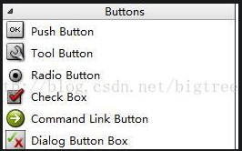

`Push Button`：按钮

`Tool Button` ：工具按钮    和普通按钮相比，工具按钮一般不显示文本，而显示图标 

`Radio Button` ：单选按钮

`Check Box`： 复选框

`Command Link Button`：命令连接按钮

`Dialog Button Box`：对话框按钮盒

#### Input Widgets

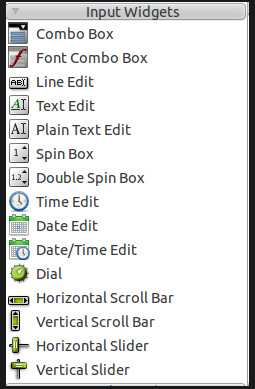

  

`Combo Box`：下拉列表

`Font Combo Box`：字体下拉列表

`Line Edit`：单行文字

`Text Edit`：多行富文本编辑器，可显示 `HTML` 格式

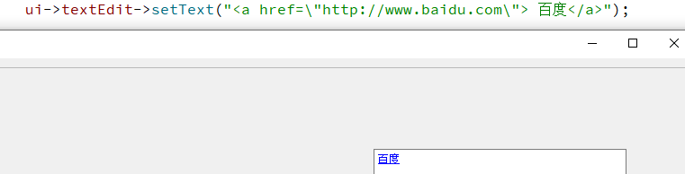

`Plain Text Edit`：纯文本编辑框

`Spin Box`：数字显示框

`Double Spin Box`：双自旋盒

`Time Edit`：时间编辑

`Date Edit`：日期编辑

`Date/Time Edit`：日期/时间编辑

`Dial`：拨号


## 布局管理

### 分割窗体

步骤：

* 创建分割窗体，声明子窗口排序方向
* 创建Child Widget
* 创建其他的分割创

```c++
    QSplitter * pSplitterMain = new QSplitter(Qt::Horizontal, 0);
    QTextEdit * pTextEditLeft = new QTextEdit("Left", pSplitterMain);

    QSplitter * pSplitterRight = new QSplitter(Qt::Vertical, pSplitterMain);
    QTextEdit * pTextEditRightTop = new QTextEdit("Right Top", pSplitterRight);
    QTextEdit * pTextEditRightBottom = new QTextEdit("Right Bottom", pSplitterRight);

    pSplitterMain->show();
```

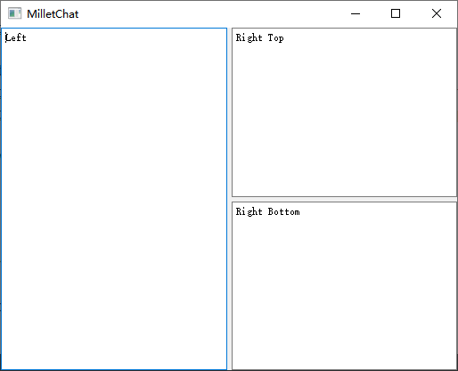

### 停靠窗

步骤：

* 创建一个主窗口
* 创建 `DockWidget`，设置属性，`DockWidget`增加控件，如下面增加`QTextEdit`

```c++
/// 停靠窗体
void MainWindow::ShowDockWidget()
{
    QMainWindow * pMainWindow = new QMainWindow;
    pMainWindow->setAttribute(Qt::WA_DeleteOnClose);

    // 设定主窗口
    QTextEdit * pTextEdit = new QTextEdit("Main Window", pMainWindow);
    pMainWindow->setCentralWidget(pTextEdit);

    // 设定第一个浮动窗口
    QDockWidget * pDockWidget = new QDockWidget("DockWidget1", pMainWindow);

    // 可移动
    pDockWidget->setFeatures(QDockWidget::DockWidgetMovable);
    pDockWidget->setAllowedAreas(Qt::LeftDockWidgetArea | Qt::RightDockWidgetArea);

    // 这里因为，DockWidget 只是一个容器，所以需要自己创建一个 Widget 来防止 btn和Text
    QWidget * pWidget = new QWidget();
    QTextEdit * pTextEdit1 = new QTextEdit("Text1");
    QPushButton * pBtn1 = new QPushButton("Btn");

    QHBoxLayout * pLayout = new QHBoxLayout(pDockWidget);
    pLayout->addWidget(pTextEdit1);
    pLayout->addWidget(pBtn1);

    pWidget->setLayout(pLayout);
    pDockWidget->setWidget(pWidget);
    pMainWindow->addDockWidget(Qt::RightDockWidgetArea, pDockWidget);

    // 第二个浮动窗口
    QDockWidget * pDockWidget2 = new QDockWidget("DockWidget2", pMainWindow);
    pDockWidget2->setFeatures(QDockWidget::DockWidgetMovable | QDockWidget::DockWidgetClosable);
    pDockWidget2->setAllowedAreas(Qt::LeftDockWidgetArea | Qt::RightDockWidgetArea);

    QTextEdit * pTextEdit2 = new QTextEdit("Text2", pMainWindow);
    pDockWidget2->setWidget(pTextEdit2);
    pMainWindow->addDockWidget(Qt::RightDockWidgetArea, pDockWidget2);

    // 第三个浮动窗口
    QDockWidget * pDockWidget3 = new QDockWidget("DockWidget3", pMainWindow);
    pDockWidget3->setFeatures(QDockWidget::DockWidgetMovable |
                              QDockWidget::DockWidgetClosable |
                              QDockWidget::DockWidgetFloatable);
    pDockWidget3->setAllowedAreas(Qt::LeftDockWidgetArea | Qt::RightDockWidgetArea);

    QTextEdit * pTextEdit3 = new QTextEdit("Text3", pMainWindow);
    pDockWidget3->setWidget(pTextEdit3);
    pMainWindow->addDockWidget(Qt::RightDockWidgetArea, pDockWidget3);

    pMainWindow->show();

}
```

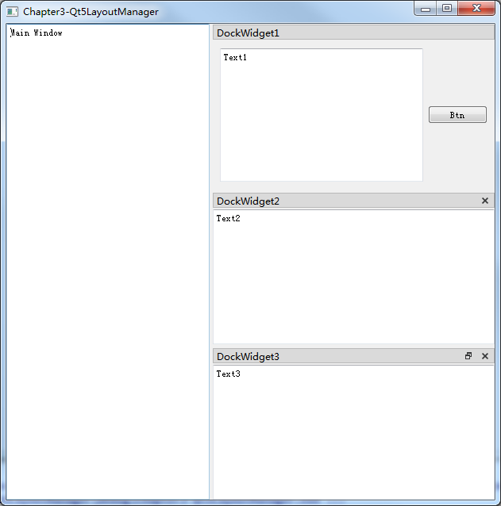

### 堆栈窗体

~~~c++
    //QWidget * pMainWindow = new QWidget;
    QMainWindow * pMainWindow = new QMainWindow;
    //pMainWindow->setCentralWidget();

    pMainWindow->setAttribute(Qt::WA_DeleteOnClose);

    QListWidget * pList = new QListWidget(pMainWindow);  //新建一个QListWidget对象
    pList->insertItem(0, ("window0"));  //插入三个条目
    pList->insertItem(1, ("window1"));
    pList->insertItem(2, ("window2"));

    QLabel * label0 = new QLabel(("windowTest0"));  //新建三个标签对象，作为堆栈窗口需要显示的三层窗体
    QLabel * label1 = new QLabel(("windowTest1"));
    QLabel * label2 = new QLabel(("windowTest2"));

    QStackedWidget* pStack = new QStackedWidget(pMainWindow);  //新建一个堆栈窗体对象
    pStack->addWidget(label0);       //将新建的三个QLabel标签控件依次插入堆栈窗体中
    pStack->addWidget(label1);
    pStack->addWidget(label2);

    QHBoxLayout *pMainLayout = new QHBoxLayout(); //对整个对话框进行布局
    pMainLayout->setMargin(5); //设置对话框的边距为5
    pMainLayout->setSpacing(5); //设置各个控件之间的间距为5
    pMainLayout->addWidget(pList);
    pMainLayout->addWidget(pStack, 0, Qt::AlignHCenter);
    pMainLayout->setStretchFactor(pList, 1);  //设置list为可伸缩控件
    pMainLayout->setStretchFactor(pStack,3);

    pMainWindow->setLayout(pMainLayout);

    //将 QListWidget的currentRowChanged信号和堆栈窗体的setCurrentIndex槽函数连接起来，实现按选择显示窗体。
    connect(pList, SIGNAL(currentRowChanged(int)), pStack, SLOT(setCurrentIndex(int)));

    pMainWindow->show();
~~~


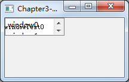

控件挤成一坨了，是因为创建的是 `QMainWindow`，而`QMainWindow`（常用窗口->主窗口），最外面没有 布局。所以就是一坨了。

修改为创建 `QWidget`，或者 `QMainWindow::setCentralWidget `。

```c++
/// 堆栈窗体
/// 实际过程中，堆栈窗体常与 QListWidget QComboBox 使用
   //QWidget * pMainWindow = new QWidget;
    QMainWindow * pMainWindow = new QMainWindow;
    //pMainWindow->setCentralWidget();

    pMainWindow->setAttribute(Qt::WA_DeleteOnClose);

    QListWidget * pList = new QListWidget(pMainWindow);  //新建一个QListWidget对象
    pList->insertItem(0, ("window0"));  //插入三个条目
    pList->insertItem(1, ("window1"));
    pList->insertItem(2, ("window2"));

    QLabel * label0 = new QLabel(("windowTest0"));  //新建三个标签对象，作为堆栈窗口需要显示的三层窗体
    QLabel * label1 = new QLabel(("windowTest1"));
    QLabel * label2 = new QLabel(("windowTest2"));

    QStackedWidget* pStack = new QStackedWidget(pMainWindow);  //新建一个堆栈窗体对象
    pStack->addWidget(label0);       //将新建的三个QLabel标签控件依次插入堆栈窗体中
    pStack->addWidget(label1);
    pStack->addWidget(label2);

    QHBoxLayout *pMainLayout = new QHBoxLayout(); //对整个对话框进行布局
    pMainLayout->setMargin(5); //设置对话框的边距为5
    pMainLayout->setSpacing(5); //设置各个控件之间的间距为5
    pMainLayout->addWidget(pList);
    pMainLayout->addWidget(pStack, 0, Qt::AlignHCenter);
    pMainLayout->setStretchFactor(pList, 1);  //设置list为可伸缩控件
    pMainLayout->setStretchFactor(pStack,3);

    pMainWindow->setLayout(pMainLayout);

    //将 QListWidget的currentRowChanged信号和堆栈窗体的setCurrentIndex槽函数连接起来，实现按选择显示窗体。
    connect(pList, SIGNAL(currentRowChanged(int)), pStack, SLOT(setCurrentIndex(int)));

    pMainWindow->show();
```

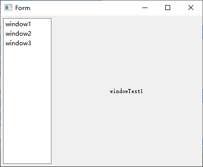


## 常用窗口

### 主窗口

`QMainWindow` 包含一个 菜单栏`menu bar` ，多个工具栏`tool bars` 多个锚部件`dock widgets`  一个状态栏 `status bar` 以及一个中心部件`central widget`。

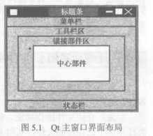

#### 菜单栏

一系列命令的列表，使用 `QAction`来表示这些命令。一个窗口最多只有一个菜单栏。

#### 状态栏

显示应用程序的一些状态，位于底部，用户可以再状态栏上添加，使用 QT 窗口部件。一个主窗口最多只有一个状态栏。

#### 工具栏

由一系列类似于按钮的动作排列而成的面板，它通常由一些经常使用的命令（动作）完成，工具栏位于菜单栏下方，状态栏上面，可以停靠左右上下四个方向。一个主窗口可以包含多个工具栏。

#### 锚接部件

作为一个容器使用，包容其他窗口部件来实现某些功能

> Qt设计器 的属性编辑器，对象监视器等都是由锚接部件包容其他的Qt窗口部件来实现。它位于工具栏区的内部。可以作为一个窗口自由浮动在主窗口上。

可以停靠在上下左右，可以有多个锚部件。

#### 中心部件

中心部件处于锚接部件区的内部，主窗口的中心。一个主窗口只有一个中心部件。


### 标准窗口

#### 文件标准对话框

~~~c++
    // 获取打开文件路径及文件名
	QString strFileName = QFileDialog::getOpenFileName();
    ui->leFilePath->setText(strFileName);

    // 获取用户保存的用户名
    strFileName = QFileDialog::getSaveFileName();
    ui->leFilePath->setText(strFileName);

    // 获取用户选择的已存在的目录
    strFileName = QFileDialog::getExistingDirectory();
    ui->leFilePath->setText(strFileName);

    // 获取打开选择的文件名列表
    QStringList strList = QFileDialog::getOpenFileNames();
~~~

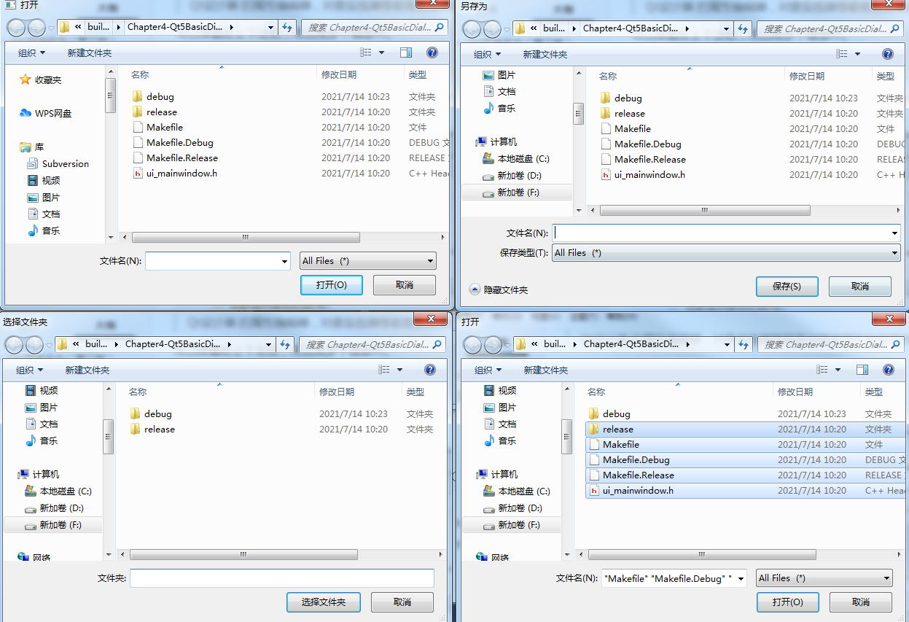

#### 颜色选择对话框

~~~c++
    QColor color = QColorDialog::getColor();
    if( color.isValid() )
    {
        qDebug() << color;

        ui->frameColor->setFrameShape(QFrame::Box);

        // 当使用QPalette为窗口设定背景并使用QPalette::Window时
        // 必须调用setAutoFillBackground(true)!!!
        ui->frameColor->setAutoFillBackground(true);
        ui->frameColor->setPalette(QPalette(color));
    }
~~~

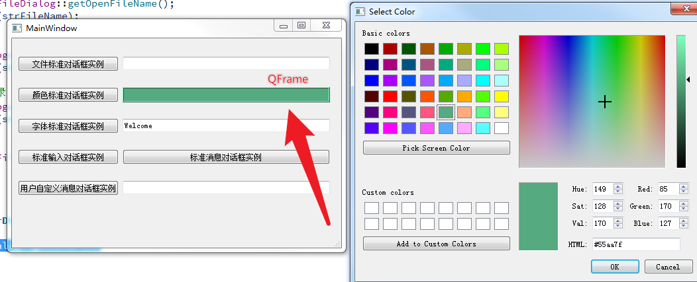

#### 字体选择对话框

~~~c++
    bool ok = true;

// ok == true，返回用户选择字体， ok == false 返回默认字体
    QFont font = QFontDialog::getFont( &ok);
    ui->lleStdFont->setFont(font);
~~~

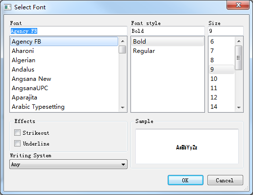

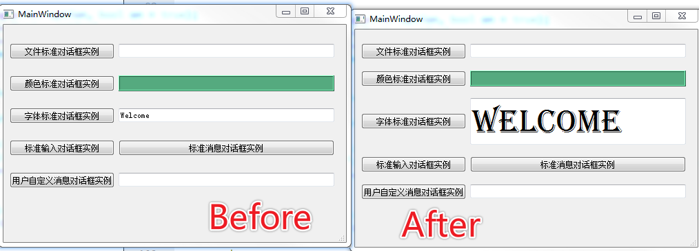

#### 标准输入对话框

~~~c++
    QInputDialog::getText(nullptr, "Input Text", "get Text");

    QStringList listItem;
    listItem << "111" << "222" << "333" ;
    QInputDialog::getItem(nullptr, "Input Text", "get Item", listItem);

    QInputDialog::getInt(nullptr, "Input Text", "get Int");

    QInputDialog::getDouble(nullptr, "Input Text", "get Double");
~~~

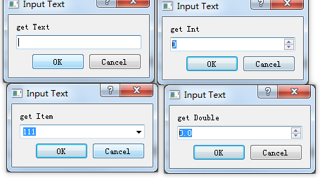

#### 消息对话框

常用的消息对话框包括

Question，Information ，Warning，Critical（严重警告），About，About Qt，Custom

其中，Question，Information，Warning，Critical用法差不多，图标，按钮，一条提示信息。

~~~c++
    QMessageBox::question( nullptr, "question", "question");
    QMessageBox::information( nullptr, "information", "information");
    QMessageBox::warning( nullptr, "warning", "warning");
    QMessageBox::critical( nullptr, "critical", "critical");

    QMessageBox::about( nullptr, "about", "about");
    QMessageBox::aboutQt(nullptr);
~~~


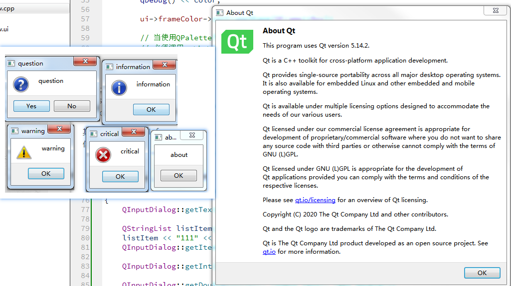

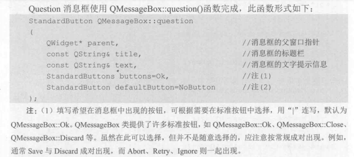

#### 用户自定义对话框

就是自己增加按钮，提示等信息

~~~c++
    QMessageBox customMsgBox;
    customMsgBox.setWindowTitle("用户自定义消息对话框");

    customMsgBox.setText("用户自定义消息对话框 的提示信息");
    customMsgBox.setIconPixmap(QPixmap("F:\\lena-0.jpg"));

    customMsgBox.addButton(new QPushButton("确定"), QMessageBox::ActionRole );
    customMsgBox.addButton(new QPushButton("取消"), QMessageBox::ActionRole );

    customMsgBox.exec();

    QString strText = customMsgBox.clickedButton()->text();

    //ui->leCustomerMsg->setText(strText);

    if( customMsgBox.clickedButton()->text() == "确定" )
        ui->leCustomerMsg->setText("点击了确定");
    else if( customMsgBox.clickedButton()->text() == "取消" )
        ui->leCustomerMsg->setText("点击了取消");
~~~

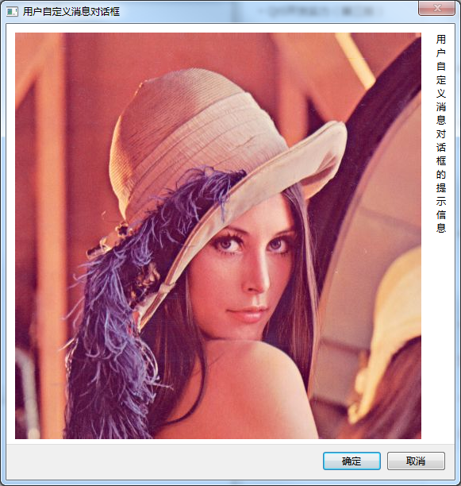

### 工具盒类

~~~c++
    QVBoxLayout * pMainVBox = new QVBoxLayout();

    QToolBox * pToolBox = new QToolBox(this);

    QGroupBox * pMyFrient = new QGroupBox();
    QVBoxLayout *pMyFrientLayout = new QVBoxLayout(pMyFrient);

    QToolButton * pToolButton1 = new QToolButton();
    pToolButton1->setText("张三");
    pMyFrientLayout->addWidget(pToolButton1);

    QToolButton * pToolButton2 = new QToolButton();
    pToolButton2->setText("李四");
    pMyFrientLayout->addWidget(pToolButton2);


    QGroupBox * pSchoolFrientBox = new QGroupBox();
    QVBoxLayout *pSchoolFrientLayout = new QVBoxLayout(pSchoolFrientBox);

    QToolButton * pToolButton3 = new QToolButton();
    pToolButton3->setText("张三同学");
    pSchoolFrientLayout->addWidget(pToolButton3);

    QToolButton * pToolButton4 = new QToolButton();
    pToolButton4->setText("李四同学");
    pSchoolFrientLayout->addWidget(pToolButton4);

    pToolBox->addItem((QWidget*)pMyFrient, "我的好友");
    pToolBox->addItem((QWidget*)pSchoolFrientBox, "校友");

    pMainVBox->addWidget(pToolBox);

    this->setLayout(pMainVBox);
~~~

#### 结果

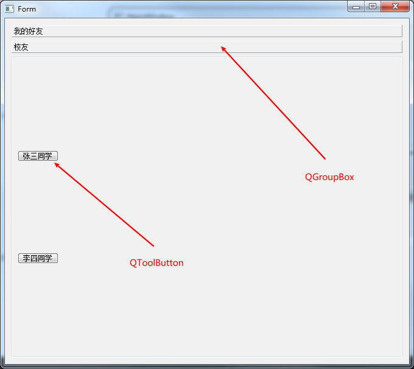

简单来说就是套娃，`QToolBox `增加 `QGroupBox`，`QGroupBox`添加`QToolButton`。

### 进度条

~~~c++
#include "qtprogress.h"
#include "ui_qtprogress.h"

#include <QProgressDialog>
#include <QPalette>

QtProgress::QtProgress(QWidget *parent) :
    QWidget(parent),
    ui(new Ui::QtProgress)
{
    ui->setupUi(this);

    ui->comboBox->insertItem(0, "对话框");
    ui->comboBox->insertItem(1, "进度条");

    ui->lineEdit->setText("1000");

    ui->progressBar->setValue(0);

//    QPalette palette;
//    ui->progressBar->setPalette(palette);

}

QtProgress::~QtProgress()
{
    delete ui;
}

void QtProgress::on_pushButton_clicked()
{
    int nNum =ui->lineEdit->text().toUInt();
    ui->progressBar->setRange(0, nNum);
    ui->progressBar->setValue(0);

    if(ui->comboBox->currentIndex() == 1)
    {
        for(int i = 1; i <= nNum; ++i)
        {
            ui->progressBar->setValue(i);
            _sleep(10);
        }
    }
    else
    {
        QProgressDialog * pDlg  = new QProgressDialog(this);

        pDlg->setWindowModality(Qt::WindowModal);	// 模态显示
        pDlg->setMinimumDuration(5);				// 设置低于 5 ms 就不显示对话框
        pDlg->setWindowTitle("Please Wait");
        pDlg->setLabelText("Copying...");
        pDlg->setCancelButtonText("Cancle");

        pDlg->setRange(0, nNum);

        for(int i = 1; i <= nNum; ++i)
        {
            if( pDlg->wasCanceled() )
                break;

            pDlg->setValue(i);
            _sleep(10);
        }
    }
}
~~~

##### 对话框模式

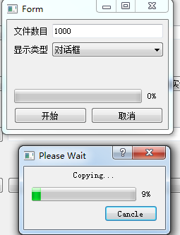

##### 进度条

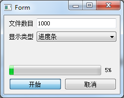

## 调色板和电子钟

###  `QPalette `

用来专门管理对话框的外观显示，管理控件或窗体的所有颜色信息。

#### 两个基本概念

##### `ColorGroup`

~~~c++
enum ColorGroup { Active, Disabled, Inactive, NColorGroups, Current, All, Normal = Active };
~~~

* `QPalette::Active`：获得焦点的状态
* `QPalette::Inactive`：未获得焦点的状态
* `QPalette::Disabled`：不可用的状态

##### `ColorRole`

颜色主题，对窗体中不同部位颜色的分类。

比如：`QPalette::Windows`为背景色；`QPalette::WindowText`为前景色

~~~c++
    enum ColorRole { WindowText, Button, Light, Midlight, Dark, Mid,
                     Text, BrightText, ButtonText, Base, Window, Shadow,
                     Highlight, HighlightedText,
                     Link, LinkVisited,
                     AlternateBase,
                     NoRole,
                     ToolTipBase, ToolTipText,
                     PlaceholderText,
                     NColorRoles = PlaceholderText + 1,
#if QT_DEPRECATED_SINCE(5, 13)
                     Foreground Q_DECL_ENUMERATOR_DEPRECATED_X("Use QPalette::WindowText instead") = WindowText,
                     Background Q_DECL_ENUMERATOR_DEPRECATED_X("Use QPalette::Window instead") = Window
#endif
                   };
~~~

#### 结果

主要还是用了 `setColor()` 接口，就是要注意要先调用，要不然不会改变

~~~c++
setAutoFillBackground(true);
~~~

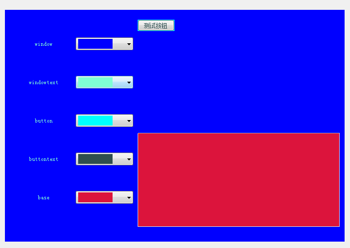

### `QTime`

#### 格式

其实这个主要就是格式问题

~~~C++
    QTime time = QTime::currentTime();
    QString text = time.toString("hh:mm:ss");
~~~

实现一个电子时钟

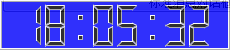

这个示例另一个需要注意的就是坐标系的问题，详细请看代码。`Chapter4-Qt5BasicDialog -> qttimedialog.cpp`

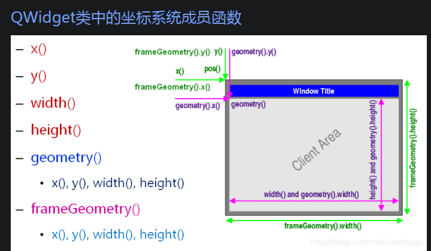

## 可扩展对话框

就是点击详细，然后下面再显示，默认不显示

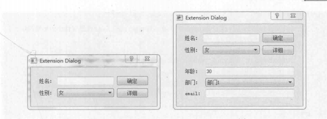

这种一般固定大小，如果像 `MFC` 有 `MoveWindow()` 那就直接`MoveWindow`这种宽高咯。

Qt 里面没有，那就用布局咯，上下布局，下面的不显示就可以咯。详细看代码。

### 过程

最开始直接 布局作为成员变量，准备点 详细的时候，直接 布局  hide()，结果没有  hide();

```
QVBoxLayout 没有隐藏功能，所以，需要一个 widget 作为容器来实现隐藏效果
```

增加 widget 作为容器来接收，发现，点击详细位置会变化，这肯定是有问题的撒。

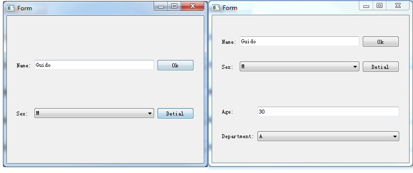

这种情况是由于自适应大小导致的。所以需要在最终的 `mainLayout `设置固定尺寸。

~~~c++
pMainLayout->setSizeConstraint(QLayout::SetFixedSize);
~~~

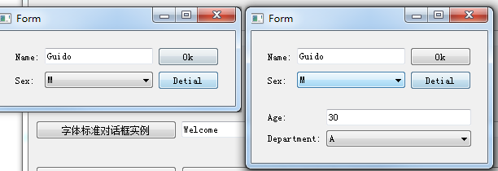

## 不规则对话框

实现原理：利用 Mask 将窗体部分遮罩。窗体还是原来那个，只是说看不到部分了。

~~~c++
// 采用图片
setMask(QBitmap(pix));

// 采用 Region
 int side = qMin(width(), height());
  QRegion maskedRegion(width() / 2 - side / 2, height() / 2 - side / 2, side,
  side, QRegion::Ellipse);
  setMask(maskedRegion);

~~~

### 实现

好家伙，居然弄成这种了？？？？？？？不科学啊 麻子点点点

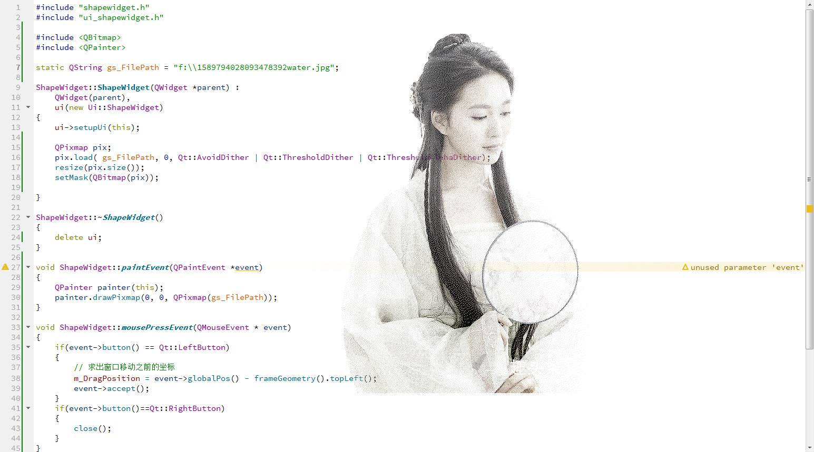

晚点看看参数什么含义。


## 开机动画

### 原理

所谓开机动画，那肯定 main 函数里面修改咯

~~~C++
int main(int argc, char *argv[])
{
    QApplication a(argc, argv);

    QSplashScreen screen(QPixmap("d:\\d7f82e12762a65d9164a53bcc960e9b6.jpg"));	// 加载图片
    screen.show();		// 显示
    a.processEvents();	// 显示开机动画的时候可以接受其他事件
    MainWindow w;
    w.show();
    screen.finish(&w);	//主窗体初始化完成后，关闭动画
    return a.exec();
}
~~~


## 图形和图像

### 窗体位置

qt 自己的接口和他们的位置关系

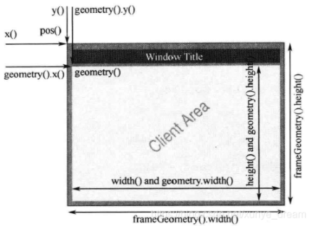


*  x()、y()、pos()获得整个窗体左上角的位置； 

* geometry()获得窗体内中央区域的左上角顶点坐标和长、宽；

* frameGeometry()获得整个窗体的左上角顶点位置和长、宽。
* rect()，size() 获得的结果也是和中央区域一样


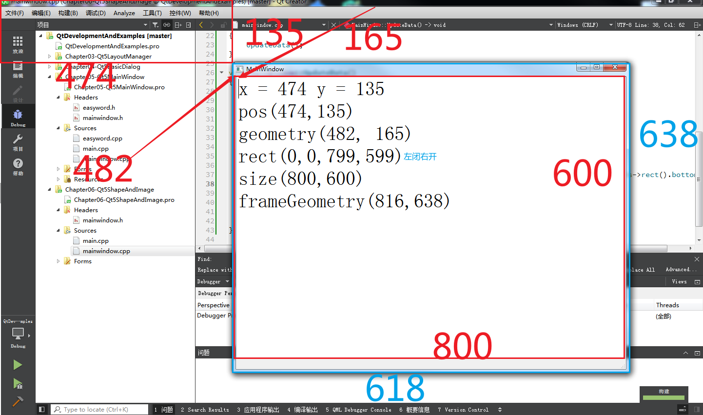


### 基础图形绘制

#### 示意图

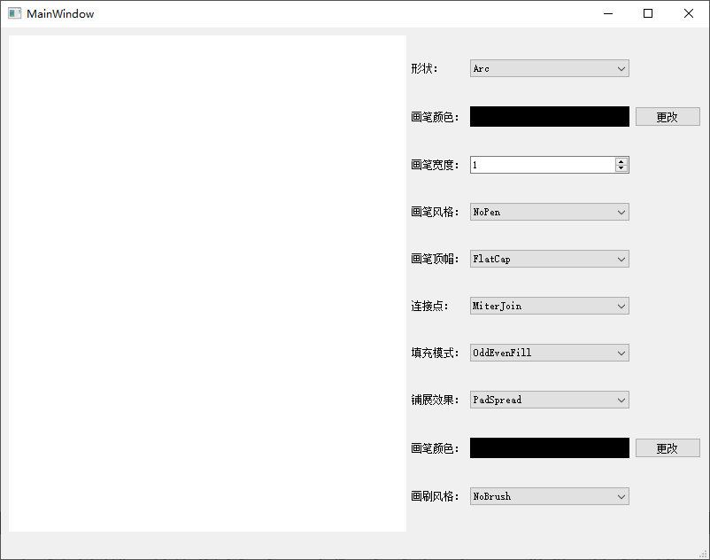


# 开发参考

## 富文本简介

感谢：https://www.pianshen.com/article/9810199340/

### 1、文档结构简介

 Qt中对富文本的处理分为了编辑操作和只读操作两种方式。 

- 编辑操作是使用基于光标的一些接口函数，这样更好的模拟了用户的编辑操作，更加容易理解，而且不会丢失底层的文档框架。
- 而对于文档结构的概览，使用了只读的分层次的接口函数，它们有利于文档的检索和输出。

对于文档的读取和编辑要使用不同方面的两组接口。

- 文档的光标主要基于`QTextCursor`类
- 文档的框架主要基于`QTextDocument`类

 一个富文本文档的结构被分为了几种元素来表示： 

- 框架（`QTextFrame`）
- 文本块（`QTextBlock`）
- 表格（`QTextTable`）
- 列表（`QTextList`）

 每种元素的格式又使用相应的format类来表示： 

- 框架格式（`QTextFrameFormat`）
- 文本块格式（`QTextBlockFormat`）
- 表格格式（`QTextTableFormat`）
- 列表格式（`QTextListFormat`）

 这些格式一般在编辑文档时使用，所以它们常和`QTextCursor`类配合使用。 

 因为`QTextEdit`类就是一个富文本编辑器，所以在构建`QTextEdit`类的对象时就已经构建了一个`QTextDocument`类对象和一个`QTextCursor`类对象，只需调用它们进行相应的操作即可。 

 一个空的文档包含了一个根框架（`Root frame`），这个根框架又包含了一个空的文本块（`Block`）。框架将一个文档分为多个部分，在根框架里可以再添加文本块、子框架和表格等。  

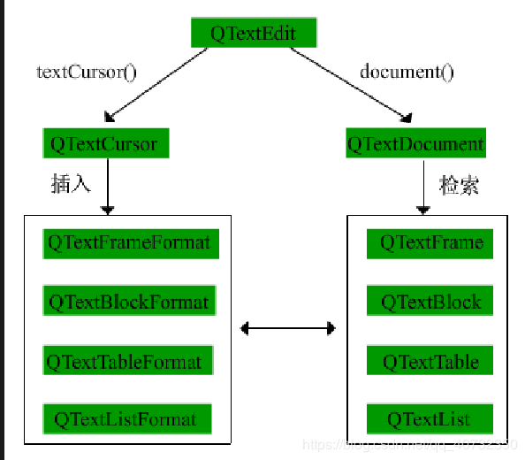

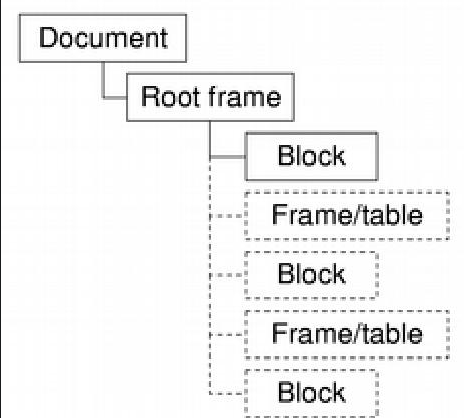

 **设置根框架** 

~~~c++
QTextDocument *document = ui->textEdit->document(); //获取文档对象

QTextFrame *rootFrame = document->rootFrame();      // 获取根框架
 
QTextFrameFormat format;                            // 创建框架格式
 
format.setBorderBrush(Qt::red);                     // 边界颜色
 
format.setBorder(3);                                // 边界宽度
 
rootFrame->setFrameFormat(format);                  // 框架使用格式
~~~

 **添加子框架** 

~~~C++
QTextFrameFormat frameFormat;
 
frameFormat.setBackground(Qt::lightGray);                // 设置背景颜色
 
frameFormat.setMargin(10);                               // 设置边距
 
frameFormat.setPadding(5);                               // 设置填衬
 
frameFormat.setBorder(2);
 
//设置边框样式
frameFormat.setBorderStyle(QTextFrameFormat::BorderStyle_Dotted); 
 
QTextCursor cursor = ui->textEdit->textCursor();         // 获取光标
 
cursor.insertFrame(frameFormat);                         // 在光标处插入框架
~~~

### **2 文本块**

文本块`QTextBlock`类为文本文档`QTextDocument`提供了一个文本片段（`QTextFragment`）的容器。

 一个文本块可以看做是一个段落，但是它不能使用回车换行，因为一个回车换行就表示创建一个新的文本块。`QTextBlock`提供了只读接口，它是前面提到的文档分层次的接口的一部分，如果`QTextFrame`看做是一层，那么其中的`QTextBlock`就是另一层。

文本块的格式由`QTextBlockFormat`类来处理，它主要涉及对齐方式，文本块四周的边白，缩进等内容。而文本块中的文本内容的格式，比如字体大小、加粗、下划线等内容，则由`QTextCharFormat`类来设置。

 **遍历框架** 

~~~c++
QTextDocument *document = ui->textEdit->document();
QTextFrame *frame = document->rootFrame();
QTextFrame::iterator it;                       // 建立QTextFrame类的迭代器
    for (it = frame->begin(); !(it.atEnd()); ++it) {
         QTextFrame *childFrame = it.currentFrame();// 获取当前框架的指针
         QTextBlock childBlock = it.currentBlock(); // 获取当前文本块
         if (childFrame)
             qDebug() << "frame";
         else if (childBlock.isValid())
             qDebug() << "block:" << childBlock.text();
    }
~~~

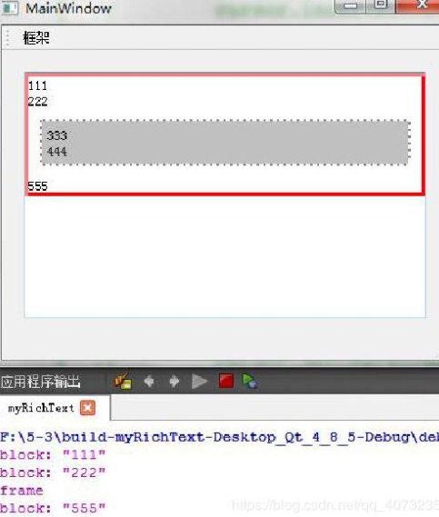

 **遍历子框架** 

~~~c++
QTextDocument *document = ui->textEdit->document();
    QTextBlock block = document->firstBlock();    // 获取文档的第一个文本块
    for (int i = 0; i < document->blockCount(); i++) {
        qDebug() << tr("文本块%1，文本块首行行号为:%2，长度为:%3,内容为：")
                    .arg(i).arg(block.firstLineNumber()).arg(block.length())
                    << block.text();
        block = block.next();                         // 获取下一个文本块
    }
~~~

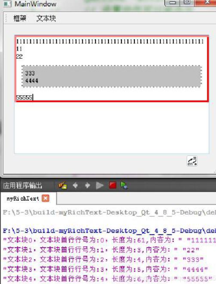

~~~C++
QTextCursor cursor = ui->textEdit->textCursor();
QTextBlockFormat blockFormat;      // 文本块格式
blockFormat.setAlignment(Qt::AlignCenter); // 水平居中
cursor.insertBlock(blockFormat);   // 使用文本块格式
QTextCharFormat charFormat;// 字符格式
charFormat.setBackground(Qt::lightGray);   // 背景色
charFormat.setForeground(Qt::blue);// 字体颜色
// 使用宋体，12号，加粗，倾斜
charFormat.setFont(QFont(tr("宋体"), 12, QFont::Bold, true)); 
charFormat.setFontUnderline(true); // 使用下划线
cursor.setCharFormat(charFormat);  // 使用字符格式
cursor.insertText(tr("测试字体")); // 插入文本
~~~

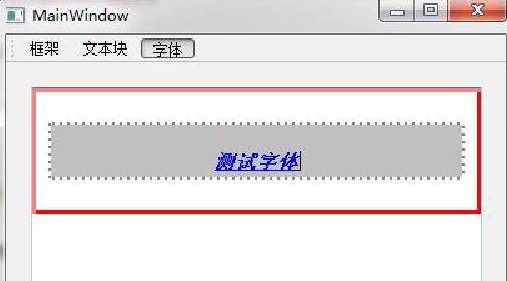

### **3 表格、列表和图片**

~~~C++
//插入表格   
    QTextCursor cursor = ui->textEdit->textCursor();
    QTextTableFormat format;          // 表格格式
    format.setCellSpacing(2);         // 表格外边白
    format.setCellPadding(10);        // 表格内边白
    cursor.insertTable(2, 2, format); // 插入2行2列表格
//插入列表
   QTextListFormat format;           // 列表格式
    format.setStyle(QTextListFormat::ListDecimal);   // 数字编号
    ui->textEdit->textCursor().insertList(format);
//插入图片
    QTextImageFormat format;          // 图片格式
    format.setName("logo.png");       // 图片路径
    ui->textEdit->textCursor().insertImage(format);
~~~

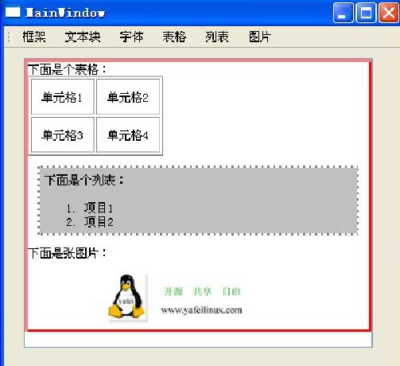

### **4 查找功能**

~~~C++
//查找文本   
   QDialog *dlg = new QDialog(this);         // 创建对话框
    lineEdit = new QLineEdit(dlg);            // 创建行编辑器
    QPushButton *btn = new QPushButton(dlg);  // 创建按钮
    btn->setText(tr("查找下一个"));
    connect(btn,SIGNAL(clicked()),this,SLOT(findNext())); // 关联信号和槽
    QVBoxLayout *layout = new QVBoxLayout;    // 创建垂直布局管理器
    layout->addWidget(lineEdit);              // 添加部件
    layout->addWidget(btn);
    dlg->setLayout(layout);                   // 在对话框中使用布局管理器
    dlg->show();
 
//查找下一个
   QString string = lineEdit->text();
    // 使用查找函数查找指定字符串，查找方式为向后查找
    bool isfind = ui->textEdit->find(string, QTextDocument::FindBackward);
    if(isfind){                // 如果查找成功，输出字符串所在行和列的编号
        qDebug() << tr("行号:%1 列号:%2")
                    .arg(ui->textEdit->textCursor().blockNumber())
                    .arg(ui->textEdit->textCursor().columnNumber());
    }
~~~

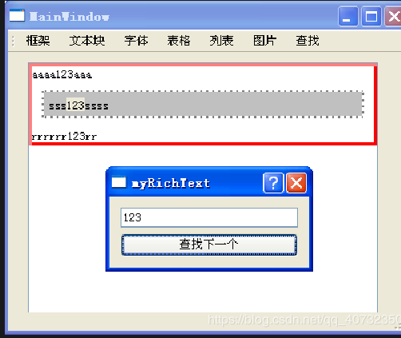

### **5 语法高亮**

在Qt的富文本处理中提供了`QSyntaxHighlighter`类来实现语法高亮。为了实现这个功能，需要创建`QSyntaxHighlighter`类的子类，然后重新实现`highlightBlock()`函数，使用时直接将`QTextDocument`类对象指针作为其父部件指针，这样就可以自动调用`highlightBlock()`函数了。

例如，自定义的类为`MySyntaxHighlighter`，像这样来使用：    `highlighter = new MySyntaxHighlighter(ui->textEdit->document());`    这里创建了`MySyntaxHighlighter`类的对象，并且使用编辑器的文档对象指针作为其参数，这样，每当编辑器中的文本改变时都会调用`highlightBlock()`函数来设置语法高亮。

重新实现`highlightBlock()`函数：

~~~c++
QTextCharFormat myFormat;             // 字符格式
     myFormat.setFontWeight(QFont::Bold);
     myFormat.setForeground(Qt::green);
     QString pattern = "\\bchar\\b";       // 要匹配的字符，这里是“char”单词
     QRegExp expression(pattern);          // 创建正则表达式
     int index = text.indexOf(expression); // 从位置0开始匹配字符串
     // 如果匹配成功，那么返回值为字符串的起始位置，它大于或等于0
     while (index >= 0) {    
         int length = expression.matchedLength(); // 要匹配字符串的长度
         setFormat(index, length, myFormat);      // 对要匹配的字符串设置格式
         index = text.indexOf(expression, index + length); // 继续匹配
     }
~~~

 在这里主要是使用了正则表达式和`QString`类的`indexOf()`函数来进行字符串的匹配，如果匹配成功，则使用`QSyntaxHighlighter`类的`setFormat()`函数来设置字符格式。 

### **6 HTML**

 在富文本处理中还提供了对HTML子集的支持，可以在`QLabel`或者`QTextEdit`添加文本时使用`HTML`标签或者`CSS`属性，例如： 

~~~c++
ui->textEdit->append(tr("<h1><font color=red>使用HTML</font></h1>"));  
~~~

 这里往编辑器中添加了文本，并且使用了`HTML`标签， 

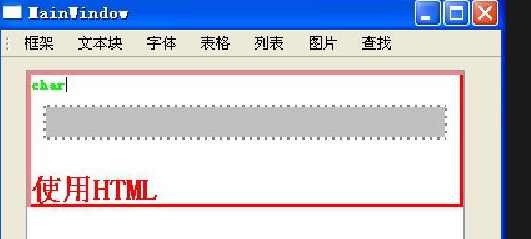

## `QTextCharFormat`

`QTextCharFormat`类提供了`QTextDocument`中字符的格式化信息。

文档中文本的字符格式指定文本的可视属性，以及关于其在超文本文档中的角色的信息。

可以通过向`setFont()`函数提供字体来设置所使用的字体，并且可以调整其外观的各个方面以获得所需的效果。`setFontFamily()`和`setFontPointSize()`定义字体的族(例如时间)和打印大小;`setFontWeight()`和`setFontItalic()`提供对字体样式的控制。`setFontUnderline()`、`setFontOverline()`、`setFontStrikeOut()`和`setFontFixedPitch(`为文本提供额外的效果。


调用`QTextCursor`的`mergeCharFormat()`函数把参数format所表示的格式应用到光标所在处的字符上。
调用`QTextEdit`的`mergeCurrentCharFormat()`函数把格式应用到选区内的所有字符上。             

### 1.设置字体

~~~C++
	fontlabel1 = new QLabel("字体");
    fontcombobox = new QFontComboBox;
    fontcombobox->setFontFilters(QFontComboBox::ScalableFonts); //列出所有字体
    //创建一个QTextCharFormat类实例
    QTextCharFormat fmt;
    //设置用户选择的字体族
    fmt.setFontFamily(combostr);
    //获取text中的光标
    QTextCursor cursor = ui->text->textCursor();
    //如果光标没有选择高亮
    if(!cursor.hasSelection())
    //选择光标下的字，以空格，“，”，“.”标点符号分隔
    cursor.select(QTextCursor::WordUnderCursor);
    //修改当前块的格式
    cursor.mergeBlockCharFormat(fmt);
    //通过tet上的光标调用函数将修饰符中指定属性合并为当前字符格式
    ui->text->mergeCurrentCharFormat(fmt);

~~~

### 2.设置字号

~~~c++
	QTextCharFormat fmt;
    fmt.setFontPointSize(spinvalue.toFloat());
    ui->text->mergeCurrentCharFormat(fmt);
~~~

### 3.设置加粗

	QTextCharFormat fmt;
	fmt.setFontWeight(boldBtn->isChecked()?QFont::bold():QFont::Normal);
	ui->text->mergeCurrentCharFormat(fmt);
### 4.设置倾斜

~~~c++
	QTextCharFormat fmt;
    fmt.setFontItalic(italicBtn->isChecked());
    ui->text->mergeCurrentCharFormat(fmt);
~~~

### 5.设置下划线

~~~C++
	QTextCharFormat fmt;
    fmt.setFontUnderline(underlineBtn->isChecked());
    ui->text->mergeCurrentCharFormat(fmt);
~~~

### 6.设置颜色

~~~c++
	QColor color = QColorDialog::getColor(Qt::red,this);
    if(color.isValid())
    {
        QTextCharFormat fmt;
        fmt.setForeground(color);
        ui->text->mergeCurrentCharFormat(fmt);
    }
~~~


## **`QFontComboBox`**

 `QFontComboBox()`是`QComboBox()`的一个子类，但是它的内容是不能被编辑的，主要是用来选择字体。 

### 1.设置和获取当前的字体

```c++
QFontComboBox.setCurrentFont(self, f: QtGui.QFont)      #设置字体
QFontComboBox.currentFont()                             #获取字体——>QFont
```

 注意的是当前显示的字体都是宋体的，即便选择了别的字体在文本框里显示效果都是宋体。 

###  2.设置字体过滤器 

 由于控件提供能够选择的字体种类太多，我们可以用过滤器来过滤控件的提供选项 。

```c++
setFontFilters(FontFilters filters);
```

`enum QFontComboBox::FontFilter`

| Constant                           | Value | Description             |
| ---------------------------------- | ----- | ----------------------- |
| `QFontComboBox::AllFonts`          | `0`   | Show all fonts          |
| `QFontComboBox::ScalableFonts`     | `0x1` | Show scalable fonts     |
| `QFontComboBox::NonScalableFonts`  | `0x2` | Show non scalable fonts |
| `QFontComboBox::MonospacedFonts`   | `0x4` | Show mono spaced fonts  |
| `QFontComboBox::ProportionalFonts` | `0x8` | Show proportional fonts |

### 3、信号 

 除了继承的父类信号外，`QFontComboBox()`还有另外一个信号， 信号还传递了选择的字体作为参数。我们可以这样使用 

```c++
currentFontChanged(const QFont & font)
```

### 4、使用

~~~c++
// 字体
m_pComboBoxFontType = new QFontComboBox;
m_pComboBoxFontType->setFontFilters(QFontComboBox::ScalableFonts);
~~~


## `QFontDatabase`

提供了底层窗口系统所提供的系统可用的字体。 

该类最常见的用法就是调用接口查询数据库，获取系统支持的字体，以及每种字体支持的大小和风格。`smoothSizes()`类似`pointSizes()`，但是前者返回的是在某种字体(family)下某种风格(style)支持的最好的字号。 

font()函数返回指定的字体，风格和字号的`QFont`。 

### 1、使用

~~~c++
QFontDatabase db;
foreach(int size, db.standardSizes())
	m_pComboxFontSize->addItem(QString::number(size));
~~~


## `QTextCursor`

### [官方文档](https://doc.qt.io/qt-5/qtextcursor.html)

 文本光标是用于通过模仿文本编辑器中光标行为的编程接口访问和修改文本文档的内容和底层结构的对象。 QTextCursor 包含有关光标在QTextDocument的位置以及它所做的任何选择的信息。 

 光标的当前`position()` 总是在字符串中的两个连续字符**之间**，或者*在*第一个字符**之前**或**之后**字符串中的最后一个字符。 

这里的QTextDocument可以视为一个长字符串，就选中字符串部分。


 在最简单的层次上，文本文档由一串字符组成，以某种方式标记以表示文档中文本的块结构。`QTextCursor`提供了一个基于指针的接口，允许在字符级别上操作`QTextDocument`的内容。由于元素(块、帧、表等)也编码在字符流中，因此文档结构本身可以由`QTextCursor`更改。 

 通过两种方式获取`QTextCursor`

  第一种： 

~~~c++
QTextEdit *editor = new QTextEdit();
QTextCursor cursor(editor->textCursor());
~~~

 第二种： 

~~~c++
QTextDocument *document = new QTextDocument(editor);
QTextCursor cursor(document);
~~~

还可以像操作数据库一样，开启事务

~~~c++
cursor.beginEditBlock();
cursor.movePosition(QTextCursor::StartOfWord);
cursor.movePosition(QTextCursor::EndOfWord, QTextCursor::KeepAnchor);
cursor.endEditBlock();
~~~

也可以获取多个`QTextCursor`。可以使用多个`QTextCursor`同时编辑同一个文档，尽管在`QTextEdit`小部件中只有一个`QTextCursor`对用户可见。`QTextDocument`确保每个`QTextCursor`正确地写入文本，并且不会干扰其他`QTextCursor`。

使用`QTextCursor`可以插入文档的元素：

`insertImage()`：将图像插入光标所在的文档

`insertText()`：将文本插入到光标所在位置的文档中

`insertFragment()`：将一个现有的文本片段插入到位于光标位置的文档中

`insertTable()`：在游标当前块之后将表插入文档，并将游标移动到表后面块的开头。

`insertList()`：将一个列表插入到文档中光标所在的位置，并将光标移动到列表中第一项的开头

`insertFrame()`：在光标当前块之后向文档中插入一个框架，并将光标移动到新框架中空块的开头。

`insertBlock()`：将一个新的文本块(段落)插入光标所在位置的文档中，并将光标移动到新块的开头


## connect简介

### 第一种

 老版本的 connect 写法，比较复杂些，需要将信号和槽进行明确的指定，包括形参。  

~~~C++
 connect(btn, SIGNAL(clicked()), this, SLOT(close()));
~~~

 写法比较麻烦，常常在用的时候缺少括号，不过该写法很明确，一眼就能看出来是将哪个信号连接到哪个槽 。

### 第二种

 `Qt5.0`以后推出一种新的写法 

~~~c++
connect(m_pBtn,&MyButton::sigClicked,this,&Widget::onClicked);
~~~

 这种写法看起来很简洁，但是存在一些坑需要注意，这句写法如果用在上面的示例中，会报错下面的错误： 

~~~shell
error: no matching member function for call to 'connect' connect(m_pBtn,&MyButton::sigClicked,this,&Widget::onClicked);
~~~

就是重载的时候，无法识别

所以重载的写法

~~~c++
connect(m_pBtn, static_cast<void (MyButton::*)(bool)>(&MyButton::sigClicked), this, &Widget::onClicked);
~~~

 问题又来了，如果我的`onClicked`槽也是重载的话，还是会报同样的错误。因为编译器不知道你想要真正连接哪个槽。所以这里建议，如果信号重载，可以用上面的方法来写，如果槽重载…还是用第一种方法来 connect 吧，比较保险，虽然比较麻烦点。 

### 第三种

 最新的写法 , 主要针对重载信号的连接做了调整，会更简单些：  

~~~c++
connect(m_pBtn, QOverload<bool>::of(&MyButton::sigClicked),this,&Widget::onClicked);
~~~

### 第四种：Lambda 函数写法

 如果槽函数中的内容比较简单的话，没必要再去单独定义一个槽来连接， 直接用Lambda 函数会更简单。  

~~~c++
connect(m_pBtn, QOverload<bool>::of(&MyButton::sigClicked),
               [=](bool check){
                /* do something.. */

                });

connect(m_pBtn, static_cast<void (MyButton::*)(bool)>(&MyButton::sigClicked), this, [=](bool check){
                 //do something

                 });
~~~

> Lambda 简介
>
> `[capture](parameters) mutable ->return-type{statement}`
>
> 1、`[capture]`：捕捉列表。捕捉列表总是出现在Lambda函数的开始处。实际上，[]是Lambda引出符。编译器根据该引出符判断接下来的代码是否是Lambda函数。捕捉列表能够捕捉上下文中的变量以供Lambda函数使用;
>
> 	参数列表：
> 	 	1.[var]表示值传递方式捕捉变量var；
> 	 	2.[=]表示值传递方式捕捉所有父作用域的变量（包括this）；父作用域：Lambda函数的语句块，说通俗点就是包含Lambda的“{}”代码块。
> 		3.[&var]表示引用传递捕捉变量var；
> 		4.[&]表示引用传递方式捕捉所有父作用域的变量（包括this）；
> 		5.[this]表示值传递方式捕捉当前的this指针。 
> 	组合使用：
> 		1.[=,&a,&b]表示以引用传递的方式捕捉变量a和b，以值传递方式捕捉其它所有变量;
> 		2.[&,a,this]表示以值传递的方式捕捉变量a和this，引用传递方式捕捉其它所有变量。
> 	错误组合：
> 		3.[=,a]这里已经以值传递方式捕捉了所有变量，但是重复捕捉a了，会报错的;
> 		4.[&,&this]这里&已经以引用传递方式捕捉了所有变量，再捕捉this也是一种重复。
>
> 2、`(parameters)`：参数列表。与普通函数的参数列表一致。如果不需要参数传递，则可以连同括号“()”一起省略;
>
> 3、`mutable：mutable`修饰符。默认情况下，Lambda函数总是一个`const`函数，mutable可以取消其常量性。在使用该修饰符时，参数列表不可省略（即使参数为空）;
>
> 4、`->return-type`：返回类型。用追踪返回类型形式声明函数的返回类型。我们可以在不需要返回值的时候也可以连同符号”->”一起省略。此外，在返回类型明确的情况下，也可以省略该部分，让编译器对返回类型进行推导;
>
> 5、`{statement}`：函数体。内容与普通函数一样，不过除了可以使用参数之外，还可以使用所有捕获的变量。
>
> 

## 右键菜单

`QWidget`及其子类都可有右键菜单，因为`QWidget`有以下两个与右键菜单有关的函数：

~~~C++
Qt::ContextMenuPolicy contextMenuPolicy () const;			// 获取右键菜单
void setContextMenuPolicy ( Qt::ContextMenuPolicy policy )
        
enum Qt::ContextMenuPolicy{ 
	Qt::DefaultContextMenu,
 	Qt::NoContextMenu, 
 	Qt::PreventContextMenu, 
 	Qt::ActionsContextMenu, 
    Qt::CustomContextMenu}
~~~

该属性的默认值为 `Qt::DefaultContextMenu`，这意味着调用 `contextMenuEvent()` 处理程序。其他值包括 `Qt::NoContextMenu`、`Qt::PreventContextMenu`、`Qt::ActionsContextMenu` 和 `Qt::CustomContextMenu`。

使用 `Qt::CustomContextMenu`，发出信号 `customContextMenuRequested()`。

### 使用方式：

 **1）默认是`Qt::DefaultContextMenu`。**
它是利用右键菜单事件`contextMenuEvent()`来处理。就是要重写`contextMenuEvent( QContextMenuEvent * event )`函数。 

 **2）使用`Qt::CustomContextMenu`** 

它是发出`QWidget::customContextMenuRequested`信号，注意仅仅只是发信号，意味着要自己写显示右键菜单的slot。这个信号是`QWidget`唯一与右键菜单有关的信号（也是自有的唯一信号），同时也是很容易被忽略的signal：`void customContextMenuRequested ( const QPoint & pos )`，该信号的发出条件是：用户请求`contextMenu`（常规就是鼠标右击啦）且同时被击的`widget`其`contextMenuPolicy`又是`Qt::CustomContextMenu`。


## 文件对话框过滤器

 首先说明一个示例，分析一下`Filter`属性的构成：`“ Excel文件|*.xls ”`，前面的“`Excel文件`”成为标签，是一个可读的字符串，可以自定定义，“`|*.xls`”是筛选器，表示筛选文件夹中后缀名为`.xls`的文件,“*”表示匹配`Excel`文件名称的字符串。 

格式： “标签|*.后缀 

 需要筛选多种文件，比方说需要筛选图片文件，但是图片文件的后缀有几种，例如`jpg、png、gif`等，当需要同时筛选这些文件，设置Filter属性为“`标签|*.jpg;*.png;*.gif`”，注意：只是在筛选器中多添加了几个后缀，不同后缀之间使用分号隔开 


## `QPrintDialog`

该对话框允许用户更改与文档相关的设置，例如纸张尺寸和方向、打印类型（彩色或灰度）、页面范围和要打印的份数。还提供了控件，使用户能够从可用的打印机中进行选择，包括任何已配置的网络打印机。

 QPrintDialog objects are constructed with a [QPrinter](https://doc.qt.io/qt-5/qprinter.html) object, and executed using the [exec](https://doc.qt.io/qt-5/qprintdialog.html#exec)() function. 

~~~c++
QPrinter printer;
QPrintDialog printDialog(printer, parent);
if (printDialog.exec() == QDialog::Accepted) {
    // print ...
}
~~~

## `QPrinter`

[官方文档](https://doc.qt.io/qt-5/qprinter.html)

| Header:   | #include <QPrinter>                                          |
| --------- | ------------------------------------------------------------ |
| qmake:    | QT += printsupport                                           |
| Inherits: | [QPagedPaintDevice](https://doc.qt.io/qt-5/qpagedpaintdevice.html) |

 该设备（  device ）表示一系列打印输出页面， 

 QPrinter不止可以操作打印机来打印纸张文件，并且可以将文件保存至磁盘，存储为pdf格式的文件。 


# 项目开发

## 简单文本编辑器

### 样式

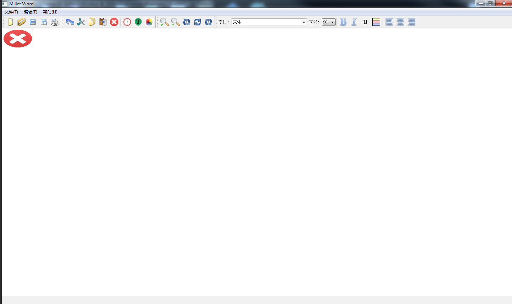

### 简介

* 可显示图片，有图片旋转镜像功能。
* 字体可放大缩小，更改字体，加粗，斜体，下划线，更改颜色，靠左，居中，靠右对齐。
* 打开，保存，插入图片，文字，打印等功能。


### 开发过程记录

前面，很简单吗，创建 `Action`，然后增加就行了。

#### 功能简介

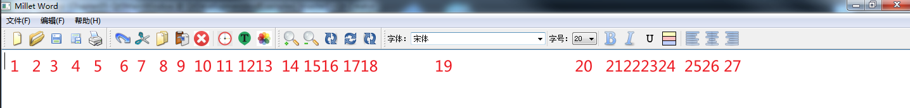

- [x] 01、新建：如果当前有内容，且有更改，则询问是否保存，然后在新建。

- [x] 02、打开：如果当前有内容，且有更改，则询问是否保存，然后在打开。

- [x] 03、保存：如果有文件名，则直接保存，如果没有，则打开保存文件对话框用户选择保存。

- [x] 04、另存：打开保存对话框，用户自定义，另存一份文件。

- [x] 05、打印：调用打印驱动，然后打印内容。

- [x] 06、撤销：撤销上次操作。

- [x] 07、剪切：这可以直接和 `QTextEdit` 的相绑定

- [x] 08、复制：

- [x] 09、粘贴：

- [x] 10、删除：删除选中部分

- [x] 11、插入时间：

- [x] 12、插入文件：

- [x] 13、插入图片：

- [ ] 14、放大：如果选中图片，则放大图片，如果选中文字，则放大文字，如果都选中，两者都放大。图片放大有问题，字体可放大

- [ ] 15、缩小：

- [ ] 16、旋转90°：顺时针旋转90°

- [ ] 17、旋转180°：

- [ ] 18、旋转270°：

- [x] 19、字体：设置选中及新增字为当前选中字体

- [x] 20、字号：设置选中及新增字为当前选中字号

- [x] 21、粗体：设置选中及新增字为加粗，或者取消加粗。如果当前为粗体，则取消加粗，显示未选择状态；如果为正常体，则加粗，**并显示为选中状态。**

- [x] 22、斜体：设置选中及新增字为斜体，或者取消斜体。如果当前为斜体，则取消斜体，显示未选择状态；如果为正常体，则斜体，**并显示为选中状态。**

- [x] 23、下划线：设置选中及新增字增加下划线。如果当前有下划线，则取消，显示未选择状态；如果为正常体，则增加下划线，**并显示为选中状态。**

- [x] 24、颜色：为选中部分和后续设置当前颜色，最好控件能改变颜色，这样一下就能看出来当前为什么颜色。

- [x] 25、靠左：

- [x] 26、居中：

- [x] 27、靠右：


这里区分 `Menu` 的 `Action` 和 `ToolBar` 的 `Widget` 的功能。

##### 不记状态

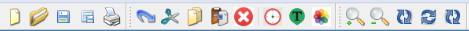

这部分，选中后不用记录状态，所以用个 Action就可以了，属于一次性使用

##### 记录状态

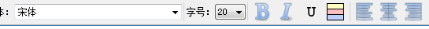

这部分属于，选中后要记录状态的，比如，选择加粗后，当前选中字需要加粗，后面的新增文字也要加粗，再次选中，则去除。其他同理

#### 菜单栏创建字体字号

##### 代码

创建 `ToolBar` 字体和字号部分的时候

~~~c++
// 字体
m_pComboBoxFontType = new QFontComboBox;
m_pComboBoxFontType->setFontFilters(QFontComboBox::ScalableFonts);
// 字号
QFontDatabase db;
foreach(int size, db.standardSizes())
	m_pComboxFontSize->addItem(QString::number(size));
~~~


#### 增加右键菜单功能

Policy：政策，方针

##### 代码

思路

* 设置 `setContextMenuPolicy ` 为 `CustomContextMenu`
* 创建一个`QMenu`
* 像 `QMenu` 里面增加 `Action`并绑定 `customContextMenuRequested`，这里要自己实现。

~~~c++
    m_pTextEdit->setContextMenuPolicy(Qt::CustomContextMenu);
    QMenu* stdMenu = new QMenu(m_pTextEdit);
    stdMenu->addAction(m_pInsertImageAction);

    QObject::connect(m_pTextEdit, &QTextEdit::customContextMenuRequested, [=](QPoint x)
                     {
                         stdMenu->move(m_pTextEdit->mapToGlobal(x));
                         stdMenu->show();
                     });

~~~

##### 过滤图片

 首先说明一个示例，分析一下`Filter`属性的构成：`“ Excel文件|*.xls ”`，前面的“`Excel文件`”成为标签，是一个可读的字符串，可以自定定义，“`|*.xls`”是筛选器，表示筛选文件夹中后缀名为`.xls`的文件,“*”表示匹配`Excel`文件名称的字符串。 

格式： “标签|*.后缀 

 需要筛选多种文件，比方说需要筛选图片文件，但是图片文件的后缀有几种，例如`jpg、png、gif`等，当需要同时筛选这些文件，设置Filter属性为“`标签|*.jpg;*.png;*.gif`”，注意：只是在筛选器中多添加了几个后缀，不同后缀之间使用分号隔开 


#### 修改 `connect`

~~~c++
// 先前
connect(m_pRotate270Action, SIGNAL(triggered()), this, SLOT(Rotate270()));
// 后使用
connect(m_pRotate270Action, &QAction::triggered, this, &EasyWord::Rotate270);
~~~


#### 插入时间

最开始采用 `QTextEdit::append()`函数，发现，会自动帮我换行，我还以为是我增加时间的时候获取的时间最后会有一个换行，还把他`Remove("\r\n")`，发现也不行，最后，直接使用字符串 `append`，发现还是会换行。所以采用获取鼠标位置的方式来增加字。

~~~c++
    QString strTime = QTime::currentTime().toString();
    //m_pTextEdit->append("strTime");	//error

    QTextCursor cursor = m_pTextEdit->textCursor();
    cursor.insertText(strTime);
~~~


#### 加粗，斜体，下划线

参考：富文本简介 --> 文本块(`QTextBlockFormat`)

`QTextBlockFormat`：

调用`QTextEdit`的`mergeCurrentCharFormat()`函数把格式应用到选区内的所有字符上。      


#### 对齐操作

`QTextEdit`  富文本操作，自带对齐

```c++
m_pTextEdit->setAlignment(Qt::AlignLeft);
```

#### 打印

[QPrintDialog Class](https://doc.qt.io/qt-5/qprintdialog.ht_ml)

其实打印就是重新绘制

~~~c++
    QPrinter printer;
    QPrintDialog printDialog(&printer, this);
    if (printDialog.exec() == QDialog::Accepted)
    {
        //----获取文本内容
        QTextDocument *doc = m_pTextEdit->document();
        // ---打开打印对话窗口
        doc->print(&printer);
    }
~~~


### 问题

#### 文字放大

在选中文本实现放大缩小的时候，设置 `m_pTextEdit->currentCharFormat();`始终不能获取正确的结果

~~~c++
    int nIndex = m_pComboxFontSize->currentIndex();
    if( (nIndex + 1) == m_pComboxFontSize->count())
        m_pComboxFontSize->setCurrentIndex(m_pComboxFontSize->count());
    else
        m_pComboxFontSize->setCurrentIndex(nIndex + 1 );

    int nFontSize = m_pComboxFontSize->currentText().toInt();
    QTextCharFormat fmt = m_pTextEdit->currentCharFormat();
    QFont font = fmt.font();

    font.setPixelSize(nFontSize);
    fmt.setFont(font);
    m_pTextEdit->mergeCurrentCharFormat(fmt);
~~~

之后修改方式，采用 `QTextCharFormat` 和 `QTextCursor`的组合来改变

`QTextCursor`：当前光标所在位置信息

`QTextCharFormat` ：字符属性

如果，光标所在位置往后，修改`QTextCharFormat` 的字体大小属性，那不就是像Word的刷子那样咯，那不就行咯

~~~c++

    double dFontSize = m_pComboxFontSize->currentText().toDouble();

    QTextCursor cursor = m_pTextEdit->textCursor();
    QTextCharFormat fmt;
    fmt.setFontPointSize(dFontSize);
    //fmt.setFont(QFont(fmt.fontFamily(), ));//参数依次是字体，大小，字体的粗细，以及是否斜体
    cursor.mergeCharFormat(fmt);
    //cursor.clearSelection();
    cursor.movePosition(QTextCursor::EndOfLine);//cursor和anchor均移至末尾
~~~

#### 图片缩放旋转

因为 `QTextImageFormat` 继承自 `QTextCharFormat`，所以，设置`QTextImageFormat`，但是参数是引用啊？？？？？

咋也能传入咧

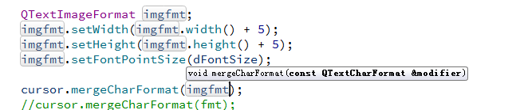

~~~C++
class Q_GUI_EXPORT QTextImageFormat : public QTextCharFormat
{
};
~~~


```
    QTextImageFormat imgfmt;
    imgfmt.setWidth(imgfmt.width() + 5);
    imgfmt.setHeight(imgfmt.height() + 5);
    imgfmt.setFontPointSize(dFontSize);

```

这里还不知道怎么获取图片大小。即使插入后设置 width 和 height 也不能得到。

<font color=red>这里留到后面来写把!!!!!!!!!!!!!!!!!!!!!!!继续后面任务</font>


## 绘图画板

这里，从创建控件，到绑定都很简单，挨着做就行了

### `connect`

connect 的时候，我采用了自定义信号，然后定义的信号里面去强转，主要是为了了解 **信号定义了槽的使用**，当然，这里也可以直接定义 lambda表达式或者，直接连接

#### 第一种：

直接连接，可以在接收方再强转


#### 第二种

发送信号

* 连接

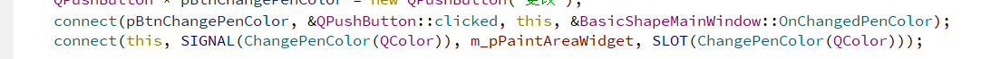

* 定义信号（发送类）

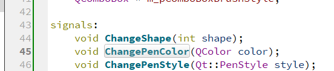

* 定义槽（接收类）

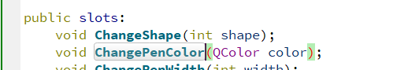

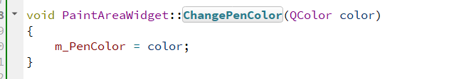

#### 第三种

lambda表达式

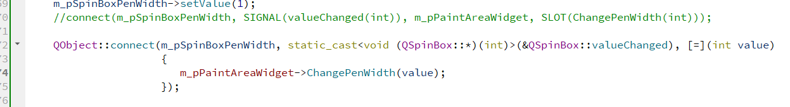

# 经验

1、官方文档真的很不错，多看官方文档，如果能看英文是最好的。比大多数博客不知道高到哪里去了。毕竟人家自己的东西。