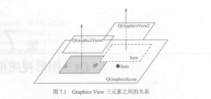
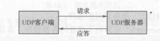
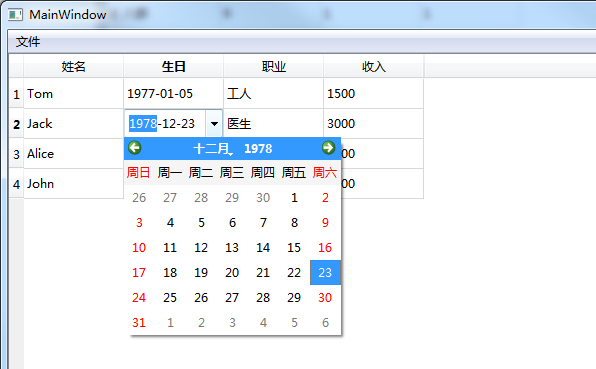

# Qt5开发实力（第三版）

## 模板库、工具类及控件

`QString、Qt容器类、QVariant、Qt`常用算法和基本正则表达式

### 容器类

`QObject`类及其子类不能存储在容器中，因为这些类没有赋值构造函数和赋值操作运算符。

~~~c++
// 例如
QList<QToolBar> listToolBar;

// 替换思路
QList<QToolBar*> listpToolBar;
~~~

存储在容器中的数据类型必须是**可赋值**的数据类型。

#### `QList、QLinkedList、QVector`

##### `QList`

是最常用的容器类、其子类有`QItemSelection`、`QQueue`、`QSignalSpy`、`QStringList`、`QTestEventList`
`QList<T>`维护了一个指针数组，该数组存储的指针指向 `QList<T>`存储的列表项的内容，因此，`QList<T>`提供了基于下标的快速访问。

存储策略：
	不同的数据类型，有不同的存储策略。

* 如果T是一个指针或指针大小的数据，那么直接存储到数组中。
* 如果T存储的对象是指针，则该指针指向实际的数据类型。

##### **`QLinkedList`** 

`QLinkedList<T>` 是一个链式列表，它以非连续的内存块保存数据。
`QLinkedList<T> ` 不能用下标访问，只能用迭代器访问。

##### `QVector`

`QVector<T>`在相邻的内存中存储给定的数据类型 T 的一组数值。在一个`QVector<T>`的前部或者中间位置进行插入是最慢的，因为大量的数据会去移动内存。

子类：`QPolygon、QPolygonF、QStack`

##### Java风格遍历容器

比 `STL` 使用方便，不过这也是损失性能为代价。

~~~c++
#include <QCoreApplication>
#include <QDebug>
#include <QList>
#include <QListIterator>

int main(int argc, char *argv[])
{
    QCoreApplication a(argc, argv);

    QList<int> list;
    list << 1 << 2 << 3 << 4 << 5;

    // 声明一个 迭代器，初始化绑定一个列表
    QListIterator<int> it(list);
    for( ; it.hasNext(); )
        qDebug() << it.next();
    return a.exec();
}
~~~

##### `STL`风格

`STL`风格比`JAVA`风格快的原因是，它直接指向的是列表项。

~~~c++
#include <QCoreApplication>
#include <QList>
#include <QListIterator>
#include <QDebug>

int main(int argc, char *argv[])
{
    QCoreApplication a(argc, argv);

    QList<int> list;
    list << 1 << 2 << 3 << 4 << 5;

    QList<int>::iterator it;
    for ( it = list.begin(); it != list.end(); ++it)
        qDebug() << *it ;

    return a.exec();
}
~~~

##### `QMap`和`QHash`

* `QHash`具有比`QMap`更快的查找速度。
* `QHash`以任意顺序存储数据项，而`QMap`总是按照`Key`的顺序存储数据。
* `QHash`的键类型`Key`必须提供 `operator == ()`和一个全局的`qHash(Key)`函数，而`QMap`的键类型 `Key`必须提供 `opreator < ()`函数。

### 控件

#### Button


`Push Button`：按钮

`Tool Button` ：工具按钮    和普通按钮相比，工具按钮一般不显示文本，而显示图标 

`Radio Button` ：单选按钮

`Check Box`： 复选框

`Command Link Button`：命令连接按钮

`Dialog Button Box`：对话框按钮盒

#### Input Widgets


  

`Combo Box`：下拉列表

`Font Combo Box`：字体下拉列表

`Line Edit`：单行文字

`Text Edit`：多行富文本编辑器，可显示 `HTML` 格式


`Plain Text Edit`：纯文本编辑框

`Spin Box`：数字显示框

`Double Spin Box`：双自旋盒

`Time Edit`：时间编辑

`Date Edit`：日期编辑

`Date/Time Edit`：日期/时间编辑

`Dial`：拨号


## 布局管理

### 分割窗体

步骤：

* 创建分割窗体，声明子窗口排序方向
* 创建Child Widget
* 创建其他的分割创

```c++
    QSplitter * pSplitterMain = new QSplitter(Qt::Horizontal, 0);
    QTextEdit * pTextEditLeft = new QTextEdit("Left", pSplitterMain);

    QSplitter * pSplitterRight = new QSplitter(Qt::Vertical, pSplitterMain);
    QTextEdit * pTextEditRightTop = new QTextEdit("Right Top", pSplitterRight);
    QTextEdit * pTextEditRightBottom = new QTextEdit("Right Bottom", pSplitterRight);

    pSplitterMain->show();
```


### 停靠窗

步骤：

* 创建一个主窗口
* 创建 `DockWidget`，设置属性，`DockWidget`增加控件，如下面增加`QTextEdit`

```c++
/// 停靠窗体
void MainWindow::ShowDockWidget()
{
    QMainWindow * pMainWindow = new QMainWindow;
    pMainWindow->setAttribute(Qt::WA_DeleteOnClose);

    // 设定主窗口
    QTextEdit * pTextEdit = new QTextEdit("Main Window", pMainWindow);
    pMainWindow->setCentralWidget(pTextEdit);

    // 设定第一个浮动窗口
    QDockWidget * pDockWidget = new QDockWidget("DockWidget1", pMainWindow);

    // 可移动
    pDockWidget->setFeatures(QDockWidget::DockWidgetMovable);
    pDockWidget->setAllowedAreas(Qt::LeftDockWidgetArea | Qt::RightDockWidgetArea);

    // 这里因为，DockWidget 只是一个容器，所以需要自己创建一个 Widget 来防止 btn和Text
    QWidget * pWidget = new QWidget();
    QTextEdit * pTextEdit1 = new QTextEdit("Text1");
    QPushButton * pBtn1 = new QPushButton("Btn");

    QHBoxLayout * pLayout = new QHBoxLayout(pDockWidget);
    pLayout->addWidget(pTextEdit1);
    pLayout->addWidget(pBtn1);

    pWidget->setLayout(pLayout);
    pDockWidget->setWidget(pWidget);
    pMainWindow->addDockWidget(Qt::RightDockWidgetArea, pDockWidget);

    // 第二个浮动窗口
    QDockWidget * pDockWidget2 = new QDockWidget("DockWidget2", pMainWindow);
    pDockWidget2->setFeatures(QDockWidget::DockWidgetMovable | QDockWidget::DockWidgetClosable);
    pDockWidget2->setAllowedAreas(Qt::LeftDockWidgetArea | Qt::RightDockWidgetArea);

    QTextEdit * pTextEdit2 = new QTextEdit("Text2", pMainWindow);
    pDockWidget2->setWidget(pTextEdit2);
    pMainWindow->addDockWidget(Qt::RightDockWidgetArea, pDockWidget2);

    // 第三个浮动窗口
    QDockWidget * pDockWidget3 = new QDockWidget("DockWidget3", pMainWindow);
    pDockWidget3->setFeatures(QDockWidget::DockWidgetMovable |
                              QDockWidget::DockWidgetClosable |
                              QDockWidget::DockWidgetFloatable);
    pDockWidget3->setAllowedAreas(Qt::LeftDockWidgetArea | Qt::RightDockWidgetArea);

    QTextEdit * pTextEdit3 = new QTextEdit("Text3", pMainWindow);
    pDockWidget3->setWidget(pTextEdit3);
    pMainWindow->addDockWidget(Qt::RightDockWidgetArea, pDockWidget3);

    pMainWindow->show();

}
```


### 堆栈窗体

~~~c++
    //QWidget * pMainWindow = new QWidget;
    QMainWindow * pMainWindow = new QMainWindow;
    //pMainWindow->setCentralWidget();

    pMainWindow->setAttribute(Qt::WA_DeleteOnClose);

    QListWidget * pList = new QListWidget(pMainWindow);  //新建一个QListWidget对象
    pList->insertItem(0, ("window0"));  //插入三个条目
    pList->insertItem(1, ("window1"));
    pList->insertItem(2, ("window2"));

    QLabel * label0 = new QLabel(("windowTest0"));  //新建三个标签对象，作为堆栈窗口需要显示的三层窗体
    QLabel * label1 = new QLabel(("windowTest1"));
    QLabel * label2 = new QLabel(("windowTest2"));

    QStackedWidget* pStack = new QStackedWidget(pMainWindow);  //新建一个堆栈窗体对象
    pStack->addWidget(label0);       //将新建的三个QLabel标签控件依次插入堆栈窗体中
    pStack->addWidget(label1);
    pStack->addWidget(label2);

    QHBoxLayout *pMainLayout = new QHBoxLayout(); //对整个对话框进行布局
    pMainLayout->setMargin(5); //设置对话框的边距为5
    pMainLayout->setSpacing(5); //设置各个控件之间的间距为5
    pMainLayout->addWidget(pList);
    pMainLayout->addWidget(pStack, 0, Qt::AlignHCenter);
    pMainLayout->setStretchFactor(pList, 1);  //设置list为可伸缩控件
    pMainLayout->setStretchFactor(pStack,3);

    pMainWindow->setLayout(pMainLayout);

    //将 QListWidget的currentRowChanged信号和堆栈窗体的setCurrentIndex槽函数连接起来，实现按选择显示窗体。
    connect(pList, SIGNAL(currentRowChanged(int)), pStack, SLOT(setCurrentIndex(int)));

    pMainWindow->show();
~~~


控件挤成一坨了，是因为创建的是 `QMainWindow`，而`QMainWindow`（常用窗口->主窗口），最外面没有 布局。所以就是一坨了。

修改为创建 `QWidget`，或者 `QMainWindow::setCentralWidget `。

```c++
/// 堆栈窗体
/// 实际过程中，堆栈窗体常与 QListWidget QComboBox 使用
   //QWidget * pMainWindow = new QWidget;
    QMainWindow * pMainWindow = new QMainWindow;
    //pMainWindow->setCentralWidget();

    pMainWindow->setAttribute(Qt::WA_DeleteOnClose);

    QListWidget * pList = new QListWidget(pMainWindow);  //新建一个QListWidget对象
    pList->insertItem(0, ("window0"));  //插入三个条目
    pList->insertItem(1, ("window1"));
    pList->insertItem(2, ("window2"));

    QLabel * label0 = new QLabel(("windowTest0"));  //新建三个标签对象，作为堆栈窗口需要显示的三层窗体
    QLabel * label1 = new QLabel(("windowTest1"));
    QLabel * label2 = new QLabel(("windowTest2"));

    QStackedWidget* pStack = new QStackedWidget(pMainWindow);  //新建一个堆栈窗体对象
    pStack->addWidget(label0);       //将新建的三个QLabel标签控件依次插入堆栈窗体中
    pStack->addWidget(label1);
    pStack->addWidget(label2);

    QHBoxLayout *pMainLayout = new QHBoxLayout(); //对整个对话框进行布局
    pMainLayout->setMargin(5); //设置对话框的边距为5
    pMainLayout->setSpacing(5); //设置各个控件之间的间距为5
    pMainLayout->addWidget(pList);
    pMainLayout->addWidget(pStack, 0, Qt::AlignHCenter);
    pMainLayout->setStretchFactor(pList, 1);  //设置list为可伸缩控件
    pMainLayout->setStretchFactor(pStack,3);

    pMainWindow->setLayout(pMainLayout);

    //将 QListWidget的currentRowChanged信号和堆栈窗体的setCurrentIndex槽函数连接起来，实现按选择显示窗体。
    connect(pList, SIGNAL(currentRowChanged(int)), pStack, SLOT(setCurrentIndex(int)));

    pMainWindow->show();
```


## 常用窗口

### 主窗口

`QMainWindow` 包含一个 菜单栏`menu bar` ，多个工具栏`tool bars` 多个锚部件`dock widgets`  一个状态栏 `status bar` 以及一个中心部件`central widget`。


#### 菜单栏

一系列命令的列表，使用 `QAction`来表示这些命令。一个窗口最多只有一个菜单栏。

#### 状态栏

显示应用程序的一些状态，位于底部，用户可以再状态栏上添加，使用 QT 窗口部件。一个主窗口最多只有一个状态栏。

#### 工具栏

由一系列类似于按钮的动作排列而成的面板，它通常由一些经常使用的命令（动作）完成，工具栏位于菜单栏下方，状态栏上面，可以停靠左右上下四个方向。一个主窗口可以包含多个工具栏。

#### 锚接部件

作为一个容器使用，包容其他窗口部件来实现某些功能

> Qt设计器 的属性编辑器，对象监视器等都是由锚接部件包容其他的Qt窗口部件来实现。它位于工具栏区的内部。可以作为一个窗口自由浮动在主窗口上。

可以停靠在上下左右，可以有多个锚部件。

#### 中心部件

中心部件处于锚接部件区的内部，主窗口的中心。一个主窗口只有一个中心部件。


### 标准窗口

#### 文件标准对话框

~~~c++
    // 获取打开文件路径及文件名
	QString strFileName = QFileDialog::getOpenFileName();
    ui->leFilePath->setText(strFileName);

    // 获取用户保存的用户名
    strFileName = QFileDialog::getSaveFileName();
    ui->leFilePath->setText(strFileName);

    // 获取用户选择的已存在的目录
    strFileName = QFileDialog::getExistingDirectory();
    ui->leFilePath->setText(strFileName);

    // 获取打开选择的文件名列表
    QStringList strList = QFileDialog::getOpenFileNames();
~~~


#### 颜色选择对话框

~~~c++
    QColor color = QColorDialog::getColor();
    if( color.isValid() )
    {
        qDebug() << color;

        ui->frameColor->setFrameShape(QFrame::Box);

        // 当使用QPalette为窗口设定背景并使用QPalette::Window时
        // 必须调用setAutoFillBackground(true)!!!
        ui->frameColor->setAutoFillBackground(true);
        ui->frameColor->setPalette(QPalette(color));
    }
~~~


#### 字体选择对话框

~~~c++
    bool ok = true;

// ok == true，返回用户选择字体， ok == false 返回默认字体
    QFont font = QFontDialog::getFont( &ok);
    ui->lleStdFont->setFont(font);
~~~


#### 标准输入对话框

~~~c++
    QInputDialog::getText(nullptr, "Input Text", "get Text");

    QStringList listItem;
    listItem << "111" << "222" << "333" ;
    QInputDialog::getItem(nullptr, "Input Text", "get Item", listItem);

    QInputDialog::getInt(nullptr, "Input Text", "get Int");

    QInputDialog::getDouble(nullptr, "Input Text", "get Double");
~~~


#### 消息对话框

常用的消息对话框包括

Question，Information ，Warning，Critical（严重警告），About，About Qt，Custom

其中，Question，Information，Warning，Critical用法差不多，图标，按钮，一条提示信息。

~~~c++
    QMessageBox::question( nullptr, "question", "question");
    QMessageBox::information( nullptr, "information", "information");
    QMessageBox::warning( nullptr, "warning", "warning");
    QMessageBox::critical( nullptr, "critical", "critical");

    QMessageBox::about( nullptr, "about", "about");
    QMessageBox::aboutQt(nullptr);
~~~


#### 用户自定义对话框

就是自己增加按钮，提示等信息

~~~c++
    QMessageBox customMsgBox;
    customMsgBox.setWindowTitle("用户自定义消息对话框");

    customMsgBox.setText("用户自定义消息对话框 的提示信息");
    customMsgBox.setIconPixmap(QPixmap("F:\\lena-0.jpg"));

    customMsgBox.addButton(new QPushButton("确定"), QMessageBox::ActionRole );
    customMsgBox.addButton(new QPushButton("取消"), QMessageBox::ActionRole );

    customMsgBox.exec();

    QString strText = customMsgBox.clickedButton()->text();

    //ui->leCustomerMsg->setText(strText);

    if( customMsgBox.clickedButton()->text() == "确定" )
        ui->leCustomerMsg->setText("点击了确定");
    else if( customMsgBox.clickedButton()->text() == "取消" )
        ui->leCustomerMsg->setText("点击了取消");
~~~


### 工具盒类

~~~c++
    QVBoxLayout * pMainVBox = new QVBoxLayout();

    QToolBox * pToolBox = new QToolBox(this);

    QGroupBox * pMyFrient = new QGroupBox();
    QVBoxLayout *pMyFrientLayout = new QVBoxLayout(pMyFrient);

    QToolButton * pToolButton1 = new QToolButton();
    pToolButton1->setText("张三");
    pMyFrientLayout->addWidget(pToolButton1);

    QToolButton * pToolButton2 = new QToolButton();
    pToolButton2->setText("李四");
    pMyFrientLayout->addWidget(pToolButton2);


    QGroupBox * pSchoolFrientBox = new QGroupBox();
    QVBoxLayout *pSchoolFrientLayout = new QVBoxLayout(pSchoolFrientBox);

    QToolButton * pToolButton3 = new QToolButton();
    pToolButton3->setText("张三同学");
    pSchoolFrientLayout->addWidget(pToolButton3);

    QToolButton * pToolButton4 = new QToolButton();
    pToolButton4->setText("李四同学");
    pSchoolFrientLayout->addWidget(pToolButton4);

    pToolBox->addItem((QWidget*)pMyFrient, "我的好友");
    pToolBox->addItem((QWidget*)pSchoolFrientBox, "校友");

    pMainVBox->addWidget(pToolBox);

    this->setLayout(pMainVBox);
~~~

#### 结果


简单来说就是套娃，`QToolBox `增加 `QGroupBox`，`QGroupBox`添加`QToolButton`。

### 进度条

~~~c++
#include "qtprogress.h"
#include "ui_qtprogress.h"

#include <QProgressDialog>
#include <QPalette>

QtProgress::QtProgress(QWidget *parent) :
    QWidget(parent),
    ui(new Ui::QtProgress)
{
    ui->setupUi(this);

    ui->comboBox->insertItem(0, "对话框");
    ui->comboBox->insertItem(1, "进度条");

    ui->lineEdit->setText("1000");

    ui->progressBar->setValue(0);

//    QPalette palette;
//    ui->progressBar->setPalette(palette);

}

QtProgress::~QtProgress()
{
    delete ui;
}

void QtProgress::on_pushButton_clicked()
{
    int nNum =ui->lineEdit->text().toUInt();
    ui->progressBar->setRange(0, nNum);
    ui->progressBar->setValue(0);

    if(ui->comboBox->currentIndex() == 1)
    {
        for(int i = 1; i <= nNum; ++i)
        {
            ui->progressBar->setValue(i);
            _sleep(10);
        }
    }
    else
    {
        QProgressDialog * pDlg  = new QProgressDialog(this);

        pDlg->setWindowModality(Qt::WindowModal);	// 模态显示
        pDlg->setMinimumDuration(5);				// 设置低于 5 ms 就不显示对话框
        pDlg->setWindowTitle("Please Wait");
        pDlg->setLabelText("Copying...");
        pDlg->setCancelButtonText("Cancle");

        pDlg->setRange(0, nNum);

        for(int i = 1; i <= nNum; ++i)
        {
            if( pDlg->wasCanceled() )
                break;

            pDlg->setValue(i);
            _sleep(10);
        }
    }
}
~~~

##### 对话框模式


##### 进度条


## 调色板和电子钟

###  `QPalette `

用来专门管理对话框的外观显示，管理控件或窗体的所有颜色信息。

#### 两个基本概念

##### `ColorGroup`

~~~c++
enum ColorGroup { Active, Disabled, Inactive, NColorGroups, Current, All, Normal = Active };
~~~

* `QPalette::Active`：获得焦点的状态
* `QPalette::Inactive`：未获得焦点的状态
* `QPalette::Disabled`：不可用的状态

##### `ColorRole`

颜色主题，对窗体中不同部位颜色的分类。

比如：`QPalette::Windows`为背景色；`QPalette::WindowText`为前景色

~~~c++
    enum ColorRole { WindowText, Button, Light, Midlight, Dark, Mid,
                     Text, BrightText, ButtonText, Base, Window, Shadow,
                     Highlight, HighlightedText,
                     Link, LinkVisited,
                     AlternateBase,
                     NoRole,
                     ToolTipBase, ToolTipText,
                     PlaceholderText,
                     NColorRoles = PlaceholderText + 1,
#if QT_DEPRECATED_SINCE(5, 13)
                     Foreground Q_DECL_ENUMERATOR_DEPRECATED_X("Use QPalette::WindowText instead") = WindowText,
                     Background Q_DECL_ENUMERATOR_DEPRECATED_X("Use QPalette::Window instead") = Window
#endif
                   };
~~~

#### 结果

主要还是用了 `setColor()` 接口，就是要注意要先调用，要不然不会改变

~~~c++
setAutoFillBackground(true);
~~~


### `QTime`

#### 格式

其实这个主要就是格式问题

~~~C++
    QTime time = QTime::currentTime();
    QString text = time.toString("hh:mm:ss");
~~~

实现一个电子时钟


这个示例另一个需要注意的就是坐标系的问题，详细请看代码。`Chapter4-Qt5BasicDialog -> qttimedialog.cpp`


## 可扩展对话框

就是点击详细，然后下面再显示，默认不显示


这种一般固定大小，如果像 `MFC` 有 `MoveWindow()` 那就直接`MoveWindow`这种宽高咯。

Qt 里面没有，那就用布局咯，上下布局，下面的不显示就可以咯。详细看代码。

### 过程

最开始直接 布局作为成员变量，准备点 详细的时候，直接 布局  hide()，结果没有  hide();

```
QVBoxLayout 没有隐藏功能，所以，需要一个 widget 作为容器来实现隐藏效果
```

增加 widget 作为容器来接收，发现，点击详细位置会变化，这肯定是有问题的撒。


这种情况是由于自适应大小导致的。所以需要在最终的 `mainLayout `设置固定尺寸。

~~~c++
pMainLayout->setSizeConstraint(QLayout::SetFixedSize);
~~~


## 不规则对话框

实现原理：利用 Mask 将窗体部分遮罩。窗体还是原来那个，只是说看不到部分了。

~~~c++
// 采用图片
setMask(QBitmap(pix));

// 采用 Region
 int side = qMin(width(), height());
  QRegion maskedRegion(width() / 2 - side / 2, height() / 2 - side / 2, side,
  side, QRegion::Ellipse);
  setMask(maskedRegion);

~~~

### 实现

好家伙，居然弄成这种了？？？？？？？不科学啊 麻子点点点


晚点看看参数什么含义。


## 开机动画

### 原理

所谓开机动画，那肯定 main 函数里面修改咯

~~~C++
int main(int argc, char *argv[])
{
    QApplication a(argc, argv);

    QSplashScreen screen(QPixmap("d:\\d7f82e12762a65d9164a53bcc960e9b6.jpg"));	// 加载图片
    screen.show();		// 显示
    a.processEvents();	// 显示开机动画的时候可以接受其他事件
    MainWindow w;
    w.show();
    screen.finish(&w);	//主窗体初始化完成后，关闭动画
    return a.exec();
}
~~~


## 图形和图像

### 窗体位置

qt 自己的接口和他们的位置关系


*  x()、y()、pos()获得整个窗体左上角的位置； 

* geometry()获得窗体内中央区域的左上角顶点坐标和长、宽；

* frameGeometry()获得整个窗体的左上角顶点位置和长、宽。
* rect()，size() 获得的结果也是和中央区域一样


### 基础图形绘制

#### 示意图


## 双缓冲绘图

就是先绘制到一张图上，然后内存拷贝到窗口上，这样在大量绘制的时候，不会出现闪烁的情况。和 `MFC` 的差不多，就不介绍了。


## 图形视图框架

**Graphics View**

### 特点

* 在这个框架中，可以利用Qt绘图系统的反锯齿，`OpenGL`工具来改善绘图性能。
* 支持事件传播体系结构，可以使图元在场景（`sence`）中的交互能力提高一倍，图元能处理键盘事件和鼠标事件。
* 在Graphics View框架中，通过二元空间划分树（`Binary Space Partitioning，BSP`）提供快速的图元查找。

### `Graphics View`三元素

* 场景类（`QGraphicsSence`）：提供管理图元的**容器**
* 视图类（`QGraphicsView`）：图元显示的地方，可视化窗口
* 图元类（`QGraphicsItem`）：图元

**三者的关系**




#### 场景类：`QGraphicsScene`

放置图元的**<font color=red>容器</font>**，当然就有 `addItem()`等接口。

主要工作为传递事件，管理各个图元状态等

#### 视图类：`QGraphicsView`

提供一个可视化窗口，显示图元。同一场景中，可以有多个视图。

是一个可滚动的窗口部件，如果要使用 `OpenGL`，则可以使用`QGraphicsView::setViewport()`将视图设置为`QGLWidget`。

视图接收键盘鼠标的输入事件，并将他们翻译为场景事件（坐标转换为场景坐标），使用变换矩阵函数，`QGraphicsView::matrix()`可以变换场景的坐标，实现场景的缩放和旋转。`QGraphicsView`提供`QGraphicsView::mapToScene()`和`QGraphicsView::mapFromScene()`用于与场景的坐标进行转换。

#### 图元类：`QGraphicsItem`

场景中个图元的基类，在他基础上继承出各种图元类，Qt预设的有一部分包括直线（`QGraphicsLineItem`）、椭圆（`QGraphicsEllipseItem`），文本图元（`QGraphisTextItem`）、矩形（`QGraphicsRectItem`）等。

当然，也可以自定义，继承`QGraphicsItem`就可以，有以下主要功能：

* 处理鼠标事件（点击，移动。。。），右键菜单
* 键盘事件
* 拖曳事件
* 分组
* 碰撞检测

此外，图元也有自己的坐标系统，也提供场景和图元，也可包含子图元。


### 坐标系统

`GraphicsView`基于笛卡尔坐标系，一个图元的场景具有 (x,y) 坐标，当没有使用变换的视图观察场景时候，场景中的一个单元对应屏幕的一个像素。

#### 场景坐标

所有图元的基础坐标系统，场景坐标描述了顶层的图元，每个图元都有场景坐标和相应的包容框，场景坐标的原点在场景中心，坐标原点是x轴正方向向右，y轴正方向向下。


#### 视图坐标

窗口部件的坐标，视图坐标的单位是像素，`QGraphicsView`视图的左上角为（0，0），x轴正方向向右，y轴正方向向下。所有的鼠标事件最开始都是使用视图坐标。`QGraphicsView`继承自`QWidget`类。


#### 图元坐标

图元使用本地坐标，图元中心为原点，也是变换的原点，x轴正方向向右，y轴正方向向下。创建图元后，只需注意图元坐标就可以了。`QGraphicsScene`和`QGraphicsView`会完成所有的变换。

根据需要，Qt提供了三个坐标之间的互相转换函数，以及图元和图元之间的转换函数，若需从`QGraphicsItem`类的`paint()`函数重绘图元时，则以此坐标系为基准。

若需从`QGraphicsItem`坐标系中的某一点坐标转换到场景中的坐标，则可调用`QGraphicsItem::mapToScene()`函数进行映射，而`QGraphicsItem::mapToParent()`函数则可将`QGraphicsItem`坐标系中的某点映射到他的上一级坐标系中，可能是场景坐标系，也可能是另一个`QGraphicsItem`坐标。


|             映射函数             |     转换函数     |
| :------------------------------: | :--------------: |
|  `QGraphicsView::mapToScene()`   |    视图到场景    |
| `QGraphicsView::mapFromScene()`  |    场景到视图    |
| `QGraphicsItem::mapFromScene()`  |    场景到图元    |
|  `QGraphicsItem::mapToScene()`   |    图元到场景    |
| ``QGraphicsItem::mapToParent()`  |  子图元到父图元  |
| `QGraphicsItem::mapFromParent()` |  父图元到子图元  |
|   `QGraphicsItem::mapToItem()`   | 本图元到其他图元 |
|  `QGraphicsItem::mapFromItem()`  | 其他图元到本图元 |
|                                  |                  |


具体项目见[项目开发---->高级绘图板]()；


## 模型/视图结构

这个和.net core那个差不多，就`MVC`模式

* 表示数据的模型（`Model`）
* 用户界面的视图（`View`）
* 用户界面操作的控制器（`Controller`），只是 Qt 中叫做 `Delegate`

所以可叫做 MVD


Qt中，是`InterView`框架，把视图和控制器部件结合在一起了。为了灵活处理用户输入，`InterView`框架引入了代理（`delegate`，和.net 那个差不多，委托），通过代理，可以自定义数据条目（item）的显示和编辑方式。

​	所以Qt中，模型视图结构分为三部分

* 模型（Model）：与数据源通信，并为其他部件提供接口。
* 视图（View）：从模型中获得用来引用数据条目的模型索引。
* 代理（Delegate）：负责绘制数据条目，当编辑条目时，代理和模型直接进行通信。

MCV之间通过信号和槽进行通信。

* 数据发送变化时候，模型发出信号，通知视图
* 用户对界面进行操作时候，视图发出信号
* 代理发出信号告知模型和视图编辑器目前的状态。


### 模型（Model）

`InterView`框架中的所有模型都基于抽象基类（`QAbstractItemModel`），继承自他的类

* `QProxyModel`：

* `QAbstractListModel`：列表模型的抽象基类

* `QAbstractTableModel`：表格模型的抽象基类

* `QAbstractProxyModel`：

* `QDirModel`：文件和目录的存储模型

* `QFileSystemModel`：

* `QHelpContentModel`：

* `QStandarItemModel`：

  

### 视图（View）

`InterView` 框架的所有视图都基于抽象基类（`QAbstractItemModel`）类，继承自他的类

* `QColumView`：
* `QHeaderView`：
* `QListView`：继承自他的类`QUndoView`和`QListWidget`
* `QTableView`：继承自他的类`QTableWidget`类继承
* `QTreeView`：继承自他的类，`QTreeWidget`，

其中 `QListTree`，`QTableWidget`，`QTreeWidget`类实际上已经包含了数据，是模型/数据继承在一起的类。


### 代理（Delegate）

`InterView`框架中的所有代理都是基于抽象类，`QAbstractItemDeletgate`，此类的子类：

* `QItemDelegate`：表示数据库中关系代理的`QSqlRelationalDelegate`继承。
* `QStyleItemDelegate`


### 使用

Qt中，提供了一些可以直接使用的模型类和视图类，QStandardItemModel，QDirModel，QStringListModel，QColumnView，QHeaderView，QListView，QTableView，QTreeView等等

可见 **项目开发 -- > 目录游览器，数据直方图，表格使用控件修改**

视图设置模型，视图上进行操作，操作在修改模型。


## 文件及磁盘处理

Qt 提供了 QFile类用于进行文件操作，QFile 类提供了读写文件的接口，可以读写**文本文件、二进制文件和Qt的资源文件**。

处理文本文件和二进制文件的时候，可以使用 `QTextStream`和`QDataStream`类。

处理临时文件的时候，可以使用`QTemporaryFile`。

监视文件和目录变化使用 `QFileSystemWatcher`。

获取文件信息使用 `QFileInfo`。

处理目录使用`QDir`。


### 读写文件

两种方式，`QFile`，`QTextStream`

`QFile`：读写文件的接口。

`QTextStream`：更方便读写文本

`QDataStream`：提供二进制文件串行化的功能。使用这个就是要注意数据类型要对上。


### 目录操作于文件系统

`QDir`：存取目录结构和内容的能力，使用它可以操作目录，存取目录或文件信息，操作底层文件系统，而且还可以存取Qt资源文件。

Qt 中使用 “/” 作为通用目录分隔符，因为跨平台，所以 Linux 会自动转换为 '/' ，Windows 会自动转换为'\\' ，**所以，最好都用'/'**

`QDir`可以使用相对路径或者绝对路径指向文件

> isRelative() 和 isAbsolute()  可判断绝对或者相对，makeAbsolute() 可以将相对转为绝对。
>
> 如果是当前目录 则 为 **‘.’**

### 文件信息

`QFileInfo`，提供了对文件进行操作时获得的文件相关属性信息：包括，文件名，文件大小，创建时间，修改时间，最后访问时间及一些文件属性如读写属性，是文件还是目录。。。

### 监视文件和目录变化

#### [`QFileSystemWatcher`](https://doc.qt.io/qt-5/qfilesystemwatcher.html)


## 网络开发

Qt 提供的`QtNetwork`模块，封装了一套套接字 `API`。

### 基于UDP的网络广播程序

用户数据报协议（`User Data Protocol，UDP`）不可靠，数据报，无连接的传输层协议。

使用场合

* 网络数据大多为短消息
* 拥有大量客户端
* 对数据安全性无特殊要求
* 网络负担非常重要，但对响应要求高

#### 工作原理

`UDP`客户端向`UDP`服务器发送请求报文，长度和系统协议有关，但不能超过`IP`协议规定的`64KB`，因为`TCP/UDP`协议下层还要增加`IP`包头，UDP服务器同样以报文形式做出响应。如果双方都没收到请求，则都不会重发。所以，不可靠啊~~




#### 编程模型


客户端并不与服务器建立连接，他负责调用发送函数向服务端发出数据报，类似的，服务器也不从客户端接收连接，只负责调用接收函数，等待来自某客户端的数据的到达。

Qt中通过 `QUdpSocket` 类实现`UDP` 协议的编程。

一个简单的服务端修改信息后立刻发送服务端的程序。


这里要注意，中文传输是有问题的。


怎么解决这个问题了，客户端和服务端采用 utf8的 方式收发。

~~~c++
// Server
		// 关键点
        QByteArray datagram = str.toUtf8().data();

        bool bRet = m_pUdpSocket->writeDatagram(
            datagram,
            datagram.size(),
            QHostAddress::Broadcast, m_nPort) == datagram.size();
        if(bRet)
            qDebug() << "发送成功" ;

// Client
    while (m_pUdpSocket->hasPendingDatagrams())
    {
        QByteArray datagram;
        datagram.resize(m_pUdpSocket->pendingDatagramSize());
        m_pUdpSocket->readDatagram(datagram.data(), datagram.size());
		//解码成 utf8
        QString str = QString::fromUtf8(datagram.data());
        ui->textEdit->append(str);
    }
~~~

### 基于TCP的网络聊天程序

传输控制协议是一种可靠，面向连接，面向数据流的传输协议。

> 数据流就是，我发送我的，你接收你的，不用管我怎么发送，也不管你怎么接受，我一直发，你可以接收一部分，喝个茶再回来接收。
>
> 数据报就是，我发送多少次，你就要接收多少次，次数坏了，那可就错了。错了就错了，我也不管。

#### 模型


使用 `QTcpSocket` 和 `QTcpSocket`类实现TCP协议的编程。

#### 聊天室

##### 服务端流程图


1、首先增加模块

~~~c++
QT += network
~~~

2、新建服务器 -- 客户端部分 socket

~~~C++
class TcpClientSocket : public QTcpSocket
{
    Q_OBJECT
public:
    TcpClientSocket(QObject * parent = 0);

signals:
    void ClientSentMessageSignal(QString);
    void DisConnectedSignal(int);

protected slots:
    void OnDateRecevied();
    void OnDisConnected();
};
~~~

3、新建服务器  --  服务端部分

~~~c++
class TcpServer : public QTcpServer
{
    Q_OBJECT
public:
    TcpServer(QObject * parent = 0, int nPort = 0);

signals:
    void UpdateServerUi(QString msg);

public slots:
    // 处理客户端已发送消息的信号
    void OnClientSentMessage(QString msg);

    // 断开链接 通过 socked 描述符 删除
    void OnDisConnected(int nDesc);

    // 对发送来的客户端信息进行广播
    void NotifyAllClients(QString msg);

protected:
    // 当有一个新连接的时候，触发这个函数 增加 客户端
    void incomingConnection(qintptr handle) override;

private:
    // 保存每一个客户端 socket
    QList<TcpClientSocket *> m_listTcpClientSocket;
};
~~~

##### 客户端部分

1、新建客户端 socket

~~~c++
class MainWindow : public QMainWindow
{
    Q_OBJECT

public:
    MainWindow(QWidget *parent = nullptr);
    ~MainWindow();

private slots:
    void on_btnSend_clicked();
    void on_btnJoinChatRoom_clicked();

    void OnConnected();
    void OnDisConnected();
    void OnDataRecived();

    void on_leUserName_textChanged(const QString &arg1);

    void OnSendMsgToServer(const QString arg1);
private:
    Ui::MainWindow *ui;

    bool m_bStaus;
    int m_nPort;
    QString m_strUserName;
    QHostAddress * m_pServerIP;
    QTcpSocket * m_pTcpSocket;
};
~~~

#### 流程


### 网络编程

#### 文件下载

 `QNetworkAccessManager`，`QNetworkRequest`，`QNetworkReply`。

`QNetworkAccessManager`统一管理下载请求，

发起一个请求

~~~c++
QUrl url;
m_pReply = m_pNetworkAccessManager->get(QNetworkRequest(url));
~~~

当一个请求完成的时候，会发出信号：

~~~c++
Q_SIGNALS:
void finished(QNetworkReply *reply);
~~~

> 记得要调用 `QNetworkReply::deleteLater()`来让操作系统自己在合适的时间释放这个请求。

`QNetworkReply`请求过程中会发出信号：

~~~c++
Q_SIGNALS:   
void uploadProgress(qint64 bytesSent, qint64 bytesTotal);
void downloadProgress(qint64 bytesReceived, qint64 bytesTotal);
~~~

所以，可以知道下载进度


## 事件处理

简单来说就是重写一系列虚函数

~~~c++
// class  QWidget

protected:
    // Event handlers
    bool event(QEvent *event) override;
    virtual void mousePressEvent(QMouseEvent *event);
    virtual void mouseReleaseEvent(QMouseEvent *event);
    virtual void mouseDoubleClickEvent(QMouseEvent *event);
    virtual void mouseMoveEvent(QMouseEvent *event);
#if QT_CONFIG(wheelevent)
    virtual void wheelEvent(QWheelEvent *event);
#endif
    virtual void keyPressEvent(QKeyEvent *event);
    virtual void keyReleaseEvent(QKeyEvent *event);
    virtual void focusInEvent(QFocusEvent *event);
    virtual void focusOutEvent(QFocusEvent *event);
    virtual void enterEvent(QEvent *event);
    virtual void leaveEvent(QEvent *event);
    virtual void paintEvent(QPaintEvent *event);
    virtual void moveEvent(QMoveEvent *event);
    virtual void resizeEvent(QResizeEvent *event);
    virtual void closeEvent(QCloseEvent *event);
#ifndef QT_NO_CONTEXTMENU
    virtual void contextMenuEvent(QContextMenuEvent *event);
#endif
#if QT_CONFIG(tabletevent)
    virtual void tabletEvent(QTabletEvent *event);
#endif
#ifndef QT_NO_ACTION
    virtual void actionEvent(QActionEvent *event);
#endif

#if QT_CONFIG(draganddrop)
    virtual void dragEnterEvent(QDragEnterEvent *event);
    virtual void dragMoveEvent(QDragMoveEvent *event);
    virtual void dragLeaveEvent(QDragLeaveEvent *event);
    virtual void dropEvent(QDropEvent *event);
#endif

    virtual void showEvent(QShowEvent *event);
    virtual void hideEvent(QHideEvent *event);

#if QT_VERSION >= QT_VERSION_CHECK(6, 0, 0)
    virtual bool nativeEvent(const QByteArray &eventType, void *message, qintptr *result);
#else
    virtual bool nativeEvent(const QByteArray &eventType, void *message, long *result);
#endif

    // Misc. protected functions
    virtual void changeEvent(QEvent *);

    int metric(PaintDeviceMetric) const override;
    void initPainter(QPainter *painter) const override;
    QPaintDevice *redirected(QPoint *offset) const override;
    QPainter *sharedPainter() const override;

    virtual void inputMethodEvent(QInputMethodEvent *);


// QMouseEvent
#ifndef QT_NO_INTEGER_EVENT_COORDINATES
    inline QPoint pos() const { return l.toPoint(); }
    inline QPoint globalPos() const { return s.toPoint(); }
    inline int x() const { return qRound(l.x()); }
    inline int y() const { return qRound(l.y()); }
    inline int globalX() const { return qRound(s.x()); }
    inline int globalY() const { return qRound(s.y()); }
#endif
    const QPointF &localPos() const { return l; }
    const QPointF &windowPos() const { return w; }
    const QPointF &screenPos() const { return s; }
    inline Qt::MouseButton button() const { return b; }
    inline Qt::MouseButtons buttons() const { return mouseState; }
~~~

这些都是基本的，点进去源码看就知道了


### 事件过滤器

Qt 的事件模型中，提供的事件过滤器，使得，一个`QObject `对象可以监视另一个`QObject`对象中的事件，通过在一个 `QObject`对象中安装事件过滤器，可以在事件到达该对象之前补货事件，从而达到监视的作用


该感觉就是这样，安装事件过滤器后，先到达监视对象，在到达对象本身。

~~~c++
// QMainWindow --> this
m_pRightLable->installEventFilter(this);
// RightLable 安装事件过滤器，监视的对象是 this，所以RightLable的事件先到达 bool QMainWindow::eventFilter(QObject *, QEvent *);

class QMainWindow 
{
    public slots:
    bool eventFilter(QObject *, QEvent *);
}

// 下面就是说 m_pLeftLable的鼠标按压事件 和 m_pRightLable 的键盘按压事件都不会响应
// 剩下的返回给上层处理
bool MainWindow::eventFilter(QObject * watched, QEvent * event)
{
    if(watched == m_pLeftLable)
    {
        if(event->type() == QEvent::MouseButtonPress)
        {
            return true;
        }
    }

    if(watched == m_pRightLable)
    {
        if(event->type() == QEvent::KeyPress)
        {
            return true;
        }
    }

    // 返回给上层的事件过滤器
    return QWidget::eventFilter(watched, event);
}
~~~


## 多线程

`Qt` 中采用 `QThread` 来实现


# 开发参考

## 富文本简介

感谢：https://www.pianshen.com/article/9810199340/

### 1、文档结构简介

 Qt中对富文本的处理分为了编辑操作和只读操作两种方式。 

- 编辑操作是使用基于光标的一些接口函数，这样更好的模拟了用户的编辑操作，更加容易理解，而且不会丢失底层的文档框架。
- 而对于文档结构的概览，使用了只读的分层次的接口函数，它们有利于文档的检索和输出。

对于文档的读取和编辑要使用不同方面的两组接口。

- 文档的光标主要基于`QTextCursor`类
- 文档的框架主要基于`QTextDocument`类

 一个富文本文档的结构被分为了几种元素来表示： 

- 框架（`QTextFrame`）
- 文本块（`QTextBlock`）
- 表格（`QTextTable`）
- 列表（`QTextList`）

 每种元素的格式又使用相应的format类来表示： 

- 框架格式（`QTextFrameFormat`）
- 文本块格式（`QTextBlockFormat`）
- 表格格式（`QTextTableFormat`）
- 列表格式（`QTextListFormat`）

 这些格式一般在编辑文档时使用，所以它们常和`QTextCursor`类配合使用。 

 因为`QTextEdit`类就是一个富文本编辑器，所以在构建`QTextEdit`类的对象时就已经构建了一个`QTextDocument`类对象和一个`QTextCursor`类对象，只需调用它们进行相应的操作即可。 

 一个空的文档包含了一个根框架（`Root frame`），这个根框架又包含了一个空的文本块（`Block`）。框架将一个文档分为多个部分，在根框架里可以再添加文本块、子框架和表格等。  


 **设置根框架** 

~~~c++
QTextDocument *document = ui->textEdit->document(); //获取文档对象

QTextFrame *rootFrame = document->rootFrame();      // 获取根框架
 
QTextFrameFormat format;                            // 创建框架格式
 
format.setBorderBrush(Qt::red);                     // 边界颜色
 
format.setBorder(3);                                // 边界宽度
 
rootFrame->setFrameFormat(format);                  // 框架使用格式
~~~

 **添加子框架** 

~~~C++
QTextFrameFormat frameFormat;
 
frameFormat.setBackground(Qt::lightGray);                // 设置背景颜色
 
frameFormat.setMargin(10);                               // 设置边距
 
frameFormat.setPadding(5);                               // 设置填衬
 
frameFormat.setBorder(2);
 
//设置边框样式
frameFormat.setBorderStyle(QTextFrameFormat::BorderStyle_Dotted); 
 
QTextCursor cursor = ui->textEdit->textCursor();         // 获取光标
 
cursor.insertFrame(frameFormat);                         // 在光标处插入框架
~~~

### **2 文本块**

文本块`QTextBlock`类为文本文档`QTextDocument`提供了一个文本片段（`QTextFragment`）的容器。

 一个文本块可以看做是一个段落，但是它不能使用回车换行，因为一个回车换行就表示创建一个新的文本块。`QTextBlock`提供了只读接口，它是前面提到的文档分层次的接口的一部分，如果`QTextFrame`看做是一层，那么其中的`QTextBlock`就是另一层。

文本块的格式由`QTextBlockFormat`类来处理，它主要涉及对齐方式，文本块四周的边白，缩进等内容。而文本块中的文本内容的格式，比如字体大小、加粗、下划线等内容，则由`QTextCharFormat`类来设置。

 **遍历框架** 

~~~c++
QTextDocument *document = ui->textEdit->document();
QTextFrame *frame = document->rootFrame();
QTextFrame::iterator it;                       // 建立QTextFrame类的迭代器
    for (it = frame->begin(); !(it.atEnd()); ++it) {
         QTextFrame *childFrame = it.currentFrame();// 获取当前框架的指针
         QTextBlock childBlock = it.currentBlock(); // 获取当前文本块
         if (childFrame)
             qDebug() << "frame";
         else if (childBlock.isValid())
             qDebug() << "block:" << childBlock.text();
    }
~~~


 **遍历子框架** 

~~~c++
QTextDocument *document = ui->textEdit->document();
    QTextBlock block = document->firstBlock();    // 获取文档的第一个文本块
    for (int i = 0; i < document->blockCount(); i++) {
        qDebug() << tr("文本块%1，文本块首行行号为:%2，长度为:%3,内容为：")
                    .arg(i).arg(block.firstLineNumber()).arg(block.length())
                    << block.text();
        block = block.next();                         // 获取下一个文本块
    }
~~~


~~~C++
QTextCursor cursor = ui->textEdit->textCursor();
QTextBlockFormat blockFormat;      // 文本块格式
blockFormat.setAlignment(Qt::AlignCenter); // 水平居中
cursor.insertBlock(blockFormat);   // 使用文本块格式
QTextCharFormat charFormat;// 字符格式
charFormat.setBackground(Qt::lightGray);   // 背景色
charFormat.setForeground(Qt::blue);// 字体颜色
// 使用宋体，12号，加粗，倾斜
charFormat.setFont(QFont(tr("宋体"), 12, QFont::Bold, true)); 
charFormat.setFontUnderline(true); // 使用下划线
cursor.setCharFormat(charFormat);  // 使用字符格式
cursor.insertText(tr("测试字体")); // 插入文本
~~~


### **3 表格、列表和图片**

~~~C++
//插入表格   
    QTextCursor cursor = ui->textEdit->textCursor();
    QTextTableFormat format;          // 表格格式
    format.setCellSpacing(2);         // 表格外边白
    format.setCellPadding(10);        // 表格内边白
    cursor.insertTable(2, 2, format); // 插入2行2列表格
//插入列表
   QTextListFormat format;           // 列表格式
    format.setStyle(QTextListFormat::ListDecimal);   // 数字编号
    ui->textEdit->textCursor().insertList(format);
//插入图片
    QTextImageFormat format;          // 图片格式
    format.setName("logo.png");       // 图片路径
    ui->textEdit->textCursor().insertImage(format);
~~~


### **4 查找功能**

~~~C++
//查找文本   
   QDialog *dlg = new QDialog(this);         // 创建对话框
    lineEdit = new QLineEdit(dlg);            // 创建行编辑器
    QPushButton *btn = new QPushButton(dlg);  // 创建按钮
    btn->setText(tr("查找下一个"));
    connect(btn,SIGNAL(clicked()),this,SLOT(findNext())); // 关联信号和槽
    QVBoxLayout *layout = new QVBoxLayout;    // 创建垂直布局管理器
    layout->addWidget(lineEdit);              // 添加部件
    layout->addWidget(btn);
    dlg->setLayout(layout);                   // 在对话框中使用布局管理器
    dlg->show();
 
//查找下一个
   QString string = lineEdit->text();
    // 使用查找函数查找指定字符串，查找方式为向后查找
    bool isfind = ui->textEdit->find(string, QTextDocument::FindBackward);
    if(isfind){                // 如果查找成功，输出字符串所在行和列的编号
        qDebug() << tr("行号:%1 列号:%2")
                    .arg(ui->textEdit->textCursor().blockNumber())
                    .arg(ui->textEdit->textCursor().columnNumber());
    }
~~~


### **5 语法高亮**

在Qt的富文本处理中提供了`QSyntaxHighlighter`类来实现语法高亮。为了实现这个功能，需要创建`QSyntaxHighlighter`类的子类，然后重新实现`highlightBlock()`函数，使用时直接将`QTextDocument`类对象指针作为其父部件指针，这样就可以自动调用`highlightBlock()`函数了。

例如，自定义的类为`MySyntaxHighlighter`，像这样来使用：    `highlighter = new MySyntaxHighlighter(ui->textEdit->document());`    这里创建了`MySyntaxHighlighter`类的对象，并且使用编辑器的文档对象指针作为其参数，这样，每当编辑器中的文本改变时都会调用`highlightBlock()`函数来设置语法高亮。

重新实现`highlightBlock()`函数：

~~~c++
QTextCharFormat myFormat;             // 字符格式
     myFormat.setFontWeight(QFont::Bold);
     myFormat.setForeground(Qt::green);
     QString pattern = "\\bchar\\b";       // 要匹配的字符，这里是“char”单词
     QRegExp expression(pattern);          // 创建正则表达式
     int index = text.indexOf(expression); // 从位置0开始匹配字符串
     // 如果匹配成功，那么返回值为字符串的起始位置，它大于或等于0
     while (index >= 0) {    
         int length = expression.matchedLength(); // 要匹配字符串的长度
         setFormat(index, length, myFormat);      // 对要匹配的字符串设置格式
         index = text.indexOf(expression, index + length); // 继续匹配
     }
~~~

 在这里主要是使用了正则表达式和`QString`类的`indexOf()`函数来进行字符串的匹配，如果匹配成功，则使用`QSyntaxHighlighter`类的`setFormat()`函数来设置字符格式。 

### **6 HTML**

 在富文本处理中还提供了对HTML子集的支持，可以在`QLabel`或者`QTextEdit`添加文本时使用`HTML`标签或者`CSS`属性，例如： 

~~~c++
ui->textEdit->append(tr("<h1><font color=red>使用HTML</font></h1>"));  
~~~

 这里往编辑器中添加了文本，并且使用了`HTML`标签， 


## `QTextCharFormat`

`QTextCharFormat`类提供了`QTextDocument`中字符的格式化信息。

文档中文本的字符格式指定文本的可视属性，以及关于其在超文本文档中的角色的信息。

可以通过向`setFont()`函数提供字体来设置所使用的字体，并且可以调整其外观的各个方面以获得所需的效果。`setFontFamily()`和`setFontPointSize()`定义字体的族(例如时间)和打印大小;`setFontWeight()`和`setFontItalic()`提供对字体样式的控制。`setFontUnderline()`、`setFontOverline()`、`setFontStrikeOut()`和`setFontFixedPitch(`为文本提供额外的效果。


调用`QTextCursor`的`mergeCharFormat()`函数把参数format所表示的格式应用到光标所在处的字符上。
调用`QTextEdit`的`mergeCurrentCharFormat()`函数把格式应用到选区内的所有字符上。             

### 1.设置字体

~~~C++
	fontlabel1 = new QLabel("字体");
    fontcombobox = new QFontComboBox;
    fontcombobox->setFontFilters(QFontComboBox::ScalableFonts); //列出所有字体
    //创建一个QTextCharFormat类实例
    QTextCharFormat fmt;
    //设置用户选择的字体族
    fmt.setFontFamily(combostr);
    //获取text中的光标
    QTextCursor cursor = ui->text->textCursor();
    //如果光标没有选择高亮
    if(!cursor.hasSelection())
    //选择光标下的字，以空格，“，”，“.”标点符号分隔
    cursor.select(QTextCursor::WordUnderCursor);
    //修改当前块的格式
    cursor.mergeBlockCharFormat(fmt);
    //通过tet上的光标调用函数将修饰符中指定属性合并为当前字符格式
    ui->text->mergeCurrentCharFormat(fmt);

~~~

### 2.设置字号

~~~c++
	QTextCharFormat fmt;
    fmt.setFontPointSize(spinvalue.toFloat());
    ui->text->mergeCurrentCharFormat(fmt);
~~~

### 3.设置加粗

	QTextCharFormat fmt;
	fmt.setFontWeight(boldBtn->isChecked()?QFont::bold():QFont::Normal);
	ui->text->mergeCurrentCharFormat(fmt);
### 4.设置倾斜

~~~c++
	QTextCharFormat fmt;
    fmt.setFontItalic(italicBtn->isChecked());
    ui->text->mergeCurrentCharFormat(fmt);
~~~

### 5.设置下划线

~~~C++
	QTextCharFormat fmt;
    fmt.setFontUnderline(underlineBtn->isChecked());
    ui->text->mergeCurrentCharFormat(fmt);
~~~

### 6.设置颜色

~~~c++
	QColor color = QColorDialog::getColor(Qt::red,this);
    if(color.isValid())
    {
        QTextCharFormat fmt;
        fmt.setForeground(color);
        ui->text->mergeCurrentCharFormat(fmt);
    }
~~~


## **`QFontComboBox`**

 `QFontComboBox()`是`QComboBox()`的一个子类，但是它的内容是不能被编辑的，主要是用来选择字体。 

### 1.设置和获取当前的字体

```c++
QFontComboBox.setCurrentFont(self, f: QtGui.QFont)      #设置字体
QFontComboBox.currentFont()                             #获取字体——>QFont
```

 注意的是当前显示的字体都是宋体的，即便选择了别的字体在文本框里显示效果都是宋体。 

###  2.设置字体过滤器 

 由于控件提供能够选择的字体种类太多，我们可以用过滤器来过滤控件的提供选项 。

```c++
setFontFilters(FontFilters filters);
```

`enum QFontComboBox::FontFilter`

| Constant                           | Value | Description             |
| ---------------------------------- | ----- | ----------------------- |
| `QFontComboBox::AllFonts`          | `0`   | Show all fonts          |
| `QFontComboBox::ScalableFonts`     | `0x1` | Show scalable fonts     |
| `QFontComboBox::NonScalableFonts`  | `0x2` | Show non scalable fonts |
| `QFontComboBox::MonospacedFonts`   | `0x4` | Show mono spaced fonts  |
| `QFontComboBox::ProportionalFonts` | `0x8` | Show proportional fonts |

### 3、信号 

 除了继承的父类信号外，`QFontComboBox()`还有另外一个信号， 信号还传递了选择的字体作为参数。我们可以这样使用 

```c++
currentFontChanged(const QFont & font)
```

### 4、使用

~~~c++
// 字体
m_pComboBoxFontType = new QFontComboBox;
m_pComboBoxFontType->setFontFilters(QFontComboBox::ScalableFonts);
~~~


## `QFontDatabase`

提供了底层窗口系统所提供的系统可用的字体。 

该类最常见的用法就是调用接口查询数据库，获取系统支持的字体，以及每种字体支持的大小和风格。`smoothSizes()`类似`pointSizes()`，但是前者返回的是在某种字体(family)下某种风格(style)支持的最好的字号。 

font()函数返回指定的字体，风格和字号的`QFont`。 

### 1、使用

~~~c++
QFontDatabase db;
foreach(int size, db.standardSizes())
	m_pComboxFontSize->addItem(QString::number(size));
~~~


## `QTextCursor`

### [官方文档](https://doc.qt.io/qt-5/qtextcursor.html)

 文本光标是用于通过模仿文本编辑器中光标行为的编程接口访问和修改文本文档的内容和底层结构的对象。 QTextCursor 包含有关光标在QTextDocument的位置以及它所做的任何选择的信息。 

 光标的当前`position()` 总是在字符串中的两个连续字符**之间**，或者*在*第一个字符**之前**或**之后**字符串中的最后一个字符。 

这里的QTextDocument可以视为一个长字符串，就选中字符串部分。


 在最简单的层次上，文本文档由一串字符组成，以某种方式标记以表示文档中文本的块结构。`QTextCursor`提供了一个基于指针的接口，允许在字符级别上操作`QTextDocument`的内容。由于元素(块、帧、表等)也编码在字符流中，因此文档结构本身可以由`QTextCursor`更改。 

 通过两种方式获取`QTextCursor`

  第一种： 

~~~c++
QTextEdit *editor = new QTextEdit();
QTextCursor cursor(editor->textCursor());
~~~

 第二种： 

~~~c++
QTextDocument *document = new QTextDocument(editor);
QTextCursor cursor(document);
~~~

还可以像操作数据库一样，开启事务

~~~c++
cursor.beginEditBlock();
cursor.movePosition(QTextCursor::StartOfWord);
cursor.movePosition(QTextCursor::EndOfWord, QTextCursor::KeepAnchor);
cursor.endEditBlock();
~~~

也可以获取多个`QTextCursor`。可以使用多个`QTextCursor`同时编辑同一个文档，尽管在`QTextEdit`小部件中只有一个`QTextCursor`对用户可见。`QTextDocument`确保每个`QTextCursor`正确地写入文本，并且不会干扰其他`QTextCursor`。

使用`QTextCursor`可以插入文档的元素：

`insertImage()`：将图像插入光标所在的文档

`insertText()`：将文本插入到光标所在位置的文档中

`insertFragment()`：将一个现有的文本片段插入到位于光标位置的文档中

`insertTable()`：在游标当前块之后将表插入文档，并将游标移动到表后面块的开头。

`insertList()`：将一个列表插入到文档中光标所在的位置，并将光标移动到列表中第一项的开头

`insertFrame()`：在光标当前块之后向文档中插入一个框架，并将光标移动到新框架中空块的开头。

`insertBlock()`：将一个新的文本块(段落)插入光标所在位置的文档中，并将光标移动到新块的开头


## connect简介

### 第一种

 老版本的 connect 写法，比较复杂些，需要将信号和槽进行明确的指定，包括形参。  

~~~C++
 connect(btn, SIGNAL(clicked()), this, SLOT(close()));
~~~

 写法比较麻烦，常常在用的时候缺少括号，不过该写法很明确，一眼就能看出来是将哪个信号连接到哪个槽 。

### 第二种

 `Qt5.0`以后推出一种新的写法 

~~~c++
connect(m_pBtn,&MyButton::sigClicked,this,&Widget::onClicked);
~~~

 这种写法看起来很简洁，但是存在一些坑需要注意，这句写法如果用在上面的示例中，会报错下面的错误： 

~~~shell
error: no matching member function for call to 'connect' connect(m_pBtn,&MyButton::sigClicked,this,&Widget::onClicked);
~~~

就是重载的时候，无法识别

所以重载的写法

~~~c++
connect(m_pBtn, static_cast<void (MyButton::*)(bool)>(&MyButton::sigClicked), this, &Widget::onClicked);
~~~

 问题又来了，如果我的`onClicked`槽也是重载的话，还是会报同样的错误。因为编译器不知道你想要真正连接哪个槽。所以这里建议，如果信号重载，可以用上面的方法来写，如果槽重载…还是用第一种方法来 connect 吧，比较保险，虽然比较麻烦点。 

### 第三种

 最新的写法 , 主要针对重载信号的连接做了调整，会更简单些：  

~~~c++
connect(m_pBtn, QOverload<bool>::of(&MyButton::sigClicked),this,&Widget::onClicked);
~~~

### 第四种：Lambda 函数写法

 如果槽函数中的内容比较简单的话，没必要再去单独定义一个槽来连接， 直接用Lambda 函数会更简单。  

~~~c++
connect(m_pBtn, QOverload<bool>::of(&MyButton::sigClicked),
               [=](bool check){
                /* do something.. */

                });

connect(m_pBtn, static_cast<void (MyButton::*)(bool)>(&MyButton::sigClicked), this, [=](bool check){
                 //do something

                 });
~~~

> Lambda 简介
>
> `[capture](parameters) mutable ->return-type{statement}`
>
> 1、`[capture]`：捕捉列表。捕捉列表总是出现在Lambda函数的开始处。实际上，[]是Lambda引出符。编译器根据该引出符判断接下来的代码是否是Lambda函数。捕捉列表能够捕捉上下文中的变量以供Lambda函数使用;
>
> 	参数列表：
> 	 	1.[var]表示值传递方式捕捉变量var；
> 	 	2.[=]表示值传递方式捕捉所有父作用域的变量（包括this）；父作用域：Lambda函数的语句块，说通俗点就是包含Lambda的“{}”代码块。
> 		3.[&var]表示引用传递捕捉变量var；
> 		4.[&]表示引用传递方式捕捉所有父作用域的变量（包括this）；
> 		5.[this]表示值传递方式捕捉当前的this指针。 
> 	组合使用：
> 		1.[=,&a,&b]表示以引用传递的方式捕捉变量a和b，以值传递方式捕捉其它所有变量;
> 		2.[&,a,this]表示以值传递的方式捕捉变量a和this，引用传递方式捕捉其它所有变量。
> 	错误组合：
> 		3.[=,a]这里已经以值传递方式捕捉了所有变量，但是重复捕捉a了，会报错的;
> 		4.[&,&this]这里&已经以引用传递方式捕捉了所有变量，再捕捉this也是一种重复。
>
> 2、`(parameters)`：参数列表。与普通函数的参数列表一致。如果不需要参数传递，则可以连同括号“()”一起省略;
>
> 3、`mutable：mutable`修饰符。默认情况下，Lambda函数总是一个`const`函数，mutable可以取消其常量性。在使用该修饰符时，参数列表不可省略（即使参数为空）;
>
> 4、`->return-type`：返回类型。用追踪返回类型形式声明函数的返回类型。我们可以在不需要返回值的时候也可以连同符号”->”一起省略。此外，在返回类型明确的情况下，也可以省略该部分，让编译器对返回类型进行推导;
>
> 5、`{statement}`：函数体。内容与普通函数一样，不过除了可以使用参数之外，还可以使用所有捕获的变量。
>
> 

## 右键菜单

`QWidget`及其子类都可有右键菜单，因为`QWidget`有以下两个与右键菜单有关的函数：

~~~C++
Qt::ContextMenuPolicy contextMenuPolicy () const;			// 获取右键菜单
void setContextMenuPolicy ( Qt::ContextMenuPolicy policy )
        
enum Qt::ContextMenuPolicy{ 
	Qt::DefaultContextMenu,
 	Qt::NoContextMenu, 
 	Qt::PreventContextMenu, 
 	Qt::ActionsContextMenu, 
    Qt::CustomContextMenu}
~~~

该属性的默认值为 `Qt::DefaultContextMenu`，这意味着调用 `contextMenuEvent()` 处理程序。其他值包括 `Qt::NoContextMenu`、`Qt::PreventContextMenu`、`Qt::ActionsContextMenu` 和 `Qt::CustomContextMenu`。

使用 `Qt::CustomContextMenu`，发出信号 `customContextMenuRequested()`。

### 使用方式：

 **1）默认是`Qt::DefaultContextMenu`。**
它是利用右键菜单事件`contextMenuEvent()`来处理。就是要重写`contextMenuEvent( QContextMenuEvent * event )`函数。 

 **2）使用`Qt::CustomContextMenu`** 

它是发出`QWidget::customContextMenuRequested`信号，注意仅仅只是发信号，意味着要自己写显示右键菜单的slot。这个信号是`QWidget`唯一与右键菜单有关的信号（也是自有的唯一信号），同时也是很容易被忽略的signal：`void customContextMenuRequested ( const QPoint & pos )`，该信号的发出条件是：用户请求`contextMenu`（常规就是鼠标右击啦）且同时被击的`widget`其`contextMenuPolicy`又是`Qt::CustomContextMenu`。


## 文件对话框过滤器

 首先说明一个示例，分析一下`Filter`属性的构成：`“ Excel文件|*.xls ”`，前面的“`Excel文件`”成为标签，是一个可读的字符串，可以自定定义，“`|*.xls`”是筛选器，表示筛选文件夹中后缀名为`.xls`的文件,“*”表示匹配`Excel`文件名称的字符串。 

格式： “标签|*.后缀 

 需要筛选多种文件，比方说需要筛选图片文件，但是图片文件的后缀有几种，例如`jpg、png、gif`等，当需要同时筛选这些文件，设置Filter属性为“`标签|*.jpg;*.png;*.gif`”，注意：只是在筛选器中多添加了几个后缀，不同后缀之间使用分号隔开 


## `QPrintDialog`

该对话框允许用户更改与文档相关的设置，例如纸张尺寸和方向、打印类型（彩色或灰度）、页面范围和要打印的份数。还提供了控件，使用户能够从可用的打印机中进行选择，包括任何已配置的网络打印机。

 QPrintDialog objects are constructed with a [QPrinter](https://doc.qt.io/qt-5/qprinter.html) object, and executed using the [exec](https://doc.qt.io/qt-5/qprintdialog.html#exec)() function. 

~~~c++
QPrinter printer;
QPrintDialog printDialog(printer, parent);
if (printDialog.exec() == QDialog::Accepted) {
    // print ...
}
~~~

## `QPrinter`

[官方文档](https://doc.qt.io/qt-5/qprinter.html)

| Header:   | #include <QPrinter>                                          |
| --------- | ------------------------------------------------------------ |
| qmake:    | QT += printsupport                                           |
| Inherits: | [QPagedPaintDevice](https://doc.qt.io/qt-5/qpagedpaintdevice.html) |

 该设备（  device ）表示一系列打印输出页面， 

 QPrinter不止可以操作打印机来打印纸张文件，并且可以将文件保存至磁盘，存储为pdf格式的文件。 


## `QDirModel`

不再推荐使用` QDirModel`。该`QFileSystemModel`类是一个更好的性能选择。

此类提供对本地文件系统的访问，提供重命名和删除文件和目录以及创建新目录的功能。在最简单的情况下，它可以与合适的显示小部件一起使用，作为浏览器或文件管理器的一部分。

## `QStandardItemModel`

`QStandardItemModel` 是标准的以项数据（item data）为基础的标准数据模型类，通常与 `QTableView` 组合成 `Model/View` 结构，实现通用的二维数据的管理功能。

介绍 `QStandardltemModel` 的使用，主要用到以下 3 个类：

1. `QStandardItemModel`：基于项数据的标准数据模型，可以处理二维数据。维护一个二维的项数据数组，每个项是一个 `QStandardltem` 类的变量，用于存储项的数据、字体格式、对齐方式等。
2. `QTableView`：二维数据表视图组件，有多个行和多个列，每个基本显示单元是一个单元格，通过 `setModel() `函数设置一个 `QStandardItemModel `类的数据模型之后，一个单元格显示` QStandardItemModel `数据模型中的一个项。
3. `QItemSelectionModel`：一个用于跟踪视图组件的单元格选择状态的类，当在 `QTableView` 选择某个单元格，或多个单元格时，通过 `QItemSelectionModel` 可以获得选中的单元格的模型索引，为单元格的选择操作提供方便。


这几个类之间的关系是：`QTableView` 是界面视图组件，其关联的数据模型是` QStandardItemModel`，关联的项选择模型是 `QItemSelectionModel`，`QStandardItemModel` 的数据管理的基本单元是 `QStandardItem`。

## `QItemSelectionModel`

[这篇文章写的不错](https://www.cnblogs.com/lvdongjie/p/4809484.html)

选择是视图中常用的一个操作。在列表、树或者表格中，通过鼠标点击可以选中某一项，被选中项会变成高亮或者反色。

在 Qt 中，选择也是使用了一种模型。在 model/view 架构中，这种选择模型提供了一种更通用的对选择操作的描述。对于一般应用而言，Qt 内置的选择模型已经足够，但是，Qt 还是允许你创建自己的选择模型，来实现一些特殊的操作。

Qt 使用**`QItemSelectionModel`**类获取视图中项目的选择情况。这个模型保持有项目的索引，并且独立于任何视图。这意味着，我们可以让不同的视图共享同一个选择模型，从来达到一种同步操作的目的。选择由选择区域组成。模型只将选区的开始和结束的索引位置记录下来，以保证对于很大的选区也有很好的性能。非连续选区则由多个连续选择组成。

选择会直接应用于选择模型所维护的那些被选中的索引上面。最新的选择就是当前选择。这意味着，即便界面上没有显示有任何项目被选择，如果通过某些命令对选区进行操作，同样会有作用。

在视图中，始终存在一个当前项和被选择项（即便从界面上看不到有任何选择）。与通常所想的不同，当前项和选择项是相互独立的两个状态。一个项目可以即是当前项又是选择项。下表是当前项和选择项的区别：

| 当前项                                                       | 选择项                                                       |
| ------------------------------------------------------------ | ------------------------------------------------------------ |
| 只能有一个当前项。                                           | 可以有多个选择项。                                           |
| 使用键盘或者鼠标点击可以改变当前项。                         | 选择项使用两种状态：选择和未选择，这取决于项目之前的状态和其它一些设置，例如，单选或多选。只有在用户进行交互的时候，这种状态才会发生改变。 |
| 当前项可以使用 `F2` 或者鼠标双击进行编辑（前提是程序允许）。 | 当前项可以结合另外一个锚点指定被选择或者去除选择的一块选区（或二者的结合）。 |
| 当前项通常会有一个焦点框进行标识。                           | 选择项使用选区颜色进行标识。                                 |

在处理选择的时候，我们可以将`QItemSelectionModel`当成数据模型中所有数据项的选择状态的一个记录。一旦选择模型创建好，这些数据项就可以在不知道哪些项被选择的情况下进行选择、取消选择或者改变选择状态的操作。所有被选择项的索引都在可随时更改，其它组件也可以通过信号槽机制修改这些选择的信息。

标准视图类（`QListView`、`QTreeView`以及`QTableView`）已经提供了默认的选择模型，足以满足大多数应用程序的需求。某一个视图的选择模型可以通过`selectionModel()`函数获取，然后使用`setSelectionModel()`提供给其它视图共享，因此，一般没有必要新建选择模型。

如果需要创建一个选区，我们需要指定一个模型以及一对索引，使用这些数据创建一个`QItemSelection`对象。这两个索引应该指向给定的模型中的数据，并且作为一个块状选区的左上角和右下角的索引。为了将选区应用到模型上，需要将选区提交到选择模型。这种操作有多种实现，对于现有选择模型有着不同的影响。


## `QItemDelegate`

 QItemDelegate 可用于为基于[QAbstractItemView](https://doc.qt.io/qt-5/qabstractitemview.html)子类的项目视图提供自定义显示功能和编辑器小部件。为此目的使用委托允许独立于模型和视图自定义和开发显示和编辑机制。 

 QItemDelegate 类是[模型/视图类之一](https://doc.qt.io/qt-5/model-view-programming.html#model-view-classes)，是 Qt[模型/视图框架的一部分](https://doc.qt.io/qt-5/model-view-programming.html)。请注意，[QStyledItemDelegate](https://doc.qt.io/qt-5/qstyleditemdelegate.html)已经接管了绘制 Qt 项目视图的工作。我们建议在创建新委托时使用[QStyledItemDelegate](https://doc.qt.io/qt-5/qstyleditemdelegate.html)。 

> [QStyledItemDelegate](https://doc.qt.io/qt-5/qstyleditemdelegate.html)

> It is possible for a custom delegate to provide editors without the use of an editor item factory. In this case, the following virtual functions must be reimplemented:
>
> [createEditor](https://doc.qt.io/qt-5/qstyleditemdelegate.html#createEditor)() returns the widget used to change data from the model and can be reimplemented to customize editing behavior.
>
> [setEditorData](https://doc.qt.io/qt-5/qstyleditemdelegate.html#setEditorData)() provides the widget with data to manipulate.
>
> [updateEditorGeometry](https://doc.qt.io/qt-5/qstyleditemdelegate.html#updateEditorGeometry)() ensures that the editor is displayed correctly with respect to the item view.
>
> [setModelData](https://doc.qt.io/qt-5/qstyleditemdelegate.html#setModelData)() returns updated data to the model.
>
> The [Star Delegate](https://doc.qt.io/qt-5/qtwidgets-itemviews-stardelegate-example.html) example creates editors by reimplementing these methods.
>
> 


## `QFile`

[官方文档](https://doc.qt.io/qt-5/qfile.html)

QFile is an I/O device for reading and writing text and binary files and [resources](https://doc.qt.io/qt-5/resources.html). 

A QFile may be used by itself or, more conveniently, with a [QTextStream](https://doc.qt.io/qt-5/qtextstream.html) or [QDataStream](https://doc.qt.io/qt-5/qdatastream.html). 

~~~c+
    QFile file(strPath);

    if( file.open(QIODevice::ReadOnly | QIODevice::Text) )
    {
        while (!file.atEnd()) {
            qDebug() << file.readLine();
        }

        file.close();
    }
~~~


**有这么多'\n' 存在**

## `QTextStream`

[官方文档](https://doc.qt.io/qt-5/qtextstream.html#details)

 	QTextStream 可以对[QIODevice](https://doc.qt.io/qt-5/qiodevice.html)、[QByteArray](https://doc.qt.io/qt-5/qbytearray.html)或[QString 进行操作](https://doc.qt.io/qt-5/qstring.html)。使用 QTextStream 的流操作符，您可以方便地读写单词、行和数字。对于生成文本，QTextStream 支持字段填充和对齐的格式选项，以及数字格式。例子： 

~~~c++
    QFile file(strPath);

    if( file.open(QIODevice::ReadOnly | QIODevice::Text) )
    {
        QTextStream stream(&file);

        while (!stream.atEnd()) {
            qDebug() << stream.readLine();
        }

        file.close();
    }
~~~


**没有这么多'\n' 存在**，果然加了 **`Text `**是不一样，处理文本。


## ` QHostInfo`

### [官网](https://doc.qt.io/qt-5/qhostinfo.html#details)

~~~txt
QHostInfo finds the IP address(es) associated with a host name, or the host name associated with an IP address.
~~~

  `QHostInfo`类提供了一系列用于主机名查询的静态函数。

  ` QHostInfo`类利用操作系统所提供的查询机制来查询与特定主机名相关联的主机的`IP`地址，或者与一个`IP`地址相关联的主机名。这个类提供了两个静态的便利函数：一个工作在**异步方式**下，并且一旦找到主机就发射一个信号；另一个以**阻塞方式**工作，并且最终返回一个`QHostInfo`对象。

   要使用异步方式查询主机的`IP`地址，则调用**`lookupHost()`**，它需要传递3个参数，依次是主机名或`IP`地址、接收对象和接收槽函数，并且返回一个查询ID。你可以通过调用以查询ID为参数的**`abortHostLookup()`**方法的来中止查询。

   当得到查询结果后就会调用此槽函数。查询结果被存储到一个`QHostInfo`对象中。可以通过调用**`addresses()`**方法来获得主机的`IP`地址列表，同时可以通过调用**`hostName()`**方法来获得查询的主机名。

   如果查询失败，**`error()`**返回发生错误的类型。**`errorString()`**给出一个人们能够读懂的查询错误描述。


## `QNetworkInterface`

​	`QNetworkInterface`类提供了一个主机`IP`地址和网络接口的列表。

​    `QNetworkInterface`表示了当前程序正在运行时与主机绑定的一个网络接口。每个网络接口可能包含0个或者多个`IP`地址，每个`IP`地址都可选择性地与一个子网掩码和（或）一个广播地址相关联。这样的列表可以通过`QNetworkInterface`的**`addressEntries()`**方法获得。作为一种可选的方案是，当子网掩码或者广播地址不是必须的，可以使用**`allAddresses()`**便捷函数来仅仅获得`IP`地址。

> 注：`QNetworkAddressEntry`类存储了被网络接口所支持的一个`IP`地址，同时还有与之相关的子网掩码和广播地址。
>
> `QNetworkInterface`还使用**`hardwareAddress()`**方法报告接口的硬件地址。
>
> 不是所有的操作系统都支持报告这些所有的特性。只有`IPv4`地址可以保证在所有平台上都能被这个类列举出来，尤其是`IPv6`地址的列举目前只支持`Windows XP`及相关版本、`Linux`、`MacOS`和`BSDs`。


## `QUdpSocket`

`QUdpSocket`  -- > `QAbstractSocket`  --> `QIODevice`


[官方文档](https://doc.qt.io/qt-5/qudpsocket.html#details)

UDP (User Datagram Protocol) is a lightweight, unreliable, datagram-oriented, connectionless protocol. It can be used when reliability isn't important. QUdpSocket is a subclass of [QAbstractSocket](https://doc.qt.io/qt-5/qabstractsocket.html) that allows you to send and receive UDP datagrams.

The most common way to use this class is to bind to an address and port using [bind](https://doc.qt.io/qt-5/qabstractsocket.html#bind)(), then call [writeDatagram](https://doc.qt.io/qt-5/qudpsocket.html#writeDatagram)() and [readDatagram](https://doc.qt.io/qt-5/qudpsocket.html#readDatagram)() / [receiveDatagram](https://doc.qt.io/qt-5/qudpsocket.html#receiveDatagram)() to transfer data. If you want to use the standard [QIODevice](https://doc.qt.io/qt-5/qiodevice.html) functions [read](https://doc.qt.io/qt-5/qiodevice.html#read)(), [readLine](https://doc.qt.io/qt-5/qiodevice.html#readLine)(), [write](https://doc.qt.io/qt-5/qiodevice.html#write)(), etc., you must first connect the socket directly to a peer by calling [connectToHost](https://doc.qt.io/qt-5/qabstractsocket.html#connectToHost)().

The socket emits the [bytesWritten](https://doc.qt.io/qt-5/qiodevice.html#bytesWritten)() signal every time a datagram is written to the network. If you just want to send datagrams, you don't need to call [bind](https://doc.qt.io/qt-5/qabstractsocket.html#bind)().

The [readyRead](https://doc.qt.io/qt-5/qiodevice.html#readyRead)() signal is emitted whenever datagrams arrive. In that case, [hasPendingDatagrams](https://doc.qt.io/qt-5/qudpsocket.html#hasPendingDatagrams)() returns `true`. Call [pendingDatagramSize](https://doc.qt.io/qt-5/qudpsocket.html#pendingDatagramSize)() to obtain the size of the first pending datagram, and [readDatagram](https://doc.qt.io/qt-5/qudpsocket.html#readDatagram)() or [receiveDatagram](https://doc.qt.io/qt-5/qudpsocket.html#receiveDatagram)() to read it.

**Note:** An incoming datagram should be read when you receive the [readyRead](https://doc.qt.io/qt-5/qiodevice.html#readyRead)() signal, otherwise this signal will not be emitted for the next datagram.

~~~c++
void Server::initSocket()
{
    udpSocket = new QUdpSocket(this);
    udpSocket->bind(QHostAddress::LocalHost, 7755);

    connect(udpSocket, &QUdpSocket::readyRead,
            this, &Server::readPendingDatagrams);
}

void Server::readPendingDatagrams()
{
    while (udpSocket->hasPendingDatagrams()) {
        QNetworkDatagram datagram = udpSocket->receiveDatagram();
        processTheDatagram(datagram);
    }
}
~~~

### 例子

~~~c++
// Server
		// 关键点
        QByteArray datagram = str.toUtf8().data();

        bool bRet = m_pUdpSocket->writeDatagram(
            datagram,
            datagram.size(),
            QHostAddress::Broadcast, m_nPort) == datagram.size();
        if(bRet)
            qDebug() << "发送成功" ;

// Client
    while (m_pUdpSocket->hasPendingDatagrams())
    {
        QByteArray datagram;
        datagram.resize(m_pUdpSocket->pendingDatagramSize());
        m_pUdpSocket->readDatagram(datagram.data(), datagram.size());
		//解码成 utf8
        QString str = QString::fromUtf8(datagram.data());
        ui->textEdit->append(str);
    }
~~~

###  **广播：** 

QHostAddress::Broadcast此设置相当于QHostAddress(“255.255.255.255”)。255.255.255.255在所有网段都属于广播地址，是当前子网的广播地址。例如在UDP的例子中，我们在输入对方ip时输入255.255.255.255就是相当于广播，在该子网(局域网)的主机都会被发送，应用程序能不能接收到就看你的端口号。(局域网的最大主机数由子网掩码决定)

使用UDP广播的的特点：
1）使用UDP进行广播，局域网内的其他的UDP用户全部可以收到广播的消息。
2）UDP广播只能在局域网范围内使用。
　 假设我们每次都用广播，当前子网(局域网)的用户都要接收，这就容易造成网络拥堵和资源浪费，能不能只有几个人的广播呢？所以组播这出现了。 

### 组播：

　 我们再使用广播发送消息的时候会发送给所有用户，但是有些用户是不想接受消息的，这时候我们就应该使用组播，接收方只有先注册到组播地址中才能收到组播消息，否则则接受不到消息。**另外组播是可以在Internet中使用的。**
在使用QUdpSocket类的writeDatagram()函数发送数据的时候，其中第二个参数host应该指定为组播地址，关于组播地址的分类(一定是D类IP地址)：
1）224.0.0.0～224.0.0.255为预留的组播地址（永久组地址），地址224.0.0.0保留不做分配，其它地址供路由协议使用；

2）224.0.1.0～224.0.1.255是公用组播地址，可以用于Internet；

3）224.0.2.0～238.255.255.255为用户可用的组播地址（临时组地址），全网范围内有效；

4）239.0.0.0～239.255.255.255为本地管理组播地址，仅在特定的本地范围内有效。

注册加入到组播地址需要使用QUdpSocket类的成员函数：

~~~c++
bool	joinMulticastGroup(const QHostAddress &groupAddress)
    
//例子
    m_qudpSocket->bind(QHostAddress::AnyIPv4,3956,QUdpSocket::ShareAddress);//绑定所有ip来接收组播组信息
    m_qudpSocket->joinMulticastGroup(QHostAddress("224.0.0.10"));//加入组播组ip：224.0.0.10
    m_qudpSocket->setSocketOption(QAbstractSocket::ReceiveBufferSizeSocketOption,1024*1024*8);//设置缓冲区
	connect(m_qudpSocket,SIGNAL(readyRead()),this,SLOT(RecvData()));//连接接收信号槽

~~~


## `QIODevice`

QIODevice 为支持数据块读写的设备提供了通用实现和抽象接口，例如[QFile](https://doc.qt.io/qt-5/qfile.html)、[QBuffer](https://doc.qt.io/qt-5/qbuffer.html)和[QTcpSocket](https://doc.qt.io/qt-5/qtcpsocket.html)。QIODevice 是抽象的，无法实例化，但通常使用它定义的接口来提供与设备无关的 I/O 功能。例如，Qt 的 XML 类对 QIODevice 指针进行操作，允许它们与各种设备（例如文件和缓冲区）一起使用。

在访问设备之前，必须调用[open](https://doc.qt.io/qt-5/qiodevice.html#open) () 来设置正确的[OpenMode](https://doc.qt.io/qt-5/qiodevice.html#OpenModeFlag-enum)（例如[ReadOnly](https://doc.qt.io/qt-5/qiodevice.html#OpenModeFlag-enum)或[ReadWrite](https://doc.qt.io/qt-5/qiodevice.html#OpenModeFlag-enum)）。然后，您可以使用[write](https://doc.qt.io/qt-5/qiodevice.html#write) () 或[putChar](https://doc.qt.io/qt-5/qiodevice.html#putChar) ()[写入](https://doc.qt.io/qt-5/qiodevice.html#write)设备，并通过调用[read](https://doc.qt.io/qt-5/qiodevice.html#read) ()、[readLine](https://doc.qt.io/qt-5/qiodevice.html#readLine) () 或[readAll](https://doc.qt.io/qt-5/qiodevice.html#readAll) ()进行[读取](https://doc.qt.io/qt-5/qiodevice.html#read)。完成设备后调用[close](https://doc.qt.io/qt-5/qiodevice.html#close) ()。

QIODevice 区分两种类型的设备：随机访问设备和顺序设备。

- 随机访问设备支持使用[seek](https://doc.qt.io/qt-5/qiodevice.html#seek) ()搜索任意位置。文件中的当前位置可通过调用[pos](https://doc.qt.io/qt-5/qiodevice.html#pos) () 获得。[QFile](https://doc.qt.io/qt-5/qfile.html)和[QBuffer](https://doc.qt.io/qt-5/qbuffer.html)是随机访问设备的示例。
- 顺序设备不支持寻找任意位置。必须一次性读取数据。函数[pos](https://doc.qt.io/qt-5/qiodevice.html#pos) () 和[size](https://doc.qt.io/qt-5/qiodevice.html#size) () 不适用于顺序设备。[QTcpSocket](https://doc.qt.io/qt-5/qtcpsocket.html)和[QProcess](https://doc.qt.io/qt-5/qprocess.html)是顺序设备的例子。

### 信号

~~~c++
void QIODevice:: readyRead ();
~~~

每次有新数据可用于从设备的当前读取通道读取时，都会发出一次该信号。它只会在新数据可用时再次发出，例如当网络数据的新有效负载到达您的网络套接字时，或者当新的数据块已附加到您的设备时。

readyRead() 不会递归发出；如果您重新进入事件循环或在连接到 readyRead() 信号的插槽内调用[waitForReadyRead](https://doc.qt.io/qt-5/qiodevice.html#waitForReadyRead) ()，则不会重新发送该信号（尽管[waitForReadyRead](https://doc.qt.io/qt-5/qiodevice.html#waitForReadyRead) () 可能仍会返回 true）。

实现从[QIODevice](https://doc.qt.io/qt-5/qiodevice.html)派生的类的开发人员的注意事项：当新数据到达时，您应该始终发出 readyRead() （不要仅仅因为缓冲区中仍有数据要读取而发出它）。在其他情况下不要发出 readyRead()。

## `QTcSocket`

TCP（传输控制协议）是一种可靠的、面向流的、面向连接的传输协议。它特别适用于数据的连续传输。

QTcpSocket 是[QAbstractSocket 的](https://doc.qt.io/qt-5/qabstractsocket.html)一个便利子类，它允许您建立 TCP 连接并传输数据流。

他使用方式和 `QUdpSocket`差不多。

### 函数

~~~c++
bool	bind(const QHostAddress &address, quint16 port = 0, QAbstractSocket::BindMode mode = DefaultForPlatform);
~~~


## `QNetworkAccessManager`

## `QNetworkRequest`

## `QNetworkReply`

之所以说`QNetworkAccessManager`类是网络大管家，是因为所有和网络相关的接口都是围绕`QNetworkAccessManager`创造出来的对象转悠，并且一个应用程序只要有一个`QNetworkAccessManager`对象即可。该类控制着应用程序发送请求和接受回复。该类也承载着一切公共的配置以及所发请求的设置，还包含了代理配置、缓存配置、以及相对应的各种信号，reply（应答）信号可以用来监视网络活动。

网络上接受的所有reply都是`QNetworkReply`类对象，这个对象可以从中获取任何的数据。如下是一个简单的网络编程所需的构成，算是个模板吧：

~~~c++
QNetworkAccessManager *manager = new QNetworkAccessManager(this);
connect(manager,SIGNAL(finished(QNetworkReply*)),this,SLOT(replyFinished(QNetworkReply*)));
manager->get(QNetworkRequest(QUrl("http://qt-project.org")));
~~~

`QNetworkAccessManager`类有一个异步`API`。上述代码接受的`QNetworkReply`对象携带了下载的数据以及元数据（头文件等）

>  **注意**：在一轮请求完成后，不要立即删除`QNetworkReply`对象，要用`deleteLater()`函数让Qt系统自己判断在适当的时候删除。
>
> **注意**：`QNetworkAccessManager`类对所接收的请求会一个一个的排序，如果要并行处理这些请求，同时间内处理的数量取决于协议。目前，对**HTTP协议是6个请求并行处理的**。

一个更加复杂的例子：

~~~c++
//创建个请求对象，设置好请求的内容
QNetworkRequest request;
request.setUrl(QUrl("http://qt-project.org")); 
request.setRawHeader("User-Agent", "MyOwnBrowser 1.0"); 

//应答对象reply，不仅获得下载数据，还获得失败时的错误信息
QNetworkReply *reply = manager->get(request); 
connect(reply, SIGNAL(readyRead()), this, SLOT(slotReadyRead())); 
connect(reply, SIGNAL(error(QNetworkReply::NetworkError)), this, SLOT(slotError(QNetworkReply::NetworkError))); 
connect(reply, SIGNAL(sslErrors(QList<QSslError>)), this, SLOT(slotSslErrors(QList<QSslError>)));
~~~

### 三个之间的关系


## `QStatusBar`

在`QMainWindow`最下方有状态栏`QStatusBar`

Qt主要将状态栏的信息分为五大类：

* 右下角的窗口尺寸调整符号，右下角的小黑三角。提供两个方法`isSizeGripEnabled()、setSizeGripEnabled(bool)`设置其是否显示。
* 每个单元之间的小竖线，分割不同的控件，仔细看了看感觉也不是状态栏提供的分割控件更像是插入到其中的控件的边框线。。。这也算他一大类吧，隐藏方法：`statusBar()->setStyleSheet(“QStatusBar::item{border: 0px}”);`将状态栏的所有item边框宽度设置为0
* 永久信息显示，永久信息在状态栏最右侧。通过`addPermanentWidget、insertPermanentWidget，`这种信息会一直显示，一般是不改变的，比如版权、作者等，特殊功能的按钮等等，本质还是`widget`。`Permanently means that the widget may not be obscured by temporary messages. It is is located at the far right of the status bar.`
* 非永久信息显示、一般信息显示，在最左侧，通过`addWidget、insertWidget`进行插入。同理说是信息实际是`widget`，可以是按钮等。
* 临时信息，临时信息封装的很简单，不需要自己`new widget`了，只需要直接传入信息内容和信息显示时间即可。`currentMessage、showMessage、clearMessage，`此类信息不需要自行创建`widget`，想要移除消息可以等`showMessage`的时间到了自动消失或者主动地使用`clear`。

## `QThread`

提供了一种与平台无关的线程处理

`QThreads` 在`run() `中开始执行。默认情况下，[run](https://doc.qt.io/qt-5/qthread.html#run) ()通过调用[exec](https://doc.qt.io/qt-5/qthread.html#exec) ()启动事件循环，并在线程内部运行一个Qt事件循环。由于一种称为[排队连接](https://doc.qt.io/qt-5/qt.html#ConnectionType-enum)的机制，跨不同线程连接信号和槽是安全的。

一种方法是继承 `QThread` 重写`run()`方法

~~~C++
class WorkerThread : public QThread
{
    Q_OBJECT
    void run() override {
        QString result;
        /* ... here is the expensive or blocking operation ... */
        emit resultReady(result);
    }
signals:
    void resultReady(const QString &s);
};

void MyObject::startWorkInAThread()
{
    WorkerThread *workerThread = new WorkerThread(this);
    connect(workerThread, &WorkerThread::resultReady, this, &MyObject::handleResults);
    connect(workerThread, &WorkerThread::finished, workerThread, &QObject::deleteLater);
    workerThread->start();
}
~~~


# 项目开发

## 简单文本编辑器

### 样式


### 简介

* 可显示图片，有图片旋转镜像功能。
* 字体可放大缩小，更改字体，加粗，斜体，下划线，更改颜色，靠左，居中，靠右对齐。
* 打开，保存，插入图片，文字，打印等功能。


### 开发过程记录

前面，很简单吗，创建 `Action`，然后增加就行了。

#### 功能简介


- [x] 01、新建：如果当前有内容，且有更改，则询问是否保存，然后在新建。

- [x] 02、打开：如果当前有内容，且有更改，则询问是否保存，然后在打开。

- [x] 03、保存：如果有文件名，则直接保存，如果没有，则打开保存文件对话框用户选择保存。

- [x] 04、另存：打开保存对话框，用户自定义，另存一份文件。

- [x] 05、打印：调用打印驱动，然后打印内容。

- [x] 06、撤销：撤销上次操作。

- [x] 07、剪切：这可以直接和 `QTextEdit` 的相绑定

- [x] 08、复制：

- [x] 09、粘贴：

- [x] 10、删除：删除选中部分

- [x] 11、插入时间：

- [x] 12、插入文件：

- [x] 13、插入图片：

- [ ] 14、放大：如果选中图片，则放大图片，如果选中文字，则放大文字，如果都选中，两者都放大。图片放大有问题，字体可放大

- [ ] 15、缩小：

- [ ] 16、旋转90°：顺时针旋转90°

- [ ] 17、旋转180°：

- [ ] 18、旋转270°：

- [x] 19、字体：设置选中及新增字为当前选中字体

- [x] 20、字号：设置选中及新增字为当前选中字号

- [x] 21、粗体：设置选中及新增字为加粗，或者取消加粗。如果当前为粗体，则取消加粗，显示未选择状态；如果为正常体，则加粗，**并显示为选中状态。**

- [x] 22、斜体：设置选中及新增字为斜体，或者取消斜体。如果当前为斜体，则取消斜体，显示未选择状态；如果为正常体，则斜体，**并显示为选中状态。**

- [x] 23、下划线：设置选中及新增字增加下划线。如果当前有下划线，则取消，显示未选择状态；如果为正常体，则增加下划线，**并显示为选中状态。**

- [x] 24、颜色：为选中部分和后续设置当前颜色，最好控件能改变颜色，这样一下就能看出来当前为什么颜色。

- [x] 25、靠左：

- [x] 26、居中：

- [x] 27、靠右：


这里区分 `Menu` 的 `Action` 和 `ToolBar` 的 `Widget` 的功能。

##### 不记状态


这部分，选中后不用记录状态，所以用个 Action就可以了，属于一次性使用

##### 记录状态


这部分属于，选中后要记录状态的，比如，选择加粗后，当前选中字需要加粗，后面的新增文字也要加粗，再次选中，则去除。其他同理

#### 菜单栏创建字体字号

##### 代码

创建 `ToolBar` 字体和字号部分的时候

~~~c++
// 字体
m_pComboBoxFontType = new QFontComboBox;
m_pComboBoxFontType->setFontFilters(QFontComboBox::ScalableFonts);
// 字号
QFontDatabase db;
foreach(int size, db.standardSizes())
	m_pComboxFontSize->addItem(QString::number(size));
~~~


#### 增加右键菜单功能

Policy：政策，方针

##### 代码

思路

* 设置 `setContextMenuPolicy ` 为 `CustomContextMenu`
* 创建一个`QMenu`
* 像 `QMenu` 里面增加 `Action`并绑定 `customContextMenuRequested`，这里要自己实现。

~~~c++
    m_pTextEdit->setContextMenuPolicy(Qt::CustomContextMenu);
    QMenu* stdMenu = new QMenu(m_pTextEdit);
    stdMenu->addAction(m_pInsertImageAction);

    QObject::connect(m_pTextEdit, &QTextEdit::customContextMenuRequested, [=](QPoint x)
                     {
                         stdMenu->move(m_pTextEdit->mapToGlobal(x));
                         stdMenu->show();
                     });

~~~

##### 过滤图片

 首先说明一个示例，分析一下`Filter`属性的构成：`“ Excel文件|*.xls ”`，前面的“`Excel文件`”成为标签，是一个可读的字符串，可以自定定义，“`|*.xls`”是筛选器，表示筛选文件夹中后缀名为`.xls`的文件,“*”表示匹配`Excel`文件名称的字符串。 

格式： “标签|*.后缀 

 需要筛选多种文件，比方说需要筛选图片文件，但是图片文件的后缀有几种，例如`jpg、png、gif`等，当需要同时筛选这些文件，设置Filter属性为“`标签|*.jpg;*.png;*.gif`”，注意：只是在筛选器中多添加了几个后缀，不同后缀之间使用分号隔开 


#### 修改 `connect`

~~~c++
// 先前
connect(m_pRotate270Action, SIGNAL(triggered()), this, SLOT(Rotate270()));
// 后使用
connect(m_pRotate270Action, &QAction::triggered, this, &EasyWord::Rotate270);
~~~


#### 插入时间

最开始采用 `QTextEdit::append()`函数，发现，会自动帮我换行，我还以为是我增加时间的时候获取的时间最后会有一个换行，还把他`Remove("\r\n")`，发现也不行，最后，直接使用字符串 `append`，发现还是会换行。所以采用获取鼠标位置的方式来增加字。

~~~c++
    QString strTime = QTime::currentTime().toString();
    //m_pTextEdit->append("strTime");	//error

    QTextCursor cursor = m_pTextEdit->textCursor();
    cursor.insertText(strTime);
~~~


#### 加粗，斜体，下划线

参考：富文本简介 --> 文本块(`QTextBlockFormat`)

`QTextBlockFormat`：

调用`QTextEdit`的`mergeCurrentCharFormat()`函数把格式应用到选区内的所有字符上。      


#### 对齐操作

`QTextEdit`  富文本操作，自带对齐

```c++
m_pTextEdit->setAlignment(Qt::AlignLeft);
```

#### 打印

[QPrintDialog Class](https://doc.qt.io/qt-5/qprintdialog.ht_ml)

其实打印就是重新绘制

~~~c++
    QPrinter printer;
    QPrintDialog printDialog(&printer, this);
    if (printDialog.exec() == QDialog::Accepted)
    {
        //----获取文本内容
        QTextDocument *doc = m_pTextEdit->document();
        // ---打开打印对话窗口
        doc->print(&printer);
    }
~~~


### 问题

#### 文字放大

在选中文本实现放大缩小的时候，设置 `m_pTextEdit->currentCharFormat();`始终不能获取正确的结果

~~~c++
    int nIndex = m_pComboxFontSize->currentIndex();
    if( (nIndex + 1) == m_pComboxFontSize->count())
        m_pComboxFontSize->setCurrentIndex(m_pComboxFontSize->count());
    else
        m_pComboxFontSize->setCurrentIndex(nIndex + 1 );

    int nFontSize = m_pComboxFontSize->currentText().toInt();
    QTextCharFormat fmt = m_pTextEdit->currentCharFormat();
    QFont font = fmt.font();

    font.setPixelSize(nFontSize);
    fmt.setFont(font);
    m_pTextEdit->mergeCurrentCharFormat(fmt);
~~~

之后修改方式，采用 `QTextCharFormat` 和 `QTextCursor`的组合来改变

`QTextCursor`：当前光标所在位置信息

`QTextCharFormat` ：字符属性

如果，光标所在位置往后，修改`QTextCharFormat` 的字体大小属性，那不就是像Word的刷子那样咯，那不就行咯

~~~c++

    double dFontSize = m_pComboxFontSize->currentText().toDouble();

    QTextCursor cursor = m_pTextEdit->textCursor();
    QTextCharFormat fmt;
    fmt.setFontPointSize(dFontSize);
    //fmt.setFont(QFont(fmt.fontFamily(), ));//参数依次是字体，大小，字体的粗细，以及是否斜体
    cursor.mergeCharFormat(fmt);
    //cursor.clearSelection();
    cursor.movePosition(QTextCursor::EndOfLine);//cursor和anchor均移至末尾
~~~

#### 图片缩放旋转

因为 `QTextImageFormat` 继承自 `QTextCharFormat`，所以，设置`QTextImageFormat`，但是参数是引用啊？？？？？

咋也能传入咧


~~~C++
class Q_GUI_EXPORT QTextImageFormat : public QTextCharFormat
{
};
~~~


```
    QTextImageFormat imgfmt;
    imgfmt.setWidth(imgfmt.width() + 5);
    imgfmt.setHeight(imgfmt.height() + 5);
    imgfmt.setFontPointSize(dFontSize);

```

这里还不知道怎么获取图片大小。即使插入后设置 width 和 height 也不能得到。

<font color=red>这里留到后面来写把!!!!!!!!!!!!!!!!!!!!!!!继续后面任务</font>


## 绘图画板

这里，从创建控件，到绑定都很简单，挨着做就行了

### `connect`

connect 的时候，我采用了自定义信号，然后定义的信号里面去强转，主要是为了了解 **信号定义了槽的使用**，当然，这里也可以直接定义 lambda表达式或者，直接连接

#### 第一种：

直接连接，可以在接收方再强转


#### 第二种

发送信号

* 连接


* 定义信号（发送类）


* 定义槽（接收类）


#### 第三种

lambda表达式


这里倒也没太多介绍，就是 

`drawArc()`的时候注意

~~~c++
/*
The startAngle and spanAngle must be specified in 1/16th of a degree, i.e. a full circle equals 5760 (16 * 360). Positive values for the angles mean counter-clockwise while negative values mean the clockwise direction. Zero degrees is at the 3 o'clock position.
*/

void QPainter::drawArc(int x, int y, int width, int height, int startAngle, int spanAngle)
~~~


## 高级绘图板

主要为了使用 docker，toolmenu，GraphicsView

### [MilletPaint](../Chapter07-Qt5GraphicsView\MilletPaintRecord/Record.md)

目前只增加了线和矩形的功能，后期再来增加，目前先把其他学了来。


## 目录浏览器

### 目的

主要是模型视图框架。

采用三种模式来显示**视图**：

* `QTreeView`
* `QListView`
* `QTableView`

视图，需要设置模型，模型采用Qt提供的 QDirModel

```c++
QDirModel * m_pDirModel = new QDirModel;
QTreeView::setModel(m_pDirModel);
QListView::setModel(m_pDirModel);
QTableView::setModel(m_pDirModel);
```


### 注意事项

官方不推荐使用 `QDirModel`，因为性能问题，所以改用`QFileSystemModel`'

`QFileSystemModel`要先设置路径

~~~c++
m_pFileSystemModel->setRootPath(QDir::currentPath());
~~~


## 数据直方图

### 目的

主要是探索模型和视图的关系，以及自定义视图。

主要继承`QAbstractItemView`，然后实现他的一些重载函数，当然，最重要的就是 `QItemSelection`，当然，这也是一个模型


## 表格使用控件修改

### 目的

主要练习在视图中使用委托来修改值

主要就是重定义几个虚函数

~~~c++
// .h
// 继承自 QItemDelegate
class DateDelegate : public QItemDelegate
{
    Q_OBJECT

public:
    DateDelegate(QObject * parent = 0);

    // 完成创建控件的工作
    // QModelIndex 指定的表项数据的编辑控件，并对控件的内容进行限定
    QWidget * createEditor(
        QWidget *parent,
        const QStyleOptionViewItem &option,
        const QModelIndex &index) const override;

    // 设置控件显示的数据，将 Model 中的数据更新至 Delegate 中，相当于一个初始化工作
    void setEditorData(
        QWidget * pEditor,
        const QModelIndex &index ) const override;

    // 将 Delegate中对数据的改变更新至Model中
    void setModelData(
        QWidget * pEditor,
        QAbstractItemModel * pModel,
        const QModelIndex &index ) const override;

    // 更新控件区域的显示
    void updateEditorGeometry(
        QWidget *editor,
        const QStyleOptionViewItem &option,
        const QModelIndex &index) const override;

};
// .cpp
// QModelIndex 指定的表项数据的编辑控件，并对控件的内容进行限定
QWidget *DateDelegate::createEditor(QWidget *parent, const QStyleOptionViewItem &option, const QModelIndex &index) const
{
    QDateTimeEdit * pEditor = new QDateTimeEdit(parent);
    pEditor->setDisplayFormat("yyyy-MM-dd");
    pEditor->setCalendarPopup(true);    // 设置日历选择的显示方式，下拉菜单

    // 安装事件过滤器，使得 DateDelegate 能够捕获 QDateTimeEdit 的事件
    pEditor->installEventFilter(const_cast<DateDelegate*>(this));

    return pEditor;
}

// 设置控件显示的数据，将 Model 中的数据更新至 Delegate 中，相当于一个初始化工作
void DateDelegate::setEditorData(QWidget *pEditor, const QModelIndex &index) const
{
    // 获取指定箱的数据，并转为 string
    QString strDate = index.model()->data(index).toString();
    QDate date = QDate::fromString(strDate, Qt::ISODate);
    QDateTimeEdit *pEdit = static_cast<QDateTimeEdit*>(pEditor);
    pEdit->setDate(date);
}

// 将 Delegate中对数据的改变更新至Model中
void DateDelegate::setModelData(QWidget *pEditor, QAbstractItemModel *pModel, const QModelIndex &index) const
{
    QDateTimeEdit *pEdit = static_cast<QDateTimeEdit*>(pEditor);
    QDate date = pEdit->date();
    pModel->setData(index, QVariant(date.toString(Qt::ISODate)));
}

// 更新控件区域的显示
void DateDelegate::updateEditorGeometry(QWidget *editor, const QStyleOptionViewItem &option, const QModelIndex &index) const
{
    editor->setGeometry(option.rect);
}

~~~


**双击前**


**双击后**




### 理解

其实，委托就是让第三方来对数据进行更改，因为 `TableView` 本身是没办法用 其他控件的，所以，就增加一个委托，来让第三方进行修改，修改后在修改模型中的值。


### 四个步骤

* 首先创建其他控件，并且要使得这个**控件**能够 捕捉**委托**的事件
* 有了控件，当然接着就是设置控件的数据，初始化
* 在控件进行更改的时候，将数据更改到模型中
* 刷新页面，更新那一块的内容

### 详细解释

* 首先创建其他控件，并且要使得这个**控件**能够 捕捉**委托**的事件

~~~C++
    // 完成创建控件的工作
    // QModelIndex 指定的表项数据的编辑控件，并对控件的内容进行限定
   // QModelIndex 指定的表项数据的编辑控件，并对控件的内容进行限定
QWidget *DateDelegate::createEditor(QWidget *parent, const QStyleOptionViewItem &option, const QModelIndex &index) const
{
    QDateTimeEdit * pEditor = new QDateTimeEdit(parent);
    pEditor->setDisplayFormat("yyyy-MM-dd");
    pEditor->setCalendarPopup(true);    // 设置日历选择的显示方式，下拉菜单

    // 安装事件过滤器，使得 DateDelegate 能够捕获 QDateTimeEdit 的事件
    /*
    事件过滤器就是接收所有被发送到这个对象的事件的对象。
    这个过滤器可以停止事件或者把它再转给这个对象。
    事件过滤器obj通过它的eventFilter()函数来接收事件。
    如果事件被过滤了（比如，停止了），eventFilter()函数必须返回真，否则它必须返回假。
    */
    pEditor->installEventFilter(const_cast<DateDelegate*>(this));

    return pEditor;
}
~~~

* 有了控件，当然接着就是设置控件的数据，初始化

~~~c++
// 设置控件显示的数据，将 Model 中的数据更新至 Delegate 中，相当于一个初始化工作
void DateDelegate::setEditorData(QWidget *pEditor, const QModelIndex &index) const
{
    // 获取指定箱的数据，并转为 string
    QString strDate = index.model()->data(index).toString();
    QDate date = QDate::fromString(strDate, Qt::ISODate);
    QDateTimeEdit *pEdit = static_cast<QDateTimeEdit*>(pEditor);
    pEdit->setDate(date);
}
~~~

* 在控件进行更改的时候，将数据更改到模型中

~~~c++
// 将 Delegate中对数据的改变更新至Model中
void DateDelegate::setModelData(QWidget *pEditor, QAbstractItemModel *pModel, const QModelIndex &index) const
{
    QDateTimeEdit *pEdit = static_cast<QDateTimeEdit*>(pEditor);
    QDate date = pEdit->date();
    pModel->setData(index, QVariant(date.toString(Qt::ISODate)));
}
~~~

* 刷新页面，更新那一块的内容

~~~c++
// 更新控件区域的显示
void DateDelegate::updateEditorGeometry(QWidget *editor, const QStyleOptionViewItem &option, const QModelIndex &index) const
{
    editor->setGeometry(option.rect);
}
~~~


## TCP聊天室

### 目的

主要目的，了解 `QTcpClient`和`QTcpServer`的用法，聊天室设计流程

### 示例图


### 遇到问题

，有乱字符乱入


**解决方法：**在发送部分，增加 ‘\0’ 结束字符


## 网络下载 


### 目的

熟悉 `QNetworkAccessManager`，`QNetworkRequest`，`QNetworkReply`的使用。

其实也就是一个模板

* `new`一个 `QNetworkAccessManager` 管理所有请求；
* 绑定 `finished`的信号
* 发起请求 `QNetworkRequest`

~~~c++
QNetworkAccessManager *manager = new QNetworkAccessManager(this);
connect(manager,SIGNAL(finished(QNetworkReply*)),this,SLOT(replyFinished(QNetworkReply*)));
manager->get(QNetworkRequest(QUrl("http://qt-project.org")));
~~~


# 经验

1、官方文档真的很不错，多看官方文档，如果能看英文是最好的。比大多数博客不知道高到哪里去了。毕竟人家自己的东西。