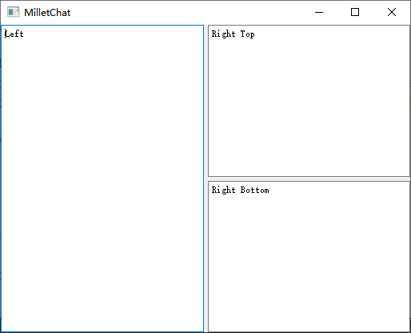
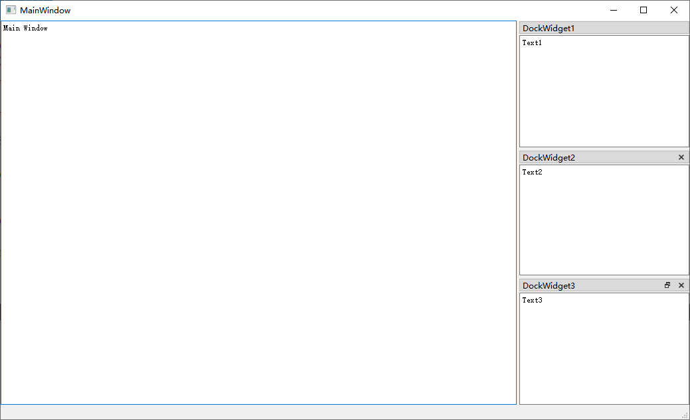

# **Qt5开发实力（第三版）**

## 模板库、工具类及控件

`QString、Qt容器类、QVariant、Qt`常用算法和基本正则表达式

### 容器类

`QObject`类及其子类不能存储在容器中，因为这些类没有赋值构造函数和赋值操作运算符。

~~~c++
// 例如
QList<QToolBar> listToolBar;

// 替换思路
QList<QToolBar*> listpToolBar;
~~~

存储在容器中的数据类型必须是**可赋值**的数据类型。

#### `QList、QLinkedList、QVector`

##### `QList`

是最常用的容器类、其子类有`QItemSelection`、`QQueue`、`QSignalSpy`、`QStringList`、`QTestEventList`
`QList<T>`维护了一个指针数组，该数组存储的指针指向 `QList<T>`存储的列表项的内容，因此，`QList<T>`提供了基于下标的快速访问。

存储策略：
	不同的数据类型，有不同的存储策略。

* 如果T是一个指针或指针大小的数据，那么直接存储到数组中。
* 如果T存储的对象是指针，则该指针指向实际的数据类型。

##### **`QLinkedList`** 

`QLinkedList<T>` 是一个链式列表，它以非连续的内存块保存数据。
`QLinkedList<T> ` 不能用下标访问，只能用迭代器访问。

##### `QVector`

`QVector<T>`在相邻的内存中存储给定的数据类型 T 的一组数值。在一个`QVector<T>`的前部或者中间位置进行插入是最慢的，因为大量的数据会去移动内存。

子类：`QPolygon、QPolygonF、QStack`

##### Java风格遍历容器

比 `STL` 使用方便，不过这也是损失性能为代价。

~~~c++
#include <QCoreApplication>
#include <QDebug>
#include <QList>
#include <QListIterator>

int main(int argc, char *argv[])
{
    QCoreApplication a(argc, argv);

    QList<int> list;
    list << 1 << 2 << 3 << 4 << 5;

    // 声明一个 迭代器，初始化绑定一个列表
    QListIterator<int> it(list);
    for( ; it.hasNext(); )
        qDebug() << it.next();
    return a.exec();
}
~~~

##### `STL`风格

`STL`风格比`JAVA`风格快的原因是，它直接指向的是列表项。

~~~c++
#include <QCoreApplication>
#include <QList>
#include <QListIterator>
#include <QDebug>

int main(int argc, char *argv[])
{
    QCoreApplication a(argc, argv);

    QList<int> list;
    list << 1 << 2 << 3 << 4 << 5;

    QList<int>::iterator it;
    for ( it = list.begin(); it != list.end(); ++it)
        qDebug() << *it ;

    return a.exec();
}
~~~

##### `QMap`和`QHash`

* `QHash`具有比`QMap`更快的查找速度。
* `QHash`以任意顺序存储数据项，而`QMap`总是按照`Key`的顺序存储数据。
* `QHash`的键类型`Key`必须提供 `operator == ()`和一个全局的`qHash(Key)`函数，而`QMap`的键类型 `Key`必须提供 `opreator < ()`函数。

### 控件

#### Button


`Push Button`：按钮

`Tool Button` ：工具按钮    和普通按钮相比，工具按钮一般不显示文本，而显示图标 

`Radio Button` ：单选按钮

`Check Box`： 复选框

`Command Link Button`：命令连接按钮

`Dialog Button Box`：对话框按钮盒

#### Input Widgets


  

`Combo Box`：下拉列表

`Font Combo Box`：字体下拉列表

`Line Edit`：单行文字

`Text Edit`：多行富文本编辑器，可显示 `HTML` 格式


`Plain Text Edit`：纯文本编辑框

`Spin Box`：数字显示框

`Double Spin Box`：双自旋盒

`Time Edit`：时间编辑

`Date Edit`：日期编辑

`Date/Time Edit`：日期/时间编辑

`Dial`：拨号


## 布局管理

### 分割窗体

```c++
    QSplitter * pSplitterMain = new QSplitter(Qt::Horizontal, 0);
    QTextEdit * pTextEditLeft = new QTextEdit("Left", pSplitterMain);

    QSplitter * pSplitterRight = new QSplitter(Qt::Vertical, pSplitterMain);
    QTextEdit * pTextEditRightTop = new QTextEdit("Right Top", pSplitterRight);
    QTextEdit * pTextEditRightBottom = new QTextEdit("Right Bottom", pSplitterRight);

    pSplitterMain->show();
```



### 停靠窗

```c++
/// 停靠窗体
void MainWindow::ShowDockWidget()
{

    // 设定主窗口
    QTextEdit * pTextEdit = new QTextEdit("Main Window", this);
    setCentralWidget(pTextEdit);

    // 设定第一个浮动窗口
    QDockWidget * pDockWidget = new QDockWidget("DockWidget1", this);

    // 可移动
    pDockWidget->setFeatures(QDockWidget::DockWidgetMovable);
    pDockWidget->setAllowedAreas(Qt::LeftDockWidgetArea | Qt::RightDockWidgetArea);

    QTextEdit * pTextEdit1 = new QTextEdit("Text1", this);
    pDockWidget->setWidget(pTextEdit1);
    addDockWidget(Qt::RightDockWidgetArea, pDockWidget);

    // 第二个浮动窗口
    QDockWidget * pDockWidget2 = new QDockWidget("DockWidget2", this);
    pDockWidget2->setFeatures(QDockWidget::DockWidgetMovable | QDockWidget::DockWidgetClosable);
    pDockWidget2->setAllowedAreas(Qt::LeftDockWidgetArea | Qt::RightDockWidgetArea);

    QTextEdit * pTextEdit2 = new QTextEdit("Text2", this);
    pDockWidget2->setWidget(pTextEdit2);
    addDockWidget(Qt::RightDockWidgetArea, pDockWidget2);

    // 第san三个浮动窗口
    QDockWidget * pDockWidget3 = new QDockWidget("DockWidget3", this);
    pDockWidget3->setFeatures(QDockWidget::DockWidgetMovable |
                              QDockWidget::DockWidgetClosable |
                              QDockWidget::DockWidgetFloatable);
    pDockWidget3->setAllowedAreas(Qt::LeftDockWidgetArea | Qt::RightDockWidgetArea);

    QTextEdit * pTextEdit3 = new QTextEdit("Text3", this);
    pDockWidget3->setWidget(pTextEdit3);
    addDockWidget(Qt::RightDockWidgetArea, pDockWidget3);
}
```



### 堆栈窗体

```c++
/// 堆栈窗体
/// 实际过程中，堆栈窗体常与 QListWidget QComboBox 使用
void StackedWidget::ShowStackedWidget()
{
    QListWidget * list = new QListWidget(this);  //新建一个QListWidget对象
    list->insertItem(0, ("window1"));  //插入三个条目
    list->insertItem(1, ("window2"));
    list->insertItem(2, ("window3"));

    QLabel * label1 = new QLabel(("windowTest1"));  //新建三个标签对象，作为堆栈窗口需要显示的三层窗体
    QLabel * label2 = new QLabel(("windowTest2"));
    QLabel * label3 = new QLabel(("windowTest3"));

    QStackedWidget* stack = new QStackedWidget(this);  //新建一个堆栈窗体对象
    stack->addWidget(label1);  //将新建的三个QLabel标签控件依次插入堆栈窗体中
    stack->addWidget(label2);
    stack->addWidget(label3);

    QHBoxLayout *mainLayout = new QHBoxLayout(this); //对整个对话框进行布局
    mainLayout->setMargin(5); //设置对话框的边距为5
    mainLayout->setSpacing(5); //设置各个控件之间的间距为5
    mainLayout->addWidget(list);
    mainLayout->addWidget(stack,0,Qt::AlignHCenter);
    mainLayout->setStretchFactor(list, 1);  //设置list为可伸缩控件
    mainLayout->setStretchFactor(stack,3);

    connect(list,SIGNAL(currentRowChanged(int)),stack,SLOT(setCurrentIndex(int)));
    //将 QListWidget的currentRowChanged信号和堆栈窗体的setCurrentIndex槽函数连接起来，实现按选择显示窗体。
}
```


## 主窗口

`QMainWindow` 包含一个 菜单栏`menu bar` ，多个工具栏`tool bars` 多个锚部件`dock widgets`  一个状态栏 `status bar` 以及一个中心部件`central widget`。


### 菜单栏

一系列命令的列表，使用 `QAction`来表示这些命令。一个窗口最多只有一个菜单栏。

### 状态栏

显示应用程序的一些状态，位于底部，用户可以再状态栏上添加，使用 QT 窗口部件。一个主窗口最多只有一个状态栏。

### 工具栏

由一系列类似于按钮的动作排列而成的面板，它通常由一些经常使用的命令（动作）完成，工具栏位于菜单栏下方，状态栏上面，可以停靠左右上下四个方向。一个主窗口可以包含多个工具栏。

### 锚接部件

作为一个容器使用，包容其他窗口部件来实现某些功能

> Qt设计器 的属性编辑器，对象监视器等都是由锚接部件包容其他的Qt窗口部件来实现。它位于工具栏区的内部。可以作为一个窗口自由浮动在主窗口上。

可以停靠在上下左右，可以有多个锚部件。

### 中心部件

中心部件处于锚接部件区的内部，主窗口的中心。一个主窗口只有一个中心部件。

