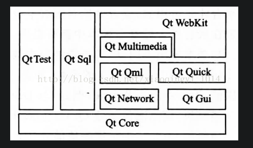
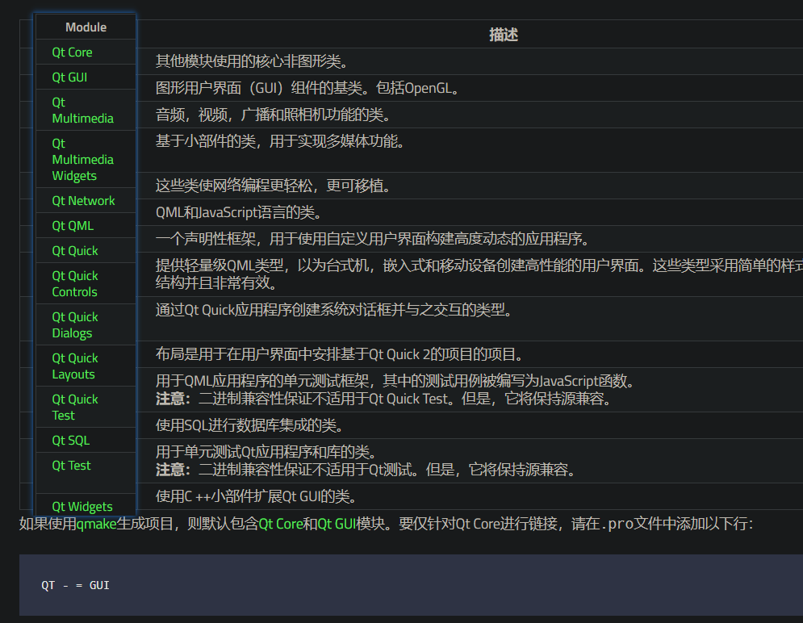
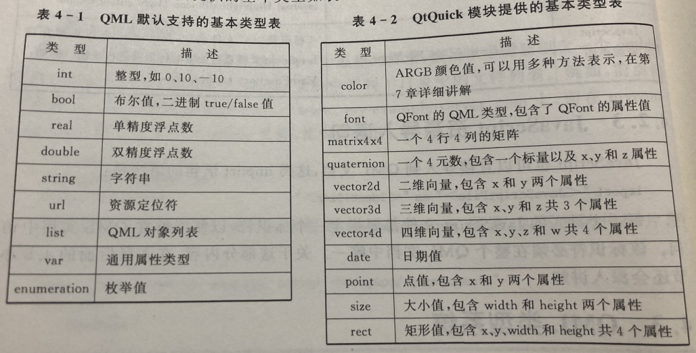
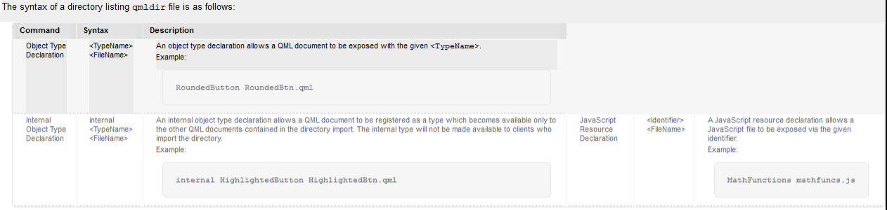
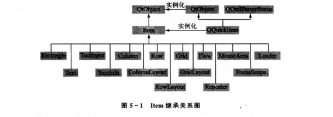
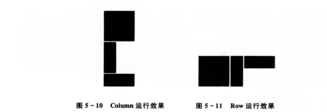
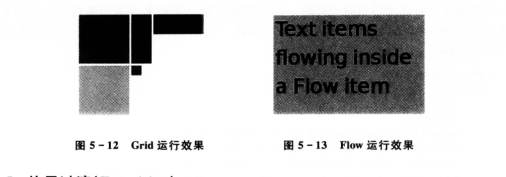
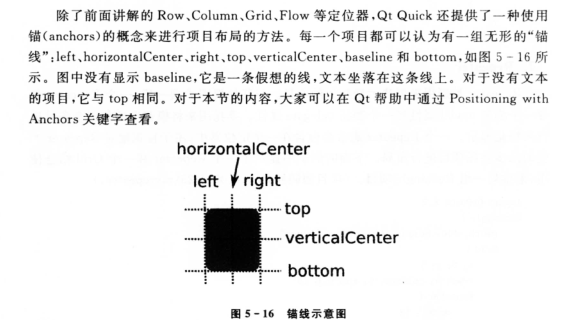

# QT5编程入门

## 简介  

qt5将所有模块分为三个部分

* QT基本模块 QT Essentials 
* QT扩展模块 QT Add-Ons
* QT开发工具 QT Tools

### 基本模块

 定义了适用于所有平台的基础功能，是Qt的核心。 

### 扩展模块

针对某种特殊目的的额外模块，这些模块仅在某个或某些平台才是可用，或者虽然对所有平台均可用但不是通用目的的，如Bluetooth、特效Qt GraphicalEffects 、串口通信Qt SerialPort等。

### 开发工具

Qt帮助系统、Qt设计器

## QML基本语法

~~~qml
import QTQuick 2.2

 Rectangle {
     width: 200
     height: 200
     color: "blue"

     Image {
         source: "pics/logo.png"
         anchors.centerIn: parent
     }
 }

~~~

**导入语句（import）**

导入包含 qml 的类型，告诉引擎在QML文档中使用了哪些模块，JavaScript资源和组件目录。

**对象（object）和属性（property）**

* 对象  Rectangle   
* 属性  width

**基本类型**

基本类型，内置，不需要导入

基本类型的属性改变行为

一些基本类型，例如 `font`类型包括 `pixelSize`，`family`和 `b`属性，不过这里所说的属性和 QML类型（`Rectangle`）不同，基本类型的属性没有自己属性改变信号，只能为自己创建一个

~~~json
Text{
	// 不可用
    onFont.pixelSizeChanged : doSomething()
	// 不可用
	font {
        onPixelSizeChanged : doSomething()
    }
	// 可用
	onFontChanged : doSomething()

	Keys.onDigit1Pressed : font.pixelSize += 1
}
// 当 font 的 pixelSize 的值增加 1 那么，就会调用  doSomething();

~~~

**JavaScript 类型**

任何  `JavaScript `类型都可以在 QML 中使用`var`类型进行创建和存储。

~~~javascript
import QtQuick 2.2
Item {
    property var theArray : new Array()
    property var theDate : new Date()
    Component.onCompleted : {
        for ( var i = 0; i < 10; ++i){
            theArray.push("Item" + i);
            console.log("There are", theArray.length, "item in the array")
		   console.log("The time is", theDate.toUTCString()
        }
    }
}
~~~

**布局  anchors**

`anchors.centerIn: parent   ` 表明处于父对象的中心 父对象 `Rectangle`

**注释** 

* 单行   `//`
* 多行 `/*   */`

**表达式**

`JavaScript`表达式可以用于设置属性的值

~~~javascript
Item｛
	width : 10 * 3
	height : 20 + 10
	Item1{
        width : parent.width - 10
        height : 20
    }
｝
// width : parent.width - 10
// 父对象的属性改变，子对象自动更新
~~~

**调试输出**

可以使用 `console.log()` 和 `console.debug()`来输出调试信息

~~~qml
Rectangle｛
	width : 10 * 3
	height : 20 + 10
	MouseArea {
        width : parent.width - 10
        height : 20
        anchors.fill : parent
        onClicked : console.log("矩形宽", width)
    }
｝
~~~

### Import导入语句

**Import 语句的三种类型**

#### 模块（命名空间）导入语句

  ~~~javascript
  import <ModuleIndentifier><Version.Number> [as<Qualifier>]
  /*
  <ModuleIndentifier> 使用 点分割的 URI 标识符 唯一确定模块的对象类型命名空间
  <Version.Number> “主版本号.子版本号” 形式的版本信息
  [as<Qualifier>]  可选限定符  就是说以后用这个必须前面带 Qualifier，这种情况就是在两个模块都带一个名字类型							  的时候就需要用了
  */    
                                              
  // 例子                                            
  import QTQuick 2.2 as Quick  
  Quick.Rectangle{
  	width: 200
      height: 200                                          
  }                                            
  ~~~

####   目录导入语句

~~~javascript
import "<DirectoryPath>" [as<Qualifier>]
//   <DirectoryPath> 既可以是本地目录，也可以是远程目录
//   <Qualifier> 可选限定符                        
~~~

##### **导入本地目录**

~~~
myapp
	|-mycomponents
		| CheckBox.qml
		| DialogBox.qml
		| Slider.qml
	|- main		
		| application.qml
~~~

如果一个目录结构如上，那么在 `application.qml` 中导入 `slider` 组件 就可以写成

~~~javascript
import "../mycomponents"
~~~

##### 导入远程目录

比如 `Slider` 在远程目录上，那么可以写成

~~~javascript
import "http://www.millet.fun/mycomponents"
~~~

##### 目录清单 qmldir 文件

 除了远程目录，本地目录也可以包含一个qmldir文件，这样可以只暴露qmldir中指定类型给导入该目录的客户端。如果目录中的JavaScript资源没有声明在一个qmldir文件中，那么它们不能暴露给客户端。
目录清单的语法如下： 

####  JavaScript资源导入语句

~~~javascript
import “<JavaScriptFile>” as "<Identifier>"
~~~

每个导入的JavaScript文件都要指定一个标识符，以便能够在QML文档中访问，这个标识符必须是唯一的。

### **基本类型**

#### 基本类型，内置，不需要导入

#### 基本类型的属性改变行为

一些基本类型，例如 `font`类型包括 `pixelSize`，`family`和 `b`属性，不过这里所说的属性和 QML类型（`Rectangle`）不同，基本类型的属性没有自己属性改变信号，只能为自己创建一个

~~~json
Text{
	// 不可用
    onFont.pixelSizeChanged : doSomething()
	// 不可用
	font {
        onPixelSizeChanged : doSomething()
    }
	// 可用
	onFontChanged : doSomething()

	Keys.onDigit1Pressed : font.pixelSize += 1
}
// 当 font 的 pixelSize 的值增加 1 那么，就会调用  doSomething();

~~~

#### **JavaScript 类型**

任何  `JavaScript `类型都可以在 QML 中使用`var`类型进行创建和存储。

~~~javascript
import QtQuick 2.2
Item {
    property var theArray : new Array()
    property var theDate : new Date()
    Component.onCompleted : {
        for ( var i = 0; i < 10; ++i){
            theArray.push("Item" + i);
            console.log("There are", theArray.length, "item in the array")
		   console.log("The time is", theDate.toUTCString()
        }
    }
}
~~~

### 对象属性

每一个 QML 对象都会包含一组特性，这些特性是在该对象类型中定义的。一个 QML 文档中的对象声明定义了一个新的类型，其中包含如下属性：id特性，属性（property）,信号（signal），信号处理器（signal handler），方法（method），附加属性和附加信号处理器特性。

#### id特性

每一个对象指定唯一 id，就是名字

~~~json
Text {
    id : text1
    Text {
    	id : text2
    	text : text1.text
	}	
}
~~~

#### 属性特性

可以分配一个静态值，也可以动态绑定一个表达式。使用下面的语法定义

~~~json
[default] property<propertyType><propertyName>
~~~

### 集成JavaScript

#### javascript表达式

##### 属性绑定

QML 提供了对实现动态对象行为变化的内置支持，要使用这一功能，就需要属性绑定。

* 一般绑定

  ~~~javascript
  Rectangle｛
  	width : 10 * 3
  	height : 20 + 10
  	MouseArea {
          width : parent.width - 10
          height : 20
          anchors.fill : parent
          onClicked : console.log("矩形宽", width)
      }
  ｝
  ~~~

  父对象变化，子对象就变化。

* 使用 `binding()`

  一旦属性被绑定到一个表达式，这个属性就会被设置为自动更新，然后，如果这个属性后来又由JavaScript语句分配了一个静态值，原来的绑定就会被清除。

  * 建立新的bingding()

  ~~~javascript
  
  Rectangle {
  	width: 100
  	height: width * 2 	//建立绑定关系
   
  	focus: true
  	Keys.onSpacePressed: {
  		height = Qt.binding(function() { return width * 3 })	//重新建立绑定关系
  	}
  }
  // 当按下空格的时候，会从新分配 width*3 的binding(), 而不是移除初始binding()
  ~~~

  * 移除 `binding()`

  ~~~javascript
  Rectangle {
  	width: 100
  	height: width * 2 	//建立绑定关系
   
  	focus: true
  	Keys.onSpacePressed: {
  		height : width * 3 	//重新建立绑定关系
  	}
  }
  // 按下空格的时候，会分配当前表达式的值 width*3的结果，移除以前的binding()，然后以后都是用这个值。不再因为 width的更新而更新 height.
  ~~~
  
* 在属性绑定中使用 `this`
  
  除了在绑定属性中可以使用，其他情况下的`this`都是未定义的
  
  ~~~javascript
  
  Rectangle{
      implicitWidth: 100;
      implicitHeight: 100;
      Rectangle{
          height = 20
          width = this.height;
      }
  }
  ~~~

##### JavaScript 函数

  程序逻辑可以再 `JavaScript函数中进行定义`，这些函数可以定义在 QML文档里面，也可以定义在外部导入的`JavaScript`文件中。

* 自定义方法

  ~~~javascript
  import QtQuick2.2
  Item {
      function factorial(a) {
          a = parseInt(a);
          return a <= 0 ? 1 : a* factorial(a -1);
      }
      MouseArea {
          anchors.file : parent
          onClicked : console.log(factorial(10))
      }
  }
  ~~~

* 导入 JavaScript 文件中的函数

  复杂一点的程序逻辑，函数一般单独分到  `.js` 文件中，例如前面的可以 单独写一个 `factorial.js `，然后导入
  
  ~~~javascript
  import QtQuick2.2
  import "factorial.js" as Factorial
  Item {
      MouseArea {
          anchors.file : parent
          onClicked : console.log(Factorial.factorial(10))
      }
  }
  ~~~
  
* 关联信号和`JavaScript`函数

  一般的，发射信号的 QML 对象类型会提供一个默认的信号处理器，但是，有时候需要从一个对象发射一个信号来触发另一个对象中定义的函数，这时就需要使用 `connect()` 函数，使用他可以将一个 QML 对象发射的信号关联到一个 `JavaScript`函数
  
  ~~~javascript
  import QtQuick 2.2
  import "script.js" as MyScript
  Item {
      id: item
      width: 200
      height : 300
      MouseArea {
          id : mouseArea
          anchors.fill : parent
      }
  
      Component.onCompleted : {
          mouseArea.click.connect(MyScript.isFunction)
      }
  }
  
  ///  script.js 文件
  function isFunction() {
      console.log( "called javasecipt func" )
  }
  
  ~~~
  
* 启动时运行 `JavaScript`

  每一个 QML 对象都有一个 Component 属性，onCompleted 处理器会在 QML 环境完全建立的时候执行。

  ~~~javascript
  import QtQuick 2.2
  Rectangle {
      function startFunction() {
          // ... do someting
      }
       Component.onCompleted : startFunction()
  }
  ~~~

#### JavaScript 动态创建 QML

* 动态创建对象

  两种方法 `Qt.createComponent()`创建`componet`对象和 `Qt.createQmlObject()`从一个 QML 字符串创建一个对象。

  * 动态创建组件

    ~~~javascript
    object CreateObject(Item parent, object properties)
    // parent : 父对象,可以为图形对象(Item)或非图形对象 (QtObject 或 c++ 的QObject)
    // properties : 属性参数
    
    ~~~

    **例子**

    ~~~javascript
    import QtQuick 2.9
    import "componentCreation.js" as MyScript
    
    Rectangle{
        id: appWindow
        width: 300; height: 300
        Component.onCompleted: MyScript.createSpriteObjects();
    }
    
    // componentCreation.js
    var component
    var sprite
    
    /*****************网络上加载QML文件******************/
    //function createSpriteObjects(){
    //    component = Qt.createComponent("Sprite.qml");
    //    if(component.status == Component.Ready)
    //        finishCreation();
    //    else
    //        component.statusChanged.connect(finishCreation);
    //}
    //function finishCreation(){
    //    if(component.status == Component.Ready){
    //        sprite = component.createObject(appWindow, {"x":100, "y": 100});
    //        if(sprite == null){
    //            //错误处理
    //            console.log("Error creating object")
    //        }
    //    }else if(component.status == Component.Error){
    //        //错误处理
    //        console.log("Error loading component: ",component.errorString());
    //    }
    //}
    
    /*****************本地加载QML文件******************/
    function createSpriteObjects(){
        component = Qt.createComponent("Sprite.qml");
        sprite = component.createObject(appWindow);
        if(sprite == null){
            //错误处理
            console.log("Error creating object");
        }else{
            sprite.x = 100;
            sprite.y = 100;
        }
    }
    
    ///////////////////////////////  
    // Sprite.qml
    import QtQuick 2.0
    
    Rectangle {
        width: 80; height: 50; color: "red"
    }
    
    ~~~

  * 从 QML 字符串创建对象

    ~~~javascript
    var newObject = Qt.createQmlObject('import QtQuick 2.0; Rectangle {    width: 80; height: 50; color: "red"}', parentItem, "dynamicSnippetl");
    ~~~

* 维护动态创建的对象

  当管理动态创建的对象时，必须确保创建上下文（creation context）不会在创建的对象销毁前销毁，否则，动态创建对象中的绑定将不会再工作，实际的创建上下文依赖于对象是怎样被创建的。

  * 使用`Qt.createComponent()`函数，创建上下文就是调用该函数的 `QQmlContext`
  * 使用`Qt.createQmlObject()`函数，创建上下文就是父对象（第二个参数）的上下文。
  * 如果定义了一个 `Component{}`，然后再其上调用了`Qt.createComponent()`或`Qt.createQmlObject()`，创建上下文就是`Component`定义的上下文

  虽然动态创建的对象可以像其他对象一样使用，但是他们没有id值

* 动态删除对象

  永远不要手动删除通过 QML 对象工厂（例如 Loader 和 Repeater）动态生成的对象，同时，不要删除不是自己动态创建的对象。

  **例子**

  ~~~javascript
  ///// myjs.qml
  import QtQuick 2.9
  
  Item {
      id: container
      width: 500; height: 100
      Component.onCompleted: {
          var component = Qt.createComponent("SelfDestroyingRect.qml")
          for(var i=0; i<5; i++){
              var Object = component.createObject(container)
          }
      }
  }
  
  
  //// SelfDestroyingRect.qml
  import QtQuick 2.0
  
  Rectangle{
      id: rect; width: 80; height: 80; color: "red"
  
      NumberAnimation on opacity {
          to: 0; duration: 1000
          onRunningChanged: {
              if(! running){
                  console.log("Destroying...")
                  rect.destroy();
              }
          }
      }
  }
  
  ~~~
## Qt Quick基础

Qt Quick 模块中提供了多种 QML 类型，用于创建 QML 用户界面和应用程序。

包括：基础可视视图，布局项目，事件处理等。

~~~
在帮助中查看
Qt Quick QML Types
~~~

### 基础可视项目

#### Item

所有可是项目都继承自 Item，单独的Item没有可视化外观，但是定义了可视化项目所有的通用的特性。例如：

~~~java
x, y, width, height;
布局 anchors 属性
按键处理 Keys 属性
~~~

##### 作为容器

Item 常用于对对象进行分组，在一个根项目下，使用 Item 对象组织其他的项目，例如

~~~javascript
Item {
    Image {
        x : 80
        widht : 100
        height : 100
        source : "title.png"
    }
   	Rectangle {
        x : 190
        width : 100
        height : 100
    }
}
~~~

##### 默认属性

Item 有一个`children`属性和一个 `resources`属性，前者包含了可见的孩子的列表，后者包含了不可见资源。

~~~javascript
Item {
    // 可视项目
    children :[
        Text(),
        Rectangle {}
    ]
    // 不可见资源
    resource:[
        Timer{}
    ]
}
~~~

Item 有一个 data 默认属性，允许在一个项目中将可见的孩子和不可见的资源进行自由混合。也就是说，如果向`data`列表中添加一个可视项目，那么，该项目将作为一个孩子进行添加，如果添加其他的对象类型，那么该项目则会作为资源进行添加。因为 `data`是默认属性，所以可以省略，所以，前面的代码可以这样改写：

~~~javascript
Item {
     // 可视项目
     Text(),
     Rectangle {}
	 // 不可见资源
     Timer{}
}
~~~

##### 不透明度

`opacity` 透明度

0.0 完全透明   1.0完全不透明

子项目会继承父项目。

##### 可见与启用

`visiable` 是否可见 true：可见    false：不可见

如果为  false  则不接收鼠标事件，会接收键盘事件

##### 堆叠顺序

`z` 用来设置兄弟之间的堆叠顺序，

默认为：拥有较大 z 值的项目会出现在比 z 值较小的兄弟项目上，拥有 z 属性值的项目会以代码中出现的顺序由下往上绘制。 如果 项目 z 属性值为负，那么他会被绘制在其父项目的下面。

~~~javascript
// z 值相同 后面出现的会出现在前面出现的上面
import QtQuick 2.9

Item {
    Rectangle{
        color: "red"
        width: 100; height: 100
    }
    Rectangle{
        color: "blue"
        x: 50; y: 50; width: 100; height: 100
    }
}
~~~

如果 z 值较大，那么他会被绘制在上面

~~~javascript
// 红色在蓝色上面
import QtQuick 2.9

Item {
    Rectangle{
        //z值较大会绘制在上面
        z: 1

        color: "red"
        width: 100; height: 100
    }
    Rectangle{
//        z: -1
        color: "blue"
        x: 50; y: 50; width: 100; height: 100
    }
}
~~~

具有相同 z 值，子项目绘制在父项目上面

~~~javascript
import QtQuick 2.9

Item {
    Rectangle{
        color: "red"
        width: 100; height: 100
        Rectangle{
        	color: "blue"
        	x: 50; y: 50; width: 100; height: 100
    	}
    }
}
~~~

子项目z 值为父，那么他会被绘制在下面

~~~javascript
import QtQuick 2.9

Item {
    Rectangle{
        color: "red"
        width: 100; height: 100
        Rectangle{
            z ： -1
        	color: "blue"
        	x: 50; y: 50; width: 100; height: 100
    	}
    }
}
~~~

总结就是： z 越大，越在上面，同级，子项目在父项目上面。

##### 定位子项目和坐标映射

`Item`中提供了childAt(real x, real y)函数来返回在点`(x,y)`处的子项目，如果没有这样的项目则返回 `null`，`Item`的`mapFrontItem(Item item, real x, real y)`函数会将item坐标系统 (x, y) 映射到该项目的坐标系统上，函数会返回一个包含映射后的 x, y 属性的对象，如果  item 被指定为 null 的值，那么会从根 QML 视图的坐标系统上的点进行映射。对应的还有一个 `mapToItem(Item item, real x, real y)` 函数，他与`mapFromItem()`类似，只不过是从当前项目坐标系统的(x,y)点映射到 item 的坐标系统而已。

#### Item举例

##### Rectangle 

 一个矩形区域

~~~javascript
Rectangle{
	color: "blue"
	x: 50; y: 50; width: 100; height: 100
}
~~~

##### Text 

纯文本或者富文本

~~~javascript
Colume {
    Text{
   		text : "hello world"
	}
        Text{
   		text : "<b>hello</b> <i>world</i>" 
	}
}

// 文本颜色
color
// 文本剪裁 
clip
// 文本换行
wrapMode
// 文本省略
elide
// 字体
font
// 对齐方式
horizontalAlignment		// 水平
verticalAlignment		// 竖直
// 文本样式
style
// 文本格式
textFormat // 显示方式
// 超链接信号
Text : onLinkActivated(string link) //在用户单击超文本连接的时候使用
Item {
    width : 100
    height : 100
    Text : {
        textFormat : Text.RichText
        font.pointSize : 24
        text : "欢迎访问<a href=\"https://www.millet.fun\"> Millet </a>"
        onLinkActived : console.log(link)// link字符串提供了被单击的特定链接
    }
}

~~~

##### 	TextInput

单行可编辑的纯文本

* 验证器

  * `IntValidator` 整数
  * `DoubleValidator` 非整数
  * RegExpValidator 正则表达式

  只能输入 11 -31 之间的整数

  ~~~javascript
  import QtQuick 2.9
  
  Item {
      TextInput {
          validator : IntValidator {bottom : 11; top : 31;}
          focus ：true
      }
  }
  ~~~

* 回显方式

  echo 指定显示方式

* 信号处理器 

  * onAccepted()   有焦点的时候，按回车调用
  * onEditingFinised()  无焦点，回车也调用
  
  ~~~javascript
  TextInput {
      focus : true
      onEditingFinised : {
          text = "hello"
          focus : false
      }
      onAccepted : text += "QT"
  }
  // 运行按下回车 显示 hello qt
  
  // 更换 onEditingFinised 和 onAccepted，则只会显示 hello 因为失去焦点了
  ~~~
  
* 文本选取

  `selectByMouse  = true`

  `selectColor，selectedTextColor `

* 设置外观

  由于`TextInput`没有漂亮外观的，所以需要自己增加外观

  `border`

##### TextEdit

`TextEdtit`可以多行显示，纯文本，富文本均可

如果需要多行显示，可以用`Qt Quick Controls`

### 布局管理

#### 定位器

管理子项目的布局 

`Column,Row,Grid,Flow`

如果子项不可见(`visiable为false`)或者宽高为0，那么该子项不会被显示，也不会被布局

##### Column

排成一列

~~~javascript
// 三个矩形排成一列
Column {
    spacing : 2
    Rectangle {width : 50; height : 50}
    Rectangle {width : 50; height : 50}
    Rectangle {width : 50; height : 50}
}
~~~

##### Row

排成一行

~~~javascript
// 三个矩形排成一列
Row {
    spacing : 2
    Rectangle {width : 50; height : 50}
    Rectangle {width : 50; height : 50}
    Rectangle {width : 50; height : 50}
}
~~~

##### Grid

排在网格中，从左到右，从上到下

// 三个矩形排成一列

~~~javascript
Grid {
	spacing : 2
	Rectangle {width : 50; height : 50}
	Rectangle {width : 50; height : 50}
	Rectangle {width : 50; height : 50}
}
~~~

##### Flow

从前往后，像流一样布局其子项目，超出边界，自动换行。

##### 过渡（Transition）

定位器添加或者删除一个子项目时，可以使用一个过渡（Transition）使这些操作具有动画效果

##### Positioner

在`Column,Row,Grid,Flow`中附加一个 `Positioner`类型的对象作为顶层子项目，他可以为定位其中的子项目提供索引等信息。

~~~javascript
Grid {
    Repeater {
        model : 16
        Rectangle {
            id : rect
            width : 30
            height : 30
            border.width : 1
            color :Positioner.isFirstItem ? "yellow" : "blue"
            Text {
                text : rect.Positioner.index
            }
        }
    }
}
// 第一个矩形采用黄色绘制，每个有不同名字
~~~

##### Repeater

创建大量相似项目

#### 基于锚（anchors）的布局

##### 使用锚布局

##### 锚边距和偏移

边距：`margin`

偏移：`offset`

##### 运行时改变锚

`AnchorChanges`运行时修改项目的锚，他需要在状态`State`中进行

`AnchorChanges`不能修改边距，需要修改时可使用，`PropertyChanges`完成。

#### Layouts

布局管理器，不仅仅进行布局，而且会改变项目的大小，所以更适合需要更改用户界面大小的应用。

## QtQuick控件和对话框

