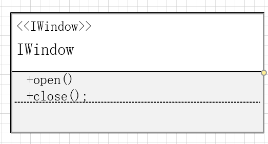

> unified modeling language
>
> `UML` 是一种用于对软件密集型系统的制品进行可视化，详述，构造和文档化的图形语言。（就是图形来表示软件）
>
> `UML`给出了一种描绘系统蓝图的标准方法，其中既包括概念性事物（如业务过程和系统过程），也包括具体的事物（如用特定的编程语言编写的类，数据库模式和可复用的软件构件）。 

**`UML`中的操作对应**

* 抽象对象操作对应于C++中的纯虚函数。
* 叶子操作对应于C++的非虚操作。

# 第一章 为什么要建模

**什么是建模**

​	模型是对现实的简化

**为什么建模**

​	为了更好的理解开发的系统

# 第二章 `UML`介绍

## 2.2 `UML`的概念模型

### 2.2.1 `UML`的构造块

**三种构造块**

* 事物：对模型中的首要成分的抽象
  * 结果事物（structural thing）
  * 行为事物
  * 分组事物
  * 注释事物
* 关系：把事物结合在一起
* 图：聚集相关的事物

#### 四种事物

##### 结构事物

模型的静态部分，描述概念元素或物理元素。结构事物总称为类目（classifier）。

* **类**（class）

  > 是对一组具有相同属性，相同操作，相同关系和相同语义的对象的描述。类实现一个或多个接口。再图形上，类画成一个矩形，矩形中通常包括类的名称，属性和操作。
  >
  > 

* **接口**

  > 是一组操作的集合，每个操作描述了类或构件的一个服务。因此，接口描述了元素的外部可见行为。一个接口可以描述一个类或构件的全部行为或部分行为。接口定义了一组操作规约（即操作的特征标记），而不是操作的实现。接口的声明看上去是在名称的上方标注关键字《interface》的类；除非有时用来表示常量，否则不需要属性。然而，接口很少单独出现。把由类提供的对外接口表示成用线连接到类框的一个小圆圈，把类向其他类请求的接口表示成用线连接到类框的半个小圆圈。
  >
  > 
  >
  > 

* **协作**

  >

* **用况**