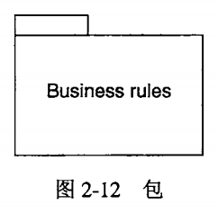

> unified modeling language
>
> `UML` 是一种用于对软件密集型系统的制品进行可视化，详述，构造和文档化的图形语言。（就是图形来表示软件）
>
> `UML`给出了一种描绘系统蓝图的标准方法，其中既包括概念性事物（如业务过程和系统过程），也包括具体的事物（如用特定的编程语言编写的类，数据库模式和可复用的软件构件）。 

**`UML`中的操作对应**

* 抽象对象操作对应于C++中的纯虚函数。
* 叶子操作对应于C++的非虚操作。

# 第一章 为什么要建模

## **什么是建模**

​	模型是对现实的简化

> 模型提供了系统的蓝图。

## **为什么建模**

​	为了更好的理解开发的系统

## **达到的目的**

* 模型有助于按照实际情况或按照所需的样式对系统进行可视化
* 模型能够规约系统的结果或行为。
* 模型能给出指导构造系统的模块
* 模型对做出的决策进行文档化

## 建模原理

* 选择要创建什么模型，对如何动手解决问题和如何形成解决方案有着意义深远的影响。

* 可以在不同的精度级别（宏观，微观）上表示每一种模型。

  > 最好的模型：可以让你根据谁在进行观察以及为什么要观察选择它的详细程度。
  >
  > 分析人员或最终用户考虑【做什么】的问题
  >
  > 开发人员考虑【怎么做】的问题。

* 最好的模型是与现实相联系的

  > 考虑现实的因数。例如飞机模型如果只是数字，假定理想条件，那出来的飞机是有问题的。

* 单个模型或试图是不充分的。对每个重要的系统最好用一小组几乎独立的模型从多个视角去逼近

  > 好比一栋建筑，我们需要楼层平面图，立面图，电气设计图。。。。等等
  >
  > 几乎独立意味着大概可以分别进行研究和构造。但又有一点点的联系

# 第二章 `UML`介绍

> * `UML` 概述
> * 理解 `UML`的三个步骤
> * 软件体系结构
> * 软件开发过程

## 2.1 概述

`UML` 是一种对软件密集型系统的制品进行下述工作的语言

* 可视化

* 详述

* 构造

  > 如果对一个事物，表示最恰当的方式是图形，则可以用`UML`；如果最恰当的方式是问题，则用编程语言。

* 文档化

  > 一个健康的软件组织，除了生产科指向的源代码以外，还要给出各种制品。
  >
  > * 需求
  > * 体系结构
  > * 设计
  > * 源代码
  > * 项目计划
  > * 测试
  > * 原型
  > * 发布

## 2.2 `UML`的概念模型

为了理解 `UML`,需要形成该语言的概念模型，就需要学建模的三个要素。

* `UML` 的基本构造块
* 支配这些构造块如何放在一起的规则
* 运用整个`UML`公共机制

### 2.2.1 `UML`的构造块

#### **三种构造块**

* 事物：对模型中的首要成分的抽象
  * 结构事物（structural thing）
  * 行为事物
  * 分组事物
  * 注释事物
* 关系：把事物结合在一起
  * 依赖
  * 关联
  * 泛化
  * 实现

* 图：聚集相关的事物
  * 类图
  * 对象图
  * 构件图
  * 组合结构图
  * 用况图
  * 顺序图
  * 状态图
  * 活动图
  * 部署图
  * 包图
  * 定时图
  * 交互预览图

##### 四种事物

> 结构事物，行为事物，分组事物，注释事物

###### **结构事物**

模型的静态部分，描述概念元素或物理元素。结构事物总称为类目（classifier）。

* **类**（class）

  > 是对一组具有相同属性，相同操作，相同关系和相同语义的对象的描述。类实现一个或多个接口。再图形上，类画成一个矩形，矩形中通常包括类的名称，属性和操作。
  >
  > 

* **接口**

  > 是一组操作的集合，每个操作描述了类或构件的一个服务。因此，接口描述了元素的外部可见行为。一个接口可以描述一个类或构件的全部行为或部分行为。接口定义了一组操作规约（即操作的特征标记），而不是操作的实现。接口的声明看上去是在名称的上方标注关键字《interface》的类；除非有时用来表示常量，否则不需要属性。然而，接口很少单独出现。把由类提供的对外接口表示成用线连接到类框的一个小圆圈，把类向其他类请求的接口表示成用线连接到类框的半个小圆圈。
  >
  > 
  >
  > 

* **协作**

  >定义了一个交互，它是由一组共同工作以提供某种协作行为的角色和其他元素构成的一个群体，这些协作行为大于所有元素的各自行为的总和。
  >
  >协作表现了系统构成模式的实现
  >
  >图形上表述为**虚线椭圆**，有时仅仅包含它的名称。
  >
  >

* **用况**

  > 对一组动作序列的描述，系统执行这些动作将产生对特定的参与者有价值而且可观察的结果。用于构造模型中的行为事物。是通过协作实现的。
  >
  > 图形上表示为实线椭圆，通常仅包含它的名称
  >
  > 

* **主动类**

  > 其对象至少拥有一个进程或线程，因此它能够启动控制活动
  >
  > 主动类的对象所表现得元素的行为与其他元素的行为并发。
  >
  > 在图形上，把主动类绘制成类图符，但它的左右外框是双线，包含名称，属性，和操作
  >
  > 

* **构件**

  > 系统设计的模块化部件，将实现隐藏在一组外部接口之后。
  >
  > 一个系统中，共享相同接口的构件是可以互相替换的，只要保持相同的逻辑行为就可以了。
  >
  > 通过把部件和连接件接合在一起表示构件的实现；部件可以包括更小的部件。
  >
  > 图形上，表示很像类，在右上角有一个特殊的图标
  >
  > 
  >
  > 

前面 6 种表示元素的**概念或逻辑事物**。后面两种表示的是**物理事物**。

* ***制品***

  > 系统中物理的而且可以替代的部件，包括物理信息（“比特”）。
  >
  > 在一个系统中，会遇到不同的类型的部署制品。如：源代码文件，脚本。
  >
  > 制品通常代表对源码信息或运行时信息的物理打包。
  >
  > 图形上表示为一个矩形，上面标注关键字《artifact》
  >
  > 

* ***结点***

> 运行时存在的物理元素。
>
> 表示一个计算机资源，通常是有一些记忆能力和处理能力。
>
> 一组构件合一驻留在一个结点，也可以从一个结点迁移到另一个结点。
>
> 图形上，画成立方体，通常在立方体中只写它的名称
>
> 

所以，基本元素，**类，接口，协作，用况，主动类，构件，*制品* 和*结点***，是 `UML`模型中可以包含的基本结构事物。

###### 行为事物

是`UML`模型的动态部分。他是模型中的动词，代表了跨越时间和空间的行为。共三类主要的

* **交互**（interaction）

  > 在特定语境中共同完成一定任务的一组对象或角色之间交换的消息组成。
  >
  > 一个对象群体的行为或者单个操作的行为可以用一个交互来描述。
  >
  > 也涉及其他的元素：消息，动作，连接件（对象间的连接）。
  >
  > 在图形上，把消息画成一条有方向的直线，通常在其上总是带有操作名称
  >
  > 

* **状态机**（state machine）

  > 描述了一个对象或一个交互在生命期内响应事件所经历的状态序列以及对这些事件的响应。
  >
  > 单个类或一组类之间协作的行为，可以用一个状态机来描述。
  >
  > 也涉及其他的元素：状态，转移（一个状态到另一个状态的流），事件（触发转换的事物）和活动（对一个转移的响应）。
  >
  > 图形上，圆角矩形，中间有状态的名字和子状态（如果有的话）
  >
  > 

* **活动**（activity）

  > 描述计算机过程执行的步骤序列。
  >
  > **交互所注重的是一系列相互作用的对象，状态机所注重的是一定时间内一个对象的生命周期。活动注重的是步骤之间的流，而不关心哪个对象执行了哪个步骤。**
  >
  > 活动的一个步骤称之为一个动作。
  >
  > 图形上，也是圆角矩形，和状态机差不多。通过语境区别
  >
  > 
  >
  > 

###### 分组事物

是`UML`的组织部分，它们是由模型分解成的“盒子”，主要的分组事物是【包】

* **包**（package）

  > 用于对设计本身进行组织的通用机制，与类不同，类是用来组织实现构造物。
  >
  > 结构事物，行为事物，甚至其他事物都可以放进包内。
  >
  > 不像构件，构件在运行时存在，是概念上的东西，即在开发时存在
  >
  > 用来组织`UML`模型的基本分组事物。有变体，如：框架，模型和子系统。
  >
  > 图形上，表示为一个带标签的文件夹，包含包名称
  >
  > 

###### 注释事物

`UML`的解释部分。这些注释事物用来描述，说明和标注模型的任何元素。有一种主要的注释事物，称之为【注解】（note）。

* **注解**

  > 依附于一个元素或一组元素之上对其进行约束或解释的简单符号。
  >
  > 图形表示为右上角折角的矩形，其中带文字或图形解释。
  >
  > 

##### 四种关系

> 依赖，关联，泛化，实现

###### 依赖  dependency 

两个模型间的语义关系，其中一个元素（独立元素）发生变化会影响到另一个元素（依赖元素）的语义。

图形上表示为一条可能有方向的虚线，偶尔还带有一个标记

###### 关联 association

类之间的结构关系，描述看一组链，链是对象（类的实体）之间的连接。**聚合**是一种特殊类型的关联，描述整体和部分件的结构关系。

图形上，关联表示为一条实现，他可能有方向，偶尔在其上方带有一个标记，而且它还经常含有诸多多重性和端名这样的修饰

###### 泛化 generalization

特殊/一般关系。特殊元素（子元素）基于一般元素（父元素）而建立。用这种方法，子元素共享了父元素的结构和行为。

图形上画成带有一条空心箭头的实线，**指向父元素**

###### 实线 realization

类目之间的语义关系，其中的一个类目执行了由另一个类目保证执行的合约。

两种地方会遇到实线关系：

* 接口和实现他们的类或构件之间
* 用况和实现他们的协作之间

图形上，画成一条带有空心箭头的虚线，他是泛化和依赖图形的结合

##### 十三种图

###### 类图

展现一组类，接口，协作和他们之间的关系。类图给出系统的静态设计视图。包含主动类的类图给出系统的静态进程视图，结构图是类图的变体。

###### 对象图

展现一组对象以及他们之间的关系。对象图描述了在类图中所建立的事物的实例的静态快照。和类图一样，这些图给出系统的静态设计视图或静态进程视图，但他们是从真实案例或原型案例的角度建立的。

