# asp .net core

## 依赖注入

 依赖注入是一个过程，就是当一个类需要调用另一个类来完成某项任务的时候，在调用类里面不要去new被调用的类的对象，而是通过注入的方式来获取这样一个对象。具体的实现就是在调用类里面有一个被调用类的接口，然后通过调用接口的函数来完成任务。比如A调用B，而B实现了接口C，那么在A里面用C定义一个变量D，这个变量的实例不在A里面创建，而是通过A的上下文来获取。这样做的好处就是将类A和B分开了，他们之间靠接口C来联系，从而实现对接口编程。 


## Razor 

- Razor 是一种将基于服务器的代码添加到网页中的标记语法
- Razor 具有传统 ASP.NET 标记的功能，但更容易使用并且更容易学习
- Razor 是一种服务器端标记语法，与 ASP 和 PHP 很像
- Razor 支持 C# 和 Visual Basic 编程语言

~~~C#
<!DOCTYPE html>

<html lang="en">
<head>
<meta charset="utf-8" />
<title>Web Pages Demo</title>
</head>
    
<body>
	<h1>Hello Web Pages</h1>
	<p>The time is @DateTime.Now</p>
</body>
</html>
~~~


# 梁桐铭教程

 https://www.bilibili.com/video/av48164112?spm_id_from=333.788.b_765f64657363.1 

## 项目文件

### launchSettings.json

* 本地开发的时候使用的配置文件

### appsettings.json

* 运行时的配置文件，采用依赖注入的方式获取

获取值的过程

* 设置配置表的值
* 在相应的类构造函数中增加IConfiguration类型参数  获取配置文件的信息 (增加到 IConfiguration _con中  )   这里就是依赖注入的方式，在main函数的时候调用的 CreateDefultBuilder()中进行配置
  * CreateDefultBuilder()
    * 设置web服务器
    * 加载主机和APP之间的配置信息
    * 配置日志记录
* 使用配置表的值   _con["key"];

获取值的顺序

* appsettings.json  运行配置文件
* appsettings.{Enviroment}.json  不同环境的开发环境不同
* user secrets  用户机密  项目文件右键 管理用户机密
* Enviroment variables 环境变量
* command-line arguments 命令行参数

### project.csproj

双击项目出现

项目的一些配置

比如：采用的托管方式，依赖的包

#### 托管方式：

<AspNetCoreHostingModes>  ** </AspNetCoreHostingModes>

进程内（InProcess），进程外(OutOfProcess)

##### 进程内：


* 采用IIS工作进程，w3wp.exe
* 只有一个Web服务器
* 进程内托管的性能比进程外要高 

##### 进程外：

将web请求转发到后端的asp.net core中，整个APP是在kestrel中运行


* 两个Web服务器
  * 内部服务器-->Kestrel
  * 外部服务器-->IIS,NgInx,Apache
* 用于托管的进程是 dotnet.exe（cmd那个）


## 中间件（Middleware）

就是Request和Responce中间的过程所需要的部件。再startup::configure()中添加 ，app.***();

* 可同时被访问和请求
* 处理请求后将请求传递给下一个中间件或者不传递给下一个，当不传递给下一个的时候就叫终端中间件          （ terminal middleware ）这样就节约时间等。
* 可处理传出响应，比如记录时间等。
* 中间件是按添加的顺序来访问的（添加到**管道**中的顺序）
* 中间件调用 next()进入下一个中间件

### 微软默认提供


~~~C#
        public void Configure(IApplicationBuilder app, IWebHostEnvironment env)
        {
            if (env.IsDevelopment())
            {
                app.UseDeveloperExceptionPage();
            }

            app.Use(async (context, next) =>
            {
                context.Response.ContentType = "text/plain;charset=utf-8";

                await context.Response.WriteAsync("你好 World \n");
                await next();

            });

            app.Run(async context => await context.Response.WriteAsync("我好 World"));

        }

// 
~~~


## 静态文件

默认的目录是 wwwroot

~~~C#
            /// 修改默认选项 自定义默认
            //DefaultFilesOptions defaultFiles = new DefaultFilesOptions();
            //defaultFiles.DefaultFileNames.Clear();
            //defaultFiles.DefaultFileNames.Add("Guido.html");

            //// 添加默认文件中间件 
			// 放置在 UseStaticFiles()才行
            // 默认支持文件
            // index.html   index.htm   default.htm  default.html
            //app.UseDefaultFiles(defaultFiles);             

            //// 添加静态文件中间件
            //app.UseStaticFiles();

            // 自定义默认
            // file server 相当于再封装一层 DefaultFilesOptions
            FileServerOptions fileServerOptions = new FileServerOptions();
            fileServerOptions.DefaultFilesOptions.DefaultFileNames.Clear();
            fileServerOptions.DefaultFilesOptions.DefaultFileNames.Add("Guido.html");
            app.UseFileServer(fileServerOptions);

            // 微软准备的中间件
            // app.use***();

~~~


### 1、静态文件中间件

* 默认情况不支持，需要添加 

  ~~~C#
  public void Configure(IApplicationBuilder app, IWebHostEnvironment env)
  {
      // 仅提供wwwroot中的静态文件
  	app.UseStaticFiles();    
  }
  ~~~

* 静态文件的默认目录是**wwwroot**文件夹，此文件夹在项目文件的根目录下面

  ~~~C#
  // 将文件复制到wwwroot内，为了从浏览器访问，可将url设置为
  https://localhost:44393/images/img.jpg
  ~~~


### 2、默认文件

访问程序地址的时候显示的文件内容


为了提供默认页面，需要在程序的请求管道中增加

~~~C#
public void Configure(IApplicationBuilder app, IWebHostEnvironment env)
{
	app.UseDefaultFiles();
}
~~~

必须在使用**UseStaticFiles()**之前使用**UseDefaultFiles()**来提供默认文件。

因为**UseDefaultFiles()**是一个url重写器，实际上并不提供文件，只是将url重写到默认文件，然后再由静态文件中间件提供。所以，地址栏显示的还是根节点的url，而不是重写的url。

默认文件的顺序

* index.htm
* index.html
* default.htm
* default.html

新增的default.html都需要放入wwwroot文件夹的根目录中，否则无法运行。


### 3、自定义的默认文件

如果要使用其他文件作为默认文件，可以这样写。

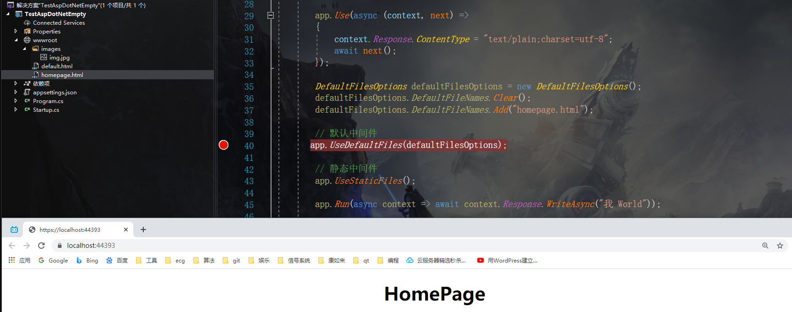


~~~C#
DefaultFilesOptions Class
Definition
Namespace:Microsoft.AspNetCore.Builder
Assembly:Microsoft.AspNetCore.StaticFiles.dll
    
Options for selecting default file names.

public class DefaultFilesOptions : Microsoft.AspNetCore.StaticFiles.Infrastructure.SharedOptionsBase
~~~


### 4、UseFileServer中间件

​	UserFileServer() 结合了 UseStaticFiles()、UseDefaultFiles()、UseDirectoryBrowser()中间件的功能，UseDirectoryBrowser()支持目录浏览，并允许用户查看指定的目录中的文件。所以可用UserFileServer() 来替代UseStaticFiles()、UseDefaultFiles()，下面为代码。

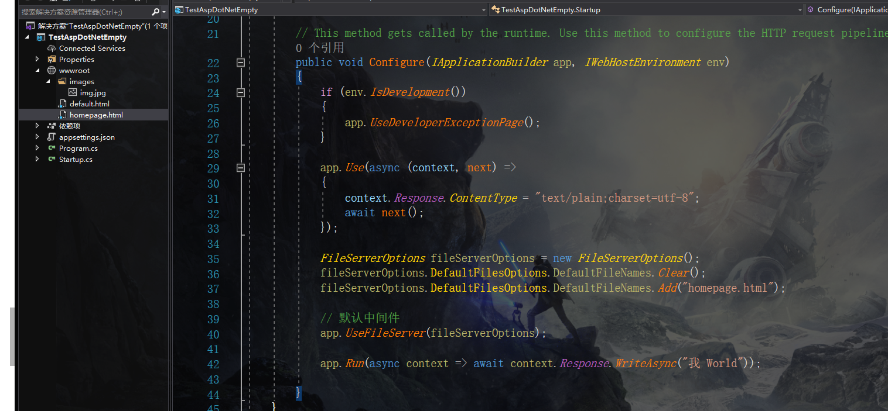

！！！注意！！！

​	凡是开发.netcore项目，我们都应该将中间件添加到应用程序的请求管道中进行开发。大多数情况下，中间件都是以Use开头的扩展方法

~~~C#
UseDeveloperExceptionPage();
UseDefaultFiles();
UseStaticFiles();
UseFileServer();   
~~~


### 5、小结

* Asp .NetCore不支持静态文件
* 默认的静态文件文件夹为 wwwroot
* 要使用静态文件，必须使用 UseStaticFiles()中间件
* 要定义默认文件，必须使用UseDefaultFiles()中间件
* 默认的文件如下
  * Index.htm
  * Index.html
  * default.htm
  * default.html
* 必须在UseStaticFiles()之前注册UseDefaultFiles()
* UserFileServer() 结合了 UseStaticFiles()、UseDefaultFiles()、UseDirectoryBrowser()中间件的功能


## 开发者异常页面

### 1、直接抛出异常

        public void Configure(IApplicationBuilder app, IWebHostEnvironment env)
        {
            if (env.IsDevelopment())
            {
            	// **
                app.UseDeveloperExceptionPage();
            }
            app.Run(async context =>{ throw new Exception("发生了一些错误。");});
        }
### 2、自定义异常

~~~C#
if (env.IsDevelopment())
{
	// 在错误页面显示的错误上方和下方的行数
	// 尽早提前注入
	DeveloperExceptionPageOptions pageOptions = new DeveloperExceptionPageOptions();
	pageOptions.SourceCodeLineCount = 10;	
	app.UseDeveloperExceptionPage(pageOptions);
}
~~~

！！！在注册的后面显示异常，所以尽早的加入这个中间件

### 3、配置环境变量

一般有以下几种软件开发环境

* 开发环境（Development）
* 演示（模拟，临时）环境（Staging）
* 生产环境（Producting）

访问 **ASPNETCORE_ENVIRONMENT**的值

~~~C#
 public void Configure(IApplicationBuilder app, IWebHostEnvironment env)
 {
  	env.EnvironmentName; 
 }
~~~


## MVC控制结构

模型（Model），视图（View）,控制器（Controller）

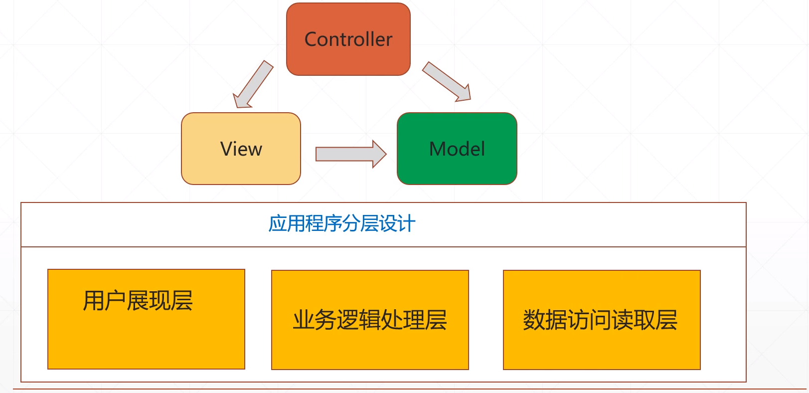

### MVC流程

1、请求到达服务器，MVC设计模式下的Controller会接受请求并且处理它。

2、Controller会访问Model，该模型是一个类文件，会进行数据的展示。

3、除了数据本身，Model还包含从底层数据源（如数据库）查询数据后的代码处理逻辑。

4、访问Model完成后，Controller还会继续选择View，并将Model对象，传递给View。

5、View仅仅负责呈现Model的数据。

6、View会根据Model数据所生成的HTML页面代码以显示Model数据，简单来说就是Controller提供给View学生数据。

7、生成的HTML页面通过网络发送给请求的用户。


#### Model

**包含一组数据的类和管理该数据的逻辑信息**

~~~C#
// 数据是 student 逻辑是StudentRepository
~~~

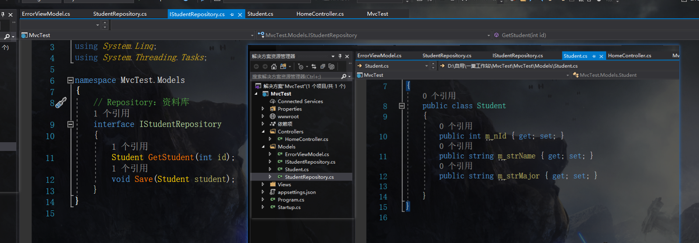


#### View

**大多数时候只是显示Controller提供给他的Model数据的逻辑，可以将View视为Html模板。**

假如，我们希望在Html表格中显示Student数据，则可以将View和Student对象放在一起。Student对象是将学生数据传递给View的模型。

View的唯一作用是将学生数据显示在Html表格中。

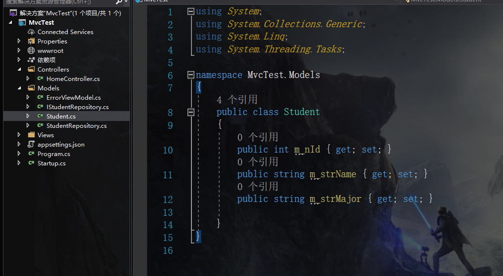

#### Controller

**处理Http请求，调用模型，选择View呈现。**


### 安装MVC

空模板项目中没有添加MVC，所以需要自己添加

~~~c#
// 添加Mvc服务到依赖注入容器中
public void ConfigureServices(IServiceCollection services)
{
	services.AddMvc(a => a.EnableEndpointRouting = false);
}

// 添加MVC默认路由
public void Configure(IApplicationBuilder app, IWebHostEnvironment env)
{
    // 默认中间件
    app.UseStaticFiles();

    app.UseMvcWithDefaultRoute();
}
~~~

这里将UseStaticFiles();放在 UseMvcWithDefaultRoute()前面，就是为了让只在请求 文件的时候就直接返回了，不走管道后面的中间件，节约时间。

跳转到UseMvcWithDefaultRoute()接口，摘要中要求 增加默认控制器模板

~~~C#
pipeline with a default route named 'default' and the following template: '{controller=Home}/{action=Index}/{id?}'
~~~

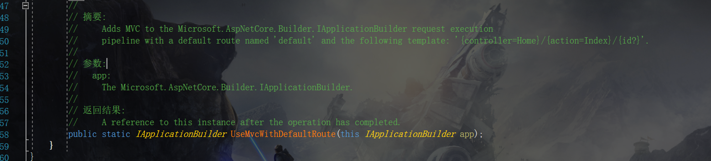


从 ASP.NET Core 2.x 到 ASP.NET Core 3.0

AddMvc() 有变化

2.x中，AddMvc()接口中增加的服务比较多

3.x中，AddMvc()中调用的接口又分类了

这个看源码去

之说结论，在3.x中噶成这样就行了

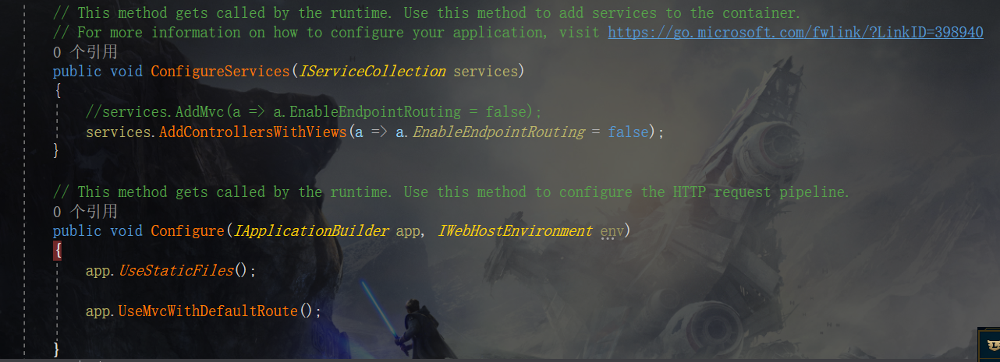


### 小结

Mvc：用于实现应用程序的用户界面层的架构思想

Model：包含一组数据的二类和管理该数据的逻辑信息。

View：包含显示逻辑，用于显示Controller提供给Model的数据。

Controller：处理Http请求，调用模型，选择View呈现。


## 依赖注入

```c#
// Student.cs
public class Student
{
    public Student(int id, string name)
    {
        m_nId = id;
        m_strName = name;
    }

    public int m_nId { get; set; }
    public string m_strName { get; set; }
}

// IStudentRepository.cs
public interface IStudentRepository
{
    Student GetStudent(int id);
    void SetStudent(Student stu);
}

// MockStudentRepository.cs
public class MockStudentRepository : IStudentRepository
{
    List<Student> students = new List<Student>();

    public MockStudentRepository()
    {
        students.Add(new Student(0, "张三"));
        students.Add(new Student(0, "李四"));
        students.Add(new Student(0, "杨琳"));
        students.Add(new Student(0, "张印"));
        students.Add(new Student(0, "嘴巴"));
    }


    public Student GetStudent(int id)
    {
        return  students.Find((Student stu) => stu.m_nId == id);
    }

    public void SetStudent(Student stu)
    {
        students.Add(stu);
    }
}

// Startup.cs
public void ConfigureServices(IServiceCollection services)
{
    //services.AddMvc(a => a.EnableEndpointRouting = false);
    services.AddControllersWithViews(a => a.EnableEndpointRouting = false);
    
    // 增加依赖注入
    // 添加当前web接口获取学生的具体实现的类
    services.AddSingleton<IStudentRepository, MockStudentRepository>();
}

```
### 添加服务

三种添加服务的接口

* AddSingleton();

  创建一个Singleton服务，首次请求时会创建，后续请求都采用相同的实例。每个应用程序只创建一次并且在程序的整个生命周期只用他。

* AddTransient();

  暂时性的，每次请求都创建一个。

* AddScoped();

  每个请求都创建一个Scoped服务，单个客户端的请求相同，多个客户端请求各不同

### 小结

* 降低耦合


## 控制器中将数据传入视图

* 使用ViewData
* 使用ViewBag
* 强类型视图    **首选**

### 路径

        public ViewResult Details()
        {
            Student student = _studentRepository.GetStudent(0);
            ViewData["PageTitle"] = "学生";
            ViewData["Student"] = student;
    
            // object
            //return View(student);
    
            // viewName; 
            // test/home/test.cshtml
            // return View("Test");
    
            // view path (abs)
            // return View("~/views/home/Test.cshtml");
            // return View("views/home/Test.cshtml");
            // return View("/views/home/Test.cshtml");
            
            // 相对路径
            // home 文件夹下的 test.cshtml
            return View("../home/Test");
        }
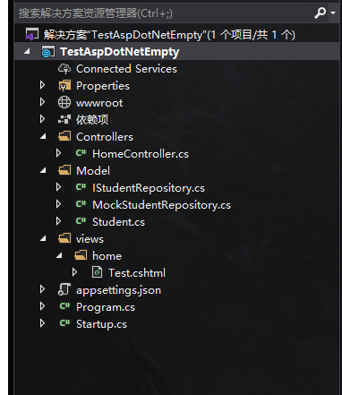

### ViewData

* 弱类型的字典对象
* 使用string类型的键值，存储和查询ViewData字典中的数据
* 运行时动态解析
* 编译时无类型检查

~~~ C#
// controller 中
            Student student = _studentRepository.GetStudent(1);
            ViewData["PageTitle"] = "学生";
            ViewData["Student"] = student;
~~~

~~~ html
// view中
@using ASPNETCore2Start.Model;
<body>
    <h3>@ViewData["PageTitle"]</h3>
    @{ var student = ViewData["Student"] as Student;}
    <div> 学号：@student._ID </div>
    <div> 姓名：@student._Name </div>
    <div> 年龄：@student._Age </div>
</body>
~~~


​																            请求结果


### ViewBag

* 封装了一次ViewData，使用动态类型(dynamic)

* 弱类型视图
* 运行时解析
* 不提供编译时类型检查和智能提示

~~~ C#
  // controller 中
			Student student = _studentRepository.GetStudent(2);
            ViewBag.PageTitle = "学生详情";
            ViewBag.Student = student;
~~~

~~~ html
// view 中
@model ASPNETCore2Start.Model;
<body>
    <h3>@ViewBag.PageTitle</h3>
    <div> 学号：@ViewBag.Student._ID </div>
    <div> 姓名：@ViewBag.Student._Name </div>
    <div> 年龄：@ViewBag.Student._Age </div>
</body>
~~~


### 强类型视图

**!!!! 首选方案：从控制器到视图**

控制器部分：在控制器中将模型对象传递给View()方法

视图部分：使用 @model指令在视图中指定模型类型，比如下面，就是使用命名空间为 MockSchoolManagement.Models中的对象，将Student对象作为模型。

​	注意：在**指令 @model**中，m是小写，要访问模型对象属性，要使用**@Model访问**

~~~C#
//  controller部分代码
public ViewResult Details()
{
	Student model = _StudentRepository.GetStudent(0);
    ViewBag.PageTitle = "学生详情";
    
    return View(model);
}
// view代码
@model MockSchoolManagement.Models.Student
<html>
    <body>
    	<h2>@ViewBag.PageTitle</h2>
    	<h3>@Model._Name</h3>
    	<h3>@Model._Email</h3>
    </body>
</html>    
~~~

####  PageTitle用强类型

新建一个ViewMode 视图模型 作为传输数据的封装类  ,

DTO：data transform object  传输数据对象

~~~ C#
// controller中
            // 复杂强类型
            HomeDetailsViewModel homeDetailsView = new HomeDetailsViewModel();
            homeDetailsView._Student = student;
            homeDetailsView._PageTitle = "学生详情";
            return View(homeDetailsView);  //默认查找同名视图
// HomeDetailsViewModel 
    public class HomeDetailsViewModel
    {
        public Student _Student { get; set; }
        public string _PageTitle { get; set; }
    }
~~~

~~~ html
@model ASPNETCore2Start.ViewModel.HomeDetailsViewModel; 
<body>
    <h3>@Model._PageTitle</h3>
    <div> 学号：@Model._Student._ID </div>
    <div> 姓名：@Model._Student._Name </div>
    <div> 年龄：@Model._Student._Age </div>
</body>
~~~


## 视图

更方便的模板化一部分 html中相同的部分

为什么要使用布局：

因为很多网页中都包含相同的组成部分，如果不弄这个，每个html文件都要去写这个，麻烦。

* Header
* Footer
* Menu
* View

### Razor布局

 **_Layout.cshtml**

在views文件夹下新建Shared文件夹，新建Razor布局。

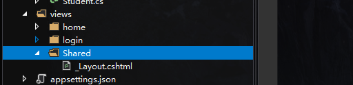

~~~html
<!--> _Layout.cshtml <-->

<!DOCTYPE html>

<html>
<head>
    <meta name="viewport" content="width=device-width" />
    <title>@ViewBag.Title</title>
</head>
<body>
    <div>
        @RenderBody()
    </div>
</body>
</html>


~~~

**@RenderBody()** ：就表示在页面中的相应显示部分了。


**Details.cshtml**

然后在视图文件中修改相应代码

~~~html
@model TestAspDotNetEmpty.Model.Student
@{ 
    Layout = "/views/Shared/_Layout.cshtml";
    ViewBag.Title = "学生详情";
}

<div> @ViewBag.Title </div>
<div> 学号：@Model.m_nId </div>
<div> 姓名：@Model.m_strName </div>

~~~


### 节点Section

假设有一个自定义的JavaScripts文件，项目中只有部分视图会用到。那么就在这个视图中添加

比如**Details.cshtml**中

~~~html
@model TestAspDotNetEmpty.Model.Student
@{
    Layout = "/views/Shared/_Layout.cshtml";
    ViewBag.Title = "学生详情";
}

<div> @ViewBag.Title </div>
<div> 学号：@Model.m_nId </div>
<div> 姓名：@Model.m_strName </div>

@section Scripts {
    <script src="~/js/CustomScript.js"></script>
}
~~~

如果所有的都有这个脚本文件，那么则在  **_Layout.cshtml** 中添加

~~~html
<!DOCTYPE html>

<html>
<head>
    <meta name="viewport" content="width=device-width" />
    <title>@ViewBag.Title</title>
</head>
<body>
    <div>
        @RenderBody()
    </div>

    <!--
        是否必选,这个由显示的视图自己决定是否含有。
        比如details.cshtml中需要则可以在，details.html中添加

        @section Scripts {
            <script src="~/js/CustomScript.js"></script>
        }

        index.cshtml中不需要，则不添加上面的代码
    -->

    @RenderSection("Scripts", IsSectionDefined("Scripts"))

    <!--
        
    在所有视图文件中都需要，则可以在这里添加
        @section Scripts {
            <script src="~/js/CustomScript.js"></script>
        }
    -->
</body>
</html>

~~~


### _ViewStart.cshtml

在前面的Razor布局中，每一个.cshtml中都需要增加下列的路径（Layout = ""）,如果大量修改的话，则很麻烦，所以催生了这样一种方法，在 view开始前，调用不同的_layout

~~~html
@{
    Layout = "/views/Shared/_Layout.cshtml";
    ViewBag.Title = "学生详情";
}
~~~


**_ViewStart.cshtml**

**Views**文件夹中添加 Razor开始页面（**_ViewStart.cshtml**），并指定下列代码，用户的身份来指定输入那个视图。

~~~html
@{
    Layout = User.IsInRole("Guido") ? "_Admin" : "_Root";
}

~~~

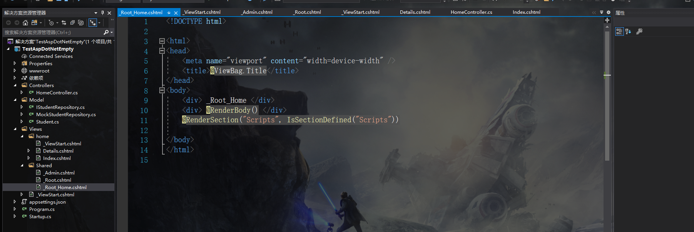

**Shared**文件夹添加相应的 Layout视图（上图的:_Admin和__Root）

**Details.cshtml** 文件中，修改Layout属性

~~~html
@*原来*@
@{
    Layout = "/views/Shared/_Layout.cshtml";
    ViewBag.Title = "学生详情";
}
@*现在*@
@{
    ViewBag.Title = "学生详情";
}
~~~


### _ViewImports.cshtml

就是在加载视图之前，导入相应的包

比如：在Views文件夹下面添加

~~~html
@using TestAspDotNetEmpty.Model
~~~

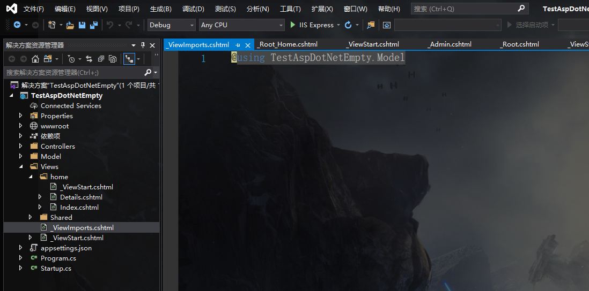

那么视图中则从

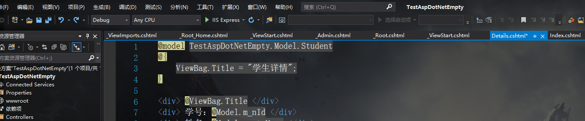

修改为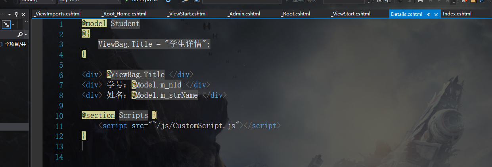

 同样，也可以在控制器文件夹下添加 _ViewImports.cshtml

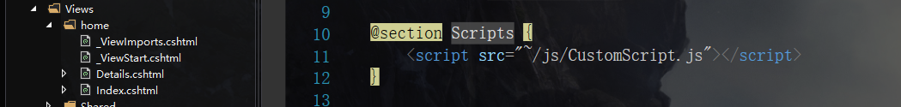

### 总结：

​		**布局：**其实布局（_layout.cshtml）就相当于一个模板，然后自己建立那个（index.cshtml）就是相当于中间的一个部分。把他嵌套进去，一个套娃而已。

​		**节点：**就是一系列的功能接口脚本。

​		**视图开始：**就是加载视图开始的时候，首先的加载项，相当于首先定了布局。

​		**视图导入：**就是加载视图开始的时候，首先的加载项，相当于首先定了包。

​			加载顺序：首先 views文件夹下的 _ViewStart.cshtml或 _ViewImports.cshtml，然后控制器文件夹下的_ ViewStart.cshtml或_ViewImports.cshtml，如果有，就覆盖 Views文件夹下的。


## 路由

### 自定义路由

~~~C#
public void Configure(IApplicationBuilder app, IWebHostEnvironment env)
{
    app.UseStaticFiles();

    // 默认的路由 访问 Index()
    app.UseMvcWithDefaultRoute();

    // 自定义的路由 访问 Details()
    app.UseMvc(routes => routes.MapRoute("default", "{controller=Home}/{action=Details}/{id?}"));

}
~~~


 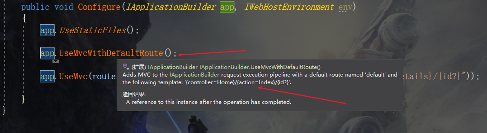


### 属性路由

使用Route()属性定义路由，在Controller类或者Controller操作方法上应用Route()属性。

~~~c#
// StartUp中
public void Configure(IApplicationBuilder app, IWebHostEnvironment env)
{
    app.UseStaticFiles();

    app.UseMvc();
}

// HomeController
[Route("")]
[Route("Home")]
[Route("Home/Index")]
public IActionResult Index()
{
    return View(_studentRepository.GetStudents());
}

// 此种方式设置路径与控制器名称无关
[Route("Home/Details/{id?}")]
[Route("WC/Details/{id?}")]
public ViewResult Details(int? id)
{
    // C# 可空类型
	// ? : 单问号用于对 int,double,bool 等无法直接赋值为 null 的数据类型进行 null 的赋值，意思是这个数据类型是 Nullable 类型的。
	// int i; //默认值0
	// int? ii; //默认值null
	// ?? : 双问号 可用于判断一个变量在为 null 时返回一个指定的值。
    Student student = _studentRepository.GetStudent(id??0); 	// 为空时返回 0
    ViewData["PageTitle"] = "学生详情";
    return View(student);
}
~~~

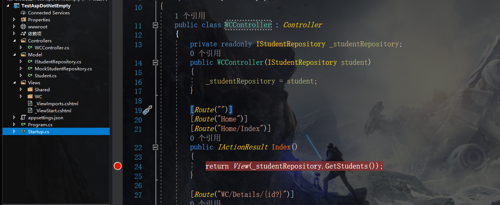

这种也可以访问，说明，控制器和路由没关系，只是为了效率，好开发，所以取相同名字。


在控制器上

~~~C#
[Route("Home")]
public class HomeController : Controller
{
    private readonly IStudentRepository _studentRepository;
    public HomeController(IStudentRepository student)
    {
        _studentRepository = student;
    }

    [Route("")]
    [Route("Index")]
    [Route("~/")]
    public IActionResult Index()
    {
        return View(_studentRepository.GetStudents());
    }

    [Route("Details/{id?}")]
    public ViewResult Details(int? id)
    {
        Student student = _studentRepository.GetStudent(id??0);
        ViewData["PageTitle"] = "学生详情";
        return View(student);
    }
}
~~~

**！！一般用路由模板就行了，在需要灵活的时候，就采用自定义路由。**


### UseEndpoints()

微软推荐使用这种

~~~c#
public void Configure(IApplicationBuilder app, IWebHostEnvironment env)
{
    app.UseStaticFiles();

    //app.UseMvcWithDefaultRoute();

    //app.UseMvc(routes => routes.MapRoute("default", "{controller=Home}/{action=Index}/{id?}"));

    app.UseRouting();

    app.UseEndpoints(endPoints => {
        endPoints.MapControllerRoute(
            name: "default",
            pattern: "{controller=Home}/{action=Index}/{id?}");
        });
}
~~~


## TagHelper

### 内置TagHelper

在_ViewImports.cshtml 中增加

~~~html
@addTagHelper *,Microsoft.AspNetCore.Mvc.TagHelpers
~~~

在代码中增加

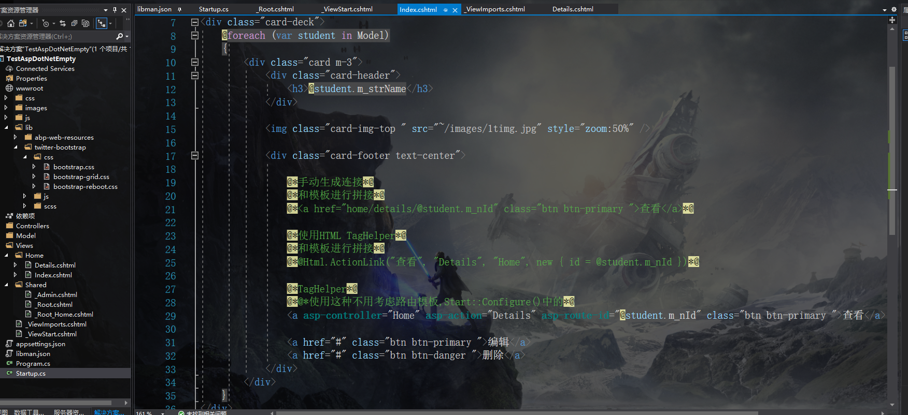

好处：不是和模板拼接，在模板更改的情况下，同样可以访问到同样的地址。


### ImageHelper

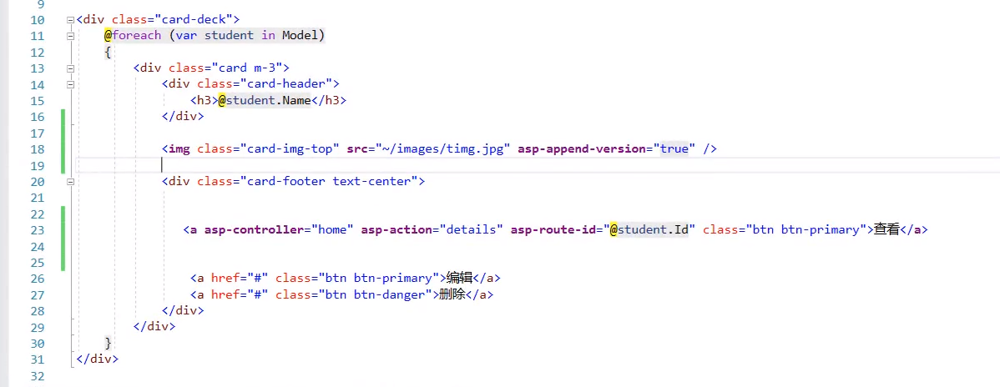

给图片增加一个缓存，增加一个GUID，防止浏览器每次都访问服务器获取新图片，增加服务器的负载。

### EnvironmentTagHelper

比如要加载某个样式的时候，测试的时候可以不用，生产的时候采用，所以就可以用这个。


## 添加页面

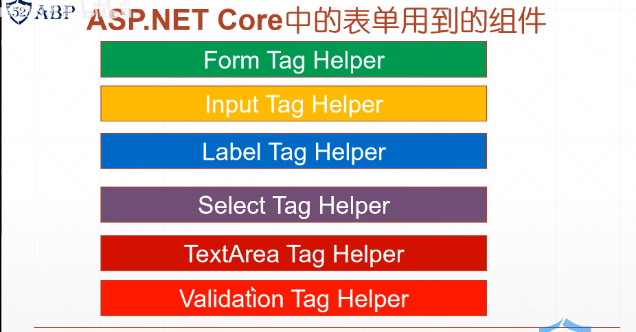

使用表单创建

视图部分

~~~HTML
@* 
这里注意Student的构造函数，一定要有没有参数的，要不然，不能绑定模型 !!!!!!!!!!!!!!!!!! 
我TM在这里浪费了一晚上，卧槽，裂开了
*@
@model Student

    <form asp-controller="Student" asp-action="Create" method="post" class="mt-3">

        <div class="form-group row">
            <label asp-for="m_nId" class="col-sm-2 col-form-label"> 学号 </label>
            <div class="col-sm-5">
                <input asp-for="m_nId" type="text" class="form-control"  placeholder="请输入学号"/>
            </div>
            
        </div>

        <div class="form-group row">
            <label asp-for="m_nId" class="col-sm-2 col-form-label"> 姓名 </label>
            <div class="col-sm-5">
                <input asp-for="m_nId" type="text" class="form-control" placeholder="请输入姓名" />
            </div>
        </div>

        <div class="form-group row">
            <label asp-for="m_eClassName" class="col-sm-2 col-form-label"> 年级 </label>
            <div class="col-sm-5">
                <select asp-for="m_eClassName" asp-items="Html.GetEnumSelectList<EnumClassName>() " class="custom-select mr-sm-2" > </select>
            </div>         
        </div>

        <div class="form-group row">
            <div class="col-sm-10">
                <button type="submit" class="btn btn-primary" >
                    创建
                </button>
            </div>
        </div>
        

    </form>
~~~


### 添加提交按钮

~~~C#
[HttpGet]
public IActionResult Create()
{
   return View();
}

// 添加接口的属性 因为在页面点击添加按钮的时候，会有一个同名 Create Action，所以添加属性区分
// 这里注意Student的构造函数，一定要有没有参数的，要不然，不能绑定模型 !!!!!!!!!!!!!!!!!!
// 
[HttpPost]
public RedirectToActionResult Create(Student stu)
{
    Student newStu = _studentRepository.AddStudent(stu);
    return RedirectToAction("Details", new { id = newStu.Id });
}


~~~


## 模型验证

### 一般类型

~~~C#
// 添加附加属性       
[Display(Name = "姓名")]
        [Required(ErrorMessage ="请输入名字")]
        [MaxLength(50, ErrorMessage = "不能超过50字")]
        public string Name { get; set; }


    	public enum EnumClassName
    	{
        	[Display(Name = "未分配")]
        	None,
        	[Display(Name = "一年级")]
        	FirstGrade,
        	[Display(Name = "二年级")]
        	SecondGrade,
        	[Display(Name = "三年级")]
        	ThirdGrade
    	}

// 验证属性是成功还是失败
        [HttpPost]
        public IActionResult Create(Student stu)
        {
            if(ModelState.IsValid)
            {
                Student newStu = _studentRepository.AddStudent(stu);
                return RedirectToAction("Details", new { id = newStu.Id });
            }

            return Create();
        }
~~~

~~~HTML
// 添加模型验证        

		@*全部验证*@
		<div asp-validation-summary="All">  </div>

        <div class="form-group row">
            <label class="col-sm-2 col-form-label">姓名</label>
            <div class="col-sm-10">
                <input asp-for="Name" class="form-control" placeholder="姓名" />
                @*单独验证：asp-validation-for *@
                <span class="text-danger" asp-validation-for="Name"></span>
            </div>
        </div>
~~~


# Razor页面

## 概述

此系列教程介绍了生成 Razor Pages Web 应用的基础知识。

有关面向熟悉控制器和视图的开发人员的更高级介绍，请参阅 [ASP.NET Core 中的 Razor Pages 介绍](https://docs.microsoft.com/zh-cn/aspnet/core/razor-pages/?view=aspnetcore-5.0)。

本系列包括以下教程：

1. [创建 Razor Pages Web 应用](https://docs.microsoft.com/zh-cn/aspnet/core/tutorials/razor-pages/razor-pages-start?view=aspnetcore-5.0)
2. [向 Razor Pages 应用添加模型](https://docs.microsoft.com/zh-cn/aspnet/core/tutorials/razor-pages/model?view=aspnetcore-5.0)
3. [基架（生成）Razor Pages](https://docs.microsoft.com/zh-cn/aspnet/core/tutorials/razor-pages/page?view=aspnetcore-5.0)
4. [使用数据库](https://docs.microsoft.com/zh-cn/aspnet/core/tutorials/razor-pages/sql?view=aspnetcore-5.0)
5. [更新 Razor Pages](https://docs.microsoft.com/zh-cn/aspnet/core/tutorials/razor-pages/da1?view=aspnetcore-5.0)
6. [添加搜索](https://docs.microsoft.com/zh-cn/aspnet/core/tutorials/razor-pages/search?view=aspnetcore-5.0)
7. [添加新字段](https://docs.microsoft.com/zh-cn/aspnet/core/tutorials/razor-pages/new-field?view=aspnetcore-5.0)
8. [添加验证](https://docs.microsoft.com/zh-cn/aspnet/core/tutorials/razor-pages/validation?view=aspnetcore-5.0)

结束时，你将有一个应用来显示和管理电影数据库。

以创建一个 应用来显示和管理电影数据库为例子 

项目名称：RazorPagesMovie


## 项目文件

### Pages 文件夹

包含 Razor 页面和支持文件。 每个 Razor 页面都是一对文件：

- 一个 .cshtml 文件，其中包含使用 Razor 语法的 C# 代码的 HTML 标记。
- 一个 .cshtml.cs 文件，其中包含处理页面事件的 C# 代码。

支持文件的名称以下划线开头。 例如，_Layout.cshtml 文件可配置所有页面通用的 UI 元素。 此文件设置页面顶部的导航菜单和页面底部的版权声明。 有关详细信息，请参阅 [ASP.NET Core 中的布局](https://docs.microsoft.com/zh-cn/aspnet/core/mvc/views/layout?view=aspnetcore-5.0)。

### wwwroot 文件夹

包含静态资产，如 HTML 文件、JavaScript 文件和 CSS 文件。 有关详细信息，请参阅 [ASP.NET Core 中的静态文件](https://docs.microsoft.com/zh-cn/aspnet/core/fundamentals/static-files?view=aspnetcore-5.0)。

### appsettings.json

包含配置数据，如连接字符串。 有关详细信息，请参阅 [ASP.NET Core 中的配置](https://docs.microsoft.com/zh-cn/aspnet/core/fundamentals/configuration/?view=aspnetcore-5.0)。

### Program.cs

包含应用的入口点。 有关详细信息，请参阅 [ASP.NET Core 中的 .NET 通用主机](https://docs.microsoft.com/zh-cn/aspnet/core/fundamentals/host/generic-host?view=aspnetcore-5.0)。

### Startup.cs

包含配置应用行为的代码。 有关详细信息，请参阅 [ASP.NET Core 中的应用启动](https://docs.microsoft.com/zh-cn/aspnet/core/fundamentals/startup?view=aspnetcore-5.0)。


## 添加模型

 添加了用于管理数据库中的电影的类。 应用的模型类使用 [Entity Framework Core (EF Core)](https://docs.microsoft.com/zh-cn/ef/core) 来处理数据库。 EF Core 是一种对象关系映射器 (ORM)，可简化数据访问。 首先要编写模型类，然后 EF Core 将创建数据库。模型类称为 POCO 类（源自“简单传统 CLR 对象” ），因为它们与 EF Core 没有任何依赖关系。 它们定义数据库中存储的数据属性。 

在Models文件夹中添加 Movie类。


### 搭建“电影”模型的基架

 将搭建“电影”模型的基架。 确切地说，基架工具将生成页面，用于对“电影”模型执行Create、读取、更新和Delete (CRUD) 操作。 

在Pages文件夹下添加 “ 新搭建基架的项目 ”

完成“添加使用实体框架的 Razor 页面 (CRUD)”对话框：

1. 在“模型类”下拉列表中，选择“Movie (RazorPagesMovie.Models)” 。
2. 在“数据上下文类”行中，选择 +（加号） 。
   1. 在“添加数据上下文”对话框中，将生成类名称 RazorPagesMovie.Data.RazorPagesMovieContext。
3. 选择“添加” 。
4. 

### 数据迁移

在实际项目中，数据模型随着功能的实现而变化：添加和删除新的实体或属性，并且需要相应地更改数据库架构，使其与应用程序保持同步。 EF Core 中的迁移功能能够以递增方式更新数据库架构，使其与应用程序的数据模型保持同步，同时保留数据库中的现有数据。

简要地说，迁移的方式如下：

- 当引入数据模型更改时，开发人员使用 EF Core 工具添加相应的迁移，以描述使数据库架构保持同步所需的更新。EF Core 将当前模型与旧模型的快照进行比较，以确定差异，并生成迁移源文件；文件可在项目的源代码管理中进行跟踪，如任何其他源文件。
- 生成新的迁移后，可通过多种方式将其应用于数据库。 EF Core 在一个特殊的历史记录表中记录所有应用的迁移，使其知道哪些迁移已应用，哪些迁移尚未应用。

~~~C#
Add-Migration InitialCreate
Update-Database
~~~

`migrations` 命令生成用于创建初始数据库架构的代码。 该架构基于在 `DbContext` 中指定的模型。 `InitialCreate` 参数用于为迁移命名。 可以使用任何名称，但是按照惯例，会选择可说明迁移的名称。

`update` 命令在尚未应用的迁移中运行 `Up` 方法。 在这种情况下，`update` 在用于创建数据库的 Migrations/<time-stamp>_InitialCreate.cs 文件中运行 `Up` 方法

### 检查通过依赖关系注入注册的上下文

ASP.NET Core 通过[依赖关系注入](https://docs.microsoft.com/zh-cn/aspnet/core/fundamentals/dependency-injection?view=aspnetcore-5.0)进行生成。 在应用程序启动过程中，通过依赖注入注册相关服务（例如 EF Core 数据库上下文）。 需要这些服务（如 Razor 页面）的组件通过构造函数参数提供相应服务。 本教程的后续部分介绍了用于获取数据库上下文实例的构造函数代码。

基架工具自动创建数据库上下文并将其注册到依赖关系注入容器。

检查 `Startup.ConfigureServices` 方法。 基架添加了突出显示的行：

~~~c#
public void ConfigureServices(IServiceCollection services)
{
    services.AddRazorPages();

    services.AddDbContext<RazorPagesMovieContext>(options =>
      options.UseSqlServer(Configuration.GetConnectionString("RazorPagesMovieContext")));
}
~~~

前面的代码为实体集创建 [DbSet](https://docs.microsoft.com/zh-cn/dotnet/api/microsoft.entityframeworkcore.dbset-1) 属性。 在实体框架术语中，实体集通常与数据表相对应。 实体对应表中的行。

通过调用 [DbContextOptions](https://docs.microsoft.com/zh-cn/dotnet/api/microsoft.entityframeworkcore.dbcontextoptions) 对象中的一个方法将连接字符串名称传递到上下文。 进行本地开发时，[配置系统](https://docs.microsoft.com/zh-cn/aspnet/core/fundamentals/configuration/?view=aspnetcore-5.0)在 appsettings.json 文件中读取连接字符串。


## 基架

 Razor 页面派生自 `PageModel`。 按照约定，`PageModel` 派生的类称为 `Model`。 此构造函数使用[依赖关系注入](https://docs.microsoft.com/zh-cn/aspnet/core/fundamentals/dependency-injection?view=aspnetcore-5.0)将 `RazorPagesMovieContext` 添加到页面： 

~~~C#
public class IndexModel : PageModel
{
    private readonly RazorPagesMovie.Data.RazorPagesMovieContext _context;

    public IndexModel(RazorPagesMovie.Data.RazorPagesMovieContext context)
    {
        _context = context;
    }
}
~~~

###  Razor 页面 

~~~HTML
@page
@model RazorPagesMovie.Pages.Movies.IndexModel

@{
    ViewData["Title"] = "Index";
}

<h1>Index</h1>
~~~

 Razor 可以从 HTML 转换为 C# 或 Razor 特定标记。 当 `@` 符号后跟 [Razor 保留关键字](https://docs.microsoft.com/zh-cn/aspnet/core/mvc/views/razor?view=aspnetcore-5.0#razor-reserved-keywords)时，它会转换为 Razor 特定标记，否则会转换为 C#。 

###  @page 指令

`@page` Razor 指令将文件转换为一个 MVC 操作，这意味着它可以处理请求。 `@page` 必须是页面上的第一个 Razor 指令。 `@page` 和 `@model` 是转换为 Razor 特定标记的示例。 有关详细信息，请参阅 [Razor 语法](https://docs.microsoft.com/zh-cn/aspnet/core/mvc/views/razor?view=aspnetcore-5.0#razor-syntax)。

### @model 指令

```cshtml
@page
@model RazorPagesMovie.Pages.Movies.IndexModel
```

`@model` 指令指定传递到 Razor 页面的模型类型。 在前面的示例中，`@model` 行使 `PageModel` 派生的类可用于 Razor 页面。 在页面上的 `@Html.DisplayNameFor` 和 `@Html.DisplayFor` [HTML 帮助程序](https://docs.microsoft.com/zh-cn/aspnet/mvc/overview/older-versions-1/views/creating-custom-html-helpers-cs#understanding-html-helpers)中使用该模型。

检查以下 HTML 帮助程序中使用的 Lambda 表达式：

```CShtml
@Html.DisplayNameFor(model => model.Movie[0].Title)
```

[DisplayNameExtensions.DisplayNameFor](https://docs.microsoft.com/zh-cn/dotnet/api/system.web.mvc.html.displaynameextensions.displaynamefor) HTML 帮助程序检查 Lambda 表达式中引用的 `Title` 属性来确定显示名称。 检查 Lambda 表达式（而非求值）。 这意味着当 `model`、`model.Movie` 或 `model.Movie[0]` 为 `null` 或为空时，不会存在任何访问冲突。 对 Lambda 表达式求值时（例如，使用 `@Html.DisplayFor(modelItem => item.Title)`），将求得该模型的属性值。

### 布局页

选择菜单链接（“Razor PagesMovie”、“主页”和“隐私”） 。 每页显示相同的菜单布局。 菜单布局是在 Pages/Shared/_Layout.cshtml 文件中实现。

打开并检查 Pages/Shared/_Layout.cshtml 文件。

[布局](https://docs.microsoft.com/zh-cn/aspnet/core/mvc/views/layout?view=aspnetcore-5.0)模板允许 HTML 容器具有如下布局：

- 在一个位置指定。
- 应用于站点中的多个页面。

查找 `@RenderBody()` 行。 `RenderBody` 是显示全部页面专用视图的占位符，已包装在布局页中。 例如，选择“隐私”链接后，Pages/Privacy.cshtml 视图在 `RenderBody` 方法中呈现。

###  ViewData 和布局

考虑来自 Pages/Movies/Index.cshtml 文件的以下标记：

```cshtml
@page
@model RazorPagesMovie.Pages.Movies.IndexModel

@{
    ViewData["Title"] = "Index";
}
```

前面突出显示的标记是 Razor 转换为 C# 的一个示例。 `{` 和 `}` 字符括住 C# 代码块。

`PageModel` 基类包含 `ViewData` 字典属性，可用于将数据传递到某个视图。 可以使用键值*_模式将对象添加到 `ViewData` 字典。 在前面的示例中，`Title` 属性被添加到 `ViewData` 字典。

`Title` 属性用于 _Pages/Shared/_Layout.cshtml* 文件。 以下标记显示 _Layout.cshtml 文件的前几行。

```cshtml
<!DOCTYPE html>
<html>
<head>
    <meta charset="utf-8" />
    <meta name="viewport" content="width=device-width, initial-scale=1.0" />
    <title>@ViewData["Title"] - RazorPagesMovie</title>

    @*Markup removed for brevity.*@
```

行 `@*Markup removed for brevity.*@` 是 Razor 注释。 与 HTML 注释 `` 不同，Razor 注释不会发送到客户端。 有关详细信息，请参阅 [MDN Web 文档：HTML 入门](https://developer.mozilla.org/docs/Learn/HTML/Introduction_to_HTML/Getting_started#HTML_comments)。

### 更新布局

1. 在 Pages/Shared/_Layout.cshtml 文件中，查找以下定位点元素。

   ```cshtml
   <a class="navbar-brand" asp-area="" asp-page="/Index">RazorPagesMovie</a>
   ```

2. 将前面的元素替换为以下标记：

   ```cshtml
   <a class="navbar-brand" asp-page="/Movies/Index">RpMovie</a>
   ```

   前面的定位点元素是一个[标记帮助程序](https://docs.microsoft.com/zh-cn/aspnet/core/mvc/views/tag-helpers/intro?view=aspnetcore-5.0) （taghelper）。 此处它是[定位点标记帮助程序](https://docs.microsoft.com/zh-cn/aspnet/core/mvc/views/tag-helpers/built-in/anchor-tag-helper?view=aspnetcore-5.0)。 `asp-page="/Movies/Index"` 标记帮助程序属性和值可以创建指向 `/Movies/Index` Razor 页面的链接。 `asp-area` 属性值为空，因此在链接中未使用区域。 有关详细信息，请参阅[区域](https://docs.microsoft.com/zh-cn/aspnet/core/mvc/controllers/areas?view=aspnetcore-5.0)。

###  Create页面模型

~~~C#
using Microsoft.AspNetCore.Mvc;
using Microsoft.AspNetCore.Mvc.RazorPages;
using RazorPagesMovie.Models;
using System;
using System.Threading.Tasks;

namespace RazorPagesMovie.Pages.Movies
{
    public class CreateModel : PageModel
    {
        private readonly RazorPagesMovie.Data.RazorPagesMovieContext _context;

        public CreateModel(RazorPagesMovie.Data.RazorPagesMovieContext context)
        {
            _context = context;
        }

        public IActionResult OnGet()
        {
            return Page();
        }

        [BindProperty]
        public Movie Movie { get; set; }

        public async Task<IActionResult> OnPostAsync()
        {
            if (!ModelState.IsValid)
            {
                return Page();
            }

            _context.Movie.Add(Movie);
            await _context.SaveChangesAsync();

            return RedirectToPage("./Index");
        }
    }
}
~~~

`OnGet` 方法初始化页面所需的任何状态。 “Create”页没有任何要初始化的状态，因此返回 `Page`。 在本教程的后面部分中，将介绍 `OnGet` 初始化状态的示例。 `Page` 方法创建用于呈现 Create.cshtml 页的 `PageResult` 对象。

`Movie` 属性使用 [[BindProperty\]](https://docs.microsoft.com/zh-cn/dotnet/api/microsoft.aspnetcore.mvc.bindpropertyattribute) 特性来选择加入[模型绑定](https://docs.microsoft.com/zh-cn/aspnet/core/mvc/models/model-binding?view=aspnetcore-5.0)。 当“Create”表单发布表单值时，ASP.NET Core 运行时将发布的值绑定到 `Movie` 模型。

当页面发布表单数据时，运行 `OnPostAsync` 方法：

~~~C#
public async Task<IActionResult> OnPostAsync()
{
    if (!ModelState.IsValid)
    {
        return Page();
    }

    _context.Movie.Add(Movie);
    await _context.SaveChangesAsync();

    return RedirectToPage("./Index");
}
~~~

### Create Razor 页

~~~html
@page
@model RazorPagesMovie.Pages.Movies.CreateModel

@{
    ViewData["Title"] = "Create";
}

<h1>Create</h1>

<h4>Movie</h4>
<hr />
<div class="row">
    <div class="col-md-4">
        <form method="post">
            <div asp-validation-summary="ModelOnly" class="text-danger"></div>
            <div class="form-group">
                <label asp-for="Movie.Title" class="control-label"></label>
                <input asp-for="Movie.Title" class="form-control" />
                <span asp-validation-for="Movie.Title" class="text-danger"></span>
            </div>
            <div class="form-group">
                <label asp-for="Movie.ReleaseDate" class="control-label"></label>
                <input asp-for="Movie.ReleaseDate" class="form-control" />
                <span asp-validation-for="Movie.ReleaseDate" class="text-danger"></span>
            </div>
            <div class="form-group">
                <label asp-for="Movie.Genre" class="control-label"></label>
                <input asp-for="Movie.Genre" class="form-control" />
                <span asp-validation-for="Movie.Genre" class="text-danger"></span>
            </div>
            <div class="form-group">
                <label asp-for="Movie.Price" class="control-label"></label>
                <input asp-for="Movie.Price" class="form-control" />
                <span asp-validation-for="Movie.Price" class="text-danger"></span>
            </div>
            <div class="form-group">
                <input type="submit" value="Create" class="btn btn-primary" />
            </div>
        </form>
    </div>
</div>

<div>
    <a asp-page="Index">Back to List</a>
</div>

@section Scripts {
    @{await Html.RenderPartialAsync("_ValidationScriptsPartial");}
}
~~~

 Visual Studio 以用于标记帮助程序的特殊加粗字体显示以下标记： 

~~~html
<div asp-validation-summary="ModelOnly" class="text-danger"></div>
<div class="form-group">
    <label asp-for="Movie.Title" class="control-label"></label>
    <input asp-for="Movie.Title" class="form-control" />
    <span asp-validation-for="Movie.Title" class="text-danger"></span>
</div>
~~~


~~~html
<form method="post"> 
~~~

 元素是一个[表单标记帮助程序](https://docs.microsoft.com/zh-cn/aspnet/core/mvc/views/working-with-forms?view=aspnetcore-5.0#the-form-tag-helper)。 表单标记帮助程序会自动包含[防伪令牌](https://docs.microsoft.com/zh-cn/aspnet/core/security/anti-request-forgery?view=aspnetcore-5.0)。 

 基架引擎在模型中为每个字段（ID 除外）创建 Razor 标记，如下所示： 
~~~html
<div asp-validation-summary="ModelOnly" class="text-danger"></div>
<div class="form-group">
    <label asp-for="Movie.Title" class="control-label"></label>
    <input asp-for="Movie.Title" class="form-control" />
    <span asp-validation-for="Movie.Title" class="text-danger"></span>
</div>
~~~

[验证标记帮助程序](https://docs.microsoft.com/zh-cn/aspnet/core/mvc/views/working-with-forms?view=aspnetcore-5.0#the-validation-tag-helpers)（<div asp-validation-summary> 和 <span asp-validation-for>）显示验证错误。 本系列后面的部分将更详细地讨论有关验证的信息。

[标签标记帮助程序](https://docs.microsoft.com/zh-cn/aspnet/core/mvc/views/working-with-forms?view=aspnetcore-5.0#the-label-tag-helper) ( <label asp-for="Movie.Title" class="control-label"></label> ) 生成标签描述和 `Title` 属性的 `[for]` 特性。

[输入标记帮助程序](https://docs.microsoft.com/zh-cn/aspnet/core/mvc/views/working-with-forms?view=aspnetcore-5.0) ( <input asp-for="Movie.Title" class="form-control"> ) 使用 [DataAnnotations](https://docs.microsoft.com/zh-cn/aspnet/mvc/overview/older-versions/mvc-music-store/mvc-music-store-part-6) 属性并在客户端生成 jQuery 验证所需的 HTML 属性。

有关标记帮助程序（如  <form method="post"> ）的详细信息，请参阅 [ASP.NET Core 中的标记帮助程序](https://docs.microsoft.com/zh-cn/aspnet/core/mvc/views/tag-helpers/intro?view=aspnetcore-5.0)。

## 使用数据库

 `RazorPagesMovieContext` 对象处理连接到数据库并将 `Movie` 对象映射到数据库记录的任务。 在 Startup.cs 的 `ConfigureServices` 方法中向[依赖关系注入](https://docs.microsoft.com/zh-cn/aspnet/core/fundamentals/dependency-injection?view=aspnetcore-5.0)容器注册数据库上下文： 

~~~C#
public void ConfigureServices(IServiceCollection services)
{
    services.AddRazorPages();

    services.AddDbContext<RazorPagesMovieContext>(options =>
      options.UseSqlServer(Configuration.GetConnectionString("RazorPagesMovieContext")));
}
~~~

 LocalDB 是轻型版的 SQL Server Express 数据库引擎，以程序开发为目标。 LocalDB 作为按需启动并在用户模式下运行的轻量级数据库没有复杂的配置。 默认情况下，LocalDB 数据库在 `C:\Users\\` 目录下创建 `*.mdf` 文件。 

## 更新页面

 构架的电影应用有个不错的开始，但是展示效果还不够理想。 ReleaseDate 应是两个词 (Release Date)。 

## 更新生成的代码

打开 Models/Movie.cs 文件，并添加以下代码中突出显示的行：

```csharp
using System;
using System.ComponentModel.DataAnnotations;
using System.ComponentModel.DataAnnotations.Schema;

namespace RazorPagesMovie.Models
{
    public class Movie
    {
        public int ID { get; set; }
        public string Title { get; set; }

        [Display(Name = "Release Date")]
        [DataType(DataType.Date)]
        public DateTime ReleaseDate { get; set; }
        public string Genre { get; set; }

        [Column(TypeName = "decimal(18, 2)")]
        public decimal Price { get; set; }
    }
}
```

在前面的代码中：

- `[Column(TypeName = "decimal(18, 2)")]` 数据注释使 Entity Framework Core 可以将 `Price` 正确映射到数据库中的货币。 有关详细信息，请参阅[数据类型](https://docs.microsoft.com/zh-cn/ef/core/modeling/relational/data-types)。
- [[Display\]](https://docs.microsoft.com/zh-cn/dotnet/api/microsoft.aspnetcore.mvc.modelbinding.metadata.displaymetadata) 属性指定字段的显示名称。 在前面的代码中即“Release Date”，而非“ReleaseDate”。
- [[DataType\]](https://docs.microsoft.com/zh-cn/dotnet/api/system.componentmodel.dataannotations.datatypeattribute) 属性指定数据的类型 (`Date`)。 此字段中存储的时间信息不显示。

 “编辑”、“详细信息”和“Delete”链接是在 Pages/Movies/Index.cshtml 文件中由[定位标记帮助程序](https://docs.microsoft.com/zh-cn/aspnet/core/mvc/views/tag-helpers/built-in/anchor-tag-helper?view=aspnetcore-5.0)生成的。 

~~~html
<td>
	<a asp-page="./Edit" asp-route-id="@item.ID">Edit</a> |
	<a asp-page="./Details" asp-route-id="@item.ID">Details</a> |
	<a asp-page="./Delete" asp-route-id="@item.ID">Delete</a>
</td>
~~~

### 添加路由模板

更新“编辑”、“详细信息”和“Delete”Razor 页面以使用 `{id:int}` 路由模板。 将上述每个页面的页面指令从 `@page` 更改为 `@page "{id:int}"`。 运行应用，然后查看源。

生成的 HTML 会将 ID 添加到 URL 的路径部分：

```html
<td>
  @*<a href="/Movies/Edit?id=1">Edit</a> |*@
  <a href="/Movies/Edit/1">Edit</a> |
  <a href="/Movies/Details/1">Details</a> |
  <a href="/Movies/Delete/1">Delete</a>
</td>
```

如果对具有 `{id:int}` 路由模板的页面进行的请求中不包含整数，则将返回 HTTP 404（未找到）错误。 例如，`https://localhost:5001/Movies/Details` 将返回 404 错误。 若要使 ID 可选，请将 `?` 追加到路由约束：

```cshtml
@page "{id:int?}"
```

测试 `@page "{id:int?}"` 的行为：

1. 在 Pages/Movies/Details.cshtml 中将 page 指令设置为 `@page "{id:int?}"`。
2. 在 `public async Task OnGetAsync(int? id)` 中（位于 Pages/Movies/Details.cshtml.cs 中）设置断点。
3. 导航到 `https://localhost:5001/Movies/Details/`。

使用 `@page "{id:int}"` 指令时，永远不会命中断点。 路由引擎返回 HTTP 404。 使用 `@page "{id:int?}"` 时，`OnGetAsync` 方法返回 `NotFound` (HTTP 404)：

C#复制

```csharp
public async Task<IActionResult> OnGetAsync(int? id)
{
    if (id == null)
    {
        return NotFound();
    }

    Movie = await _context.Movie.FirstOrDefaultAsync(m => m.ID == id);

    if (Movie == null)
    {
        return NotFound();
    }
    return Page();
}
```


##   添加搜索

在以下部分中，添加了按流派或名称搜索电影。

#### 按名称搜索

将以下突出显示的 using 语句和属性添加到 Pages/Movies/Index.cshtml.cs：

```C#
using System;
using System.Collections.Generic;
using System.Linq;
using System.Threading.Tasks;
using Microsoft.AspNetCore.Mvc;
using Microsoft.AspNetCore.Mvc.RazorPages;
using Microsoft.AspNetCore.Mvc.Rendering;
using Microsoft.EntityFrameworkCore;
using RazorPagesMovie.Data;
using RazorPagesMovie.Models;

namespace RazorPagesMovie.Pages.Movies
{
    public class IndexModel : PageModel
    {
        private readonly RazorPagesMovie.Data.RazorPagesMovieContext _context;

        public IndexModel(RazorPagesMovie.Data.RazorPagesMovieContext context)
        {
            _context = context;
        }

        public IList<Movie> Movie { get;set; }
        [BindProperty(SupportsGet = true)]
        public string SearchString { get; set; }
        public SelectList Genres { get; set; }
        [BindProperty(SupportsGet = true)]
        public string MovieGenre { get; set; }

        public async Task OnGetAsync()
        {
            var movies = from m in _context.Movie
                         select m;

            if (!string.IsNullOrEmpty(SearchString))
            {
                movies = movies.Where(s => s.Title.Contains(SearchString));
            }

            Movie = await movies.ToListAsync();
        }
    }
}
```

在前面的代码中：

- `SearchString`：包含用户在搜索文本框中输入的文本。 `SearchString` 也有 [`[BindProperty\]`](https://docs.microsoft.com/zh-cn/dotnet/api/microsoft.aspnetcore.mvc.bindpropertyattribute) 属性。 `[BindProperty]` 会绑定名称与属性相同的表单值和查询字符串。 在 HTTP GET 请求中进行绑定需要 `[BindProperty(SupportsGet = true)]`。
- `Genres`：包含流派列表。 `Genres` 使用户能够从列表中选择一种流派。 `SelectList` 需要 `using Microsoft.AspNetCore.Mvc.Rendering;`
- `MovieGenre`：包含用户选择的特定流派。 例如，“Western”。
- `Genres` 和 `MovieGenre` 会在本教程的后续部分中使用。

导航到电影页面，并向 URL 追加一个如 `?searchString=Ghost` 的查询字符串。 例如 `https://localhost:5001/Movies?searchString=Ghost`。 筛选的电影将显示出来。


如果向 Index 页面添加了以下路由模板，搜索字符串则可作为 URL 段传递。 例如 `https://localhost:5001/Movies/Ghost`。

```cshtml
@page "{searchString?}"
```

前面的路由约束允许按路由数据（URL 段）搜索标题，而不是按查询字符串值进行搜索。 `"{searchString?}"` 中的 `?` 表示这是可选路由参数。


**用户不能通过修改 URL 来搜索电影。 在此步骤中，会添加 UI 来筛选电影。 如果已添加路由约束 `"{searchString?}"`，请将它删除。**

打开 _Pages/Movies/Index.cshtml* 文件，并添加以下代码中突出显示的标记：

~~~html
@page 
@model RazorPagesMovie.Pages.Movies.IndexModel

@{
    ViewData["Title"] = "Index";
}

<h1>Index</h1>

<p>
    <a asp-page="Create">Create New</a>
</p>
<form>
    <p>
        Title: <input type="text" asp-for="SearchString" />
        <input type="submit" value="Filter" />
    </p>
</form>
<table class="table">
    <thead>
        <tr>
            <th>
                @Html.DisplayNameFor(model => model.Movie[0].Title)
            </th>
            <th>
                @Html.DisplayNameFor(model => model.Movie[0].ReleaseDate)
            </th>
            <th>
                @Html.DisplayNameFor(model => model.Movie[0].Genre)
            </th>
            <th>
                @Html.DisplayNameFor(model => model.Movie[0].Price)
            </th>
            <th></th>
        </tr>
    </thead>
    <tbody>
        @foreach (var item in Model.Movie)
        {
            <tr>
                <td>
                    @Html.DisplayFor(modelItem => item.Title)
                </td>
                <td>
                    @Html.DisplayFor(modelItem => item.ReleaseDate)
                </td>
                <td>
                    @Html.DisplayFor(modelItem => item.Genre)
                </td>
                <td>
                    @Html.DisplayFor(modelItem => item.Price)
                </td>
                <td>
                    <a asp-page="./Edit" asp-route-id="@item.ID">Edit</a> |
                    <a asp-page="./Details" asp-route-id="@item.ID">Details</a> |
                    <a asp-page="./Delete" asp-route-id="@item.ID">Delete</a>
                </td>
            </tr>
        }
    </tbody>
</table>

~~~

#### 按流派搜索

~~~C#
public async Task OnGetAsync()
{
    // Use LINQ to get list of genres.
    IQueryable<string> genreQuery = from m in _context.Movie
                                    orderby m.Genre
                                    select m.Genre;

    // 下面的代码是一种 LINQ 查询，可从数据库中检索所有流派。
    var movies = from m in _context.Movie
                 select m;

    if (!string.IsNullOrEmpty(SearchString))
    {
        movies = movies.Where(s => s.Title.Contains(SearchString));
    }

    if (!string.IsNullOrEmpty(MovieGenre))
    {
        movies = movies.Where(x => x.Genre == MovieGenre);
    }
    // 流派的 SelectList 是通过投影不包含重复值的流派创建的。
    Genres = new SelectList(await genreQuery.Distinct().ToListAsync());
    Movie = await movies.ToListAsync();
}
~~~

## 添加字段到Razor 

在此部分中，[Entity Framework](https://docs.microsoft.com/zh-cn/ef/core/get-started/aspnetcore/new-db) Code First 迁移用于：

- 将新字段添加到模型。
- 将新字段架构更改迁移到数据库。

使用 EF Code First 自动创建数据库时，Code First 将：

- 向数据库添加 [`__EFMigrationsHistory`](https://docs.microsoft.com/zh-cn/ef/core/managing-schemas/migrations/history-table) 表格，以跟踪数据库的架构是否与从生成它的模型类同步。
- 如果该模型类未与数据库同步，EF 将引发异常。

自动验证架构与模型是否同步可以更容易地发现不一致的数据库代码问题。

### 添加用于评级字段的迁移

1. 从“工具”菜单中，选择“NuGet 包管理器”>“包管理器控制台”。

2. 在 PMC 中，输入以下命令：

   PowerShell复制

   ```powershell
   Add-Migration Rating
   Update-Database
   ```

`Add-Migration` 命令会通知框架执行以下操作：

- 将 `Movie` 模型与 `Movie` 数据库架构进行比较。
- Create代码以将数据库架构迁移到新模型。

名称“Rating”是任意的，用于对迁移文件进行命名。 为迁移文件使用有意义的名称是有帮助的。

`Update-Database` 命令指示框架将架构更改应用到数据库并保留现有数据。

如果删除数据库中的所有记录，初始化表达式会设定数据库种子，并将包括 `Rating` 字段。 可以使用浏览器中的删除链接，也可以从 [Sql Server 对象资源管理器](https://docs.microsoft.com/zh-cn/aspnet/core/tutorials/razor-pages/sql?view=aspnetcore-5.0#ssox) (SSOX) 执行此操作。

另一个方案是删除数据库，并使用迁移来重新创建该数据库。 删除 SSOX 中的数据库：

1. 在 SSOX 中选择数据库。

2. 右键单击数据库，并选择“Delete”。

3. 检查“关闭现有连接”。

4. 选择“确定”。

5. 在 [PMC](https://docs.microsoft.com/zh-cn/aspnet/core/tutorials/razor-pages/new-field?view=aspnetcore-5.0#pmc) 中更新数据库：

   PowerShell复制

   ```powershell
   Update-Database
   ```

运行应用，并验证是否可以创建/编辑/显示具有 `Rating` 字段的电影。 如果数据库未设定种子，则在 `SeedData.Initialize` 方法中设置断点。


## 添加验证

 本部分中向 `Movie` 模型添加了验证逻辑。 每当用户创建或编辑电影时，都会强制执行验证规则。 

### 验证

软件开发的一个关键原则被称为 [DRY](https://wikipedia.org/wiki/Don't_repeat_yourself)（即“不要自我重复”） 。 Razor 页面鼓励进行仅指定一次功能的开发，且功能在整个应用中反映。 DRY 可以帮助：

- 减少应用中的代码量。
- 使代码更加不易出错，且更易于测试和维护。

Razor 页面和实体框架提供的验证支持是 DRY 原则的极佳示例：

- 验证规则在模型类中的某处以声明方式指定。
- 规则在应用的所有位置强制执行。

### 将验证规则添加到电影模型

`DataAnnotations` 命名空间提供以下内容：

- 一组内置验证特性，可通过声明方式应用于类或属性。
- `[DataType]` 等格式特性，这些特性可帮助进行格式设置，但不提供任何验证。

~~~C#
using System;
using System.ComponentModel.DataAnnotations;
using System.ComponentModel.DataAnnotations.Schema;

namespace RazorPagesMovie.Models
{
    public class Movie
    {
        public int ID { get; set; }

        [StringLength(60, MinimumLength = 3)]
        [Required]
        public string Title { get; set; }

        [Display(Name = "Release Date")]
        [DataType(DataType.Date)]
        public DateTime ReleaseDate { get; set; }

        [Range(1, 100)]
        [DataType(DataType.Currency)]
        [Column(TypeName = "decimal(18, 2)")]
        public decimal Price { get; set; }

        [RegularExpression(@"^[A-Z]+[a-zA-Z]*$")]
        [Required]
        [StringLength(30)]
        public string Genre { get; set; }

        [RegularExpression(@"^[A-Z]+[a-zA-Z0-9""'\s-]*$")]
        [StringLength(5)]
        [Required]
        public string Rating { get; set; }
    }
}
~~~

验证特性指定要对应用这些特性的模型属性强制执行的行为：

- `[Required]` 和 `[MinimumLength]` 特性指示属性必须具有一个值。 不阻止用户输入空格来满足此验证。
- `[RegularExpression]` 特性用于限制可输入的字符。 在上述代码中，`Genre`：
  - 只能使用字母。
  - 第一个字母必须为大写。 不允许使用空格、数字和特殊字符。
- `RegularExpression` `Rating`：
  - 要求第一个字符为大写字母。
  - 允许在后续空格中使用特殊字符和数字。 “PG-13”对“分级”有效，但对于“`Genre`”无效。
- `[Range]` 特性将值限制在指定的范围内。
- `[StringLength]` 特性可以设置字符串属性的最大长度，以及可选的最小长度。
- 从本质上来说，需要值类型（如 `decimal`、`int`、`float`、`DateTime`），但不需要 `[Required]` 特性。

上述验证规则用于进行演示，它们并不是适用于生产系统的最佳规则。 例如，前面的规则会阻止用户仅使用两个字符输入一部电影，并且不允许 `Genre` 中有特殊字符。

让 ASP.NET Core 强制自动执行验证规则有助于：

- 提升应用的可靠性。
- 减少将无效数据保存到数据库的几率。

### 使用 DataType 特性

检查 `Movie` 类。 除了一组内置的验证特性，`System.ComponentModel.DataAnnotations` 命名空间还提供格式特性。 `[DataType]` 特性应用于 `ReleaseDate` 和 `Price` 属性。

```c#
[Display(Name = "Release Date")]
[DataType(DataType.Date)]
public DateTime ReleaseDate { get; set; }

[Range(1, 100)]
[DataType(DataType.Currency)]
public decimal Price { get; set; }
```

`[DataType]` 特性提供以下内容：

- 提供提示，供视图引擎设置数据的格式。

- 提供属性，例如 URL 的   <a>    以及电子邮件的   <a href="mailto:EmailAddress.com">  

- 使用 `[RegularExpression]` 特性验证数据的格式。 `[DataType]` 属性用于指定比数据库内部类型更具体的数据类型。 `[DataType]` 特性不是验证特性。 示例应用程序中仅显示日期，不显示时间。

  `DataType` 枚举提供多种数据类型，如 `Date`、`Time`、`PhoneNumber`、`Currency`、`EmailAddress` 等。

  `[DataType]` 特性：

  - 可以使应用程序自动提供类型特定的功能。 例如，可为 `DataType.EmailAddress` 创建 `mailto:` 链接。
  - 可在支持 HTML5 的浏览器中提供 `DataType.Date` 日期选择器。
  - 发出 HTML 5 `data-`（读作 data dash）特性供 HTML 5 浏览器使用。
  - 不提供任何验证。

  `DataType.Date` 不指定显示日期的格式。 默认情况下，数据字段根据基于服务器的 `CultureInfo` 的默认格式进行显示。

  要使 Entity Framework Core 能将 `Price` 正确地映射到数据库中的货币，则必须使用 `[Column(TypeName = "decimal(18, 2)")]` 数据注释。 有关详细信息，请参阅[数据类型](https://docs.microsoft.com/zh-cn/ef/core/modeling/relational/data-types)。

  `[DisplayFormat]` 特性用于显式指定日期格式：

  C#复制

  ```csharp
  [DisplayFormat(DataFormatString = "{0:yyyy-MM-dd}", ApplyFormatInEditMode = true)]
  public DateTime ReleaseDate { get; set; }
  ```

  `ApplyFormatInEditMode` 设置用于指定在显示值进行编辑时将应用格式。 某些字段可能不需要此行为。 例如，在货币值中，可能不希望编辑 UI 中存在货币符号。

  可单独使用 `[DisplayFormat]` 特性，但通常建议使用 `[DataType]` 特性。 `[DataType]` 特性按照数据在屏幕上的呈现方式传达数据的语义。 `[DataType]` 特性可提供 `[DisplayFormat]` 所不具有的以下优点：

  - 浏览器可启用 HTML5 功能（例如显示日历控件、区域设置适用的货币符号、电子邮件链接等）。
  - 默认情况下，浏览器将根据区域设置采用正确的格式呈现数据。
  - 借助 `[DataType]` 特性，ASP.NET Core 框架可选择适当的字段模板来呈现数据。 单独使用时，`DisplayFormat` 特性将使用字符串模板。

  **注意**：jQuery 验证不适用于 `[Range]` 特性和 `DateTime`。 例如，以下代码将始终显示客户端验证错误，即便日期在指定的范围内：

  C#复制

  ```csharp
  [Range(typeof(DateTime), "1/1/1966", "1/1/2020")]
  ```

  最佳做法是避免在模型中编译固定日期，因此不推荐使用 `[Range]` 特性和 `DateTime`。 使用[配置](https://docs.microsoft.com/zh-cn/aspnet/core/fundamentals/configuration/?view=aspnetcore-5.0)指定日期范围和其他经常会更改的值，而不是在代码中指定它们。


# 语言继承查询LINQ

[参考网站](https://docs.microsoft.com/zh-cn/dotnet/csharp/linq/)

 语言集成查询 (LINQ) 是一系列直接将查询功能集成到 C# 语言的技术统称。 数据查询历来都表示为简单的字符串，没有编译时类型检查或 IntelliSense 支持。 此外，需要针对每种类型的数据源了解不同的查询语言：SQL 数据库、XML 文档、各种 Web 服务等。 借助 LINQ，查询成为了最高级的语言构造，就像类、方法和事件一样。 

 下面的示例展示了完整的查询操作。 完整的操作包括创建数据源、定义查询表达式和在 `foreach` 语句中执行查询。 

~~~C#
class LINQQueryExpressions
{
    static void Main()
    {

        // Specify the data source.
        int[] scores = new int[] { 97, 92, 81, 60 };

        // Define the query expression.
        IEnumerable<int> scoreQuery =
            from score in scores
            where score > 80
            select score;

        // Execute the query.
        foreach (int i in scoreQuery)
        {
            Console.Write(i + " ");
        }
    }
}
// Output: 97 92 81
~~~


## 查询表达式基础

### 查询是什么及其作用是什么？

​		查询 是一组指令，描述要从给定数据源（或源）检索的数据以及返回的数据应具有的形状和组织。 查询与它生成的结果不同。

​		从应用程序的角度来看，原始源数据的特定类型和结构并不重要。 应用程序始终将源数据视为 [IEnumerable](https://docs.microsoft.com/zh-cn/dotnet/api/system.collections.generic.ienumerable-1) 或 [IQueryable](https://docs.microsoft.com/zh-cn/dotnet/api/system.linq.iqueryable-1) 集合。 例如在 LINQ to XML 中，源数据显示为 `IEnumerable`<[XElement](https://docs.microsoft.com/zh-cn/dotnet/api/system.xml.linq.xelement)>。 

## 关键字

LINQ

LINQ关键字

from 指定数据源和范围变量

where 根据布尔表达式(由逻辑与 或 等组成)从数据源中筛选元素

select 指定查询结果中的元素所具有的类型或表现形式

group 对对查询结果按照键值进行分组

into 提供一个标示符，它可以充当对 join group 或 select 子句结果的引用

orderby 对查询出的元素进行排序

join 按照两个指定匹配条件来联接俩个数据源

let 产生一个用于查询表达式中子表达式查询结果的范围变量


