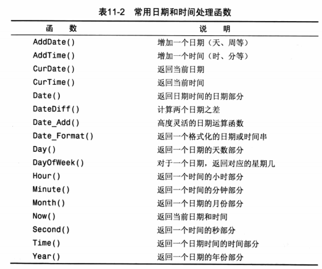

# MySQL必知必会

关系型数据库

## 了解SQL

### 行

存数据（row）

### 列

表头，存数据字段（filed）

### 主键

primary key

一列（或一组列），其值能够区分表中的每个行

应该总是定义主键，因为没有主键，更新或者删除表中的特定行很困难，没有安全的方法保证只涉及相关的行

**满足要求**

* 任意两行都不具有相同的主键值
* 每个行都必须具有一个主键值（主键列不允许NULL）

## 使用MySQL

连接MySQL，需要以下信息：

* 主机名（计算机名） 如连接本地为 localhost
* 端口  默认3306
* 合法的用户名  root
* 用户口令  password

### 选择数据库

~~~mysql
USE database1 
~~~

### 显示数据库和表

~~~mysql
SHOW DATABASES;
SHOW TABLES;
~~~

### 显示表的列

~~~mysql
SHOW COLUMNS FROM customers; /*customers 为表名*/

/* mysql 中可以使用 */
DESCRIBE customers;/* 作为一种快捷方式 */
~~~

### 其他显示语句

~~~mysql
SHOW STATUS; /* 用于显示广泛的服务器状态信息 */
SHOW CREATE DATABASE;/* 显示创建特定数据库的MySQL语句 */
SHOW CREATE TABLE;/* 显示创建特定数据库表的MySQL语句 */
SHOW GRANTS;/* 显示授予用户的安全权限 */
SHOW ERRORS;/* 显示服务器错误或者警告消息 */
SHOW WARNINGS;/* 显示服务器错误或者警告消息 */
~~~

## 检索数据

### SELECT 

从一个或者多个表中检索信息

#### **检索单个列**

select 后面跟列名

~~~mysql
SELECT prod_name		/* 列名 */
FROM products;			/* 表名 */
~~~

#### **检索多个列**

select 后面跟多个列名

~~~mysql
SELECT prod_name, prod_id		/* 列名1,列名2 */
FROM products;	
~~~

#### **检索所有列**

select 后面 跟 * （通配符）

~~~mysql
SELECT *		/* 列名 */
FROM products;	
~~~

#### **检索不同的行**

想让返回的匹配行中不出现重复数据。使用 `DISTINCT`关键字

~~~mysql
SELECT DISTINCT vend_id
FROM products;
~~~

#### **限制结果**

SELECT语句返回所有匹配的行，可能指定表中的每个行，为了返回第一行或者前几行，使用 `LIMIT`

~~~mysql
SELECT prod_name 
FROM products
LIMIT 5;
~~~

为了得到下一个 5 行，可以使用下面的方式**，开始行和结束行**

~~~mysql
SELECT prod_name 
FROM products
LIMIT 5,5;
~~~

#### 使用完全限定的表名

~~~mysql
/* 列名被限定 */
SELECT products.prod_name 
FROM products;

/* 表名也可以被限定 */
SELECT products.prod_name 
FROM products.products;
~~~

## 排序

### 排序数据

为了明确的排序 可以用 `ORDER BY`子句。

~~~
SELECT prod_name 
FROM products
ORDER BY prod_name;
~~~

### 按多个列排序

经常需要按不止一个列进行数据排序，例如，需要显示雇员清单可能希望按姓和名排序，然后再按价格排序，**再出现相同名字的时候，就会按价格排序**

~~~
SELECT prod_name, prod_id, prod_price
FROM products
ORDER BY prod_name, prod_price;
~~~

### 指定排序方向

升序： `ASC` 

降序：`DESC`  只应用于当前列名，所以下面的 name 降序，price 升序

~~~mysql
SELECT * FROM  table_name  ORDER BY field ASC;  /*默认，可以不指定*/
SELECT * FROM  table_name  ORDER BY field DESC;

SELECT prod_name, prod_id, prod_price
FROM products
ORDER BY prod_name DESC, prod_price;
/* prod_name  按降序排列 */
/* prod_price 按降升排列 */
~~~

 **`ORDER BY`**和**`LIMIT`**，能够找出一个列中的最高或最低的值。

~~~mysql
SELECT prod_price
FROM products
ORDER BY prod_price DESC
LIMIT 1;
~~~

## 过滤数据

### WHERE

~~~mysql
SELECT prod_name, prod_price
FROM products
WHERE prod_price = 2.5;
~~~

### WHERE 操作符

#### 检测单个值

~~~mysql
SELECT prod_name, prod_price
FROM products
WHERE prod_name = 'Guido';
/* 返回 prod_name = 'Guido'的一行，不区分大小写 */
~~~

### BETWEEN

检查某个值的范围

~~~mysql
SELECT prod_name, prod_price
FROM products
WHERE prod_price BETWEEN 5 AND 10;
~~~

### 空值检查

`IS NULL`

~~~mysql
SELECT prod_name, prod_price
FROM products
WHERE prod_name = 'Guido';
/* NULL 并不是 0 */
~~~

## 数据过滤

`MySQL` 允许给出多个 `WHERE`子句，这些子句可以以两种方式使用，以`AND`子句的方式或`OR`子句的方式使用。

### AND

匹配所有满足条件的语句

~~~mysql
SELECT prod_id, prod_name, prod_price
FROM products
WHERE prod_name = 'Guido' AND prod_id = 99;
~~~

### OR

匹配任意一个满足条件的语句

~~~mysql
SELECT prod_id, prod_name, prod_price
FROM products
WHERE prod_name = 'Guido' OR prod_id = 99;
~~~

### 计算次序

`ADN`的优先级比`OR`要高

~~~mysql
SELECT prod_id, prod_name, prod_price
FROM products
WHERE prod_name = 'Guido' OR prod_id = 99 AND prod_price >= 10;
/* prod_id 为99，且价格 > 10  或者 prod_name = ‘Guido’的数据    AND 比 OR 先运算 */

/* 所以，想达到上述的需求 */
SELECT prod_id, prod_name, prod_price
FROM products
WHERE ( prod_name = 'Guido' OR prod_id = 99 ) AND prod_price >= 10;
~~~

### IN 操作符

IN操作符用来指定条件范围，范围中的每个条件都可以进行匹配，IN取合法值的由逗号分隔的清单，全部包括在圆括号中。

~~~mysql
/* 挑选价格 等于 0 和 100之间的所有产品 */
SELECT prod_id, prod_name, prod_price
FROM products
WHERE prod_price IN ( 0, 100 )
ORDER BY prod_name

/* 等效于 OR */
SELECT prod_id, prod_name, prod_price
FROM products
WHERE prod_price = 0 OR prod_price = 100 
ORDER BY prod_name
~~~

优点 :

* 在使用长的合法清单的时候，`IN`操作符更清楚直观
* 计算次序更容易管理
* `IN`操作符比`OR`一般来说更快
* `IN`可以包含其他`SELECT`语句，所以可以动态的创建`WHERE`子句。

### NOT 操作符

`NOT`操作符有且只有一个功能，那就是否定它之后所跟的任何条件。

~~~mysql
/* 挑选价格 不等于 0 和 100之间的所有产品 */
SELECT prod_id, prod_name, prod_price
FROM products
WHERE prod_price NOT IN ( 0, 100 )
ORDER BY prod_name
~~~

## 通配符进行过滤

### LIKE操作符

#### % 通配符

在搜索串中，`%`表示任何字符出现的任意次数，

~~~mysql
/* 匹配以 jet 起头的产品 */
SELECT prod_id, prod_name, prod_price
FROM products
WHERE prod_name LIKE 'jet%'
~~~

> 区分大小写
>
> 根据 `MySQL`配置不同，搜索是可以区分大小写的。那么 `Jet Pack`就不会匹配

通配符可以在搜索模式中任意位置使用。

~~~mysql
SELECT prod_id, prod_name, prod_price
FROM products
WHERE prod_name LIKE '%jet%'
/* 表示匹配任意位置包含 jet 文本的值 */
~~~

#### _ 通配符

`_`表示匹配单个字符，用法与`%`一样。

#### 总结

* 不要过度使用 通配符，因为会降低效率
* 除非必要，否则不要将他放在开始，搜索起来是最慢的。
* 

## 正则表达式搜索

### 基本字符匹配

~~~mysql
/* 检索列 prod_name 包含文本 1000 的所有行  */
SELECT prod_name
FROM products
WHERE prod_name REGEXP '1000'
ORDER BY prod_name
~~~

~~~mysql
SELECT prod_name
FROM products
WHERE prod_name REGEXP '.000'
ORDER BY prod_name

/* . 为正则表达式特殊字符，匹配任意字符 */
~~~

### 进行 OR 匹配

~~~mysql
SELECT prod_name
FROM products
WHERE prod_name REGEXP '1000|2000'
ORDER BY prod_name
/*  | 为正则表达式特殊字符，类似 OR  */
~~~

### 匹配几个字符之一

用 `[]`括起来完成

~~~mysql
SELECT prod_name
FROM products
WHERE prod_name REGEXP '[123] Ton'
ORDER BY prod_name;
/* 匹配 1 或者 2 或者 3 */

SELECT prod_name
FROM products
WHERE prod_name REGEXP '[^123] Ton'
ORDER BY prod_name;
/* 匹配 1 或者 2 或者 3 之外的东西 */
~~~

### 匹配范围

用来定义要匹配的一个或者多个字符

~~~mysql
SELECT prod_name
FROM products
WHERE prod_name REGEXP '[1-5] Ton'
ORDER BY prod_name;
~~~

### 匹配特殊字符

必须前面使用 `\\`为前导，比如`\\-`表示查找 `-`，`\\.`表示查找`.`

~~~mysql
SELECT prod_name
FROM products
WHERE prod_name REGEXP '\\.'
ORDER BY prod_name;
~~~

## 创建字段

### 拼接字段

`verdors`表包含供应商名和位置信息，如果需要返回 `name(location)`格式的供应商的位置

~~~mysql
SELECT Concat(prod_name, '(', prod_contry, ')')
FRON products
ORDER BY prod_name;
~~~

> 如果需要删除右侧多余空格，可以使用 `RTrim()`来完成。
>
> ~~~mysql
> SELECT Concat(RTrim(prod_name), '(', RTrim(prod_contry), ')')
> FRON products
> ORDER BY prod_name;
> ~~~
>
> 同理：`LTrim(),Trim()`

### 算数运算

~~~mysql
SELECT prod_id,
	   quantity,
	   item_price,
	   quantity*item_price AS expanded_price
FROM orderitems
WHERE order_num = 25000;
~~~

## 使用数据处理函数

函数

### 文本处理函数

~~~mysql
Upper();	/* 	小写转大写 */
Length();	/* 	计算字符串的长度 */
Locate();	/* 	找出串的一个子串	*/
Lower();	/*	转小写	*/
LTrim();	/*	去掉左边的空格	*/
Right();	/*	返回串右边的字符	*/	/*  	Right('Guido',2) ==> 'do'   */
RTrim();	/*	去掉右边的空格	*/
Soundex();	/*	返回串的SOUNDEX 值，将一个任何文本串描述为起语音表示的字母数字模式的算法。*//* 发音类似 */
~~~

### 日期和时间处理函数

日期和时间采用相应的数据类型和特殊的格式存储，以便能快速和有效地排序或过滤，并且节省物理存储空间。

​	一般，应用程序不使用用来存储日期和时间的格式，因此，日期和时间函数总是被用来读取，统计和处理这些值，由于这个原因，日期和时间函数在MySQL语言中具有极其重要的作用。

### 数值处理函数

## 汇总数据

​	需要汇总数据，而不是把他们实际检索出来。

* 确定表中的行数（或者满足条件或者包含某个特定值的行数）
* 获得表中的行组的和
* 找出表列（或所有行或特定行）的最大值，最小值，平均值

## 分组数据

如果需要返回每个供应商的产品数目怎么办，或者返回只提供单项产品的供应商所提供的产品，或返回提供10个以上产品的供应商。

### 创建分组

~~~mysql
SELECT vend_id, COUNT(*) AS num_prods
FROM products
GROUP BY vend_id;
~~~

**例子**

表 `password_table` 数据

~~~mysql
SELECT `name`, COUNT(*) AS name_count
FROM password_table
GROUP BY `name`;
~~~

### 过滤分组

除了 `GROUP BY`以外，MySQL 还允许过滤分组，规定包括哪些分组，排除哪些分组。

例如：可能想要列出至少两个订单的所有顾客。

`WHERE`过滤行，`HAVING`过滤分组

**例子**

~~~mysql
SELECT cust_id, COUNT(*) AS orders
FROM orders
GROUP BY cust_id
HAVING COUNT(*) >= 2;
/* 过滤两个以上订单的分组 */
~~~

## 联结表

SQL最强大的功能之一就是在数据检索查询的执行中联结（ jion ）表。

主键：唯一的标示。

外键：某一个表中的一列，包含另一个表的主键值。

### 内部联结

~~~mysql
SELECT vend_name, prod_name, prod_price
FROM vendors, products
WHERE vendors.vend_id = products.vend_id
ORDER BY vend_name, prod_name;

/*	相等的联结	*/ 
SELECT vend_name, prod_name, prod_price
FROM vendors
INNER JOIN products
ON verdors.vend_id = products.vend_id;
~~~

### 联结多个表

~~~mysql
SELECT cust_name, cust_contact
FROM customers, orders, orderitems
WHERE customers.cust_id = orders.cust_id
AND orderitems.order_num = orders.order_num
AND prod_id = 'TNT2'
~~~

## 高级联结

### 使用表别名

好处：

* 缩短 sql 语句
* 允许在单挑 SELECT 语句中多次使用相同的表

~~~MYSQL
SELECT cust_name, cust_contact
FROM customers AS c, orders AS o, orderitems AS oi
WHERE c.cust_id = o.cust_id
AND oi.order_num = o.order_num
AND prod_id = 'TNT2'
~~~

### 使用不同类型的联结

#### 自联结

~~~mysql
SELECT p1.prod_id, p1.prod_name
FROM products AS p1, products AS p2
WHERE p1.vend_id = p2.vend_id
AND p2.prod_id = 'DTNTR';
~~~

#### 自然联结

对一个表使用通配符，对其他表使用明确子集来完成

~~~Mysql
SELECT c.*, o.order_num, o.order_date,
		oi.prod_id, oi.quantity, oi.item_price
FROM customers AS c, orders AS o, orderitems AS oi
WHERE c.cust_id = o.cust_id
AND oi.order_num = o.order_num
AND prod_id = 'FB'
~~~

#### 外部联结

## 增删改查

### `insert into`

* 插入完`整行，
* 插入行的一部分
* 插入多行
* 插入某些查询的结果

~~~mysql
/* 插入单行或部分数据 */
INSERT INTO customers(a,b,c ) VALUES (aval, bval, cval);

/* 插入多行 */
INSERT INTO customers(a,b,c ) VALUES (aval, bval, cval),(aval, bval, cval);

/* 插入检索的数据 */
INSERT INTO customers(a,b,c ) SELECT (a, b, c) FROM customs;
~~~

### `update`

* 更新表中的特定行
* 更新表中的所有行

 一定要注意使用where，一不小心就全部更新了

~~~mysql
UPDATE customers 
SET cust_email = 'elmer@fudd.com'
WHERE cust_id = 10000;

/* 删除某列的值 可将那个值设置为NULL */
UPDATE customers 
SET cust_email = NULL
WHERE cust_id = 10000;
~~~

### `delete form`

* 删除特定行
* 删除所有行

~~~mysql
delete from customers
where cust_id = 10000
~~~

delete 只是删除表内容，不删除表数据，如果需要更快的删除，可以使用 `TRUNCATE TABLE`,它将表删除，再重新建立一个表

## 视图

视图是一个虚拟的表，与包含数据的表不一样，视图只包含使用时动态检索数据的查询。

**例子**

~~~MYSQL
SELECT cust_name, cust_contact
FROM customers, orders, orderitems
WHERE customers.cust_id = orders.cust_id
AND orderitems.order_num = orders.order_num
AND prod_id = 'TNT2';
~~~

此查询用来检索订购了某种特定产品的客户。现在，加入可以把整个查询包装成为一个名为 `productcustomers`的虚拟表，则可以如下轻松的检索出相同的数据

~~~mysql
SELECT cust_name, cust_contact
FROM productcustomers
WHERE prod_id = 'TNT2';
~~~

这就是视图的作用，`productcustomers`是一个视图，不包含表中的应该有的任何列或数据，只包含一个SQL查询。

### 为什么使用

* 重用 SQL 语句
* 简化SQL操作，而不必知道他的细节
* 使用表的组成部分而不是整个表
* 保护数据，因为没有内部细节
* 更改数据格式和表示，视图可以返回与底层的表示和格式不同的数据。

**视图创建后，和表的使用差不多，也可以增删改查**

### 使用视图

* 用 `CREATE VIEW`创建
* 用`SHOW CREATE VIEW viewname`查看创建视图的语句
* 使用 `DROP` 删除视图。`DROP VIEW viewname`
* 更新视图的时候，可以先用`DROP`，再用`CREATE`，也可以直接用`CREATE OR REPLACE VIEW`

**例子**

~~~mysql
CREATE VIEW productcustomers AS
SELECT cust_name, cust_contact, prod_id
FROM customers, order, orderitems
WHERE customers.cust_id = order.cust_id
AND orderitems.order_num = orders.order_num
~~~

创建一个名为 `productcustomers`的视图，联结三个表，下面再执行下面的语句

~~~mysql
SELECT cust_name, cust_contact
FROM productcustomers
WHERE prod_id = 'TNT2';
~~~

简化了操作，可以复用

## 存储过程

一个完整的操作，需要多条语句才能完成。可以把这些所有语句，放在一个句子里面。

### 为什么使用

* 通过处理封装在容易使用的单元中，简化复杂操作
* 不要求反复建立一系列处理步骤，保证数据完整性，
* 简化对变动的管理
* 提高性能，存储过程比单独的SQL语句快

### 执行存储过程

~~~mysql
CALL productpricing(
    @pricelow,
    @pricehigh,
    @priceaverage);
/*
执行名为 productpricing 的存储过程，返回 最低，最高，平均值
*/    
~~~

### 创建存储过程

#### 无参数的存储过程

~~~mysql
CREATE PROCEDURE productpricing()
BEGIN 
	SELECT Avg(prod_price) AS priceavgrage
	FROM products;
END;
/*
创建一个名为 productpricing 的存储过程，其中没有带参数 () 里面，这里不返回任何值，因为没有调用
*/

/*
调用
*/
CALL productpricing();

~~~

#### 有参数的存储过程

~~~mysql
CREATE PROCEDURE productpricing(
    OUT pl DECIMAL(8,2)
    OUT ph DECIMAL(8,2)
    OUT pa DECIMAL(8,2)
)
BEGIN 
	SELECT Avg(prod_price) INTO pa
	FROM products;
	SELECT Max(prod_price) INTO ph
	FROM products;
	SELECT Min(prod_price) INTO pl
	FROM products;
END;
/*
创建一个名为 productpricing 的存储过程，其中带参数，这里为 十进制，
OUT 关键字指出相应的参数用来从存储过程中传出一个值。
也支持 IN 关键字，表示传入
*/

/*
调用
*/
CALL productpricing(
    @pricelow,
    @pricehigh,
    @priceaverage);
~~~

所有的变量都必须以 @ 开始

### 删除存储过程

~~~mysql
DROP PROCEDURE productpricing;
/*
给出 存储过程名 productpricing
*/
~~~

## 游标

mysql 中，游标只能用于 存储过程（`procedure`）和函数中。

### 为什么使用

需要在检索出来的行中前进或者后退一行或者多行。

### 如何使用

* 必须先声明它，这个过程实际上并没有检索数据，只是定义使用的`SELECT`语句
* 一旦声明后，必须打开右边使用
* 对于填有数据的游标，更具需要取出（检索）各行。
* 结束游标使用时，必须关闭游标

### 创建游标

`DECLARE`

声明一个游标，并没有做什么事情

~~~mysql
CREATE PRPCEDURE processorders()
BEGIN
	DECLARE ordernumbers CURSOR
	FOR 
	SELECT order_num FORM orders;
END;	
~~~

### 打开游标

`OPEN ordernumbers`

### 使用游标

在一个游标被打开后，可以使用 `FETCH`语句分别访问它的每一行。

`FETCH`指定检索什么数据（所需的列，检索出来的数据存储在什么地方，并且向前移动游标中的内部行指针），使用下一条FETCH语句检索下一行

~~~mysql
CREATE PROCEDYRE processorders()
BEGIN
	-- Declare local variables
	DECLARE o INT;
	-- Declare the cursor
	DECLARE ordernumbers CURSOR
	FOR 
	SELECT order_num FROM orders;
	
	-- Open cursor
	OPEN ordernumbers;
	
	FETCH ordernumbers INTO o;
	
	CLOSE ordernumbers;	
~~~

## 事务处理

保证数据库完整性，保证成批的 `MySQL`操作要么执行完全，要么不执行。

### 几个关键词

* 事务（transaction） 一组 sql 语句
* 回退 （rollback） 撤销指定的sql 语句
* 提交 （commit） 指将未存储的sql语句结果写入数据库表
* 保留点 (savepoint)，事务处理中设置的临时占位符（place holder），可以对它发布回退，与回退整个事务处理不同。

### 控制事务处理

#### `ROLLBACK`

~~~mysql
SELECT * FROM ordertotals;
-- 开始事务
START TRANSACTION
DELETE FROM ordertotals;
SELECT * FROM ordertotals;
-- 回退
ROLLBACK;
SELECT * FROM ordertotals;
~~~

哪些可以回退：`INSERT`,`UPDATE`,`DELETE`，不能回退 	`SELECT`,`CREATE`,`DROP`

#### `commit`

一般 sql 语句都是针对数据库表执行和编写的，所以自动提交了（隐含提交），但是事务处理中，不会隐含提交。必须明确。

~~~mysql
START TRANSACTION
DELETE FROM orderitems WHERE orser_num = 200;
DELETE FROM order WHERE orser_num = 200;
COMMIT;

/*
删除两个表中 订单号为 200 的数据
*/
~~~

#### `Savepoint`

简单的`ROLLBACK`和`COMMIT`就可以撤销或写入整个事务处理，但是只是对简单的事务处理才能这样处理，更复杂的事务处理可能需要部分提交或回退。

~~~mysql
START TRANSACTION
DELETE FROM orderitems WHERE orser_num = 200;
SAVEPOINT delete_item;
DELETE FROM order WHERE orser_num = 200;
ROLLBACK TO delete_item;
~~~

