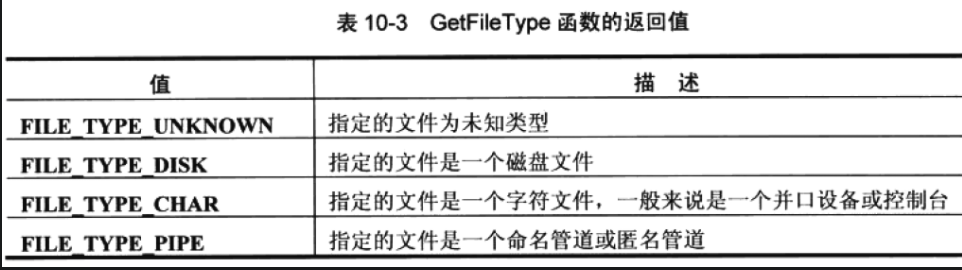

# **windows**核心编程

## 错误处理


| 数据类型   | 失败值                                                       |
| ---------- | ------------------------------------------------------------ |
| VOID       | 不可能失败                                                   |
| BOOL       | 失败0，否则非0，<Font color="red">所以最稳妥的就是判定是不是FALSE</font> |
| HANDLE     | 失败返回NULL，否则为一个可操作的对象。注意这种返回值，因为某些函数会返回INVALID_HANDLE_VALUE的一个句柄值，被定义为-1， |
| PVOID      | 失败则为NULL,否则为一块<font color="red">数据块的内存地址</font> |
| LONG/DWORD | 看文档。                                                     |

在内部，当windows函数检测到错误时，会使用一种名叫<font color="red">线程本地存储区(thread-local storage)</font>的机制将错误代码与主调线程(calling thread)关联到一起。所以这种机制能使各线程独立运行，并不会干扰对方，出现错误的时候使用 **GetLastError()** 来获取错误。

VS中，我们可以配置监视窗口，让他始终显示上一个错误代码和错误文件描述，具体做法是在watch窗口中输入<font color='red'>$err,hr</font>，可以一直看


## 内核对象

kernel object和handle

内核对象用于管理进程，线程和文件等资源

### 何为内核对象

访问令牌（access token）对象，事件对象，文件对象，文件映射对象，I/O完成端口对象，作业对象，邮件槽（mailslot）对象，互斥（metux）对象，管道（pipe）对象，进程对象，信号量（semaphore）,线程对象，可等待的计时器（waitable timer）对象，线程池工厂对象（thread poo worker factory）。

每个内核对象都是一个<font color='red'>内存块（一个数据结构）</font>，操作系统分配的，**只能由操作系统内核访问**。少数成员（安全描述符和使用计数等）是所有对象的，但其他大多数成员都是不同类型的对象特有的。例如：进程对象拥有进程ID，优先级，退出码。文件对象拥有：字节偏移量（byte offset），一个共性模式和一个打开模式。

因为程序员不能定位这些数据结构在内存中的位置，所以只能以windows提供的函数来操作这些结构。
调用创建内核对象的函数得到一个句柄，来表示创建的对象。为了让系统对内核对象进行操作，我们需要将举报传递给函数。同时， 这些**句柄值仅和进程相关** ，增强系统可靠性。

### 生命周期

由于对象的所有者是操作系统内核，而非进程。所以，当我们进程结束的时候，内核对象可能并未被销毁。如果有其他进程在使用的话。

#### 使用计数

windows对内核对象都包含一个计数（usage count），引用一次就 +1，没使用就 -1，当为0的时候，就销毁了。

### 安全性

内核对象可以使用一个安全描述符（security desciptor SD）来保护。描述谁拥有对象，那些用户和组被允许使用。一般在编写服务器的时候使用。

用于创建内核对象的函数几乎都有一个 **SECURITY_ATTRIBUTES** 结构作为参数。

创建用户对象和GDI对象则没有 **SECURITY_ATTRIBUTES**  结构。

### 进程内核对象句柄表

一个进程在初始化时，系统为它分配一个句柄表（handle table）。仅为系统内核对象使用，不适合用户对象和GDI对象。

### 创建内核对象

列举几个：

~~~C++
HANDLE CreateThread();
HANDLE CreateFile();
HANDLE CreateFileMapping();
HANDLE CreateSemaphore();	//	信号量    
~~~

返回一个进程相关的句柄，可以在同一进程中的所有线程使用。

一般创建一个内核对象失败通常为 0（NULL），也有几个返回-1（INVALID_HANDLE_VALUE）,所以检查返回值的时候，这里要注意。看具体函数。

### 关闭内核对象

无论以什么方式关闭，我们都要调用CloseHandle向系统表明我们已经结束使用对象。
~~~C++
BOOL CloseHandle(HANDLE hobject);
~~~

一旦调用了 CloseHandle()，便不可再使用它了，系统会处理它的，最好将句柄设置为 NULL，如果再使用会发生两种情况
*  windows接收到一个无用的句柄，报告错误。
* 创建一个新内核对象，对新内核对象进行操作。

当进程关闭的时候，系统扫描进程句柄表，如果含有有效记录项（进程结束前，没有关闭的对象），操作系统会为我们关闭这些对象的句柄。只要使用计数减到 0 ，则会销毁。

### 跨进程边界共享内核对象

进程边界： 每个进程的地址空间都是隔开的、相互独立的。一个进程不能访问其它进程的内存空间，一个进程打开的文件句柄不能在其它进程中使用。两个进程就像两个国家，进程边界就相当于边境。可以通过一些特殊函数跨过进程边界，让一个进程访问另一个进程的内存空间，让一个进程使用另一个进程打开的文件句柄。 

共享内核对象的理由：

* 利用文件映射对象，可以在同一台计算机的不同进程间共享数据块。
* 利用邮件槽和命名管道，在网络中的不同计算机上运行的进程可以互相发送数据块。
* 互斥量，信号量和事件允许不同进程中的线程同步执行。 

### 三种不同的机制在进程间共享内核对象

* 使用对象句柄继承
* 为对象命名
* 复制对象句柄

#### 1、使用对象句柄继承

进程之间有 父 - 子 关系的时候，才可以使用。

具体步骤：

1、父进程创建对象时候，必须向操作系统说明，**对象的句柄**是否可继承的，windows支持的是**对象句柄的继承**，并不是**对象继承**，换言之，只有句柄是可以继承的，对象是不能被继承的。

~~~c++
// 比如创建一个互斥量对象，并返回可继承的句柄
SECURITY_ATTRIBUTES sa;
sa.bInheritHandle = true;		// 指定可以被继承
sa.lpSecurityDescriptor = NULL;
sa.nLength = sizeof(SECURITY_ATTRIBUTES);

HANDLE hMutex = CreateMutex(&sa, FALSE, NULL);
~~~

2、由父进程生成一个子进程，通过CreateProcess创建。

~~~C++
BOOL CreateProcess(
　LPCTSTR lpApplicationName, // 应用程序名称
　LPTSTR lpCommandLine, // 命令行字符串
　LPSECURITY_ATTRIBUTES lpProcessAttributes, // 进程的安全属性
　LPSECURITY_ATTRIBUTES lpThreadAttributes, // 线程的安全属性
　BOOL bInheritHandles, // 是否继承父进程的属性
　DWORD dwCreationFlags, // 创建标志
　LPVOID lpEnvironment, // 指向新的环境块的指针
　LPCTSTR lpCurrentDirectory, // 指向当前目录名的指针
　LPSTARTUPINFO lpStartupInfo, // 传递给新进程的信息
　LPPROCESS_INFORMATION lpProcessInformation // 新进程返回的信息
);
~~~

如果 bInheritHandles 为 TRUE，则会遍历父进程的 句柄表，对它的每一项记录项进行检查。凡是包含一个有效的“可继承句柄”，就会被完整的复制到子进程的句柄表中。在子进程的句柄表中，复制项的位置与它在父进程句柄表中的位置是完全一样的，这点很重要，意味着在父进程和子进程中，对一个内核对象进行标示的句柄值是完全一样的。除了复制句柄表，系统还会增加内核对象的使用计数。所以，要销毁对象，父进程和子进程都需要调用 **CloseHandle()**，

<font color='red'>对象句柄的继承发生在生成子进程的时候。加入父进程后面又创建了内核对象，则正在运行的子进程不会继承这些。</font>

到目前为止，为了使进程得到他想要的一个内核对象的句柄值的几种方式

* 最常见的方式是将句柄值作为命令行参数传递给子进程，子进程初始化时采用（**_stscanf_s()**）提取句柄值。
* 等待子进程完成初始化，父进程将一条消息发送到由子进程的一个线程创建的一个窗口。
* 父进程添加一个环境变量，变量名称为子进程知道的一个名称，变量的值为被子进程继承的内核对象的句柄。当父进程创建子进程的时候，子进程也会继承父进程的环境变量。所以能轻松调用 **GetEbvuribnebtVariable()**获取，如果子进程还要创建子进程，则这种方式很不错，因为环境变量可以被反复继承。

#### 2、为对象命名

许多创建的内核对象都是可以命名的

~~~C++
HANDLE CreateMutex(
   PSLCURITY_ATTRIBUTES psa,
   BOOL bInitialOwner,
   PCTSTR pszName);

HANDLE CreateEvent(
   PSECURITY_ATTRIBUTES psa,
   BOOL bManualReset,
   BOOL bInitialState,
   PCTSTR pszName);

HANDLE CreateSemaphore(
   PSECURITY_ATTRIBUTES psa,
   LONG lInitialCount,
   LONG lMaximumCount,
   PCTSTR pszNarne);

HANDLE CreateWaitableTimer(
   PSLCURITY_ATTRIBUTES psa,
   BOOL bManualReset,
   PCTSTR pszName);

HANDLE CreateFileMapping(
   HANDLE hFile,
   PSECURITY_ATTRIBUTES psa,
   DWORD flProtect,
   DWORD dwMaximumSizeHigh,
   DWORD dwMaximumSizeLow,
   PCTSTR pszName);

HANDLE CreateJobObject(
   PSECURITY_ATTRIBUTES psa,
   PCTSTR pszName);
~~~

**如何共享**

假设进程 A 启动并调用以下函数

~~~C++
HANDLE hMutexProcessA = CreateMutex(NULL, FALSE, TEXT("GuidoMutex"));
~~~

当进程 B 调用 

~~~C++
HANDLE hMutexProcessB = CreateMutex(NULL, FALSE, TEXT("GuidoMutex"));
~~~

的时候，系统会首先检查是否存在一个名为“GuidoMutex”的内核对象，如果存在，再检查是否为 Mutex 对象，如果也是，再检查是否具有访问权限，如果也有，那么返回当前句柄，然后进程 B 在句柄表中查找一个空白记录项，初始化只想现有的内核对象。如果类型不匹配或者调用者被拒绝访问，则会返回 NULL。

为了实现内核对象的共享，还可以考虑另一个方法，不调用Create*函数，调用 

~~~C++
HANDLE OpenMutex(
   DWORD dwDesiredAccess,
   BOOL bInheritHandle,
   PCTSTR pszName);

HANDLE OpenEvent(
   DWORD dwDesiredAccess,
   BOOL bInheritHandle,
   PCTSTR pszName);

HANDLE OpenSemaphore(
   DWORD dwDesiredAccess,
   BOOL bInheritHandle,
   PCTSTR pszName),

HANDLE OpenWaitableTimer(
   DWORD dwDesiredAccess,
   BOOL bInheritHandle,
   PCTSTR pszName);

HANDLE OpenFileMapping(
   DWORD dwDesiredAccess,
   BOOL bInheritHandle,
   PCTSTR pszName);

HANDLE Openjob0bject(
   DWORD dwDesiredAccess,
   BOOL bInheritHandle,
   PCTSTR pszName);
~~~

Open系列函数，如果对象不存在，则会返回 NULL，失败告终。

Microsoft没有专门的机制来保证内核对象的独一无二，一种好的方法是，命名使用 “GUID”。


 命名对象常常用来防止运行一个应用程序的多个实例。若要做到这一点，只需要调用main或WinMain函数中Create*函数，以便创建一个命名对象（创建的是什么对象则是无所谓的）。当Create*函数返回时，调用GetLastError函数。如果GetLastError 函数返回ERROR_ALREADY_EXISTS ，那么你的应用程序的另一个实例正在运行，新实例可以退出。下面是说明这种情况的部分代码： 

~~~C++
intWINAPI WinMain(HINSTANCE hinstExe, HINSTANCE, PSTR pszCmdLine, int nCmdShow)
{
   HANDLE h = CreateMutex(NULL, FALSE, "{FA531CC1-0497-11d3-A180-00105A276C3E}");
   lf (GetLastError() == ERROR_ALREADY_EXISTS)
   {
      //There is already an instance
      //of the application running
      return(0),
   }
 
   //This is the first instance of thisapplication running.
   //Before exiting ,close the object.
   CloseHandle(h),
   return(0);
}
~~~

#### 3、复制对象句柄

 共享跨越进程边界的内核对象的最后一个方法是使用 

~~~c++
BOOL DuplicateHandle(
   HANDLE hSourceProcessHandle,
   HANDLE hSourceHandle,
   HANDLE hTargetProcessHandle,
   PHANDLE phTargetHandle,
   DWORD dwDesiredAccess,
   BOOL bInheritHandle,
   DWORD dwOptions);
~~~

函数获取一个进程的句柄表中的一个记录项，然后再另一个进程的句柄表中创建这个记录项的一个副本，

DuplicateHandle 函数最普通的用法要涉及系统中运行的3个不同进程。

* 第一和第三个参数hSourceProcessHandle和hTargetProcessHandle是内核对象句柄。这些句柄本身必须与调用DuplicateHandle 函数的进程相关。此外，这两个参数必须标识进程的内核对象。
*  第二个参数hSourceHandle是任何类型的内核对象的句柄。但是该句柄值与调用DuplicateHandle的进程并无关系。相反，该句柄必须与hSourceProcessHandle句柄标识的进程相关。
* 第四个参数phTagetHandle是HANDLE 变量的地址，它将接收获取源进程句柄信息拷贝的项目索引。返回的句柄值与hTargetProcessHandle标识的进程相关。
* 最后3 个参数用于指明该目标进程的内核对象句柄表项目中使用的访问屏蔽值和继承性标志。dwOptions参数可以是0 （零），也可以是下面两个标志的任何组合：DUPLICATE_SAME_ACCESS和DUPLICATE_CLOSE_SOURCE。
如果设定了DUPLICATE_SAME_ACCESS标志，则告诉DuplicateHandle 函数，你希望目标进程的句柄拥有与源进程句柄相同的访问屏蔽。使用该标志将使DuplicateHandle忽略它的dwDesiredAccess参数。如果设定了DUPLICATE_CLOSE_SOURCE标志，则可以关闭源进程中的句柄。该标志使得一个进程能够很容易地将内核对象传递给另一个进程。当使用该标志时，内核对象的使用计数不会受到影响。

例子

下面用一个例子来说明DuplicateHandle函数是如何运行的。在这个例子中。

Process S 是目前可以访问某个内核对象的源进程，
Process T 是将要获取对该内核对象的访问权的目标进程。
Process C 是执行对DuplicateHandle 调用的催化进程。

Process C 的句柄表包含两个句柄值，即1 和2 。句柄值1 用于标识Process S 的进程内核对象，句柄值2 则用于标识Process T 的进程内核对象。

| 索引 | 内核对象内存块的指针              | 访问屏蔽（标志位的D W O R D ） | 标志（标志位的D W O R D ） |
| ---- | --------------------------------- | ------------------------------ | -------------------------- |
| 1    | 0xF0000000(Process S 的内核对象） | 0 x ? ? ? ? ? ? ? ?            | 0 x 0 0 0 0 0 0 0 0        |
| 2    | 0xF0000010(Process T 的内核对象） | 0 x ? ? ? ? ? ? ? ?            | 0 x 0 0 0 0 0 0 0 0        |


Process S 的句柄表，它包含句柄值为2 的单个项目。该句柄可以标识任何类型的内核对象，就是说它不必是进程的内核对象。

| 索引 | 内核对象内存块的指针 | 访问屏蔽（标志位的D W O R D ） | 标志（标志位的D W O R D ） |
| ---- | -------------------- | ------------------------------ | -------------------------- |
| 1    | 0 x 0 0 0 0 0 0 0 0  | (无)                           | (无)                       |
| 2    | 0 x F 0 0 0 0 0 2 0  | 0 x ? ? ? ? ? ? ? ?            | 0 x 0 0 0 0 0 0 0 0        |

Process C 调用DuplicateHandle 函数之前Process T 的句柄表包含的项目。如你所见，Process T 的句柄表只包含句柄值为2 的单个项目，句柄项目1 目前未用。

| 索引 | 内核对象内存块的指针 | 访问屏蔽（标志位的D W O R D ） | 标志（标志位的D W O R D ） |
| ---- | -------------------- | ------------------------------ | -------------------------- |
| 1    | 0 x 0 0 0 0 0 0 0 0  | (无)                           | (无)                       |
| 2    | 0 x F 0 0 0 0 0 3 0  | 0 x ? ? ? ? ? ? ? ?            | 0 x 0 0 0 0 0 0 0 0        |

如果Process C 现在使用下面的代码来调用DuplicateHandle ，那么只有Process T 的句柄表改变更。

| 索引 | 内核对象内存块的指针 | 访问屏蔽（标志位的D W O R D ） | 标志（标志位的D W O R D ） |
| ---- | -------------------- | ------------------------------ | -------------------------- |
| 1    | 0 x F 0 0 0 0 0 2 0  | 0 x ? ? ? ? ? ? ? ?            | 0 x 0 0 0 0 0 0 0 1        |
| 2    | 0 x F 0 0 0 0 0 3 0  | 0 x ? ? ? ? ? ? ? ?            | 0 x 0 0 0 0 0 0 0 0        |

Process S 的句柄表中的第二项已经被拷贝到Process T 的句柄表中的第一项（见粉红色）。

DuplicateHandle 也已经将值1 填入Process C 的hObj变量中。值1是Process T 的句柄表中的索引，新项目将被放入该索引。

由于DUPLICATE_SAME_ACCESS标志被传递给了DuplicateHandle，因此Process T 的句柄表中该句柄的访问屏蔽与Process S 的句柄表项目中的访问屏蔽是相同的。

另外，传递DUPLICATE_SAME_ACCESS标志将使DuplicateHandle忽略它的DesiredAccess参数。最后请注意，继承位标志已经被打开，因为给DuplicateHandle 的bInheritHandle参数传递的是TRUE。

显然，你永远不会像在这个例子中所做的那样，调用传递硬编码数字值的DuplicateHandle函数。这里使用硬编码数字，只是为了展示函数是如何运行的。在实际应用程序中，变量可能拥有各种不同的句柄值，可以传递该变量，作为函数的参数。

与继承性一样，DuplicateHandle函数存在的奇怪现象之一是，目标进程没有得到关于新内核对象现在可以访问它的通知。因此，Process C 必须以某种方式来通知Process T,它现在拥有对内核对象的访问权，并且必须使用某种形式的进程间通信方式，以便将h O b j 中的句柄值传递给Process T 。显然，使用命令行参数或者改变Process T 的环境变量是不行的，因为该进程已经启动运行。因此必须使用窗口消息或某种别的IPC机制。

上面是DuplicateHandle的最普通的用法。它是个非常灵活的函数。不过，它很少在涉及3 个不同进程的情况下被使用（因为Process C 不可能知道对象的句柄值正在被Proces s使用）。

通常，当只涉及两个进程时，才调用DuplicateHandle 函数。比如一个进程拥有对另一个进程想要访问的对象的访问权，或者一个进程想要将内核对象的访问权赋予另一个进程。

例如，Process S 拥有对一个内核对象的访问权，并且想要让Process T 能够访问该对象。若要做到这一点，可以像下面这样调用DuplicateHandle :

~~~C++
//ALL of the following code is executed by Process S.
//Createamutex object accessible by Process S.
HANDLE hObjProcessS = CreateMutex(NULL, FALSE, NULL);

//Open ahandle to Process T's kernel object.
HANDLE hProcessT = OpenProcess(PROCESS_ALL_ACCESS,
   FALSE, dwProcessIdT);

//Anuninitilized handle relative to Process T.
HANDLE hObjProcessT;

//GiveProcess T accesss to our mutex object
DuplicateHandle(GetCurrentProcess(),
   hObjProcessS,
   hProcessT,
   &hObjProcessT, 0, FALSE,
   DUPLICATE_SAME_ACCESS);

//Usesome IPC mechanism to get the handle
//valuein hOnjProcess S into Process T
//We nolonger need to communicate with Process T.
CloseHandle(hProcessT);

//WhenProcess S no longer needs to Use the mutex,
//itshould close it.
CloseHandle(hObjProcessS);
~~~

在这个例子中，对GetCurrentProcess 的调用将返回一个伪句柄，该句柄总是用来标识调用端的进程Process S 。一旦DuplicateHandle 返回，hObjProcessT 就是与Process T 相关的句柄，它所标识的对象与引用Process S 中的代码时hObjProcess S 的句柄标识的对象相同。

Process S 决不应该执行下面的代码：

//ProcessS should never attempt to close the duplicated handle

CloseHandle(hObjProcessT);

如果Process S 要执行该代码，那么对代码的调用可能失败，也可能不会失败。如果Process S 恰好拥有对内核对象的访问权，其句柄值与hObjProcess T 的值相同，那么调用就会成功。该代码的调用将会关闭某个对象，这样Process S 就不再拥有对它的访问权，这当然会导致应用程序产生不希望有的行为特性。

**下面是使用DuplicateHandle函数的另一种方法**

假设一个进程拥有对一个文件映射对象的读和写访问权。在某个位置上，一个函数被调用，它通过读取文件映射对象来访问它。为了使应用程序更加健壮，可以使用DuplicateHandle 为现有的对象创建一个新句柄，并确保这个新句柄拥有对该对象的只读访问权。然后将只读句柄传递给该函数，这样，该函数中的代码就永远不会偶然对该文件映射对象执行写入操作。下面这个代码说明了这个例子：

~~~c++
intWINAPI WinMain(HINSTANCE hinstExe, HINSTANCE,
   PSTR pszCmdLine, int nCmdShow)
{
   //Create a file-mapping object;
   //the handle has read/write access.
   HANDLE hFileMapRW = CreateFileMapping(INVALID_HANDLE_VALUE,
      NULL, PAGF_READWRITE, 0, 10240, NULL);

   //Create anotherhandle to the file-mappingobject;
   //the handle has read-only access.
   HANDLE hFileMapRO;

   DuplicateHandle(GetCurrentProcess(),hFileMapRW,
      GetCurrentProcess(), &hFileMdpRO,
      FILE_MAP_READ, FALSE, 0);

   //Call the function that should only read
   //from the mapping.
   ReadFromTheFileMapping(hFileMapRO);

   //Close the read-only file-mapping object.
   CloseHandle(hFileMapRO);

   //We can still read/write the file-mapping
   //object using hFileMapRW.When the main code
   //doesnot access the file mapping anymore
   CloseHandle(hFileMapRW);
}
~~~


## 进程

定义：一般为一个正在运行的实例，一般两部分组成：

* 一个内核对象，操作系统用它来管理进程。内核对象也是系统保存进程统计信息的地方。
* 一个地址空间，包含可执行文件exe或者dll模块的代码和数据，和包含动态内存分配，比如线程堆栈和堆的分配。

进程是有惰性的，进程要做任何事情，都必须让一个线程在它的上下文中运行。该线程负责执行进程的地址空间包含的代码。每个线程都有他自己的一组 CPU 和寄存器和他自己的堆栈。每个进程至少有一个线程来执行进程地址空间包含的代码。当系统创建一个进程的时候，会自动为进程创建一个线程。称之为主线程（primary thread）。然后这个线程再创建更多的线程。如果没有线程要执行代码，那么进程也没必要存在，系统就会销毁它。

进程是一个线程的容器。

对于所有要运行的线程，操作系统会轮流为每一个线程调度一些CPU时间，采取**轮询**或**轮流**(round-robin)方式，为每一个线程分配一个时间片（量，或者量程，即 quantum）从而营造并发假象。

### 进程的实例句柄

加载到进程地址空间的每一个可执行文件或者dll文件都被赋予了一个独一无二的实例句柄。可执行文件的实例被当做(w)WinMain函数的第一个参数 hInstanceExe 传入。在需要加载资源的函数调用中，一般都要提供此句柄的值。例如，为了从可执行文件的映像中加载一个图标资源，调用下面的函数

~~~C++
HICON LoadIcon(HINSTANCE hInstance, PCTSTR pszIcon);
~~~

参数：hInstance则指出哪个文件（可执行exe或者dll）中。

Platform SDK中，有的函数需要一个 HMODULE 类型参数，比如

~~~C++
// 获取当前进程已加载模块的文件的完整路径，该模块必须由当前进程加载。
// 如果想要获取另一个已加载模块的文件路径，可以使用GetModuleFileNameEx函数。
DWORD WINAPI GetModuleFileName(
    _In_opt_  HMODULE hModule,
    _Out_     LPTSTR lpFilename,
    _In_      DWORD nSize
);
~~~

HMODULE和HINSTANCE就是一回事。

### 进程的命令行

在操作命令行的时候，最好先复制到本地的一个只读缓冲区进行操作。可使用 CommandLineToArgvW()，将字符串分解为单个标记。(需要free)。

~~~C++
LPWSTR * CommandLineToArgvW(
  LPCWSTR lpCmdLine,
  int     *pNumArgs
);

/*
Parameters
lpCmdLine

Type: LPCWSTR
Pointer to a null-terminated Unicode string that contains the full command line. If this parameter is an empty string the function returns the path to the current executable file.

pNumArgs

Type: int*

Pointer to an int that receives the number of array elements returned, similar to argc.
*/

// Examples
#include <windows.h>
#include <stdio.h>
#include <shellapi.h>

int __cdecl main()
{
   LPWSTR *szArglist;
   int nArgs;
   int i;

   szArglist = CommandLineToArgvW(GetCommandLineW(), &nArgs);
   if( NULL == szArglist )
   {
      wprintf(L"CommandLineToArgvW failed\n");
      return 0;
   }
   else for( i=0; i<nArgs; i++) printf("%d: %ws\n", i, szArglist[i]);

// Free memory allocated for CommandLineToArgvW arguments.

   LocalFree(szArglist);

   return(1);
}
~~~

### 进程当前所在的驱动器和目录

如果不提供完整的路径名，各种windows函数会在当前的驱动器的当前目录查找文件和目录。

系统在内部跟踪和记录着一个进程的当前驱动器和目录。由于这种信息是以进程为单位来维护的，所以加入进程中的一个线程更改了当前驱动器和目录，那么对于当前进程中的所有线程来说，此信息都被更改了。

线程可调用一下函数来获取和设置气所在进程的当前驱动器和目录

~~~C++
//声明:
DWORD GetCurrentDirectory(
 DWORDnBufferLength,  // size of directory buffer 缓冲区的长度
 LPTSTRlpBuffer      // directory buffer 指定一个预定义字串，用于装载当前目录
);

BOOL WINAPI SetCurrentDirectory(
LPCTSTR lpPathName    //要切换到目的路径
);

// 举例

char szCurPath[MAX_PATH] = "D:\\Path";
GetCurrentDirectory(sizeof(szCurPath), szCurPath);			//获取当前工作目录
 
SetCurrentDirectory(szCurPath);			//设置当前工作目录路径
~~~

### 系统版本

~~~ C++
BOOL GetVersionEx(POSVERSIONINFO pVersionInformation);

typedef struct {
DWORD dwOSVersionInfoSize;       		//在使用GetVersionEx之前要将此初始化为结构的大小
DWORD dwMajorVersion;               	//系统主版本号
DWORD dwMinorVersion;               	//系统次版本号
DWORD dwBuildNumber;               		//系统构建号
DWORD dwPlatformId;                  	//系统支持的平台(详见附1)
TCHAR szCSDVersion[128];         	 	//系统补丁包的名称
WORD wServicePackMajor;            		//系统补丁包的主版本
WORD wServicePackMinor;            		//系统补丁包的次版本
WORD wSuiteMask;                      	//标识系统上的程序组(详见附2)
BYTE wProductType;                    	//标识系统类型(详见附3)
BYTE wReserved;                         //保留,未使用
} OSVERSIONINFOEX, *POSVERSIONINFOEX;

// 举例
OSVERSIONINFOEX os;
os.dwOSVersionInfoSize=sizeof(os);
// 函数返回值为TRUE表示成功:
if(!GetVersionEx((OSVERSIONINFO *)&os))
{
	return FALSE;
}
~~~


### 创建进程

CreateProcess();

~~~C++
BOOL CreateProcess(  
　LPCTSTR lpApplicationName, // 应用程序名称  
　LPTSTR lpCommandLine, // 命令行字符串  
　LPSECURITY_ATTRIBUTES lpProcessAttributes, // 进程的安全属性  
　LPSECURITY_ATTRIBUTES lpThreadAttributes, // 线程的安全属性  
　BOOL bInheritHandles, // 是否继承父进程的属性  
　DWORD dwCreationFlags, // 创建标志  
　LPVOID lpEnvironment, // 指向新的环境块的指针  
　LPCTSTR lpCurrentDirectory, // 指向当前目录名的指针  
　LPSTARTUPINFO lpStartupInfo, // 传递给新进程的信息  
　LPPROCESS_INFORMATION lpProcessInformation // 新进程返回的信息  
);  
/*
第 1 个参数  lpApplicationName 是输入参数，指向启动进程的 exe 文件。

第 2 个参数  lpCommandLine 是输入参数，是启动进程的命令行中的参数。
当这两个参数都不为 NULL 时，第 1 个参数指定要启动的进程 exe 文件(不带参数)，第 2 个参数指定启动进程所需参数。第 1 个参数也可以为 NULL，此时第 2 个参数就不能为 NULL，在 lpCommandLine 需要指定出要启动的程序名以及所接参数，彼此间以空格隔开，其中第 1 个参数即是程序名。

第 3 个参数  lpProcessAttributes 是输入参数，指向 SECURITY_ATTRIBUTES 结构变量，是进程的安全属性，可以为 NULL 则使用默认的安全属性。

第 4 个参数  lpThreadAttributes 是输入参数，同第 3 个参数一样，指向 SECURITY_ATTRIBUTES 结构变量。

第 5个参数  bInheritHandles 是输入参数，表示新进程是否从调用进程处继承了句柄。如果参数的值为 TRUE，调用进程中的每一个可继承的打开句柄都将被子进程继承。被继承的句柄与原进程拥有完全相同的值和访问权限；如果设为 FALSE，那么不继承。

第 6 个参数  dwCreationFlags 是输入参数，表示进程的创建标志以及优先级控制。如 ： CREATE_NEW_CONSOLE 会使新建的控制台程序拥有一个新的控制台； DEBUG_PROCESS 调用进程将被当作一个调试程序，并且新进程会被当作被调试的进程。系统把被调试程序发生的所有调试事件通知给调试器。

第 7 个参数  lpEnvironment 是输入参数，指向新进程的环境变量块，如果设置为 NULL，那么使用父进程的环境变量。

第 8 个参数  lpCurrentDirectory 是输入参数，指定创建后新进程的当前目录，如果设置为 NULL，那么就在父进程所在的当前目录。

第 9 个参数  lpStartupInfo 是输入参数，指向一个 STARTUPINFO 结构，该结构里可以设定启动信息，可以设置为 NULL 。

第 10 个参数  lpProcessInformation 是输出参数，指向一个 PROCESS_INFORMATION 结构，返回被创建进程的信息。
*/

#include<iostream>  
#include<Windows.h>  
  
using namespace std;  
  
int main()  
{  
    char cWindowsDirectory[MAX_PATH];  
  
    //LPTSTR 与 wchar_t* 等价(Unicode环境下)  
    LPTSTR cWinDir = new TCHAR[MAX_PATH];  
    GetCurrentDirectory(MAX_PATH, cWinDir);  
  
    LPTSTR sConLin = wcscat(cWinDir , L"\\..\\Debug\\another.exe a b c d");  
  
    STARTUPINFO si;  
    PROCESS_INFORMATION pi;  
  
    ZeroMemory(&si, sizeof(si));  
    ZeroMemory(&pi, sizeof(pi));  
  
    //创建一个新进程  
    if(CreateProcess(  
        NULL,   //  指向一个NULL结尾的、用来指定可执行模块的宽字节字符串  
        sConLin, // 命令行字符串  
        NULL, //    指向一个SECURITY_ATTRIBUTES结构体，这个结构体决定是否返回的句柄可以被子进程继承。  
        NULL, //    如果lpProcessAttributes参数为空（NULL），那么句柄不能被继承。<同上>  
        false,//    指示新进程是否从调用进程处继承了句柄。   
        0,  //  指定附加的、用来控制优先类和进程的创建的标  
            //  CREATE_NEW_CONSOLE  新控制台打开子进程  
            //  CREATE_SUSPENDED    子进程创建后挂起，直到调用ResumeThread函数  
        NULL, //    指向一个新进程的环境块。如果此参数为空，新进程使用调用进程的环境  
        NULL, //    指定子进程的工作路径  
        &si, // 决定新进程的主窗体如何显示的STARTUPINFO结构体  
        &pi  // 接收新进程的识别信息的PROCESS_INFORMATION结构体  
        ))  
    {  
        cout << "create process success" << endl;  
  
        //下面两行关闭句柄，解除本进程和新进程的关系，不然有可能不小心调用TerminateProcess函数关掉子进程  
//      CloseHandle(pi.hProcess);  
//      CloseHandle(pi.hThread);  
    }  
    else{  
        cerr << "failed to create process" << endl;  
    }  
  
    Sleep(100);  
  
    //终止子进程  
    TerminateProcess(pi.hProcess, 300);  
  
    //终止本进程，状态码  
    ExitProcess(1001);  
  
    return 0;  
}  
~~~


### 子进程

为了让另一段代码来执行工作的一个方法是在进程内创建一个线程，我们代码就可以继续工作，但是当我们的线程需要查看新线程的结果的时候就会遇到同步问题。

为了在处理工作期间保护地址空间，防止数据被更改。这种时候就可以生成一个新的进程来帮助我们完成。等新进程结束后，在进行我们的工作。这种情况下，最好让进程在自己的地址空间运行，并允许访问父进程地址空间和他工作相关的数据，从而保护正在处理无关的其他数据。

### **进程间通信的方式** 

动态数据交换（dynamic data exchange, DDE），OLE，管道，邮件槽等，最常用的就是使用内存映射文件。

演示希望创建子进程并进行一些工作，等候结果

~~~C++
PROCESS_INFORMATION pi;
DWORD dwExitCode;

// Spawn the child process
BOOL bSuccess = CreateProcess(..., &pi);
if(bSuccess)
{
    // 隔离主进程和子进程
    CloseHandle(pi.hThread);
    
    // 等待子进程结束
    WaitForSingleObject(pi.hProcess, INFINITE);
    
    // 获取退出码
    GetExitCodeProcess(pi.hProcess, &dwExitCode);
    
    // 关闭
    CloseHandle(pi.hProcess);
}
~~~


## 线程

同进程组成部分一样：一个内核对象和一个地址空间。

线程的组成：

* 线程的内核对象，操作系统用来管理线程，系统还用内核对象来存放线程统计信息的地方。
* 线程栈，用来维护线程执行时所有函数的参数和局部变量。

线程的开销比进程较小，所以，尽量使用线程解决编程问题。

### CreateThread()

~~~c++

HANDLE CreateThread(
                    LPSECURITY_ATTRIBUTES lpThreadAttributes,
                    DWORD dwStackSize,
                    LPTHREAD_START_ROUTINE lpStartAddress,
                    LPVOID lpParameter,
                    DWORD dwCreationFlags,
                    LPDWORD lpThreadID
                   );

/*
参数的含义如下：
lpThreadAttrivutes：指向SECURITY_ATTRIBUTES的指针，用于定义新线程的安全属性，一般设置成NULL；

dwStackSize：分配以字节数表示的线程堆栈的大小，默认值是0；一般在链接器的/STACK开关来控制这个值，一般为1M

lpStartAddress：指向一个线程函数地址。每个线程都有自己的线程函数，线程函数是线程具体的执行代码；

lpParameter：传递给线程函数的参数；

dwCreationFlags：表示创建线程的运行状态，其中CREATE_SUSPEND表示挂起当前创建的线程，而0表示立即执行当前创建的进程；

lpThreadID：返回新创建的线程的ID编号；

如果函数调用成功，则返回新线程的句柄，调用WaitForSingleObject函数等待所创建线程的运行结束。函数的格式如下：
*/

DWORD WaitForSingleObject(
                          HANDLE hHandle,
                          DWORD dwMilliseconds
                         );
/*
参数的含义如下：
hHandle：指定对象或时间的句柄；

dwMilliseconds：等待时间，以毫秒为单位，当超过等待时间时，此函数返回。如果参数设置为0，则该函数立即返回；如果设置成INFINITE，则该函数直到有信号才返回。

////////////////////////
一般情况下需要创建多个线程来提高程序的执行效率，但是多个线程同时运行的时候可能调用线程函数，在多个线程同时对一个内存地址进行写入操作，由于CPU时间调度的问题，写入的数据会被多次覆盖，所以要使线程同步。

就是说，当有一个线程对文件进行操作时，其它线程只能等待。可以通过临界区对象实现线程同步。临界区对象是定义在数据段中的一个CRITICAL_SECTION结构，Windows内部使用这个结构记录一些信息，确保同一时间只有一个线程访问改数据段中的数据。

使用临界区的步骤如下：

（1）初始化一个CRITICAL_SECTION结构；在使用临界区对象之前，需要定义全局CRITICAL_SECTION变量，在调用CreateThread函数前调用InitializeCriticalSection函数初始化临界区对象；

（2）申请进入一个临界区；在线程函数中要对保护的数据进行操作前，可以通过调用EnterCriticalSection函数申请进入临界区。由于同一时间内只能有一个线程进入临界区，所以在申请的时候如果有一个线程已经进入临界区，则该函数就会一直等到那个线程执行完临界区代码；

（3）离开临界区；当执行完临界区代码后，需要调用LeaveCriticalSection函数离开临界区；

（4）删除临界区；当不需要临界区时调用DeleteCriticalSection函数将临界区对象删除；

*/
~~~

调用 CreateThread()函数的时候，系统会创建一个线程内核对象，这个线程内核对象并不是线程本身，而是用来管理线程的一个数据结构。

系统从进程的地址空间中分配内存给线程栈使用，线程在负责创建那个线程的相同的进程上下文中运行。所以，线程可以访问进程内核对象的所有句柄，进程中的所有内存，和进程中其他所有线程的栈。这样一来，同一进程中的多个线程就可以很容易互相通信。

<font color='red'>CreateThread()是创建线程的windows函数，如果写C/C++代码，绝对不要用CreateThread(), 应该选择c++ runtime lib _beginthreadex()</font>

### 线程结束方式

* 线程函数返回。
* 调用 ExitThread() 杀死自己 <font color=red>避免</font>
* 同一进程或另一进程中的线程调用 TerminateThread()函数。<font color='red'>避免使用</font>
* 包含的线程的进程终止运行。<font color=red>(避免)</font>

### 线程终止运行时

发送的事情

* 线程拥有的所有用户句柄会被释放，在widows中，大多数对象都是包含了“创建这些对象的线程”的进程拥有的，但一个线程有两个用户对象：窗口（window）和挂钩（hook）。一个线程终止运行的时候。系统会自动销毁由线程创建或安装的任何窗口和卸载由线程创建或安装的任何挂钩。其他对象只有在拥有线程的进程终止时才被销毁。线程的退出代码从 STILL_ACTIVE 变成传给ExitThread 或 TerminateThread的代码。
* 线程内核对象的状态变成触发状态。
* 如果线程为进程中最后一个线程，那么进程也终止。
* 线程内核对象的使用计数 -1

### 线程内幕


为什么要使用  _beginthreadex 而不用CreateThread来创建新线程。当线程调用一个需要 _tiddata 结构的就会发生错误。

使用 _beginthreadex  替换 _beginthread

使用 _endthreadex  替换 _endthread

### 线程的身份

#### 伪句柄

引用进程或者线程自己的函数

HANDLE GerCurrentProcess();

HANDLE GerCurrentThread();

这两个函数返回主调进程或者线程的一个伪句柄，不会新建或者增加计数。如果调用CloseHandle()，则会忽略并返回。

关于伪句柄：
官方解释：伪句柄是一个特殊的常量，当前为（HANDLE）-1，它被解释为当前进程的句柄。为了与将来的操作系统兼容，最好调用 GetCurrentProcess，而不是硬编码此常量值。每当需要进程句柄时，调用进程就可以使用伪句柄指定其自己的进程。伪句柄不由子进程继承。

通俗理解：
所谓的伪句柄，它们并不反映真实的句柄表信息，仅用来作用于当前线程\进程本身
当我们调用GetCurrentThread()与GetCurrentProcess()时，其总是会返回值0xfffffffe（-2），0xffffffff（-1）
伪句柄仅限作用于当前线程\进程。超出了当前线程\进程便没有任何意义。

所以在使用下面一段代码的时候，会得不到想要的结果

本来在子线程获取父线程的线程时间信息，得到的却是子线程的，因为

<font color=red>所谓的伪句柄，它们并不反映真实的句柄表信息，仅用来作用于当前线程\进程本身当我们调用GetCurrentThread()与GetCurrentProcess()时，其总是会返回值0xfffffffe（-2），0xffffffff（-1）</font>

~~~C++
DWORD WINAPI ParentThread(PVOID pvParam)
{
    HANDLE hThreadParent = GetCurrentThread();
    CreateThread(NULL, 0, ChildThread, (PVOID)hThreadParent, 0, NULL);
}

DWORD WINAPI ChildThread(PVOID pvParam)
{
    HANDLE hThreadParent = (HANDLE)pvParam;
	FILETIME ftCreateTime, ftExitTime, ftKernelTime,ftUserTime;
    GetThreadTimes(hThreadParent, &ftCreateTime, &ftExitTime, &ftUserTime);
    
}

~~~


#### 真实句柄

将伪句柄转换为真正的句柄，一个能明确，无歧义的标识一个线程的句柄。

DuplicateHandle()接口可以将伪句柄转换为真正的句柄。

~~~c++

BOOL DuplicateHandle(
	HANDLE hSourceProcessHandle,	// 待复制句柄所在的进程句柄;
	HANDLE hSourceHandle,			// 待复制的进程或线程句柄（也可以其他句柄）;
	HANDLE hTargetProcessHandle,	// 要复制到的均所在的进程句柄;
	LPHANDLE lpTargetHandle,	// 用来返回复制后的句柄;
	DWORD dwDesiredAccess,		// 指定掩码，根据最后一个参数觉得;
	BOOL bInheritHandle,	// 是否继承;
	DWORD dwOptions		// 0或者DUPLICATE_SAME_ACCESS或DUPLICATE_CLOSE_SOURCE;
	);
~~~

~~~C++
// 使用 DuplicateHandle() 更改。 
DWORD WINAPI ParentThread(PVOID pvParam)
{
    HANDLE hThreadParent = NULL;
    DuplicateHandle(
        GetCurrentProcess();
        GetCurrentThread();
        GetCurrentProcess();
        &hThreadParent,
        0,
        FALSE,
        DUPLICATE_SAME_ACCESS // 表示希望目标句柄拥有和源句柄一样的访问掩码;
    );
    
    CreateThread(NULL, 0, ChildThread, (PVOID)hThreadParent, 0, NULL);
}

DWORD WINAPI ChildThread(PVOID pvParam)
{
    HANDLE hThreadParent = (HANDLE)pvParam;
	FILETIME ftCreateTime, ftExitTime, ftKernelTime,ftUserTime;
    GetThreadTimes(hThreadParent, &ftCreateTime, &ftExitTime, &ftUserTime);
    
    CloseHandle(hThreadParent);
    
}
~~~

当父线程执行时，会把标识父线程的有歧义的伪句柄转换为一个新的真正的句柄，传递给 CreateThread();

DuplicateHandle 递增了指定内核对象的使用计数，所以在使用完了也需要 调用 CloseHandle，以减少对象的使用计数。

## 线程调度，优先级和关联性

在线程内核对象中有一个值表示线程的挂起计数，调用CreateProcess() 或者 CreateThread()时，系统将创建进程的内核对象，并把挂起计数初始化为1。这样就CPU就不会分配时间给此线程。因为，线程初始化需要时间，并不想还没准备好就执行他。

初始化后，会查看是否含有 CREATE_SUSPENDED标志传入，如果有，则挂起，如果没有，则挂起计数 -1 ，如果计数为0，则变成可调度。

线程在挂起的时候可以修改线程的编辑，修改之后必须使其编程可调度的。通过 ResumeThread() 变成可调度的。

~~~C++
DWORD ResumeThread(HANDLE hThread);
~~~

通过 SuspendThread() 可以使线程挂起。

~~~C++
DWORD SuspendThread(HANDLE hThread);
~~~

### 线程优先级

Cpu运行一个线程的时间大约 20ms，这是在优先级相同的时候，如果不同，那么线程运行时间不同，

windows 中 有 0 - 31 个优先级。


## 用户模式的线程同步

### 原子访问

Interlocked 系列函数

~~~C++
Interlocked系列函数
1.增减操作
LONG __cdecl InterlockedIncrement(LONG volatile* Addend);
LONG __cdecl InterlockedDecrement(LONG volatile* Addend);
返回变量执行增减操作之后的值。

LONG __cdec InterlockedExchangeAdd(LONG volatile*Addend,LONGValue);
返回运算后的值，注意！加个负数就是减。

2.赋值操作
LONG __cdecl InterlockedExchange(LONG volatile* Target,LONGValue);
Value就是新值，函数会返回原先的值。

~~~


原子访问，指的是在一个线程访问某个资源的时候，能保证没有其他线程会在同一时刻访问同一资源。

~~~c++
long g_x = 0;
DWORD WINAPI ThreadFunc1(PVOID pvParam)
{
    g_x++;
    return 0;
}
DWORD WINAPI ThreadFunc2(PVOID pvParam)
{
    g_x++;
    return 0;
}
~~~

创建这两个线程，当线程都停止的时候，不能保证 g_x的值为2，因为线程在汇编上运行，所以结果可能是2。也可能是1。

**采用原子操作**

这样就能保证最终的结果是2

~~~c++
long g_x = 0;
DWORD WINAPI ThreadFunc1(PVOID pvParam)
{
    InterlockedExchandeAdd(&g_x, 1);
    return 0;
}
DWORD WINAPI ThreadFunc2(PVOID pvParam)
{
    InterlockedExchandeAdd(&g_x, 1);
    return 0;
}
~~~


**InterlockedExchange**和**InterlockedExchangePointer**会把第一个参数指向的内存地址当前值，以原子替换方式为第二个参数指定的值，对32位程序来说，两个程序都用 32位 替换 32位。对64*位来说**InterlockedExchange***替换32*位**InterlockedExchangePointer***替换64位，都会返回原来的值。

在实现 自旋锁（spinlock）的时候，InterlockedExchange 是很有用的

~~~c++
BOOL g_bResourcesInUse = FALSE;
void Func1()
{
    While(InterlockedExchange(&g_bResourcesInUse,TRUE) == TRUE)
    {
        Sleep(0);
    }
    
    // Access the resources start
    // ...
    // Access the resources end
    
   InterlockedExchange(&g_bResourcesInUse,FALSE);
}
~~~

当其他线程正在使用此资源的时候，比如有五个线程都使用了此函数来创建。那么其余四个就会一直循环while。使用 自旋锁的时候要小心，因为CPU会不断的比较两个值，直到另一个改变了其中一个值。

在单 CPU上尽量少使用 自旋锁，因为很浪费时间，一种好的方式是将 Sleep() 替换成 SwitchToThread();

旋转锁嘉定被保护的资源始终只会被占用一小段时间。与切换到内核模式然后等待相比，这种情况下的效率也会更高。一般会指定循环次数（比如 4000次），然后切换到内核模式。此时他不消耗cpu时间。这就是关键段（critical section）的实现方式。

**Interlocked 单向链表**

使用Interlocked单向链表的栈进行操作，栈中的每一个操作，出栈和入栈都是原子方式进行的。


### 高速缓存行

如果单单去观察一个HelloWord和程序是如何在计算机从执行的，就会发现系统花了大量的时间吧信息从一个地方加载到另一个地方，HelloWord程序最初存放在硬盘上，然后当程序加载时被复制到主存，当CPU运行，这些程序又要复制到CPU…，这些复制的开销减慢了程序的执行效率。那么怎么办呢？

首先我们要清楚的是，较大的储存设备比较小的设备运行的慢（机械原理决定的），而同类存储设备中，存储快的设备比存储慢的设备贵很多。比如吧：你的硬盘可能比你的内存大1000倍，但是CPU从硬盘上读取一字节花费的时间可能比你从内存中花费的时间多1000万倍！

在比如说寄存器文件（CPU里的一个存数据的东西，比高速缓存还要快）只能存储几百个字节，内存里可能存放几十亿字节，但是从寄存器文件中读取数据要比从内存中大概快100倍！

针对这种CPU和内存的差异，这篇文章的主角高速缓存诞生了。高速缓存比主存更小更快，存放CPU经常访问的数据。这样可以大大提高程序的执行性能。

  


### 关键段

关键段（critical section）是一小段代码。它在执行前需要独自占有一些共享资源的访问权，这种方式可以让多行代码以原子方式访问资源并进行操控，。这里的原子方式是指，代码除了知道当前线程以外，没有其他任何线程会同时访问该资源。当然，系统仍然可以暂停当前线程去调度其他线程，但是，在当前线程离开关键段之前，系统是不会去调度任何想要访问同一资源的其他线程的。

**下面一段问题代码，暂时不使用关键段出现的错误**

~~~c++
const int COUNT = 1000;
int g_nSum = 0;

DWORD WINAPI FirstThread(PVOID pvParam)
{
    g_nSum = 0;
    for( int n = 1; n <= COUNT; n++)
    {
        g_nSum += n;
    }
    
    return g_nSum;
}

DWORD WINAPI SecondThread(PVOID pvParam)
{
    g_nSum = 0;
    for( int n = 1; n <= COUNT; n++)
    {
        g_nSum += n;
    }
    
    return g_nSum;
}
~~~

如果两个线程同时运行，可能得不到像个 1000 的值相加的结果。

这个时候就需要引入关键段。

~~~c++
const int COUNT = 1000;
int g_nSum = 0;
CRITICAL_SECTION g_cs;

DWORD WINAPI FirstThread(PVOID pvParam)
{
    EnterCriticalSection(&g_cs);
    g_nSum = 0;
    for( int n = 1; n <= COUNT; n++)
    {
        g_nSum += n;
    }
    LeaveCriticalSection(&g_cs);
    
    return g_nSum;
}

DWORD WINAPI SecondThread(PVOID pvParam)
{
    EnterCriticalSection(&g_cs);
    g_nSum = 0;
    for( int n = 1; n <= COUNT; n++)
    {
        g_nSum += n;
    }
    LeaveCriticalSection(&g_cs);
    
    return g_nSum;
}
~~~

 很多人对CRITICAL_SECTION的理解是错误的，认为CRITICAL_SECTION是锁定了资源，其实，CRITICAL_SECTION是不能够“锁定”资源的，它能够完成的功能，是同步不同线程的代码段。简单说，当一个线程执行了EnterCritialSection之后，cs里面的信息便被修改，以指明哪一个线程占用了它。而此时，并没有任何资源被“锁定”。不管什么资源，其它线程都还是可以访问的（当然，执行的结果可能是错误的）。只不过，在这个线程尚未执行LeaveCriticalSection之前，其它线程碰到EnterCritialSection语句的话，就会处于等待状态，相当于线程被挂起了。 这种情况下，就起到了保护共享资源的作用。

   也正由于CRITICAL_SECTION是这样发挥作用的，所以，必须把每一个线程中访问共享资源的语句都放在EnterCritialSection和LeaveCriticalSection之间。这是初学者很容易忽略的地方。

   当然，上面说的都是对于同一个CRITICAL_SECTION而言的。 如果用到两个CRITICAL_SECTION，比如说：

第一个线程已经执行了EnterCriticalSection(&cs)并且还没有执行LeaveCriticalSection(&cs)，这时另一个线程想要执行EnterCriticalSection(&cs2)，这种情况是可以的（除非cs2已经被第三个线程抢先占用了）。这也就是多个CRITICAL_SECTION实现同步的思想。

​    比如说我们定义了一个共享资源dwTime[100]，两个线程ThreadFuncA和ThreadFuncB都对它进行读写操作。当我们想要保证 dwTime[100]的操作完整性，即不希望写到一半的数据被另一个线程读取，那么用CRITICAL_SECTION来进行线程同步如下：

   第一个线程函数：

~~~c++
DWORD WINAPI ThreadFuncA(LPVOID lp)
{
            EnterCriticalSection(&cs);
            ...
            //   操作dwTime
            ...
            LeaveCriticalSection(&cs);
            return   0;
}
~~~

 写出这个函数之后，很多初学者都会错误地以为，此时cs对dwTime进行了锁定操作，dwTime处于cs的保护之中。一个“自然而然”的想法就是——cs和dwTime一一对应上了。这么想，就大错特错了。dwTime并没有和任何东西对应，它仍然是任何其它线程都可以访问的。
如果你像如下的方式来写第二个线程，那么就会有问题： 

~~~c++
DWORD   WINAPI   ThreadFuncB(LPVOID   lp)
{
            ...
            //   操作dwTime
            ...
            return   0;
}
~~~

当线程ThreadFuncA执行了EnterCriticalSection(&cs)，并开始操作dwTime[100]的时候，线程ThreadFuncB可能随时醒过来，也开始操作dwTime[100]，这样，dwTime[100]中的数据就被破坏了。

   为了让 CRITICAL_SECTION发挥作用，我们必须在访问dwTime的任何一个地方都加上 EnterCriticalSection(&cs)和LeaveCriticalSection(&cs)语句。所以，必须按照下面的方式来写第二个线程函数：

~~~c++
DWORD   WINAPI   ThreadFuncB(LPVOID   lp)
{
            EnterCriticalSection(&cs);
            ...
            //   操作dwTime
            ...
            LeaveCriticalSection(&cs);
            return   0;
}
~~~

  这样，当线程ThreadFuncB醒过来时，它遇到的第一个语句是EnterCriticalSection(&cs)，这个语句将对cs变量进行访问。如果这个时候第一个线程仍然在操作dwTime[100]，cs变量中包含的值将告诉第二个线程，已有其它线程占用了cs。因此，第二个线程的 EnterCriticalSection(&cs)语句将不会返回，而处于挂起等待状态。直到第一个线程执行了 LeaveCriticalSection(&cs)，第二个线程的EnterCriticalSection(&cs)语句才会返回，并且继续执行下面的操作。 

 这个过程实际上是通过限制有且只有一个函数进入CriticalSection变量来实现代码段同步的。简单地说，对于同一个CRITICAL_SECTION，当一个线程执行了EnterCriticalSection而没有执行 LeaveCriticalSection的时候，其它任何一个线程都无法完全执行EnterCriticalSection而不得不处于等待状态。 

 再次强调一次，没有任何资源被“锁定”，CRITICAL_SECTION这个东东不是针对于资源的，而是针对于不同线程间的代码段的！我们能够用它来进行所谓资源的“锁定”，其实是因为我们在任何访问共享资源的地方都加入了EnterCriticalSection和 LeaveCriticalSection语句，使得同一时间只能够有一个线程的代码段访问到该共享资源而已（其它想访问该资源的代如果是两个CRITICAL_SECTION，就以此类推。码段不得不等待）。
如果是两个CRITICAL_SECTION，就以此类推。 

 再举个极端的例子，可以帮助你理解CRITICAL_SECTION这个东东：
第一个线程函数： 

~~~c++
DWORD   WINAPI   ThreadFuncA(LPVOID   lp)
{
            EnterCriticalSection(&cs);
            for(int   i=0;i <1000;i++)
                        Sleep(1000);
            LeaveCriticalSection(&cs);
            return   0;
}
~~~

 第二个线程函数： 

~~~c++
DWORD   WINAPI   ThreadFuncB(LPVOID   lp)
{
            EnterCriticalSection(&cs);
            index=2;
            LeaveCriticalSection(&cs);
            return   0;
}
~~~

  这种情况下，第一个线程中间总共Sleep了1000秒钟！它显然没有对任何资源进行什么“有意识”的保护；而第二个线程是要访问资源index的，但是由于第一个线程占用了cs，一直没有Leave，而导致第二个线程不得不等上1000秒钟……
   第二个线程，真是可怜啊！
   这个应该很说明问题了，你会看到第二个线程在1000秒钟之后开始执行index=2这个语句。也就是说，CRITICAL_SECTION其实并不理会你关心的具体共享资源，它只按照自己的规律办事~ 

### Slim 读写锁

**轻型读写锁**

SRWLock的目的是对一个资源进行保护。SRWLock允许我们区分那些想要读取资源的值的线程（读取者线程）和想要更新资源的值的线程（写入者线程）。让所有的读取者访问同一资源这是可以的，因为不破坏资源，只有当写入者访问的时候，才同步。这种情况下，写入者独占资源，其他线程无论读写，都不允许访问。

写入者 使用步骤

* 分配一个 SRWLock结构并用InitializeSRWLock()函数对他初始化。
* 初始化完成后，写入者线程就可以调用 AcquireSRWLockExclusive()将SRWLOCK对象的地址作为参数传入，以尝试获得对保护资源的独占权。
* 对资源进行操作
* 调用 ReleaseSRWLockExclusive() 解除对资源的访问。

读取者 使用步骤

和上面差不多，接口改为

VOID AcquireSRWLockShared(PSRWLOCK SRWLock);

VOID ReleaseSRWLockShared(PSRWLOCK SRWLock);

**与关键段相比缺乏的特性**

* 不存在 TryEnter()之类的函数。如果锁m_MySQL_Critical_Param已经被占用，那么AcquireSRWLock***() 会被阻塞
* 不能递归获取 SRWLOCK，也就是一个线程不能多次写入资源而多次锁定资源，然后再多次调用ReleaseSRWLock***()来释放。

如果接受这些限制，可以用SRWLock替换 关键段获取性能提升。

**时间比较**


## 内核对象的线程同步

下列内核对象既可以处于触发状态，也可以处于未触发状态

* 进程
* 线程
* 作业
* 文件及控制台的标准输入输出错误流
* 事件
* 可等待的计时器
* 信号量
* 互斥量

触发状态：系统可以调度

未触发：系统不可调度

### 等待函数

等待函数使线程自愿进入等待状态，直到指定的内核对象被触发为止。注意：如果线程在调用一个等待函数的时候，相应的内核对象已经处于触发状态，那么线程是不会进入等待状态的。到目前为止，最常用的等待函数是 

WaitForSignalObject()

~~~c++
DWORD WaitForSignalObject(
    HADNLE hObject,
    DWORD dwMilliseconds	// 常用 INFINITE
);    

// 返回值
// WAIT_OBJECT_0:表示和等待的对象被触发了。
// WAIT_TIMEOUT:表示因为等待超时了
// WAIT_FAILED:传入了一个无效参数  这时候可以用 GetLastError() 来表示。
~~~

**需要等待多个内核对象**

 WaitForMultipleObjects ()

~~~c++
DWORD WaitForMultipleObjects(
DWORD dwCount, //等待的内核对象个数
CONST HANDLE* phObjects, //一个存放被等待的内核对象句柄的数组
BOOL bWaitAll, //是否等到所有内核对象为已通知状态后才返回
DWORD dwMilliseconds); //等待时间

HANDLE h[3]; //句柄数组

//三个进程句柄
h[0] = hProcess1;
h[1] = hProcess2;
h[2] = hProcess3;

DWORD dw = WaitForMultipleObjects(3, h, FALSE, 5000); //等待3个进程结束

switch (dw)
{
	case WAIT_FAILED:
	// 函数呼叫失败
	break;

	case WAIT_TIMEOUT:
	// 超时
	break;

	case WAIT_OBJECT_0 + 0:
	// h[0]（hProcess1）所代表的进程结束
	break;

	case WAIT_OBJECT_0 + 1:
	// h[1]（hProcess2）所代表的进程结束
	break;

	case WAIT_OBJECT_0 + 2:
	// h[2]（hProcess3）所代表的进程结束
	break;
}
~~~

### 事件内核对象

包含内容：

* 一个使用计数，
* 一个表示事件为自动重置事件还是手动重置事件的布尔值，
* 以及另一个用来表示事件有没有被触发的布尔值

事件最常用的用途：

让一个线程执行初始化工作，然后再触发另一个线程让它执行剩下的工作。

**CreateEvent()**

创建事件内核对象

~~~c++
HANDLE CreateEvent(  
  LPSECURITY_ATTRIBUTES lpEventAttributes, // SD  
  BOOL bManualReset,                       // reset type   TRUE:自动 FALSE:手动
  BOOL bInitialState,                      // initial state  
  LPCTSTR lpName                           // object name  
);  
~~~

包括其他进程中的线程可以通过多种方式来访问该事件对象，调用 CreateEvent()传入相同名字，使用继承，使用DuplicateHandle()函数或者调用OpenEvent()传入相同名字，在不需要的时候，仍然需要 CloseHandle()。

一旦创建了事件，我们就可以使用 SetEvent() 来讲事件变为触发状态

~~~c++
BOOL SetEvent(HANDLE hEvent);
~~~

当调用 ResetEvent() 将事件变为未触发状态。

~~~c++
BOOL ResetEvent(HANDLE hEvent);
~~~

**例子**

~~~c++
// Create a global handle to a manual-reset, nonsignaled event.
HANDLE g_hEvent;

int WINAPI WinMain(...)
{
   // Create the manual-reset, nonsignaled event.
   g_hEvent = CreateEvent(NULL, TRUE, FALSE, NULL);    //人工
   // Spawn 3 new threads.
   HANDLE hThread[3];
   DWORD dwThreadID;
   hThread[0] = _beginthreadex(NULL, 0, WordCount, NULL, 0, &dwThreadID);
   hThread[1] = _beginthreadex(NULL, 0, SpellCheck, NULL, 0, &dwThreadID);
   hThread[2] = _beginthreadex(NULL, 0, GrammarCheck, NULL, 0, &dwThreadID);

   OpenFileAndReadContentsIntoMemory(...);
   //Allow all 3 threads to access the memory.
   SetEvent(g_hEvent);              // 将事件设置已通知状态
   ...
}

DWORD WINAPI WordCount(PVOID pvParam)
{
   //Wait until the file's data is in memory.
   WaitForSingleObject(g_hEvent, INFINITE);
   //Access the memory block.
   ...
   return(0);
}

DWORD WINAPI SpellCheck(PVOID pvParam)
{
   //Wait until the file's data is in memory.
   WaitForSingleObject(g_hEvent, INFINITE);
   //Access the memory block.
    ...
   return(0);
}

DWORD WINAPI GrammarCheck(PVOID pvParam)
{
   //Wait until the file's data is in memory.
   WaitForSingleObject(g_hEvent, INFINITE);
   //Access the memory block.
   ...
   return(0);
}
~~~

当这个进程启动时，它创建一个人工重置的未通知状态的事件，并且将句柄保存在一个全局变量中。这使得该进程中的其他线程能够非常容易地访问同一个事件对象。现在3个线程已经产生。这些线程要等待文件的内容读入内存，然后每个线程都要访问它的数据。一个线程进行单词计数，另一个线程运行拼写检查器，第三个线程运行语法检查器。这3个线程函数的代码的开始部分都相同，每个函数都调用WaitForSingleObject，这将使线程暂停运行，直到文件的内容由主线程读入内存为止。

**Handshake* 举例**

~~~c++
/******************************************************************************
Module:  Handshake.cpp
Notices: Copyright (c) 2008 Jeffrey Richter & Christophe Nasarre
******************************************************************************/
#include "..\CommonFiles\CmnHdr.h"     /* See Appendix A. */
#include <windowsx.h>
#include <tchar.h>
#include "Resource.h"
///////////////////////////////////////////////////////////////////////////////

// This event is signaled when the client has a request for the server
HANDLE g_hevtRequestSubmitted;
// This event is signaled when the server has a result for the client
HANDLE g_hevtResultReturned;
// The buffer shared between the client and server threads
TCHAR  g_szSharedRequestAndResultBuffer[1024];
// The special value sent from the client that causes the 
// server thread to terminate cleanly.
TCHAR  g_szServerShutdown[] = TEXT("Server Shutdown");
// The server thread will check that the main dialog is no longer alive
// when the shutdown message is received.
HWND   g_hMainDlg;
///////////////////////////////////////////////////////////////////////////////
// This is the code executed by the server thread
DWORD WINAPI ServerThread(PVOID pvParam) {
   // Assume that the server thread is to run forever
   BOOL fShutdown = FALSE;
   while (!fShutdown) {
      // Wait for the client to submit a request
      WaitForSingleObject(g_hevtRequestSubmitted, INFINITE);
      // Check to see if the client wants the server to terminate
       fShutdown = 
         (g_hMainDlg == NULL) &&
         (_tcscmp(g_szSharedRequestAndResultBuffer, g_szServerShutdown) == 0);

      if (!fShutdown) {
         // Process the client's request (reverse the string)
         _tcsrev(g_szSharedRequestAndResultBuffer);
      }

      // Let the client process the request's result
      SetEvent(g_hevtResultReturned);
   }

   // The client wants us to shut down, exit
   return(0);
}

///////////////////////////////////////////////////////////////////////////////
BOOL Dlg_OnInitDialog(HWND hwnd, HWND hwndFocus, LPARAM lParam) {

   chSETDLGICONS(hwnd, IDI_HANDSHAKE);

   // Initialize the edit control with some test data request
   Edit_SetText(GetDlgItem(hwnd, IDC_REQUEST), TEXT("Some test data"));

   // Store the main dialog window handle
   g_hMainDlg = hwnd;

   return(TRUE);
}


///////////////////////////////////////////////////////////////////////////////
void Dlg_OnCommand(HWND hwnd, int id, HWND hwndCtl, UINT codeNotify) {

   switch (id) {

      case IDCANCEL:
         EndDialog(hwnd, id);
         break;

      case IDC_SUBMIT:  // Submit a request to the server thread
      
         // Copy the request string into the shared data buffer
         Edit_GetText(GetDlgItem(hwnd, IDC_REQUEST), 
            g_szSharedRequestAndResultBuffer, 
            _countof(g_szSharedRequestAndResultBuffer));

         // Let the server thread know that a request is ready in the buffer
         // Wait for the server to process the request and give us the result
         SignalObjectAndWait(g_hevtRequestSubmitted, g_hevtResultReturned, INFINITE, false);

         // Let the user know the result
         Edit_SetText(GetDlgItem(hwnd, IDC_RESULT), 
            g_szSharedRequestAndResultBuffer);

         break;
   }
}


///////////////////////////////////////////////////////////////////////////////
INT_PTR WINAPI Dlg_Proc(HWND hwnd, UINT uMsg, WPARAM wParam, LPARAM lParam) {
   
   switch (uMsg) {
      chHANDLE_DLGMSG(hwnd, WM_INITDIALOG, Dlg_OnInitDialog);
      chHANDLE_DLGMSG(hwnd, WM_COMMAND,    Dlg_OnCommand);
   }

   return(FALSE);
}


///////////////////////////////////////////////////////////////////////////////
int WINAPI _tWinMain(HINSTANCE hInstanceExe, HINSTANCE, PTSTR, int) {

   // Create & initialize the 2 nonsignaled, auto-reset events
   g_hevtRequestSubmitted = CreateEvent(NULL, FALSE, FALSE, NULL);
   g_hevtResultReturned   = CreateEvent(NULL, FALSE, FALSE, NULL);

   // Spawn the server thread
   DWORD dwThreadID;
   HANDLE hThreadServer = chBEGINTHREADEX(NULL, 0, ServerThread, NULL, 
      0, &dwThreadID);

   // Execute the client thread's user interface
   DialogBox(hInstanceExe, MAKEINTRESOURCE(IDD_HANDSHAKE), NULL, Dlg_Proc);
   g_hMainDlg = NULL;

   // The client's UI is closing, have the server thread shutdown
   _tcscpy_s(g_szSharedRequestAndResultBuffer, 
      _countof(g_szSharedRequestAndResultBuffer), g_szServerShutdown);
   SetEvent(g_hevtRequestSubmitted);

   // Wait for the server thread to acknowledge the shutdown AND
   // wait for the server thread to fully terminate
   HANDLE h[2];
   h[0] = g_hevtResultReturned;
   h[1] = hThreadServer;
   WaitForMultipleObjects(2, h, TRUE, INFINITE);
   
   // Properly clean up everything
   CloseHandle(hThreadServer);      
   CloseHandle(g_hevtRequestSubmitted);      
   CloseHandle(g_hevtResultReturned);      

   // The client thread terminates with the whole process
   return(0);
}

//////////////////////////////// End of File //////////////////////////////////

~~~


### 可等待的计时器内核对象

可等待的计时器是这样一种内核对象，他们会在某个指定的时间触发，或者每隔一段时间触发一次。他们通常用来在某个时间执行一些操作。

CreateWaitableTimer()

~~~c++
/*
用来创建一个timer对象。首先翻译下MSDN对各参数的介绍（个人理解）：

lpTimerAttributes　
 略过，具体可以查看MSDN或《Windows核心编程》，一般设置为NULL。

bManualReset　　
If this parameter is TRUE, the timer is a manual-reset notification timer. Otherwise, the timer is a synchronization timer.
（此处不知道如何翻译才能清晰的传达意思，故抄录原文。用我的语言解释就是，如果为TRUE，则该timer到时间时，需要手动重置才能有下一次；FALSE则每次到时后自动进行下一次计时）

lpTimerName 
该timer对象的名称。最大MAX_PATH个字母，区分大小写。
传递NULL则创建一个没有名字的timer对象。
如果名称和现有的event，semaphore，mutex，job or file-mapping对象名称冲突，则该函数失败，调用GetLastError会返回ERROR_INVALID_HANDLE错误。原因是这些对象共享相同的命名空间。

返回值（return value）
如果函数调用成功，则返回指向timer对象的handle。如果和现有的已命名timer同名，则返回指向该timer的handle。
*/

HANDLE WINAPI CreateWaitableTimer(
  _In_opt_  LPSECURITY_ATTRIBUTES lpTimerAttributes,
  _In_      BOOL bManualReset,
  _In_opt_  LPCTSTR lpTimerName
);

/*
启动timer对象。首先翻译下MSDN对各参数的介绍（个人理解）：

hTimer
指向timer对象的handle。显然可以是CreateWaitableTimer函数返回的handle。

pDueTime
该时间之后的timer会signaled(意会下..)，间隔为100纳秒（应该就是此值的单位吧？）
正值的话，就是基于UTC的绝对时间。负值的话就是相对现在的时间了。
例如-10 000 000表示1s后。

lPeriod
嗯，这个就是我比较关心的参数，signaled间隔。类似于SetTimer里那个间隔。单位毫秒(ms)
为0则只signaled一次。

pfnCompletionRoutine
*/

BOOL WINAPI SetWaitableTimer(
  _In_      HANDLE hTimer,
  _In_      const LARGE_INTEGER *pDueTime,
  _In_      LONG lPeriod,
  _In_opt_  PTIMERAPCROUTINE pfnCompletionRoutine,
  _In_opt_  LPVOID lpArgToCompletionRoutine,
  _In_      BOOL fResume
);

~~~

### 信号量内核对象

semaphore

信号量内核对象用来对资源进行计数。

需求模型：

假设 一个服务器进程只能保存 5 个客户请求，当有五个正在处理，第六个来了，就会返回服务器正忙，请稍后再试。

  信号量用来对资源进行计数。它包含两个32位值，一个表示能够使用的最大资源数量，一个表示当前可用的资源数量。

信号量的使用规则如下：

1. 如果当前资源数量大于0，发出信号量信号
2. 如果当前资源数量是0，不发出信号量信号
3. 不允许当前资源数量为负值
4. 当前资源数量不能大于最大信号数量

**CreateSemaphore()** 创建

~~~C++

//创建信号量API
HANDLE WINAPI CreateSemaphore(
 _In_opt_ LPSECURITY_ATTRIBUTES lpSemaphoreAttributes,//指向SECURITY_ATTRIBUTES的指针;
 _In_     LONG                  lInitialCount,  // 当前有多少个可以使用
 _In_     LONG                  lMaximumCount,  // 告诉系统能够处理的最大数量
 _In_opt_ LPCTSTR               lpName                 //信号量对象的名称；
);

//等待信号量API
DWORD WINAPI WaitForSingleObject(
  _In_ HANDLE hHandle,          //信号量对象句柄
  _In_ DWORD  dwMilliseconds    //等待信号量时间，INFINET代表永久等待；
);
返回值：
WAIT_ABANDONED(0x00000080L) 表示拥有信号量的线程再终止前未释放该信号量；
WAIT_OBJECT_0(0x00000000L)  表示等到了信号量；
WAIT_TIMEOUT(0x00000102L)   表示等待超时；
WAIT_FAILED((DWORD)0xFFFFFFFF)  表示该函数执行失败，用GetLastError()得到错误码；  
 
//释放信号量句柄
BOOL WINAPI ReleaseSemaphore(
  _In_      HANDLE hSemaphore,         //信号量对象句柄；
  _In_      LONG   lReleaseCount,      //信号量释放的值，必须大于0；
  _Out_opt_ LPLONG lpPreviousCount     //前一次信号量值的指针，不需要可置为空；
);
返回值：成功返回非0；
~~~

使用示例

~~~c++
// threadtest.cpp : 定义控制台应用程序的入口点。
//
 
#include "stdafx.h"
// 使用信号量，同步线程
#include <iostream>
#include <windows.h>
#include <process.h>
#include <stdio.h>
using namespace std;
HANDLE g_seamaphore = nullptr;
 
unsigned int __stdcall fun1(LPVOID lpParamter)
{
	int iRunTime = 0;
	// 执行100次跳出
	while (iRunTime++ < 100)
	{
        // 等待触发状态，如果触发状态了 g_seamaphore 则 减少 1
		WaitForSingleObject(g_seamaphore,INFINITE);
		cout << "fun1 is running!" <<iRunTime<< endl;
		ReleaseSemaphore(g_seamaphore,1,nullptr);	// 增加1个
		Sleep(1);
	}
	return 0;
}
unsigned int __stdcall fun2(LPVOID lpParamter)
{
	int iRunTime = 0;
	// 执行100次跳出
	while (iRunTime++ < 100)
	{
		WaitForSingleObject(g_seamaphore, INFINITE);
		cout << "fun2 is running!" << iRunTime << endl;
		ReleaseSemaphore(g_seamaphore, 1, nullptr);
		Sleep(1);
	}
	return 0;
}
unsigned int __stdcall fun3(LPVOID lpParamter)
{
	int iRunTime = 0;
	// 执行100次跳出
	while (iRunTime++ < 100)
	{
		WaitForSingleObject(g_seamaphore, INFINITE);
		cout << "fun3 is running!" << iRunTime << endl;
		ReleaseSemaphore(g_seamaphore, 1, nullptr);
		Sleep(1);
	}
	return 0;
}
int main()
{
    // 创建有三个资源，且最开始有三个可以使用的信号量
	g_seamaphore = CreateSemaphore(nullptr,
		3, 3, nullptr);
	HANDLE hThread[3] = { 0 };
	hThread[0] = (HANDLE)_beginthreadex(nullptr, 0, fun1, nullptr, 0, nullptr);
	hThread[1] = (HANDLE)_beginthreadex(nullptr, 0, fun2, nullptr, 0, nullptr);
	hThread[2] = (HANDLE)_beginthreadex(nullptr, 0, fun3, nullptr, 0, nullptr);
	getchar();
    for (int i = 0; i < 3; i++)
		CloseHandle(hThread[i]);
	return 0;
}
~~~

### 互斥量内核对象

metux

确保一个线程独占对一个资源的访问。

**一般用途**

对多个线程访问的同一块内存进行保护。

**举例**

~~~c++
//共享资源
static int num = 0;
//互斥锁
HANDLE  g_Mutex = CreateMutex(NULL, FALSE, NULL);
 
//子线程函数  
unsigned int __stdcall ChildThreadFunc(LPVOID pM)
{
	while (true)
	{
		Sleep(500);
 
		WaitForSingleObject(g_Mutex, INFINITE);//等待互斥量 
		num++;
		printf("num:%d\n", num);
		ReleaseMutex(g_Mutex);
	}
	return 0;
}
 
int main()
{
	HANDLE handle[5] = { 0 };
 
	for (int i = 0; i < 5; i++)
	{
		handle[i] = (HANDLE)_beginthreadex(NULL, 0, ChildThreadFunc, NULL, 0, NULL);
	}
	
	//阻塞等待
	for (int i = 0; i < 5; i++)
	{
		WaitForSingleObject(handle[i], -1);
	}
 
	printf("主线程 num:%d\n", num);
	getchar();
	return 0;
}
~~~

## 线程同步对象速查表

| 对象                   | 何时处于未触发状态（系统不会分配时间）         | 何时处于触发状态（系统会分配时间）                 | 成功等待的副作用 |
| ---------------------- | ---------------------------------------------- | -------------------------------------------------- | ---------------- |
| 进程                   | 当进程仍在运行的时候                           | 当进程终止运行时（ExitProcess，Te rminateProcess） | 无               |
| 线程                   | 当线程仍在运行时                               | 当线程终止运行时（ExitThread，TerminateThread）    | 无               |
| 作业                   | 当作业尚未超时的时候                           | 当作业超时的时候                                   | 无               |
| 文件                   | 当I / O请求正在处理时                          | 当I / O请求处理完毕时                              | 无               |
| 控制台输入             | 不存在任何输入                                 | 当存在输入时                                       | 无               |
| 文件修改通知           | 没有任何文件被修改                             | 当文件系统发现修改时                               | 重置通知         |
| 自动重置事件           | ResetEvent , PulseEvent或等待成功              | 当调用SetEvent / PulseEvent时                      | 重置事件         |
| 手动重置事件           | ResetEvent或PulseEvent                         | 当调用SetEvent / PulseEvent时                      | 无               |
| 自动重置等待计时器     | CancelWaitableTimer或等待成功                  | 当时间到时（SetWaitableTimer）                     | 重置定时器       |
| 手动重置等待计时器     | CancelWaitableTimer                            | 当时间到时（SetWaitableTimer）                     | 无               |
| 信号量                 | 等待成功                                       | 当数量> 0时（ReleaseSemaphore）                    | 数量递减1        |
| 互斥对象               | 等待成功                                       | 当未被线程拥有时（Release互斥对象）                | 将所有权赋予线程 |
| 关键代码段（用户模式） | 等待成功（（Try）EnterCriticalSection）        | 当未被线程拥有时（LeaveCriticalSection）           | 将所有权赋予线程 |
| SRWLock （用户模式）   | 等待成功的时候 （AcquireSRWLock（Exclusive）） | 不为线程占用的时候 （ReleaseSRWLock（Exclusive）） | 把所有权交给线程 |
| 条件变量 （用户模式）  | 等待成功地时候 （SleepConditionVariable*）     | 被唤醒的时候 （Wake（All）ConditionVariable）      | 没有             |


## 同/异步设备I/O 

### 打开和关闭设备

设备：定义为能够与之通信的任何东西。


每个函数都返回一个用来便是设备的句柄，然后将句柄传递给其他函数来与设备进行通信。

在完成操作后，调用 CloseHandle() 就可以了，socket需要调用 closesocket()；

可通过 GetFileType() 来查看当前文件的类型



#### 细看CreateFile()

~~~c++
HANDLE CreateFile(
    PCTSTR  pszName,            //文件设备名
    DWORD   dwDesiredAccess,    //读取方式
    DWORD   dwShareMode,        //共享模式
    PSECURITY_ATTRIBUTES    psa,    //安全属性
    DWORD   dwCreationgDisposition, //
    DWORD   dwFlagsAndAttributes,
    HANDLE  hFileTemplate);
~~~

dwDesiredAccess

| 值            | 含义                                                         |
| ------------- | ------------------------------------------------------------ |
| 0             | 不希望从设备读取数据或向设备写入数据。如果只想改变设备的配置(如：修改文件的时间戳)，可以传0 |
| GENERIC_READ  | 允许对设备进行只读访问                                       |
| GENERIC_WRITE | 允许对设备进行只写访问，该选项并没有隐含 GENERIC_READ标志    |

dwShareMode
值	含义
0	要求独占对设备的访问。如果设备已经打开，CreateFile 调用会失败；如果成功地打开了设备，后续的 CreateFile 调用会失败
FILE_SHARE_READ	如果有其他对象要用该设备，我们要求它们不得修改设备的数据；如果设备已经以写入方式或独占方式打开，那么CreateFile调用会失败
FILE_SHARE_WRITE	如果有其他内核对象要使用该设备，则要求它们不得读取设备的数据
FILE_SHARE_DELETE	当对文件进行操作的时候，我们不关心文件是否被逻辑删除或移动。在Windows内部，系统会先将文件标记为待删除，然后当该文件所有已打开的句柄都被关闭的时候，再将其真正的删除

dwCreationgDisposition
值	含义
CREATE_NEW	告诉CreateFile创建一个新文件，如果同名文件已经存在，那么 CreateFile调用会失败
CREATE_ALWAYS	告诉CreateFile无论同名是否存在都创建新文件，若文件存在，则覆盖
OPEN_EXISTING	告诉CreateFile打开一个已有的文件或设备，如果文件或设备不存在，那么CreateFile调用会失败
OPEN_ALWAYS	告诉CreateFile打开一个已有的文件，如果文件存在，那么CreateFile会直接打开文件，如果不存在，则会创建一个新文件
TRUNCATE_EXISTING	告诉CreateFile打开一个已有的文件并将文件大小截断为0字节，如果文件不存在，那么CreateFile调用会失败

dwFlagsAndAttributes
该参数的用途：
允许我们设置一些标志来微调与设备之间的通信;
如果设备是一个文件，我们还能够设置文件的属性.
值	含义
通信标志–缓存	
FILE_FLAG_NO_BUFFERING	该标志表示在访问文件的时候不要使用任何数据缓存
FILE_FLAG_SEQUENTIAL_SCAN	指定系统顺序地访问文件，系统从文件读取的数据量会超过我们的要求(减少硬盘访问),指定了FILE_FLAG_NO_BUFFERING标志，该标志不生效
FILE_FLAG_RANDOM_ACCESS	该标志表示系统不要提前读取文件数据(指定FILE_FLAG_NO_BUFFERING，则该标志不生效)
FILE_FLAG_WRITE_THROUGH	禁止写入文件时，将数据缓存在内存中(减少数据丢失的可能性)
通信标志–其他标志	
FILE_FLAG_DELETE_ON_CLOSE	文件所有的句柄都被关闭后，删除该文件
FILE_FLAG_BACKUP_SEMANTICS	用于备份和恢复软件。在打开或创建任何文件之前，为了确保视图打开文件或创建文件的进程具有所需的访问特权
FILE_FLAG_POSIX_SEMANTICS	让CreateFile在创建文件或打开文件时，以区分大小写的方式来查找文件名
FILE_FLAG_OPEN_REPARSE_POINT	告诉系统忽略文件的重解析属性(重解析属性允许一个文件系统过滤器对打开文件、读取文件、写入文件以及关闭文件这些行为进行修改)
FILE_FLAG_OPEN_NO_RECALL	该标志告诉系统不要将文件内容刚从脱机存储器(offline storage，比如磁带)恢复到联机存储器(即online storage, 如硬盘)
FILE_FLAG_OVERLAPPED	该标志告诉系统我们想以异步方式来访问设备
文件设置	
FILE_ATTRIBUTE_ARCHIVE	应用程序用该标志来将文件标记为待备份或待删除。当CreateFile创建一个新文件时，会自动设置该标志
FILE_ATTRIBUTE_ENCRYPTED	文件是经过加密的
FILE_ATTRIBUTE_HIDDEN	文件是隐藏的。它不会出现在通常的目录清单中
FILE_ATTRIBUTE_NORMAL	文件没有其他属性。只有单独使用的时候，这个标志才有效
FILE_ATTRIBUTE_NOT_CONTENT_INDEXED	内容索引服务(content indexing service)不会对文件进行索引
FILE_ATTRIBUTE_OFFLINE	文件虽然存在，但文件内容已经被转移到脱机存储中
FILE_ATTRIBUTE_READONLY	文件只读
FILE_ATTRIBUTE_SYSTEM	文件是操作系统的一部分，专供操作系统使用
FILE_ATTRIBUTE_TEMPORARY	文件数据只会使用一小段时间。为了将访问时间降至最低，会尽量将文件数据保存在内存中

### 使用文件设备

 **获取文件逻辑大小** 

~~~c++
BOOL GetFileSizeEx(
    HANDLE  hFile,                  // 文件句柄
    PLARGE_INTEGER  pliFileSize);   //64位标识文件大小

typedef union _LARGE_INTEGER {
    struct {
        DWORD   LowPart;        //Low 32-bit unsigned value
        LONG    HighPart;       //High 32-bit signed value
    };
    LONGLONG    QuadPart;       //Full 64-bit signed value
} LARGE_INTEGER, *PLARGE_INTEGER;
~~~

 **获取文件物理大小** 

~~~c++
DWORD GetCompressedFileSize(
      PCTSTR    pszFileName,		// 　　传入一个字符串形式的文件名地址
      PDWORD    pdwFileSizeHigh		//　　放置文件大小的高32 位值的变量指针
);

ULARGE_INTEGER uliFileSize;
uliFileSize.LowPart = GetCompressedFileSize(TEXT("SomeFile.dat"),&uliFileSize.HighPart);
3 printf("%lld bytes\n%4.2f KB\n%4.2f MB\n%4.2f GB\n", uliFileSize.QuadPart, (float)uliFileSize.QuadPart / 1024, (float)uliFileSize.QuadPart / (1024 * 1024), (float)uliFileSize.QuadPart / (1024 * 1024 * 1024));
4 // 64-bit file size is now in uliFileSize.QuadPart
~~~

#### 设置文件指针位置

例子

~~~c++
// 
int DifferentKernelObject()
{
    HANDLE handle1 = CreateFile(TEXT("D:\\testfile\\2.txt"), GENERIC_READ | GENERIC_WRITE, NULL,NULL,OPEN_EXISTING,NULL,NULL);
    HANDLE handle2 = CreateFile(TEXT("D:\\testfile\\2.txt"), GENERIC_READ | GENERIC_WRITE, NULL,NULL,OPEN_EXISTING,NULL,NULL);
    
    BYTE pb[10];
    DWORD dwNumberBytes;
    ReadFile(handle1, pb, 10, &dwNumberBytes, NULL); //read 0-9 byte
    ReadFile(handle2, pb, 10, &dwNumberBytes, NULL); //read 0-9 byte
}
    
int SameKernelObject()    
{
    HANDLE handle = CreateFile(TEXT("D:\\testfile\\2.txt"), GENERIC_READ | GENERIC_WRITE, NULL,NULL,OPEN_EXISTING,NULL,NULL);
    if (handle == INVALID_HANDLE_VALUE)
        return -1;

    HANDLE handle1;
    DuplicateHandle(
        GetCurrentProcess(),handle,
        GetCurrentProcess(),&handle1,
        0, FALSE, DUPLICATE_SAME_ACCESS);
    
    BYTE pb[10];
    DWORD dwNumberBytes;
    ReadFile(handle, pb, 10, &dwNumberBytes, NULL);		//read 0-9 byte
    ReadFile(handle1, pb, 10, &dwNumberBytes, NULL);	//read 10-19 byte		
    
    
}
~~~

第一个接口，两个不同的内核对象管理同一文件，但是由于不同的内核对象，每个内核对象都有自己的文件指针，所以访问了两次 0-9bytes，

第二个接口，两个内核对象引用了同一个文件内核对象，无论用哪一个句柄来对文件进行操作，都会更新唯一的文件指针。

#### SetEndOfFile()设置文件大小

SetEndOfFile函数会根据文件对象的文件指针当前所在的位置来截断文件的大小或增大文件的大小。文件指针是相对于文件起始位置的一个64位的偏移量，指向下一次同步读取或写入操作的位置，

例如：如果想将文件的大小强制设为1024，可以像下面这样使用

~~~c++

HANDLE hFile = CreateFile(...);
LARGE_INTEGER liDistanceToMove;
liDistanceToMove.QuadPart = 1024;
SetFilePointerEx(hFile, liDistanceToMove, NULL, FILE_BEGIN);
SetEndOfFile(hFile);
CloseHandle(hFile);
~~~

### 执行同步设备I/O

 设备既可以是文件，也可以是邮件槽、管道、套接字，等等。无论使用的是何种类型的设备，我们都用相同的函数来执行I/O操作。 

 最方便和最常用的对设备数据进行读/写的函数是ReadFile和WriteFile： 

~~~C++
BOOL ReadFile(
  HANDLE       hFile,
  LPVOID       lpBuffer,
  DWORD        nNumberOfBytesToRead,
  LPDWORD      lpNumberOfBytesRead,
  LPOVERLAPPED lpOverlapped
);

BOOL WriteFile(
  HANDLE       hFile,
  LPCVOID      lpBuffer,
  DWORD        nNumberOfBytesToWrite,
  LPDWORD      lpNumberOfBytesWritten,
  LPOVERLAPPED lpOverlapped
);
/*
ReadFile和WriteFile在调用成功的时候都会返回TRUE。
顺便提一下，ReadFile只能用于那些用GENERIC_READ标志打开的设备。
同样，WriteFile只能用于那些用GENERIC_WRITE标志打开的设备。
*/
~~~

#### 数据刷新到设备

因为创建 CreateFile() 的时候有指定系统对文件数据进行缓存的方式。如果我们想要强制系统将缓存数据写入设备。那么可以调用 FlushFileBuffers

~~~c++
BOOL FlushFileBuffers(
  HANDLE hFile
);
~~~

#### 取消I/O同步

CancelSynchronousIo()

### 异步设备I/O基础

 为了以异步的方式来访问设备，我们必须先调用CreateFile，并在dwFlagsAndAtributes参数中指定FILEFLAGOVERLAPPED标志来打开设备。这个标志告诉系统我们想要以异步的方式来访问设备。为了将I/O请求加入设备驱动程序的队列中，我们必须使用ReadFile和WriteFile函数。 

~~~c++
typedef struct _OVERLAPPED {
  ULONG_PTR Internal;
  ULONG_PTR InternalHigh;
  union {
    struct {
      DWORD Offset;
      DWORD OffsetHigh;
    };
    PVOID  Pointer;
  };
  HANDLE    hEvent;
} OVERLAPPED, *LPOVERLAPPED;
~~~

概括来说，Internal，InternalHigh都是内部使用的，不建议直接使用；Offset + OffsetHigh用于有offset概念的handle；Pointer是保留给系统使用的；hEvent指向一个event，当操作完成后，这个event会被系统设置成signalled状态。

看起来，这个数据结构本身并没有提供很多信息，那如何使用这个数据结构呢？

例子

OVERLAPPED使用之一：内核对象(handle)

无论是对一个Socket或者文件或者其他什么对象操作，总有一个handle来指向这个对象。当对这个对象发出操作请求后，过一段时间就可以使用该handle和Overlapped对象进行查询，之前的那个请求是否完成。下面是一个例子：

用overlapped模型读一个磁盘文件内容。

  1．把设备句柄看作同步对象，ReadFile将设备句柄设为无信号。ReadFile 异步I/O字节位置必须在OVERLAPPED结构中指定。

  2．完成I/O，设置信息状态。为有信号。

  3．WaitForSingleObject或WaitForMultipleObject判断或者异步设备调用GetOverLappedResult函数。

~~~c++
#include <Windows.h>
#define READ_SIZE 1024

int main()

{

    BOOL rc;
    HANDLE hFile;
    DWORD numread;
    OVERLAPPED overlap;
    char buf[READ_SIZE];
    char szPath[MAX_PATH];

    GetWindowsDirectory(szPath, sizeof(szPath));
    strcat(szPath, "\\WINHLP32.EXE");
    hFile = CreateFile( szPath,
                    GENERIC_READ,
                    FILE_SHARE_READ|FILE_SHARE_WRITE,
                    NULL,
                    OPEN_EXISTING,
                    FILE_FLAG_OVERLAPPED,
                    NULL
                );

    if (hFile == INVALID_HANDLE_VALUE)
    {
        printf("Could not open %s\n", szPath);
        return -1;
    }

    memset(&overlap, 0, sizeof(overlap));
    overlap.Offset = 1500;

    rc = ReadFile(
                hFile,
                buf,
                READ_SIZE,
                &numread,
                &overlap
            );

    printf("Issued read request\n");
    if (rc)
    {
        printf("Request was returned immediately\n");
    }
    else
    {
        if (GetLastError() == ERROR_IO_PENDING)
        {
            printf("Request queued, waiting...\n");
            WaitForSingleObject(hFile, INFINITE);
            printf("Request completed.\n");
            rc = GetOverlappedResult(
                                    hFile,
                                    &overlap,
                                    &numread,
                                    FALSE
                                );
            printf("Result was %d\n", rc);
        }
        else
        {
            printf("Error reading file\n");
        }
    }
    CloseHandle(hFile);
    return EXIT_SUCCESS;
}
~~~

### 取消队列中的I/O请求

如果想要在设备驱动程序对一个已经加入队列的设备I/O请求进行处理之前将其取消，下面的方式可以：

* 调用CancleIo取消 

~~~c++
BOOL CancelIO(HANDLE hFile);
~~~

* 关闭设备句柄，而不管是哪个设备添加的。
* 线程终止的时候，系统会取消该线程发出的所有I/O请求。但是，如果请求被发往的句柄具有与之关联的I/O完成端口，那么他们不再被取消之列。
* 如果需要将发往给定文件句柄的一个指定的 I/O 请求取消。那么我们可以调用 CancelIoEx()，可以取消非本线程创建的I/O请求。如果第二个参数有值，那么取消那一个，如果第二个参数为NULL，那么取消这个设备的所有待处理的I/O请求。

~~~c++
BOOL CancelIoEx(HANDLE hFile, LPOVERLAPPED pOverlapped);
~~~

###  接收I/O请求

windows提供4中不同的方法来接收I/O请求已经完成的通知。


#### 触发设备内核对象

一旦线程出发了一个异步I/O请求，该线程将会继续运行。以执行其他有用的任务，即便如此，线程最终还是要与 I/O操作的完成状态进行同步。换句话说。我们会运行到一个点，然后等到I/O请求完成，在执行后面的操作。

在windows中，设备内核对象可以用来进行线程同步，因此对象既可能处于触发状态，也可能处于未触发状态。ReadFile和WriteFile函数在将I/O请求添加到队列之前，会先将设备内核对象设置为未触发状态。当设备驱动完成了请求之后，驱动设备将设备内核对象设置为触发状态。

线程可以通过调用 WaitForSingleObject()或者WaiteForMultipleObjects()来检查一个异步I/O请求是否完成。

#### 触发事件内核对象

上面的接收 I/O 完成通知的方法非常简单明了，但是不能<font color=red>不能处理多个I/O请求</font>，假设，我们需要对一个文件执行多个异步操作，比如：我们想要从文件中读取10个字节并同时向文件写入10个字节，那面代码如下：

~~~c++
HANDLE hFile = CreateFile(...FILE_FLAG_OVERLAPPED,...);

BYTE bReadBuffer[10];
OVERLAPPED oRead = {0};
oRead.offset = 0;
ReadFile(hFile, bReadBuffer, 10, NULL, &oRead);

BYTE bWriteBuffer[10] = {0,1,2,3,4,5,6,7,8,9};
OVERLAPPED oWrite={10};
oWrite.offset=10;
WriteFile(hFile, bReadBuffer, _countof(bWriteBuffer), NULL, &oWrite);
...
WaitForSingleObject(hFile, INFINITE)    ;
~~~

我们不能通过等待设备内核对象被触发的方式来对线程进行同步，这是因为一旦一个设备已经完成操作，那么内核对象就会被触发。<font color='blue'>所以，使用WaitForSingleObject() 将不知道是谁( Read, Write )完成了操作</font>。所以及决方案如下。

~~~c++
typedef struct _OVERLAPPED {
  ULONG_PTR Internal;
  ULONG_PTR InternalHigh;
  union {
    struct {
      DWORD Offset;
      DWORD OffsetHigh;
    };
    PVOID  Pointer;
  };
  HANDLE    hEvent;
} OVERLAPPED, *LPOVERLAPPED;
~~~

OVERLAPPED 的最后一个对象 hEvent标识了一个事件内核对象，我们通过 CreateEvent 来创建这个事件对象。如果当一个异步 I/O请求完成的时候，设备驱动程序会检查 OVERLAPPED 结构的 hEvent 成员是否为 NULL，如果不为 NULL ，那么驱动程序会调用 SetEvent()来触发事件，驱动程序仍然会像以前一样，将设备对象设为触发状态。但是，如果我们使用事件对象来检查一个设备操作是否已经完成，那么我们就不应该等待设备对象被处罚，而应该等待的是事件对象。<font color=red>当然，为了略微提高性能，我们可以调用 SetFileCompletionNotificationModes() 来告诉操作完成的时候不要出发文件对象。</font>

所以上诉问题的解决方案如下

~~~c++
HANDLE hFile = CreateFile(...FILE_FLAG_OVERLAPPED,...);

BYTE bReadBuffer[10];
OVERLAPPED oRead = {0};
oRead.offset = 0;
oRead.hEvent = CreateEvent();
HANDLE hFile = CreateFile(...FILE_FLAG_OVERLAPPED,...);

BYTE bWriteBuffer[10] = {0,1,2,3,4,5,6,7,8,9};
OVERLAPPED oWrite={10};
oWrite.offset=10;
oWrite.hEvent = CreateEvent();
WriteFile(hFile, bReadBuffer, _countof(bWriteBuffer), NULL, &oWrite);

// ...    
HANDLE h[2];
h[0] = oRead.hEvent ;
h[1] = oWrite.hEvent ;

DWORD dw = WaitForMultipleObjects( 2, h, FALSE, INFINITE)    ;

switch( dw - WAITE_OBJECT_0)
{
    case 0:	// Read completed
        break; 
    case 1: // Write complete
        break;
}
~~~

#### 可提醒 I/O

用来接收I/O 完成通知额第三方方法被称之为可提醒 I/O .

避免使用。

#### I/O完成端口

I/O完成端口背后的理论是并发运行的线程数量必须有一个上线，也就是说，同时发出的500个客户请求不应该允许出现500个可运行线程。一旦运行线程的数量大于可用的CPU数量，系统就必须花时间来执行线程上下文切换，然后浪费时间，这是并发模型的缺点。

所以，如果有一个线程池的话，性能就会得到提升。 I/O 完成端口的设计初衷就是与线程池配合使用。

使用 I/O完成端口，我们应该调用 

~~~C++
HANDLE CreateIoCompletionPort(
    HANDLE hFile,
    HANDLE hExistingCompletionPort,
    ULONG_PTR completionKey,
    DWORD dwNumberOfConcurrentThreads
)；
    
/// 简化成两个
    
// 创建完成端口    
HANDLE CreateNewCompletionPort(DWORD dwNumberOfConcurrentThreads)    
{
    return ::CreateIoCompletionPort(INVALID_HANDLE_VALUE, NULL, 0, dwNumberOfConcurrentThreads);
}
    
// 端口与设备关联
BOOL AssociateDeviceWithCompletionPort(HANDLE hCompletionPort, HANDLE hDevice, DWORD dwCompletionKey)
{
    HANDLE h = CreateIoCompletionPort(hDevice,  hCompletionPort, dwCompletionKey, 0);
    return h == hCompletionPort;
}    
~~~

该函数执行两项任务，

* 创建一个完成端口
* 将设备与一个I/O完成端口关联起来

最初创建完成端口对象时，唯一需要设置的参数是NumberOfConcurrentThreads，它定义了允许在完成端口上同时执行的线程的数量。理想情况下，我们希望每个处理器仅运行一个线程来为完成端口提供服务，以避免线程上下文切换。NumberOfConcurrentThreads为0表示系统允许的线程数量与处理器数量一样多。因此，可以简单的使用以下代码创建完成端口对象，取得标识完成端口的句柄。

~~~c++
HANDLE hCompletion = ::CreateIoCompletionPort(INVALID_HANDLE_VALUE, 0, 0, 0);


~~~

##### 将设备与 I/O 完成端口关联起来

当我们创建一个I/O完成端口的时候，系统内核实际上会创建5个不同的数据结构


* 第一个是设备列表，表示与该端口相关联的一个或多个设备。我们通过调用 AssociateDeviceWithCompletionPort() 把一项添加到一个已经有I/O完成端口的句柄（由前一个 CreateIoCompletionPort 调用返回），设备句柄（可以是文件，套接字，邮件槽，管道等），以及一个完成键，这个键对我们有意思，操作系统并不关心。每次讲一个设备与该端口关联的时候，系统会将这些信息追加到 I/O完成端口的设备列表中。
* 第二个数据结构是一个I/O完成队列。当设备的一个异步I/O请求完成的时候，系统会检查设备是否与一个I/O完成端口相关联，如果关联，那么会将该项已完成的I/O请求追加到I/O完成端口的I/O完成端口的I/O完成队列的队尾。这个队列的每一项包含的信息：已传输的字节数，最初将设备与端口关联在一起的时候所设的完成键的值，一个指向I/O请求的OVERRLAPPED结构的指针和一个错误代码。
* 等待线程队列（后入先出）  存储可供IO完成端口调度（选择）的线程。IO完成端口会在该队列中选择一个线程了处理一项完成通知。 
* 已释放线程列表   被IO完成端口选中并分派了一项IO完成通知的线程。 
*  已暂停线程列表  已释放的线程调用了一个函数将自己挂起。也就是说“4）”中某个线程接到了完成通知，并进行了收尾工作，在这个收尾工作中，调用了诸如Sleep函数，将自己挂起了。 

##### 流程


注：

1）新开工作线程的数量一般设计为CPU数量的2倍。可以通过Windows API，“GetSystemInfo”来获取CPU信息，参考《Windows核心编程》第14章的“SysInfo.exe”示例。

2）在线程中开启循环，不让线程函数直接返回，这样可以避免反“复创建和销毁线程”。

**使用步骤**

 (1) 调用 CreateIoCompletionPort() 函数创建一个完成端口，而且在一般情况下，我们需要且只需要建立这一个完成端口，把它的句柄保存好，我们今后会经常用到它……

​     (2) 根据系统中有多少个处理器，就建立多少个工作者(为了醒目起见，下面直接说Worker)线程，这几个线程是专门用来和客户端进行通信的，目前暂时没什么工作；

​    (3) 下面就是接收连入的Socket连接了，这里有两种实现方式：一是和别的编程模型一样，还需要启动一个独立的线程，专门用来accept客户端的连接请求；二是用性能更高更好的异步AcceptEx()请求，因为各位对accept用法应该非常熟悉了，而且网上资料也会很多，所以为了更全面起见，本文采用的是性能更好的AcceptEx，至于两者代码编写上的区别，我接下来会详细的讲。

​     (4) 每当有客户端连入的时候，我们就还是得调用CreateIoCompletionPort()函数，这里却不是新建立完成端口了，而是把新连入的Socket(也就是前面所谓的设备句柄)，与目前的完成端口绑定在一起。

​    至此，我们其实就已经完成了完成端口的相关部署工作了，嗯，是的，完事了，后面的代码里我们就可以充分享受完成端口带给我们的巨大优势，坐享其成了，是不是很简单呢？

​    (5) 例如，客户端连入之后，我们可以在这个Socket上提交一个网络请求，例如WSARecv()，然后系统就会帮咱们乖乖的去执行接收数据的操作，我们大可以放心的去干别的事情了；

​    (6) 而此时，我们预先准备的那几个Worker线程就不能闲着了， 我们在前面建立的几个Worker就要忙活起来了，都需要分别调用GetQueuedCompletionStatus() 函数在扫描完成端口的队列里是否有网络通信的请求存在(例如读取数据，发送数据等)，一旦有的话，就将这个请求从完成端口的队列中取回来，继续执行本线程中后面的处理代码，处理完毕之后，我们再继续投递下一个网络通信的请求就OK了，如此循环。

**详解**

 **【第一步】创建一个完成端口**

​     首先，我们先把完成端口建好再说。

​    我们正常情况下，我们需要且只需要建立这一个完成端口，代码很简单:

~~~c++
HANDLE m_hIOCompletionPort = CreateIoCompletionPort(INVALID_HANDLE_VALUE, NULL, 0, 0 );  
~~~

 **【第二步】根据系统中CPU核心的数量建立对应的Worker线程**

​    我们前面已经提到，这个Worker线程很重要，是用来具体处理网络请求、具体和客户端通信的线程，而且对于线程数量的设置很有意思，要等于系统中CPU的数量，那么我们就要首先获取系统中CPU的数量，这个是基本功，我就不多说了，代码如下：

~~~c++
SYSTEM_INFO si;  
GetSystemInfo(&si);  
  
int m_nProcessors = si.dwNumberOfProcessors;  

// 根据CPU数量，建立*2的线程   
  m_nThreads = 2 * m_nProcessors;  
 HANDLE* m_phWorkerThreads = new HANDLE[m_nThreads];  
  
 for (int i = 0; i < m_nThreads; i++)  
 {  
     m_phWorkerThreads[i] = ::CreateThread(0, 0, _WorkerThread, …);  
 }  
~~~

  我们最好是建立**CPU核心数量\*2**那么多的线程，这样更可以充分利用CPU资源，因为完成端口的调度是非常智能的，比如我们的Worker线程有的时候可能会有Sleep()或者WaitForSingleObject()之类的情况，这样同一个CPU核心上的另一个线程就可以代替这个Sleep的线程执行了；因为完成端口的目标是要使得CPU满负荷的工作。 

**【第三步】创建一个用于监听的Socket，绑定到完成端口上，然后开始在指定的端口上监听连接请求**

​    最重要的完成端口建立完毕了，我们就可以利用这个完成端口来进行网络通信了。

​    首先，我们需要初始化Socket，这里和通常情况下使用Socket初始化的步骤都是一样的，大约就是如下的这么几个过程(详情参照我代码中的LoadSocketLib()和InitializeListenSocket()，这里只是挑出关键部分)：

~~~c++
// 初始化Socket库   
WSADATA wsaData;  
WSAStartup(MAKEWORD(2,2), &wsaData);  
//初始化Socket   
struct sockaddr_in ServerAddress;  
// 这里需要特别注意，如果要使用重叠I/O的话，这里必须要使用WSASocket来初始化Socket   
// 注意里面有个WSA_FLAG_OVERLAPPED参数   
SOCKET m_sockListen = WSASocket(AF_INET, SOCK_STREAM, 0, NULL, 0, WSA_FLAG_OVERLAPPED);  
// 填充地址结构信息   
ZeroMemory((char *)&ServerAddress, sizeof(ServerAddress));  
ServerAddress.sin_family = AF_INET;  
// 这里可以选择绑定任何一个可用的地址，或者是自己指定的一个IP地址    
//ServerAddress.sin_addr.s_addr = htonl(INADDR_ANY);                         
ServerAddress.sin_addr.s_addr = inet_addr(“你的IP”);           
ServerAddress.sin_port = htons(11111);                            
// 绑定端口   
if (SOCKET_ERROR == bind(m_sockListen, (struct sockaddr *) &ServerAddress, sizeof(ServerAddress)))   
// 开始监听   
listen(m_sockListen,SOMAXCONN)) 
~~~

需要注意的地方有两点：

​    (1) 想要使用重叠I/O的话，初始化Socket的时候一定要使用WSASocket并带上WSA_FLAG_OVERLAPPED参数才可以(只有在服务器端需要这么做，在客户端是不需要的)；

​    (2) 注意到listen函数后面用的那个常量SOMAXCONN了吗？这个是在微软在WinSock2.h中定义的，并且还附赠了一条注释，Maximum queue length specifiable by listen.，所以说，不用白不用咯^_^

接下来有一个非常重要的动作：既然我们要使用完成端口来帮我们进行监听工作，那么我们一定要把这个监听Socket和完成端口绑定才可以的吧：

​    如何绑定呢？同样很简单，用 **CreateIoCompletionPort()**函数。

​    等等！大家没觉得这个函数很眼熟么？是的，这个和前面那个创建完成端口用的居然是同一个API！但是这里这个API可不是用来建立完成端口的，而是用于将Socket和以前创建的那个完成端口绑定的，大家可要看准了，不要被迷惑了，因为他们的参数是明显不一样的，前面那个的参数是一个-1，三个0，太好记了…

​    说实话，我感觉微软应该把这两个函数分开，弄个 CreateNewCompletionPort() 多好呢？

​    这里在详细讲解一下CreateIoCompletionPort()的几个参数：

~~~c++
 HANDLE WINAPI CreateIoCompletionPort(  
    __in      HANDLE  FileHandle,             // 这里当然是连入的这个套接字句柄了   
     __in_opt  HANDLE  ExistingCompletionPort, // 这个就是前面创建的那个完成端口   
     __in      ULONG_PTR CompletionKey,        // 这个参数就是类似于线程参数一样，在   
                                               // 绑定的时候把自己定义的结构体指针传递   
                                               // 这样到了Worker线程中，也可以使用这个   
                                               // 结构体的数据了，相当于参数的传递   
     __in      DWORD NumberOfConcurrentThreads // 这里同样置0   
);  
~~~

**【第四步】在这个监听Socket上投递AcceptEx请求**

​     这里的处理比较复杂。

​     这个AcceptEx比较特别，而且这个是微软专门在Windows操作系统里面提供的扩展函数，也就是说这个不是Winsock2标准里面提供的，是微软为了方便咱们使用重叠I/O机制，额外提供的一些函数，所以在使用之前也还是需要进行些准备工作。

​    微软的实现是通过mswsock.dll中提供的，所以我们可以通过静态链接mswsock.lib来使用AcceptEx。但是这是一个不推荐的方式，我们应该用WSAIoctl 配合SIO_GET_EXTENSION_FUNCTION_POINTER参数来获取函数的指针，然后再调用AcceptEx。

​    这是为什么呢？因为我们在未取得函数指针的情况下就调用AcceptEx的开销是很大的，因为AcceptEx 实际上是存在于Winsock2结构体系之外的(因为是微软另外提供的)，所以如果我们直接调用AcceptEx的话，首先我们的代码就只能在微软的平台上用了，没有办法在其他平台上调用到该平台提供的AcceptEx的版本(如果有的话)， 而且更糟糕的是，我们每次调用AcceptEx时，Service Provider都得要通过WSAIoctl()获取一次该函数指针，效率太低了，所以还不如我们自己直接在代码中直接去这么获取一下指针好了。

​    获取AcceptEx函数指针的代码大致如下：

~~~c++
 LPFN_ACCEPTEX     m_lpfnAcceptEx;         // AcceptEx函数指针   
        GUID GuidAcceptEx = WSAID_ACCEPTEX;        // GUID，这个是识别AcceptEx函数必须的   
DWORD dwBytes = 0;    
  
WSAIoctl(  
    m_pListenContext->m_Socket,   
    SIO_GET_EXTENSION_FUNCTION_POINTER,   
    &GuidAcceptEx,   
    sizeof(GuidAcceptEx),   
    &m_lpfnAcceptEx,   
    sizeof(m_lpfnAcceptEx),   
    &dwBytes,   
    NULL,   
    NULL);  
~~~

具体实现就没什么可说的了，因为都是固定的套路，那个GUID是微软给定义好的，直接拿过来用就行了，WSAIoctl()就是通过这个找到AcceptEx的地址的，另外需要注意的是，通过WSAIoctl获取AcceptEx函数指针时，只需要随便传递给WSAIoctl()一个有效的SOCKET即可，该Socket的类型不会影响获取的AcceptEx函数指针。

​    然后，我们就可以通过其中的指针m_lpfnAcceptEx调用AcceptEx函数了。

​    AcceptEx函数的定义如下：

~~~c++
BOOL AcceptEx (       
               SOCKET sListenSocket,   
               SOCKET sAcceptSocket,   
               PVOID lpOutputBuffer,   
               DWORD dwReceiveDataLength,   
               DWORD dwLocalAddressLength,   
               DWORD dwRemoteAddressLength,   
               LPDWORD lpdwBytesReceived,   
               LPOVERLAPPED lpOverlapped   
);  
~~~

乍一看起来参数很多，但是实际用起来也很简单：


- 参数1--sListenSocket, 这个就是那个唯一的用来监听的Socket了，没什么说的；
- 参数2--sAcceptSocket, 用于接受连接的socket，这个就是那个需要我们事先建好的，等有客户端连接进来直接把这个Socket拿给它用的那个，是AcceptEx高性能的关键所在。
- 参数3--lpOutputBuffer,接收缓冲区，这也是AcceptEx比较有特色的地方，既然AcceptEx不是普通的accpet函数，那么这个缓冲区也不是普通的缓冲区，这个缓冲区包含了三个信息：一是客户端发来的第一组数据，二是server的地址，三是client地址，都是精华啊…但是读取起来就会很麻烦，不过后面有一个更好的解决方案。
- 参数4--dwReceiveDataLength，前面那个参数lpOutputBuffer中用于存放数据的空间大小。如果此参数=0，则Accept时将不会待数据到来，而直接返回，如果此参数不为0，那么一定得等接收到数据了才会返回…… 所以通常当需要Accept接收数据时，就需要将该参数设成为：sizeof(lpOutputBuffer) - 2*(sizeof sockaddr_in +16)，也就是说总长度减去两个地址空间的长度就是了，看起来复杂，其实想明白了也没啥……
- 参数5--dwLocalAddressLength，存放本地址地址信息的空间大小；
- 参数6--dwRemoteAddressLength，存放本远端地址信息的空间大小；
- 参数7--lpdwBytesReceived，out参数，对我们来说没用，不用管；
- 参数8--lpOverlapped，本次重叠I/O所要用到的重叠结构。

​     这里面的参数倒是没什么，看起来复杂，但是咱们依旧可以一个一个传进去，然后在对应的IO操作完成之后，这些参数Windows内核自然就会帮咱们填满了。

​    但是非常悲催的是，我们这个是异步操作，我们是在线程启动的地方投递的这个操作， 等我们再次见到这些个变量的时候，就已经是在Worker线程内部了，因为Windows会直接把操作完成的结果传递到Worker线程里，这样咱们在启动的时候投递了那么多的IO请求，这从Worker线程传回来的这些结果，到底是对应着哪个IO请求的呢？。。。。

​    聪明的你肯定想到了，是的，Windows内核也帮我们想到了：用一个标志来绑定每一个IO操作，这样到了Worker线程内部的时候，收到网络操作完成的通知之后，再通过这个标志来找出这组返回的数据到底对应的是哪个Io操作的。

​    这里的标志就是如下这样的结构体：

 ~~~c++
typedef struct _PER_IO_CONTEXT{  
  OVERLAPPED   m_Overlapped;          // 每一个重叠I/O网络操作都要有一个                 
   SOCKET       m_sockAccept;          // 这个I/O操作所使用的Socket，每个连接的都是一样的   
   WSABUF       m_wsaBuf;              // 存储数据的缓冲区，用来给重叠操作传递参数的，关于WSABUF后面还会讲   
   char         m_szBuffer[MAX_BUFFER_LEN]; // 对应WSABUF里的缓冲区   
   OPERATION_TYPE  m_OpType;               // 标志这个重叠I/O操作是做什么的，例如Accept/Recv等   
  
 } PER_IO_CONTEXT, *PPER_IO_CONTEXT;  
 ~~~

 这个结构体的成员当然是我们随便定义的，里面的成员你可以随意修改(除了OVERLAPPED那个之外……)。

​    但是AcceptEx不是普通的accept，buffer不是普通的buffer，那么这个结构体当然也不能是普通的结构体了……

​    在完成端口的世界里，这个结构体有个专属的名字“单IO数据”，是什么意思呢？也就是说每一个重叠I/O都要对应的这么一组参数，至于这个结构体怎么定义无所谓，而且这个结构体也不是必须要定义的，但是没它……还真是不行，我们可以把它理解为线程参数，就好比你使用线程的时候，线程参数也不是必须的，但是不传还真是不行……

​    除此以外，我们也还会想到，既然每一个I/O操作都有对应的PER_IO_CONTEXT结构体，而在每一个Socket上，我们会投递多个I/O请求的，例如我们就可以在监听Socket上投递多个AcceptEx请求，所以同样的，我们也还需要一个“单句柄数据”来管理这个句柄上所有的I/O请求，这里的“句柄”当然就是指的Socket了，我在代码中是这样定义的：

~~~c++
typedef struct _PER_SOCKET_CONTEXT  
{    
  SOCKET                   m_Socket;              // 每一个客户端连接的Socket   
  SOCKADDR_IN              m_ClientAddr;          // 这个客户端的地址   
  CArray<_PER_IO_CONTEXT*>  m_arrayIoContext;   // 数组，所有客户端IO操作的参数，   
                                                        // 也就是说对于每一个客户端Socket   
                                                      // 是可以在上面同时投递多个IO请求的   
} PER_SOCKET_CONTEXT, *PPER_SOCKET_CONTEXT;  
~~~

这也是比较好理解的，也就是说我们需要在一个Socket句柄上，管理在这个Socket上投递的每一个IO请求的_PER_IO_CONTEXT。

​     当然，同样的，各位对于这些也可以按照自己的想法来随便定义，只要能起到管理每一个IO请求上需要传递的网络参数的目的就好了，关键就是需要跟踪这些参数的状态，在必要的时候释放这些资源，不要造成内存泄漏，因为作为Server总是需要长时间运行的，所以如果有内存泄露的情况那是非常可怕的，一定要杜绝一丝一毫的内存泄漏。

​    至于具体这两个结构体参数是如何在Worker线程里大发神威的，我们后面再看。

​     以上就是我们全部的准备工作了，具体的实现各位可以配合我的流程图再看一下示例代码，相信应该会理解得比较快。

​    完成端口初始化的工作比起其他的模型来讲是要更复杂一些，所以说对于主线程来讲，它总觉得自己付出了很多，总觉得Worker线程是坐享其成，但是Worker自己的苦只有自己明白，Worker线程的工作一点也不比主线程少，相反还要更复杂一些，并且具体的通信工作全部都是Worker线程来完成的，Worker线程反而还觉得主线程是在旁边看热闹，只知道发号施令而已，但是大家终究还是谁也离不开谁，这也就和公司里老板和员工的微妙关系是一样的吧……

**【第五步】我们再来看看Worker线程都做了些什么**

​    _Worker线程的工作都是涉及到具体的通信事务问题，主要完成了如下的几个工作，让我们一步一步的来看。

​    (1) 使用 GetQueuedCompletionStatus() 监控完成端口

​    首先这个工作所要做的工作大家也能猜到，无非就是几个Worker线程哥几个一起排好队队来监视完成端口的队列中是否有完成的网络操作就好了，代码大体如下：

~~~c++
void *lpContext = NULL;  
OVERLAPPED        *pOverlapped = NULL;  
DWORD            dwBytesTransfered = 0;  
  
BOOL bReturn  =  GetQueuedCompletionStatus(  
                                     pIOCPModel->m_hIOCompletionPort,  
                                         &dwBytesTransfered,  
                             (LPDWORD)&lpContext,  
                             &pOverlapped,  
                             INFINITE );  
~~~

各位留意到其中的GetQueuedCompletionStatus()函数了吗？这个就是Worker线程里第一件也是最重要的一件事了，这个函数的作用就是我在前面提到的，会让Worker线程进入不占用CPU的睡眠状态，直到完成端口上出现了需要处理的网络操作或者超出了等待的时间限制为止。

​    一旦完成端口上出现了已完成的I/O请求，那么等待的线程会被立刻唤醒，然后继续执行后续的代码。

​    至于这个神奇的函数，原型是这样的：

~~~c++
BOOL WINAPI GetQueuedCompletionStatus(  
    __in   HANDLE          CompletionPort,    // 这个就是我们建立的那个唯一的完成端口   
    __out  LPDWORD         lpNumberOfBytes,   //这个是操作完成后返回的字节数   
    __out  PULONG_PTR      lpCompletionKey,   // 这个是我们建立完成端口的时候绑定的那个自定义结构体参数   
    __out  LPOVERLAPPED    *lpOverlapped,     // 这个是我们在连入Socket的时候一起建立的那个重叠结构   
    __in   DWORD           dwMilliseconds     // 等待完成端口的超时时间，如果线程不需要做其他的事情，那就INFINITE就行了   
    );  
~~~

所以，如果这个函数突然返回了，那就说明有需要处理的网络操作了 --- 当然，在没有出现错误的情况下。

​    然后switch()一下，根据需要处理的操作类型，那我们来进行相应的处理。

​    但是如何知道操作是什么类型的呢？这就需要用到从外部传递进来的loContext参数，也就是我们封装的那个参数结构体，这个参数结构体里面会带有我们一开始投递这个操作的时候设置的操作类型，然后我们根据这个操作再来进行对应的处理。

​    但是还有问题，这个参数究竟是从哪里传进来的呢？传进来的时候内容都有些什么？

​    这个问题问得好！

​    首先，我们要知道两个关键点：

​    (1) 这个参数，是在你绑定Socket到一个完成端口的时候，用的CreateIoCompletionPort()函数，传入的那个CompletionKey参数，要是忘了的话，就翻到文档的“第三步”看看相关的内容；我们在这里传入的是定义的PER_SOCKET_CONTEXT，也就是说“单句柄数据”，因为我们绑定的是一个Socket，这里自然也就需要传入Socket相关的上下文，你是怎么传过去的，这里收到的就会是什么样子，也就是说这个lpCompletionKey就是我们的PER_SOCKET_CONTEXT，直接把里面的数据拿出来用就可以了。

​    (2) 另外还有一个很神奇的地方，里面的那个lpOverlapped参数，里面就带有我们的PER_IO_CONTEXT。这个参数是从哪里来的呢？我们去看看前面投递AcceptEx请求的时候，是不是传了一个重叠参数进去？这里就是它了，并且，我们可以使用一个很神奇的宏，把和它存储在一起的其他的变量，全部都读取出来，例如：

~~~c++
PER_IO_CONTEXT* pIoContext = CONTAINING_RECORD(lpOverlapped, PER_IO_CONTEXT, m_Overlapped);  
~~~

这个宏的含义，就是去传入的lpOverlapped变量里，找到和结构体中PER_IO_CONTEXT中m_Overlapped成员相关的数据。

​     你仔细想想，其实真的很神奇……

​     但是要做到这种神奇的效果，应该确保我们在结构体PER_IO_CONTEXT定义的时候，把Overlapped变量，定义为结构体中的第一个成员。

​     只要各位能弄清楚这个GetQueuedCompletionStatus()中各种奇怪的参数，那我们就离成功不远了。

​     既然我们可以获得PER_IO_CONTEXT结构体，那么我们就自然可以根据其中的m_OpType参数，得知这次收到的这个完成通知，是关于哪个Socket上的哪个I/O操作的，这样就分别进行对应处理就好了。

​    在我的示例代码里，在有AcceptEx请求完成的时候，我是执行的_DoAccept()函数，在有WSARecv请求完成的时候，执行的是_DoRecv()函数，下面我就分别讲解一下这两个函数的执行流程。

 

​    **【第六步】当收到Accept通知时 _DoAccept()**

​    在用户收到AcceptEx的完成通知时，需要后续代码并不多，但却是逻辑最为混乱，最容易出错的地方，这也是很多用户为什么宁愿用效率低下的accept()也不愿意去用AcceptEx的原因吧。

​    和普通的Socket通讯方式一样，在有客户端连入的时候，我们需要做三件事情：

​    (1) 为这个新连入的连接分配一个Socket；

​    (2) 在这个Socket上投递第一个异步的发送/接收请求；

​    (3) 继续监听。


​    其实都是一些很简单的事情但是由于“单句柄数据”和“单IO数据”的加入，事情就变得比较乱。因为是这样的，让我们一起缕一缕啊，最好是配合代码一起看，否则太抽象了……

​     (1) 首先，_Worker线程通过GetQueuedCompletionStatus()里会收到一个lpCompletionKey，这个也就是PER_SOCKET_CONTEXT，里面保存了与这个I/O相关的Socket和Overlapped还有客户端发来的第一组数据等等，对吧？但是这里得注意，这个SOCKET的上下文数据，是关于监听Socket的，而不是新连入的这个客户端Socket的，千万别弄混了……

​    (2) 所以，AcceptEx不是给咱们新连入的这个Socket早就建好了一个Socket吗？所以这里，我们需要再用这个新Socket重新为新客户端建立一个PER_SOCKET_CONTEXT，以及下面一系列的新PER_IO_CONTEXT，千万不要去动传入的这个Listen Socket上的PER_SOCKET_CONTEXT，也不要用传入的这个Overlapped信息，因为这个是属于AcceptEx I/O操作的，也不是属于你投递的那个Recv I/O操作的……，要不你下次继续监听的时候就悲剧了……

​    (3) 等到新的Socket准备完毕了，我们就赶紧还是用传入的这个Listen Socket上的PER_SOCKET_CONTEXT和PER_IO_CONTEXT去继续投递下一个AcceptEx，循环起来，留在这里太危险了，早晚得被人给改了……

​    (4) 而我们新的Socket的上下文数据和I/O操作数据都准备好了之后，我们要做两件事情：一件事情是把这个新的Socket和我们唯一的那个完成端口绑定，这个就不用细说了，和前面绑定监听Socket是一样的；然后就是在这个Socket上投递第一个I/O操作请求，在我的示例代码里投递的是WSARecv()。因为后续的WSARecv，就不是在这里投递的了，这里只负责第一个请求。

​    但是，至于WSARecv请求如何来投递的，我们放到下一节中去讲，这一节，我们还有一个很重要的事情，我得给大家提一下，就是在客户端连入的时候，我们如何来获取客户端的连入地址信息。

​     这里我们还需要引入另外一个很高端的函数，GetAcceptExSockAddrs()，它和AcceptEx()一样，都是微软提供的扩展函数，所以同样需要通过下面的方式来导入才可以使用……

~~~c++
WSAIoctl(  
    m_pListenContext->m_Socket,   
    SIO_GET_EXTENSION_FUNCTION_POINTER,   
    &GuidGetAcceptExSockAddrs,  
    sizeof(GuidGetAcceptExSockAddrs),   
    &m_lpfnGetAcceptExSockAddrs,   
    sizeof(m_lpfnGetAcceptExSockAddrs),     
    &dwBytes,   
    NULL,   
    NULL); 
~~~

 和导出AcceptEx一样一样的，同样是需要用其GUID来获取对应的函数指针 m_lpfnGetAcceptExSockAddrs 。

​    说了这么多，这个函数究竟是干嘛用的呢？它是名副其实的“AcceptEx之友”，为什么这么说呢？因为我前面提起过AcceptEx有个很神奇的功能，就是附带一个神奇的缓冲区，这个缓冲区厉害了，包括了客户端发来的第一组数据、本地的地址信息、客户端的地址信息，三合一啊，你说神奇不神奇？

​    这个函数从它字面上的意思也基本可以看得出来，就是用来解码这个缓冲区的，是的，它不提供别的任何功能，就是专门用来解析AcceptEx缓冲区内容的。例如如下代码：

~~~c++
PER_IO_CONTEXT* pIoContext = 本次通信用的I/O Context  
  
SOCKADDR_IN* ClientAddr = NULL;  
SOCKADDR_IN* LocalAddr = NULL;    
int remoteLen = sizeof(SOCKADDR_IN), localLen = sizeof(SOCKADDR_IN);    
  
m_lpfnGetAcceptExSockAddrs(pIoContext->m_wsaBuf.buf, pIoContext->m_wsaBuf.len - ((sizeof(SOCKADDR_IN)+16)*2),  sizeof(SOCKADDR_IN)+16, sizeof(SOCKADDR_IN)+16, (LPSOCKADDR*)&LocalAddr, &localLen, (LPSOCKADDR*)&ClientAddr, &remoteLen);
~~~

 解码完毕之后，于是，我们就可以从如下的结构体指针中获得很多有趣的地址信息了：

> inet_ntoa(ClientAddr->sin_addr) 是客户端IP地址
>
> ntohs(ClientAddr->sin_port) 是客户端连入的端口
>
> inet_ntoa(LocalAddr ->sin_addr) 是本地IP地址
>
> ntohs(LocalAddr ->sin_port) 是本地通讯的端口
>
> pIoContext->m_wsaBuf.buf 是存储客户端发来第一组数据的缓冲区
>
>  
>
> 自从用了“AcceptEx之友”，一切都清净了….


​     **【第七步】当收到Recv通知时, _DoRecv()**

​     在讲解如何处理Recv请求之前，我们还是先讲一下如何投递WSARecv请求的。

​     WSARecv大体的代码如下，其实就一行，在代码中我们可以很清楚的看到我们用到了很多新建的PerIoContext的参数，这里再强调一下，注意一定要是自己另外新建的啊，一定不能是Worker线程里传入的那个PerIoContext，因为那个是监听Socket的，别给人弄坏了……：

~~~c++
int nBytesRecv = WSARecv(pIoContext->m_Socket, pIoContext ->p_wbuf, 1, &dwBytes, 0, pIoContext->p_ol, NULL);  
~~~

 这里，我再把WSARev函数的原型再给各位讲一下 

~~~c++
int WSARecv(  
    SOCKET s,                      // 当然是投递这个操作的套接字   
     LPWSABUF lpBuffers,            // 接收缓冲区    
                                        // 这里需要一个由WSABUF结构构成的数组   
     DWORD dwBufferCount,           // 数组中WSABUF结构的数量，设置为1即可   
     LPDWORD lpNumberOfBytesRecvd,  // 如果接收操作立即完成，这里会返回函数调用所接收到的字节数   
     LPDWORD lpFlags,               // 说来话长了，我们这里设置为0 即可   
     LPWSAOVERLAPPED lpOverlapped,  // 这个Socket对应的重叠结构   
     NULL                           // 这个参数只有完成例程模式才会用到，   
                                        // 完成端口中我们设置为NULL即可   
);  
~~~

其实里面的参数，如果你们熟悉或者看过我以前的重叠I/O的文章，应该都比较熟悉，只需要注意其中的两个参数：

- **LPWSABUF \*lpBuffers;\***

​    这里是需要我们自己new 一个 WSABUF 的结构体传进去的；

​    如果你们非要追问 WSABUF 结构体是个什么东东？我就给各位多说两句，就是在ws2def.h中有定义的，定义如下：

~~~c++
typedef struct _WSABUF {  
               ULONG len; /* the length of the buffer */  
               __field_bcount(len) CHAR FAR *buf; /* the pointer to the buffer */  
  
        } WSABUF, FAR * LPWSABUF;  
~~~

 而且好心的微软还附赠了注释，真不容易….

​     看到了吗？如果对于里面的一些奇怪符号你们看不懂的话，也不用管他，只用看到一个ULONG和一个CHAR*就可以了，这不就是一个是缓冲区长度，一个是缓冲区指针么？至于那个什么 FAR…..让他见鬼去吧，现在已经是32位和64位时代了……

​    这里需要注意的，我们的应用程序接到数据到达的通知的时候，其实数据已经被咱们的主机接收下来了，我们直接通过这个WSABUF指针去系统缓冲区拿数据就好了，而不像那些没用重叠I/O的模型，接收到有数据到达的通知的时候还得自己去另外recv，太低端了……这也是为什么重叠I/O比其他的I/O性能要好的原因之一。

- **LPWSAOVERLAPPED \*lpOverlapped\***

​     这个参数就是我们所谓的重叠结构了，就是这样定义，然后在有Socket连接进来的时候，生成并初始化一下，然后在投递第一个完成请求的时候，作为参数传递进去就可以，

~~~c++
OVERLAPPED* m_pol = new OVERLAPPED;  
  
eroMemory(m_pol, sizeof(OVERLAPPED));  
~~~

在第一个重叠请求完毕之后，我们的这个OVERLAPPED 结构体里，就会被分配有效的系统参数了，并且我们是需要每一个Socket上的每一个I/O操作类型，都要有一个唯一的Overlapped结构去标识。

​    这样，投递一个WSARecv就讲完了，至于_DoRecv()需要做些什么呢？其实就是做两件事：

​    (1) 把WSARecv里这个缓冲区里收到的数据显示出来；

​    (2) 发出下一个WSARecv()；

​     Over……


​     至此，我们终于深深的喘口气了，完成端口的大部分工作我们也完成了，也非常感谢各位耐心的看我这么枯燥的文字一直看到这里，真是一个不容易的事情！！


​    **【第八步】如何关闭完成端口**

​    休息完毕，我们继续……

​    各位看官不要高兴得太早，虽然我们已经让我们的完成端口顺利运作起来了，但是在退出的时候如何释放资源咱们也是要知道的，否则岂不是功亏一篑…..

​    从前面的章节中，我们已经了解到，Worker线程一旦进入了GetQueuedCompletionStatus()的阶段，就会进入睡眠状态，INFINITE的等待完成端口中，如果完成端口上一直都没有已经完成的I/O请求，那么这些线程将无法被唤醒，这也意味着线程没法正常退出。

​    熟悉或者不熟悉多线程编程的朋友，都应该知道，如果在线程睡眠的时候，简单粗暴的就把线程关闭掉的话，那是会一个很可怕的事情，因为很多线程体内很多资源都来不及释放掉，无论是这些资源最后是否会被操作系统回收，我们作为一个C++程序员来讲，都不应该允许这样的事情出现。

​    所以我们必须得有一个很优雅的，让线程自己退出的办法。

​    这时会用到我们这次见到的与完成端口有关的最后一个API，叫 PostQueuedCompletionStatus()，从名字上也能看得出来，这个是和 GetQueuedCompletionStatus() 函数相对的，这个函数的用途就是可以让我们手动的添加一个完成端口I/O操作，这样处于睡眠等待的状态的线程就会有一个被唤醒，如果为我们每一个Worker线程都调用一次PostQueuedCompletionStatus()的话，那么所有的线程也就会因此而被唤醒了。

​    PostQueuedCompletionStatus()函数的原型是这样定义的：

~~~c++
BOOL WINAPI PostQueuedCompletionStatus(  
                   __in      HANDLE CompletionPort,  
                   __in      DWORD dwNumberOfBytesTransferred,  
                   __in      ULONG_PTR dwCompletionKey,  
                   __in_opt  LPOVERLAPPED lpOverlapped  
);  
~~~

我们可以看到，这个函数的参数几乎和GetQueuedCompletionStatus()的一模一样，都是需要把我们建立的完成端口传进去，然后后面的三个参数是 传输字节数、结构体参数、重叠结构的指针.

​    注意，这里也有一个很神奇的事情，正常情况下，GetQueuedCompletionStatus()获取回来的参数本来是应该是系统帮我们填充的，或者是在绑定完成端口时就有的，但是我们这里却可以直接使用PostQueuedCompletionStatus()直接将后面三个参数传递给GetQueuedCompletionStatus()，这样就非常方便了。

​    例如，我们为了能够实现通知线程退出的效果，可以自己定义一些约定，比如把这后面三个参数设置一个特殊的值，然后Worker线程接收到完成通知之后，通过判断这3个参数中是否出现了特殊的值，来决定是否是应该退出线程了。

​    例如我们在调用的时候，就可以这样：

~~~c++
for (int i = 0; i < m_nThreads; i++)  
{  
      PostQueuedCompletionStatus(m_hIOCompletionPort, 0, (DWORD) NULL, NULL);  
}  
~~~

为每一个线程都发送一个完成端口数据包，有几个线程就发送几遍，把其中的dwCompletionKey参数设置为NULL，这样每一个Worker线程在接收到这个完成通知的时候，再自己判断一下这个参数是否被设置成了NULL，因为正常情况下，这个参数总是会有一个非NULL的指针传入进来的，如果Worker发现这个参数被设置成了NULL，那么Worker线程就会知道，这是应用程序再向Worker线程发送的退出指令，这样Worker线程在内部就可以自己很“优雅”的退出了……

​    学会了吗？

​    但是这里有一个很明显的问题，聪明的朋友一定想到了，而且只有想到了这个问题的人，才算是真正看明白了这个方法。

​    我们只是发送了m_nThreads次，我们如何能确保每一个Worker线程正好就收到一个，然后所有的线程都正好退出呢？是的，我们没有办法保证，所以很有可能一个Worker线程处理完一个完成请求之后，发生了某些事情，结果又再次去循环接收下一个完成请求了，这样就会造成有的Worker线程没有办法接收到我们发出的退出通知。

​    所以，我们在退出的时候，一定要确保Worker线程只调用一次GetQueuedCompletionStatus()，这就需要我们自己想办法了，各位请参考我在Worker线程中实现的代码，我搭配了一个退出的Event，在退出的时候SetEvent一下，来确保Worker线程每次就只会调用一轮 GetQueuedCompletionStatus() ，这样就应该比较安全了。

​    另外，在Vista/Win7系统中，我们还有一个更简单的方式，我们可以直接CloseHandle关掉完成端口的句柄，这样所有在GetQueuedCompletionStatus()的线程都会被唤醒，并且返回FALSE，这时调用GetLastError()获取错误码时，会返回ERROR_INVALID_HANDLE，这样每一个Worker线程就可以通过这种方式轻松简单的知道自己该退出了。当然，如果我们不能保证我们的应用程序只在Vista/Win7中，那还是老老实实的PostQueuedCompletionStatus()吧。

​    最后，在系统释放资源的最后阶段，切记，因为完成端口同样也是一个Handle，所以也得用CloseHandle将这个句柄关闭，当然还要记得用closesocket关闭一系列的socket，还有别的各种指针什么的，这都是作为一个合格的C++程序员的基本功，在这里就不多说了，如果还是有不太清楚的朋友，请参考我的示例代码中的 StopListen() 和DeInitialize() 函数。

 


**六． 完成端口使用中的注意事项**

​    终于到了文章的结尾了，不知道各位朋友是基本学会了完成端口的使用了呢，还是被完成端口以及我这么多口水的文章折磨得不行了……

​    最后再补充一些前面没有提到了，实际应用中的一些注意事项吧。


​    **1. Socket的通信缓冲区设置成多大合适？**

​    在x86的体系中，内存页面是以4KB为单位来锁定的，也就是说，就算是你投递WSARecv()的时候只用了1KB大小的缓冲区，系统还是得给你分4KB的内存。为了避免这种浪费，最好是把发送和接收数据的缓冲区直接设置成4KB的倍数。

 

​    **2.  关于完成端口通知的次序问题**

​    这个不用想也能知道，调用GetQueuedCompletionStatus() 获取I/O完成端口请求的时候，肯定是用先入先出的方式来进行的。

​    但是，咱们大家可能都想不到的是，唤醒那些调用了GetQueuedCompletionStatus()的线程是以后入先出的方式来进行的。

​    比如有4个线程在等待，如果出现了一个已经完成的I/O项，那么是最后一个调用GetQueuedCompletionStatus()的线程会被唤醒。平常这个次序倒是不重要，但是在对数据包顺序有要求的时候，比如传送大块数据的时候，是需要注意下这个先后次序的。

​    -- 微软之所以这么做，那当然是有道理的，这样如果反复只有一个I/O操作而不是多个操作完成的话，内核就只需要唤醒同一个线程就可以了，而不需要轮着唤醒多个线程，节约了资源，而且可以把其他长时间睡眠的线程换出内存，提到资源利用率。


​    **3.  如果各位想要传输文件…**

​    如果各位需要使用完成端口来传送文件的话，这里有个非常需要注意的地方。因为发送文件的做法，按照正常人的思路来讲，都会是先打开一个文件，然后不断的循环调用ReadFile()读取一块之后，然后再调用WSASend ()去发发送。

​    但是我们知道，ReadFile()的时候，是需要操作系统通过磁盘的驱动程序，到实际的物理硬盘上去读取文件的，这就会使得操作系统从用户态转换到内核态去调用驱动程序，然后再把读取的结果返回至用户态；同样的道理，WSARecv()也会涉及到从用户态到内核态切换的问题 --- 这样就使得我们不得不频繁的在用户态到内核态之间转换，效率低下……

​    而一个非常好的解决方案是使用微软提供的扩展函数TransmitFile()来传输文件，因为只需要传递给TransmitFile()一个文件的句柄和需要传输的字节数，程序就会整个切换至内核态，无论是读取数据还是发送文件，都是直接在内核态中执行的，直到文件传输完毕才会返回至用户态给主进程发送通知。这样效率就高多了。

 

​    **4. 关于重叠结构数据释放的问题**

​    我们既然使用的是异步通讯的方式，就得要习惯一点，就是我们投递出去的完成请求，不知道什么时候我们才能收到操作完成的通知，而在这段等待通知的时间，我们就得要千万注意得保证我们投递请求的时候所使用的变量在此期间都得是有效的。

​    例如我们发送WSARecv请求时候所使用的Overlapped变量，因为在操作完成的时候，这个结构里面会保存很多很重要的数据，对于设备驱动程序来讲，指示保存着我们这个Overlapped变量的指针，而在操作完成之后，驱动程序会将Buffer的指针、已经传输的字节数、错误码等等信息都写入到我们传递给它的那个Overlapped指针中去。如果我们已经不小心把Overlapped释放了，或者是又交给别的操作使用了的话，谁知道驱动程序会把这些东西写到哪里去呢？岂不是很崩溃……

## 线程池

### 异步方式调用函数

为了用线程池来以异步的方式执行一个函数，我们需要定义一个函数原型

~~~c++
VOID NTAPI SimpleCallback(
    PTR_CALLBACK_INSTANCE pInstance,
    PVOID pvContext);
~~~

然后为了让线程池运行该函数，我们需要向线程池提交一个请求

~~~c++
BOOL TrySubmitThreadpoolCallback(
    PTR_SIMPLE_CALLBACK pfnCallbakc,
    PVOID pvContext,
    PTR_CALLBACK_ENVIRON pcbe);    
~~~

上面的函数通过调用PostQueuedCompletionStatus()来将一个工作项( work item )添加到线程池的队列中。我们不需要自己创建线程，它内部帮我们创建。

如果需要大量提交工作项，处于性能考虑，我们可以创建工作项一次，多次提交

~~~c++
PTR_WORK CreateThreadpoolWork(
    PTR_WORK_CALLBACK pfnWorkHandler,// 函数指针
    PVOID pvContext,
    PTR_CALLBACK_ENVIRON pcbe
);

// pfnWorkHandler 必须符合的函数原型
VOID CALLBACK WorkCallback(
    PTR_CALLBACK_INSTANCE Instance,
    PVOID Context,
    PTR_WORK Work);
~~~

当我们向线程池提交一个请求的时候，可以调用

~~~c++
VOID SubmitThreadpoolWork(PTR_WORK pWork);
~~~

如果我们有另一个线程，该线程想要取消已经提交的工作项，或者该线程由于要等待工作项处理完毕而将自己挂起，那么就可以调用下面的函数

~~~c++
VOID WaitForThreadpoolWorkCallbacks(
    PTR_WORK pWork,
    BOOL bCancelPendingCallbacks
);
~~~

如果传入 TRUE，那么 WaitForThreadpoolWorkCallbacks 会试图取消先前提交的工作项。

* 如果正在处理，则等待处理完。
* 如果未处理，则工作项被标记为取消，然后等完成端口取出的时候，直接返回而不调用回调函数。

如果传入FALSE，那么调用线程将被挂起，直到指定的工作项处理完成，而且线程池中处理该工作项的线程也已经被回收并做好准备处理下一个工作项为止。

不需要工作项的时候，需要调用 

~~~c++
VOID CloseThreadpoolWork(PTR_WORK pWork);
~~~

**例子**

~~~c++
/******************************************************************************
Module:  Batch.cpp
Notices: Copyright (c) 2008 Jeffrey Richter & Christophe Nasarre
******************************************************************************/


#include "..\CommonFiles\CmnHdr.h"     /* See Appendix A. */
#include <Windowsx.h>
#include <WinBase.h>
#include <WinNT.h>


// C RunTime Header Files
#include <stdlib.h>
#include <malloc.h>
#include <memory.h>
#include <tchar.h>
#include <strsafe.h>

#include "Batch.h"


//////////////////////////////////////////////////////////////////////////////


// Global variables
HWND     g_hDlg = NULL;
PTP_WORK g_pWorkItem = NULL;
volatile LONG g_nCurrentTask = 0;


// Global definitions
#define WM_APP_COMPLETED (WM_APP+123)


//////////////////////////////////////////////////////////////////////////////


void AddMessage(LPCTSTR szMsg) {

   HWND hListBox = GetDlgItem(g_hDlg, IDC_LB_STATUS);
   ListBox_SetCurSel(hListBox, ListBox_AddString(hListBox, szMsg));
}


//////////////////////////////////////////////////////////////////////////////


void NTAPI TaskHandler(PTP_CALLBACK_INSTANCE Instance, PVOID Context, PTP_WORK Work) {

   LONG currentTask = InterlockedIncrement(&g_nCurrentTask);

   TCHAR szMsg[MAX_PATH];
   StringCchPrintf(
      szMsg, _countof(szMsg), 
      TEXT("[%u] Task #%u is starting."), GetCurrentThreadId(), currentTask);
   AddMessage(szMsg);

   // Simulate a lot of work
   Sleep(currentTask * 1000);

   StringCchPrintf(
      szMsg, _countof(szMsg), 
      TEXT("[%u] Task #%u is done."), GetCurrentThreadId(), currentTask);
   AddMessage(szMsg);

   if (InterlockedDecrement(&g_nCurrentTask) == 0)
   {
      // Notify the UI thread for completion.
      PostMessage(g_hDlg, WM_APP_COMPLETED, 0, (LPARAM)currentTask);
   }
}


//////////////////////////////////////////////////////////////////////////////


void OnStartBatch() {

   // Disable Start button
   Button_Enable(GetDlgItem(g_hDlg, IDC_BTN_START_BATCH), FALSE);

   AddMessage(TEXT("----Start a new batch----"));
   
   // Submit 4 tasks by using the same work item
   SubmitThreadpoolWork(g_pWorkItem);
   SubmitThreadpoolWork(g_pWorkItem);
   SubmitThreadpoolWork(g_pWorkItem);
   SubmitThreadpoolWork(g_pWorkItem);

   AddMessage(TEXT("4 tasks are submitted."));
}


//////////////////////////////////////////////////////////////////////////////


void Dlg_OnCommand(HWND hWnd, int id, HWND hWndCtl, UINT codeNotify) {

   switch (id) {
      case IDOK:
      case IDCANCEL:
         EndDialog(hWnd, id);
         break;

      case IDC_BTN_START_BATCH:
         OnStartBatch();
         break;
   }
}


BOOL Dlg_OnInitDialog(HWND hWnd, HWND hWndFocus, LPARAM lParam) {

   // Keep track of main dialog window for error messages
   g_hDlg = hWnd;

   return(TRUE);
}


//////////////////////////////////////////////////////////////////////////////


INT_PTR WINAPI Dlg_Proc(HWND hWnd, UINT uMsg, WPARAM wParam, LPARAM lParam) {

   switch (uMsg) {
      chHANDLE_DLGMSG(hWnd, WM_INITDIALOG, Dlg_OnInitDialog);
      chHANDLE_DLGMSG(hWnd, WM_COMMAND,    Dlg_OnCommand);
      case WM_APP_COMPLETED: {
         TCHAR szMsg[MAX_PATH+1];
         StringCchPrintf(
            szMsg, _countof(szMsg), 
            TEXT("____Task #%u was the last task of the batch____"), lParam);
         AddMessage(szMsg);
         
         // Don't forget to enable the button
         Button_Enable(GetDlgItem(hWnd, IDC_BTN_START_BATCH), TRUE);
      }
      break;
   }

   return(FALSE);
}


int APIENTRY _tWinMain(HINSTANCE hInstance, HINSTANCE, LPTSTR pCmdLine, int) {

   // Create the work item that will be used by all tasks
   g_pWorkItem = CreateThreadpoolWork(TaskHandler, NULL, NULL);
   if (g_pWorkItem == NULL) {
      MessageBox(NULL, TEXT("Impossible to create the work item for tasks."), 
         TEXT(""), MB_ICONSTOP);
      return(-1);
   }
   
   DialogBoxParam(hInstance, MAKEINTRESOURCE(IDD_MAIN), NULL, Dlg_Proc, 
      _ttoi(pCmdLine));

   // Don't forget to delete the work item
   CloseThreadpoolWork(g_pWorkItem);

   return(0);
}


//////////////////////////////// End of File /////////////////////////////////
~~~

### 每隔一段时间调用一个函数

有些应用程序需要在某些时间执行某些任务，windows提供了可等待的计时器内核参数。

~~~c++
CreateWaitableTimer()
~~~

为了将工作项安排到某个时间执行，我们需要定义一个回调函数，他的函数原型：

~~~c++
VOID CALLBACK TimeoutCallback(
    PTR_CALLBACK_INSTANCE pInstance,
    PVOID pvContext,
    PTR_TIMER pTimer
);
~~~

然后，调用下面的函数来通知线程池应该在何时调用我们的函数：

~~~c++
PTR_TIMER CreateThreadpoolTimer(
    PTR_TIMER_CALLBACK pfnTimerCallback,
    PVOID pvContext,
    PTR_CALLBACK_ENVIRON pcbe);
~~~

pfnTimerCallback 必须是一个符合 TimeroutCallback原型的函数。

当我们想要向线程池注册计时器的时候，应该调用

~~~c++
VOID SetThreadpoolTimer(
    PTR_TIMER pTimer,
    PFILETIME pftDueTime,	// -1 表立刻开始
    DWORD msPeriod,
    DWORD msWindowMLength);
~~~

msWindowMLength 表示当前触发的时间上增加msWindowLength设定的时间之间的触发。

所以另一个作用就是拿来分组。比如 ATimer 在5ms触发，BTimer 在6ms触发，那么msWindowMLength 设置为2的话 ATimer就会在5-7ms触发，BTimer会在6-8ms触发，所以系统会选择6ms触发，来防止过多的上下文切换。

可以通过调用 SetThreadpoolTimer 将参数传递为Timer 来修改定时器。也可以将 pftDueTime 设置为NULL，暂停计时器，但不销毁。

最后，通过调用 WaitForThreadpoolTimerCallbacks来让线程等待一个计时器完成。

通过调用CloseThreadpoolTimer来释放定时器。

**例子**

~~~c++
/******************************************************************************
Module:  TimedMsgBox.cpp
Notices: Copyright (c) 2008 Jeffrey Richter & Christophe Nasarre
******************************************************************************/


#include "..\CommonFiles\CmnHdr.h"     /* See Appendix A. */
#include <tchar.h>
#include <StrSafe.h>


//////////////////////////////////////////////////////////////////////////////


// The caption of our message box
TCHAR g_szCaption[100];


// How many seconds we'll display the message box
int g_nSecLeft = 0;


// This is STATIC window control ID for a message box
#define ID_MSGBOX_STATIC_TEXT    0x0000ffff


//////////////////////////////////////////////////////////////////////////////


VOID CALLBACK MsgBoxTimeoutCallback(
   PTP_CALLBACK_INSTANCE   pInstance,
   PVOID                   pvContext,
   PTP_TIMER               pTimer
   )
{
   // NOTE: Due to a thread race condition, it is possible (but very unlikely)
   // that the message box will not be created when we get here.
   HWND hwnd = FindWindow(NULL, g_szCaption);

   if (hwnd != NULL) {
      if (g_nSecLeft == 1) {
         // The time is up; force the message box to exit.
         EndDialog(hwnd, IDOK);
         return;
      }

      // The window does exist; update the time remaining.
      TCHAR szMsg[100];
      StringCchPrintf(szMsg, _countof(szMsg), 
         TEXT("You have %d seconds to respond"), --g_nSecLeft);
      SetDlgItemText(hwnd, ID_MSGBOX_STATIC_TEXT, szMsg);
   } else {

      // The window does not exist yet; do nothing this time.
      // We'll try again in another second.
   }
}

int WINAPI _tWinMain(HINSTANCE, HINSTANCE, PTSTR, int) {

   _tcscpy_s(g_szCaption, _countof(g_szCaption), TEXT("Timed Message Box"));

   // How many seconds we'll give the user to respond
   g_nSecLeft = 10;

   // Create the threadpool timer object
   PTP_TIMER lpTimer = 
      CreateThreadpoolTimer(MsgBoxTimeoutCallback, NULL, NULL);

   if (lpTimer == NULL) {
      TCHAR szMsg[MAX_PATH];
      StringCchPrintf(szMsg, _countof(szMsg), 
         TEXT("Impossible to create the timer: %u"), GetLastError());
      MessageBox(NULL, szMsg, TEXT("Error"), MB_OK | MB_ICONERROR);

      return(-1);
   }

   // Start the timer in one second to trigger every 1 second
   ULARGE_INTEGER ulRelativeStartTime;
   ulRelativeStartTime.QuadPart = (LONGLONG) -(10000000);  // start in 1 second
   FILETIME ftRelativeStartTime;
   ftRelativeStartTime.dwHighDateTime = ulRelativeStartTime.HighPart;
   ftRelativeStartTime.dwLowDateTime  = ulRelativeStartTime.LowPart;
   SetThreadpoolTimer(
      lpTimer, 
      &ftRelativeStartTime, 
      1000, // Triggers every 1000 milliseconds
      0
      );

   // Display the message box
   MessageBox(NULL, TEXT("You have 10 seconds to respond"), 
      g_szCaption, MB_OK);
   
   // Clean up the timer
   CloseThreadpoolTimer(lpTimer);
   
   // Let us know if the user responded or if we timed out
   MessageBox(
      NULL, (g_nSecLeft == 1) ? TEXT("Timeout") : TEXT("User responded"), 
      TEXT("Result"), MB_OK);
   
   return(0);
}


//////////////////////////////// End of File /////////////////////////////////

~~~

### 在内核对象触发时调用一个函数

想要注册一个工作项，让他在内核对象被触发的时候执行，那么我们需要遵循的流程与本章前面已经介绍过的流程很相似。首先编写一个函数原型

~~~c++
VOID CALLBACK WaitCallback(
    PTR_CALLBACK_INSTANCE pInstance,
    PVOID Context,
    PTR_WAIT Wait,
    TP_WAIT_RESULT WaitResult);
~~~

然后通过调用CreateThreadpoolWait来创建一个线程池等待对象。

~~~c++
PTR_WAIT CreateThreadpoolWait(
    PTR_WAIT_CALLBACK pfnWaitCallback,
    PVOID pvContext,
    PTR_CALLBACK_ENVIRON pcbe);
~~~

创建完成后，绑定内核对象到内存池

~~~c++
VOID SetThreadpoolWait(
    PTR_WAIT pWaitItem,
    HANDLE hObject,
    PFILETIME pftTimeout);
~~~

### 在异步I/O请求完成时调用一个函数

编写回调函数，当一个I/O操作完成的时候，这个函数会被调用。

```c++
VOID CALLBACK IoCompletionCallback(
  __inout      PTP_CALLBACK_INSTANCE Instance,
  __inout_opt  PVOID Context,
  __inout_opt  PVOID Overlapped,
  __in         ULONG IoResult,
  __in         ULONG_PTR NumberOfBytesTransferred,
  __inout      PTP_IO Io
);
```

2.创建一个线程池I/O对象。

```c++
PTP_IO WINAPI CreateThreadpoolIo(
  __in         HANDLE fl,
  __in         PTP_WIN32_IO_CALLBACK pfnio,
  __inout_opt  PVOID pv,
  __in_opt     PTP_CALLBACK_ENVIRON pcbe
);
```

3.当线程池I/O对象创建完毕后，通过调用下面的函数来讲嵌入在I/O项的文件/设备与线程池内部的I/O完成端口关联起来。
4.当对文件、设备的使用完成后，我们应该调用CloseHandle来将其关闭，并调用下面函数来解除它与线程池的关联：

```c++
VOID WINAPI CloseThreadpoolIo(
  __inout  PTP_IO pio
);
```

**例子**

1、创建

　　2、打开一个文件

　　3、CreateThreadpoolIo，创建一个IO线程池

　　4、在调用异步操作前都调用一下StartThreadpoolIo这个函数

　　5、WaitForThreadpoolIoCallbacks(pIo, FALSE);表示等待到所有操作结束。如果为TRUE，则是将未完成的操作结束，并返回。

个人理解：

　　1、将IO完成后，返回后到的线程指定了，而且是每一个异步操作都会进入到此函数。

　　2、因为此线程池在内部采用了IO完成端口的方式，所以我们的操作会是顺序，因为在IO完成端口里面维护着一个队列

~~~c++
#include <iostream>
#include <afx.h>
#include <stdio.h>
using namespace std;
 
byte buf[1000];
 
void OutPut(byte buffer[], int num)
{
    cout << "数据为：";
    if(num > 0)
    {
        for (int i = 0; i < num; i++)
        {
            printf("%02X  ", buffer[i]);
        }
        cout << endl;
    }
    else cout << " 空 " << endl;
 
}
 
void CALLBACK OverlappedRountine(
    PTP_CALLBACK_INSTANCE pInstance,
    PVOID pvContext,
    PVOID pOverlapped,
    ULONG IoResult,
    ULONG_PTR NumberOfBytesTransferred,
    PTP_IO pIo)
{
    cout << "线程ID：" << GetCurrentThreadId() << endl;
    OVERLAPPED overLap = *((OVERLAPPED*)pOverlapped);
    OutPut(buf, NumberOfBytesTransferred);
    Sleep(2000);
} 
 
void InitCOM(HANDLE &hCOM)
{
    SetupComm(hCOM, 1024, 512); 
    PurgeComm(hCOM, PURGE_RXABORT | PURGE_RXCLEAR | PURGE_TXABORT | PURGE_TXCLEAR); 
 
 
    COMMTIMEOUTS CommTimeout; 
    CommTimeout.ReadIntervalTimeout = 5; 
    CommTimeout.ReadTotalTimeoutConstant = 1000; 
    CommTimeout.ReadTotalTimeoutMultiplier = 5; 
    CommTimeout.WriteTotalTimeoutConstant = 1000; 
    CommTimeout.WriteTotalTimeoutMultiplier = 5; 
 
    SetCommTimeouts(hCOM, &CommTimeout); 
 
    DCB dcb; 
    GetCommState(hCOM, &dcb); 
    dcb.BaudRate = 4800; 
    dcb.ByteSize = 8; 
    dcb.Parity = NOPARITY; 
    dcb.StopBits = ONESTOPBIT; 
    dcb.fBinary = TRUE; 
    dcb.fParity = FALSE; 
 
    SetCommState(hCOM, &dcb); 
}
 
 
 
void main()
{
    HANDLE hCOM = CreateFile(L"COM3", GENERIC_WRITE | GENERIC_READ, 0
        , NULL, OPEN_EXISTING, FILE_FLAG_OVERLAPPED, NULL);
    cout << "打开COM的返回代码：" << GetLastError() << endl;
    PTP_IO pIo = CreateThreadpoolIo(hCOM, OverlappedRountine, NULL, NULL);
    cout << "创建线程池的返回代码：" << GetLastError() << endl;
 
    InitCOM(hCOM);
 
    StartThreadpoolIo(pIo);
    byte data = 0x1a;
    DWORD dwLen = 0;
 
    OVERLAPPED overLap;
    overLap.hEvent = 0;
    overLap.Offset = 0;
    overLap.OffsetHigh = 0;
 
    WriteFile(hCOM, &data, sizeof(data), &dwLen, &overLap);
 
    OVERLAPPED overLap2;
    overLap2.hEvent = 0;
    overLap2.Offset = 0;
    overLap2.OffsetHigh = 0;
     
    for (int i = 0; i < 10; ++i)
    {
        StartThreadpoolIo(pIo);
        ReadFile(hCOM, buf, 1000, &dwLen, &overLap2);
    }
 
    WaitForThreadpoolIoCallbacks(pIo, FALSE);
     
    CloseHandle(hCOM);
    CloseThreadpoolIo(pIo);
}
~~~

## 内存体系结构

### 进程的虚拟地址空间

每个进程都有自己的虚拟地址控件，32位有4GB(0X00000000-0XFFFFFFFF)，64位有16EB，当线程运行的时候， 他们只能访问该进程的内存，看不到其他进程的内存。

比如A在 0X12345678的位置存储了一个数据结构，B也可以在0X12345678的位置存储了一个数据结构，而互不相同。

虽然应用程序有这么大的地址空间，但是要记住，这只是虚拟地址空间----不是物理存储器。只是内存地址区间，为了能正常读写。我们还需要把物理存储器分配到相应的地址空间。否则就会出现访问违规操作。

### 虚拟地址空间的分区

每个进程的地址空间被划分成许多分区(partition)，且依赖底层实现。所以随操作系统内核不同有变化。

#### 空指针赋值分区

进程地址空间 0x00000000 到 0x0000ffff的一个闭区间。这一区间的目的是帮助程序员捕获对空指针的赋值。

#### 用户模式分区

这一分区是进程地址空间的驻地，可用的地址区间和用户模式分区的大小取决于CPU体系结构。


进程无法通过指针来读取、写入访问这一区间的数据。

加载的exe和dll都载入到这一区域。每个进程都有可能将这些dll载入到这一分区内的不同地址。

#### 地址空间中的区域

当系统创建一个进程并赋予他地址空间时，可用地址空间中的大部分都是闲置的（free）或者尚未分配的（unallocated），为了更好使用这部分地址空间，我们必须调用**VirtualAlloc**来分配其中的区域（region）,分配区域的操作，我们称为预定（reserving）。且分配的控件正好是分配粒度（allocation granularity，这个和操作系统有关）的整数倍。

使用 VirtualFree() 释放。

#### 给区域调拨物理存储器

为了使用所预定的地址空间区域，我们还需要分配物理存储器，并将存储器映射到所预定的区域，这个过程称为**调拨（committing）**物理存储器。物理存储器始终以页面为单位来调拨，我们通过VirtualAlloc函数来将物理存储器调拨给所预定的区域。

使用 VirtualFree() 释放。

#### 物理存储器和页交换文件

老系统，如果机器为 16m 内存，那么应用程序最多使用16m，现在，磁盘可以像内存一样使用。磁盘上的文件一般称为 页交换文件（paging file），其中包含虚拟内存，可以供任何进程使用。


### 页面保护

我们可以给每个已分配的物理存储页指定不同的页面保护属性。


#### 写时复制

windows支持一种机制，允许两个或者两个以上的进程共享同一块存储器。比如有10个记事本正在运行，那么所有的进程都会共享应用程序的代码页和数据页，所以也需要要求所有实例只能读取其中的数据或执行其中的代码。


### 数据对齐

只有访问已经对齐的数据时，CPU的执行效率才是最高的。

## 虚拟内存

操作系统中有许多值是由系统所运行的主机决定的，如页面大小和分配粒度等。我们绝对不应该在代码中将这些值写死，而是应该在进程初始化时取得这些值，然后在代码中使用它。

~~~ c++
VOID GetSystemInfo(LPSYSTEM_INFO psi);

typedef struct _SYSTEM_INFO {
  union {
    DWORD dwOemId;
    struct {
      WORD wProcessorArchitecture;
      WORD wReserved;
    } DUMMYSTRUCTNAME;
  } DUMMYUNIONNAME;
  DWORD     dwPageSize;
  LPVOID    lpMinimumApplicationAddress;
  LPVOID    lpMaximumApplicationAddress;
  DWORD_PTR dwActiveProcessorMask;
  DWORD     dwNumberOfProcessors;
  DWORD     dwProcessorType;
  DWORD     dwAllocationGranularity;
  WORD      wProcessorLevel;
  WORD      wProcessorRevision;
} SYSTEM_INFO, *LPSYSTEM_INFO;
~~~

启动时，系统会确定这些值是多少。这些值始终都是不变的，所以调用一次就够了。

**举例**

~~~c++
/******************************************************************************
Module:  SysInfo.cpp
Notices: Copyright (c) 2008 Jeffrey Richter & Christophe Nasarre
******************************************************************************/


#include "..\CommonFiles\CmnHdr.h"     /* See Appendix A. */
#include <windowsx.h>
#include <tchar.h>
#include <stdio.h>
#include "Resource.h"
#include <StrSafe.h>


///////////////////////////////////////////////////////////////////////////////


// This function accepts a number and converts it to a
// string, inserting commas where appropriate.
PTSTR BigNumToString(LONG lNum, PTSTR szBuf, DWORD chBufSize) {

   TCHAR szNum[100];
   StringCchPrintf(szNum, _countof(szNum), TEXT("%d"), lNum);
   NUMBERFMT nf;
   nf.NumDigits = 0;
   nf.LeadingZero = FALSE;
   nf.Grouping = 3;
   nf.lpDecimalSep = TEXT(".");
   nf.lpThousandSep = TEXT(",");
   nf.NegativeOrder = 0;
   GetNumberFormat(LOCALE_USER_DEFAULT, 0, szNum, &nf, szBuf, chBufSize);
   return(szBuf);
}


///////////////////////////////////////////////////////////////////////////////


void ShowCPUInfo(HWND hWnd, WORD wProcessorArchitecture, WORD wProcessorLevel, 
   WORD wProcessorRevision) {

   TCHAR szCPUArch[64]  = TEXT("(unknown)");
   TCHAR szCPULevel[64] = TEXT("(unknown)");
   TCHAR szCPURev[64]   = TEXT("(unknown)");

   switch (wProcessorArchitecture) {
      // Notice that AMD processors are seen as PROCESSOR_ARCHITECTURE_INTEL.
      // In the Registry, the content of the "VendorIdentifier" key under 
      // HKEY_LOCAL_MACHINE\HARDWARE\DESCRIPTION\System\CentralProcessor\0
      // is either "GenuineIntel" or "AuthenticAMD"
      // 
      // Read http://download.intel.com/design/Xeon/applnots/24161831.pdf 
      // for Model numeric codes.
      // http://www.amd.com/us-en/assets/content_type/white_papers_and_tech_docs/20734.pdf
      // should be used for AMD processors Model numeric codes.
      //
      case PROCESSOR_ARCHITECTURE_INTEL: 
         _tcscpy_s(szCPUArch, _countof(szCPUArch), TEXT("Intel")); 
         switch (wProcessorLevel) {
         case 3: case 4:
            StringCchPrintf(szCPULevel, _countof(szCPULevel), TEXT("80%c86"), wProcessorLevel + '0');
            StringCchPrintf(szCPURev, _countof(szCPURev), TEXT("%c%d"), 
               HIBYTE(wProcessorRevision) + TEXT('A'), 
               LOBYTE(wProcessorRevision));
            break;

         case 5:
            _tcscpy_s(szCPULevel, _countof(szCPULevel), TEXT("Pentium"));
            StringCchPrintf(szCPURev, _countof(szCPURev), TEXT("Model %d, Stepping %d"),
               HIBYTE(wProcessorRevision), LOBYTE(wProcessorRevision));
            break;

         case 6:
            switch (HIBYTE(wProcessorRevision)) { // Model
               case 1: 
                  _tcscpy_s(szCPULevel, _countof(szCPULevel), 
                     TEXT("Pentium Pro"));
                  break; 
                  
               case 3:
               case 5: 
                  _tcscpy_s(szCPULevel, _countof(szCPULevel), 
                     TEXT("Pentium II"));
                  break; 
               
               case 6: 
                  _tcscpy_s(szCPULevel, _countof(szCPULevel), 
                     TEXT("Celeron"));
                  break; 
               
               case 7:
               case 8:
               case 11: 
                  _tcscpy_s(szCPULevel, _countof(szCPULevel), 
                     TEXT("Pentium III"));
                  break; 

               case 9:
               case 13:
                  _tcscpy_s(szCPULevel, _countof(szCPULevel), 
                     TEXT("Pentium M"));
                  break; 
               
               case 10:
                  _tcscpy_s(szCPULevel, _countof(szCPULevel), 
                     TEXT("Pentium Xeon"));
                  break; 

               case 15:
                  _tcscpy_s(szCPULevel, _countof(szCPULevel), 
                     TEXT("Core 2 Duo"));
                  break; 

               default:
                  _tcscpy_s(szCPULevel, _countof(szCPULevel), 
                     TEXT("Unknown Pentium"));
                  break;
            } 
            StringCchPrintf(szCPURev, _countof(szCPURev), TEXT("Model %d, Stepping %d"),
               HIBYTE(wProcessorRevision), LOBYTE(wProcessorRevision));
            break;

         case 15: 
            _tcscpy_s(szCPULevel, _countof(szCPULevel), TEXT("Pentium 4"));
            StringCchPrintf(szCPURev, _countof(szCPURev), TEXT("Model %d, Stepping %d"),
               HIBYTE(wProcessorRevision), LOBYTE(wProcessorRevision));
            break; 
         }
         break;

      case PROCESSOR_ARCHITECTURE_IA64:
         _tcscpy_s(szCPUArch, _countof(szCPUArch), TEXT("IA-64"));
         StringCchPrintf(szCPULevel, _countof(szCPULevel), TEXT("%d"), wProcessorLevel);
         StringCchPrintf(szCPURev, _countof(szCPURev), TEXT("Model %c, Pass %d"), 
            HIBYTE(wProcessorRevision) + TEXT('A'), 
            LOBYTE(wProcessorRevision));
         break;

      case PROCESSOR_ARCHITECTURE_AMD64:
         _tcscpy_s(szCPUArch, _countof(szCPUArch), TEXT("AMD64"));
         StringCchPrintf(szCPULevel, _countof(szCPULevel), TEXT("%d"), wProcessorLevel);
         StringCchPrintf(szCPURev, _countof(szCPURev), TEXT("Model %c, Pass %d"), 
            HIBYTE(wProcessorRevision) + TEXT('A'), 
            LOBYTE(wProcessorRevision));
         break;


      case PROCESSOR_ARCHITECTURE_UNKNOWN:
      default:
         _tcscpy_s(szCPUArch, _countof(szCPUArch), TEXT("Unknown"));
         break;
   }
   SetDlgItemText(hWnd, IDC_PROCARCH,  szCPUArch);
   SetDlgItemText(hWnd, IDC_PROCLEVEL, szCPULevel);
   SetDlgItemText(hWnd, IDC_PROCREV,   szCPURev);
}


void ShowBitness(HWND hWnd) {
   TCHAR szFullTitle[100];
   TCHAR szTitle[32];
   GetWindowText(hWnd, szTitle, _countof(szTitle));

#if defined(_WIN64)
// 64-bit applications can only run on 64-bit Windows, 
// so there is nothing special to check except the
// _WIN64 symbol set by the compiler.
   StringCchPrintf(szFullTitle, _countof(szFullTitle), 
      TEXT("64-bit %s"), szTitle);
#else
	BOOL bIsWow64 = FALSE;
   if (!IsWow64Process(GetCurrentProcess(), &bIsWow64)) {
      chFAIL("Failed to get WOW64 state.");
      return;
   }
   
   if (bIsWow64) {
      StringCchPrintf(szFullTitle, _countof(szFullTitle), 
         TEXT("32-bit %s on WOW64"), szTitle);
   } else {
      StringCchPrintf(szFullTitle, _countof(szFullTitle), 
         TEXT("32-bit %s on 32-bit Windows"), szTitle);
   }
#endif

   SetWindowText(hWnd, szFullTitle);
}


///////////////////////////////////////////////////////////////////////////////


BOOL Dlg_OnInitDialog(HWND hWnd, HWND hWndFocus, LPARAM lParam) {

   chSETDLGICONS(hWnd, IDI_SYSINFO);

   SYSTEM_INFO sinf;
   GetSystemInfo(&sinf);

   ShowCPUInfo(hWnd, sinf.wProcessorArchitecture,
      sinf.wProcessorLevel, sinf.wProcessorRevision);

   TCHAR szBuf[50];
   SetDlgItemText(hWnd, IDC_PAGESIZE,
      BigNumToString(sinf.dwPageSize, szBuf, _countof(szBuf)));

   StringCchPrintf(szBuf, _countof(szBuf), TEXT("%p"), 
      sinf.lpMinimumApplicationAddress);
   SetDlgItemText(hWnd, IDC_MINAPPADDR, szBuf);

   StringCchPrintf(szBuf, _countof(szBuf), TEXT("%p"), 
      sinf.lpMaximumApplicationAddress);
   SetDlgItemText(hWnd, IDC_MAXAPPADDR, szBuf);

   StringCchPrintf(szBuf, _countof(szBuf), TEXT("0x%016I64X"), 
      (__int64) sinf.dwActiveProcessorMask);
   SetDlgItemText(hWnd, IDC_ACTIVEPROCMASK, szBuf);

   SetDlgItemText(hWnd, IDC_NUMOFPROCS,
      BigNumToString(sinf.dwNumberOfProcessors, szBuf, _countof(szBuf)));

   SetDlgItemText(hWnd, IDC_ALLOCGRAN,
      BigNumToString(sinf.dwAllocationGranularity, szBuf, _countof(szBuf)));

   ShowBitness(hWnd);

   return(TRUE);
}


///////////////////////////////////////////////////////////////////////////////


void Dlg_OnCommand(HWND hWnd, int id, HWND hWndCtl, UINT codeNotify) {

   switch (id) {
      case IDCANCEL:
         EndDialog(hWnd, id);
         break;
   }
}


///////////////////////////////////////////////////////////////////////////////


INT_PTR WINAPI Dlg_Proc(HWND hDlg, UINT uMsg, WPARAM wParam, LPARAM lParam) {

   switch (uMsg) {
      chHANDLE_DLGMSG(hDlg, WM_INITDIALOG, Dlg_OnInitDialog);
      chHANDLE_DLGMSG(hDlg, WM_COMMAND,    Dlg_OnCommand);
   }
   return(FALSE);
}


///////////////////////////////////////////////////////////////////////////////


int WINAPI _tWinMain(HINSTANCE hInstExe, HINSTANCE, PTSTR, int) {

   DialogBox(hInstExe, MAKEINTRESOURCE(IDD_SYSINFO), NULL, Dlg_Proc);
   return(0);
}


//////////////////////////////// End of File //////////////////////////////////

~~~

### 虚拟内存状态

GlobalMemoryStatus 用来获取当前内存状态的动态信息

~~~c++
VOID GlobalMemoryStatus ( LPMEMORYSTATUS lpBuffer );

typedef struct _MEMORYSTATUS { // mst
DWORD dwLength; // sizeof(MEMORYSTATUS)
DWORD dwMemoryLoad; // percent of memory in use
DWORD dwTotalPhys; // bytes of physical memory
DWORD dwAvailPhys; // free physical memory bytes
DWORD dwTotalPageFile; // bytes of paging file
DWORD dwAvailPageFile; // free bytes of paging file
DWORD dwTotalVirtual; // user bytes of address space
DWORD dwAvailVirtual; // free user bytes
} MEMORYSTATUS, *LPMEMORYSTATUS;

BOOL GlobalMemoryStatusEx( LPMEMORYSTATUSEX lpBuffer );
~~~

**例子**

~~~c++
//  Sample output:
//  There is       51 percent of memory in use.
//  There are 2029968 total KB of physical memory.
//  There are  987388 free  KB of physical memory.
//  There are 3884620 total KB of paging file.
//  There are 2799776 free  KB of paging file.
//  There are 2097024 total KB of virtual memory.
//  There are 2084876 free  KB of virtual memory.
//  There are       0 free  KB of extended memory.

#include <windows.h>
#include <stdio.h>
#include <tchar.h>

// Use to convert bytes to KB
#define DIV 1024

// Specify the width of the field in which to print the numbers. 
// The asterisk in the format specifier "%*I64d" takes an integer 
// argument and uses it to pad and right justify the number.
#define WIDTH 7

void _tmain()
{
  MEMORYSTATUSEX statex;

  statex.dwLength = sizeof (statex);

  GlobalMemoryStatusEx (&statex);

  _tprintf (TEXT("There is  %*ld percent of memory in use.\n"),
            WIDTH, statex.dwMemoryLoad);
  _tprintf (TEXT("There are %*I64d total KB of physical memory.\n"),
            WIDTH, statex.ullTotalPhys/DIV);
  _tprintf (TEXT("There are %*I64d free  KB of physical memory.\n"),
            WIDTH, statex.ullAvailPhys/DIV);
  _tprintf (TEXT("There are %*I64d total KB of paging file.\n"),
            WIDTH, statex.ullTotalPageFile/DIV);
  _tprintf (TEXT("There are %*I64d free  KB of paging file.\n"),
            WIDTH, statex.ullAvailPageFile/DIV);
  _tprintf (TEXT("There are %*I64d total KB of virtual memory.\n"),
            WIDTH, statex.ullTotalVirtual/DIV);
  _tprintf (TEXT("There are %*I64d free  KB of virtual memory.\n"),
            WIDTH, statex.ullAvailVirtual/DIV);

  // Show the amount of extended memory available.

  _tprintf (TEXT("There are %*I64d free  KB of extended memory.\n"),
            WIDTH, statex.ullAvailExtendedVirtual/DIV);
}
~~~

### 使用虚拟内存

windows提供三种机制来对内存进行操控

* 虚拟内存  <font color=red>用来管理大型对象数组或大型结构数组</font>
* 内存映射文件 <font color=red>管理大型数据流（通常是文件），以及同意机器上运行的多个进程之间共享数据。</font>
* 堆  <font color=red>管理大量小型对象</font>

#### 预定地址空间区域

调用 VirtualAlloc 预定进程中的地址空间区域

~~~c++
LPVOID VirtualAlloc{ 
	LPVOID lpAddress, 			// 要分配的内存区域的地址 
	DWORD dwSize, 				// 分配的大小 
	DWORD flAllocationType, 	// 分配的类型 		// MEM_RESERVE
	DWORD flProtect 			// 该内存的初始保护属性 
}; 
~~~


#### 给区域调拨物理存储器

在预定区域后，需要调拨物理存储器，这样才能访问其中的内存地址，系统会从页交换文件中来调拨物理存储器给区域，在调拨物理存储器的时候，起始地址始终都是页面大小的整数倍。

为了调拨物理存储器，我们必须再次调用  VirtualAlloc，但是这次会传 MEM_COMMIT来作为第二个参数 flAllocationType的值，而不是原来的 MEM_RESERVE。

**例子**

~~~c++
// ZAI DIZHI 5242880 处预定一个大小为512KB的区域 
// 希望从 2KB 地址开始 调拨 6KB 的物理存储器
VirtualAlloc(PVOID)(5242880 + (2*1024)), 6*1024, MEM_COMMIT, PAGE_READWRITE);
~~~

#### 同时预订和调拨物理存储器

flAllocationType 改为 MEM_RESERVE | MEM_COMMIT

~~~C++
VirtualAlloc(PVOID)(5242880 + (2*1024)), 6*1024, MEM_RESERVE | MEM_COMMIT, PAGE_READWRITE);
~~~

#### 何时调拨物理存储器

假设我们正在实现一个电子表格应用程序，他支持 200*256，如果采用一个 CELLDATA（128KB） 结构来描述单元格的内容，那么就需要 200 * 256 * 128 KB的物理存储器，如果一开始运行就要页交换文件中分配大量的物理存储器。所以当大多数表格用不到的时候就有很大浪费。

如果采用链表，那么在数据量大的时候，访问就很慢。

**所以此时虚拟内存就提供了一种折衷方案，使用虚拟内存，我们既能享受数组方法所带来的快速而便捷的访问，又能节省存储器，就像使用链表技术那样。**

**使用步骤**

* 预定一块足够大的区域来容纳 CELLDATA 结构的整个数组。只预定区域是根本不会消耗物理存储器的。
* 当用户在某个单元格中输入数据时，首先确定 CELLDATA  结构在区域中的内存地址。当然，由于还没有给该地址映射物理存储器，因此视图访问该内存地址将引发访问违规。
* 给第二步中的内存地址调拨足够的物理存储器。
* 设置 CELLDATA结构的成员。

现在物理存储器已经被映射到相应位置，于是程序就可以访问存储器，而不必担心会引发违规。所以，只有当用户给电子表格输入的时候才会调拨物理存储器。由于大部分电子表格中的大部分单元格都是空的，因此对所预定区域中的大部分来说，不需要给他们调拨物理存储器。

#### 撤销调拨物理存储器及释放区域

要撤销调拨区域的物理存储器，或是释放地址空间中的一整块区域，可以调用 VirtualFree 函数

~~~c++
BOOL VirtualFree(
  	LPVOID lpAddress,
  	SIZE_T dwSize,
  	DWORD  dwFreeType);
~~~

何时撤销调拨物理存储器

如果存储页面的大小就是4KB，每个页面可以存放32（4 *1024 /128）个CELLDATA结构，如果用户删除了`CellData[0][1]`的内容

~~~c++
/******************************************************************************
Module:  VMAlloc.cpp
Notices: Copyright (c) 2008 Jeffrey Richter & Christophe Nasarre
******************************************************************************/


#include "..\CommonFiles\CmnHdr.h"     /* See Appendix A. */
#include <WindowsX.h>
#include <tchar.h>
#include "Resource.h"
#include <StrSafe.h>


///////////////////////////////////////////////////////////////////////////////


// The number of bytes in a page on this host machine.
UINT g_uPageSize = 0;


// A dummy data structure used for the array.
typedef struct {
   BOOL bInUse;
   BYTE bOtherData[2048 - sizeof(BOOL)];
} SOMEDATA, *PSOMEDATA;


// The number of structures in the array
#define MAX_SOMEDATA    (50)

// Pointer to an array of data structures
PSOMEDATA g_pSomeData = NULL;

// The rectangular area in the window occupied by the memory map
RECT g_rcMemMap;


///////////////////////////////////////////////////////////////////////////////


BOOL Dlg_OnInitDialog(HWND hWnd, HWND hWndFocus, LPARAM lParam) {
   
   chSETDLGICONS(hWnd, IDI_VMALLOC);

   // Initialize the dialog box by disabling all the nonsetup controls.
   EnableWindow(GetDlgItem(hWnd, IDC_INDEXTEXT),      FALSE);
   EnableWindow(GetDlgItem(hWnd, IDC_INDEX),          FALSE);
   EnableWindow(GetDlgItem(hWnd, IDC_USE),            FALSE);
   EnableWindow(GetDlgItem(hWnd, IDC_CLEAR),          FALSE);
   EnableWindow(GetDlgItem(hWnd, IDC_GARBAGECOLLECT), FALSE);

   // Get the coordinates of the memory map display.
   GetWindowRect(GetDlgItem(hWnd, IDC_MEMMAP), &g_rcMemMap);
   MapWindowPoints(NULL, hWnd, (LPPOINT) &g_rcMemMap, 2);

   // Destroy the window that identifies the location of the memory map
   DestroyWindow(GetDlgItem(hWnd, IDC_MEMMAP));
   
   // Put the page size in the dialog box just for the user's information.
   TCHAR szBuf[10];
   StringCchPrintf(szBuf, _countof(szBuf), TEXT("%d KB"), g_uPageSize / 1024);
   SetDlgItemText(hWnd, IDC_PAGESIZE, szBuf);

   // Initialize the edit control.
   SetDlgItemInt(hWnd, IDC_INDEX, 0, FALSE);
   
   return(TRUE);
}


///////////////////////////////////////////////////////////////////////////////


void Dlg_OnDestroy(HWND hWnd) {

   if (g_pSomeData != NULL)
      VirtualFree(g_pSomeData, 0, MEM_RELEASE);
}


///////////////////////////////////////////////////////////////////////////////


VOID GarbageCollect(PVOID pvBase, DWORD dwNum, DWORD dwStructSize) {

   UINT uMaxPages = dwNum * dwStructSize / g_uPageSize;
   for (UINT uPage = 0; uPage < uMaxPages; uPage++) {
      BOOL bAnyAllocsInThisPage = FALSE;
      UINT uIndex     = uPage  * g_uPageSize / dwStructSize;
      UINT uIndexLast = uIndex + g_uPageSize / dwStructSize;

      for (; uIndex < uIndexLast; uIndex++) {
         MEMORY_BASIC_INFORMATION mbi;
         VirtualQuery(&g_pSomeData[uIndex], &mbi, sizeof(mbi));
         bAnyAllocsInThisPage = ((mbi.State == MEM_COMMIT) && 
            * (PBOOL) ((PBYTE) pvBase + dwStructSize * uIndex));

         // Stop checking this page, we know we can't decommit it.
         if (bAnyAllocsInThisPage) break;
      }

      if (!bAnyAllocsInThisPage) {
         // No allocated structures in this page; decommit it.
         VirtualFree(&g_pSomeData[uIndexLast - 1], dwStructSize, MEM_DECOMMIT);
      }
   }
}


///////////////////////////////////////////////////////////////////////////////

         
void Dlg_OnCommand(HWND hWnd, int id, HWND hWndCtl, UINT codeNotify) {

   UINT uIndex = 0;

   switch (id) {
      case IDCANCEL:
         EndDialog(hWnd, id);
         break;

      case IDC_RESERVE:
         // Reserve enough address space to hold the array of structures.
         g_pSomeData = (PSOMEDATA) VirtualAlloc(NULL, 
            MAX_SOMEDATA * sizeof(SOMEDATA), MEM_RESERVE, PAGE_READWRITE);

         // Disable the Reserve button and enable all the other controls.
         EnableWindow(GetDlgItem(hWnd, IDC_RESERVE),        FALSE);
         EnableWindow(GetDlgItem(hWnd, IDC_INDEXTEXT),      TRUE);
         EnableWindow(GetDlgItem(hWnd, IDC_INDEX),          TRUE);
         EnableWindow(GetDlgItem(hWnd, IDC_USE),            TRUE);
         EnableWindow(GetDlgItem(hWnd, IDC_GARBAGECOLLECT), TRUE);

         // Force the index edit control to have the focus.
         SetFocus(GetDlgItem(hWnd, IDC_INDEX));
         
         // Force the memory map to update
         InvalidateRect(hWnd, &g_rcMemMap, FALSE);
         break;

      case IDC_INDEX:
         if (codeNotify != EN_CHANGE)
            break;

        uIndex = GetDlgItemInt(hWnd, id, NULL, FALSE);
         if ((g_pSomeData != NULL) && chINRANGE(0, uIndex, MAX_SOMEDATA - 1)) {
            MEMORY_BASIC_INFORMATION mbi;
            VirtualQuery(&g_pSomeData[uIndex], &mbi, sizeof(mbi));
            BOOL bOk = (mbi.State == MEM_COMMIT);
            if (bOk)
               bOk = g_pSomeData[uIndex].bInUse;

            EnableWindow(GetDlgItem(hWnd, IDC_USE),  !bOk);
            EnableWindow(GetDlgItem(hWnd, IDC_CLEAR), bOk);

         } else {
            EnableWindow(GetDlgItem(hWnd, IDC_USE),   FALSE);
            EnableWindow(GetDlgItem(hWnd, IDC_CLEAR), FALSE);
         }
         break;
         

      case IDC_USE:
         uIndex = GetDlgItemInt(hWnd, IDC_INDEX, NULL, FALSE);
         // NOTE: New pages are always zeroed by the system
         VirtualAlloc(&g_pSomeData[uIndex], sizeof(SOMEDATA), 
            MEM_COMMIT, PAGE_READWRITE);

         g_pSomeData[uIndex].bInUse = TRUE;

         EnableWindow(GetDlgItem(hWnd, IDC_USE),   FALSE);
         EnableWindow(GetDlgItem(hWnd, IDC_CLEAR), TRUE);

         // Force the Clear button control to have the focus.
         SetFocus(GetDlgItem(hWnd, IDC_CLEAR));
      
         // Force the memory map to update
         InvalidateRect(hWnd, &g_rcMemMap, FALSE);
         break;

      case IDC_CLEAR:
         uIndex = GetDlgItemInt(hWnd, IDC_INDEX, NULL, FALSE);
         g_pSomeData[uIndex].bInUse = FALSE;
         EnableWindow(GetDlgItem(hWnd, IDC_USE),   TRUE);
         EnableWindow(GetDlgItem(hWnd, IDC_CLEAR), FALSE);

         // Force the Use button control to have the focus.
         SetFocus(GetDlgItem(hWnd, IDC_USE));
         break;

      case IDC_GARBAGECOLLECT:
         GarbageCollect(g_pSomeData, MAX_SOMEDATA, sizeof(SOMEDATA));

         // Force the memory map to update
         InvalidateRect(hWnd, &g_rcMemMap, FALSE);
         break;
   }
}


///////////////////////////////////////////////////////////////////////////////


void Dlg_OnPaint(HWND hWnd) {    // Update the memory map

   PAINTSTRUCT ps;
   BeginPaint(hWnd, &ps);

   UINT uMaxPages = MAX_SOMEDATA * sizeof(SOMEDATA) / g_uPageSize;
   UINT uMemMapWidth = g_rcMemMap.right - g_rcMemMap.left;
   
   if (g_pSomeData == NULL) {

      // The memory has yet to be reserved.
      Rectangle(ps.hdc, g_rcMemMap.left, g_rcMemMap.top,
         g_rcMemMap.right - uMemMapWidth % uMaxPages, g_rcMemMap.bottom);

   } else {

      // Walk the virtual address space, painting the memory map
      for (UINT uPage = 0; uPage < uMaxPages; uPage++) {

         UINT uIndex = uPage * g_uPageSize / sizeof(SOMEDATA);
         UINT uIndexLast = uIndex + g_uPageSize / sizeof(SOMEDATA);
         for (; uIndex < uIndexLast; uIndex++) {

            MEMORY_BASIC_INFORMATION mbi;
            VirtualQuery(&g_pSomeData[uIndex], &mbi, sizeof(mbi));

            int nBrush = 0;
            switch (mbi.State) {
               case MEM_FREE:    nBrush = WHITE_BRUSH; break;
               case MEM_RESERVE: nBrush = GRAY_BRUSH;  break;
               case MEM_COMMIT:  nBrush = BLACK_BRUSH; break;
            }

            SelectObject(ps.hdc, GetStockObject(nBrush));
            Rectangle(ps.hdc,
               g_rcMemMap.left + uMemMapWidth / uMaxPages * uPage,
               g_rcMemMap.top,
               g_rcMemMap.left + uMemMapWidth / uMaxPages * (uPage + 1),
               g_rcMemMap.bottom);
         }
      }
   }

   EndPaint(hWnd, &ps);
}


///////////////////////////////////////////////////////////////////////////////


INT_PTR WINAPI Dlg_Proc(HWND hWnd, UINT uMsg, WPARAM wParam, LPARAM lParam) {
   
   switch (uMsg) {
      chHANDLE_DLGMSG(hWnd, WM_INITDIALOG, Dlg_OnInitDialog);
      chHANDLE_DLGMSG(hWnd, WM_COMMAND,    Dlg_OnCommand);
      chHANDLE_DLGMSG(hWnd, WM_PAINT,      Dlg_OnPaint);
      chHANDLE_DLGMSG(hWnd, WM_DESTROY,    Dlg_OnDestroy);
   }
   return(FALSE);
}


///////////////////////////////////////////////////////////////////////////////


int WINAPI _tWinMain(HINSTANCE hInstExe, HINSTANCE, PTSTR, int) {

   // Get the page size used on this CPU.
   SYSTEM_INFO si;
   GetSystemInfo(&si);
   g_uPageSize = si.dwPageSize;

   DialogBox(hInstExe, MAKEINTRESOURCE(IDD_VMALLOC), NULL, Dlg_Proc);
   return(0);
}


//////////////////////////////// End of File //////////////////////////////////

~~~


刚开始的时候没有为数组预定任何地址空间区域，所有待预定的地址空间都还是闲置的，点击Reserve Region(50, 2KB)的时候， VMAlloc会调用 VirtualAlloc 函数来预定区域，并更新内存视图以反映这一操作的结果，当 `VirtualAlloc`预定区域后，在编辑框输入一个索引值，单击 `Use`按钮，相当于为指定的数组元素所在的内存地址调拨了物理存储器，当物理存储器调拨完毕后，程序就会重绘内存映射图，以反映整个数组中所预定区域的状态。，所以元素20被标记为**正在使用（in use）**，单击Clear的时候，会清除任何被标记为正在使用的元素，<font color=red>这样并不会撤销调拨已经映射到数组元素 的物理存储器，这是因为一个页面会容纳多个结构，只清除其中一个结构并不代表页面中的其他结构也被清除了，所以，单击clear并不会影响区域的物理存储器，所以单击 clear 并不会更新视图，单击 Garbage collect 的时候，垃圾回收函数才会遍历所有结构，并撤销调拨不在使用的物理存储器。</font>

## 内存映射文件

内存映射文件允许开发人员预定一块地址空间区域并给区域调拨物理存储器。不同之处在于，内存映射文件的物理存储器来自磁盘上已有的文件，而不是来自系统的页交换文件。一旦把文件映射到地址空间，我们就可以对他进行访问，就好比整个文件已经载入内存。

应用情况；

* 系统使用内存映射文件运行.exe，dll。这大量节省了页交换文件的空间以及应用程序启动的时间。
* 开发人员可以用内存映射文件来访问磁盘上的数据文件，这使得我们可以避免直接对文件进行I/O操作和对文件内容进行缓存。
* 通过使用内存映射文件，我们可以在同一台机器不同进程之间共享数据。

### 在同一可执行文件或DLL的多个实例间共享静态数据

#### 共享段

~~~C++
/******************************************************************************
Module:  AppInst.cpp
Notices: Copyright (c) 2008 Jeffrey Richter & Christophe Nasarre
******************************************************************************/


#include "..\CommonFiles\CmnHdr.h"     /* See Appendix A. */
#include <windowsx.h>
#include <tchar.h>
#include "Resource.h"


///////////////////////////////////////////////////////////////////////////////


// The system-wide window message, unique to the application
UINT g_uMsgAppInstCountUpdate = WM_APP+123;


///////////////////////////////////////////////////////////////////////////////


// Tell the compiler to put this initialized variable in its own Shared 
// section so it is shared by all instances of this application.

#pragma data_seg("Shared")
volatile LONG g_lApplicationInstances = 0;
#pragma data_seg()	// 这一句表示将已经  初始化！！（一定是初始化的） 的数据放入段中


// 另一种方式  _declspec(allocate("段名")) 初始化数据
_declspec(allocate("Shared")) int a = 0;

// Tell the linker to make the Shared section readable, writable, and shared.
#pragma comment(linker, "/Section:Shared,RWS")
// RWS 表类型 read write shared

///////////////////////////////////////////////////////////////////////////////


BOOL Dlg_OnInitDialog(HWND hWnd, HWND hWndFocus, LPARAM lParam) {

   chSETDLGICONS(hWnd, IDI_APPINST);

   // Force the static control to be initialized correctly.
   PostMessage(HWND_BROADCAST, g_uMsgAppInstCountUpdate, 0, 0);
   return(TRUE);
}


///////////////////////////////////////////////////////////////////////////////


void Dlg_OnCommand(HWND hWnd, int id, HWND hWndCtl, UINT codeNotify) {

   switch (id) {
      case IDCANCEL:
         EndDialog(hWnd, id);
         break;
   }
}


///////////////////////////////////////////////////////////////////////////////


INT_PTR WINAPI Dlg_Proc(HWND hWnd, UINT uMsg, WPARAM wParam, LPARAM lParam) {

   if (uMsg == g_uMsgAppInstCountUpdate) {
      SetDlgItemInt(hWnd, IDC_COUNT, g_lApplicationInstances, FALSE);
   }

   switch (uMsg) {
      chHANDLE_DLGMSG(hWnd, WM_INITDIALOG, Dlg_OnInitDialog);
      chHANDLE_DLGMSG(hWnd, WM_COMMAND,    Dlg_OnCommand);
   }
   return(FALSE);
}


///////////////////////////////////////////////////////////////////////////////


int WINAPI _tWinMain(HINSTANCE hInstExe, HINSTANCE, PTSTR, int) {

   // Get the numeric value of the systemwide window message used to notify 
   // all top-level windows when the module's usage count has changed.
   g_uMsgAppInstCountUpdate =
      RegisterWindowMessage(TEXT("MsgAppInstCountUpdate"));

   if (g_lApplicationInstances == 1)
   {
	   MessageBox(NULL, TEXT("实例已经运行"), NULL, IDOK);
	   return 0;
   }

   // There is another instance of this application running
   InterlockedExchangeAdd(&g_lApplicationInstances, 1);

   DialogBox(hInstExe, MAKEINTRESOURCE(IDD_APPINST), NULL, Dlg_Proc);

   // This instance of the application is terminating
   InterlockedExchangeAdd(&g_lApplicationInstances, -1);

   // Have all other instances update their display
   PostMessage(HWND_BROADCAST, g_uMsgAppInstCountUpdate, 0, 0);

   return(0);
}


//////////////////////////////// End of File //////////////////////////////////

~~~

### 映射到内存的数据文件

使用内存映射文件的三个步骤：

* 创建或打开一个文件内核对象
* 创建一个文件映射内核对象(file-mapping kernel object)告诉系统文件大小和如何访问。
* 告诉系统吧文件映射对象的部分或全部映射到进程的地址空间中。

用完之后的三个步骤

* 告诉系统从进程地址空间中取消对文件映射内核对象的映射。
* 关闭文件映射内核对象
* 关闭文件内核对象

#### 创建或打开文件内核对象

~~~C++
HANDLE CreateFile(
    PCTSTR  pszName,            //文件设备名
    DWORD   dwDesiredAccess,    //读取方式
    DWORD   dwShareMode,        //共享模式
    PSECURITY_ATTRIBUTES    psa,    //安全属性
    DWORD   dwCreationgDisposition, //
    DWORD   dwFlagsAndAttributes,
    HANDLE  hFileTemplate);
~~~

dwDesiredAccess

| 值            | 含义                                                         |
| ------------- | ------------------------------------------------------------ |
| 0             | 不希望从设备读取数据或向设备写入数据。如果只想改变设备的配置(如：修改文件的时间戳)，可以传0 |
| GENERIC_READ  | 允许对设备进行只读访问                                       |
| GENERIC_WRITE | 允许对设备进行只写访问，该选项并没有隐含 GENERIC_READ标志    |

#### 创建文件映射内核对象

调用`CreateFile`是为了告诉操作系统文件映射的物理存储器所在的位置

现在我们必须告诉系统文件映射对象需要多大的物理存储器

~~~c++
HANDLE CreateFileMapping(HANDLE hFile,
                         LPSECURITY_ATTRIBUTES lpAttributes,
                         DWORD flProtect,
                         DWORD dwMaximumSizeHigh,
                         DWORD dwMaximumSizeLow,
                         LPCTSTR lpName);
~~~

#### 将文件的数据映射到进程的地址空间

在创建了文件映射对象后，还需要为文件的数据预定一块地址空间区域并将文件的数据作为物理存储器调拨给区域，这可以通过调用 MapViewOfFile来实现

~~~c++
LPVOID WINAPI MapViewOfFile(
　　__in HANDLE hFileMappingObject,
　　__in DWORD dwDesiredAccess,
　　__in DWORD dwFileOffsetHigh,
　　__in DWORD dwFileOffsetLow,
　　__in SIZE_T dwNumberOfBytesToMap
　　);
LPVOID WINAPI MapViewOfFileEx(
　　__in HANDLE hFileMappingObject,
　　__in DWORD dwDesiredAccess,
　　__in DWORD dwFileOffsetHigh,
　　__in DWORD dwFileOffsetLow,
　　__in SIZE_T dwNumberOfBytesToMap,
　　__in LPVOID lpBaseAddress
　　);
~~~

文件中被映射到进程地址空间中的部分被称为 **视图（view）**,

当文件的视图映射到进程的地址空间时，必须告诉系统两个事情

* 必须告诉系统吧数据文件中的哪个字节映射到视图中的第一个字节。dwFileOffsetHigh  dwFileOffsetLow
* 必须告诉要映射多大的数据到内存中  dwNumberOfBytesToMap

#### 从进程的地址空间撤销对文件数据的映射

当不需要把文件的数据映射到进程的地址空间中时

~~~c++
BOOL UmmapViewOfFile(PVOID pvBaseAddress){}
~~~

处于速度上考虑，系统会对文件数据的页面进行缓存处理，这样在处理文件映射视图的时候就不需要随时更新磁盘上的文件。如果需要确保所做的修改已经被写入磁盘，那么可以调用 `FlushViewOfFile`将修改部分写入磁盘。

~~~c++
BOOL FlushViewOfFile(
  LPCVOID lpBaseAddress,
  SIZE_T  dwNumberOfBytesToFlush
);
~~~

#### 关闭文件映射对象和文件对象

~~~c++
CloseHandle(hFileMapping);	// CreateFileMapping
CloseHandle(hFile);			// CreateFile
~~~

**例子**

反转一个文件中的字符。

~~~c++
/******************************************************************************
Module:  FileRev.cpp
Notices: Copyright (c) 2008 Jeffrey Richter & Christophe Nasarre
******************************************************************************/


#include "..\CommonFiles\CmnHdr.h"     /* See Appendix A. */
#include <windowsx.h>
#include <tchar.h>
#include <commdlg.h>
#include <string.h>        // For _strrev
#include "Resource.h"


///////////////////////////////////////////////////////////////////////////////


#define FILENAME  TEXT("FileRev.dat")


///////////////////////////////////////////////////////////////////////////////


BOOL FileReverse(PCTSTR pszPathname, PBOOL pbIsTextUnicode) {

   *pbIsTextUnicode = FALSE;  // Assume text is Unicode

   // Open the file for reading and writing.
   HANDLE hFile = CreateFile(pszPathname, GENERIC_WRITE | GENERIC_READ, 0, 
      NULL, OPEN_EXISTING, FILE_ATTRIBUTE_NORMAL, NULL);

   if (hFile == INVALID_HANDLE_VALUE) {
      chMB("File could not be opened.");
      return(FALSE);
   }

   // Get the size of the file (I assume the whole file can be mapped).
   DWORD dwFileSize = GetFileSize(hFile, NULL);

   // Create the file-mapping object. The file-mapping object is 1 character 
   // bigger than the file size so that a zero character can be placed at the 
   // end of the file to terminate the string (file). Because I don't yet know
   // if the file contains ANSI or Unicode characters, I assume worst case
   // and add the size of a WCHAR instead of CHAR.
   HANDLE hFileMap = CreateFileMapping(hFile, NULL, PAGE_READWRITE, 
      0, dwFileSize + sizeof(WCHAR), NULL);

   if (hFileMap == NULL) {
      chMB("File map could not be opened.");
      CloseHandle(hFile);
      return(FALSE);
   }

   // Get the address where the first byte of the file is mapped into memory.
   PVOID pvFile = MapViewOfFile(hFileMap, FILE_MAP_WRITE, 0, 0, 0);

   if (pvFile == NULL) {
      chMB("Could not map view of file.");
      CloseHandle(hFileMap);
      CloseHandle(hFile);
      return(FALSE);
   }

   // Does the buffer contain ANSI or Unicode?
   int iUnicodeTestFlags = -1;   // Try all tests
   *pbIsTextUnicode = IsTextUnicode(pvFile, dwFileSize, &iUnicodeTestFlags);

   if (!*pbIsTextUnicode) {
      // For all the file manipulations below, we explicitly use ANSI 
      // functions because we are processing an ANSI file.

      // Put a zero character at the very end of the file.
      PSTR pchANSI = (PSTR) pvFile;
      pchANSI[dwFileSize / sizeof(CHAR)] = 0;

      // Reverse the contents of the file.
      _strrev(pchANSI);

      // Convert all "\n\r" combinations back to "\r\n" to 
      // preserve the normal end-of-line sequence.
      pchANSI = strstr(pchANSI, "\n\r"); // Find first "\r\n".

      while (pchANSI != NULL) {
         // We have found an occurrence....
         *pchANSI++ = '\r';   // Change '\n' to '\r'.
         *pchANSI++ = '\n';   // Change '\r' to '\n'.
         pchANSI = strstr(pchANSI, "\n\r"); // Find the next occurrence.
      }

   } else {
      // For all the file manipulations below, we explicitly use Unicode
      // functions because we are processing a Unicode file.

      // Put a zero character at the very end of the file.
      PWSTR pchUnicode = (PWSTR) pvFile;
      pchUnicode[dwFileSize / sizeof(WCHAR)] = 0;

      if ((iUnicodeTestFlags & IS_TEXT_UNICODE_SIGNATURE) != 0) {
         // If the first character is the Unicode BOM (byte-order-mark), 
         // 0xFEFF, keep this character at the beginning of the file.
         pchUnicode++;
      }

      // Reverse the contents of the file.
      _wcsrev(pchUnicode);

      // Convert all "\n\r" combinations back to "\r\n" to 
      // preserve the normal end-of-line sequence.
      pchUnicode = wcsstr(pchUnicode, L"\n\r"); // Find first '\n\r'.

      while (pchUnicode != NULL) {
         // We have found an occurrence....
         *pchUnicode++ = L'\r';   // Change '\n' to '\r'.
         *pchUnicode++ = L'\n';   // Change '\r' to '\n'.
         pchUnicode = wcsstr(pchUnicode, L"\n\r"); // Find the next occurrence.
      }
   }

   // Clean up everything before exiting.
   UnmapViewOfFile(pvFile);
   CloseHandle(hFileMap);

   // Remove trailing zero character added earlier.
   SetFilePointer(hFile, dwFileSize, NULL, FILE_BEGIN);
   SetEndOfFile(hFile);
   CloseHandle(hFile);

   return(TRUE);
}


///////////////////////////////////////////////////////////////////////////////


BOOL Dlg_OnInitDialog(HWND hWnd, HWND hWndFocus, LPARAM lParam) {

   chSETDLGICONS(hWnd, IDI_FILEREV);

   // Initialize the dialog box by disabling the Reverse button
   EnableWindow(GetDlgItem(hWnd, IDC_REVERSE), FALSE);
   return(TRUE);
}


///////////////////////////////////////////////////////////////////////////////


void Dlg_OnCommand(HWND hWnd, int id, HWND hWndCtl, UINT codeNotify) {
   
   TCHAR szPathname[MAX_PATH];

   switch (id) {
      case IDCANCEL:
         EndDialog(hWnd, id);
         break;

      case IDC_FILENAME:
         EnableWindow(GetDlgItem(hWnd, IDC_REVERSE), 
            Edit_GetTextLength(hWndCtl) > 0);
         break;

      case IDC_REVERSE:
         GetDlgItemText(hWnd, IDC_FILENAME, szPathname, _countof(szPathname));

         // Make copy of input file so that we don't destroy it
         if (!CopyFile(szPathname, FILENAME, FALSE)) {
            chMB("New file could not be created.");
            break;
         }

         BOOL bIsTextUnicode;
         if (FileReverse(FILENAME, &bIsTextUnicode)) {
            SetDlgItemText(hWnd, IDC_TEXTTYPE, 
               bIsTextUnicode ? TEXT("Unicode") : TEXT("ANSI"));

            // Spawn Notepad to see the fruits of our labors.
            STARTUPINFO si = { sizeof(si) };
            PROCESS_INFORMATION pi;
            TCHAR sz[] = TEXT("Notepad ") FILENAME;
            if (CreateProcess(NULL, sz,
               NULL, NULL, FALSE, 0, NULL, NULL, &si, &pi)) {

               CloseHandle(pi.hThread);
               CloseHandle(pi.hProcess);
            }
         }
         break;

      case IDC_FILESELECT:
         OPENFILENAME ofn = { OPENFILENAME_SIZE_VERSION_400 };
         ofn.hwndOwner = hWnd;
         ofn.lpstrFile = szPathname;
         ofn.lpstrFile[0] = 0;
         ofn.nMaxFile = _countof(szPathname);
         ofn.lpstrTitle = TEXT("Select file for reversing");
         ofn.Flags = OFN_EXPLORER | OFN_FILEMUSTEXIST;
         GetOpenFileName(&ofn);
         SetDlgItemText(hWnd, IDC_FILENAME, ofn.lpstrFile);
         SetFocus(GetDlgItem(hWnd, IDC_REVERSE));
         break;
   }
}


///////////////////////////////////////////////////////////////////////////////


INT_PTR WINAPI Dlg_Proc(HWND hWnd, UINT uMsg, WPARAM wParam, LPARAM lParam) {
   
   switch (uMsg) {
      chHANDLE_DLGMSG(hWnd, WM_INITDIALOG,  Dlg_OnInitDialog);
      chHANDLE_DLGMSG(hWnd, WM_COMMAND,     Dlg_OnCommand);
   }
   return(FALSE);
}


///////////////////////////////////////////////////////////////////////////////


int WINAPI _tWinMain(HINSTANCE hInstExe, HINSTANCE, PTSTR, int) {

   DialogBox(hInstExe, MAKEINTRESOURCE(IDD_FILEREV), NULL, Dlg_Proc);
   return(0);
}


//////////////////////////////// End of File //////////////////////////////////

~~~

### 内存映射文件在进程间共享数据

windows提供了多种机制，是的应用程序间能够快速，方便的共享数据和信息。

>  组件是一个可重用的模块，它是由一组处理过程、数据封装和用户接口组成的业务对象（Rules Object）。组件看起来像对象，但不符合对象的学术定义。
>
> 它们的主要区别是：
>
>  　1）组件可以在另一个称为容器（有时也称为承载者或宿主）的应用程序中使用，也可以作为独立过程使用；
>
>  　2）组件可以由一个类构成，也可以由多个类组成，或者是一个完整的应用程序；
>
>  　3）组件为模块重用，而对象为代码重用。现在，比较流行的组件模型有COM（Component Objiect Module，对象组件模型）/DCOM（ Distributed COM，分布式对象组件模型）和CORBA（Common Object Request Broker Architecture，公共对象请求代理体系结构）。

比如：

<font color=RED>RPC:</font> RPC（Remote Procedure Call）远程过程调用协议，一种通过网络从远程计算机上请求服务，而不需要了解底层网络技术的协议。RPC它假定某些协议的存在，例如TPC/UDP等，为通信程序之间携带信息数据。在OSI网络七层模型中，RPC跨越了传输层和应用层，RPC使得开发，包括网络分布式多程序在内的应用程序更加容易。 

<font color=RED>COM:</font>组件对象模型

**<font color=RED>OLE:</font>** OLE--Object Linking and Embedding(对象链接与嵌入). 

**<font color=RED>DDE:</font>** 两个同时运行的程序间通过DDE方式交换数据时是客户/服务器关系，一旦客户和服务器建立起来连接关系，则当服务器中的数据发生变化后就会马上通知客户。通过DDE方式建立的数据连接通道是双向的，即客户不但能够读取服务器中的数据，而且可以对其进行修改。
DDE和剪贴板一样既支持标准数据格式(如文本、位图等)，又可以支持自定义的数据格式。但它们的数据传输机制却不同，一个明显区别是剪贴板操作几乎总是 用作对用户指定操作的一次性应答，如从菜单中选择粘贴命令。尽管DDE也可以由用户启动，但它继续发挥作用，一般不必用户进一步干预。
DDE有三种数据交换方式，即
（1）冷连接（Cool Link）：数据交换是一次性数据传输，与剪贴板相同。当服务器中的数据发生变化后不通知客户，但客户可以随时从服务器读写数据；
（2）温连接（Warm Link）：当服务器中的数据发生变化后马上通知客户，客户得到通知后将数据取回；
（3）热连接（Hot Link）：当服务器中的数据发生变化后马上通知客户，同时将变化的数据直接送给客户。 

**<font color=RED>Windows剪贴板</font>**

**<font color=RED>Windows消息（COPY_DATA）</font>**

**<font color=RED>邮件槽</font>**

**<font color=RED>管道</font>**

**<font color=RED>套接字（socket）</font>**

### 以页交换文件为后备存储器的内存映射文件

就是为了不创建新的文件，如果内存映射都需要创建一个新的文件来操作，那也太傻比了。

使用方式

~~~c++
HANDLE CreateFileMapping(HANDLE hFile,
                         LPSECURITY_ATTRIBUTES lpAttributes,
                         DWORD flProtect,
                         DWORD dwMaximumSizeHigh,
                         DWORD dwMaximumSizeLow,
                         LPCTSTR lpName);
~~~

**例子**

~~~c++
/******************************************************************************
Module:  MMFShare.cpp
Notices: Copyright (c) 2008 Jeffrey Richter & Christophe Nasarre
******************************************************************************/


#include "..\CommonFiles\CmnHdr.h"     /* See Appendix A. */
#include <windowsx.h>
#include <tchar.h>
#include "Resource.h"


///////////////////////////////////////////////////////////////////////////////


BOOL Dlg_OnInitDialog(HWND hWnd, HWND hWndFocus, LPARAM lParam) {

   chSETDLGICONS(hWnd, IDI_MMFSHARE);

   // Initialize the edit control with some test data.
   Edit_SetText(GetDlgItem(hWnd, IDC_DATA), TEXT("Some test data"));

   // Disable the Close button because the file can't
   // be closed if it was never created or opened.
   Button_Enable(GetDlgItem(hWnd, IDC_CLOSEFILE), FALSE);
   return(TRUE);
}


///////////////////////////////////////////////////////////////////////////////


void Dlg_OnCommand(HWND hWnd, int id, HWND hWndCtl, UINT codeNotify) {
   
   // Handle of the open memory-mapped file
   static HANDLE s_hFileMap = NULL;

   switch (id) {
      case IDCANCEL:
         EndDialog(hWnd, id);
         break;

      case IDC_CREATEFILE:
         if (codeNotify != BN_CLICKED)
            break;

         // Create a paging file-backed MMF to contain the edit control text.
         // The MMF is 4 KB at most and is named MMFSharedData.
         s_hFileMap = CreateFileMapping(INVALID_HANDLE_VALUE, NULL, 
            PAGE_READWRITE, 0, 4 * 1024, TEXT("MMFSharedData"));

         if (s_hFileMap != NULL) {

            if (GetLastError() == ERROR_ALREADY_EXISTS) {
               chMB("Mapping already exists - not created.");
               CloseHandle(s_hFileMap);

            } else {

               // File mapping created successfully.

               // Map a view of the file into the address space.
               PVOID pView = MapViewOfFile(s_hFileMap,
                  FILE_MAP_READ | FILE_MAP_WRITE, 0, 0, 0);

               if (pView != NULL) {
                  // Put edit text into the MMF.
                  Edit_GetText(GetDlgItem(hWnd, IDC_DATA), 
                     (PTSTR) pView, 4 * 1024);

                  // Protect the MMF storage by unmapping it.
                  UnmapViewOfFile(pView);

                  // The user can't create another file right now.
                  Button_Enable(hWndCtl, FALSE);

                  // The user closed the file.
                  Button_Enable(GetDlgItem(hWnd, IDC_CLOSEFILE), TRUE);

               } else {
                  chMB("Can't map view of file.");
               }
            }

         } else {
            chMB("Can't create file mapping.");
         }
         break;

      case IDC_CLOSEFILE:
         if (codeNotify != BN_CLICKED)
            break;

         if (CloseHandle(s_hFileMap)) {
            // User closed the file, fix up the buttons.
            Button_Enable(GetDlgItem(hWnd, IDC_CREATEFILE), TRUE);
            Button_Enable(hWndCtl, FALSE);
         }
         break;

      case IDC_OPENFILE:
         if (codeNotify != BN_CLICKED)
            break;

         // See if a memory-mapped file named MMFSharedData already exists.
         HANDLE hFileMapT = OpenFileMapping(FILE_MAP_READ | FILE_MAP_WRITE,
            FALSE, TEXT("MMFSharedData"));

         if (hFileMapT != NULL) {
            // The MMF does exist, map it into the process's address space.
            PVOID pView = MapViewOfFile(hFileMapT, 
               FILE_MAP_READ | FILE_MAP_WRITE, 0, 0, 0);

            if (pView != NULL) {

               // Put the contents of the MMF into the edit control.
               Edit_SetText(GetDlgItem(hWnd, IDC_DATA), (PTSTR) pView);
               UnmapViewOfFile(pView);
            } else {
               chMB("Can't map view.");
            }

            CloseHandle(hFileMapT);

         } else {
            chMB("Can't open mapping.");
         }
         break;
   }
}


///////////////////////////////////////////////////////////////////////////////


INT_PTR WINAPI Dlg_Proc(HWND hWnd, UINT uMsg, WPARAM wParam, LPARAM lParam) {
   
   switch (uMsg) {
      chHANDLE_DLGMSG(hWnd, WM_INITDIALOG, Dlg_OnInitDialog);
      chHANDLE_DLGMSG(hWnd, WM_COMMAND,    Dlg_OnCommand);
   }
   return(FALSE);
}


///////////////////////////////////////////////////////////////////////////////


int WINAPI _tWinMain(HINSTANCE hInstExe, HINSTANCE, PTSTR, int) {

   DialogBox(hInstExe, MAKEINTRESOURCE(IDD_MMFSHARE), NULL, Dlg_Proc);
   return(0);
}


//////////////////////////////// End of File //////////////////////////////////

~~~

## 堆

适合分配大量的小型数据。是用来管理链表和树的最佳方式。

获取默认堆

~~~C++
HANDLE GetProcessHeap();
~~~

### 创建额外堆的用处

* 对组件进行保护
* 有效的内存管理
* 局部访问
* 避免线程同步的开销
* 快速释放

#### 对组件进行保护

**例子**

如果有两个组件，一`NODE`组成的链表，一个`BRANCH`组成的二叉树，如果都在一个堆中，那么这个混合结构可能就像下面。


如果链表有缺陷 ，不小心覆盖了` NODE1` 后面的 8 个字节，那就会破坏 `BRANCH3`的数据。所以可以建立两个独立堆（一个保存NODE，一个保存BRANCH），就可以使问题局部化。

#### 有效的内存管理

如果始终从堆中分配相同大小的对象，我们就可以对他们进行更加有效的管理。

**例如：**

加入每个 NODE 需要24KB,每个 BRANCH需要32个字节，所有对象都从一个堆中分配。如果释放 NODE2 和 NODE4，那么堆将出现内存碎片，如果此时想在分配一个 BRANCH 对象，那么即使 堆中有48字节的可用空间，BRANCH只需要32KB，分配操作仍然会失败。


<font color=red>如果每个堆中包含同样大小的对象，那么释放一个对象就能刚好保证容纳另一个对象。</font>

#### 内存访问局部化

当系统必须把一个内存页面换出到页交换文件，或者页交换文件的一个页面存入到内存中的时候，会对性能产生非常大的影响。如果内存访问局部在一个较小的地址区间内。将降低系统需要在内存和磁盘之间进行交换的可能性。

**举例**

将需要同时访问的对象分配在相邻的内存地址

比如二叉树和链表，通过在同一堆向量的内存地址分配 NODE对象，我们可以把 NODE 对象放在邻近的页面中，事实上，很有可能多个 NODE 对象都在同一物理页面中，这样在遍历链表的时候，CPU就不需要在访问每个 NODE 的时候去访问内存中不同的页面了。

#### 避免线程同步的开销

如果从堆中进行大量的分配操作，那么执行的这些额外的代码会积少成多，并对应用程序产生性能影响，如果创建一个新的堆，就可以告诉系统只有一个线程会访问堆，这样就不必执行额外的代码，但是，这时候要小心，现在是由我们自己承担可保证堆的线程安全性的责任，系统不再帮我们管这些事情了。

#### 快速释放

最后，把一些数据结构存入一个专门的堆中还有一个好处，我们可以直接释放整个堆，而不必显示的释放堆中的每个内存块。

### 如何创建额外的堆

我们可以调用 HeapCreate来创建额外的堆

~~~c++
HANDLE HeapCreate(
    DWORD fdwOptions,
    SIZE_T dwInitialSize,
    SIZE_T dwMaximumSize);
/*
  参数：
    flOptions:输入参数，创建堆的选项，其值如下：

HEAP_CREATE_ENABLE_EXECUTE: 分配的内存允许用于代码执行

HEAP_GENERATE_EXCEPTIONS: 如果分析内存失败会产生异常，而不是返回NULL

HEAP_NO_SERALIZE: 不进行连续存取

    dwInitialSize: 输入参数，堆的初始化大小（以字节为单位）如果指定的大小没有内存页对齐（值为内存页大小的整数倍），系统会自动进行内存页对齐。如果为0，系统会自动指定为一个内存页的大小。

    dwmaximumSize：输入参数，堆大小的最大值，如果指定了，则此分配的内存块的大小不能大于此值。如果为0，那么此堆是增长的，也就是其上分配的大小不受限制，可以达到系统中所能获得的最大内存。

    返回值：
    返回为HANDLE类型，如果失败，返回NULL，如果成功，返回所创建的句柄
*/
~~~

在默认的情况下，对堆的访问会依次进行，使多个线程可以从同一堆中分配和释放内存块，同时也不会存在对数据被破坏的危险。当任何程序视图从堆中分配一块内存的时候， HeapAllic 会执行以下操作。

* 遍历已分配内存的链表和闲置内存的链表。
* 找到一块足够大的闲置内存块
* 分配一块新的内存，也就是刚刚找到的闲置内存快标记为已分配。
* 将新分配的内存块添加到已分配内存的链表中。

### 从堆中分配内存块

从堆中分配一块内存不过是调用 `HeapAlloc`

~~~c++
PVOID HeapAlloc(
    HANDLE hHeap,
    DWORD fdwFlag,
    SIZE_T dwBytes);
~~~

***hHeap***

要分配堆的句柄，可以通过[HeapCreate](https://baike.baidu.com/item/HeapCreate/4472531)()函数或[GetProcessHeap](https://baike.baidu.com/item/GetProcessHeap/2559346)()函数获得。

***dwFlags***

堆分配时的可选参数，其值可以为以下的一种或多种：

| 值                       | 意义                                                         |
| ------------------------ | ------------------------------------------------------------ |
| HEAP_GENERATE_EXCEPTIONS | 如果分配错误将会[抛出异常](https://baike.baidu.com/item/抛出异常/6284858)，而不是返回NULL。[异常值](https://baike.baidu.com/item/异常值/5328463)可能是STATUS_NO_MEMORY, 表示获得的内存容量不足，或是STATUS_ACCESS_VIOLATION,表示存取不合法。 |
| HEAP_NO_SERIALIZE        | 不使用连续存取。                                             |
| HEAP_ZERO_MEMORY         | 将分配的内存全部清零。                                       |

***dwBytes***

要分配堆的字节数。

返回值

如果成功分配内存，返回值为一个指向所分配内存块的首地址的（[void](https://baike.baidu.com/item/void/5126319)*）指针。

如果分配内存失败，并且没有指定HEAP_GENERATE_EXCEPTIONS，则返回NULL。

如果指定了HEAP_GENERATE_EXCEPTIONS，则[抛出异常](https://baike.baidu.com/item/抛出异常/6284858)，而不返回NULL：

| 异常代码                    | 描述                                            |
| --------------------------- | ----------------------------------------------- |
| **STATUS_NO_MEMORY**        | 由于缺少可用内存或者是堆损坏导致分配失败。      |
| **STATUS_ACCESS_VIOLATION** | 由于堆损坏或者是不正确的函数参数导致分配失败。. |

#### 获取内存块的大小

分配内存后，可以调用 `HeapSize`来得到这块内存的实际大小。

~~~c++
SIZE_T HeapSize(
    HANDLE hHeap,
    DWORD fdwFlags,
    LPCVOID pvMem);
~~~

####  释放内存块

当不需要内存的时候，可以调用 HeapFree 释放

~~~c++
BOOL HeapFree(
    HANDLE hHeap,
    DWORD fdwFlags,
    LPCVOID pvMem);
~~~

### 销毁堆

~~~ C++
BOOL HeapDestory(HANDLE hHeap);
~~~

### 使用堆

new delete

## 动态链接库

kernel32.dll <font color=red>管理内存，进程，线程。</font>

user32.dll <font color=red>执行用户界面相关。</font>

GDI32.DLL <font color=red>用来绘制图像和显示文字</font>

### DLL 和进程的地址空间

在应用程序（或其他dll）能够调用一个dll中的函数，必须将dll的文件映像映射到调用进程的地址空间中。

当映射到进程地址空间中后， DLL中的代码和数据就像是附加的代码和数据了。

**举例**

如果DLL中的一个函数调用了 VirtualAlloc，系统会从调用进程的地址空间中预定地址空间，如果从进程中撤销对DLL的映射，那么这块地址空间仍然被预定状态，虽然是DLL函数预定，但是仍然属于该进程，所以，当线程调用 VirtualFree或者进程结束的时候，该区域才释放。

### 组件的结合


## DLL高级技术

### 模块的基地址重定位

 当默认基地址冲突的时候，程序会被迫改变基地址，这样会效率很低，所以可以设置不同的基地址来避免。 

 每个DLL和可执行文件都有一个首选基地址。它表示该模块被映射到进程地址空间时最佳的内存地址。在构建可执行文件时，默认情况下链接器会将它的首选基地址设为0x400000。对于DLL来说，链接器会将它的首选基地址设为0x10000000，然后将该地址以及代码、数据的相关地址都写入它们的PE文件中。当它们被加载时，加载程序读取首选基地址的值，并试图把它们加载到相应位置。

   对于可执行文件和DLL中的代码，它们运行的时候所引用的的数据的地址，在链接的时候就已经确定。并且这些都是当exe文件或是DLL被加载到它们的首选基地址处时才是有效的。

​    对于汇编代码：MOV [0x00414540] ,5

   它是将5赋值给0x00414540处的内存地址。此地址已经固定。它说明当EXE或是DLL被加载到0x400000处时，0x00414540才是正确的。然而并不是所有模块都会被载入到首选基地址处。一旦模块没有被加载到首选基地址处，在该模块中对于地址的引用都是错误的，这时候基址重定位就是必须的。

所谓重定位就是当某模块未被载入到首选基地址时，加载器会计算模块实际载入的地址跟首选基地址的差值，将这个差值加到机器指令所引用的原来的地址，得到的就是模块中各指令所引用的数据在本进程地址空间的正确地址，随后加载器会修正模块中对每个内存地址的引用。

​    为了便于系统有能力对各数据的地址进行修正，windows提供了重定位段。它包含很多基址重定位信息。这个段是有很多项组成。每一项表示一个要重定位的地址，它包含一个字节偏移量列。该偏移量表示一条机器指令所使用的内存地址。这便于系统在确认该模块需要重定位时对需要重定位的数据进行定位。

​    当链接器在构建模块时，它会将重定位段嵌入到生成的文件中。

​    对exe文件来说，由于每个文件总是使用独立的地址空间，所以exe文件总是可以被加载到首选基地址上。对于DLL来说，很多DLL都是使用寄主进程的地址空间，不能保证各DLL的首选基地址各不相同。

​	所以DLL一定要有重定位段，除非在链接时使用/FIXED 开关。此时链接器会去掉重定位段。如果此后模块未被载入首选基地址，由于无法重定位，模块不会被载入，导致程序无法运行。

​    如果加载程序将模块加载到它的首选基地址，那么系统就不会访问模块的重定位段。否则系统会打开模块的重定位段并遍历其中的条目，对每个条目，加载程序先找到包含机器指令的那个存储页面，算出差值，将差值加到机器指令当前正在使用的内存地址上。

​    对于上例：假如它是在一DLL中。如果该DLL实际被加载到0x20000000处，由于首选基地址是0x10000000，两者差为0x10000000。加载器修正之后，该指令所引用的实际地址变成了0x10414540。这样对各个数据的引用都会引用到正确的地址 。

​    要知道基址重定位需要很大的系统开销：

   1：加载程序需要遍历模块重定位段并修改模块中大量的代码。这增加了程序初始化时间。

   2：当加载程序写入模块的代码页面时，由于它们具有写时复制属性，写时复制机制会导致系统从页交换文件中分配空间来容纳这些修改后的页面。

   明白了这些我们应该清楚，为每个映射到进程的DLL设置不同的首选基地址是必须的。在链接时，选中ProjectProperties\Linker\Advancved，然后在BaseAddress中设置。这听起来很容易，但是如果程序需要载入大量的模块，我们还需要这样一个一个设置吗？话又说回来了，有些模块并不是我们创建的，我们应该怎么办呢？

   Windows为我们提供了一个名为：Rebase.exe的工具。

   如果在执行它时为它提供一组映像文件名，它会执行以下操作：

   1：它会模拟创建一个地址空间。

   2：它会打开这一组映像文件，并得到它们的大小和首选基地址。

   3：它会在模拟的地址空间对模块重定位的过程进行模拟，以便各模块没有交叉。

   4：对于每个需要重定位的模块，它会解析模块的重定位段，并修改模块在磁盘文件中的代码。

   5：将每个模块新的首选基地址写入各个模块磁盘文件中。

   所以推荐你在构建完所有项目后运行Rebase.exe。

   由于Microsoft在发布windows之前，已经使用Rebase.exe对所有操作系统提供的模块进行了重定位，所以即使将操作系统的所有模块都映射到进程地址空间也不会发生交叉的现象。我们不再需要对随操作系统一起发布的模块进行基址重定位。

   使用Rebase.exe或是手工修改各模块的首选基地址，以免某些模块不被加载到首选基地址上。这当然可以提高系统性能。但是我们还可以更显著的提高性能。

​    这种技术就是模块绑定。

   让我们来回顾一下程序加载模块的过程：

   加载程序首先为进程创建虚拟地址空间，接着把可执行文件映射进来。之后打开可执行文件的导入段，将该程序需要的DLL进行定位并把它们也载入进来。随着加载程序将DLL模块加载到进程地址空间，它会同时检查每个DLL的导入段。如果一个DLL有导入段，那么加载程序会继续将所需的额外的DLL模块映射到进程地址空间。

当所有DLL都已被载入进程地址空间，它开始修复所有对导入符号的引用。这时它会再次查看每个模块的导入段，对导入段中每个符号，它会检查对应DLL的导出段，然后取出该符号的RVA并给他加上DLL模块被载入到进程地址空间的虚拟地址。计算出符号在进程的虚拟地址（VA），写入到可执行模块的导入段中。这样当一个符号被引用的时候，程序会查看可执行模块的导入段并取得导入符号虚拟地址（VA）。

​    这就是模块加载的大概过程。可以看到，每次在程序加载时，都要将导入段的符号地址从其他DLL中获得，然后写入到导入段的相应位置（IAT)。这十分耗费时间。

   所谓的模块绑定就是说在运行之前，所有导入符号在进程地址空间的地址已经获得，不需要加载时在计算出来这节省初始化时间，另外将导入符号的虚拟地址写入exe模块的导入段，也会由于写时复制机制将要修改的页面以系统页交换文件为后备存储器。这会遇到与基址重定位相似的问题。所以模块绑定对提高系统性能的提高是显著的。

​    Visual　Studio提供了一个名为Bind.exe的工具，如果在执行它的时候传给它一个映像文件名，它会对其执行模块绑定操作。

  具体过程为：

​    1：它会打开模块的导入段。

​    2：对导入段列出的每个DLL，它会检查该DLL文件的文件头，来确定该DLL的首选基地址。

​    3：它会在DLL的导出段查看每个符号。

​    4：取得符号的RAV，并将其与模块的首选基地址相加。得到导入符号的虚拟地址（VA）。

​    5:在映像文件的导入段中添加额外信息。这些信息包括映像文件被绑定的各DLL的名称，以及各模块的时间戳。

​    在整个过程中Bind.exe做了两个重要假设：

   1：进程初始化时所需的DLL都被映射到了它们的首选基地址。

   2：绑定完成之后，DLL导出段所列出的符号的位置没有发生改变。这可以通过检查每个DLL的时间戳来保证。

   如果上述假设有一个不成立。加载程序必就向绑定之前一样，手动修正可执行文件导入段。如果都成立加载程序就可以不用做这些工作了。

## DLL注入和API拦截

     DLL注入技术，一般来讲是向一个正在运行的进程插入/注入代码的过程。我们注入的代码以动态链接库（DLL）的形式存在。DLL文件在运行时将按需加载（类似于UNIX系统中的共享库(share object，扩展名为.so)）。本工程中，我将仅使用DLL文件，然而实际上，我们可以以其他的多种形式“注入“代码（正如恶意软件中所常见的，任意PE文件，shellcode代码/程序集等）。
    
       同时要记住，你需要合适的权限级别来操控其他进程的内存空间。但我不会在此讨论保护进程（相关网址：https://www.microsoftpressstore.com/articles/article.aspx?p=2233328&seqNum=2）和权限级别（通过Vista系统介绍，相关网址：https://msdn.microsoft.com/en-gb/library/windows/desktop/bb648648(v=vs.85).aspx）；这属于完全不同的另一个主题。
    
       再次强调一下，正如我之前所说，DLL注入技术可以被用于合法正当的用途。比如，反病毒软件和端点安全解决方案使用这些技术来将其软件的代码嵌入/拦截系统中“所有”正在运行的进程，这使得它们可以在其运行过程中监控每一个进程，从而更好地保护我们。同样存在恶意的用途。一种经常被用到的通用技术是注入“lsass”进程来获取口令哈希值。我们之前都这么干过。很明显，恶意代码同样广泛应用了代码注入技术：不管是运行shellcode代码，运行PE文件，还是在另一个进程的内存空间中加载DLL文件以隐藏自身，等等。
我认为DLL注入共四个步骤：

> 1. **附加**到目标/远程进程
> 2. 在目标/远程进程内**分配内存**
> 3. 将DLL文件路径，或者DLL文件，**复制到目标/远程进程的内存空间**
> 4. 控制进程**运行DLL文件**

