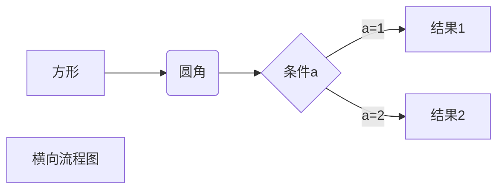
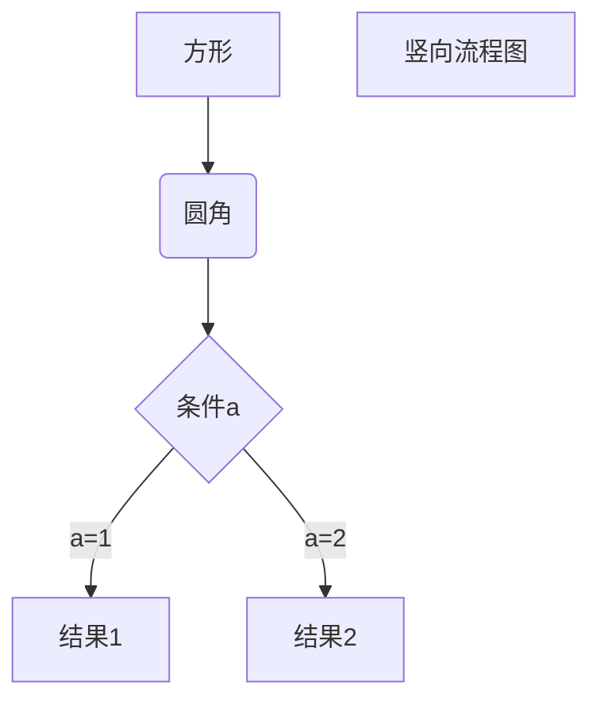
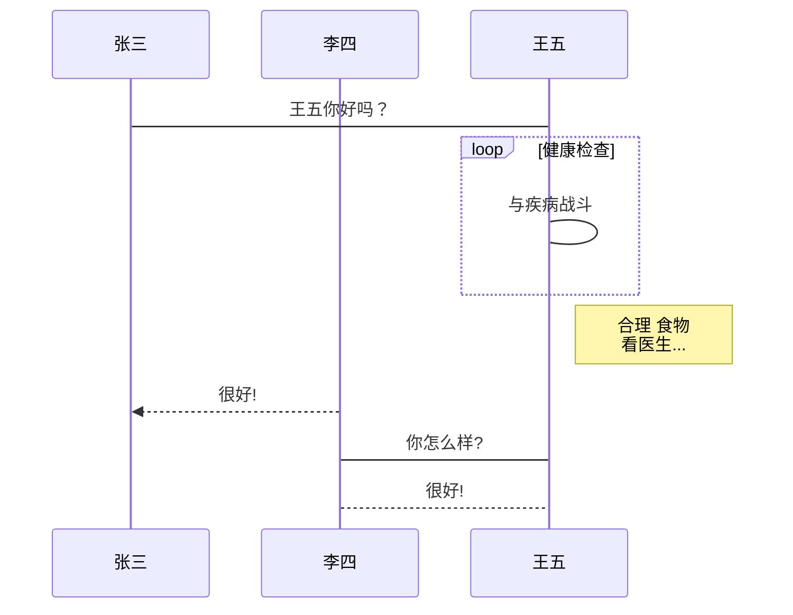
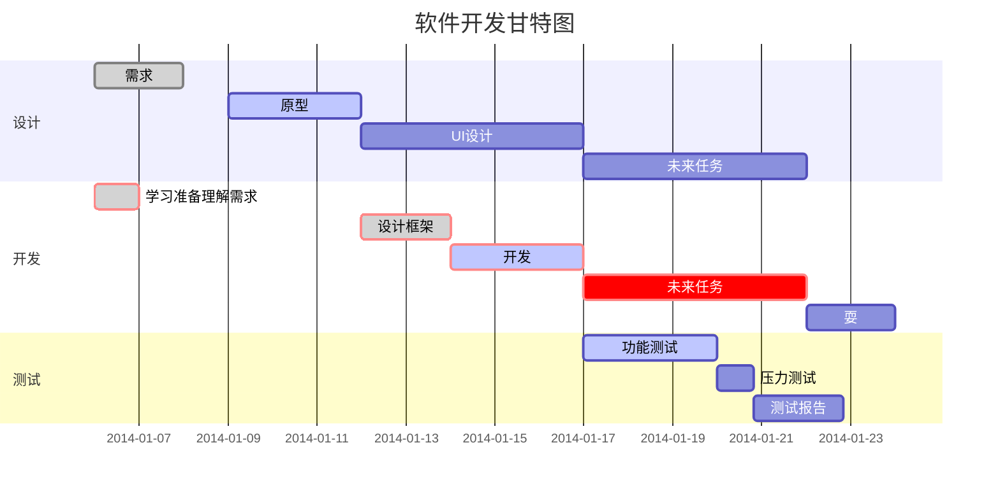
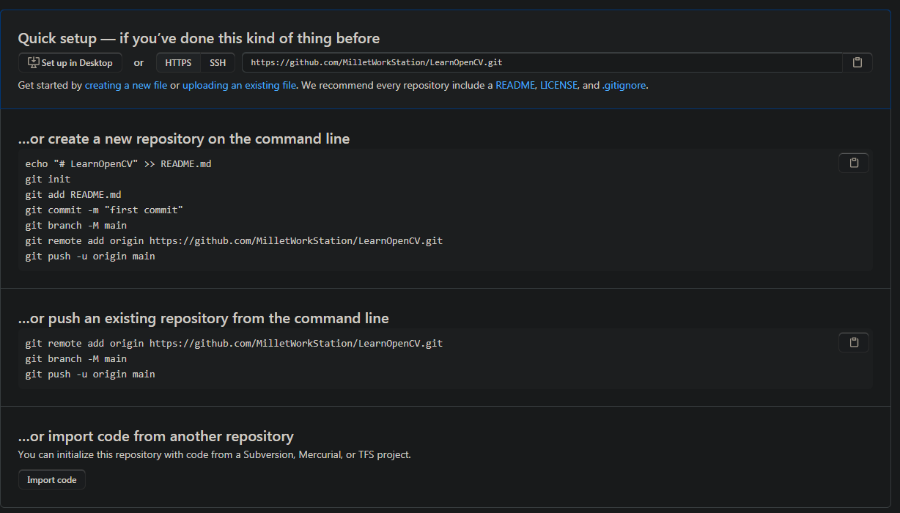

[TOC]

# C# 知识

## 语法

### C# 接口（Interface）

接口定义了所有类继承接口时应遵循的语法合同。接口定义了语法合同 **"是什么"** 部分，派生类定义了语法合同 **"怎么做"** 部分。

接口定义了属性、方法和事件，这些都是接口的成员。接口只包含了成员的声明。成员的定义是派生类的责任。接口提供了派生类应遵循的标准结构。

接口使得实现接口的类或结构在形式上保持一致。

抽象类在某种程度上与接口类似，但是，它们大多只是用在当只有少数方法由基类声明由派生类实现时。

**就是说：接口类只声明（是什么），成员的定义由派生类（怎么做）来完成。**

``` c#
using System;

interface IParentInterface
{
    void ParentInterfaceMethod();
}

interface IMyInterface : IParentInterface
{
    // 接口成员
    void MethodToImplement();
}

// Implementer：执行体
class InterfaceImplementer : IMyInterface
{
    static void Main()
    {
        InterfaceImplementer iImp = new InterfaceImplementer();
        iImp.MethodToImplement();
    }

    // 具体实现
    public void MethodToImplement()
    {
        Console.WriteLine("MethodToImplement() called.");
    }
    
    public void ParentInterfaceMethod()
    {
        Console.WriteLine("ParentInterfaceMethod() called.");
    }
}
```

！！接口也可以继承。


### C# 命名空间（Namespace）

**命名空间**的设计目的是提供一种让一组名称与其他名称分隔开的方式。在一个命名空间中声明的类的名称与另一个命名空间中声明的相同的类的名称不冲突。

我们举一个计算机系统中的例子，一个文件夹(目录)中可以包含多个文件夹，每个文件夹中不能有相同的文件名，但不同文件夹中的文件可以重名


#### 定义命名空间

 命名空间的定义是以关键字 **namespace** 开始，后跟命名空间的名称，如下所示 

~~~ c#
namespace namespace_name
{
   // 代码声明
}

using System;
namespace first_space
{
   class namespace_cl
   {
      public void func()
      {
         Console.WriteLine("Inside first_space");
      }
   }
}
namespace second_space
{
   class namespace_cl
   {
      public void func()
      {
         Console.WriteLine("Inside second_space");
      }
   }
}  
class TestClass
{
   static void Main(string[] args)
   {
      first_space.namespace_cl fc = new first_space.namespace_cl();
      second_space.namespace_cl sc = new second_space.namespace_cl();
      fc.func();
      sc.func();
      Console.ReadKey();
   }
}

~~~


### C# 预处理器指令

预处理器指令指导编译器在实际编译开始之前对信息进行预处理。

所有的预处理器指令都是以 ## 开始。且在一行上，只有空白字符可以出现在预处理器指令之前。预处理器指令不是语句，所以它们不以分号（;）结束。

C## 编译器没有一个单独的预处理器，但是，指令被处理时就像是有一个单独的预处理器一样。在 C## 中，预处理器指令用于在条件编译中起作用。与 C 和 C++ 不同的是，它们不是用来创建宏。一个预处理器指令必须是该行上的唯一指令。

#### #define 预处理器

\#define 预处理器指令创建符号常量。

\#define 允许您定义一个符号，这样，通过使用符号作为传递给 #if 指令的表达式，表达式将返回 true

~~~ c#
#define PI
using System;
namespace PreprocessorDAppl
{
   class Program
   {
      static void Main(string[] args)
      {
         #if (PI)
            Console.WriteLine("PI is defined");
         #else
            Console.WriteLine("PI is not defined");
         #endif
         Console.ReadKey();
      }
   }
}
~~~

#### 条件指令

您可以使用 #if 指令来创建一个条件指令。条件指令用于测试符号是否为真。如果为真，编译器会执行 #if 和下一个指令之间的代码。

条件指令的语法：

~~~C#
#if symbol [operator symbol]...
    
// 例子
#define DEBUG
#define VC_V10
using System;
public class TestClass
{
   public static void Main()
   {

      #if (DEBUG && !VC_V10)
         Console.WriteLine("DEBUG is defined");
      #elif (!DEBUG && VC_V10)
         Console.WriteLine("VC_V10 is defined");
      #elif (DEBUG && VC_V10)
         Console.WriteLine("DEBUG and VC_V10 are defined");
      #else
         Console.WriteLine("DEBUG and VC_V10 are not defined");
      #endif
      Console.ReadKey();
   }
}
~~~


### C# 异常处理

异常是在程序执行期间出现的问题。C## 中的异常是对程序运行时出现的特殊情况的一种响应，比如尝试除以零。

异常提供了一种把程序控制权从某个部分转移到另一个部分的方式。C## 异常处理时建立在四个关键词之上的：**try**、**catch**、**finally** 和 **throw**。

- **try**：一个 try 块标识了一个将被激活的特定的异常的代码块。后跟一个或多个 catch 块。
- **catch**：程序通过异常处理程序捕获异常。catch 关键字表示异常的捕获。
- **finally**： finally 块用于执行给定的语句，不管异常是否被抛出都会执行。例如，如果您打开一个文件，不管是否出现异常文件都要被关闭。
- **throw**：当问题出现时，程序抛出一个异常。使用 throw 关键字来完成。

#### C## 中的异常类

C## 异常是使用类来表示的。C## 中的异常类主要是直接或间接地派生于 **System.Exception** 类。

**System.ApplicationException** 和 **System.SystemException** 类是派生于 System.Exception 类的异常类。

**System.ApplicationException** 类支持由应用程序生成的异常。所以程序员定义的异常都应派生自该类。

**System.SystemException** 类是所有预定义的系统异常的基类。

下表列出了一些派生自 Sytem.SystemException 类的预定义的异常类：

| 异常类                            | 描述                                           |
| :-------------------------------- | ---------------------------------------------- |
| System.IO.IOException             | 处理 I/O 错误。                                |
| System.IndexOutOfRangeException   | 处理当方法指向超出范围的数组索引时生成的错误。 |
| System.ArrayTypeMismatchException | 处理当数组类型不匹配时生成的错误。             |
| System.NullReferenceException     | 处理当依从一个空对象时生成的错误。             |
| System.DivideByZeroException      | 处理当除以零时生成的错误。                     |
| System.InvalidCastException       | 处理在类型转换期间生成的错误。                 |
| System.OutOfMemoryException       | 处理空闲内存不足生成的错误。                   |
| System.StackOverflowException     | 处理栈溢出生成的错误。                         |


~~~ C#
using System;
namespace UserDefinedException
{
   class TestTemperature
   {
      static void Main(string[] args)
      {
         Temperature temp = new Temperature();
         try
         {
            temp.showTemp();
         }
         catch(TempIsZeroException e)
         {
            Console.WriteLine("TempIsZeroException: {0}", e.Message);
         }
         Console.ReadKey();
      }
   }
}
public class TempIsZeroException: ApplicationException
{
   public TempIsZeroException(string message): base(message)
   {
   }
}
public class Temperature
{
   int temperature = 0;
   public void showTemp()
   {
      if(temperature == 0)
      {
         throw (new TempIsZeroException("Zero Temperature found"));
      }
      else
      {
         Console.WriteLine("Temperature: {0}", temperature);
      }
   }
}

// ==> TempIsZeroException: Zero Temperature found
// base：代表基类对象，如同C++写一个类名，他用base代替
class A
{
    A(int a)m_a(a){}
    int m_a;
}
class B : public A
{ 
    B(int b):A(b){}
}
// 此处的A 在 C#中用base代替
~~~

### C# 特性（Attribute）

**特性（Attribute）**是用于在运行时传递程序中各种元素（比如类、方法、结构、枚举、组件等）的行为信息的声明性标签。您可以通过使用特性向程序添加声明性信息。一个声明性标签是通过放置在它所应用的元素前面的方括号（[ ]）来描述的。

特性（Attribute）用于添加元数据，如编译器指令和注释、描述、方法、类等其他信息。.Net 框架提供了两种类型的特性：*预定义*特性和*自定义*特性。

#### 规定特性（Attribute）

规定特性（Attribute）的语法如下：

```C#
[attribute(positional_parameters, name_parameter = value, ...)]
element
```

 特性（Attribute）的名称和值是在方括号内规定的，放置在它所应用的元素之前。positional_parameters 规定必需的信息，name_parameter 规定可选的信息。 

#### 预定义特性（Attribute）

.Net 框架提供了三种预定义特性：

- AttributeUsage
- Conditional
- Obsolete

###### AttributeUsage

预定义特性 **AttributeUsage** 描述了如何使用一个**自定义特性类**。它规定了特性可应用到的项目的类型。

规定该特性的语法如下：

```c#
[AttributeUsage(
   validon,
   AllowMultiple=allowmultiple,
   Inherited=inherited
)]

// 例如
[AttributeUsage(AttributeTargets.Class |
AttributeTargets.Constructor |
AttributeTargets.Field |
AttributeTargets.Method |
AttributeTargets.Property, 
AllowMultiple = true)]
```

其中：

- 参数 validon 规定特性可被放置的语言元素。它是枚举器 *AttributeTargets* 的值的组合。默认值是 *AttributeTargets.All*。
- 参数 *allowmultiple*（可选的）为该特性的 *AllowMultiple* 属性（property）提供一个布尔值。如果为 true，则该特性是多用的。默认值是 false（单用的）。
- 参数 *inherited*（可选的）为该特性的 *Inherited* 属性（property）提供一个布尔值。如果为 true，则该特性可被派生类继承。默认值是 false（不被继承）。

###### Conditional

这个预定义特性标记了一个条件方法，其执行依赖于指定的预处理标识符。

它会引起方法调用的条件编译，取决于指定的值，比如 **Debug** 或 **Trace**。例如，当调试代码时显示变量的值。

规定该特性的语法如下：

```c#
[Conditional(
   conditionalSymbol
)]

// 例子
// [Conditional("DEBUG")]
#define DEBUG
using System;
using System.Diagnostics;
public class Myclass
{
    [Conditional("DEBUG")]
    public static void Message(string msg)
    {
        Console.WriteLine(msg);
    }
}
class Test
{
    static void function1()
    {
        Myclass.Message("In Function 1.");
        function2();
    }
    static void function2()
    {
        Myclass.Message("In Function 2.");
    }
    public static void Main()
    {
        Myclass.Message("In Main function.");
        function1();
        Console.ReadKey();
    }
}
// 该程序注释掉DEBUG后在Release下无字符串输出
```

###### Obsolete

这个预定义特性标记了不应被使用的程序实体。它可以让您通知编译器丢弃某个特定的目标元素。例如，当一个新方法被用在一个类中，但是您仍然想要保持类中的旧方法，您可以通过显示一个应该使用新方法，而不是旧方法的消息，来把它标记为 obsolete（过时的）。

规定该特性的语法如下：

```
[Obsolete(
   message
)]
[Obsolete(
   message,
   iserror
)]
```

其中：

- 参数 *message*，是一个字符串，描述项目为什么过时以及该替代使用什么。
- 参数 *iserror*，是一个布尔值。如果该值为 true，编译器应把该项目的使用当作一个错误。默认值是 false（编译器生成一个警告）。

~~~ C#
using System;
public class MyClass
{
   [Obsolete("Don't use OldMethod, use NewMethod instead", true)]
   static void OldMethod()
   {
      Console.WriteLine("It is the old method");
   }
   static void NewMethod()
   {
      Console.WriteLine("It is the new method");
   }
   public static void Main()
   {
      OldMethod();
   }
}

// 当您尝试编译该程序时，编译器会给出一个错误消息说明：
// Don't use OldMethod, use NewMethod instead
     
~~~

#### 创建自定义特性（Attribute）

.Net 框架允许创建自定义特性，**用于存储声明性的信息，且可在运行时被检索**。该信息根据设计标准和应用程序需要，可与任何目标元素相关。

创建并使用自定义特性包含四个步骤：

- 声明自定义特性
- 构建自定义特性
- 在目标程序元素上应用自定义特性
- 通过反射访问特性

 最后一个步骤包含编写一个简单的程序来读取元数据以便查找各种符号。元数据是用于描述其他数据的数据和信息。该程序应使用反射来在运行时访问特性。 

###### 声明自定义特性

一个新的自定义特性应派生自 **System.Attribute** 类。例如：

```c#
// 一个自定义特性 BugFix 被赋给类及其成员
[AttributeUsage(AttributeTargets.Class |
AttributeTargets.Constructor |
AttributeTargets.Field |
AttributeTargets.Method |
AttributeTargets.Property,
AllowMultiple = true)]

public class DeBugInfo : System.Attribute
```

在上面的代码中，我们已经声明了一个名为 *DeBugInfo* 的自定义特性。

###### 构建自定义特性

让我们构建一个名为 *DeBugInfo* 的自定义特性，该特性将存储调试程序获得的信息。它存储下面的信息：

- bug 的代码编号
- 辨认该 bug 的开发人员名字
- 最后一次审查该代码的日期
- 一个存储了开发人员标记的字符串消息

我们的 *DeBugInfo* 类将带有三个用于存储前三个信息的私有属性（property）和一个用于存储消息的公有属性（property）。所以 bug 编号、开发人员名字和审查日期将是 DeBugInfo 类的必需的定位（ positional）参数，消息将是一个可选的命名（named）参数。

~~~ C#
// 一个自定义特性 BugFix 被赋给类及其成员
[AttributeUsage(AttributeTargets.Class |
AttributeTargets.Constructor |
AttributeTargets.Field |
AttributeTargets.Method |
AttributeTargets.Property,
AllowMultiple = true)]

public class DeBugInfo : System.Attribute
{
  private int bugNo;		
  private string developer;
  private string lastReview;
  public string message;

  public DeBugInfo(int bg, string dev, string d)
  {
      this.bugNo = bg;
      this.developer = dev;
      this.lastReview = d;
  }

  public int BugNo
  {
      get
      {
          return bugNo;
      }
  }
  public string Developer
  {
      get
      {
          return developer;
      }
  }
  public string LastReview
  {
      get
      {
          return lastReview;
      }
  }
  public string Message
  {
      get
      {
          return message;
      }
      set
      {
          message = value;
      }
  }
}

// 使用这个自定义的特性
[DeBugInfo(45, "Zara Ali", "12/8/2012", Message = "Return type mismatch")]
[DeBugInfo(49, "Nuha Ali", "10/10/2012", Message = "Unused variable")]
class Rectangle
{
  // 成员变量
  protected double length;
  protected double width;
  public Rectangle(double l, double w)
  {
      length = l;
      width = w;
  }
  [DeBugInfo(55, "Zara Ali", "19/10/2012",
  Message = "Return type mismatch")]
  public double GetArea()
  {
      return length * width;
  }
  [DeBugInfo(56, "Zara Ali", "19/10/2012")]
  public void Display()
  {
      Console.WriteLine("Length: {0}", length);
      Console.WriteLine("Width: {0}", width);
      Console.WriteLine("Area: {0}", GetArea());
  }
}
~~~


### C# 反射（Reflection）

反射指程序可以访问、检测和修改它本身状态或行为的一种能力。

程序集包含模块，而模块包含类型，类型又包含成员。反射则提供了封装程序集、模块和类型的对象。

您可以使用反射动态地创建类型的实例，将类型绑定到现有对象，或从现有对象中获取类型。然后，可以调用类型的方法或访问其字段和属性。

#### 优缺点

优点：

- 1、反射提高了程序的灵活性和扩展性。
- 2、降低耦合性，提高自适应能力。
- 3、它允许程序创建和控制任何类的对象，无需提前硬编码目标类。

缺点：

- 1、性能问题：使用反射基本上是一种解释操作，用于字段和方法接入时要远慢于直接代码。因此反射机制主要应用在对灵活性和拓展性要求很高的系统框架上，普通程序不建议使用。
- 2、使用反射会模糊程序内部逻辑；程序员希望在源代码中看到程序的逻辑，反射却绕过了源代码的技术，因而会带来维护的问题，反射代码比相应的直接代码更复杂。

#### 反射（Reflection）的用途

反射（Reflection）有下列用途：

- 它允许在运行时查看特性（attribute）信息。
- 它允许审查集合中的各种类型，以及实例化这些类型。
- 它允许延迟绑定的方法和属性（property）。
- 它允许在运行时创建新类型，然后使用这些类型执行一些任务。

#### 查看元数据

我们已经在上面的章节中提到过，使用反射（Reflection）可以查看特性（attribute）信息。

**System.Reflection** 类的 **MemberInfo** 对象需要被初始化，用于发现与类相关的特性（attribute）。为了做到这点，您可以定义目标类的一个对象，如下：

```
System.Reflection.MemberInfo info = typeof(MyClass);
```

### C# 属性（Property）

**属性（Property）** 是类（class）、结构（structure）和接口（interface）的命名（named）成员。类或结构中的成员变量或方法称为 **域（Field）**。属性（Property）是域（Field）的扩展，且可使用相同的语法来访问。它们使用 **访问器（accessors）** 让私有域的值可被读写或操作。

属性（Property）不会确定存储位置。相反，它们具有可读写或计算它们值的 **访问器（accessors）**。

例如，有一个名为 Student 的类，带有 age、name 和 code 的私有域。我们不能在类的范围以外直接访问这些域，但是我们可以拥有访问这些私有域的属性。

~~~ C#
// 声明类型为 string 的 Code 属性
public string Code
{
   get
   {
      return code;
   }
   set
   {
      code = value;
   }
}

// 声明类型为 string 的 Name 属性
public string Name
{
   get
   {
     return name;
   }
   set
   {
     name = value;
   }
}

// 声明类型为 int 的 Age 属性
public int Age
{
   get
   {
      return age;
   }
   set
   {
      age = value;
   }
}

~~~

~~~ c#
using System;
namespace runoob
{
   class Student
   {

      private string code = "N.A";
      private string name = "not known";
      private int age = 0;

      // 声明类型为 string 的 Code 属性
      public string Code
      {
         get
         {
            return code;
         }
         set
         {
            code = value;
         }
      }
   
      // 声明类型为 string 的 Name 属性
      public string Name
      {
         get
         {
            return name;
         }
         set
         {
            name = value;
         }
      }

      // 声明类型为 int 的 Age 属性
      public int Age
      {
         get
         {
            return age;
         }
         set
         {
            age = value;
         }
      }
      public override string ToString()
      {
         return "Code = " + Code +", Name = " + Name + ", Age = " + Age;
      }
    }
    class ExampleDemo
    {
      public static void Main()
      {
         // 创建一个新的 Student 对象
         Student s = new Student();
           
         // 设置 student 的 code、name 和 age
         s.Code = "001";
         s.Name = "Zara";
         s.Age = 9;
         Console.WriteLine("Student Info: {0}", s);
         // 增加年龄
         s.Age += 1;
         Console.WriteLine("Student Info: {0}", s);
         Console.ReadKey();
       }
   }
}
~~~

### C# 索引器（Indexer）

 **索引器（Indexer）** 允许一个对象可以像数组一样被索引。当您为类定义一个索引器时，该类的行为就会像一个 **虚拟数组（virtual array）** 一样。您可以使用数组访问运算符（[ ]）来访问该类的实例。 

#### 语法

一维索引器的语法如下：

~~~ C#
element-type this[int index]
{
   // get 访问器
   get
   {
      // 返回 index 指定的值
   }

   // set 访问器
   set
   {
      // 设置 index 指定的值
   }
}
~~~

#### 索引器（Indexer）的用途

索引器的行为的声明在某种程度上类似于属性（property）。就像属性（property），您可使用 **get** 和 **set** 访问器来定义索引器。但是，属性返回或设置一个特定的数据成员，而索引器返回或设置对象实例的一个特定值。换句话说，它把实例数据分为更小的部分，并索引每个部分，获取或设置每个部分。

定义一个属性（property）包括提供属性名称。索引器定义的时候不带有名称，但带有 **this** 关键字，它指向对象实例。

#### 重载索引器（Indexer）

索引器（Indexer）可被重载。索引器声明的时候也可带有多个参数，且每个参数可以是不同的类型。没有必要让索引器必须是整型的。C## 允许索引器可以是其他类型，例如，字符串类型

~~~ c#
using System;
namespace IndexerApplication
{
   class IndexedNames
   {
      private string[] namelist = new string[size];
      static public int size = 10;
      public IndexedNames()
      {
         for (int i = 0; i < size; i++)
         {
          namelist[i] = "N. A.";
         }
      }
      public string this[int index]
      {
         get
         {
            string tmp;

            if( index >= 0 && index <= size-1 )
            {
               tmp = namelist[index];
            }
            else
            {
               tmp = "";
            }

            return ( tmp );
         }
         set
         {
            if( index >= 0 && index <= size-1 )
            {
               namelist[index] = value;
            }
         }
      }
      public int this[string name]
      {
         get
         {
            int index = 0;
            while(index < size)
            {
               if (namelist[index] == name)
               {
                return index;
               }
               index++;
            }
            return index;
         }

      }

      static void Main(string[] args)
      {
         IndexedNames names = new IndexedNames();
         names[0] = "Zara";
         names[1] = "Riz";
         names[2] = "Nuha";
         names[3] = "Asif";
         names[4] = "Davinder";
         names[5] = "Sunil";
         names[6] = "Rubic";
         // 使用带有 int 参数的第一个索引器
         for (int i = 0; i < IndexedNames.size; i++)
         {
            Console.WriteLine(names[i]);
         }
         // 使用带有 string 参数的第二个索引器
         Console.WriteLine(names["Nuha"]);
         Console.ReadKey();
      }
   }
}
~~~

就相当于C++里面的 **operator** 重载运算符这类

### C# 委托（Delegate）

C## 中的委托（Delegate）类似于 C 或 C++ 中函数的指针。**委托（Delegate）** 是存有对某个方法的引用的一种引用类型变量。引用可在运行时被改变。

委托（Delegate）特别用于实现事件和回调方法。所有的委托（Delegate）都派生自 **System.Delegate** 类。

#### 声明委托（Delegate）

委托声明决定了可由该委托引用的**方法**。委托可指向一个与其具有相同标签的方法。

例如，假设有一个委托：

```c#
public delegate int MyDelegate (string s);
//上面的委托可被用于引用任何一个带有一个单一的 string 参数的方法，并返回一个 int 类型变量。

// 声明委托的语法如下：
delegate <return type> <delegate-name> <parameter list>
 
// 例子    
using System;

delegate int NumberChanger(int n);
namespace DelegateAppl
{
   class TestDelegate
   {
      static int num = 10;
      public static int AddNum(int p)
      {
         num += p;
         return num;
      }

      public static int MultNum(int q)
      {
         num *= q;
         return num;
      }
      public static int getNum()
      {
         return num;
      }

      static void Main(string[] args)
      {
         // 创建委托实例
         NumberChanger nc;
         NumberChanger nc1 = new NumberChanger(AddNum);
         NumberChanger nc2 = new NumberChanger(MultNum);
         nc = nc1;
         nc += nc2;
         // 调用多播
         nc(5);
         Console.WriteLine("Value of Num: {0}", getNum());
         Console.ReadKey();
      }
   }
}

// 相当于增加一次调用在里面
```

#### 委托（Delegate）的用途

下面的实例演示了委托的用法。委托 *printString* 可用于引用带有一个字符串作为输入的方法，并不返回任何东西。

我们使用这个委托来调用两个方法，第一个把字符串打印到控制台，第二个把字符串打印到文件：

~~~ C#
using System;
using System.IO;

namespace DelegateAppl
{
   class PrintString
   {
      static FileStream fs;
      static StreamWriter sw;
      // 委托声明
      public delegate void printString(string s);

      // 该方法打印到控制台
      public static void WriteToScreen(string str)
      {
         Console.WriteLine("The String is: {0}", str);
      }
      // 该方法打印到文件
      public static void WriteToFile(string s)
      {
         fs = new FileStream("c:\\message.txt", FileMode.Append, FileAccess.Write);
         sw = new StreamWriter(fs);
         sw.WriteLine(s);
         sw.Flush();
         sw.Close();
         fs.Close();
      }
      // 该方法把委托作为参数，并使用它调用方法
      public static void sendString(printString ps)
      {
         ps("Hello World");
      }
      static void Main(string[] args)
      {
         printString ps1 = new printString(WriteToScreen);
         printString ps2 = new printString(WriteToFile);
         sendString(ps1);
         sendString(ps2);
         Console.ReadKey();
      }
   }
}

// 相当于一个函数指针，只是用一个通用接口去调用了这个函数（作为回调函数）指针。
~~~

### C# 事件（Event）

**事件（Event）** 基本上说是一个用户操作，如按键、点击、鼠标移动等等，或者是一些提示信息，如系统生成的通知。应用程序需要在事件发生时响应事件。例如，中断。

C## 中使用事件机制实现线程间的通信。

#### 通过事件使用委托

事件在类中声明且生成，且通过使用同一个类或其他类中的委托与事件处理程序关联。包含事件的类用于发布事件。这被称为 **发布器（publisher）** 类。其他接受该事件的类被称为 **订阅器（subscriber）** 类。事件使用 **发布-订阅（publisher-subscriber）** 模型。

**发布器（publisher）** 是一个包含事件和委托定义的对象。事件和委托之间的联系也定义在这个对象中。发布器（publisher）类的对象调用这个事件，并通知其他的对象。

**订阅器（subscriber）** 是一个接受事件并提供事件处理程序的对象。在发布器（publisher）类中的委托调用订阅器（subscriber）类中的方法（事件处理程序）。

#### 声明事件（Event）

在类的内部声明事件，首先必须声明该事件的委托类型。例如：

```c#
public delegate void BoilerLogHandler(string status);
```

然后，声明事件本身，使用 **event** 关键字：

```C#
// 基于上面的委托定义事件
public event BoilerLogHandler BoilerEventLog;
```

上面的代码定义了一个名为 *BoilerLogHandler* 的委托和一个名为 *BoilerEventLog* 的事件，该事件在生成的时候会调用委托。

~~~ c#
using System;
namespace SimpleEvent
{
  using System;
  /***********发布器类***********/
  public class EventTest
  {
    private int value;

    public delegate void NumManipulationHandler();


    public event NumManipulationHandler ChangeNum;
    protected virtual void OnNumChanged()
    {
      if ( ChangeNum != null )
      {
        ChangeNum(); /* 事件被触发 */
      }else {
        Console.WriteLine( "event not fire" );
        Console.ReadKey(); /* 回车继续 */
      }
    }


    public EventTest()
    {
      int n = 5;
      SetValue( n );
    }


    public void SetValue( int n )
    {
      if ( value != n )
      {
        value = n;
        OnNumChanged();
      }
    }
  }


  /***********订阅器类***********/

  public class subscribEvent
  {
    public void printf()
    {
      Console.WriteLine( "event fire" );
      Console.ReadKey(); /* 回车继续 */
    }
  }

  /***********触发***********/
  public class MainClass
  {
    public static void Main()
    {
      EventTest e = new EventTest(); /* 实例化对象,第一次没有触发事件 */
      subscribEvent v = new subscribEvent(); /* 实例化对象 */
        
      // 实例化事件
      e.ChangeNum += new EventTest.NumManipulationHandler( v.printf ); /* 注册 */
        
      e.SetValue( 7 );
      e.SetValue( 11 );
    }
  }
}

// 
// NumManipulationHandler 相当于一个装回调的容器
// 增加到里面的回调函数在事件被触发的时候都会被调用
// 定义不同的函数就分别走不同的接口而已
~~~

### C# 集合（Collection）

集合（Collection）类是专门用于数据存储和检索的类。这些类提供了对栈（stack）、队列（queue）、列表（list）和哈希表（hash table）的支持。大多数集合类实现了相同的接口。

集合（Collection）类服务于不同的目的，如为元素动态分配内存，基于索引访问列表项等等。这些类创建 Object 类的对象的集合。**在 C## 中，Object 类**是所有数据类型的基类。

#### 各种集合类和它们的用法

下面是各种常用的 **System.Collection** 命名空间的类。点击下面的链接查看细节。

| 类                                                           | 描述和用法                                                   |
| :----------------------------------------------------------- | :----------------------------------------------------------- |
| [动态数组（ArrayList）](https://www.runoob.com/csharp/csharp-arraylist.html) | 它代表了可被单独**索引**的对象的有序集合。它基本上可以替代一个数组。但是，与数组不同的是，您可以使用**索引**在指定的位置添加和移除项目，动态数组会自动重新调整它的大小。它也允许在列表中进行动态内存分配、增加、搜索、排序各项。 |
| [哈希表（Hashtable）](https://www.runoob.com/csharp/csharp-hashtable.html) | 它使用**键**来访问集合中的元素。当您使用键访问元素时，则使用哈希表，而且您可以识别一个有用的键值。哈希表中的每一项都有一个**键/值**对。键用于访问集合中的项目。 |
| [排序列表（SortedList）](https://www.runoob.com/csharp/csharp-sortedlist.html) | 它可以使用**键**和**索引**来访问列表中的项。排序列表是数组和哈希表的组合。它包含一个可使用键或索引访问各项的列表。如果您使用索引访问各项，则它是一个动态数组（ArrayList），如果您使用键访问各项，则它是一个哈希表（Hashtable）。集合中的各项总是按键值排序。 |
| [堆栈（Stack）](https://www.runoob.com/csharp/csharp-stack.html) | 它代表了一个**后进先出**的对象集合。当您需要对各项进行后进先出的访问时，则使用堆栈。当您在列表中添加一项，称为**推入**元素，当您从列表中移除一项时，称为**弹出**元素。 |
| [队列（Queue）](https://www.runoob.com/csharp/csharp-queue.html) | 它代表了一个**先进先出**的对象集合。当您需要对各项进行先进先出的访问时，则使用队列。当您在列表中添加一项，称为**入队**，当您从列表中移除一项时，称为**出队**。 |
| [点阵列（BitArray）](https://www.runoob.com/csharp/csharp-bitarray.html) | 它代表了一个使用值 1 和 0 来表示的**二进制**数组。当您需要存储位，但是事先不知道位数时，则使用点阵列。您可以使用**整型索引**从点阵列集合中访问各项，索引从零开始。 |

### C# 匿名方法

我们已经提到过，委托是用于引用与其具有相同标签的方法。换句话说，您可以使用委托对象调用可由委托引用的方法。

**匿名方法（Anonymous methods）** 提供了一种传递代码块作为委托参数的技术。匿名方法是没有名称只有主体的方法。

在匿名方法中您不需要指定返回类型，它是从方法主体内的 return 语句推断的。

#### 编写匿名方法的语法

匿名方法是通过使用 **delegate** 关键字创建委托实例来声明的。例如：

```C#
delegate void NumberChanger(int n);
...
NumberChanger nc = delegate(int x)
{
    Console.WriteLine("Anonymous Method: {0}", x);
};
```

代码块 *Console.WriteLine("Anonymous Method: {0}", x);* 是匿名方法的主体。

委托可以通过匿名方法调用，也可以通过命名方法调用，即，通过向委托对象传递方法参数。

例如：

```C#
nc(10);
//
实例
下面的实例演示了匿名方法的概念：

实例
using System;

delegate void NumberChanger(int n);
namespace DelegateAppl
{
    class TestDelegate
    {
        static int num = 10;
        public static void AddNum(int p)
        {
            num += p;
            Console.WriteLine("Named Method: {0}", num);
        }

        public static void MultNum(int q)
        {
            num *= q;
            Console.WriteLine("Named Method: {0}", num);
        }

        static void Main(string[] args)
        {
            // 使用匿名方法创建委托实例
            NumberChanger nc = delegate(int x)
            {
               Console.WriteLine("Anonymous Method: {0}", x);
            };
           
            // 使用匿名方法调用委托
            nc(10);

            // 使用命名方法实例化委托
            nc =  new NumberChanger(AddNum);
           
            // 使用命名方法调用委托
            nc(5);

            // 使用另一个命名方法实例化委托
            nc =  new NumberChanger(MultNum);
           
            // 使用命名方法调用委托
            nc(2);
            Console.ReadKey();
        }
    }
}

// 输出
Anonymous Method: 10
Named Method: 15
Named Method: 30
```


## 入门讲解   刘铁猛

 https://www.bilibili.com/video/BV1ys411J7Pn/?p=3 


### C#编写各类应用程序

**Console**    


**WPF(Windows Presentation Foundation)**     *

​	WPF（Windows Presentation Foundation）是微软推出的基于Windows 的用户界面框架，属于.NET Framework 3.0的一部分。它提供了统一的编程模型、语言和框架，真正做到了分离[界面设计](https://baike.baidu.com/item/界面设计/2155896)人员与开发人员的工作；同时它提供了全新的多媒体交互用户图形界面。 


**Windows Forms(Old)**


**ASP.NET Web Forms(Old)**

​	ASP.NET称为 ASP.NET Webforms

**ASP.NET MVC (Model View Controller)**   *

​	程序开发架构，不同程序开发放不同文件夹里面。

​	ASP.NET MVC是一种开发模式，ASP.NET MVC框架是MVC的实现，M模型，V视图，C控制器，du即视zhi图与业务逻辑分离。ASP.NET MVC适合开发大型的项目。asp.net mvc只能dao运行在Windows，一般通过IIS发布；

**WCF(Windows Communcation Foundation)**   * ： Communcation ： 通信 

​	纯网络服务。主要传数据。

 	WCF 整合ASMX，.Net Remoting，Enterprise Service，WSE，MSMQ等技术，主要用于在分布式系统中提高网络和服务的支持，寄宿的宿主可以是命令行控制台、IIS、桌面程序等。

**Windows Store Application**   *

​	平板电脑写应用

**Windows Phone Application**   *

**Cloud(Windows Azure)**   *

​	 Microsoft Azure的主要目标是为开发者提供一个平台，帮助开发可运行在[云服务器](https://baike.baidu.com/item/云服务器/6392664)、[数据中心](https://baike.baidu.com/item/数据中心/967340)、Web和PC上的应用程序。云计算的开发者能使用微软全球数据中心的储存、计算能力和网络基础服务。 

WF(Workflow Foundation)

**带星号是比较新的技术，有前景。！！！！！！！！！！！！！！！！！！！**


### **类库的引用**

* 类库引用是使用名称空间的物理基础，不同技术类型的项目会默认引用不同的类库。
* DLL引用（黑盒引用，无源代码）
  * NuGet 就是把各种命名空间以一个包的形式一起引用。
* 项目引用（白盒引用，有源代码）
  * 点击引用，选择项目。

### 类的三大成员

* 属性（Property）

  * 存储数据，组合起来表使类或对象当前的状态

* 方法（Method）

  * C语言中的函数（function）进化而来，表类或对象能做什么
  * 打交道最多的

* 事件（Event）

  * 类或对象通知其他类或对象的机制，C#特有
  * 学会善用机制

**类的对象成员方面有侧重**

​	侧重方法，侧重数据，侧重事件


###   委托

#### 什么是委托

* delegate  就相当于函数的升级版，封装的函数指针。

~~~ c++
#include <iostream>
#include <math.h>
using namespace std;

typedef int (*Fun)(int a, int b);

int Add(int a, int b ){	return a+b;}

int main(void)
{
	int a = 100, b = 200;
	Fun fun1 = &Add;
	cout << Add(a, b) << endl;
	getchar();
	return 0;
}
~~~

* 一切皆地址
  * 变量（数据）是某个地址为起点的一段内存中所存储的值
  * 函数（算法）是某个地址为起点的一段内存所存储的一组机器语言指令
* 委托是一种类（class）（所以说可以创建new 啊这些），类是数据类型，所以委托也是一种数据类型，
* 他的声明方式与一般的类不同，主要是为了照顾可读性和C/C++传统
* 注意委托声明的位置
  * 避免写错地方结果声明称嵌套类型
* 委托与封装的方法必须"类型兼容"（自定义委托）


* c#类库准备好的委托

  * Action

  * Func

    ```c#
    class Calculator
    { 
        public void Report()
        {
            Console.WriteLine("void Report()");
        }
        
        public bool Add(int a, int b)
        {
            Console.WriteLine("void Add(int a, int b)");
    
            return true;
        }
    }
    
    Action action = new Action(calculator.Report);
    
     Func<int, int, bool> func1 = new Func<int, int, bool>(calculator.Add);
    ```
    

#### 用处

* 重复使用，当委托类型写好了后，就可以不去修改他了，从而减少了bug的量。

#### 委托作为参数

* 模板方法：借用指定的外部方法来产生结果

* 回调方法：调用外部的方法

  ~~~c#
  using System;
  namespace SimpleEvent
  {
      // 是一种类，所以与 下面的类 Pragram同级
      public delegate bool Calc(int x, int y);
  
      public class Pragram
      {    
          static void Main(string[] arcs)
          {
              ProductFactory productFactory = new ProductFactory();
              WrapFactory wrapFactory = new WrapFactory();
  
              Func<Product> fun1 = new Func<Product>(productFactory.MakePizza);
              Func<Product> fun2 = new Func<Product>(productFactory.MakeToyCar);
  
              Logger logger = new Logger();
  
              Box box1 = wrapFactory.WrapProduct(fun1, logger.WriteLog);
              Box box2 = wrapFactory.WrapProduct(fun2, logger.WriteLog);
  
              Console.WriteLine(box1.product.name);
              Console.WriteLine(box2.product.name);
  
          }          
      }
  
      class Product
      {
          public Product(string n,double p) { this.name = n; price = p; }
          public string name { get; set; }
  
          public double price { get; set; }
      }
  
      class Box
      {
          // 包装的产品 包装好了返回product
          public Product product { get; set; }
      }
  
      // 包装好了返回给用户 一个模板类型的方法
      class WrapFactory
      {
          //@param 返回一个 product的委托
          public Box WrapProduct(Func<Product> getProduct, Action<Product> logCallBack)
          {
              Box box = new Box();
              box.product = getProduct.Invoke();
              logCallBack(box.product);
              return box;
          }
      }
  
      class ProductFactory
      {
          public Product MakePizza()
          {
              return new Product("Pizza", 20);
          }
  
          public Product MakeToyCar()
          {
              return new Product("ToyCar", 30.5);
          }
      }
  
      // 回调方法
      class Logger
      {
          public void WriteLog(Product product) 
          {
              Console.WriteLine("name:{0} --> time:{1} --> price:{2}",product.name, DateTime.UtcNow, product.price);
          }
      }
  
  }
  ~~~


#### 委托的高级使用


* 多播委托：一个委托里面有多个方法

* 异步调用

  ~~~ C#
  using System;
  using System.Threading;
  using System.Threading.Tasks;
  
  namespace SimpleEvent
  {
  
      class Program
      {
          static void Main(string[] args)
          {
              Student student1 = new Student() { Id = 1, Color = ConsoleColor.Red };
              Student student2 = new Student() { Id = 2, Color = ConsoleColor.Green };
              Student student3 = new Student() { Id = 3, Color = ConsoleColor.Blue };
  
              Action action1 = new Action(student1.DoHomeWork);
              Action action2 = new Action(student2.DoHomeWork);
              Action action3 = new Action(student3.DoHomeWork);
  
              //// 同步调用
  
              //// 单播委托
              //action1(); // action1.Invoke();
              //action1(); // action1.Invoke();
              //action1(); // action1.Invoke();
  
              ////// 多播委托 一个委托封装多个委托 顺序按增加的顺序进行
              //action1 += action3;
              //action1 += action2;
              //action1.Invoke();
  
  
              //// 异步调用
              //IAsyncResult a2 = action2.BeginInvoke(null, null);
              //IAsyncResult a3 = action3.BeginInvoke(null, null);
  
              //action1.EndInvoke(action1.BeginInvoke(null, null));
              //action2.EndInvoke(a2);
              //action3.EndInvoke(a3);
  
              // 异步调用
              Task task1 = new Task(action1);
              Task task2 = new Task(action2);
              Task task3 = new Task(action3);
  
              task1.Start();
              task2.Start();
              task3.Start();
  
              for(int i = 0; i< 10; ++i)
              {
                  Console.ForegroundColor = ConsoleColor.Blue;
                  Console.WriteLine("thread id = {0}", Thread.GetDomainID());
                  Thread.Sleep(1000);
              }
  
              task1.Wait();
              task2.Wait();
              task3.Wait();
          }
      }
  
      class Student
      {
          public int Id { get; set; }
          public ConsoleColor Color { get; set; }
          public void DoHomeWork()
          {
              for(int i = 0; i < 5; ++i)
              {
                  Console.ForegroundColor = Color;
                  Console.WriteLine("student id = {0} houre : {2} ThreadId：{1}...", this.Id, Thread.GetDomainID().ToString(), i);
  
                  Thread.Sleep(1000);
              }
          }
      }
  
  }
  ~~~

* 使用接口代替委托：就是声明一个接口类，然后其他继承他。相当于C++虚函数

#### 理解

  就是相当于给调用的函数起一个别名（把方法封装了一下），然后去调用别名（其实别名也是调用那个函数的逻辑代码）


#### 再讲什么是委托


#### 内置模板的委托

微软帮我们定义的模板委托，直接用。

##### Action：无返回值委托模板


##### Func：有返回值委托模板


#### lambda

作用

* 匿名函数
* Inline方法，一边声明，一边调用。

~~~C#
using System;

namespace ConsoleApp1
{
    class Lambda
    {
        static void Main(string[] args)
        {
            // 比如
            // 有一个两个都为 int的参数，返回值为 int
            // lambda表达式 （(int a, int b) => { return a + b; }）
            //  (int a, int b) 为参数
            //  { return a + b; } 函数体
            Func<int, int, int> func = new Func<int, int, int>((int a, int b) => { return a + b; });

            // 既然委托是一个函数指针，lambda也是表达一个函数
            // 那么变体可以这样写
            func = ((int a, int b) => { return a + b; });
            Console.WriteLine(func(2, 5));

            DoSomeCalc<int>((int a, int b) => { return a * b; }, 10, 20);

        }

        /// <summary>
        /// 
        /// </summary>
        /// <typeparam name="T"></typeparam>
        /// <param name="func"> 一个两个参数的委托 </param>
        /// <param name="a"> 委托的参数1值 </param>
        /// <param name="b"> 委托的参数1值 </param>
        // 模板
        static void DoSomeCalc<T>(Func<T,T,T> func, T a, T b)
        {
            T res = func(a, b);
            Console.WriteLine(res);
        }
    }
}
~~~

#### Linq

Language Integrated Query 


### 事件


事件发生  -->触发 事件处理器（接口）

eg: click  += onclick[()];


~~~ C#
using System;
using System.Timers;

using System.Windows.Forms;

namespace ConsoleApp1
{

    /// <summary>
    /// 实现自己的事件，别人解决
    /// </summary>
    //class EventMain
    //{
    //    static void Main(string [] args)
    //    {
    //        // 事件发出者
    //        Timer timer = new Timer();
    //        timer.Interval = 100;

    //        Boy boy = new Boy();
    //        Girl girl = new Girl();

    //        timer.Elapsed += boy.Action;
    //        timer.Elapsed += girl.Action;

    //        timer.Start();

    //        Console.ReadLine();
    //    }

    //}

    //// 事件响应者
    //class Boy
    //{
    //    internal void Action(object sender, ElapsedEventArgs e)
    //    {
    //        Console.WriteLine("boy------" + sender.ToString() + "-------" + e.ToString());
    //    }
    //}
    //class Girl
    //{
    //    internal void Action(object sender, ElapsedEventArgs e)
    //    {
    //        Console.WriteLine("girl------" + sender.ToString() + "-------" + e.ToString() + "\n");
    //    }

    //}

    // 
    //class EventMain
    //{
    //    static void Main()
    //    {
    //        Form form = new Form();
    //        Controller controller = new Controller(form);

    //        form.ShowDialog();
    //    }
    //}
    //class Controller
    //{
    //    private Form form;
    //    public Controller(Form form)
    //    {
    //        if( form != null)
    //        {
    //            this.form = form;

    //            // 事件订阅
    //            this.form.Click += this.FormClicked;                  
    //        }
    //    }

    //    private void FormClicked(object sender, EventArgs e)
    //    {
    //        //throw new NotImplementedException();
    //        Console.WriteLine("private void FormClicked(object sender, EventArgs e)");
    //    }
    //}
    /// <summary>
    /// 实现自己的事件，别人解决
    /// </summary>

    /// <summary>
    /// 实现自己的事件，自己解决
    /// </summary>
    //class EventMain
    //{
    //    static void Main(string[] args)
    //    {
    //        MyForm form = new MyForm();
    //        form.Click += form.Action;

    //        form.ShowDialog();
    //    }
    //}

    //class MyForm : Form
    //{
    //    internal void Action(object sender, EventArgs e)
    //    {
    //        Console.WriteLine("private void FormClicked(object sender, EventArgs e)");
    //    }
    //}
    /// <summary>
    /// 实现自己的事件，自己解决
    /// </summary>

    class EventMain
    {
        static void Main(string[] args)
        {
            MyForm myForm = new MyForm();
            myForm.ShowDialog();
        }
    }

    class MyForm : Form
    {
        private TextBox textBox;
        private Button button;

        public MyForm()
        {
            this.textBox = new TextBox();
            this.textBox.ReadOnly = true;
            textBox.Width = this.Width;
          
            this.button = new Button();
            this.button.Top = 50;

            this.Controls.Add(textBox);
            this.Controls.Add(button);

            // 将这个事件的处理过程挂接到button.Click事件上面
            // 因为事件的处理过程是可以重复使用的
            this.button.Click += Button_Click; ;

        }

        private void Button_Click(object sender, EventArgs e)
        {
            this.textBox.Text = "Hello C## !!!!";
        }
    }
}

~~~

#### 事件的五个组成

事件是依赖与委托的  

* 事件的拥有者
* 事件
* 响应者
* 处理器
* 订阅

首先，响应者在事件的拥有者这里订阅事件，  事件的拥有者 --> 触发事件 --> 事件响应者接到通知 -->事件处理器处理

例子

~~~ C#
using System;
using System.Collections.Generic;
using System.Linq;
using System.Text;
using System.Threading;
using System.Threading.Tasks;

namespace ConsoleApp1
{
    class DelegateComplete
    {

        static void Main()
        {
            Customer customer = new Customer();
            Waiter waiter = new Waiter();

            customer.WalkIn();
            customer.SitDown();

            // 坐下后，服务员(的事件处理器)来订阅（挂接在）一个事件（上）
            // 事件响应者在事件这里订阅事件
            Console.WriteLine("waiter Subscribe to customer events (like what you order?)");
            customer.Order += waiter.Action;

            // invoke 触发事件，然后让订阅者来接收
            customer.Thinking();

            customer.Eatting();
            customer.Pay();

            Console.ReadLine();
        }
    }

    public class Customer
    {
        public double Bill { get; set; }

        public void Pay()
        {
            Console.WriteLine("pay {0}", this.Bill);
        }


        //// 完整版事件声明
        // 内部事件的记录
        //private OrderEventHandler orderEventHandler;

        // 事件名称
        //public event OrderEventHandler Order
        //{
        //    add
        //    {
        //        this.orderEventHandler += value;
        //    }

        //    remove
        //    {
        //        this.orderEventHandler -= value;
        //    }
        //}
        //// 完整版事件声明


        // 自定义类型的事件处理器  需要自定义委托
        // 简单声明  字段方式  内部定义了一个
        // 事件就是包装了一下委托   += 委托  或者  -= 委托 
        // 限制外界对委托字段的访问，比如其他顾客点餐后 ，调用这个顾客的 invoke，就会添加在这个顾客上，所以会错
        //public event OrderEventHandler Order;
        // 简单声明  字段方式
        // 自定义类型的事件处理器  需要自定义委托

        // 系统定义类型的事件处理器 
        public event EventHandler Order;
        // 系统定义类型的事件处理器 

        public void WalkIn()
        {
            Console.WriteLine("walk in");
        }
        public void SitDown()
        {
            Console.WriteLine("sit down");
        }

        public void Thinking()
        {
            for(int i = 0; i< 5; ++i)
            {
                Console.WriteLine("think . . .");
                Thread.Sleep(1000);
            }

            // 有无人订阅此事件

            //// 完整声明事件
            //if(this.orderEventHandler != null)
            //{
            //    OrderEventArgs orderEventArgs = new OrderEventArgs();
            //    orderEventArgs.DishName = "yuxiangrousier";
            //    orderEventArgs.Size = "large";
            //    Console.WriteLine("i order a {0} {1}", orderEventArgs.Size, orderEventArgs.DishName);
            //    this.orderEventHandler.Invoke(this, orderEventArgs);
            //}
            //// 完整声明事件
            ///

            // 简单声明  字段方式
            if (this.Order != null)
            {
                OrderEventArgs orderEventArgs = new OrderEventArgs();
                orderEventArgs.DishName = "yuxiangrousier";
                orderEventArgs.Size = "large";
                Console.WriteLine("i order a {0} {1}", orderEventArgs.Size, orderEventArgs.DishName);
                this.Order.Invoke(this, orderEventArgs);
            }
            // 简单声明  字段方式
        }

        public void Action()
        {
            WalkIn();
            SitDown();
            Console.WriteLine("wait for waiter....");
            Console.ReadLine();
            Thinking();
        }

        public void Eatting()
        {
            for (int i = 0; i < 5; ++i)
            {
                Console.WriteLine("eatting....");
                Thread.Sleep(1000);
            }
        }
    }

    // 传递事件消息的类
    // 在委托事件的时候 需要传递两个参数 
    //  一是谁发出的这个事件 （customer）
    //  二是这个发出者携带的参数
    public class OrderEventArgs : EventArgs
    {
        public string DishName { get; set; }
        public string Size { get; set; }

    }

    // 自定义类型的事件处理器  需要自定义委托
    // 声明委托类型 
    // dot not 规定，如果委托是给事件准备的，就需要用EventHandler为后缀
    // 参数为顾客  和  点菜
    //public delegate void OrderEventHandler(Customer customer, OrderEventArgs e);
    // 自定义类型的事件处理器  需要自定义委托

    public class Waiter
    {
        //// 自定义类型的事件处理器  需要自定义委托
        //internal void Action(Customer customer, OrderEventArgs e)
        //{
        //    //throw new NotImplementedException();
        //    Console.WriteLine("you order {0}, please waitting...", e.DishName);

        //    double price = 10;
        //    if(e.Size == "small")
        //    {
        //        price *= 0.5;
        //    }
        //    if(e.Size == "large")
        //    {
        //        price *= 1.5;
        //    }

        //    customer.Bill += price;

        //    Console.WriteLine("give you a {0} {1}...", e.Size, e.DishName);
        //}
        //// 自定义类型的事件处理器  需要自定义委托

        // 系统内部附带的事件处理器  不需要声明委托
        internal void Action(object customer, EventArgs e)
        {
            Customer customer1 = customer as Customer;
            OrderEventArgs e1 = e as OrderEventArgs;

            //throw new NotImplementedException();
            Console.WriteLine("you order {0}, please waitting...", e1.DishName);

            double price = 10;
            if (e1.Size == "small")
            {
                price *= 0.5;
            }
            if (e1.Size == "large")
            {
                price *= 1.5;
            }

            customer1.Bill += price;

            Console.WriteLine("give you a {0} {1}...", e1.Size, e1.DishName);
        }


    }

}

~~~


## 编程指南（msdn）

### 命名规范

 对于简单的[变量](https://baike.baidu.com/item/变量)使用camelCase，而对于比较高级的命名规则使用PascalCase。 

 C# 程序对类型名称、命名空间和所有公共成员使用 PascalCase 。

* 接口名称以大写字母 I 开头。
* 属性类型以单词 Attribute 结尾。
* 枚举类型对非标记使用单数名词，对标记使用复数名词。
* 标识符不应包含两个连续的 _ 字符。 这些名称保留给编译器生成的标识符  


###   语言准则  

##### String 数据类型


## 类库简介

### system

定义了常用值和数据类型以及各种类型的基类，当然也包括了很多C#程序运行中用到类 

#### Console 控制台

 表示一个控制台应用程序的标准输入流、输出流和错误流。 

~~~ C#
// 声明
public static class Console
    
// 在C#甚至大多数编程语言（支持静态类）中，静态类不可被继承，而且静态类的方法都是工具方法；
// 静态类没有构造方法，也不能构造对象；
// 静态类里的方法都是静态方法
// 访问一个类的静态方法需要通过类名.方法名来访问
    
Console.Write("打印测试...");	//
Console.Write("打印测试...");	//接着上一次输出
Console.WriteLine("这行是调用WriteLine");	// 输出一行
Console.WriteLine("这行也是调用WriteLine输出的");

// 读取一个字符
public static int Read ();
// 读取一行
public static string ReadLine ();
~~~


#### Math  数学工具

 为三角函数、对数函数和其他通用数学函数提供常数和静态方法。这个类也是一个静态类，

~~~ C#
public static T Ceiling (<T> d); //T 代表 decimal、double，返回大于或等于指定数字的最小整数值。
public static T Floor (<T> d); //T 代表 decimal、double，返回小于或等于指定双精度浮点数的最大整数值。
public static T Truncate (<T> d);//T 代表 decimal、double，计算一个数字的整数部分。
~~~

#### Random 随机数

 伪随机数生成器，这是一种能够产生满足某些随机性统计要求的数字序列的算法。 

~~~ C#
public virtual int Next ();// 返回一个整型的随机数
public virtual int Next (int maxValue);//返回一个小于所指定最大值的非负随机整数
public virtual int Next (int minValue, int maxValue);//返回在指定范围内的任意整数。
public virtual double NextDouble ();//返回一个大于或等于 0.0 且小于 1.0 的随机浮点数。
~~~

#### DateTime时间点 

~~~ c#
// 创建时间
DateTime time = new DateTime(2018,1,20);// 2018年1月20日 0时0分0秒
DateTime time = new DateTime(2019,11,30, 12, 01, 59);// 2019年11月30日，12:01:59
DateTime time = DateTime.Now;// 表示代码运行到这里的系统时间，一般意义上的当前时间
DateTime time = new DateTime(long ticks);// 以时间刻度计算日期，以公历 0001 年 1 月 1 日 00:00:00.000 以来所经历的以 100 纳秒为间隔的间隔数来表示

// 变更时间   往后移 +  往前移 -
// 日期的变更不会在原有的DateTime元素上变更，会返回一个计算之后的日期类型
public DateTime AddDays (double value);// 计算天数，正数代表 天数增加，负数代表天数减少
public DateTime AddHours (double value);// 返回一个新的 DateTime，它将指定的小时数加到此实例的值上。
public DateTime AddMilliseconds (double value);//返回一个新的 DateTime，它将指定的毫秒数加到此实例的值上。
public DateTime AddMonths (int months);//返回一个新的 DateTime，它将指定的月数加到此实例的值上
public DateTime AddMonths (int months);// 返回一个新的 DateTime，它将指定的月数加到此实例的值上
public DateTime AddSeconds (double value);/// 返回一个新的 DateTime，它将指定的秒数加到此实例的值上。
public DateTime AddTicks (long value);// 返回一个新的 DateTime，它将指定的刻度数加到此实例的值上，也就是构造函数里的ticks
public DateTime AddYears (int value);//返回一个新的 DateTime，它将指定的年份数加到此实例的值上。
~~~

和字符串互转

| 格式符 |                             含义                             |
| :----: | :----------------------------------------------------------: |
|   yy   | 年份。00~99，如果年份大于99，则只保留后两位。如2020年则显示20,2019年则显示19 |
|  yyyy  |                  年份，显示四位。0000~9999                   |
|   M    |                        月份，显示1~12                        |
|   MM   |                       月份，显示01~12                        |
|   d    |             天，1~31（具体看月份允许的最大天数）             |
|   dd   |                     与d一致，显示为01~31                     |
|   h    |                    小时，12小时制显示1~12                    |
|   hh   |                     与h一致，显示为01~12                     |
|   H    |                   小时，24小时制，显示0~23                   |
|   HH   |                  小时，24小时制，显示00~23                   |
|   m    |                        分钟，显示0~59                        |
|   mm   |                       分钟，显示00~59                        |
|   s    |                         秒，显示0~59                         |
|   ss   |                        秒，显示00~59                         |
|   f    |            表示日期和时间值的十分之几秒，显示0~9             |
|   ff   |                  表示百分之几秒，显示00～99                  |

最后的f，f的次数越多精度越细，但需要考虑系统的时钟精度。

在实际开发中，最常用的格式是：`yyyy-MM-dd HH:mm:ss`，显示效果就是：2020-04-25 12:00:00。其中连接符可以根据开发需求更换。

####  TimeSpan 时间段

 TimeSpan表示一个时间间隔，也就是两个DateTime之间的差值。 


#### StringBuilder

String类有不可改变性。每次执行字符操作时，都会创建一个新的String对象。

StringBuilder 类解决了对字符串进行重复修改的过程中创建大量对象的问题。初始化一个StringBuilder 之后,它会自动申请一个默认的StringBuilder 容量(默认值是16),这个容量是由Capacity来控制的.并且允许,我们根据需要来控制Capacity的大小,也可以通过Length来获取或设置StringBuilder 的长度.

~~~ c#
var phrase = "lalalalalalalalalalalalalalalalalalalalalalalalalalalalalala";
var manyPhrases = new StringBuilder();
for (var i = 0; i < 10000; i++)
	manyPhrases.Append(phrase);

Console.WriteLine("tra" + manyPhrases);
~~~


## 代码片段

~~~c#
// 转 utf8
HttpUtility.UrlEncode(unicodeString, Encoding.UTF8);
~~~


# WPF

https://www.cnblogs.com/chillsrc/p/4464023.html

## [WPF入门教程系列

###  [二——Application介绍](https://www.cnblogs.com/chillsrc/p/4471584.html) 

#### 三、WPF应用程序的关闭

​    WPF应用程序的关闭只有在应用程序的 Shutdown 方法被调用时，应用程序才停止运行。 ShutDown 是隐式或显式发生，可以通过指定 ShutdownMode 的属性值来进行设置。

| ShutdownMode选项              |                                                              |
| ----------------------------- | ------------------------------------------------------------ |
| OnLastWindowClose（默认值）： | 应用程序关闭时，或最后一个窗口关闭时关闭，或调用Application对象的Shutdown() 方法时，应用程序关闭。 |
| OnMainWindowClose             | 启动窗体关闭或调用Application对象的Shutdown()方法时，应用程序关闭。（和C#的Windows应用程序的关闭模式比较类似） |
| OnExplicitShutdown            | 只有在调用Application对象的Shutdown()方法时，应用程序才会关闭。 |

**Application**对象的其他属性：

| **名称**         | 说明                                                         |
| ---------------- | ------------------------------------------------------------ |
| Current          | 获取当前 AppDomain的 Application 对象。                      |
| Dispatcher       | 获取与此 DispatcherObject 关联的 Dispatcher。 （继承自 DispatcherObject。） |
| MainWindow       | 获取或设置应用程序的主窗口。                                 |
| Properties       | 获取应用程序范围的属性集合。                                 |
| ResourceAssembly | 获取或设置对于 WPF 应用程序的资源提供已装箱统一资源标识符 (URI) 的 Assembly 。 |
| Resources        | 获取或设置应用程序范围资源的集合，例如样式和画笔。           |
| ShutdownMode     | 获取或设置会导致 Shutdown 方法调用的情况。                   |
| StartupUri       | 获取或设置自动显示的 UI ，当应用程序启动时。                 |
| Windows          | 获取在应用程序中实例化窗口。                                 |

#### **四、添加Application对象事件**

| 名称                         | **说明**                                                     |
| ---------------------------- | ------------------------------------------------------------ |
| Activated                    | 当应用程序成为前台应用程序时触发。                           |
| Deactivated                  | 当应用程序不再是前台应用程序时触发。                         |
| DispatcherUnhandledException | 如果异常是由应用程序引发，但未处理，触发。                   |
| Exit                         | 在应用程序关闭之前，触发，而且不能撤消。                     |
| FragmentNavigation           | 发生在应用程序的一个浏览器启动导航到内容片段导航时，会立即发生，如果所需片段在当前目录，或者，在源 XAML 目录加载后，如果所需片段在其他内容。 |
| LoadCompleted                | 在导航到在应用程序中的一个浏览器的目录加载的分析完成并已呈现时触发。 |
| Navigated                    | 当导航到在应用程序中使用的浏览器已找到的内容时触发，这时它可能还没有完成加载。 |
| Navigating                   | 在一个新的导航由应用程序，一个浏览器请求发生。               |
| NavigationFailed             | 出现问题，则错误，当应用程序的一个浏览器导航到所请求的内容时。 |
| NavigationProgress           | 定期发生在应用程序中使用浏览器管理提供导航进度信息的下载过程。 |
| NavigationStopped            | 发生在一个浏览器的 StopLoading 方法在应用程序的调用，或者，如果新的导航由浏览器请求，在当前导航正在进行的。 |
| SessionEnding                | 当用户在注销或关闭操作系统关闭 Windows 会话时发生。          |
| Startup                      | 当 Application 对象的 Run 方法调用，发生。                   |

#### **五、WPF应用程序生存周期**

WPF应用程序的生命周期与执行顺序，用MSDN上的一张图片进行说明。下图显示了窗口的生存期中的主体事件的顺序。

 

### [四——Dispatcher介绍](https://www.cnblogs.com/chillsrc/p/4482691.html)

#### 一、Dispatcher介绍

 提供用于管理线程工作项队列的服务。 

   微软在WPF引入了Dispatcher，那么这个Dispatcher的主要作用是什么呢？

   不管是WinForm应用程序还是WPF应用程序，实际上都是一个进程，一个进程可以包含多个线程，其中有一个是主线程，其余的是子线程。在WPF或WinForm应用程序中，**主线程负责接收输入、处理事件、绘制屏幕等工作，**为了使主线程及时响应，防止假死，在开发过程中对一些耗时的操作、消耗资源比较多的操作，都会去创建一个或多个子线程去完成操作，比如大数据量的循环操作、后台下载。这样一来，由于UI界面是主线程创建的，所以子线程不能直接更新由主线程维护的UI界面。

   Dispatcher的作用是用于管理线程工作项队列，类似于Win32中的消息队列，Dispatcher的内部函数，仍然调用了传统的创建窗口类，创建窗口，建立消息泵等操作。Dispatcher本身是一个单例模式，构造函数私有，暴露了一个静态的CurrentDispatcher方法用于获得当前线程的Dispatcher。对于线程来说，它对Dispatcher是一无所知的，Dispatcher内部维护了一个静态的 List<Dispatcher> _dispatchers, 每当使用CurrentDispatcher方法时，它会在这个_dispatchers中遍历，如果没有找到，则创建一个新的Dispatcher对 象，加入到_dispatchers中去。Dispatcher内部维护了一个Thread的属性，创建Dispatcher时会把当前线程赋值给这个 Thread的属性，下次遍历查找的时候就使用这个字段来匹配是否在_dispatchers中已经保存了当前线程的Dispatcher。


#### 二、Dispatcher的继承关系

   在 WPF 的类层次结构中，大部分都集中派生于 DispatcherObject 类（通过其他类）。如**下图** 所示，您可以看到 DispatcherObject 虚拟类正好位于 Object 下方和大多数 WPF 类的层次结构之间。 要了解他们之间的关系可以参看下面这张类继承关系图： 

 

对上图的一些说明：

1) System.Object 类：大家都知道在.Net中所有类型的基类,DispatcherObject 就继承于它，所以它是WPF的基类。

2) System.Windows.Threading.DispatcherObject 类：从图中看WPF 中的使用到的大部分控件与其他类大多是继承 DispatcherObject 类，它提供了用于处理并发和线程的基本构造。

3) System.Windows.DependencyObject类：对WPF中的依赖项属性承载支持与 附加属性承载支持，表示参与 依赖项属性 系统的对象。

4) System.Windows.Media.Visual类：为 WPF 中的呈现提供支持，其中包括命中测试、坐标转换和边界框计算等。

5) System.Windows.UIElement 类：UIElement 是 WPF 核心级实现的基类，该类是 Windows Presentation Foundation (WPF) 中具有可视外观并可以处理基本输入的大多数对象的基类。

6) System.Windows.FrameworkElement类：为 Windows Presentation Foundation (WPF) 元素提供 WPF 框架级属性集、事件集和方法集。此类表示附带的 WPF 框架级实现，它是基于由UIElement定义的 WPF 核心级 API 构建的。

7) System.Windows.Controls.Control 类：表示 用户界面 (UI) 元素的基类，这些元素使用 ControlTemplate 来定义其外观。

8) System.Windows.Controls.ContentControl类：表示没有任何类型的内容表示单个控件。

WPF的绝大部分的控件，还包括窗口本身都是继承自ContentControl的。

ContentControl族包含的控件

| Button         | ButtonBase   | CheckBox             | ComboBoxItem     |
| -------------- | ------------ | -------------------- | ---------------- |
| ContentControl | Frame        | GridViewColumnHeader | GroupItem        |
| Label          | ListBoxItem  | ListViewItem         | NavigationWindow |
| RadioButton    | RepeatButton | ScrollViewer         | StatusBarItem    |
| ToggleButton   | ToolTip      | UserControl          | Window           |

 

9) System.Windows.Controls.ItemsControl 类：表示可用于提供项目的集合的控件。 

 以条目集合位内容的控件 ItemsControl

特点： 

​	  	a.均派生自ItemsControl

​     	 b.内容属性为Items或ItemsSource

​      	c.每种ItemsControl都对应有自己的条目容器(Item Container).

ItemsControl族包含的控件

| Menu         | MenuBase | ContextMenu | ComboBox   |
| ------------ | -------- | ----------- | ---------- |
| ItemsControl | ListBox  | ListView    | TabControl |
| TreeView     | Selector | StatusBar   |            |

 

10) System.Windows.Controls.Panel类：为所有 Panel 元素提供基类。 使用 Panel 元素定位和排列在 Windows Presentation Foundation (WPF) 应用程序的子对象。

11)System.Windows.Sharps.Sharp类：为 Ellipse、Polygon 和 Rectangle 之类的形状元素提供基类。

####  三、走进Dispatcher

   所有 WPF 应用程序启动时都会加载两个重要的线程：一个用于呈现用户界面，另一个用于管理用户界面。呈现线程是一个在后台运行的隐藏线程，因此您通常面对的唯一线程 就是 UI 线程。WPF 要求将其大多数对象与 UI 线程进行关联。**这称之为线程关联，意味着要使用一个 WPF 对象，只能在创建它的线程上使用。在其他线程上使用它会导致引发运行时异常**。<font color = "red"> **UI 线程的作用是用于接收输入、处理事件、绘制屏幕以及运行应用程序代码。**</font>

   在 WPF 中绝大部分控件都继承自 DispatcherObject，甚至包括 Application。这些继承自 DispatcherObject 的对象具有线程关联特征，也就意味着只有创建这些对象实例，且包含了 Dispatcher 的线程(通常指默认 UI 线程)才能直接对其进行更新操作。

   DispatcherObject 类有两个主要职责：提供对对象所关联的当前 Dispatcher 的访问权限，以及提供方法以检查 (CheckAccess) 和验证 (VerifyAccess) 某个线程是否有权访问对象（派生于 DispatcherObject）。CheckAccess 与 VerifyAccess 的区别在于 CheckAccess 返回一个布尔值，表示当前线程是否可以使用对象，而 VerifyAccess 则在线程无权访问对象的情况下引发异常。通过提供这些基本的功能，所有 WPF 对象都支持对是否可在特定线程（特别是 UI 线程）上使用它们加以确定。如下图。


在 WPF 中，DispatcherObject 只能通过与它关联的 Dispatcher 进行访问。 例如，后台线程不能更新由 UI 线程创建的 Label的内容。

​     那么如何更新UI线程创建的对象信息呢？Dispatcher提供了两个方法，Invoke和BeginInvoke，这两个方法还有多个不同参数的重载。其中Invoke内部还是调用了BeginInvoke，一个典型的BeginInvoke参数如下：

~~~C#
public DispatcherOperation BeginInvoke(Delegate method, DispatcherPriority priority, params object[] args); 
~~~

  Invoke 是同步操作，而 BeginInvoke 是异步操作。 该这两个操作将按指定的 DispatcherPriority 添加到 Dispatcher 的队列中。　   DispatcherPriority定义了很多优先级，可以分为前台优先级和后台优先级，其中前台包括 Loaded~Send，后台包括Background~Input。剩下的几个优先级除了Invalid和Inactive都属于空闲优先级。这个前台优先级和后台优先级的分界线是以Input来区分的，这里的Input指的是键盘输入和鼠标移动、点击等等。 

DispatchPriority 优先级别

| **优先级**      | **说明**                                                     |
| --------------- | ------------------------------------------------------------ |
| Invalid         | 这是一个无效的优先级。                                       |
| Inactive        | 工作项目已排队但未处理。                                     |
| SystemIdle      | 仅当系统空闲时才将工作项目调度到 UI 线程。这是实际得到处理的项目的最低优先级。 |
| ApplicationIdle | 仅当应用程序本身空闲时才将工作项目调度到 UI 线程。           |
| ContextIdle     | 仅在优先级更高的工作项目得到处理后才将工作项目调度到 UI 线程。 |
| Background      | 在所有布局、呈现和输入项目都得到处理后才将工作项目调度到 UI 线程。 |
| Input           | 以与用户输入相同的优先级将工作项目调度到 UI 线程。           |
| Loaded          | 在所有布局和呈现都完成后才将工作项目调度到 UI 线程。         |
| Render          | 以与呈现引擎相同的优先级将工作项目调度到 UI 线程。           |
| DataBind        | 以与数据绑定相同的优先级将工作项目调度到 UI 线程。           |
| Normal          | 以正常优先级将工作项目调度到 UI 线程。这是调度大多数应用程序工作项目时的优先级。 |
| Send            | 以最高优先级将工作项目调度到 UI 线程。                       |

#### 四、使用Dispatcher

下面我们来用一个实例，来看看如何正确从一个非 UI 线程中更新一个由UI线程创建的对象。

**1、错误的更新方式**

 **XAML****代码**：

~~~html
<Window x:Class="WpfApp1.WindowThd"
        xmlns="http://schemas.microsoft.com/winfx/2006/xaml/presentation"
        xmlns:x="http://schemas.microsoft.com/winfx/2006/xaml"
        Title="WindowThd" Height="300" Width="400">
    <Grid>
        <StackPanel>
            <Label x:Name="lblHello">欢迎你光临WPF的世界!</Label>
            <Button Name="btnThd" Click="btnThd_Click" >多线程同步调用</Button>
            <Button Name="btnAppBeginInvoke" Click="btnAppBeginInvoke_Click" >BeginInvoke 异步调用</Button>
        </StackPanel>
    </Grid>
</Window>
~~~

~~~c#
using System;
using System.Collections.Generic;
using System.Linq;
using System.Text;
using System.Threading;
using System.Threading.Tasks;
using System.Windows;
using System.Windows.Controls;
using System.Windows.Data;
using System.Windows.Documents;
using System.Windows.Input;
using System.Windows.Media;
using System.Windows.Media.Imaging;
using System.Windows.Shapes;
namespace WpfApp1
{
    /// <summary>
    /// WindowThd.xaml 的交互逻辑
    /// </summary>
    public partial class WindowThd : Window
    {
        public WindowThd()
        {
            InitializeComponent();
        }

    	private void ModifyUI()
    	{
        	// 模拟一些工作正在进行
        	Thread.Sleep(TimeSpan.FromSeconds(2));
        	lblHello.Content = "欢迎你光临WPF的世界,Dispatcher";
    	}

   	 	private void btnThd_Click(object sender, RoutedEventArgs e)
    	{
        	Thread thread = new Thread(ModifyUI);        
        	thread.Start();
    	}
    }
}
~~~

**错误截图：**

 

 2、正确的更新方式，从上例中我们看到了从子线程中直接更新UI线程创建的对象，会报错。应该如何修改呢？我们把上面的代码修改成如下，再来看看会是什么效果。 

```C#
private void ModifyUI()
{
    // 模拟一些工作正在进行
    Thread.Sleep(TimeSpan.FromSeconds(2));
    //lblHello.Content = "欢迎你光临WPF的世界,Dispatcher";
    this.Dispatcher.Invoke(DispatcherPriority.Normal, (ThreadStart)delegate()
    {
        lblHello.Content = "欢迎你光临WPF的世界,Dispatche  同步方法 ！！";
    });
}
```


当然Dispatcher类也提供了BeginInvoke方法，我们也可以使用如下代码，来完成对Lable的Content的更新。

[](javascript:void(0);)

```
	private void btnAppBeginInvoke_Click(object sender, RoutedEventArgs e)
    {
         new Thread(() =>
        {
            Application.Current.Dispatcher.BeginInvoke(DispatcherPriority.Normal,
                new Action(() =>
                {
                    Thread.Sleep(TimeSpan.FromSeconds(2));
                    this.lblHello.Content = "欢迎你光临WPF的世界,Dispatche 异步方法！！"+ DateTime.Now.ToString();
                }));
        }).Start();
    } 
```

[](javascript:void(0);)


### [五——Window 介绍](https://www.cnblogs.com/chillsrc/p/4493147.html)

#### **一、窗体类基本概念**

对于WPF应用程序,在Visual Studio和Expression Blend中，自定义的窗体均继承System.Windows.Window类。用户通过窗口与 Windows Presentation Foundation (WPF) 独立应用程序进行交互。 窗口的主要用途是承载可视化数据并使用户可以与数据进行交互的内容。独立 WPF 应用程序使用 Window 类来提供它们自己的窗口。在 WPF 中，可以使用代码或 XAML 标记来实现窗口的外观和行为。我们这里定义的窗体也由这两部分组成：

1、 XAML文件，在这里面通常全部写UI的东西，包括窗口的外观，控件等。 

~~~HTML
<Window x:Class="WpfApp1.WindowThd"
        xmlns="http://schemas.microsoft.com/winfx/2006/xaml/presentation"
        xmlns:x="http://schemas.microsoft.com/winfx/2006/xaml"
        Title="WindowThd" Height="300" Width="400">
    <Grid>
        <StackPanel>
            <Label x:Name="lblHello">欢迎你光临WPF的世界!</Label>
            <Button Name="btnThd" Click="btnThd_Click" >多线程同步测试</Button>
            <Button Name="btnAppBeginInvoke" Click="btnAppBeginInvoke_Click" >BeginInvoke 异步调用</Button>
        </StackPanel>
    </Grid>
</Window>
~~~

2、窗口界面中的各种行为，则由后台代码文件决定。

~~~c#
using System;
using System.Collections.Generic;
using System.Linq;
using System.Text;
using System.Threading;
using System.Threading.Tasks;
using System.Windows;
using System.Windows.Controls;
using System.Windows.Data;
using System.Windows.Documents;
using System.Windows.Input;
using System.Windows.Media;
using System.Windows.Media.Imaging;
using System.Windows.Shapes;
using System.Windows.Threading;

namespace WpfApp1
{
    /// <summary>
    /// WindowThd.xaml 的交互逻辑
    /// </summary>
    public partial class WindowThd : Window
    {
        public WindowThd()
        {
            InitializeComponent();
 	    }

    	private void ModifyUI()
    	{
	          // 模拟一些工作正在进行
    	    Thread.Sleep(TimeSpan.FromSeconds(2));
        	//lblHello.Content = "欢迎你光临WPF的世界,Dispatcher";
        	this.Dispatcher.Invoke(DispatcherPriority.Normal, (ThreadStart)delegate()
        	{
	            lblHello.Content = "欢迎你光临WPF的世界,Dispatche  同步方法 ！！";
    	    });
    	}

	    private void btnThd_Click(object sender, RoutedEventArgs e)
    	{
        	Thread thread = new Thread(ModifyUI);
        	thread.Start();
    	}

	    private void btnAppBeginInvoke_Click(object sender, RoutedEventArgs e)
    	{
               new Thread(() =>
        	{
            	Application.Current.Dispatcher.BeginInvoke(DispatcherPriority.Normal,
                	new Action(() =>
                	{
                    	Thread.Sleep(TimeSpan.FromSeconds(2));
                    	this.lblHello.Content = "欢迎你光临WPF的世界,Dispatche 异步方法！！"+ DateTime.Now.ToString();
                	}));
        	}).Start();
    	}
    }
} 
~~~

#### **二、窗体的生命周期**

和所有类一样，窗口也有生存期，在第一次实例化窗口时生存期开始，然后就可以显示、激活和停用窗口，直到最终关闭窗口。

1、显示窗体

- 构造函数 
- Show()、ShowDialog()方法：Show()方法显示非模态窗口，这意味着应用程序所运行的模式允许用户在同一个应用程序中激活其他窗口。ShowDialog()方法显示模态窗口，这个基本和WinForm类似 
- 当初始化窗口时，将引发 SourceInitialized 事件并显示窗口。

2、窗体的激活

   在首次打开一个窗口时，它便成为活动窗口（除非是在 ShowActivated 设置为 false 的情况下显示）。 活动窗口是当前正在捕获用户输入（例如，键击和鼠标单击）的窗口。 当窗口变为活动窗口时，它会引发 Activated 事件。 

   当第一次打开窗口时，只有在引发了 Activated 事件之后，才会引发 Loaded 和 ContentRendered 事件。 记住这一点，在引发 ContentRendered 时，便可认为窗口已打开。 

   窗口变为活动窗口之后，用户可以在同一个应用程序中激活其他窗口，还可以激活其他应用程序。 当这种情况出现时，当前的活动窗口将停用，并引发 Deactivated 事件。 同样，当用户选择当前停用的窗口时，该窗口会再次变成活动窗口并引发 Activated。  

3、关闭窗体

当用户关闭窗口时，窗口的生命便开始走向终结。

- Close()方法：关闭窗体，并释放窗体的资源 
- Closing事件、Closed事件：关闭时、关闭后引发的事件，通常在Closing事件中提示用户是否退出等信息。 

4、窗体的生命周期。如下图。

 

为了证实上面的结论，我们用下面的代码进行测试：

~~~C#
using System;
using System.Collections.Generic;
using System.Linq;
using System.Text;
using System.Threading;
using System.Threading.Tasks;
using System.Windows;
using System.Windows.Controls;
using System.Windows.Data;
using System.Windows.Documents;
using System.Windows.Input;
using System.Windows.Media;
using System.Windows.Media.Imaging;
using System.Windows.Shapes;
using System.Windows.Threading;
 
namespace WpfApp1
{
    /// <summary>
    /// WindowThd.xaml 的交互逻辑
    /// </summary>
    public partial class WindowThd : Window
    {
        public WindowThd()
        {
 
            this.Activated += WindowThd_Activated;
            this.Closing += WindowThd_Closing;
            this.ContentRendered += WindowThd_ContentRendered;
            this.Deactivated += WindowThd_Deactivated;
            this.Loaded += WindowThd_Loaded;
            this.Closed += WindowThd_Closed;
            this.Unloaded += WindowThd_Unloaded;
            this.SourceInitialized += WindowThd_SourceInitialized;
            InitializeComponent();  
    	}
 
        void WindowThd_SourceInitialized(object sender, EventArgs e)
        {
              Console.WriteLine( "1---SourceInitialized！");
        }
 
        void WindowThd_Unloaded(object sender, RoutedEventArgs e)
        {
            Console.WriteLine("Unloaded！");
        }
 
        void WindowThd_Closed(object sender, EventArgs e)
        {
            Console.WriteLine("_Closed！");
        }
 
        void WindowThd_Loaded(object sender, RoutedEventArgs e)
        {
             Console.WriteLine( "3---Loaded！");
        }
 
        void WindowThd_Deactivated(object sender, EventArgs e)
        {
            Console.WriteLine("Deactivated！");
        }
 
        void WindowThd_ContentRendered(object sender, EventArgs e)
        {
            Console.WriteLine("ContentRendered！");
        }
 
        void WindowThd_Closing(object sender, System.ComponentModel.CancelEventArgs e)
        {
            Console.WriteLine("---Closing！");
        }
 
        void WindowThd_Activated(object sender, EventArgs e)
        {
            Console.WriteLine("2---Activated！");
        }
 
    	private void ModifyUI()
    	{
           // 模拟一些工作正在进行
        	Thread.Sleep(TimeSpan.FromSeconds(2));
        	//lblHello.Content = "欢迎你光临WPF的世界,Dispatcher";
       	 	this.Dispatcher.Invoke(DispatcherPriority.Normal, (ThreadStart)delegate()
        	{
            	lblHello.Content = "欢迎你光临WPF的世界,Dispatche  同步方法 ！！";
        	});
    	}
 
    	private void btnThd_Click(object sender, RoutedEventArgs e)
    	{
        	Thread thread = new Thread(ModifyUI);
        	thread.Start();
    	}
 
    	private void btnAppBeginInvoke_Click(object sender, RoutedEventArgs e)
    	{
        	new Thread(() =>
        	{
            	Application.Current.Dispatcher.BeginInvoke(DispatcherPriority.Normal,
                	new Action(() =>
                	{
                    	Thread.Sleep(TimeSpan.FromSeconds(2));
                    	this.lblHello.Content = "欢迎你光临WPF的世界,Dispatche 异步方法！！"+ DateTime.Now.ToString();
                	}));
        	}).Start();
    	}
    }
}
~~~

打开窗体的事件执行顺序为：如下图。

 

 

#### **三、关闭窗体的事件执行顺序为：如下图。**

 

 

WPF窗体的详细的属性、方法、事件请参考MSDN，有很多的属性、方法、事件与Windows应用程序中 System.Windows.Forms.Form类颇为相似。 


### [六——布局介绍与Canvas（一）](https://www.cnblogs.com/chillsrc/p/4539947.html)

从这篇文章开始是对WPF中的界面如何布局做一个较简单的介绍，大家都知道：UI是做好一个软件很重要的因素，如果没有一个漂亮的UI，功能做的再好也无法吸引很多用户使用，而且没有漂亮的界面，那么普通用户会感觉这个软件没有多少使用价值。

#### **一. 总体介绍**

​    WPF的布局控件都在System.Windows.Controls.Panel这个基类下面，使用 WPF提供的各种控件在WPF应用程序中界面进行布局，同时对各种子控件（如按钮、文本框，下拉框等）进行排列组合。

  

Pane类的公共属性太多了。就简单介绍几个常见的属性如下表。

|      | 名称                       | 说明                                                         |
| ---- | -------------------------- | ------------------------------------------------------------ |
|      | Cursor                     | 获取或设置在鼠标指针位于此元素上时显示的光标。               |
|      | DataContext                | 获取或设置元素参与数据绑定时的数据上下文。                   |
|      | Dispatcher                 | 获取与此 DispatcherObject 关联的 Dispatcher。                |
|      | FontFamily                 | 获取或设置控件的字体系列。                                   |
|      | FontSize                   | 获取或设置字号。                                             |
|      | FontWeight                 | 获取或设置指定的字体的权重或粗细。                           |
|      | Foreground                 | 获取或设置描述前景色的画笔。                                 |
|      | HandlesScrolling           | 获取一个值控件是否支持滚动。                                 |
|      | Height                     | 获取或设置元素的建议高度。                                   |
|      | HorizontalContentAlignment | 获取或设置控件内容的水平对齐。                               |
|      | IsLoaded                   | 获取一个值，该值指示是否已加载此元素以供呈现。               |
|      | IsMouseOver                | 获取一个值，该值指示鼠标指针是否位于此元素（包括可视树上的子元素）上。这是一个依赖项属性。 |
|      | IsTabStop                  | 获取或设置一个值控制是否在选项卡上导航包含。                 |
|      | IsVisible                  | 获取一个值，该值指示此元素在用户界面 (UI) 中是否可见。这是一个依赖项属性。 |
|      | LayoutTransform            | 获取或设置在执行布局时应该应用于此元素的图形转换方式。       |
|      | Margin                     | 获取或设置元素的外边距。                                     |
|      | Name                       | 获取或设置元素的标识名称。 该名称提供一个引用，以便当 XAML 处理器在处理过程中构造标记元素之后，代码隐藏（如事件处理程序代码）可以对该元素进行引用。 |
|      | Opacity                    | 获取或设置当 UIElement 在用户界面 (UI) 中呈现时为其整体应用的不透明度因子。这是一个依赖项属性。 |
|      | Padding                    | 获取或设置控件中的空白。                                     |
|      | RenderTransform            | 获取或设置影响此元素的呈现位置的转换信息。这是一个依赖项属性。 |
|      | TabIndex                   | 获取或设置使用 tab 键时，确定顺序接收焦点的元素的值，当用户将控件定位。 |
|      | Tag                        | 获取或设置任意对象值，该值可用于存储关于此元素的自定义信息。 |
|      | ToolTip                    | 获取或设置在用户界面 (UI) 中为此元素显示的工具提示对象。     |
|      | TouchesCaptured            | 获取在此元素上捕获的所有触摸设备。                           |
|      | TouchesCapturedWithin      | 获取在此元素或其可视化树中的任何子元素上捕获的所有触摸设备。 |
|      | VerticalContentAlignment   | 获取或设置控件内容的垂直对齐方式。                           |
|      | Visibility                 | 获取或设置此元素的用户界面 (UI) 可见性。这是一个依赖项属性。 |
|      | VisualOpacityMask          | 获取或设置 Brush 值，该值表示 Visual 的不透明蒙板。          |
|      | Width                      | 获取或设置元素的宽度。                                       |

   一个Panel 的呈现就是测量和排列子控件，然后在屏幕上绘制它们。所以在布局的过程中会经过一系列的计算，那么子控件越多，执行的计算次数就越多，则性能就会变差。如果不需要进行复杂的布局，则尽量少用复杂布局控件（如 Grid和自定义复杂的Panel）；如果能简单布局实现就尽量使用构造相对简单的布局（如 Canvas、UniformGrid等），这种布局可带来更好的性能。 如果有可能，我们应尽量避免调用 UpdateLayout方法。  

 每当Panel内的子控件改变其位置时，布局系统就可能触发一个新的处理过程。对此，了解哪些事件会调用布局系统就很重要，因为不必要的调用可能导致应用程序性能变差。 
    换句话说，布局是一个递归系统，实现在屏幕上对控件进行大小调整、定位和绘制，然后进行呈现。具体如下图，要实现控件0的布局,那么先要实现0的子控件 01,02...的布局,要实现01的布局,那么得实现01的子控件001,002...的布局,如此循环直到子控件的布局完成后,再完成父控件的布局, 最后递归回去直到递归结束,这样整个布局过程就完成了. 

  

 布局系统为Panel中的每个子控件完成两个处理过程：测量处理过程（Measure）和排列处理过程（Arrange）。每个子 Panel 均提供自己的 MeasureOverride 和 ArrangeOverride 方法，以实现自己特定的布局行为。 

#### **二. Canvas** 

   Canvas是最基本的面板，只是一个存储控件的容器，它不会自动调整内部元素的排列及大小，它仅支持用显式坐标定位控件，它也允许指定相对任何角的坐标，而不仅仅是左上角。可以使用Left、Top、Right、 Bottom附加属性在Canvas中定位控件。通过设置Left和Right属性的值表示元素最靠近的那条边，应该与Canvas左边缘或右边缘保持一个固定的距离，设置Top和Bottom的值也是类似的意思。实质上，你在选择每个控件停靠的角时，附加属性的值是作为外边距使用的。如果一个控件没有使 用任何附加属性，它会被放在Canvas的左上方（等同于设置Left和Top为0）。

   Canvas的主要用途是用来画图。Canvas默认不会自动裁减超过自身范围的内容，即溢出的内容会显示在Canvas外面，这是因为默认 ClipToBounds=”False”；我们可以通过设置ClipToBounds=”True”来裁剪多出的内容。

 

接下来我们来看两个实例，第一个实例使用XAML代码实现：

~~~c#
<Window x:Class="WpfApp1.WindowCanvas"
        xmlns="http://schemas.microsoft.com/winfx/2006/xaml/presentation"
        xmlns:x="http://schemas.microsoft.com/winfx/2006/xaml"
        Title="WindowCanvas" Height="400" Width="500">
    <Grid>
        <Canvas Margin="0,0,0,0" Background="White">
            <Rectangle Fill="Blue" 
                Stroke="Azure" 
                Width="250" 
                Height="200" 
                Canvas.Left="210" Canvas.Top="101"/>
            <Ellipse Fill="Red" 
                Stroke="Green" 
                Width="250" Height="100" 
                Panel.ZIndex="1" 
                Canvas.Left="65" Canvas.Top="45"/>
        </Canvas>
        <Canvas>
            <Button Name="btnByCode" Click="btnByCode_Click">后台代码实现</Button>
        </Canvas>
    </Grid>
</Window>
~~~

实例后的效果如下图。


 第二个实例，我们使用后台代码来实现。我使用C#来实现 

~~~C#
using System;
using System.Collections.Generic;
using System.Linq;
using System.Text;
using System.Threading.Tasks;
using System.Windows;
using System.Windows.Controls;
using System.Windows.Data;
using System.Windows.Documents;
using System.Windows.Input;
using System.Windows.Media;
using System.Windows.Media.Imaging;
using System.Windows.Shapes;
 
namespace WpfApp1
{
    /// <summary>
    /// WindowCanvas.xaml 的交互逻辑
    /// </summary>
    public partial class WindowCanvas : Window
    {
        public WindowCanvas()
        {
            InitializeComponent();
            
        }
 
        public void DisplayCanvas()
        {
            Canvas canv = new Canvas();
            //把canv添加为窗体的子控件
            this.Content = canv;
            canv.Margin = new Thickness(0, 0, 0, 0);
            canv.Background = new SolidColorBrush(Colors.White);
 
            //Rectangle
            Rectangle r = new Rectangle();
            r.Fill = new SolidColorBrush(Colors.Red);
            r.Stroke = new SolidColorBrush(Colors.Red);
            r.Width = 200;
            r.Height = 140;
            r.SetValue(Canvas.LeftProperty, (double)200);
            r.SetValue(Canvas.TopProperty, (double)120);
            canv.Children.Add(r);
            //Ellipse
            Ellipse el = new Ellipse();
            el.Fill = new SolidColorBrush(Colors.Blue);
            el.Stroke = new SolidColorBrush(Colors.Blue);
            el.Width = 240;
            el.Height = 80;
            el.SetValue(Canvas.ZIndexProperty, 1);
            el.SetValue(Canvas.LeftProperty, (double)100);
            el.SetValue(Canvas.TopProperty, (double)80);
            canv.Children.Add(el);
 
        }
 
        private void btnByCode_Click(object sender, RoutedEventArgs e)
        {
            DisplayCanvas();
        }
    }
}
~~~

实现后的效果如下图。


 

最后 要说明一点Canvas内的子控件不能使用两个以上的Canvas附加属性，如果同时设置Canvas.Left和Canvas.Right属性，那么后者将会被忽略。

### [七——布局之WrapPanel与StackPanel（二）](https://www.cnblogs.com/chillsrc/p/4585630.html)

#### **三. WrapPanel**

 WrapPanel布局面板将各个控件从左至右按照行或列的顺序罗列，当长度或高度不够是就会自动调整进行换行，后续排序按照从上至下或从右至左的顺序进行。

 Orientation——根据内容自动换行。当 Horizontal选项看上去类似于Windows资源管理器的缩略图视图：元素是从左向右排列的，然后自上至下自动换行。Vertical 选项看上去类似于Windows资源管理器的列表视图：元素是从上向下排列的，然后从左至右自动换行。

  ItemHeight——所有子元素都一致的高度。每个子元素填充高度的方式取决于它的VerticalAlignment属性、Height属性等。任何比ItemHeight高的元素都将被截断。

  ItemWidth——所有子元素都一致的宽度。每个子元素填充高度的方式取决于它的VerticalAlignment属性、Width属性等。任何比ItemWidth高的元素都将被截断。

 

本次的示例，效果图如下2图，图1是宽度比较小，图2就是拉长了宽度后的结果。大家可以在实际做出来之后，自行拉动窗体的宽度：

 

​        图1

 


​                  图2

 

上面两图的XAML代码实现：

~~~html
<Window x:Class="WpfApp1.WindowWrap"
        xmlns="http://schemas.microsoft.com/winfx/2006/xaml/presentation"
        xmlns:x="http://schemas.microsoft.com/winfx/2006/xaml"
        Title="WindowWrap" Height="300" Width="400">
    <Grid>
        <WrapPanel  Orientation="Horizontal">
            
                <TextBlock Name="textBlock_CityID" Text="CityID:" />
                <TextBox Name="textBox_CityID" MinWidth="100" />
         
                <TextBlock Name="textBlock_CityName" Text="CityName:" />
                <TextBox Name="textBox_CityName" MinWidth="100" />
         
                <TextBlock Name="textBlock_ZipCode" Text="ZipCode:" />
                <TextBox Name="textBox_ZipCode" MinWidth="100"  />
         
                <TextBlock Name="textBlock_ProvinceID" Text="ProvinceID:" />
                <TextBox Name="textBox_ProvinceID" MinWidth="100"   />
        
                <TextBlock Name="textBlock_DateCreated" Text="DateCreated:"  />
                <TextBox Name="textBox_DateCreated" MinWidth="100"   />
       
                <TextBlock Name="textBlock_DateUpdated" Text="DateUpdated:" />
                <TextBox Name="textBox_DateUpdated" MinWidth="100" />      
        </WrapPanel> 
    </Grid>
</Window>
~~~

#### **四.** **StackPanel**

StackPanel就是将控件按照行或列来顺序排列，但不会换行。通过设置面板的Orientation属性设置了两种排列方式：横排（Horizontal默认的）和竖排（Vertical）。纵向的StackPanel默 认每个元素宽度与面板一样宽，反之横向亦然。如果包含的元素超过了面板空间，它只会截断多出的内容。 元素的Margin属性用于使元素之间产生一定得间隔，当元素空间大于其内容的空间时，剩余空间将由HorizontalAlignment和 VerticalAlignment属性来决定如何分配。

本示例要实现的效果如下2图，图1是横排，图2是竖排。

 

​                  图1

 

​              图2

上两图的XAML代码实现：

~~~C#
<Window x:Class="WpfApp1.WindowStack"
        xmlns="http://schemas.microsoft.com/winfx/2006/xaml/presentation"
        xmlns:x="http://schemas.microsoft.com/winfx/2006/xaml"
        Title="WindowStack" Height="400" Width="500">
    <Grid>
        <StackPanel Name="stackPanel" Margin="0,0,0,0" Background="White" Orientation="Vertical">
            <Button Content="第一个"/>
            <Button Content="第二个"/>
            <Button Content="第三个"/>
            <Button Content="第四个"/>
            <Button Content="第五个，改变排列方式" Click="Button_Click"/>
          <Button Content="后台代码实现" Click="Button_Click_1"/> 
        </StackPanel> 
    </Grid>
</Window>
~~~

### [八——布局之Grid与UniformGrid（三）](https://www.cnblogs.com/chillsrc/p/4593109.html)

#### **五. Grid**

Grid顾名思义就是“网格”，它的子控件被放在一个一个实现定义好的小格子里面，整齐配列。 Grid和其他各个Panel比较起来，功能最多也最为复杂。要使用Grid，首先要向RowDefinitions和ColumnDefinitions属性中添加一定数量的RowDefinitions和 ColumnDefinitions元素，从而定义行数和列数。而放置在Grid面板中的控件元素都必须显示采用附加属性语法定义其 放置所在的行和列，它们都是以0为基准的整型 值，如果没有显式设置任何行或列，Grid将会隐式地将控件加入在第0行第0列。由于Grid的组成并非简单的添加属性标记来区分行列，这也使得用户在实际应用中可以具体到某一单 元格中，所以布局起来就很精细了。 

  Grid的单元格可以是空的，一个单元格中可以有多个元素，而在单元格中元素是根据它们的Z顺序一个接着一个呈现的。与Canvas一样，同一个单元格中 的子元素不会与其他元素交互布局，信息——它们仅仅是重叠而已。接下来我们来使用一些实际的代码演示一下如何使用GRID。

1) Grid的列宽与行高可采用固定、自动、按比列三种方式定义 

~~~html
<Grid>
    <Grid.RowDefinitions>
        <RowDefinition Height="Auto" />
        <RowDefinition Height="Auto" />
        <RowDefinition Height="*" />
        <RowDefinition Height="40" />
    </Grid.RowDefinitions>
    <Grid.ColumnDefinitions>
        <ColumnDefinition Width="Auto" />
        <ColumnDefinition Width="300" />
    </Grid.ColumnDefinitions>
</Grid>
~~~

注意：这里介绍一下Grid高度、宽度的几种定义方式：

| 名称             | 说明                                                         |
| ---------------- | ------------------------------------------------------------ |
| 绝对尺寸         | 就是给一个实际的数字，但通常将此值指定为整数，像上图中中那样 |
| 自动(Autosizing) | 值为Auto，实际作用就是取实际控件所需的最小值                 |
| StarSizing       | 值为*或N*，实际作用就是取尽可能大的值，当某一列或行被定义为*则是尽可能大，当出现多列或行被定义为*则是代表几者之间按比例方设置尺寸 |

第一种，固定长度——宽度不够，会裁剪，不好用。单位pixel。 
第二种，自动长度——自动匹配列中最长元素的宽度。 
第三种，比例长度——*表示占用剩余的全部宽度；两行都是*，将平分剩余宽度；像上面的一个2*，一个*，表示前者2/3宽度。


2) 跨越多行和多列 

```HTML
<Rectangle Fill="Silver" Grid.Column="1" Grid.ColumnSpan="3"/> 
```

使用Grid.ColumnSpan和Grid.RowSpan附加属性可以让相互间隔的行列合并，所以元素也可以跨越多个单元格。 

3) 使用GridSplit分割

```html
<GridSplitter Height="6" VerticalAlignment="Stretch" HorizontalAlignment="Stretch" 
               Grid.Row="2" Grid.Column="2"></GridSplitter>
```

使用GridSplit控件结合Grid控件实现类似于WinForm中SplitContainer的功能，这个大家在WinForm当中经常用到，我们也不多做介绍。

4) XAML代码实现下图效果（用XAML）：

 

 ~~~HTML
<Window x:Class="WpfApp1.WindowGridDemo"
        xmlns="http://schemas.microsoft.com/winfx/2006/xaml/presentation"
        xmlns:x="http://schemas.microsoft.com/winfx/2006/xaml"
        Title="WindowGridDemo" Height="300" Width="400">
    <Grid>
        <Grid.RowDefinitions>
            <RowDefinition Height="61*"/>
            <RowDefinition Height="101*"/>
            <RowDefinition Height="108*"/>
        </Grid.RowDefinitions>
        <Grid.ColumnDefinitions>
            <ColumnDefinition Width="139"/>
            <ColumnDefinition Width="184*"/>
            <ColumnDefinition Width="45*" />
            <ColumnDefinition Width="250*"/>
        </Grid.ColumnDefinitions>
 
        <TextBlock   Grid.Row="0" Grid.ColumnSpan="1"  Text="第一行，第一列，占1列" Background="Red" HorizontalAlignment="Center"  />
        <Button Grid.Row="0" Grid.Column="1" Grid.ColumnSpan="3" Grid.RowSpan="2" Content="从第1行第2列开始，占两行，三列" />
        <Button  Grid.Row="2" Grid.Column="0" Grid.ColumnSpan="4" Content="第3行，第1列开始，占4列" />
        <Button Grid.Row="1" Name="btnAddByCode" Click="btnAddByCode_Click" >后台代码生成(第2行第1列)</Button>
    </Grid>
</Window>
 ~~~

5) 下图，以C#代码实现：

 


~~~c#

using System;
using System.Collections.Generic;
using System.Linq;
using System.Text;
using System.Threading.Tasks;
using System.Windows;
using System.Windows.Controls;
using System.Windows.Data;
using System.Windows.Documents;
using System.Windows.Input;
using System.Windows.Media;
using System.Windows.Media.Imaging;
using System.Windows.Shapes;
 
namespace WpfApp1
{
    /// <summary>
    /// WindowGridDemo.xaml 的交互逻辑
    /// </summary>
    public partial class WindowGridDemo : Window
    {
        public WindowGridDemo()
        {
            InitializeComponent();
        }
        public void btnAddByCode_Click(object sender, RoutedEventArgs e)
        {
            Grid grid = new Grid();
            grid.Width = Double.NaN;    //相当于在XAML中设置Width="Auto"
            grid.Height = Double.NaN;   //相当于在XAML中设置Height="Auto"
            //把grid添加为窗体的子控件
            this.Content = grid;
 
            //列一
            ColumnDefinition cd1 = new ColumnDefinition();
            cd1.Width = new GridLength(139);
            grid.ColumnDefinitions.Add(cd1);
            //列二
            ColumnDefinition cd2 = new ColumnDefinition();
            cd2.Width = new GridLength(1, GridUnitType.Star);
            grid.ColumnDefinitions.Add(cd2);
            //列三
            ColumnDefinition cd3 = new ColumnDefinition();
            cd3.Width = new GridLength(2, GridUnitType.Star);
            grid.ColumnDefinitions.Add(cd3);
 
            //行一
            RowDefinition row1 = new RowDefinition();
            row1.Height = new GridLength(61);
            grid.RowDefinitions.Add(row1);
            //行二
            RowDefinition row2 = new RowDefinition();
            row2.Height = new GridLength(1, GridUnitType.Star);
            grid.RowDefinitions.Add(row2);
            //行三
            RowDefinition row3 = new RowDefinition();
            row3.Height = new GridLength(200);
            grid.RowDefinitions.Add(row3);
            //把单元格添加到grid中
            Rectangle r0c1 = new Rectangle();
            r0c1.Fill = new SolidColorBrush(Colors.Gray);
            r0c1.SetValue(Grid.ColumnProperty, 0);
            r0c1.SetValue(Grid.RowProperty, 0);
            grid.Children.Add(r0c1);
 
            Rectangle r1c23 = new Rectangle();
            r1c23.Fill = new SolidColorBrush(Colors.Yellow);
            r1c23.SetValue(Grid.ColumnProperty, 1);
            r1c23.SetValue(Grid.ColumnSpanProperty, 2);
            r1c23.SetValue(Grid.RowProperty, 1);
            r1c23.SetValue(Grid.RowSpanProperty, 2);
            grid.Children.Add(r1c23);
 
        }
    }
}
~~~

#### **六、 UniformGrid** 

介绍了前面的Grid,接下来介绍的这个UniformGrid 就是Grid的简化版，每个单元格的大小相同，不需要定义行列集合。每个单元格始终具有相同的大小，每个单元格只能容纳一个控件，将自动按照定义在其内部的元素个数，自动创建行列，并通常保持相同的行列数。UniformGrid 中没有Row 和Column 附加属性，也没有空白单元格。

与Grid布局控件相比，UniformGrid布局控件很少使用。Grid面板是用于创建简单乃至复杂窗口布局的通用工具。UniformGrid面板是一个一种更特殊的布局容器，主要用于在一个刻板的网格中快速地布局元素。

下面用XAML代码实现一个示例，该示例使用4个按钮填充UniformGrid面板。：

 

~~~C#
<Window x:Class="WpfApp1.WindowUniformGrid"
        xmlns="http://schemas.microsoft.com/winfx/2006/xaml/presentation"
        xmlns:x="http://schemas.microsoft.com/winfx/2006/xaml"
        Title="WindowUniformGrid" Height="300" Width="300">
    <Grid>
        <UniformGrid Rows="2" Columns="2"> 
            <Button>第一个(0,0)</Button> 
            <Button>第二个(0,1)</Button> 
            <Button>第三个(1,0)</Button> 
            <Button Name="btnAddByCode" Click="btnAddByCode_Click">第四个(1,1)</Button> 
        </UniformGrid>
    </Grid>
</Window>
~~~

下面使用C#代码实现10个TextBlock的控件的布局。

 

~~~C#
using System;
using System.Collections.Generic;
using System.Linq;
using System.Text;
using System.Threading.Tasks;
using System.Windows;
using System.Windows.Controls;
using System.Windows.Controls.Primitives;
using System.Windows.Data;
using System.Windows.Documents;
using System.Windows.Input;
using System.Windows.Media;
using System.Windows.Media.Imaging;
using System.Windows.Shapes;
 
namespace WpfApp1
{
    /// <summary>
    /// WindowUniformGrid.xaml 的交互逻辑
    /// </summary>
    public partial class WindowUniformGrid : Window
    {
        public WindowUniformGrid()
        {
            InitializeComponent();
        }
        public void btnAddByCode_Click(object sender, RoutedEventArgs e)
        {
            UniformGrid wp = new UniformGrid();
            //把wp添加为窗体的子控件
            this.Content = wp;
            wp.Margin = new Thickness(0, 0, 0, 0);
            wp.Background = new SolidColorBrush(Colors.Red);
            //遍历增加Rectangles
            TextBlock block;
            for (int i = 0; i <= 10; i++)
            {
                block = new TextBlock();
                block.Text = string.Format("第{0}个", i);
                wp.Children.Add(block);
            } 
        }
    }
}
~~~

### [九——布局之DockPanel与ViewBox（四）](https://www.cnblogs.com/chillsrc/p/4610135.html)

#### **七. DockPanel**

DockPanel定义一个区域，在此区域中，您可以使子元素通过描点的形式排列，这些对象位于 Children 属性中。停靠面板其实就是在WinForm类似于Dock属性的元 素。DockPanel会对每个子元素进行排序，并停靠在面板的一侧，多个停靠在同侧的元素则按顺序排序。　

　 　如果将 LastChildFill 属性设置为 true(默认设置)，那么无论对 DockPanel 的最后一个子元素设置的其他任何停靠值如何，该子元素都将始终填满剩余的空间。若要将子元素停靠在另一个方向，必须将 LastChildFill 属性设置为 false，还必须为最后一个子元素指定显式停靠方向。

默认情况下，面板元素并不接收焦点。要强制使面板元素接收焦点，请将 Focusable 属性设置为 true。

　 　注意：屏幕上 DockPanel 的子元素的位置由相关子元素的 Dock 属性以及这些子元素在 DockPanel 下的相对顺序确定。因此，具有相同 Dock 属性值的一组子元素在屏幕上的位置可能不同，具体取决于这些子元素在 DockPanel 下的顺序。子元素的顺序会影响定位，因为 DockPanel 会按顺序迭代其子元素，并根据剩余空间来设置每个子元素的位置。   

使用XAML代码实现如下图效果。图如下。

 


~~~html
<Window x:Class="WpfApp1.WindowDock"
        xmlns="http://schemas.microsoft.com/winfx/2006/xaml/presentation"
        xmlns:x="http://schemas.microsoft.com/winfx/2006/xaml"
        Title="WindowDock" Height="300" Width="400">
    <Grid>
        <DockPanel Width="Auto" Height="Auto">
            <Button DockPanel.Dock="Left" Content="1" />
            <Button DockPanel.Dock="Top" Content="2" />
            <Button DockPanel.Dock="Right" Content="3" />
            <Button DockPanel.Dock="Bottom" Content="4" />        
            <Button  HorizontalAlignment="Left"  Name="btnAddByCode" Height="22" Width="65" DockPanel.Dock=" Left "  Click="btnAddByCode_Click" >后台代码添加</Button> 
        </DockPanel> 
    </Grid>
</Window>
~~~

 使用C#代码实现如下图效果。图如下。


~~~C#
using System;
using System.Collections.Generic;
using System.Linq;
using System.Text;
using System.Threading.Tasks;
using System.Windows;
using System.Windows.Controls;
using System.Windows.Data;
using System.Windows.Documents;
using System.Windows.Input;
using System.Windows.Media;
using System.Windows.Media.Imaging;
using System.Windows.Shapes;
 
namespace WpfApp1
{
    /// <summary>
    /// WindowDock.xaml 的交互逻辑
    /// </summary>
    public partial class WindowDock : Window
    {
        public WindowDock()
        {
            InitializeComponent();
        }
 
        private void btnAddByCode_Click(object sender, RoutedEventArgs e)
        {
            DockPanel dp = new DockPanel();
          //  dp.LastChildFill = true;
            dp.Width = Double.NaN;    //相当于在XAML中设置Width="Auto"
            dp.Height = Double.NaN;   //相当于在XAML中设置Height="Auto"
            //把dp添加为窗体的子控件
            this.Content = dp;
            //添加Rectangles
            Rectangle rTop = new Rectangle();
            rTop.Fill = new SolidColorBrush(Colors.BlanchedAlmond);
            rTop.Stroke = new SolidColorBrush(Colors.BlanchedAlmond);
            rTop.Height = 30;
            dp.Children.Add(rTop);
            rTop.SetValue(DockPanel.DockProperty, Dock.Top);
      
            Rectangle rLeft = new Rectangle();
            rLeft.Fill = new SolidColorBrush(Colors.Gray);
            rLeft.Stroke = new SolidColorBrush(Colors.Gray);
            rLeft.HorizontalAlignment = HorizontalAlignment.Left;
            rLeft.Height = 30;
            rLeft.Width = 30;
            dp.Children.Add(rLeft);
            rLeft.SetValue(DockPanel.DockProperty, Dock.Left);
            Rectangle rBottom = new Rectangle();
            rBottom.Fill = new SolidColorBrush(Colors.Red);
            rBottom.VerticalAlignment = VerticalAlignment.Bottom;
            rBottom.Height = 30;
            dp.Children.Add(rBottom);
            rBottom.SetValue(DockPanel.DockProperty, Dock.Bottom);
        }
    }
}
~~~

#### **八. ViewBox**

ViewBox这个控件通常和其他控件结合起来使用，是WPF中非常有用的控件。定义一个内容容器。ViewBox组件的作用是拉伸或延展位于其中的组件，以填满可用空间，使之有更好的布局及视觉效果。

一个 Viewbox中只能放一个控件。如果多添加了一个控件就会报错。如下图。

 

组件常用属性：

Child：获取或设置一个ViewBox元素的单一子元素。

Stretch：获取或设置拉伸模式以决定该组件中的内容以怎样的形式填充该组件的已有空间。具体设置值如下：

| **成员名称**  | **说明**                                                     |
| ------------- | ------------------------------------------------------------ |
| None          | 内容保持其原始大小。                                         |
| Fill          | 调整内容的大小以填充目标尺寸。 不保留纵横比。                |
| Uniform       | 在保留内容原有纵横比的同时调整内容的大小，以适合目标尺寸。   |
| UniformToFill | 在保留内容原有纵横比的同时调整内容的大小，以填充目标尺寸。 如果目标矩形的纵横比不同于源矩形的纵横比，则对源内容进行剪裁以适合目标尺寸。 |
|               |                                                              |

StretchDirection：获取或设置该组件的拉伸方向以决定该组件中的内容将以何种形式被延展。具体的设置值如下。

| **成员名称** | **说明**                                                     |
| ------------ | ------------------------------------------------------------ |
| UpOnly       | 仅当内容小于父项时，它才会放大。 如果内容大于父项，不会执行任何缩小操作。 |
| DownOnly     | 仅当内容大于父项时，它才会缩小。 如果内容小于父项，不会执行任何放大操作。 |
| Both         | 内容根据 [Stretch](https://msdn.microsoft.com/zh-cn/library/system.windows.controls.viewbox.stretch(v=vs.95).aspx) 属性进行拉伸以适合父项的大小。 |
|              |                                                              |

接下来我们做个示例，你可以通过选择下拉框中的不同设置值，来查看不同的效果。效果如下图。


XAML代码实现：

~~~html
<Window x:Class="WpfApp1.WindowViewBox"
        xmlns="http://schemas.microsoft.com/winfx/2006/xaml/presentation"
        xmlns:x="http://schemas.microsoft.com/winfx/2006/xaml"
        Title="WindowViewBox" Height="400" Width="500" Loaded="Window_Loaded">
    <Grid>
        <Grid.RowDefinitions>
            <RowDefinition Height="250"/>
            <RowDefinition Height="auto"/>
            <RowDefinition Height="73*"/>
        </Grid.RowDefinitions>
        <Viewbox Stretch="Fill" Grid.Row="0" Name="viewBoxTest">
            <TextBox Text="通过调查发现，被阿里打假驱逐的30家售假商家中，竟有12家转战到了京东上。" />
        </Viewbox>
        <WrapPanel  Grid.Row="2">
        <StackPanel>
 
                <TextBlock Height="16" HorizontalAlignment="Left"  VerticalAlignment="Bottom" Width="66" Text="拉伸模式：" TextWrapping="Wrap"/>
                <ComboBox x:Name="cbStretch" Height="21" HorizontalAlignment="Left" VerticalAlignment="Bottom" Width="139" SelectionChanged="cbStretch_SelectionChanged"/>
 
            </StackPanel>
            <StackPanel>
                <TextBlock Height="16" HorizontalAlignment="Right"  VerticalAlignment="Bottom" Width="56" Text="拉伸方向：" TextWrapping="Wrap"/>
 
                <ComboBox x:Name="cbStretchDirection" Height="21" HorizontalAlignment="Right"  VerticalAlignment="Bottom" Width="139" SelectionChanged="cbStretchDirection_SelectionChanged"/>
 
            </StackPanel>
        </WrapPanel>
    </Grid>
</Window>
~~~

 c#代码实现： 

~~~C#
using System;
using System.Collections.Generic;
using System.Linq;
using System.Text;
using System.Threading.Tasks;
using System.Windows;
using System.Windows.Controls;
using System.Windows.Data;
using System.Windows.Documents;
using System.Windows.Input;
using System.Windows.Media;
using System.Windows.Media.Imaging;
using System.Windows.Shapes;

namespace WpfApp1
{

    /// <summary>
    /// WindowViewBox.xaml 的交互逻辑
    /// </summary>
    public partial class WindowViewBox : Window
    {
        //定义cbStretch与cbStretchDirection的数据源 
        List<StretchHelper> cbStretchList = new List<StretchHelper>();
        List<StretchDirectionHelper> cbStretchDirectionList = new List<StretchDirectionHelper>();

        public WindowViewBox()
        {
            InitializeComponent();
        }
        private void BindDrp()
        { //填充各ComboBox内容 
            cbStretchList.Add(new StretchHelper() { StretchModeName = "Fill", theStretchMode = Stretch.Fill });
            cbStretchList.Add(new StretchHelper() { StretchModeName = "None", theStretchMode = Stretch.None });
            cbStretchList.Add(new StretchHelper() { StretchModeName = "Uniform", theStretchMode = Stretch.Uniform });
            cbStretchList.Add(new StretchHelper() { StretchModeName = "UniformToFill", theStretchMode = Stretch.UniformToFill });
            cbStretch.ItemsSource = cbStretchList;
            cbStretch.DisplayMemberPath = "StretchModeName";
            cbStretchDirectionList.Add(new StretchDirectionHelper() { StretchDirectionName = "DownOnly", theStretchDirection = StretchDirection.DownOnly });
            cbStretchDirectionList.Add(new StretchDirectionHelper() { StretchDirectionName = "UpOnly", theStretchDirection = StretchDirection.UpOnly });
            cbStretchDirectionList.Add(new StretchDirectionHelper() { StretchDirectionName = "Both", theStretchDirection = StretchDirection.Both });
            cbStretchDirection.ItemsSource = cbStretchDirectionList;
            cbStretchDirection.DisplayMemberPath = "StretchDirectionName";
        }

        private void cbStretchDirection_SelectionChanged(object sender, SelectionChangedEventArgs e)
        {
            if (cbStretchDirection.SelectedItem != null)
            {
                viewBoxTest.StretchDirection = (cbStretchDirection.SelectedItem as StretchDirectionHelper).theStretchDirection;
            }
        }

        private void cbStretch_SelectionChanged(object sender, SelectionChangedEventArgs e)
        {
            if (cbStretch.SelectedItem != null)
            {
                viewBoxTest.Stretch = (cbStretch.SelectedItem as StretchHelper).theStretchMode;
            }
        }

        private void Window_Loaded(object sender, RoutedEventArgs e)
        {
            BindDrp();
        }
    }
    //辅助类StretchHelper 
    public class StretchHelper
    {
        public string StretchModeName { get; set; }
        public Stretch theStretchMode { get; set; }
    }
    //辅助类StretchDirectionHelper 
    public class StretchDirectionHelper
    {
        public string StretchDirectionName { get; set; }
        public StretchDirection theStretchDirection { get; set; }
    }
}
~~~


### [十——布局之Border与ViewBox（五）](https://www.cnblogs.com/chillsrc/p/4618810.html)

#### **九. Border**

Border 是一个装饰的控件，此控件绘制边框及背景，在 Border 中只能有一个子控件，若要显示多个子控件，需要将一个附加的 Panel 控件放置在父 Border 中。然后可以将子控件放置在该 Panel控件中。

Border 的几个重要属性：

Background:用用一个 Brush 对象来绘制背景 ；

BorderBrush:用一个Brush 对象来绘制边框 ；

BorderThickness:此属性设置 Border 边框的大小；

CornerRadius:此属性设置 Border 的每一个角圆的半径；

Padding:此r属性设置 Border 里的内容与边框的之间的间隔。

接下来我们使用XAML代码做个示例，通过对Border的属性设置做出扑克牌的效果。

 

 ~~~HTML

<Window x:Class="WpfApp1.WindowBorder"
        xmlns="http://schemas.microsoft.com/winfx/2006/xaml/presentation"
        xmlns:x="http://schemas.microsoft.com/winfx/2006/xaml"
        Title="WindowBorder" Height="400" Width="500">
    <Grid>
        <Canvas x:Name="mainCanvas" Background="Green" Width="300" Height="300">
            <Border BorderBrush="DarkGray" BorderThickness=".0,.0,2,2" CornerRadius="18" Width="160" Height="230" Canvas.Left="53" Canvas.Top="30">
                <Border BorderBrush="White" BorderThickness="5" CornerRadius="15" >
                    <Border BorderBrush="Black" BorderThickness="1.5" CornerRadius="15">
                        <Border.Background>
                            <ImageBrush>
                                <ImageBrush.ImageSource>
                                    <BitmapImage UriSource="meinv.png" />
                                </ImageBrush.ImageSource>
                            </ImageBrush>
                        </Border.Background>
                    </Border>
                </Border>
            </Border>
        </Canvas>
    </Grid>
</Window>
 ~~~

#### **十. ScrollViewer**

因为计算机屏幕的显示区域大小是固定的，如果我们要显示给用户看的内容，大大超出了计算机屏幕的最大显示区域、窗体、容器的限定显示页面，则超出的部分就会破坏原有的布局，这个时候我们就要使用类似于浏览器的那个滚动条的效果了。利用 ScrollViewer 控件可以方便地使应用程序中的内容具备滚动条功能。

接下来，我们来做个示例，效果如下图：

 

~~~HTML
<Window x:Class="WpfApp1.WindowScrollViewer"
        xmlns="http://schemas.microsoft.com/winfx/2006/xaml/presentation"
        xmlns:x="http://schemas.microsoft.com/winfx/2006/xaml"
        Title="WindowScrollViewer" Height="400" Width="500" Loaded="Window_Loaded">
    <Grid>
        <StackPanel>
            <ScrollViewer Name="scroll" Width="480"  Height="350" HorizontalScrollBarVisibility="Auto" VerticalScrollBarVisibility="Visible" >
 
                <TextBlock    Name="txtShowArticle"   Foreground="Gray" Margin="20,10" />
 
            </ScrollViewer>
        </StackPanel>
    </Grid>
</Window>
~~~

#### **十一.布局综合应用**

　　前面通过九个小节讲了一些常用Panel的基本用法，那我们这里就简单做一个综合的小例子，通过这个例子，旨在巩固前面学习的内容，温故而知新的过程。要实现的效果如下图:

 

XAML代码实现：

~~~html
<Window x:Class="WpfApp1.WindowComposite"
        xmlns="http://schemas.microsoft.com/winfx/2006/xaml/presentation"
        xmlns:x="http://schemas.microsoft.com/winfx/2006/xaml"
        Title="WindowComposite" Height="400" Width="500">
    <Grid >
        <Grid.RowDefinitions>
            <RowDefinition Height="105*"/>
            <RowDefinition Height="25"/>
        </Grid.RowDefinitions>
        <DockPanel LastChildFill="True" Grid.Row="0">
<!—顶部，加一个菜单-->
            <Menu   Height="25"  Width="Auto" Name="menuTop" DockPanel.Dock="Top" >　　　　　　　
                <MenuItem Header="文件" HorizontalAlignment="Left">                 　　　　　　　　　　
                    <MenuItem Header="打开" /> 　　　　　　　　　　
                    <MenuItem Header="保存" />　　　　
                </MenuItem>
                
                <MenuItem Header="帮助" HorizontalAlignment="Left">                    　　　　　　　　　　
                    <MenuItem Header="查看帮助" />　　　　　　　
                    <MenuItem Header="技术支持" />
                    <Separator />
                    　　　　　　　　　　
                    <MenuItem Header="关于" />
                    　　　　　　　　
                </MenuItem>
                　　　　　　
            </Menu>
            <!--左边栏-->
 
 
            <Canvas Width="100" x:Name="cvsGround"  DockPanel.Dock="Left" Background="Gray">
                <WrapPanel Width="100"  x:Name="grdTransfer" Canvas.Left="0" 
Background="SkyBlue" PreviewMouseLeftButtonDown="grdTest_PreviewMouseLeftButtonDown" 
PreviewMouseLeftButtonUp="grdTest_PreviewMouseLeftButtonUp" Orientation="Horizontal">
                    <Button Width="100" Height="64"  x:Name="btn1" Background="SkyBlue" />
                    <Button Width="100" Height="64" x:Name="btn2" Background="Orange" />
                    <Button Width="100" Height="64" x:Name="btn3" Background="Red" />
                    <Button Width="100" Height="64" x:Name="btn4" Background="Green" />
                    <Button Width="100" Height="64"  x:Name="btn5" Background="Yellow" />
                </WrapPanel>
 
            </Canvas>
 
            <Canvas>
                <Viewbox Stretch="Fill">
                    <TextBlock Text="中间内容" Background="AliceBlue" Width="393" Height="319"></TextBlock>
                </Viewbox>
            </Canvas>
        </DockPanel>
 
 
<!—底部，加一个状态栏-->
        <StatusBar Height="25" Name="StatusBar1"  Grid.Row="1">
            　　　　　　　　
            <StatusBarItem Content="状态栏" Name="S1" HorizontalAlignment="Left"/>
            　　　　　　　　
            <StatusBarItem Content="" Name="lblCurrTime"/>
            　　　　　　　　
            <StatusBarItem Content="第三栏" Name="StatusBar3" Width="100"/>
            　　　　　　
        </StatusBar>
    </Grid>
 
 
</Window>
~~~

### [十一——依赖属性（一）](https://www.cnblogs.com/chillsrc/p/4633653.html)

#### **一、依赖属性基本介绍**

　　本篇开始学习WPF的另一个重要内容依赖属性。

   大家都知道WPF带来了很多新的特性，其中一个就是引入了一种新的属性机制——依赖属性。依赖属性出现的目的是用来实现WPF中的样式、自动绑定及实现动画等特性。依赖属性的出现是WPF这种特殊的呈现原理派生出来的，与.NET普通属性不同的是，依赖属性的值是依靠多个提供程序来判断的，并且其具有内建的传递变更通知的能力。

   依赖属性基本应用在了WPF的所有需要设置属性的元素。依赖属性根据多个提供对象来决定它的值 （可以是动画、父类元素、绑定、样式和模板等），同时这个值也能及时响应变化。

   依赖属性就是可以自己没有值，并能够通过Binding从数据源获 取值（依赖在别人身上）的属性。拥有依赖属性的对象被称为“依赖对象”。依赖项属性的重点在于“依赖”二字，既然是依赖了，也就是说：依赖项属性的值的改变过程一定与其它对相关，不A依赖B就B依赖A，或者相互依赖。

 

   说白了，所谓依赖，主要应用在以下地方：

   1、双向绑定。有了这个，依赖项属性不用写额的代码，也不用实现什么接口，它本身就俱备双向绑定的特性，比如，我把员工对象的姓名绑定到摇文本框，一旦绑定，只要文本框中的值发生改变，依赖项属性员工姓名也会跟着变化，反之亦然；

   2、触发器。这个东西在WPF中很重要，比如，一个按钮背景是红色，我想让它在鼠标停留在它上面是背景变成绿色，而鼠标一旦移开，按钮恢复红色。

如果在传统的Windows编程中，你一定会想办法弄一些事件，或者委托来处理，还要写一堆代码。告诉你，有了依赖项属性，你将一行代码都不用写，所有的处理均由WPF属性系统自动处理。而触发器只是临时改变属性的值，当触完成时，属性值自动被“还原”。

   3、附加属性。附加属性也是依赖项属性，它可以把A类型的的某些属性推迟到运行时根据B类型的具体情况来进行设置，而且可以同时被多个类型对象同时维护同一个属性值，但每个实例的属性值是独立的。

   4、A属性改变时，也同时改变其它属性的值，如TogleButton按下的同时，弹出下拉框。

 

   与传统的CLR属性和面向对象相比依赖属性有很多新颖之处，其中包括：

   1、新功能的引入：加入了属性变化通知，限制、验证等等功能，这样就可以使我们更方便的实现我们的应用，同时也使代码量大大减少了，许多之前不可能的功能都可以轻松的实现了。
   2、 节约内存：在WinForm等项目开发中，你会发现UI控件的属性通常都是赋予的初始值，为每一个属性存储一个字段将是对内存的巨大浪费。WPF依赖属性 允许对象在被创建的时候并不包含用于存储数据的空间（即字段所占用的空间）、只保留在需要用到数据的时候能够获得默认值。借用其它对象的数据或者实 时分配空间的能力----这种对象称为依赖对象而他这种实时获取数据的能力则依靠依赖属性来实现。在WPF开发中，必须使用依赖对象作为依赖属性的宿主， 使二者结合起来，才能形成完整的Binding目标被数据所驱动。。
   3、支持多个提供对象：我们可以通过多种方式来设置依赖属性的值。同时其内部可以储存多个值，配合Expression、Style、Animation等可以给我们带来很强的开发体验。
　　在.NET当中，对于属性是大家应该很熟悉，封装类的字段，表示类的状态，编译后被转化为对应的get和set方法。属性可以被类或结构等使用。 一个简单的属性如下，也是我们常用的写法:

~~~C#
public class Student
    {
        string m_Name;
        public string Name
        {
            get { return m_Name; }
            set { m_Name = value; }
        }
        static Student()
        {
        
        }
    }
~~~

依赖属性与普通的.NET属性的区别是普通的.NET属性定义只需要定义其set和get区块的赋值与设置。那么依赖属性应该怎么定义呢？依赖属性和属性到底有什么区别和联系呢？其实依赖属性的实现也很简单，按以下步骤做就可以了：

   **第一步：** 让自己的类继承自 DependencyObject基类。在WPF中，几乎所有的UI元素都继承自DependencyObject，这个类封装了对依赖属性的存储及 访问等操作，使用静态类型与依赖属性的内部存储机制相关。WPF处理依赖属性不再像普通.NET属性那样将属性值存储到一个私有变量中，而是使用一个字典型的变量来存放用户显示设置的值。

   **第二步：**依赖属性的定义必须使用 public static 声明一个 DependencyProperty的变量，并且有一个Property作为后缀，该变量才是真正的依赖属性 。例如下面的代码定义了一个依赖属性NameProperty：

~~~C#
public static readonly DependencyProperty NameProperty;
~~~

 **第三步：**在静态构造函数中向属性系统注册依赖属性，并获取对象引用。依赖属性是通过调用DependencyProperty.Register静态方法创建，该方法需要传递一个属性 名称，这个名称非常重要，在定义控件Style和Template的时候，Setter的Property属性填入的值就是注册依赖属性时使用的名称。propertyType指明了依赖属性实际的类型，ownerType指明了是哪个类注册了此依赖属性，最后typeMetadata存放了一些依赖属 性的元信息，包括依赖属性使用的默认值，还有属性值发生变更时的通知函数。例如，下面的代码注册了依赖属性。 

~~~c#
NameProperty = DependencyProperty.Register("Name", typeof(string), typeof(Student),  new PropertyMetadata("名称", OnValueChanged));

~~~

  **第四步：**在前面的三步中，我们完成了一个依赖属性的注册，那么我们怎样才能对这个依赖属性进行读写呢？答案就是提供一个依赖属性的实例化包装属性，通过这个属性来实现具体的读写操作。和CLR属性不同，依赖属性不是直接对私有变量的操纵，而是通过GetValue()和SetValue()方法来操作属性值的，可以使用标准的.NET属性定义语法进行封装，使依赖属性可以像标准属性那样来使用，代码如下。 

~~~C#
public string Name
      {
          get { return (string)GetValue(NameProperty); }
          set { SetValue(NameProperty, value); }
      }
~~~

 根据前面的四步操作，我们就可以写出下面的代码： 

~~~c#
public class Student : DependencyObject
    {
        //声明一个静态只读的DependencyProperty字段
        public static readonly DependencyProperty NameProperty;
        static Student()
        {
            //注册我们定义的依赖属性Name
            /*
            propertyType指明了依赖属性实际的类型，
            ownerType指明了是哪个类注册了此依赖属性，
            typeMetadata存放了一些依赖属 性的元信息，包括依赖属性使用的默认值，还有属性值发生变更时的通知函数。例如，下面的代码注册了依赖属性。 
            */
            NameProperty = DependencyProperty.Register("Name", typeof(string), typeof(Student),
                new PropertyMetadata("名称", OnValueChanged));
        }
        private static void OnValueChanged(DependencyObject o, DependencyPropertyChangedEventArgs e)
        {
            //当值改变时，我们可以在此做一些逻辑处理
        }
        //属性包装器，通过它来读取和设置我们刚才注册的依赖属性
        public string Name
        {
            get { return (string)GetValue(NameProperty); }
            set { SetValue(NameProperty, value); }
        }
}
~~~

 **总结：**我们一般.NET属性是直接对类的一个私有属性进行封装，所以读取值的时候，也就是直接读取这个字段；而依赖属性则是通过调用继承自DependencyObject的GetValue()和SetValue来进行操作，它实际存储在DependencyProperty的一个IDictionary的键-值配对字典中，所以一条记录中的键(Key)就是该属性的HashCode值，而值(Value)则是我们注册的DependencyProperty。 

### [十二——依赖属性（二）](https://www.cnblogs.com/chillsrc/p/4648997.html)

#### **二、 依赖属性的优先级**

　　由于WPF 允许我们可以在多个地方设置依赖属性的值，所以我们就必须要用一个标准来保证值的优先级别。比如下面的例子中，我们在三个地方设置了按钮的背景颜色，那么哪一个设置才会是最终的结果呢？是Black、Red还是Azure呢？

~~~html
<Window x:Class="WpfApp1.WindowDepend"
        xmlns="http://schemas.microsoft.com/winfx/2006/xaml/presentation"
        xmlns:x="http://schemas.microsoft.com/winfx/2006/xaml"
        Title="WindowDepend" Height="400" Width="400">
    <Grid>
        <Button x:Name="myButton" Background="Azure">
            <Button.Style>
                <Style TargetType="{x:Type Button}">
                    <Setter Property="Background" Value="Black"/>
                    <Style.Triggers>
                        <Trigger Property="IsMouseOver" Value="True">
                            <Setter Property="Background" Value="Red" />
                        </Trigger>
                    </Style.Triggers>
                </Style>
            </Button.Style>
            Click
        </Button>
    </Grid>
</Window>
~~~

通过前面的简单介绍，我们了解了简单的依赖属性，每次访问一个依赖属性，它内部会按照下面的顺序由高到底处理该值。详细见下图

 

　　由于这个流程图偏理想化，在实际的工作过程中我们会遇到各种各样的问题，我也不可能都碰到，也就无法彻底把这些问题说清楚，所以当我们遇到问题之后，再进行仔细分析，查找原因，不断总结、举一反三。

#### **三、 依赖属性的继承**

　　属性值继承是 Windows Presentation Foundation (WPF) 属性系统的一项功能。 属性值继承使元素树中的子元素可以从父元素那里获取特定属性的值，并继承该值，就好像它是在最近的父元素中的任意位置设置的一样。 父元素还可以通过属性值继承来获得其值，因此系统有可能一直递归到页面根元素。 属性值继承不是属性系统的默认行为；属性必须用特定的元数据设置来建立，以便使该属性能够对子元素启动属性值继承。

依赖属性继承的最初意愿是父元素的相关设置会自动传递给所有层次的子元素 ，即元素可以从其在树中的父级继承依赖项属性的值。这个我们在编程当中接触得比较多，如当我们修改窗体父容器控件的字体设置时，所有级别的子控件都将自动 使用该字体设置 (前提是该子控件未做自定义设置)。接下来，我们来做一个实际的例子。代码如下：

~~~html
<Window x:Class="WpfApp1.WindowInherited"
        xmlns="http://schemas.microsoft.com/winfx/2006/xaml/presentation"
        xmlns:x="http://schemas.microsoft.com/winfx/2006/xaml"
        Title="WindowInherited" Height="400" Width="500" Loaded="Window_Loaded" >
    <Grid>
        <Grid.RowDefinitions>
            <RowDefinition Height="101*"/>
            <RowDefinition Height="80"/>
            <RowDefinition Height="80"/>
        </Grid.RowDefinitions>
        <StackPanel Grid.Row="0" >
            <Label Content="继承自Window的FontSize" />
            <TextBlock Name="textBlockInherited" Text="重写了继承，没有继承Window的FontSize"
               FontSize="36" TextWrapping="WrapWithOverflow"/>
            <StatusBar>没有继承自Window的FontSize，Statusbar</StatusBar>
        </StackPanel>
        <WrapPanel Grid.Row="1">
            <Label Content="窗体字体大小" />
            <ComboBox Name="drpWinFontSize"></ComboBox>
            <Button Name="btnFontSize" Click="btnFontSize_Click">改变window字体</Button>
         
        </WrapPanel>
        <WrapPanel Grid.Row="2">
            <Label Content="文本字体大小" />
            <ComboBox Name="drpTxtFontSize"></ComboBox>
            <Button Name="btnTextBlock" Click="btnTextBlock_Click">改变TextBlock字体</Button>
        </WrapPanel>
    </Grid>
</Window>
~~~

效果图如下：

 

 

　　Window.FontSize 设置会影响所有的内部元素字体大小，这就是所谓的属性值继承，如上面代码中的第一个Label没有定义FontSize ，所以它继承了Window.FontSize的值。但一旦子元素提供了显式设置，这种继承就会被打断，如第二个TextBlock定义了自己的 FontSize，所以这个时候继承的值就不会再起作用了。

　　这个时候你会发现一个很奇怪的问题：虽然StatusBar没有重写FontSize，同时它也是Window的子元素，但是它的字体大小却没 有变化，保持了系统默认值。那这是什么原因呢？作为初学者可能都很纳闷，官方不是说了原则是这样的，为什么会出现表里不一的情况呢？其实仔细研究才发现并 不是所有的元素都支持属性值继承。还会存在一些意外的情况，那么总的来说是由于以下两个方面：

1、有些Dependency属性在用注册的时候时指定Inherits为不可继承，这样继承就会失效了。

2、有其他更优先级的设置设置了该值，在前面讲的的“依赖属性的优先级”你可以看到具体的优先级别。

属性值继承通过混合树操作。持有原始值的父对象和继承该值的子对象都必须是 [FrameworkElement](https://msdn.microsoft.com/zh-cn/library/system.windows.frameworkelement(v=vs.100).aspx) 或 [FrameworkContentElement](https://msdn.microsoft.com/zh-cn/library/system.windows.frameworkcontentelement(v=vs.100).aspx)，且都必须属于某个逻辑树。 但是，对于支持属性继承的现有 WPF 属性，属性值的继承能够通过逻辑树中没有的中介对象永久存在。 这主要适用于以下情况：让模板元素使用在应用了模板的实例上设置的所有继承属性值，或者使用在更高级别的页级成分（因此在逻辑树中也位于更高位置）中设置的所有继承属性值。 为了使属性值的继承在这两种情况下保持一致，继承属性必须注册为附加属性。

　　这里的原因是部分控件如StatusBar、Tooptip和Menu等内部设置它们的字体属性值以匹配当前系统。这样用户通过操作系统的控制 面板来修改它们的外观。这种方法存在一个问题：StatusBar等截获了从父元素继承来的属性，并且不影响其子元素。比如，如果我们在 StatusBar中添加了一个Button。那么这个Button的字体属性会因为StatusBar的截断而没有任何改变，将保留其默认值。所以大家 在使用的时候要特别注意这些问题。

### [十三——依赖属性（三）](https://www.cnblogs.com/chillsrc/p/4661658.html)

#### **四、 只读依赖属性**

　　在以前在对于非WPF的功能来说，对于类的属性的封装中，经常会对那些希望暴露给外界只读操作的字段封装成只读属性，同样在WPF中也提供了只读属性的概念，如一些 WPF控件的依赖属性是只读的，它们经常用于报告控件的状态和信息，像IsMouseOver等属性， 那么在这个时候对它赋值就没有意义了。 或许你也会有这样的疑问：为什么不使用一般的.Net属性提供出来呢？一般的属性也可以绑定到元素上呀？这个是由于有些地方必须要用到只读依赖属性，比如 Trigger等，同时也因为内部可能有多个提供者修改其值，所以用.Net属性就不能完成天之大任了。
　　那么一个只读依赖属性怎么创建呢？其实创建一个只读的依赖属性和创建一个一般的依赖属性大同小异。不同的地方就是DependencyProperty.Register变成了DependencyProperty.RegisterReadOnly。和前面的普通依赖属性一样，它将返回一个 DependencyPropertyKey。而且只提供一个GetValue给外部，这样便可以像一般属性一样使用了，只是不能在外部设置它的值罢了。

下面我们就用一个简单的例子来概括一下：

~~~c#
public partial class WindowReadOnly : Window
 {
     public WindowReadOnly ()
     {
         InitializeComponent();
         //用SetValue的方法来设置值
         DispatcherTimer timer =
             new DispatcherTimer(TimeSpan.FromSeconds(1),
                                 DispatcherPriority.Normal,
                                 (object sender, EventArgs e)=>
                                 {
                                     int newValue = Counter == int.MaxValue ? 0 : Counter + 1;
                                     SetValue(counterKey, newValue);
                                 },
                                 Dispatcher);
        
     }
     //属性包装器，只提供GetValue
     public int Counter
     {
         get { return (int)GetValue(counterKey.DependencyProperty); }
     }
     //用RegisterReadOnly来代替Register来注册一个只读的依赖属性
     private static readonly DependencyPropertyKey counterKey =
         DependencyProperty.RegisterReadOnly("Counter",
                                             typeof(int),
                                             typeof(WindowReadOnly),
                                             new PropertyMetadata(0));
 }
~~~

 XAML代码： 

~~~html
<Window x:Name="winReadOnly" x:Class="WpfApp1.WindowReadOnly"
  xmlns="http://schemas.microsoft.com/winfx/2006/xaml/presentation"
  xmlns:x="http://schemas.microsoft.com/winfx/2006/xaml"
  Title="WindowDepend" Height="300" Width="300">
    <Grid>
        <Viewbox>
            <TextBlock Text="{Binding ElementName=winReadOnly, Path=Counter}" />
        </Viewbox>
    </Grid>
</Window>
~~~

#### **五、 附加属性**

   现在我们再继续探讨另外一种特殊的依赖属性——附加属性。附加属性是一种特殊的依赖属性。这是WPF的特性之一，通俗的理解起来就是，别人有的属性，由于你跟他产生了关系所以你也有了这个属于他的属性。

   附加属性是说一个属性本来不属于某个对象，但由于某种需求而被后来附加上，也就是把对象放入一个特定环境后对象才具有的属性就称为附加属性，附加属性的作 用就是将属性与数据类型解耦，让数据类型的设计更加灵活，举例，一个TextBox被放在不同的布局容器中时就会有不同的布局属性，这些属性就是由布局容 器为TextBox附加上的，附加属性的本质就是依赖属性，二者仅仅在注册和包装器上有一点区别。 

   附加属性是依赖属性的一种特殊形式，它可以让用户在一个元素中设置其他元素的属性。一般来说，附加属性是用于一个父元素定位其他元素布局 的。就像Grid和DockPanel元素就包含附加属性。Grid使用附加属性来指定包含子元素的特定行和列，而DockPanel使用附加属性是来指 定子元素应该停靠在面板中的何处位置。

   附加属性就是自己没有这个属性，在某些上下文中需要就被附加上去。比如**StackPanel**的Grid.Row属性，如果我们定义**StackPanel**类时定义一个Row属性是没有意义的，因为我们并不知道一定会放在Grid里，这样就造成了浪费。

例如，下面转场控件的定义使用了Grid的Row属性来将自身定位到特定的行中。

~~~html
<Grid>
        <Grid.RowDefinitions>
            <RowDefinition Height="101*"/>
            <RowDefinition Height="80"/>
            <RowDefinition Height="80"/>
        </Grid.RowDefinitions>
        <StackPanel Grid.Row="0" >
    </StackPanel>
</Grid>
~~~

尽管对于一个普通的WPF开发人员来说，理解依赖和附加属性并不一定是必须的，但是掌握好WPF系统的整个运行机制对于提升WPF应用技术是非常重要的。

   使用附加属性，可以避开可能会防止一个关系中的不同对象在运行时相互传递信息的编码约定。一定可以针对常见的基类设置属性，以便每个对象只需获取和 设置该属性即可。但是，你可能希望在很多情况下这样做，这会使你的基类最终充斥着大量可共享的属性。它甚至可能会引入以下情况：在数百个后代中，只有两个 后代尝试使用一个属性。这样的类设计很糟糕。为了解决此问题，我们使用附加属性概念来允许对象为不是由它自己的类结构定义的属性赋值。在创建对象树中的各 个相关对象之后，在运行时从子对象读取此值。

　　最好的例子就是布局面板。每一个布局面板都需要自己特有的方式来组织它的子元素。如Canvas需要Top和left来布 局，DockPanel需要Dock来布局。当然你也可以写自己的布局面板（在上一篇文章中我们对布局进行了比较细致的探讨，如果有不清楚的朋友也可以再 回顾一下）。

  下面代码中的Button 就是用了Canvas的Canvas.Top和Canvas.Left="20" 来进行布局定位，那么这两个就是传说中的附加属性。

~~~html
<Canvas>
    <Button Canvas.Top="20" Canvas.Left="20" Content="Knights Warrior!"/>
</Canvas>
~~~

义附加属性的方法与定义依赖属性的方法一致，前面我们是使用DependencyProperty.Register来注册一个依赖属性，只是在注册属性时使用的是RegisterAttach()方法。这个RegisterAttached的参数和 Register是完全一致的，那么Attached（附加）这个概念又从何而来呢？

　　其实我们使用依赖属性，一直在Attached（附加）。我们注册（构造）一个依赖属性，然后在DependencyObject中通过 GetValue和SetValue来操作这个依赖属性，也就是把这个依赖属性通过这样的方法关联到了这个DependencyObject上，只不过是 通过封装CLR属性来达到的。那么RegisterAttached又是怎样的呢？

下面我们来看一个最简单的应用：首先我们注册（构造）一个附加属性

~~~C#
using System;
using System.Collections.Generic;
using System.Linq;
using System.Text;
using System.Threading.Tasks;
using System.Windows;
using System.Windows.Media;
namespace WpfApp1.Services
{
    public class TurnoverManager : DependencyObject
    {
        //通过静态方法的形式暴露读的操作
        public static double GetAngle(DependencyObject obj)
        {
            return (double)obj.GetValue(AngleProperty);
        }
        //通过静态方法的形式暴露写的操作
        public static void SetAngle(DependencyObject obj, double value)
        {
            obj.SetValue(AngleProperty, value);
        }
        //通过使用RegisterAttached来注册一个附加属性
        public static readonly DependencyProperty AngleProperty =
            DependencyProperty.RegisterAttached("Angle", typeof(double), typeof(TurnoverManager), new PropertyMetadata(0.0, OnAngleChanged));
        //根据附加属性中的值，当值改变的时候，旋转相应的角度。
        private static void OnAngleChanged(DependencyObject obj, DependencyPropertyChangedEventArgs e)
        {
            var element = obj as UIElement;
            if (element != null)
            {
                element.RenderTransformOrigin = new Point(0.5, 0.5);
                element.RenderTransform = new RotateTransform((double)e.NewValue);
            }
        }     
    }
}
~~~

 然后，我们在程序中使用这个我们自己定义的附加属性 

~~~HTML
<Window x:Class="WpfApp1.WindowTurnover"
        xmlns="http://schemas.microsoft.com/winfx/2006/xaml/presentation"
        xmlns:x="http://schemas.microsoft.com/winfx/2006/xaml"
        xmlns:local="clr-namespace:WpfApp1.Services"
        Title="WindowTurnover" Height="400" Width="500" Loaded="Window_Loaded">
    <Grid>
        <Grid.RowDefinitions>
            <RowDefinition Height="313*"/>
            <RowDefinition Height="57*"/>
        </Grid.RowDefinitions>
        <Canvas Grid.Row="0">
            <Ellipse Name="ellipseRed" Fill="Red" Width="100" Height="60" Canvas.Left="56"
                     Canvas.Top="98" local:TurnoverManager.Angle="{Binding ElementName=sliderAngle, Path=Value}"/>
            <Rectangle Name="ellipseBlue" Fill="Blue" Width="80" Height="80" Canvas.Left="285"
                       Canvas.Top="171" local:TurnoverManager.Angle="45" />
            <Button  Name="btnWelcome" Content="欢迎光临" Canvas.Left="265" Canvas.Top="48" FontSize="20" local:TurnoverManager.Angle="60"/>
        </Canvas>
        <WrapPanel Grid.Row="1">
            <Label Content="角度大小" />
            <Slider x:Name="sliderAngle" Minimum="0" Maximum="240" Width="300" />
        </WrapPanel>
    </Grid>
</Window>
~~~

在XAML中就可以使用刚才注册（构造）的附加属性了：如下图。


通过调整角度值，显示不同的效果如下两图。图1，图2。

 

​                图1

 

​             图2

### [十四——依赖属性（四）](https://www.cnblogs.com/chillsrc/p/4688983.html)

#### 六、依赖属性回调、验证及强制值

  我们通过下面的这幅图，简单介绍一下WPF属性系统对依赖属性操作的基本步骤：

 

　　借用一个常见的图例，介绍一下WPF属性系统对依赖属性操作的基本步骤： 

- 第一步，确定Base Value，对同一个属性的赋值可能发生在很多地方。比如控件的背景（Background），可能在Style或者控件的构造函数中都对它进行了赋值，这个Base Value就要确定这些值中优先级最高的值，把它作为Base Value。
- 第二步，估值。如果依赖属性值是计算表达式（Expression），比如说一个绑定，WPF属性系统就会计算表达式，把结果转化成一个实际值。
- 第三步，动画。动画是一种优先级很高的特殊行为。如果当前属性正在作动画，那么因动画而产生的值会优于前面获得的值，这个也就是WPF中常说的动画优先。
- 第四步，强制。如果我们在FrameworkPropertyMetadata中传入了 CoerceValueCallback委托，WPF属性系统会回调我们传入的的delagate，进行属性值的验证，验证属性值是否在我们允许的范围之内。例如强制设置该值必须大于于0小于10等等。在属性赋值过程中，Coerce拥有 最高的优先级，这个优先级要大于动画的优先级别。
- 第五步，验证。验证是指我们注册依赖属性如果提供了ValidateValueCallback委托，那么最后WPF会调用我们传入的delegate，来验证数据的有效性。当数据无效时会抛出异常来通知。

　　**那么应该如何使用这些功能呢？**

前面我们讲了基本的流程，下面我们就用一个小的例子来进行说明：

XAML的代码如下：

~~~html
<Window x:Class="WpfApp1.WindowValid"
        xmlns="http://schemas.microsoft.com/winfx/2006/xaml/presentation"
        xmlns:x="http://schemas.microsoft.com/winfx/2006/xaml"
        Title=" WindowValid " Height="300" Width="400">
    <Grid>
        <StackPanel>     
            <Button Name="btnDPTest" Click="btnDPTest_Click" >属性值执行顺序测试</Button>
        </StackPanel>
    </Grid>
</Window>
~~~

 C#的代码如下： 

~~~C#
using System;
using System.Collections.Generic;
using System.Linq;
using System.Text;
using System.Threading;
using System.Threading.Tasks;
using System.Windows;
using System.Windows.Controls;
using System.Windows.Data;
using System.Windows.Documents;
using System.Windows.Input;
using System.Windows.Media;
using System.Windows.Media.Imaging;
using System.Windows.Shapes;
using System.Windows.Threading;
using WpfApp1.Models;
namespace WpfApp1
{
    /// <summary>
    /// WindowThd.xaml 的交互逻辑
    /// </summary>
    public partial class WindowValid: Window
    {
        public WindowValid ()
        {
            InitializeComponent();
    }
    private void btnDPTest_Click(object sender, RoutedEventArgs e)
    {
        SimpleDP test = new SimpleDP();
        test.ValidDP = 1;
    } 
    }
}
 
using System;
using System.Collections.Generic;
using System.Linq;
using System.Text;
using System.Threading.Tasks;
using System.Windows;
namespace WpfApp1.Models
{
    public class SimpleDP : DependencyObject
    {
        public static readonly DependencyProperty ValidDPProperty =
            DependencyProperty.Register("ValidDP", typeof(int), typeof(SimpleDP),
                new FrameworkPropertyMetadata(0,
                    FrameworkPropertyMetadataOptions.None,
                    new PropertyChangedCallback(OnValueChanged),
                    new CoerceValueCallback(CoerceValue)),
                    new ValidateValueCallback(IsValidValue));
        public int ValidDP
        {
            get { return (int)GetValue(ValidDPProperty); }
            set { SetValue(ValidDPProperty, value); }
        }
        private static void OnValueChanged(DependencyObject d, DependencyPropertyChangedEventArgs e)
        {
            Console.WriteLine("当属性值的OnValueChanged方法被调用，属性值为： {0}", e.NewValue);
        }
        private static object CoerceValue(DependencyObject d, object value)
        {
            Console.WriteLine("当属性值的CoerceValue方法被调用，属性值强制为： {0}", value);
            return value;
        }
        private static bool IsValidValue(object value)
        {
            Console.WriteLine("当属性值的IsValidValue方法被调用，对属性值进行验证，返回bool值，如果返回True表示严重通过，否则会以异常的形式抛出： {0}", value);
            return true;
        } 
    }
}
~~~

结果如下

　　当ValidDP属性变化之后，PropertyChangeCallback就会被调用。可以看到结果并没有完全按照我们先前的流程先 Coerce后Validate的顺序执行，有可能是WPF内部做了什么特殊处理，当属性被修改时，首先会调用Validate来判断传入的value是 否有效，如果无效就不继续后续的操作，这样可以更好的优化性能。从上面的结果上看出，CoerceValue后面并没有立即ValidateValue， 而是直接调用了PropertyChanged。这是因为前面已经验证过了value，如果在Coerce中没有改变value，那么就不用再验证了。如 果在 Coerce中改变了value，那么这里还会再次调用ValidateValue操作，和前面的流程图执行的顺序一样，在最后我们会调用 ValidateValue来进行最后的验证，这就保证最后的结果是我们希望的那样了。

　　上面简单介绍了处理流程，下面我们就以一个案例来具体看一看上面的流程到底有没有出入。

依赖属性代码文件如下：

~~~c#
using System;
using System.Collections.Generic;
using System.Linq;
using System.Text;
using System.Threading.Tasks;
using System.Windows;
namespace WpfApp1.Controls
{
    class MyValiDP:System.Windows.Controls.Control
    {    
        //注册Current依赖属性，并添加PropertyChanged、CoerceValue、ValidateValue的回调委托
        public static readonly DependencyProperty CurrentValueProperty = DependencyProperty.Register(
            "CurrentValue",
            typeof(double),
            typeof(MyValiDP),
            new FrameworkPropertyMetadata(
                Double.NaN,
                FrameworkPropertyMetadataOptions.None,
                new PropertyChangedCallback(OnCurrentValueChanged),
                new CoerceValueCallback(CoerceCurrentValue)
            ),
            new ValidateValueCallback(IsValidValue)
        );
        //属性包装器，通过它来暴露Current的值
        public double CurrentValue
        {
            get { return (double)GetValue(CurrentValueProperty); }
            set { SetValue(CurrentValueProperty, value); }
        }
        //注册Min依赖属性，并添加PropertyChanged、CoerceValue、ValidateValue的回调委托
        public static readonly DependencyProperty MinValueProperty = DependencyProperty.Register(
        "MinValue",
        typeof(double),
        typeof(MyValiDP),
        new FrameworkPropertyMetadata(
            double.NaN,
            FrameworkPropertyMetadataOptions.None,
            new PropertyChangedCallback(OnMinValueChanged),
            new CoerceValueCallback(CoerceMinValue)
        ),
        new ValidateValueCallback(IsValidValue));
        //属性包装器，通过它来暴露Min的值
        public double MinValue
        {
            get { return (double)GetValue(MinValueProperty); }
            set { SetValue(MinValueProperty, value); }
        }
        //注册Max依赖属性，并添加PropertyChanged、CoerceValue、ValidateValue的回调委托
        public static readonly DependencyProperty MaxValueProperty = DependencyProperty.Register(
            "MaxValue",
            typeof(double),
            typeof(MyValiDP),
            new FrameworkPropertyMetadata(
                double.NaN,
                FrameworkPropertyMetadataOptions.None,
                new PropertyChangedCallback(OnMaxValueChanged),
                new CoerceValueCallback(CoerceMaxValue)
            ),
            new ValidateValueCallback(IsValidValue)
        );
        //属性包装器，通过它来暴露Max的值
        public double MaxValue
        {
            get { return (double)GetValue(MaxValueProperty); }
            set { SetValue(MaxValueProperty, value); }
        }
        //在CoerceCurrent加入强制判断赋值
        private static object CoerceCurrentValue(DependencyObject d, object value)
        {
            MyValiDP g = (MyValiDP)d;
            double current = (double)value;
            if (current < g.MinValue) current = g.MinValue;
            if (current > g.MaxValue) current = g.MaxValue;
            return current;
        }
 
        //当Current值改变的时候，调用Min和Max的CoerceValue回调委托
        private static void OnCurrentValueChanged(DependencyObject d, DependencyPropertyChangedEventArgs e)
        {
            d.CoerceValue(MinValueProperty);
            d.CoerceValue(MaxValueProperty);
        }
        //当OnMin值改变的时候，调用Current和Max的CoerceValue回调委托
        private static void OnMinValueChanged(DependencyObject d, DependencyPropertyChangedEventArgs e)
        {
            d.CoerceValue(MaxValueProperty);
            d.CoerceValue(CurrentValueProperty);
        }
        //在CoerceMin加入强制判断赋值
        private static object CoerceMinValue(DependencyObject d, object value)
        {
            MyValiDP g = (MyValiDP)d;
            double min = (double)value;
            if (min > g.MaxValue) min = g.MaxValue;
            return min;
        }
        //在CoerceMax加入强制判断赋值
        private static object CoerceMaxValue(DependencyObject d, object value)
        {
            MyValiDP g = (MyValiDP)d;
            double max = (double)value;
            if (max < g.MinValue) max = g.MinValue;
            return max;
        }
        //当Max值改变的时候，调用Min和Current的CoerceValue回调委托
        private static void OnMaxValueChanged(DependencyObject d, DependencyPropertyChangedEventArgs e)
        {
            d.CoerceValue(MinValueProperty);
            d.CoerceValue(CurrentValueProperty);
        }
        //验证value是否有效，如果返回True表示验证通过，否则会提示异常
        public static bool IsValidValue(object value)
        {
            Double v = (Double)value;
            return (!v.Equals(Double.NegativeInfinity) && !v.Equals(Double.PositiveInfinity));
        }
    }
}
~~~

XAML代码如下

~~~html
<Window x:Class="WpfApp1.WindowProcess"
        xmlns="http://schemas.microsoft.com/winfx/2006/xaml/presentation"
        xmlns:x="http://schemas.microsoft.com/winfx/2006/xaml"
        xmlns:local="clr-namespace:WpfApp1.Controls"
        Title="WindowProcess" Height="400" Width="500">
    <Grid>
        <StackPanel Orientation="Vertical">
            <local:MyValiDP x:Name="myValiDP1" MaxValue="500" MinValue="0" />
            <Label Content="可以设置最小值为0和最小大值为500" Height="30"/>
            <StackPanel Orientation="Horizontal" Height="60">
                <Label Content="当前值为 : "/>
                <Label Background="Yellow" BorderBrush="Black" BorderThickness="1"
                   IsEnabled="False" Content="{Binding ElementName=myValiDP1, Path=CurrentValue}" Height="25" VerticalAlignment="Top" />
            </StackPanel>
         
            <WrapPanel >
                <Label Content="最小值" />
                <Slider x:Name="sliderMin" Minimum="-200" Maximum="100" Width="300" ValueChanged="sliderMin_ValueChanged" SmallChange="10"  />
                <Label Content="{Binding ElementName=sliderMin, Path=Value}" />
            </WrapPanel>
            <WrapPanel >
                <Label Content="最大值" />
                <Slider x:Name="sliderMax" Minimum="200" Maximum="800" Width="300" ValueChanged="sliderMax_ValueChanged" SmallChange="10" />
                <Label Content="{Binding ElementName=sliderMax, Path=Value}" />
            </WrapPanel>
        </StackPanel>
    </Grid>
</Window>
~~~

 C#代码如下： 

~~~C#
using System;
using System.Collections.Generic;
using System.Linq;
using System.Text;
using System.Threading.Tasks;
using System.Windows;
using System.Windows.Controls;
using System.Windows.Data;
using System.Windows.Documents;
using System.Windows.Input;
using System.Windows.Media;
using System.Windows.Media.Imaging;
using System.Windows.Shapes; 
namespace WpfApp1
{
    /// <summary>
    /// WindowProcess.xaml 的交互逻辑
    /// </summary>
    public partial class WindowProcess : Window
    {
        public WindowProcess()
        {
            InitializeComponent();
            //设置Current的值
            myValiDP1.CurrentValue = 100;
        }
 
        private void sliderMin_ValueChanged(object sender, RoutedPropertyChangedEventArgs<double> e)
        {
            //设置Current的值
            myValiDP1.CurrentValue = (int)sliderMin.Value;
        }
        private void sliderMax_ValueChanged(object sender, RoutedPropertyChangedEventArgs<double> e)
        {
            //设置Current的值
            myValiDP1.CurrentValue = (int)sliderMax.Value;
        }
    }
}
~~~

示例效果如下图。


　　在上面的例子中，一共有三个依赖属性相互作用——CurrentValue、MinValue和MaxValue，这些属性相互作 用，但它们的规则是MinValue≤CurrentValue≤MaxValue。根据这个规则，当其中一个依赖属性变化时，另外两个依赖 属性必须进行适当的调整，这里我们要用到的就是CoerceValue这个回调委托，那么实现起来也非常的简单，注册MaxValue的时候加入 CoerceValueCallback，在CoerceMaxValue函数中做处理：如果Maximum的值小于MinValue，则使 MaxValue值等于MinValue；同理在CurrentValue中也加入了CoerceValueCallback进行相应的强制 处理。然后在MinValue的ChangedValueCallback被调用的时候，调用CurrentValue和MaxValue的 CoerceValue回调委托，这样就可以达到相互作用的依赖属性一变应万变的”千机变“。

   换句话说，当相互作用的几个依赖属性其中一个发生变化时，在它的PropertyChangeCallback中调用受它影响的依赖属性的CoerceValue，这样才能保证相互作用关系的正确性。 前面也提高ValidateValue主要是验证该数据的有效性，最设置了值以后都会调用它来进行验证，如果验证不成功，则抛出异常。


### [十五——WPF中的数据绑定(一)](https://www.cnblogs.com/chillsrc/p/4708520.html)

  使用Windows Presentation Foundation (WPF) 可以很方便的设计出强大的用户界面，同时 WPF提供了数据绑定功能。WPF的数据绑定跟Winform与ASP.NET中的数据绑定功能类似，但也有所不同，在 WPF中以通过后台代码绑定、前台XAML中进行绑定，或者两者组合的方式进行数据绑定。您可以绑定控件、公共属性、XML 或对象，WPF中的数据绑定跟WinForm与ASP.NET相比，更加快捷、灵活和简单。

#### 一、什么是数据绑定

  WPF 中的数据绑定，必须要有绑定目标和要绑定的数据源。绑定目标可以是继承自 DependencyProperty的任何可访问的属性或控件，例如 TextBox 控件的 Text 属性。数据源可以是其他控件的属性，可以是对象实例、XAML 元素、ADO.NET Dataset、XML数据。微软针对XML绑定与对象绑定，提供了两个辅助类XmlDataProvider 和 ObjectDataProvider。

  WPF的数据绑定跟ASP.NET与WinForm中的数据绑定有什么不同呢？ 最大不同就是WPF使用{Binding …}这一语句。 

Binding是用来实现界面控件的属性与后台数据之间的绑定，通过这种形式将前台界面与后台数据联系在一起达到界面与数据耦合的目的。

WPF绑定引擎从 Binding 对象获取有关以下内容的信息：

  源对象和目标对象。

  数据流的方向。你可以通过设置 Binding.Mode 属性来指定该方向。

  值转换器（如果存在）。你可通过将 Converter 属性设置为用来实现 IValueConverter 的类的一个实例，指定值转换器。 

  WPF与ASP.NET与WinForm中的绑定方式比较，存在着如下几点差异：

  （1）Binding可以通过XAML语句实现界面与数据的耦合。如果把Binding比作数据的桥梁，那么它的两端分别是Binding的源和目标。数据从哪里来哪里就是源，Binding是架在中间的桥梁，Binding目标是数据要往哪儿去。一般情况下，Binding源是逻辑层的对象，Binding目标是UI层的控件对象，这样，数据就会源源不断 通过Binding送达UI层，被UI层展现，也就完成了数据驱动UI的过程。如下图。

 

  （2）Binding有一个重要的属性Mode，实现绑定中的数据流向。具体有如下几种。

 

| **成员名称**   | **说明**                                                     |
| -------------- | ------------------------------------------------------------ |
| Default        | 使用绑定目标的默认 Mode 值。 每个依赖项属性的默认值都不同。 一般情况下，用户可编辑控件属性（例如文本框和复选框的属性）默认为双向绑定，而多数其他属性默认为单向绑定。 确定依赖项属性绑定在默认情况下是单向还是双向的编程方法是：使用 GetMetadata 获取属性的属性元数据，然后检查 BindsTwoWayByDefault 属性的布尔值。 |
| OneTime        | 当应用程序启动或数据上下文更改时，更新绑定目标。 此绑定类型适用于以下情况：使用当前状态的快照适合使用的或数据状态实际为静态的数据。 如果要从源属性初始化具有某个值的目标属性，并且事先不知道数据上下文，则也可以使用此绑定类型。 此绑定类型实质上是 OneWay 绑定的简化形式，在源值不更改的情况下可以提供更好的性能。 |
| OneWay         | 当绑定源（源）更改时，更新绑定目标（目标）属性。 此绑定类型适用于绑定的控件为隐式只读控件的情况。 例如，可以绑定到如股市代号之类的源。 或者，可能目标属性没有用于进行更改（例如表的数据绑定背景色）的控件接口。 如果无需监视目标属性的更改，则使用 OneWay 绑定模式可避免 TwoWay 绑定模式的系统开销。 |
| OneWayToSource | 当目标属性更改时更新源属性。                                 |
| TwoWay         | 导致对源属性或目标属性的更改可自动更新对方。 此绑定类型适用于可编辑窗体或其他完全交互式 UI 方案。 |

  （3）可通过配置触发器，决定用户在界面输入的数据在什么时候去修改数据源中的值。可以通过UpdateSourceTrigger属性实现，具体有如下几种值 

| **成员名称**    | **说明**                                                     |
| --------------- | ------------------------------------------------------------ |
| Default         | 绑定目标属性的默认 UpdateSourceTrigger 值。 大多数依赖项属性的默认值都为 PropertyChanged，而 [Text](http://msdn.microsoft.com/zh-cn/library/system.windows.controls.textbox.text.aspx) 属性的默认值为 LostFocus。确定依赖项属性的默认 UpdateSourceTrigger 值的编程方法是使用 GetMetadata 来获取属性的属性元数据，然后检查 DefaultUpdateSourceTrigger 属性的值。 |
| Explicit        | 仅在调用 UpdateSource 方法时更新绑定源。                     |
| LostFocus       | 当绑定目标元素失去焦点时，更新绑定源。                       |
| PropertyChanged | 当绑定目标属性更改时，立即更新绑定源。                       |
|                 |                                                              |

  具体用法如下：

~~~html
<TextBox Name="itemNameTextBox" Text="{Binding Path=ItemName, UpdateSourceTrigger=Explicit}" > </TextBox>
~~~

#### 二、简单的绑定

  接下来是本文的第一个示例，一个非常简单的绑定示例，该示例演示如何通过绑定的方式把ListBox中选中的值显示到 TextBlock中。

  首先，给ListBox添加了七个 ListBoxItem，做为ListBox的选项 。

  其次，把第二个 TextBlock 的 Text通过 Binding 与 ListBox 选择项进行绑定。Binding 语法中的 ElementName 属性指示 TextBlock 的 Text 属性要与其绑定的控件的名称。Path 属性指示我们将绑定到Text属性上ListBox元素的属性。具体代码如下。

~~~html
<Window x:Class="WpfApp1.WindowBindData"
        xmlns="http://schemas.microsoft.com/winfx/2006/xaml/presentation"
        xmlns:x="http://schemas.microsoft.com/winfx/2006/xaml"
        Title="WindowBindData" Height="400" Width="500">
    <Grid>
        <Grid.RowDefinitions>
            <RowDefinition Height="150"/>
            <RowDefinition Height="150"/>
            <RowDefinition Height="138*"/>
        </Grid.RowDefinitions>
        <StackPanel Grid.Row="0">
            <TextBlock Width="248" Height="24" Text="股票名称:"
        TextWrapping="Wrap"/>
            <ListBox x:Name="listStockName" Width="248" Height="56">
                <ListBoxItem Content="全通教育"/>
                <ListBoxItem Content="大智慧"/>
                <ListBoxItem Content="宝钢股份"/>
                <ListBoxItem Content="浦发银行"/>
                <ListBoxItem Content="工商银行"/>
                <ListBoxItem Content="中国建筑"/>
                <ListBoxItem Content="中国南车"/>
            </ListBox>
            <TextBlock Width="248" Height="24" Text="你所选中的股票名称:" />
            <TextBlock Width="248" Height="24" Text="{Binding ElementName=listStockName, Path=SelectedItem.Content}">
            
            </TextBlock>
        </StackPanel>
    </Grid>
</Window>
~~~

### [十六——WPF中的数据绑定(二)](https://www.cnblogs.com/chillsrc/p/4718202.html)

#### 三、绑定模式

  通过上一文章中的示例，学习了简单的绑定方式。在这里的示例，要学习一下绑定的模式，和模式的使用效果。

  首先，我们来做一个简单示例，这个示例是根据ListBox中的选中项，去改变TextBlock的背景色。将 TextBlock 的背景色绑定到在 ListBox 中选择的颜色。在下面的代码中针对TextBlock的 Background 属性使用绑定语法绑定从 ListBox 中选择的值。代码如下。

~~~HTML
<StackPanel Grid.Row="1">
            <TextBlock Width="248" Height="24" Text="颜色:"
        TextWrapping="Wrap"/>
            <ListBox x:Name="listColor" Width="248" Height="56">
                <ListBoxItem Content="Blue"/>
                <ListBoxItem Content="Red"/>
                <ListBoxItem Content="Green"/>
                <ListBoxItem Content="Gray"/>
                <ListBoxItem Content="Cyan"/>
                <ListBoxItem Content="GreenYellow"/>
                <ListBoxItem Content="Orange"/>
            </ListBox>
            <TextBlock Width="248" Height="24" Text="改变背景色:" />
            <TextBlock Width="248" Height="24" Background="{Binding ElementName=listColor, Path=SelectedItem.Content, Mode=OneWay}">
            </TextBlock>
        </StackPanel>
~~~

如果用户在 ListBox 中选择了一种颜色，那么TextBlock 的背景色会变为选定的颜色（如**下图1**）。

 

图1

  接下来我们对上面的示例进行一些修改：

  1) 同一个数据源绑定到两个或多个控件上。如我们的示例中把ListBox的选中项绑定到TextBox与TextBlock。

  2) 在绑定语法中增加一个 Mode 属性，即绑定模式。对于我们的示例，我们把TextBlock的绑定语法中的Mode属性设为 OneWay 。把TextBox的绑定语法中的Mode属性设为TwoWay。


  对于示例中的Mode进行一下简单说明（具体可以参见前一篇）：

  1）使用 OneWay 绑定时，每当数据源(ListBox)发生变化时，数据就会从数据源流向目标(TextBlock)。

  2）OneTime 绑定也会将数据从源发送到目标；但是，仅当启动了应用程序或 DataContext 发生更改时才会如此操作，因此，它不会侦听源中的更改通知。

  3）OneWayToSource 绑定会将数据从目标发送到源。

  4）TwoWay 绑定会将源数据发送到目标，但如果目标属性的值发生变化，则会将它们发回给源。

 

  下面就是修改后的示例代码，功能是将 TextBlock (OneWay) 和 TextBox (TwoWay) 绑定到 ListBox 的代码：

~~~~html
<StackPanel Grid.Row="1">
            <TextBlock Width="248" Height="24" Text="颜色:"
        TextWrapping="Wrap"/>
            <ListBox x:Name="listColor" Width="248" Height="56">
                <ListBoxItem Content="Blue"/>
                <ListBoxItem Content="Red"/>
                <ListBoxItem Content="Green"/>
                <ListBoxItem Content="Gray"/>
                <ListBoxItem Content="Cyan"/>
                <ListBoxItem Content="GreenYellow"/>
                <ListBoxItem Content="Orange"/>
            </ListBox>
            <TextBlock Width="248" Height="24" Text="改变背景色:" />
            <TextBlock Width="248" Height="24" Text="{Binding ElementName=listColor, Path=SelectedItem.Content, Mode=OneWay}"
                       Background="{Binding ElementName=listColor, Path=SelectedItem.Content, Mode=OneWay}">
            </TextBlock>
            <TextBox Name="txtTwoWay" Text="{Binding ElementName=listColor,Path=SelectedItem.Content,Mode=TwoWay}"
                     Background="{Binding ElementName=listColor,Path=SelectedItem.Content,Mode=TwoWay}"></TextBox>
        </StackPanel>
~~~~


图 2

   在上述示例中，对TextBlock使用了 OneWay 绑定模式，因为我希望只有当选择了 ListBox 中的某一项之后，应用程序将选定的 ListBoxItem（数据源）发送到 TextBlock。我不希望 TextBlock 的变更会影响到 ListBox中的内容。

   我对TextBox使用 TwoWay 绑定模式，因为我希望用户在 ListBox 中选择一种颜色后，该颜色就会显示在 TextBox 中，并且其背景色也会随之相应变化。如果该用户在 TextBox 中键入了一种颜色（例如Pink），ListBox 中刚才选中的颜色名称就会被更新（即从目标到数据源），当鼠标再次点击这条修改后的数据时，新值就会被再次发送到TextBox上。这意味着 TextBlock 也会随之改变。（请参见**图 2**）。

 

   如果我将 TwoWay 模式改回到 OneWay，用户则可以编辑 TextBox 中的颜色，但是不会将TextBox中输入的值去替换ListBox中选中项的值。

   绑定模式如何应用呢？下面是个人的一点见解：

  1）当只想让用户看到数据，而不希望用户去修改数据时，可以采用 OneWay 模式，类似winform中的只读属性。

  2）当希望用户可以对控件中的数据进行修改，同时让用户修改的数据更新到数据源（DataSet、对象、XML 或其他绑定控件）中时，可以使用 TwoWay 绑定。

  3）如果想让用户修改数据源中的数据，而又不想使用TowWay模式，就可以使用 OneWayToSource 绑定。OneWayToSource模式允许通过在原来被看作是绑定源的对象中放置绑定表达式，从而翻转源和目标。

  4）当你的界面中的一系列只读控件均被绑定了数据，并且当用户刷新了数据源时，希望绑定控件中的值仍保持不变，可以使用 OneTime 绑定。此外，当源没有实现 INotifyPropertyChanged 时，OneTime 绑定模式也是一个不错的选择。

 

**说明：绑定目标中的修改何时去修改数据源**

   在上面的例子中，TextBox 使用了 TwoWay 绑定模式，所以当TextBox 失去焦点时WPF会使用TextBox中的值改变ListBox中的值。如果你不想在TextBox失去焦点时，就去修改ListBox中的值，可以为 UpdateSourceTrigger 指定值，它是用于定义何时更新源的绑定属性。可以为 UpdateSourceTrigger 设置三个值：Explicit、LostFocus 和 PropertyChanged。

  如果将 UpdateSourceTrigger 设置为 Explicit，则不会更新源，除非从代码中调用 BindingExpression.UpdateSource 方法。设置为LostFocus ，（TextBox 控件的默认值）指示数据源绑定的控件失去焦点时才会更新。PropertyChanged 值绑定控件的绑定属性每次发生更改时就去更新数据源中的值。


### [十七——WPF中的数据绑定(三)](https://www.cnblogs.com/chillsrc/p/4739494.html)

#### 四、 XML数据绑定

   这次我们来学习新的绑定知识，XML数据绑定。XmlDataProvider 用来绑定 XML 数据，该XML数据可以是嵌入.Xmal文件的 XmlDataProvider 标记中，也可以是外部位置引用的文件中。

   当然嵌入式 XML 内容必须置于 XmlDataProvider 内部的 <x:XData> 标记中，而且不容易修改，所以建议使用XML数据文件形式。对于 XmlDataProvider 必须命名一个 x:Key 值，以便数据绑定目标可对其进行引用。

 

   XmlDataProvider 也可以指向 XML 内容的外部源。例如，项目中一个 colors.xml 文件，文件的内容就是一个颜色列表。需要在 <StackPanel.Resources>

中添加一个 XmlDataProvider 资源，并将其的Source设置为 XML 文件名即可。 代码与XML文件如下。

~~~HTML
<StackPanel>
  <StackPanel.Resources>
                <XmlDataProvider x:Key="MyColors"  Source="Colors.xml"  XPath="colors">
                  
                </XmlDataProvider>
</StackPanel.Resources>
~~~

XML文件:

 ~~~xml
<?xml version="1.0" encoding="utf-8" ?>
<colors >
  <color name="Pink"/>
  <color name="Red"/>
  <color name="Purple"/>
  <color name="Cyan"/>
  <color name="Gray"/>
  <color name="Turquoise"/>
</colors>
 ~~~

 资源绑定语法与控件绑定语法略有不同。绑定到控件时，可以设置绑定的 ElementName 和 Path 属性。但是绑定到资源时，需要设置 Source 属性，由于我们是绑定到 XmlDataProvider，所以还要设置绑定的 XPath 属性。例如，下列代码可将 ListBox 的项绑定 MyColors资源。将 Source 属性设置为资源，并将其指定为名为 MyColors 的 StaticResource。XPath 属性指示项会绑定到 XML 数据源中 <color> 元素的name属性： 

~~~XML
<TextBlock Width="248" Height="24" Text="XML数据绑定:"
        TextWrapping="Wrap"/>
            <ListBox x:Name="listXmlColor" Width="248" Height="56" IsSynchronizedWithCurrentItem="True"
                     ItemsSource="{Binding Source={StaticResource MyColors},XPath=color/@name}">
  
            </ListBox>
            <TextBlock Width="248" Height="24" Text="选中的颜色:" />
            <TextBlock Width="248" Height="24" Text="{Binding ElementName=listXmlColor,  Path=SelectedValue, Mode=OneWay}">
</TextBlock>
~~~

#### 五、对象绑定和数据模板

   虽然 XmlDataProvider 对 XML 非常有用，但是当您想绑定到对象或对象列表时，可以创建 ObjectDataProvider 作为资源。ObjectDataProvider 的 ObjectType 指定将提供数据绑定源的对象，而 MethodName 则指示为获得数据而需调用的方法。例如，假设我有一个名为 StudentService 的类，该类使用一种名为 GetStudentList的方法来返回列表 <Student>。那么 ObjectDataProvider 应该如下所示：

~~~HTML
<StackPanel.Resources>
     <ObjectDataProvider x:Key="students"  ObjectType="{x:Type local:StudentService}" MethodName="GetStudentList">
                </ObjectDataProvider>
</StackPanel.Resources>
~~~

ObjectDataProvider 还可以使用许多其他属性。ConstructionParameters 属性允许您将参数传递给要调用的类的构造函数。此外，可以使用 MethodParameters 属性来指定参数，同时还可以使用 ObjectInstance 属性来指定现有的对象实例作为源。

如果希望异步检索数据，可以将 ObjectDataProvider 的 IsAsynchronous 属性设为 true。这样，用户将可以在等待数据填充绑定到 ObjectDataProvider 的源的目标控件时与屏幕进行交互。

   在添加 ObjectDataProvider 时，必须限定数据源类的命名空间。在本例中，我必须将 xmlns 属性添加到 <Window> 标记中，以便 local 快捷方式符合要求，并指示正确的命名空间：

~~~html
xmlns:local="clr-namespace:WpfApp1.Services"
~~~

 既然数据源已通过 ObjectDataProvider 定义，接下来就是如何将数据显示在 ListBox 控件。我要把姓名、年龄、出生日期、国籍在每个 ListBoxItem 中一行显示。姓名用粗体，年龄、出生日期、国籍使用默认字体显示。这在 XAML 中，通过使用数据模板（DataTemplate）很容易实现的，DataTemplate 允许您定义自己的显示样式。

   如下代码，在XAML代码中我将 DataTemplate 定义成如何显示Student信息的布局样式。我通过设置 DataTemplate 的 DataType 属性为students，告诉 DataTemplate 将要引用 Student类型。

   我将对象数据students绑定到 ListBox 的 ItemsSource 属性，这样就把将数据绑定到 ListBox了，但是我没有指定如何显示绑定的数据，显示样式是通过将 ItemTemplate 属性设置为 studentLayout资源（即 DataTemplate 的键名），就可以根据我之前在模板中设计的显示样式显示数据了。最终结果如**下图** 所示。

  


~~~html
<StackPanel Grid.Row="3">
            <StackPanel.Resources>
                <ObjectDataProvider x:Key="students"  ObjectType="{x:Type local:StudentService}" MethodName="GetStudentList">
                </ObjectDataProvider>
                <DataTemplate x:Key="studentLayout" DataType="students">
                    <StackPanel Orientation="Horizontal">
                        <TextBlock Text="{Binding Path=Name}"
                            FontWeight="Bold" Foreground="Blue"/>
                        <TextBlock Text=", "></TextBlock>
                        <TextBlock Text="{Binding Path=Age}"></TextBlock>
                            <TextBlock Text=", "></TextBlock>
                            <TextBlock Text="{Binding Path=Birthday}"></TextBlock>
                              <TextBlock Text=", "></TextBlock>
                            <TextBlock Text="{Binding Path=Country}"></TextBlock>
                 
                    </StackPanel>
                </DataTemplate>
            </StackPanel.Resources>
            <TextBlock Width="248" Height="24" Text="对象数据绑定:"
        TextWrapping="Wrap"/>
            <ListBox x:Name="listObjectBind" Width="450" Height="100" IsSynchronizedWithCurrentItem="True"
                     ItemsSource="{Binding Source={StaticResource students}}"
                     ItemTemplate="{DynamicResource studentLayout}">
            </ListBox>
       </StackPanel>
~~~

C#代码如下

~~~C#
using System;
using System.Collections.Generic;
using System.Linq;
using System.Text;
using System.Threading.Tasks;
using WpfApp1.Models;

namespace WpfApp1.Services
{
   public class StudentService
    {
       public List<Student> GetStudentList()
       {
           Student liang = new Student();
           liang.Age = "18";
           liang.Name = "梁丘";
           liang.Birthday = "1990-02-03";
           liang.Country = "中国";
           Student zuo = new Student();
           zuo.Age = "22";
           zuo.Name = "左丘";
           zuo.Birthday = "1992-02-03";
           zuo.Country = "中国";
           Student diwu = new Student();
           diwu.Age = "32";
           diwu.Name = "第五言";
           diwu.Birthday = "1982-11-03";
           diwu.Country = "中国";
           Student yang = new Student();
           yang.Age = "12";
           yang.Name = "羊舌微";
           yang.Birthday = "2002-11-13";
           yang.Country = "中国";
           List<Student> personList = new List<Student>();
           personList.Add(liang);
           personList.Add(zuo);
           personList.Add(diwu);
           personList.Add(yang);
           return personList;
       }

    }
}
~~~


### [十八——WPF中的数据绑定(四)](https://www.cnblogs.com/chillsrc/p/4807449.html)

#### 六、排序

如果想以特定的方式对数据进行排序，可以绑定到 CollectionViewSource，而不是直接绑定到 ObjectDataProvider。CollectionViewSource 则会成为数据源，并充当截取 ObjectDataProvider 中的数据的媒介，并提供排序、分组和筛选功能，然后将它传送到目标。

   这个显示是使用 CollectionViewSource做为排序的数据源，首先将CollectionViewSource的Source 属性设置为 ObjectDataProvider的资源名称。然后通过设置CollectionViewSource.SortDescriptions属性，指定排序字段和排序顺序：

~~~html 
<CollectionViewSource x:Key="studentsView" Source="{Binding Source={StaticResource students}}">
	<CollectionViewSource.SortDescriptions>
        <scm:SortDescription PropertyName="Name" Direction="Ascending" />
        <scm:SortDescription PropertyName="Age" Direction="Descending" />
    </CollectionViewSource.SortDescriptions>
</CollectionViewSource>
~~~

WPF中的DataContext属性是非常有用的，如果你有多个控件需要绑定同一个数据源，那么按照WinForm中的做法是给每个控件都绑定一次数据源，那么做重复代码就会很多。而在WPF中你可以首先把这些需要绑定同一个数据源的控件放在同一个容器控件内，然后将容器控件的 DataContext 设置为绑定源，容器内的控件的数据源绑定就可以不必再绑定，使用容器的数据源。例如，下面的示例：StackPanel的 DataContext 属性绑定了数据源，DataGrid就可以不必再次绑定了，直接使用StackPanel绑定的数据源。 

~~~html
<StackPanel DataContext="{StaticResource studentsView}">
    <TextBlock Width="248" Height="24" Text="数据排序:"
        TextWrapping="Wrap"/>
    <DataGrid  AutoGenerateColumns="False"   
                ItemsSource="{Binding}" CanUserAddRows="False">
             
                <DataGrid.Columns>
                    <DataGridTextColumn Binding="{Binding Name}" Header="名称" />
                    <DataGridTextColumn Binding="{Binding Age}" Header="年龄" />
                    <DataGridTextColumn Binding="{Binding Country}" Header="国家" />
                    <DataGridTextColumn Binding="{Binding Birthday}" Header="出生日期" />
                </DataGrid.Columns>
	</DataGrid>
</StackPanel>
~~~

 如果该容器没有定义 DataContext，那么它会继续查找下一个外部嵌套容器，直到它找到当前的 DataContext 为止。如下图所示。当点击列头时，数据就会进行顺序或逆序排序。如下图。

 

整个示例的全部代码如下：

~~~html
<Window x:Class="WpfApp1.WindowBindData"
        xmlns="http://schemas.microsoft.com/winfx/2006/xaml/presentation"
        xmlns:x="http://schemas.microsoft.com/winfx/2006/xaml"
        xmlns:local="clr-namespace:WpfApp1.Services"
        xmlns:scm="clr-namespace:System.ComponentModel;assembly=WindowsBase"
        Title="WindowBindData" Height="700" Width="500">
    <Grid>
        <Grid.RowDefinitions>
            <RowDefinition Height="140"/>
            <RowDefinition Height="150"/>
            <RowDefinition Height="140"/>
           
            <RowDefinition Height="100*"/>
        </Grid.RowDefinitions>
        <StackPanel Grid.Row="0">
            <TextBlock Width="248" Height="24" Text="股票名称:"
        TextWrapping="Wrap"/>
            <ListBox x:Name="listStockName" Width="248" Height="56">
                <ListBoxItem Content="全通教育"/>
                <ListBoxItem Content="大智慧"/>
                <ListBoxItem Content="宝钢股份"/>
                <ListBoxItem Content="浦发银行"/>
                <ListBoxItem Content="工商银行"/>
                <ListBoxItem Content="中国建筑"/>
                <ListBoxItem Content="中国南车"/>
            </ListBox>
            <TextBlock Width="248" Height="24" Text="你所选中的股票名称:" />
            <TextBlock Width="248" Height="24" Text="{Binding ElementName=listStockName, Path=SelectedItem.Content}">
            
            </TextBlock>
        </StackPanel>
        <StackPanel Grid.Row="1">
            <TextBlock Width="248" Height="24" Text="颜色:"
        TextWrapping="Wrap"/>
            <ListBox x:Name="listColor" Width="248" Height="56">
                <ListBoxItem Content="Blue"/>
                <ListBoxItem Content="Red"/>
                <ListBoxItem Content="Green"/>
                <ListBoxItem Content="Gray"/>
                <ListBoxItem Content="Cyan"/>
                <ListBoxItem Content="GreenYellow"/>
                <ListBoxItem Content="Orange"/>
            </ListBox>
            <TextBlock Width="248" Height="24" Text="改变背景色:" />
            <TextBlock Width="248" Height="24" Text="{Binding ElementName=listColor, Path=SelectedItem.Content, Mode=OneWay}"
                       Background="{Binding ElementName=listColor, Path=SelectedItem.Content, Mode=OneWay}">
            </TextBlock>
            <TextBox Name="txtTwoWay" Text="{Binding ElementName=listColor,Path=SelectedItem.Content,Mode=TwoWay}"
                     Background="{Binding ElementName=listColor,Path=SelectedItem.Content,Mode=TwoWay}"></TextBox>
        </StackPanel>
 
        <StackPanel Grid.Row="2">
            <StackPanel.Resources>
                <XmlDataProvider x:Key="MyColors"  Source="Colors.xml"  XPath="colors">
                  
                </XmlDataProvider>
            </StackPanel.Resources>
            <TextBlock Width="248" Height="24" Text="XML数据绑定:"
        TextWrapping="Wrap"/>
            <ListBox x:Name="listXmlColor" Width="248" Height="56" IsSynchronizedWithCurrentItem="True"
                     ItemsSource="{Binding Source={StaticResource MyColors},XPath=color/@name}">
             
            </ListBox>
            <TextBlock Width="248" Height="24" Text="选中的颜色:" />
            <TextBlock Width="248" Height="24" Text="{Binding ElementName=listXmlColor,  Path=SelectedValue, Mode=OneWay}"
                     >
            </TextBlock>
        
        </StackPanel>
 
        <StackPanel Grid.Row="3">
            <StackPanel.Resources>
                <ObjectDataProvider x:Key="students"  ObjectType="{x:Type local:StudentService}" MethodName="GetStudentList">
                </ObjectDataProvider>
                <DataTemplate x:Key="studentLayout" DataType="students">
                    <StackPanel Orientation="Horizontal">
                        <TextBlock Text="{Binding Path=Name}"
                            FontWeight="Bold" Foreground="Blue"/>
                        <TextBlock Text=", "></TextBlock>
                        <TextBlock Text="{Binding Path=Age}"></TextBlock>
                            <TextBlock Text=", "></TextBlock>
                            <TextBlock Text="{Binding Path=Birthday}"></TextBlock>
                              <TextBlock Text=", "></TextBlock>
                            <TextBlock Text="{Binding Path=Country}"></TextBlock>
                 
                    </StackPanel>
                </DataTemplate>
                <CollectionViewSource x:Key="studentsView" Source="{Binding Source={StaticResource students}}">
                    <CollectionViewSource.SortDescriptions>
                        <scm:SortDescription PropertyName="Name" Direction="Ascending" />
                        <scm:SortDescription PropertyName="Age" Direction="Descending" />
                    </CollectionViewSource.SortDescriptions>
                </CollectionViewSource>
            </StackPanel.Resources>
            <TextBlock Width="248" Height="24" Text="对象数据绑定:"
        TextWrapping="Wrap"/>
            <ListBox x:Name="listObjectBind" Width="450" Height="80" IsSynchronizedWithCurrentItem="True"
                     ItemsSource="{Binding Source={StaticResource students}}"
                     ItemTemplate="{DynamicResource studentLayout}">
            </ListBox>
            <TextBlock Width="248" Height="24" Text="数据排序:"
        TextWrapping="Wrap"/>
            <DataGrid DataContext="{StaticResource studentsView}" AutoGenerateColumns="False"   
                ItemsSource="{Binding}" CanUserAddRows="False">
             
                <DataGrid.Columns>
                    <DataGridTextColumn Binding="{Binding Name}" Header="名称" />
                    <DataGridTextColumn Binding="{Binding Age}" Header="年龄" />
                    <DataGridTextColumn Binding="{Binding Country}" Header="国家" />
                    <DataGridTextColumn Binding="{Binding Birthday}" Header="出生日期" />
                </DataGrid.Columns>
            </DataGrid>
        </StackPanel>

    </Grid>
</Window>
~~~

~~~c#
using System;
using System.Collections.Generic;
using System.Linq;
using System.Text;
using System.Threading.Tasks;
using System.Windows;
namespace WpfApp1.Models
{
    public class Student : DependencyObject 
    {
        //声明一个静态只读的DependencyProperty字段
        public static readonly DependencyProperty NameProperty;
        public static readonly DependencyProperty AgeProperty;
        public static readonly DependencyProperty BirthdayProperty;
        public static readonly DependencyProperty CountryProperty;
        static Student()
        {
            //注册我们定义的依赖属性Name,Age,birthday,Country
            NameProperty = DependencyProperty.Register("Name", typeof(string), typeof(Student),
                new PropertyMetadata("名称", OnValueChanged));
            AgeProperty = DependencyProperty.Register("Age", typeof(string), typeof(Student),
                new PropertyMetadata("年龄", OnValueChanged));
            BirthdayProperty = DependencyProperty.Register("Birthday", typeof(string), typeof(Student),
                new PropertyMetadata("出生日期", OnValueChanged));
            CountryProperty = DependencyProperty.Register("Country", typeof(string), typeof(Student),
                new PropertyMetadata("国家", OnValueChanged));
        }
        private static void OnValueChanged(DependencyObject o, DependencyPropertyChangedEventArgs e)
        {
            //当值改变时，我们可以在此做一些逻辑处理
        }
        //属性包装器，通过它来读取和设置我们刚才注册的依赖属性
        public string Name
        {
            get { return (string)GetValue(NameProperty); }
            set { SetValue(NameProperty, value); }
        }
        public string Age
        {
            get { return (string)GetValue(AgeProperty); }
            set { SetValue(AgeProperty, value); }
        }
        public string Birthday
        {
            get { return (string)GetValue(BirthdayProperty); }
            set { SetValue(BirthdayProperty, value); }
        }
        public string Country
        {
            get { return (string)GetValue(CountryProperty); }
            set { SetValue(CountryProperty, value); }
        }
    }
}
~~~

~~~C#
using System;
using System.Collections.Generic;
using System.Linq;
using System.Text;
using System.Threading.Tasks;
using WpfApp1.Models;
namespace WpfApp1.Services
{
   public class StudentService
    {
       public List<Student> GetStudentList()
       {
           Student liang = new Student();
           liang.Age = "18";
           liang.Name = "梁丘";
           liang.Birthday = "1990-02-03";
           liang.Country = "中国";
           Student zuo = new Student();
           zuo.Age = "22";
           zuo.Name = "左丘";
           zuo.Birthday = "1992-02-03";
           zuo.Country = "中国";
           Student diwu = new Student();
           diwu.Age = "32";
           diwu.Name = "第五言";
           diwu.Birthday = "1982-11-03";
           diwu.Country = "中国";
           Student yang = new Student();
           yang.Age = "12";
           yang.Name = "羊舌微";
           yang.Birthday = "2002-11-13";
           yang.Country = "中国";
           List<Student> personList = new List<Student>();
           personList.Add(liang);
           personList.Add(zuo);
           personList.Add(diwu);
           personList.Add(yang);
           return personList;
       }
    }
}
~~~


### [十九——ListView示例(一)](https://www.cnblogs.com/chillsrc/p/4818975.html)

 经过前面的学习，今天我做一个比较综合的WPF程序示例，主要包括以下功能： 

1) 查询功能。从数据库（本地数据库(local)/Test中的S_City表中读取城市信息数据，然后展示到WPF的Window上的一个ListView上。

2) 数据联动功能。当鼠标左键选中ListView中的某一条记录时，在ListView框下面文本框中显示详细信息。

3) 修改功能。修改TextBox中的内容后，点击“更新”按钮，把修改后的数据保存到数据库中，同时与Listview联动。

**第一步、建立一个WPF项目**

打开Visual Studio 2013,在菜单上点击文件—>新建—>项目—>WPF应用程序。在弹出界面的“名称”对应的文本框中输入“WpfApp1”，然后点击“确定”按钮。如下图。**
**


**第二步：安装Entity Framework**

1) 使用NuGet下载最新版的Entity Framework 6.1。在解决方案资源管理器中——>在项目WpfApp1上鼠标右键单击——>弹出一个菜单，选中“管理解决方案的NuGet程序包”，打开NuGet程序包管理界面。如下图。

 

 

2)   在NuGet程序包管理界面中搜索 Entity，找到最新版本Entity Framework,点击安装。如下图。

 

3)   安装完成之后，如下图。

 

**
****第三步、WPF界面布局**

1)   在新建完WPF项目之后，WPF项目中有一个默认界面。如下图。

 

2）将鼠标放在方框的边缘点击就会产生相应的分割线。如下图。

 

3） 我们先将窗体随意的分成三行，以后在XAML代码中再进行具体的调整。在添加完分割线之后，看一下下方的XAML代码区域，每个分割线都做为一行RowDefinition。如下图。

 

 4） 在XAML代码编辑界面中将我们刚才定义的三行，修改其高度。代码如下。 

~~~HTML
        <RowDefinition Height="*" />
            <RowDefinition Height="Auto" />
            <RowDefinition Height="22" /> 
~~~

| **行** | **说明**                                                     |
| ------ | ------------------------------------------------------------ |
| 第0行  | 设为*用来放置ListView，这样在程序的实际运行过程会尽可能的充满整个区域 |
| 第1行  | 设为Auto尽量紧凑排列，减少空间的占用（如果这一行中没有放任何控件的话，他会小到0,这样在界面上就不会显示。） |
| 第2行  | 设为22固定值，只是用来放置按钮控件                           |

 

说明：

如果是你经常做ASP.NET或是windows的开发，可能会形成一个习惯——直接从工具箱上把控件拖拽到需要的地方。 这样直接拖放控件的方式，VS会自动生成一个固定的坐标，但是这种方式在WPF中不推荐使用，在WPF中推荐使用 Canvas、StackPanel、WrapPanel、DockPanel和Grid面板组合使用来组装界面。 

对于WPF的界面布局，有以下几点建议：

第一、控件的布局应该有容器来决定，而不是通过控件的margin属性来控制位置。 

第二、控件应避免明确的定义具体的尺寸，因为显示器分辨率及windows窗体的大小都有可能随时改变，如果明确的定义尺寸。 

当窗体变动后就会出现大面积的空白或是缺失。但为了控件功能及效果的展示，应该限定一个可接受的最大及最小尺寸。 

通过MinWidth, MinHeight, MaxWidth, MaxHeight属性可以实现这一点。

第三、由于现在显示器分辨率非常多（1366×768、1600×900、、1980×1080等等），如果将界面元素位置设置成与屏幕坐标相关，这样做的话是会有风险的。 

第四、容器应将有效空间共享给其子控件，这也是为了不在窗体调整后，遗留出大块的空余。 

第五、容器嵌套使用，因为不同的容器，表现效果不同，必要时应结合使用。

5) 接下来在工具箱中双击ListView，一个小框会出现在界面上。 

6) 接下来在工具箱中双击WrapPanel，又一个大框会出现在界面上。

7) 再增加一个Button按钮。

8) 在拖放完了上面这些控件后，你会发觉当前界面有点乱了，这时刚才我们在顶层Grid上面的画的分割线就要起到作用了，让我们在XAML编辑窗口中对相应的XAML语句进行修改，最终结果如下：

~~~html
<Grid>
        <Grid.RowDefinitions>
            <RowDefinition Height="*" />
            <RowDefinition Height="Auto" />
            <RowDefinition Height="22" />
        </Grid.RowDefinitions>
        <ListView Name="listView1" MinWidth="280" >
            <ListView.View>
                <GridView x:Name="gridView1">
                    <GridViewColumn Header="ContactID"></GridViewColumn>
                    <GridViewColumn Header="FirstName"></GridViewColumn>
                    <GridViewColumn Header="LastName"></GridViewColumn>
                    <GridViewColumn Header="EmailAddress"></GridViewColumn>
                </GridView>
            </ListView.View>
        </ListView>
        <WrapPanel Grid.Row="1" Orientation="Horizontal"></WrapPanel>
        <Button Grid.Row="2" HorizontalAlignment="Right" Click="button1_Click" Name="button1">Refresh</Button>
</Grid>
~~~

这里有几点又需要进行说明： 

(1)容器控件Panel，现在界面中有两个容器型的控件一个是Grid，另一个是WrapPanel。它们都是容器型控件，不过表现上有所不同。 

(2)大家应该注意到了在WrapPanel及Button上面的Grid.Row="n"，这个就是Attached Properties（附加属性）。这个属性的作用是用来设置WrapPanel及Button应该在父容器的什么位置。 Attached Properties的XAML用法就是在自己的属性设置地方直接使用容器的类型名称.容器属性名称（Grid**.**Row）设置对应的值。

(3)大家应该注意到类似与ListView.View及Grid.RowDefinitions用法，这个叫做Complex Properties（复杂属性）。 

 (4)   <GridView x:Name="gridView1">

如上面这段代码中的x:Name=" gridCitys "这种用法，叫做Markup Extensions（标记扩展），以轻松实现XAML页面属性赋值，资源引用，类型转换等操作。 

 例如我们这个示例中使用到的DataGrid对象，然而DataGrid对象又没有Name属性，于是有了Markup Extensions。这样当我们想定位一个没有名字属性的控件，直接为扩展一个名称出来，这个可太方便了。

9)  现在我们的示例中TextBlock和TextBox不是成对出现的，为了实现比较友好的界面一般需要成对出现，而且要在同一水平线上面，不能换行，在WPF中不能使用绝对定位，那应该怎么实现呢？很简单，使用StackPanel面板。修改后的代码如下：

~~~html
<WrapPanel Grid.Row="1" Orientation="Horizontal">
            <StackPanel Orientation="Horizontal" Margin="5,2,5,2">
                <TextBlock Name="textBlock_ContactID" Text="ContactID:" />
                <TextBox Name="textBox_ContactID" MinWidth="100" />
            </StackPanel>
            <StackPanel Orientation="Horizontal" Margin="5,2,5,2">
                <TextBlock Name="textBlock_FirstName" Text="FirstName:" />
                <TextBox Name="textBox_FirstName" MinWidth="100" />
            </StackPanel>
            <StackPanel Orientation="Horizontal" Margin="5,2,5,2">
                <TextBlock Name="textBlock_LastName" Text="LastName:" />
                <TextBox Name="textBox_LastName" MinWidth="100" />
            </StackPanel>
            <StackPanel Orientation="Horizontal" Margin="5,2,5,2">
                <TextBlock Name="textBlock_EmailAddress" Text="EmailAddress:" />
                <TextBox Name="textBox_EmailAddress" MinWidth="100" />
            </StackPanel>
</WrapPanel>
~~~

 10) 在Visual Studio 2013中，按F5键，把我们的第一个WPF程序运行起来。然后，你在窗体的边缘随意的拉伸。如以下2图所示，不论窗体如何拉伸或缩小，控件会不断的改变位置——适应最小原则（如果想要让他固定下来的话。那就需要将WrapPanel换成其他的Panel就可以了），但是TextBlock和TextBox总是成对的在同一水平线的位置上。如下图1(缩小)、图2（扩大）所示： 


 图1


 图2


### [二十——ListView示例(二)](https://www.cnblogs.com/chillsrc/p/4826388.html)

#### **第四步、WPF后台逻辑代码编写**

在后台用Entity Framework 6.1的Code First方式获取数据库中的数据。同时，在“刷新”按钮的方法中进行数据绑定。操作步骤如下：

1) 在“刷新”按钮上使用鼠标右键，单击，会弹出“属性”窗口。如下图。

 

2) 在“属性”窗口中点击右上角的闪电图标按钮，会出现事件窗口。在Click事件的文本框中进行双击，就会把按钮的Click事件添加到后台代码中。如下图。

 

3）具体代码如下：


-----------------------------------------------


# ASP.NET Core 3 

## RESTful API 杨旭

 https://www.bilibili.com/video/BV1XJ411q7yy 

 https://www.cnblogs.com/cgzl/p/11814971.html 

### 基本概念

#### web api

 Web API通常是指“使用HTTP协议并通过网络调用的API”，由于它使用了HTTP协议，所以需要通过URI信息来指定端点。  

API是Application Programming Interface的缩写，是软件的外部接口。也就是说，针对某个软件，人们可以知道它的外部功能，但并不知道（也不需要知道）它的内部运作细节，为了从外部调用某些功能，需要指定软件的调用规范等信息，这样的规范就是API。 

所以Web API就是一个Web系统，通过访问URI可以与其进行信息交互。 


## 官方教程


------


# 信号处理

## Python滤波

### Python scipy.signal.filtfilt()

####  **1.函数的介绍**

##### **(1) 滤波函数**

`scipy.signal.filtfilt(b, a, x, axis=-1, padtype='odd', padlen=None, method='pad', irlen=None)`

**输入参数：**

* b: 滤波器的分子系数向量

* a: 滤波器的分母系数向量

* x: 要过滤的数据数组。（array型）

* axis: 指定要过滤的数据数组x的轴

* padtype: 必须是“奇数”、“偶数”、“常数”或“无”。这决定了用于过滤器应用的填充信号的扩展类型。{‘odd’, ‘even’, ‘constant’, None}

* padlen：在应用滤波器之前在轴两端延伸X的元素数目。此值必须小于要滤波元素个数- 1。（int型或None）

* method：确定处理信号边缘的方法。当method为“pad”时，填充信号；填充类型padtype和padlen决定，irlen被忽略。当method为“gust”时，使用古斯塔夫森方法，而忽略padtype和padlen。{“pad” ，“gust”}

* irlen：当method为“gust”时，irlen指定滤波器的脉冲响应的长度。如果irlen是None，则脉冲响应的任何部分都被忽略。对于长信号，指定irlen可以显著改善滤波器的性能。（int型或None）

**输出参数：**

* y:滤波后的数据数组


##### (2) 滤波器构造函数(仅介绍Butterworth滤波器)

`scipy.signal.butter(N, Wn, btype='low', analog=False, output='ba')`

输入参数：

* N:滤波器的阶数

简单理解滤波器的阶数，就是滤波几次波的意思）

* Wn：归一化截止频率（ 采样率的一半是最高频率，认为是１，那么真实频率和最高频率的比值就是归一化频率！也叫数字频率！ 对于一个采样频率为1000Hz的系统，300Hz的归一化即为300/500=0.6。  ）

  ``` python
  // wn=2*wc*t    wn=2*wc/f
  // wn：滤波器归一化频率（hz）
  // wc：信号截止频率（hz）
  // t：采样时间（s）
  // f：采样频率
  ```

​	计算公式Wn=2*截止频率/采样频率。（注意：根据采样定理，采样频率要大于两倍的信号本身最大的频率，才能还原信号。截止频率一定小于信号本身最大的频率，所以Wn一定在0和1之间）。当构造带通滤波器或者带阻滤波器时，Wn为长度为2的列表。

* btype : 滤波器类型{‘lowpass’, ‘highpass’, ‘bandpass’, ‘bandstop’},

* output : 输出类型{‘ba’, ‘zpk’, ‘sos’},

输出参数：

* b，a: IIR滤波器的分子（b）和分母（a）多项式系数向量。output='ba'

* z,p,k: IIR滤波器传递函数的零点、极点和系统增益. output= 'zpk'

* sos: IIR滤波器的二阶截面表示。output= 'sos'

  IIR: “递归*滤波器*”。递归*滤波器*，也就是*IIR*数字*滤波器*，顾名思义，具有反馈。 

####  **2.函数的使用**

##### (1).高通滤波

​	这里假设采样频率为1000hz,信号本身最大的频率为500hz，要滤除10hz以下频率成分，即截至频率为10hz，则wn=2*10/1000=0.02

``` python
// wn=2*wc*t    wn=2*wc/f
// wn：滤波器归一化频率（hz）
// wc：信号截止频率（hz）
// t：采样时间（s）
// f：采样频率

from scipy import signal

b, a = signal.butter(8, 0.02, 'highpass')
filtedData = signal.filtfilt(b, a, data)#data为要过滤的信号
```

##### (2).低通滤波

​	这里假设采样频率为1000hz,信号本身最大的频率为500hz，要滤除10hz以上频率成分，即截至频率为10hz，则wn=2*10/1000=0.02

``` python
from scipy import signal

b, a = signal.butter(8, 0.02, 'lowpass') 
filtedData = signal.filtfilt(b, a, data)       #data为要过滤的信号
```

##### (3).带通滤波

#这里假设采样频率为1000hz,信号本身最大的频率为500hz，要滤除10hz以下和400hz以上频率成分，即截至频率为10hz和400hz,则wn1=2**10/1000=0.02,wn2=2*\*400/1000=0.8。Wn=[0.02,0.8]

``` python
from scipy import signal

b, a = signal.butter(8, [0.02,0.8], 'bandpass')
filtedData = signal.filtfilt(b, a, data)   #data为要过滤的信号
```


## 中值滤波

中值滤波器一种非线性的数字滤波技术，具有抑制噪声和保护边缘的特性。中值滤波去除基线漂移噪声的基本思想是先去掉心电信号中较大的值，得到只含有基线的趋势项信号，然后让它与原始的信号进行叠加，从而消除原始心电信号中的基线漂移干扰。

中值滤波的原理：是把心电信号中某一点的值，用该点一个邻域内各点值的中值点代替。


## 学习顺序

### **1.理解什么是正余弦信号**

正余弦信号相当于是数字信号处理里面的 0 和 1，几乎一切信号都可以用正余弦信号表示，也就是我们的傅立叶变换。相当于是盘古开天，从混沌到有0和1.


## 奥本海姆

### 信号与系统

#### 连续时间和离散时间信号

* 连续时间信号：自变量连续可变，因此信号在自变量的连续值上都有定义。
  * 用 t 表示连续时间变量，并用（t）来表示。
* 离散时间信号：定义在离散时刻点，自变量仅取在一组离散值上。
  * 用 n 表示离散时间变量，用 [n] 来表示。

#### 信号能量和功率


# Matlab

martix laboratory 矩阵实验室

## 语言基础知识

### 矩阵和数组

#### 创建矩阵

* 要创建每行包含四个元素的数组，请使用逗号 (`,`) 或空格分隔各元素。多行的矩阵，请使用分号分隔各行。创建矩阵的另一种方法是使用 `ones`、`zeros` 或 `rand` 等函数。 

~~~ matlab
a = [1 2 3 4]

a = [1 2 3; 4 5 6; 7 8 10]

z = zeros(5,1)
~~~

#### 矩阵和数组运算

* 您使用单一的算术运算符或函数来处理矩阵中的所有值。 

* 要转置矩阵，请使用单引号 (`'`)： 

* 您可以使用 `*` 运算符执行标准矩阵乘法，这将计算行与列之间的内积。例如，确认矩阵乘以其逆矩阵可返回单位矩阵： 
*  format 显示更多小数， 仅影响数字显示，而不影响 MATLAB 对数字的计算或保存方式。 
*  要执行元素级乘法（而非矩阵乘法），请使用 `.*` 运算符
*  乘法、除法和幂的矩阵运算符分别具有执行元素级运算的对应数组运算符。例如，计算 `a` 的各个元素的三次方： 

~~~ matlab
a = [1 2 3; 4 5 6; 7 8 10]
a + 10
% 输出
%	11    12    13
%   14    15    16
%   17    18    20

a'

p = a*inv(a)

format long
p = a*inv(a)

p = a.*a

p = a .^ 3
~~~

#### 串联

* 串联是连接数组以便形成更大数组的过程。实际上，第一个数组是通过将其各个元素串联起来而构成的。成对的方括号 `[]` 即为串联运算符。 
* 使用**逗号水平（，）**将彼此相邻的数组串联起来称为*水平*串联。每个数组必须具有相同的行数。同样，如果各数组具有相同的列数，则可以使用**分号垂直（；）**串联。 

~~~ matlab
A = [a,a]

A = [a; a]
~~~

#### 复数

* 复数包含实部和虚部，虚数单位是 `-1` 的平方根。 

* 要表示复数的虚部，请使用 `i` 或 `j`。 

~~~ matlab
sqrt(-1)

c = [3+4i, 4+3j; -i, 10j]
~~~


### 数组索引

 MATLAB® 中的每个变量都是一个可包含许多数字的数组。如果要访问数组的选定元素，请使用索引。 

#### 访问

* 引用数组中的特定元素有两种方法。最常见的方法是指定行和列下标 。
*  另一种方法不太常用，但有时非常有用，即使用单一下标按顺序向下遍历每一列，竖向访问。
*  在赋值语句左侧指定当前维外部的元素。数组大小会增大以便容纳新元素。 
*  要引用多个数组元素，请使用冒号运算符，这使您可以指定一个格式为 `start:end` 的范围。例如，列出 `A` 前三行及第二列中的元素： 
  *  冒号运算符还允许您使用较通用的格式 `start:step:end` 创建等距向量值。 
  *  单独的冒号（没有起始值或结束值）指定该维中的所有元素。 
  *  省略中间的步骤（如 `start:end` 中），MATLAB 会使用默认步长值 `1`。 

~~~ matlab
% 生成一个n*n的矩阵，bai矩阵元素是由整du数1到n^2组成的并且任何行zhi任何列的和都相等，阶dao数n必须是大于等于3的标量。
% A = magic(4) 
% A = 4×4
%    16     2     3    13
%     5    11    10     8
%     9     7     6    12
%     4    14    15     1

A(4, 2) % 14

A(4)	% 4

A(4,5) = 17
%    16     2     3    13     0
%     5    11    10     8     0
%     9     7     6    12     0
%     4    14    15     1    17

A(1:3,2)		%
A(3,:)			% 3 10 6 15 
B = 0:10:100
A(1:2:4,1)		% 16 9


~~~

### 文本和字符

#### 字符串数组中的文本

它们的*类*或数据类型是 `string`。 

*  当您处理文本时，将字符序列括在双引号中。可以将文本赋给变量。 
*  如果文本包含双引号，请在定义中使用两个双引号。 
*  要将文本添加到字符串的末尾，请使用加号运算符 `+`。 
*  与数值数组类似，字符串数组可以有多个元素。使用 `strlength` 函数求数组中每个字符串的长度。 

~~~ matlab
t = "Hello, world";

q = "Something ""quoted"" and something else."

f = 71;
c = (f-32)/1.8;
tempText = "Temperature is " + c + "C"

A = ["a","bb","ccc"; "dddd","eeeeee","fffffff"]
~~~


#### 字符数组中的数据

 接受 `string` 数据的所有 MATLAB 函数都能接受 `char` 数据 

* 有时，字符表示的数据并不对应到文本，例如 DNA 序列。您可以将此类数据存储在数据类型为 `char` 的字符数组中。字符数组使用单引号。 
*  数组的每个元素都包含单个字符。 
*  使用方括号串联字符数组，就像串联数值数组一样。 

~~~ matlab
seq = 'GCTAGAATCC';
whos seq

seq(4)

seq2 = [seq 'ATTAGAAACC']
~~~


### **调用函数**

 MATLAB® 提供了大量执行计算任务的函数。在其他编程语言中，函数等同于*子例程*或*方法*。 

* 要调用函数，例如 `max`，请将其输入参数括在圆括号中 
*  如果存在多个输入参数，请使用逗号加以分隔： 
*  通过将函数赋值给变量，返回该函数的输出： 
*  如果存在多个输出参数，请将其括在方括号中： 
*  将任何字符输入括在单引号中： 
*  要调用不需要任何输入且不会返回任何输出的函数，请只键入函数名称： 

~~~ matlab
A = [1 3 5];
max(A)

B = [10 6 4];
max(A,B)			%10     6     5 返回两个对应元素的最大 注意5

maxA = max(A)		% 5

[maxA,location] = max(A)  % 5 3 

disp('hello world')

clc
~~~

### 二位和三维图

#### 线图

 要创建二维线图，请使用 `plot` 函数。 

* 绘制从 0 到 2*π* 之间的正弦函数值： 
*  可以标记轴并添加标题。 
*  通过向 `plot` 函数添加第三个输入参数，您可以使用红色虚线绘制相同的变量。 
  *  `'r--'` 为*线条设定*。每个设定可包含表示线条颜色、样式和标记的字符。标记是在绘制的每个数据点上显示的符号，例如，`+`、`o` 或 `*`。例如，`'g:*'` 请求绘制使用 `*` 标记的绿色点线。 
  *  为第一幅绘图定义的标题和标签不再被用于当前的*图窗*窗口中。默认情况下，每次调用绘图函数、重置坐标区及其他元素以准备新绘图时，MATLAB® 都会清空图窗。 
  *  要将绘图添加到现有图窗中，请使用 `hold on`。在使用 `hold off` 或关闭窗口之前，当前图窗窗口中会显示所有绘图。 

~~~matlab
%
x = 0:pi/100:2*pi;
y = sin(x);
plot(x,y)

%
xlabel('x')
ylabel('sin(x)')
title('Plot of the Sine Function')

%
plot(x,y,'r--')

%
x = 0:pi/100:2*pi;
y = sin(x);
plot(x,y)

hold on

y2 = cos(x);
plot(x,y2,':')
legend('sin','cos')

hold off
~~~


### 三维图

三维图通常显示一个由带两个变量的函数（即 *z = f (x,y*)）定义的曲面图。

* 要计算 *z*，请首先使用 `meshgrid` 在此函数的域中创建一组 (*x,y*) 点。
*  然后，创建曲面图。 

~~~ matlab
[X,Y] = meshgrid(-2:.2:2);                                
Z = X .* exp(-X.^2 - Y.^2);

surf(X,Y,Z)
~~~

 `surf` 函数及其伴随函数 `mesh` 以三维形式显示曲面图。`surf` 使用颜色显示曲面图的连接线和面。`mesh` 生成仅以颜色标记连接定义点的线条的线框曲面图。 

### 子图

 使用 `subplot` 函数可以在同一窗口的不同子区域显示多个绘图 

*  `subplot` 的前两个输入表示每行和每列中的绘图数。第三个输入指定绘图是否处于活动状态。例如，在图窗窗口的 2×2 网格中创建四个绘图。 

~~~ matlab
t = 0:pi/10:2*pi;
[X,Y,Z] = cylinder(4*cos(t));
subplot(2,2,1); mesh(X); title('X');
subplot(2,2,2); mesh(Y); title('Y');
subplot(2,2,3); mesh(Z); title('Z');
subplot(2,2,4); mesh(X,Y,Z); title('X,Y,Z');
~~~


# Markdown 

 https://www.runoob.com/markdown/md-tutorial.html 

## 语法

### 标题

使用 **#** 号可表示 1-6 级标题，一级标题对应一个 **#** 号，二级标题对应两个 **#** 号，以此类推。

```markdown
# 一级标题
## 二级标题
### 三级标题
#### 四级标题
##### 五级标题
###### 六级标题
```

可以使用ctrl + 1 2 3 4 ..来快速控制

### 段落

#### 字体

采用 * 或者 _（下横线）来控制：  一斜二粗三粗斜

```markdown
*斜体文本*
_斜体文本_
**粗体文本**
__粗体文本__
***粗斜体文本***
___粗斜体文本___
```

#### 分割线

可以用三个以上的*** 或者 --- 来建立，随你怎么弄，但是要连着

~~~ markdown
___ 
*** 
* *     *
~~~

#### 删除线

文字两端增加连个波浪线就可以了 ，但是要连着

~~~~~markdown
~~你好~~
~~~~~

#### 下划线

通过html的<u>标签来实现

~~~markdown
<u> 这是演示下划线</u>
~~~

<u> 你好啊</u>

#### 脚注

对文本的补充说明

```markdown
[^要注明的文本]

[^RUNOOB]: 菜鸟教程 -- 学的不仅是技术，更是梦想！！！
```

[^RUNOOB]: 菜鸟教程 -- 学的不仅是技术，更是梦想！！！

创建脚注格式类似这样 [^RUNOOB]。

### 列表

##### 无序列表

采用 * 或 + 或 - 作为标记，符号后面加一个 空格 

~~~ markdown
* 这是第一项
* 这是第二项
~~~

* 这是第一项
* 这是第一项

##### 有序列表

采用 数字加 . 的方式

~~~ markdown
1. 第一项
2. 第二项
~~~

1. 第一项
2. 第二项

##### 列表嵌套

在子项前增加四个空格就可以

```
1. 第一项：
    - 第一项嵌套的第一个元素
    - 第一项嵌套的第二个元素
2. 第二项：
    - 第二项嵌套的第一个元素
    - 第二项嵌套的第二个元素
```

1. 第一项：
    - 第一项嵌套的第一个元素
    - 第一项嵌套的第二个元素
​    

1. 第二项
    - 第二项嵌套

### 区块

在段落的开头引用 > 后面跟一个 空格

~~~ markdown
> 第一个区块
> 第一个区块
> 第一个区块
>> 第一个区块嵌套
~~~

> 第一个区块
>
> 还是第一个
> > 第二个嵌套区块
> >
> > 还是第二个嵌套区
> >
> > > 在增加一个 >空格 就好了
> > >
> > > 

区块也可以和列表嵌套使用

> * 第一个无序列表
> * 
>
> 1. 有序列表
> 2. 
>
> > * 在嵌套
> > * 

好难看！！！

**反向嵌套，列表嵌套区块**

 如果要在列表项目内放进区块，那么就需要在 **>** 前添加四个空格的缩进。 

```
* 第一项
    > 菜鸟教程
    > 学的不仅是技术更是梦想
* 第二项
```

* 第一项

* 第二项

* > 区块

  > 这样也可以，还好看些
  >
  > sadsa

反正就是随便你组合个

### 代码

段落中要增加一个函数，就可以用 反引号把他包起来 (``)  tab 上面那个键

```
`printf()` 函数
```

如果要增加一个代码段 采用 三个 ~~~

~~~ markdown
main()
~~~

### 链接

```markdown
[链接名称](链接地址)

或者

<链接地址>
```

[^百度]: <https:://www.baidu.com>

<www.baidu.com>

这是百度[^百度]

### 图片

Markdown 图片语法格式如下：

```markdown


```

- 开头一个感叹号 !
- 接着一个方括号，里面放上图片的替代文字
- 接着一个普通括号，里面放上图片的网址，最后还可以用引号包住并加上选择性的 'title' 属性的文字。


也可直接使用html语言
<center> </img></center>


### 表格

 Markdown 制作表格使用 **|** 来分隔不同的单元格，使用 **-** 来分隔表头和其他行。 

~~~ markdown
|  表头   | 表头  |
|  ----  | ----  |
| 单元格  | 单元格 |
| 单元格  | 单元格 |
~~~

|表头|表头|表头|表头|表头|表头|表头|
|---||---||---||---||---|---|---||---|
|内容||内容||内容||内容||内容||内容||内容|

### 公式

 当你需要在编辑器中插入数学公式时，可以使用两个美元符 $$ 包裹 TeX 或 LaTeX 格式的数学公式来实现。提交后，问答和文章页会根据需要加载 Mathjax 对数学公式进行渲染。 

```mathematica
$$
\mathbf{V}_1 \times \mathbf{V}_2 =  \begin{vmatrix} 
\mathbf{i} & \mathbf{j} & \mathbf{k} \\
\frac{\partial X}{\partial u} &  \frac{\partial Y}{\partial u} & 0 \\
\frac{\partial X}{\partial v} &  \frac{\partial Y}{\partial v} & 0 \\
\end{vmatrix}
${$tep1}{\style{visibility:hidden}{(x+1)(x+1)}}
$$
```

$$
\mathbf{V}_1 \times \mathbf{V}_2 =  \begin{vmatrix} 
\mathbf{i} & \mathbf{j} & \mathbf{k} \\
\frac{\partial X}{\partial u} &  \frac{\partial Y}{\partial u} & 0 \\
\frac{\partial X}{\partial v} &  \frac{\partial Y}{\partial v} & 0 \\
\end{vmatrix}
${$tep1}{\style{visibility:hidden}{(x+1)(x+1)}}
$$


$$
s = w*h
$$

### 流程图

**1、横向流程图源码格式：**

```
​```mermaid
graph LR
A[方形] -->B(圆角)
    B --> C{条件a}
    C -->|a=1| D[结果1]
    C -->|a=2| E[结果2]
    F[横向流程图]
​```
```




2、竖向流程图源码格式：**

```
​```mermaid
graph TD
A[方形] --> B(圆角)
    B --> C{条件a}
    C --> |a=1| D[结果1]
    C --> |a=2| E[结果2]
    F[竖向流程图]
​```
```

**3、标准流程图源码格式：**

```
​```flow
st=>start: 开始框
op=>operation: 处理框
cond=>condition: 判断框(是或否?)
sub1=>subroutine: 子流程
io=>inputoutput: 输入输出框
e=>end: 结束框
st->op->cond
cond(yes)->io->e
cond(no)->sub1(right)->op
​```
```

```flow
st=>start: 开始框
op=>operation: 处理框
cond=>condition: 判断框(是或否?)
sub1=>subroutine: 子流程
io=>inputoutput: 输入输出框
e=>end: 结束框
st->op->cond
cond(yes)->io->e
cond(no)->sub1(right)->op
```

**4、标准流程图源码格式（横向）：**

```
​```flow
st=>start: 开始框
op=>operation: 处理框
cond=>condition: 判断框(是或否?)
sub1=>subroutine: 子流程
io=>inputoutput: 输入输出框
e=>end: 结束框
st(right)->op(right)->cond
cond(yes)->io(bottom)->e
cond(no)->sub1(right)->op
​```
```
```flow
st=>start: 开始框
op=>operation: 处理框
cond=>condition: 判断框(是或否?)
sub1=>subroutine: 子流程
io=>inputoutput: 输入输出框
e=>end: 结束框
st->op->cond
cond(yes)->io->e
cond(no)->sub1(right)->op
```
**5、UML时序图源码样例：**

```
​```sequence
对象A->对象B: 对象B你好吗?（请求）
Note right of 对象B: 对象B的描述
Note left of 对象A: 对象A的描述(提示)
对象B-->对象A: 我很好(响应)
对象A->对象B: 你真的好吗？
​```
```
```sequence
对象A->对象B: 对象B你好吗?（请求）
Note right of 对象B: 对象B的描述
Note left of 对象A: 对象A的描述(提示)
对象B-->对象A: 我很好(响应)
对象A->对象B: 你真的好吗？
```
**6、UML时序图源码复杂样例：**

```
​```sequence
Title: 标题：复杂使用
对象A->对象B: 对象B你好吗?（请求）
Note right of 对象B: 对象B的描述
Note left of 对象A: 对象A的描述(提示)
对象B-->对象A: 我很好(响应)
对象B->小三: 你好吗
小三-->>对象A: 对象B找我了
对象A->对象B: 你真的好吗？
Note over 小三,对象B: 我们是朋友
participant C
Note right of C: 没人陪我玩
​```
```
```sequence
Title: 标题：复杂使用
对象A->对象B: 对象B你好吗?（请求）
Note right of 对象B: 对象B的描述
Note left of 对象A: 对象A的描述(提示)
对象B-->对象A: 我很好(响应)
对象B->小三: 你好吗
小三-->>对象A: 对象B找我了
对象A->对象B: 你真的好吗？
Note over 小三,对象B: 我们是朋友
participant C
Note right of C: 没人陪我玩
```
**7、UML标准时序图样例：**

```
​```mermaid
%% 时序图例子,-> 直线，-->虚线，->>实线箭头
  sequenceDiagram
    participant 张三
    participant 李四
    张三->王五: 王五你好吗？
    loop 健康检查
        王五->王五: 与疾病战斗
    end
    Note right of 王五: 合理 食物 <br/>看医生...
    李四-->>张三: 很好!
    王五->李四: 你怎么样?
    李四-->王五: 很好!
​```
```

**8、甘特图样例：**

```
​```mermaid
%% 语法示例
        gantt
        dateFormat  YYYY-MM-DD
        title 软件开发甘特图
        section 设计
        需求                      :done,    des1, 2014-01-06,2014-01-08
        原型                      :active,  des2, 2014-01-09, 3d
        UI设计                     :         des3, after des2, 5d
    未来任务                     :         des4, after des3, 5d
        section 开发
        学习准备理解需求                      :crit, done, 2014-01-06,24h
        设计框架                             :crit, done, after des2, 2d
        开发                                 :crit, active, 3d
        未来任务                              :crit, 5d
        耍                                   :2d
        section 测试
        功能测试                              :active, a1, after des3, 3d
        压力测试                               :after a1  , 20h
        测试报告                               : 48h
​```
```



# 心电图

## 一、心电活动进程


1、每次心电活动时，最早出现的浮动较小的波，称为P波，反映的是心房消极的过程。

   消极：[心肌细胞](https://www.baidu.com/s?wd=心肌细胞&tn=SE_PcZhidaonwhc_ngpagmjz&rsv_dl=gh_pc_zhidao)激动后（之前为静息电位），膜外变为负电位，膜内变为正电位（主要为Na+离子内流，最开始为外正内负 -90mv的电压差），这种极化状态的消除称为除极（-90mv --> +30mv）。

2、再接着是P-R段，反映的是心房复极过程，以及房结室、希氏束、束支的电活动。

   复极：兴奋细胞在除极之后，由于K+的外流使膜电位再次转变为外正内负，恢复到静息状态即静息电位水平。Na+内流减小，细胞膜对K+和Cl-通透增大，主要为K+外流。

3、接着是QRS波，反映心室除极的过程。

4、接着ST，前面直的一段为ST段，后面一个较大的波为T波。本段反映的是除极完毕后，心室的缓慢和快速复极过程。

5、QRS波群起点到T波的终点，是Q-T间期，反映的是心室开始除极至心室复极完毕的全过程。

！！！ 心电分析员和算法设计人员应该能根据心电变化与心脏的传导系统之间的关系以及心室肌除极顺序深入理解不同电极部位或不同病理状态下的QRS波形态的形成原因。

------

## 二：心电产生原理


**0相（去极化期）**

​    心肌细胞受刺激时Na+离子通道打开，外液的Na+离子渗透到内部，所以膜内电压变高（-90mv-->+30mv），时间很短1-2ms

这种极化状态的消除过程称为除极，相当于QRS的前半部分。

**1相（早期快速复极相）**

   心肌细胞除极后，恢复电位的过程称为复极，动作电位到顶后，立即复极。复极到零电位过程称为1相。除极后Na+内流减小，细胞膜对K+和Cl-通透增大，主要为K+外流。使得膜内电压从+20mv-->0mv，这一过程为1相。相当于QRS的后半部分。

**2相（平台期）**

   缓慢复极化的过程。膜内电压下降，与膜外电压形成一个相对稳定的状态，形成一个平台期，时间大约100-150ms。此时，膜上钙通道激活，Ca+外流，K+少量外流。维持在零电位附近保持不变，相当于S-T段。

**3相（快速复极末相）**

   复极后期加速阶段，细胞膜对Ka+的通透性增加，使得细胞内的K+离子外流（外面浓度低），膜内电位快速下降到除极前水平，该过程较长，相当于T波。

**4相（静息期）**

   复极完毕后，电压恢复到静息之前的水平，心室舒张期由此开始。细胞膜内外浓度恢复到之前的水平。相当于T波后期的等电位线。


## 心电网格


​	一种纵轴为电压，横轴为时间的绘制图形。

​	记录在一种每格为  1mm^2 的小网格上，走纸速度为25mm/s，所以一格代表1/25 = 0.04s(40ms)，而粗线形成的大格子包括5小格，代表0.2s(200ms)，

​	纵向图形表示某一特定波的高度（波幅），标准校准为10mm（10个小格）等于1mV。


## 心电波段命名和测量

​	

一般来说，临床波形曲线通常包括被命名的**波**和**间期**两部分，波的定义在于检查他的高度和深度，即振幅（或电压），间期在于测量相对的时间（或宽度） ，用以解释激动传导的快慢。

* 心电图被命名为段的部分，**PR**或**ST**，其意义在于准确测量其偏离等电位线（基线）所产生的的下降或抬高。

* P 波：为心房除极波，反映左、右心房除极过程中的电位和时间变化。正常 P 波 在 aVR 导联倒置，Ⅰ、Ⅱ、aVF、V3～V6 导联直立，其余导联（Ⅲ、aVL、V1、 V2）可直立、低平、双向或倒置。正常 P 波的时间≤0.11s；电压在肢导联<><>
  * 

* P-R 段：是电激动过程在房室交界区以及希氏束、室内传导系统所产生的微弱电 位变化，一般呈零电位，显示为等电位线（基线）。 

* P-R 间期：自 P 波的起点至 QRS 波群的起点，反映激动从窦房结发出后经心房、 房室交界、房室束、束支及普肯耶纤维网传到心室肌所需要的时间。正常成年 P-R 间期为 0.12～0.20s。 

* QRS 波群：为左、右心室除极的波，反映左、右心室除极过程中的电位和时间变 化。正常成人 QRS 波群时间为 0.06～0.10s。 

* S-T 段：从 QRS 波群终点至 T 波起点的一段平线，反映心室早期缓慢复极的电位 和时间变化。正常情况下，S-T 段表现为一等电位线。在任何导联，S-T 段下移 不应超过 0.05mV；S-T 段抬高在 V1-V3 导联不超过 0.3mV，其他导联均不应超过 0.1 mV。 

* T 波：为心室复极波，反映心室晚期快速复极的电位和时间变化。正常 T 波是一 个不对称的宽大而光滑的波，前支较长，后支较短；T 波的方向与 QRS 波群主波 方向一致。 

* Q-T 间期：从 QRS 波群的起点至 T 波终点，代表左、右心室除极与复极全过程的 时间。Q-T 间期的正常范围为 0.32～0.44s。 


## 心律计算

### 一般计算法

 * P波和QRS 波规律出现

   则先测出 **R-R** 段或者**P-P** 段的时间间隔，以s为单位，然后用60s除以测得的时间间隔，就可获得此份心电图的心律（HR）：HR = 60 / T (PPorRR) 。

* 不规律出现

  可先输出3个大格子（15个中方格）内P或者R的个数，然后乘 20 ，即可得出心房颤动患者一分钟的心率。

​	

# 开发记录

## C# 向MFC发送信息，WM_COPYDATA

~~~ C#
 /*
 进程之间通讯的几种方法:
在Windows程序中，各个进程之间常常需要交换数据，进行数据通讯。常用的方法有
  	使用内存映射文件
  	通过共享内存DLL共享内存
  	使用SendMessage向另一进程发送WM_COPYDATA消息
比起前两种的复杂实现来,WM_COPYDATA消息无疑是一种经济实惠的一中方法.
	WM_COPYDATA消息的主要目的是允许在进程间传递只读数据。Windows在通过WM_COPYDATA消息传递期间，不提供继承同步方式。SDK文档推荐用户使用SendMessage函数，接受方在数据拷贝完成前不返回（就是说阻塞在那里了，可以区分post），这样发送方就不可能删除和修改数据：
	
这个函数的原型及其要用到的结构如下:

SendMessage(hwnd,WM_COPYDATA,wParam,lParam);
其中,WM_COPYDATA对应的十六进制数为0x004A

wParam设置为包含数据的窗口的句柄。lParam指向一个COPYDATASTRUCT的结构：
typedef struct tagCOPYDATASTRUCT{
    DWORD dwData;//用户定义数据
    DWORD cbData;//数据大小
    PVOID lpData;//指向数据的指针
}COPYDATASTRUCT;
该结构用来定义用户数据。	
	
具体过程如下:
	首先,在发送方,用FindWindow找到接受方的句柄,然后向接受方发送WM_COPYDATA消息.
	接受方在DefWndProc事件中,来处理这条消息.由于中文编码是两个字节,所以传递中文时候字节长度要搞清楚.
	
[StructLayout(LayoutKind.Sequential)]
结构体是由若干成员组成的.布局有两种
1.Sequential,顺序布局,比如
struct S1
{
  int a;
  int b;
}
那么默认情况下在内存里是先排a,再排b
也就是如果能取到a的地址,和b的地址,则相差一个int类型的长度,4字节
[StructLayout(LayoutKind.Sequential)] 
struct S1
{
  int a;
  int b;
}
这样和上一个是一样的.因为默认的内存排列就是Sequential,也就是按成员的先后顺序排列.
2.Explicit,精确布局
需要用FieldOffset()设置每个成员的位置
这样就可以实现类似c的公用体的功能
[StructLayout(LayoutKind.Explicit)] 
struct S1
{
  [FieldOffset(0)]
  int a;
  [FieldOffset(0)]
  int b;
}
这样a和b在内存中地址相同
	
枚举类型	非托管格式的说明
[StructLayout(LayoutKind.Sequential)]	
UnmanagedType.BStr（默认）
具有预设长度和 Unicode 字符的 COM 样式的 BSTR。
UnmanagedType.LPStr
指向 ANSI 字符的空终止数组的指针。
UnmanagedType.LPWStr
指向 Unicode 字符的空终止数组的指针。
*/

// 封装类
public class ImportFromDLL
    {
        public const int WM_COPYDATA = 0x004A;

        //启用非托管代码  
        [StructLayout(LayoutKind.Sequential)]
        public struct COPYDATASTRUCT
        {
            public int dwData;    //not used  
            public int cbData;    //长度  
            [MarshalAs(UnmanagedType.LPStr)]
            public string lpData;
        }

        [DllImport("User32.dll")]
        public static extern int SendMessage(
            IntPtr hWnd,     // handle to destination window   
            int Msg,         // message  
            IntPtr wParam,    // first message parameter   
            ref COPYDATASTRUCT pcd // second message parameter   
        );

    	// 指示 如果点为 user32.dll中的findwindow
        [DllImport("User32.dll", EntryPoint = "FindWindow")]
        public static extern IntPtr FindWindow(string lpClassName, string lpWindowName);
    }

// 调用发送消息

            string _WindowName = "协同标绘";
            IntPtr hwndRecvWindow = ImportFromDLL.FindWindow(null, _WindowName);

            string szSendMessage = "20200519190601-1055-176534-64006A0AE2AB";
            //填充COPYDATA结构
            ImportFromDLL.COPYDATASTRUCT copydata = new ImportFromDLL.COPYDATASTRUCT();
            copydata.cbData = Encoding.Default.GetBytes(szSendMessage).Length; //长度 注意不要用strText.Length  因为2这个字节是一个中文;  
            copydata.lpData = szSendMessage;//内容  
            copydata.dwData = 0x5d;

            //自己的进程句柄
            IntPtr hwndSendWindow = Process.GetCurrentProcess().Handle;

            //发送消息
            ImportFromDLL.SendMessage(hwndRecvWindow, ImportFromDLL.WM_COPYDATA, hwndSendWindow, ref copydata);
~~~


接收方，添加 WM_COPYDATA 消息处理虚函数

~~~ C++
BOOL CMFCApplication1Dlg::OnCopyData(CWnd* pWnd, COPYDATASTRUCT* pCopyDataStruct)
{
	// TODO: 在此添加消息处理程序代码和/或调用默认值
	if (pCopyDataStruct->dwData == 0x5d)
	{
		LPCTSTR msg = (LPCTSTR)pCopyDataStruct->lpData;
		AfxMessageBox(msg);
	}
    return CDialogEx::OnCopyData(pWnd, pCopyDataStruct);

}
~~~


## C# 获取配置文件数据

~~~ C#
web.config:

<appSettings>
    <add key="key1" value="value1"></add>
</appSettings>

后端：
string value1Ofkey1 = System.Web.Configuration.WebConfigurationManager.AppSettings["key1"];
~~~


## C# 7zip lzma 压缩解压

官网下载   https://www.7-zip.org/  

下载后编译的得到  lzma.exe

       static void zip_unzip()
        {
            string exefile = "F:\\lzma.exe";
            if (File.Exists(exefile))
            {
                string encodecmd = "d F:\\krl.7z F:\\krl-1.txt";
                string decodecmd = "d F:\\krl.7z F:\\krl-1.txt";
                Process process = new Process();
                ProcessStartInfo startInfo = new ProcessStartInfo(exefile, decodecmd);
                startInfo.UseShellExecute = false;
                startInfo.RedirectStandardOutput = true;
                startInfo.CreateNoWindow = true;
                process.StartInfo = startInfo;
                process.Start();
                process.WaitForExit(2000);
                string output = process.StandardOutput.ReadToEnd();
                //rtb_analyze.Text = output;
                process.Close();
            }
        }


## C# Get Post 参数

对于get 或者 post请求参数的问题

在 json传输的过程中，最好将json的数据封装成一个数据模型类，作为传输参数

如果url中含有其他参数，则将其他参数置于声明中


## C# 获取配置表参数 .net 2.0

~~~ C# 
// CheckStationId 为appsettings中一个key
WebConfigurationManager.AppSettings["CheckStationId"]
~~~


## C# 创建文件夹

~~~ C#
Directory.CreateDirectory(szXmlDir);
~~~


##  C# 发布文件路径

~~~C#
// 映射到物理路径
webpath = HttpContext.Current.Server.MapPath("~/");
~~~

## c# 系统路径

~~~c#
Environment.GetFolderPath(Environment.SpecialFolder.XXX)  ;

/*
ApplicationData	目录，它用作当前漫游用户的应用程序特定数据的公共储存库，漫游用户在网络上的多台计算机上工作。漫游用户的配置文件保存在网络服务器上，当用户登录到某个系统上时，它会加载到该系统。
CommonApplicationData 	目录，它用作所有用户使用的应用程序特定数据的公共储存库。
CommonProgramFiles  	用于应用程序间共享的组件的目录。
Cookies  	用作   Internet   Cookie   的公共储存库的目录。
Desktop  	逻辑桌面，而不是物理文件系统位置。    
DesktopDirectory	用于物理上存储桌面上的文件对象的目录，不应将此目录与桌面文件夹本身混淆，后者是虚拟文件夹。
Favorites	用作用户收藏夹项的公共储存库的目录。
History	用作 Internet 历史记录项的公共储存库的目录。
InternetCache  	用作   Internet   临时文件的公共储存库的目录。
LocalApplicationData  	目录，它用作当前非漫游用户使用的应用程序特定数据的公共储存库。    
MyComputer  	“我的电脑”文件夹。  
MyMusic  	“My   Music”文件夹。
MyPictures  	“My   Pictures”文件夹。
Personal  	用作文档的公共储存库的目录。
ProgramFiles  	“Program   files”目录。
Programs  	包含用户程序组的目录。
Recent  	包含用户最近使用过的文档的目录。
SendTo  	包含“发送”菜单项的目录。  
StartMenu  	包含“开始”菜单项的目录。
Startup  	对应于用户的“启动”程序组的目录，每当用户登录、启动   Windows   NT   或更高版本或启动   Windows   98   时，系统均会启动这些程序。
System  	“System”目录。
Templates	用作文档模板的公共储存库的目录。     
*/
    

string fullPath = @"\WebSite1\Default.aspx";

string filename = System.IO.Path.GetFileName(fullPath);//文件名  “Default.aspx”
string extension = System.IO.Path.GetExtension(fullPath);//扩展名 “.aspx”
string fileNameWithoutExtension = System.IO.Path.GetFileNameWithoutExtension(fullPath);// 没有扩展名的文件名 “Default”
~~~


## CPP ifstream 打开文件

~~~C++
// 逐行读取	
void LoadFile(const char* name)
{
    ifstream file;
	file.open(name, ios::in);

	if (!file.is_open())
		return v;

	std::string strLine;
	while (getline(file, strLine))
	{
		if (strLine.empty())
			continue;

		cout << strLine;
	}
}

~~~


## C++ 字符集转换

~~~C++
/***********************************
函数：Utf8ToGB2312
功能：UTF-8转换为GB2312
************************************/
static	char* Utf8ToGB2312(const char* utf8)
{
	int len = MultiByteToWideChar(CP_UTF8, 0, utf8, -1, NULL, 0);

	wchar_t* wstr = new wchar_t[len + 1];
	memset(wstr, 0, len + 1);

	MultiByteToWideChar(CP_UTF8, 0, utf8, -1, wstr, len);
	len = WideCharToMultiByte(CP_ACP, 0, wstr, -1, NULL, 0, NULL, NULL);

	char* str = new char[len + 1];
	memset(str, 0, len + 1);

	WideCharToMultiByte(CP_ACP, 0, wstr, -1, str, len, NULL, NULL);

	if (wstr) {
		delete[] wstr;
		wstr = NULL;
	}
	return str;
}
/***********************************
函数：GB2312ToUtf8
功能：GB2312转换为UTF-8
************************************/
static	char* GB2312ToUtf8(const char* gb2312)
{
	int len = MultiByteToWideChar(CP_ACP, 0, gb2312, -1, NULL, 0);
	wchar_t* wstr = new wchar_t[len + 1];
	memset(wstr, 0, len + 1);
	MultiByteToWideChar(CP_ACP, 0, gb2312, -1, wstr, len);
	len = WideCharToMultiByte(CP_UTF8, 0, wstr, -1, NULL, 0, NULL, NULL);
	char* str = new char[len + 1];
	memset(str, 0, len + 1);
	WideCharToMultiByte(CP_UTF8, 0, wstr, -1, str, len, NULL, NULL);
	if (wstr) delete[] wstr;
	return str;
}
~~~


## c# windows 服务

~~~C#
// nuget 中安装 Topshelf
using System;
using Topshelf;

namespace TopshelfDemo
{
    class Program
    {
        static void Main(string[] args)
        {
            try
            {  
                // 配置和运行宿主服务
                HostFactory.Run(x =>                                 //1
                {
                    x.Service<Service>(s =>                        //2
                    {
                        // 指定服务类型。这里设置为 Service
                        s.ConstructUsing(name => new Service());     //3

                        // 当服务启动后执行什么
                        s.WhenStarted(tc => tc.Start());              //4

                        // 当服务停止后执行什么
                        s.WhenStopped(tc => tc.Stop());               //5
                    });

                    // 服务用本地系统账号来运行
                    x.RunAsLocalSystem();                            //6

                    // 服务描述信息
                    x.SetDescription("我的项目服务");        //7
                    // 服务显示名称
                    x.SetDisplayName("MyProjectServiceShowName");                       //8
                    // 服务名称
                    x.SetServiceName("MyProjectService");                       //9 
                }); 
            }
            catch (Exception ex)
            {
                Console.WriteLine(ex);
            }
        }
    }

    public class Service
    { 
        public void Start() {
            //To do something
        }
        public void Stop() {
            //To do something
        }
    }
}
~~~

~~~c#
// 控制台命令发布
// 采用这个是我VS发布的时候不知道怎么，请求什么玩意失败~

/*
2>正在确定要还原的项目…
2>无法加载源 https://api.nuget.org/v3/index.json 的服务索引。
2>  发送请求时出错。
2>  基础连接已经关闭: 发送时发生错误。
2>  无法从传输连接中读取数据: 远程主机强迫关闭了一个现有的连接。。
2>  远程主机强迫关闭了一个现有的连接。
*/
dotnet publish -r win-x64 -c Release
    
// 安装服务
    TopshelfDemoService.exe install
    
//卸载服务
    TopshelfDemoService.exe uninstall
~~~


## C# mysql

~~~C#
// 连接字符串
//static string _ConString = "server=localhost;User Id=root;password=kangrulai;Database=schoolcontext;port=3306";
~~~

~~~C#

        static void Test()
        {
            try
            {
                using (MySqlConnection conn = new MySqlConnection(_ConString))
                {
                    //string sql = "select * from student";
                    string sql = @"SELECT Count(*) As MyCount FROM persondata";

                    MySqlCommand cmd = new MySqlCommand(sql, conn);
                    conn.Open();
                    MySqlDataReader reader = cmd.ExecuteReader();
                    reader.Read();
                    // string nCount = reader["userid"].ToString();
                    int nCount = reader.GetInt32(reader.GetOrdinal("MyCount"));
                    Console.WriteLine(nCount);
                    conn.Close();

                }
                Console.ReadLine();
            }
            catch(Exception ex)
            {

            }

        }
~~~


## C++ 变量名称格式化字符串

~~~C++
CString Setstr(const char * val)
{
	string str = val;
	return str.c_str();
}

#define AddSet(val) Setstr(#val)

int nLead = 0;
cout << AddSet(nLead);

//输出
nLead
    
    
~~~


## C# Post json

~~~C#
        public static string HttpPostMessage(PatientEntry patient)
        {
            //地址
            // string _url = "https://www.dXXXayup.ink/api/User/Login";
            string _url = "http://192.168.1.173:8088/api/values/postPatientBasicInfo";
            //json参数
            string jsonParam = JsonConvert.SerializeObject(patient);
            var request = (HttpWebRequest)WebRequest.Create(_url);
            request.Method = "POST";
            request.ContentType = "application/json;charset=UTF-8";
            byte[] byteData = Encoding.UTF8.GetBytes(jsonParam);
            int length = byteData.Length;
            request.ContentLength = length;
            try
            {
                Stream writer = request.GetRequestStream();
                writer.Write(byteData, 0, length);
                writer.Close();
                var response = (HttpWebResponse)request.GetResponse();
                var responseString = new StreamReader(response.GetResponseStream(), Encoding.GetEncoding("utf-8")).ReadToEnd();
                return responseString.ToString();
            }
            catch(Exception ex)
            {
                Console.WriteLine(ex.Message);
                return ex.Message;
            }          
        }
~~~


## C++ 从注册表查询

~~~C++
/*
RegOpenKeyEx() 传入 KEY_QUERY_VALUE  方便移植其它系统
传入 KEY_ALL_ACCESS 可能会失败，在其他系统上运行。
*/

    
~~~


# 英语单词

### **invoke**  调用请求

- **v.**调用；激活；援引；提及
- 恳求；祈求；请求

### async 异步 

异步 （计算机中的同步异步通常只数据的同步性和异步性）

* 同步：数据保持全部一样，所以就要一样一样的执行完
* 异步：数据可以不一样，所以就不需要一样一样执行完

###  sync 同步

### Elapsed 过去的

elapse的定义

动词 (of time) pass or go by.

### Presentation 展示

美 [.prez(ə)n'teɪʃ(ə)n]

英 [.prez(ə)n'teɪʃ(ə)n]

- **n.**演出；发布会；提交；颁发
- **网络**呈现；展示；介绍

### **form**  窗体

美 [fɔrm]

英 [fɔː(r)m]

- **n.**形式；表格；形状；样子
- **v.**组成；建立；组织；产生
- **linkv.**成为；是
- **网络**表单；窗体；形成

### Vehicle

| vehicle | 英[ˈviːəkl] | 美[ˈ |
| ------- | ----------- | ---- |
|         |             |      |

| n.   | 交通工具; 车辆; (赖以表达思想、感情或达到目的的) 手段，工具; |
| ---- | ------------------------------------------------------------ |
|      |                                                              |

[例句]The *vehicle* would not have the capacity to make the journey on one tank of *fuel.*

这辆车单靠一箱燃料无法跑完整趟旅程。


### classify

分类的

# Git

## 上传项目



~~~git
…or create a new repository on the command line
echo "# MilletPaint" >> README.md
git init
git add README.md
git commit -m "first commit"
git branch -M main
git remote add origin https://github.com/MilletWorkStation/MilletPaint.git
git push -u origin main

…or push an existing repository from the command line
git remote add origin https://github.com/MilletWorkStation/MilletPaint.git
git branch -M main
git push -u origin main

…or import code from another repository
You can initialize this repository with code from a Subversion, Mercurial, or TFS project.
~~~

# Qt

添加 opencv

~~~C++
// .pro
INCLUDEPATH += "$$PWD"/opencv \

LIBS += "$$PWD"/opencv/x64/mingw/lib/libopencv_*.dll.a
LIBS += "$$PWD"/opencv/x64/mingw/bin/libopencv_*.dll

~~~

