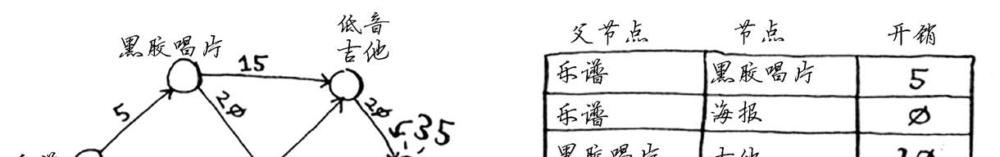

# 算法图解

## 选择排序

假设你的计算机存储了很多乐曲。对于每个乐队，你都记录了其作
品被播放的次数。现在要将这个列表按播放次数从多到少的顺序排列。

一种方法是遍历这个列表，找出播放量最多的，然后添加到新表，再次这样做，找出播放量第二多的乐队，再添加到新表。。。

最终得到一个有序列表

因此，每次循环都需要遍历一次链表（假设为 n 个数据。）

所以，需要的总次数为  n*n

所以时间复杂度为，`O(n*n)`  ==>  `O(n²)`

### **代码实现**

~~~python
def findSmallest( arr ):
	smallest = arr(0)		# 找一个基础的最小值
    samllest_index = 0		# 存储最小元素的索引
    for i in range( 1, len(arr) ):
        if ( arr[i] < smallest ):
            smallest = arr[i]
            smallest_index = i

     return smallest_index
            
# 选择排序算法
def selectionSort( arr ):
	newArr = []
    for i in range( len(arr) ):
        smallest = findSmallest( arr )	# 找到最小值
        newArr.append( arr.pop(smallest) ) # 添加到新数组
~~~

### 总结

就是找一个，加一个，找一个，加一个。

## 递归

分而治之（divide and conquer  D&C）

就是分解成很多小的问题来解决。

### 步骤

* 找出基线条件，这种条件必须尽可能简单
* 不断将问题分解，或者说缩小规模，知道符合基线条件。

#### **例子  分土地**

比如，要将一块土地，均匀且尽可能的分出最大的方块

使用`D&C` 解决问题的过程

* 找基线条件，这里最简单的就是 使用 **宽** 作为基础条件
* 那么剩下的就是一块 （168 - 64） 和 一块（64 * 64）的方块。
* 因此，就可以对剩下的那一块再次做一个 分治算法 

* 依次往下做分治算法
* 最后得到结果

#### 例子 求取和

假定有一个数组，现在需要将这些数组

**使用循环**

~~~python
def sum( arr ):
	total = 0
    for x in arr:
        total += x
    return total
~~~

**使用递归**

~~~python
def sum( arr ):
	if( len(arr) == 0 ) :
    	return 0
    else if( len(arr) == 1 ):
        return arr[0]
    return arr[0] + sum(arr.pop(0))    
~~~

## 快速排序

c 语言标准库函数 `qsort`就是快速排序

* 基线条件

  > 如果数组为空或只包含一个元素，这种情况只需要原样返回
  >
  > ~~~python
  > def quicksort( array ):
  > 	if len(array) < 2:
  >         return array
  > ~~~

  >如果包含三个及以上元素
  >
  >* 选取一个基准值
  >* 找出比基准值小的元素和基准值大的元素**称为分区**
  >
  > 
  >
  >现在我含有
  >
  >* 一个小于基准值的子数组
  >* 一个基准值
  >* 一个大于基准值的子数组
  >
  >如果子数组没有顺序，那么就可以在合并
  >
  >`quicksort([15,10]) + [33] + quicksort([35,66])`

* 再次递归寻找

~~~python
def quicksort( array ):
    if len( array ) < 2:
        return array	# 只有一个元素的时候，数组是有序的 
    else :
        pivot = array[0]
        less = [ i for i in array[1:] if i < pivot]
        greater = [ i for i in array[1:] if i > pivot]
        
        return quicksort(less) + [pivot] + quicksort(greater)
~~~

## 图

图模拟的一组连接。图，由节点（Node）和边（edge）组成。

### 实现图

## 广度优先算法

**例子**

假如我有一个芒果农场，我需要卖芒果，我就要在我的朋友之间寻找，如果我的朋友没有卖芒果的，那我就需要在我的朋友的朋友之间查找，依次类推，，，最后找到

**可以回答的问题**

* 从节点A出发，有前往节点B的路径么？
* 从节点A出发，前往节点B的哪条路径最短？

### 队列

队列是一种先进先出（First In First Out，FIFO）的数据结构，而栈是一种后进先出（Last In First Out，LIFO）的数据结构。

### 实现算法

~~~python
from collections import deque
search_queue = deque()		 # 创建一个队列
search_queue += graph["you"] # 将我的邻居添加到搜索队列
#别忘了， graph["you"] 是一个数组，其中包含你的所有邻居，如 ["alice", "bob","claire"] 。这些邻居都将加入到搜索队列中。

while search_queue:
	person = search_queue.popleft()
	if person_is_seller(person):
		print person + " is a mango seller!"
		return True
	else:
		search_queue += graph[person]
return False

# 判断 以 m 结尾的就是芒果经销商
def person_is_seller(name):
	return name[-1] == 'm'
~~~

但是这有一个问题，如果我的朋友中有 Guido，而 Guido的朋友中也有我，那么就会形成一个死循环。

所以 可以增加一个数组作为已经检查的人的标记

~~~python
from collections import deque
search_queue = deque()		 # 创建一个队列
search_queue += graph["you"] # 将我的邻居添加到搜索队列
#别忘了， graph["you"] 是一个数组，其中包含你的所有邻居，如 ["alice", "bob","claire"] 。这些邻居都将加入到搜索队列中。

searched = []

while search_queue:
	person = search_queue.popleft()
    if not person in searched:	# 不是的再进来
		if person_is_seller(person):
			print person + " is a mango seller!"
			return True
		else:
        	searched.appent(searched)
			search_queue += graph[person]
return False

# 判断 以 m 结尾的就是芒果经销商
def person_is_seller(name):
	return name[-1] == 'm'
~~~

### 时间复杂度

如果在整个人机关系网中搜索芒果经销商，那么就意味着你将沿每条边前线（边：一个人到另一个人的箭头或连接）。所以至少为O(变数)。

还使用一个队列，其中包含检查的每个人，将一个人添加到队列的时间是 O(1)，所以总时间为O(人数)，所以总运行时间O(人数+边数)，通常写成 O(V+E)，V为顶点，E为边数。

## 狄克斯特拉算法

找出最快的路径，在广度优先算法上增加了**权重**。

### 实现

* 创建一个表格，列出每个节点的开销。这里的开销指的是大道节点需要额外支付多少钱。

  

* 在迪克斯特拉算法的过程中，将不断更新这个表，计算最终路径，还需要在这个表中添加表示父节点的列。

### 具体步骤

* 第一步：找出最便宜的节点。在这里，换海报最便宜，不需要支付额外的费用。还有更便宜的换海报的途径吗？这一点非常重要，你一定要想一想。Rama能够通过一系列交换得到海报，
  还能额外得到钱吗？想清楚后接着往下读。答案是不能，因为海报是Rama能够到达的最便宜的节点，没法再便宜了。下面提供了另一种思考角度。假设你要从家里去单位。

​	如果你走经过学校的路，到学校需要2分钟。如果你走经过停车场的路，到停车场需要6分钟。如果经停车场前往学校，能不能将时间缩短到少于2分钟呢？不可能，因为只前往停车场就超过2分钟了。另一方面，有没有能更快到达停车场的路呢？有。

​	这就是狄克斯特拉算法背后的关键理念：找出图中最便宜的节点，并确保没有到该节点的更便宜的路径！

​	回到换钢琴的例子。换海报需要支付的额外费用最少。

* 第二步：计算前往该节点的各个邻居的开销。

现在的表中包含低音吉他和架子鼓的开销。这些开销是用海报交换它们时需要支付的额外费用，因此父节点为海报。这意味着，要到达低音吉他，需要沿从海报出发的边前行，对架子鼓来说亦如此。

再次执行第一步：下一个最便宜的节点是黑胶唱片——需要额外支付5美元。
再次执行第二步：更新黑胶唱片的各个邻居的开销

你更新了架子鼓和吉他的开销！这意味着经“黑胶唱片”前往“架子鼓”和“吉他”的开销更低，因此你将这些乐器的父节点改为黑胶唱片。下一个最便宜的是吉他，因此更新其邻居的开销。

你终于计算出了用吉他换钢琴的开销，于是你将其父节点设置为吉他。最后，对最后一个节点——架子鼓，做同样的处理。

### 代码实现

下面来看看如何使用代码来实现狄克斯特拉算法，这里以下面的图为例。

要编写解决这个问题的代码，需要三个散列表。

随着算法的进行，你将不断更新散列表costs和parents。首先，需要实现这个图，为此可像第6章那样使用一个散列表。
graph = {}
在前一章中，你像下面这样将节点的所有邻居都存储在散列表中。

`graph["you"] = ["alice", "bob", "claire"]`
但这里需要同时存储邻居和前往邻居的开销。例如，起点有两个邻居——A和B。

如何表示这些边的权重呢？为何不使用另一个散列表呢？

`graph["start"] = {}`
`graph["start"]["a"] = 6`
`graph["start"]["b"] = 2`

因此 graph["start"] 是一个散列表。要获取起点的所有邻居，可像下面这样做。
~~~python
>>> print graph["start"].keys()
>>> ["a", "b"]
~~~
有一条从起点到A的边，还有一条从起点到B的边。要获悉这些边的权重，该如何办呢？
~~~python
>>> print graph["start"]["a"]
>>> 2
>>> print graph["start"]["b"]
>>> 6
~~~

下面来添加其他节点及其邻居。

~~~python
graph["a"] = {}
graph["a"]["fin"] = 1
graph["b"] = {}
graph["b"]["a"] = 3
graph["b"]["fin"] = 5
graph["fin"] = {} # 终点没有任何邻居
~~~

表示整个图的散列表类似于下面这样。

接下来，需要用一个散列表来存储每个节点的开销。
节点的开销指的是从起点出发前往该节点需要多长时间。你知道的，从起点到节点B需要2分钟，从起点到节点A需要6分钟（但你可能会找到所需时间更短的路径）。你不知道到终点需要多长时间。对于还不知道的开销，你将其设置为无穷大。在Python中能够表示无穷大吗？你可以这样做：

`infinity = float("inf")`

创建开销表的代码如下：
`infinity = float("inf")`
`costs = {}`
`costs["a"] = 6`
`costs["b"] = 2`
`costs["fin"] = infinity`

还需要一个存储父节点的散列表：

创建这个散列表的代码如下：
`parents = {}`
`parents["a"] = "start"`
`parents["b"] = "start"`
`parents["fin"] = None`

最后，你需要一个数组，用于记录处理过的节点，因为对于同一个节点，你不用处理多次。
`processed = []`

准备工作做好了，下面来看看算法。

~~~python
# -*- coding:utf-8 -*-
__author__ = "东方鹗"
__blog__ = "www.os373.cn"

def find_lowest_cost_node(costs, processed):
    lowest_cost = float("inf") # 设置初始开销为无穷大，因为你现在很茫然
    lowest_cost_node = None # 设置初始最低开销节点为 None
    for node in costs: # 遍历所有的节点
        cost = costs[node]
        if cost < lowest_cost and node not in processed: # 如果当前节点的开销更低且未处理过，
            lowest_cost = cost # 就将其视为开销最低的节点。
            lowest_cost_node = node # 最低开销节点为当前的节点。
    return lowest_cost_node

def best_route():
    ''' 存储所有节点及其下一个节点开销的字典 '''
    graph = {"start": {"a": 6, "b": 2}, "a": {"fin": 1}, "b": {"a": 3, "fin": 5}, "fin": {}}

    ''' 从起点开始，包含所有下一个节点开销的字典 '''
    infinity = float("inf")
    costs = {"a": 6, "b": 2, "fin": infinity}

    ''' 从起点开始，存储所有父节点的散列表 '''

    parents = {"a": "start", "b": "start", "fin": None}
    best_route = ""
    processed = []

    node = find_lowest_cost_node(costs, processed) # 在未处理的节点中找出开销最小的节点    
    while node is not None: # 这个 while 循环在所有节点都被处理过后结束
        cost = costs[node]
        neighbors = graph[node]
        for n in neighbors.keys(): # 遍历当前节点的所有邻居
            new_cost = cost + neighbors[n]
            if costs[n] > new_cost: # 如果经当前节点前往该邻居最近，
                costs[n] = new_cost # 就更新该邻居的开销
                parents[n] = node # 同时将该邻居的父节点设置为当前节点
        processed.append(node) # 将当前借调标记为已处理
        node = find_lowest_cost_node(costs, processed) # 找出接下来要处理的节点，并循环。
    
    p = parents["fin"]
    
    while True:  
        best_route += "%s<——" % p
        p = parents[p]
        
        if p is "start":
            break               
        
                
    return "到达终点的最终路径是: 终点<——%s起点。\n最快到达的时间是%s分钟" % (best_route, costs["fin"])
        
if __name__ == "__main__":
    best_route = best_route()
    print(best_route)
~~~

### 终极步骤

* 找出最便宜的节点，即可在最短时间内前往的节点。
* 对于该节点的所有邻居，检查是否有前往它们的更短路径，如果有，就更新其开销。
* 处理过的节点，进行标记，以后将不再处理。
* 重复以上过程，直到对图中的每个节点都这样做了。
* 计算出最终路径。

 

**第一步：**找出最便宜的节点。你站在起点，不知道该前往节点 A 还是节点 B ，茫然无措ing........。此时，**散列表**可以派上用场了。啥是**散列表**？你可以把它当做是一个列表，详细的东西问谷歌，请*自备梯子*。

前往节点 A 需要6 分钟，而前往节点 B 需要 2 分钟。至于前往其它节点，你还不知道需要多长时间。那么散列表如下：

| 父节点 | 节点 | 耗时 |
| ------ | ---- | ---- |
| 起点   | A    | 6    |
| 起点   | B    | 2    |
| 起点   | 终点 | ∞    |

 **第二步：**由于从起点到节点 B 的路径耗时少，先计算经节点 B 前往其各个邻居所需的时间。 

| 父节点 | 节点 | 耗时       |
| ------ | ---- | ---------- |
| B      | A    | 5 更新耗时 |
| -      | B    | 2          |
| B      | 终点 | 7 更新耗时 |

这一步，找到了一条前往节点 A 的更短路径！直接前往节点 A 需要 6 分钟。但是经过节点 B 前往节点 A 只需要 5 分钟。

对于节点 B 的邻居，如果找到前往它的更短路径，就更新其开销。

- 前往节点 A 的更短路径，时间从 6 分钟缩短到 5 分钟。
- 前往终点的更短路径，时间从无穷大缩短到 7 分钟。

**第三步：**对节点 B 已进行处理，所以要对节点 B 进行标记，以后将不再处理节点 B。

**第四部：** 重复！

​	**重复第一步：**找出可在最短时间内前往的节点。除节点 B 之外，可以在最短时间内前往的节点是节点 A 。
​	**重复第二步：**更新节点 A 的所有邻居的开销。

| 父节点 | 节点 | 耗时                     |
| ------ | ---- | ------------------------ |
| -      | A    | 5 已是最小耗时，无需更新 |
| -      | B    | 2                        |
| A      | 终点 | 6 更新耗                 |

#### 代码实现

找出开销最低节点的函数

~~~python
#
def find_lowest_cost_node(costs):
    lowest_cost = float("inf") # 设置初始开销为无穷大，因为你现在很茫然
    lowest_cost_node = None # 设置初始最低开销节点为 None
    for node in costs: # 遍历所有的节点
        cost = costs[node]
        if cost < lowest_cost and node not in processed: # 如果当前节点的开销更低且未处理过，
            lowest_cost = cost # 就将其视为开销最低的节点。
            lowest_cost_node = node # 最低开销节点为当前的节点。
    return lowest_cost_node
~~~

创建用于存储所有节点及其前往邻居开销的散列表代码

~~~python
graph["start"] = {}
graph["start"]["a"] = 6
graph["start"]["b"] = 2

graph["a"] = {}
graph["a"]["fin"] =1

graph["b"] = {}
graph["b"]["a"] =3
graph["b"]["fin"] = 5

graph["fin"] = {} # 终点没有任何邻居
~~~

表示整个图的散列表类似下面这样。

| 父节点 | 节点 | 耗时 |
| ------ | ---- | ---- |
| 起点   | A    | 6    |
| 起点   | B    | 2    |
| A      | 终点 | 1    |
| B      | A    | 3    |
| B      | 终点 | 5    |
| 起点   | 终点 | -    |

#### 按流程实现代码

 **一、创建从起点开始的开销表代码如下：** 

~~~python
infinity = float("inf")
costs = {}
costs["a"] = 6
costs["b"] = 2
costs["fin"] = infinity
~~~

 **二、创建存储父节点的散列表代码如下：** 

~~~python
parents = {}
parents["a"] = "start"
parents["b"] = "start"
parents["fin"] = None
~~~

 **三、创建一个数组，用于记录处理过的节点，对于同一个节点，不用多次处理。** 

~~~python
processed = []
~~~

 **四、按照算法列出代码** 

~~~python
# -*- coding:utf-8 -*-
__author__ = "东方鹗"
__blog__ = "www.os373.cn"

def find_lowest_cost_node(costs, processed):
    lowest_cost = float("inf") # 设置初始开销为无穷大，因为你现在很茫然
    lowest_cost_node = None # 设置初始最低开销节点为 None
    for node in costs: # 遍历所有的节点
        cost = costs[node]
        if cost < lowest_cost and node not in processed: # 如果当前节点的开销更低且未处理过，
            lowest_cost = cost # 就将其视为开销最低的节点。
            lowest_cost_node = node # 最低开销节点为当前的节点。
    return lowest_cost_node

def best_route():
    ''' 存储所有节点及其下一个节点开销的字典 '''
    graph = {"start": {"a": 6, "b": 2}, "a": {"fin": 1}, "b": {"a": 3, "fin": 5}, "fin": {}}

    ''' 从起点开始，包含所有下一个节点开销的字典 '''
    infinity = float("inf")
    costs = {"a": 6, "b": 2, "fin": infinity}

    ''' 从起点开始，存储所有父节点的散列表 '''

    parents = {"a": "start", "b": "start", "fin": None}
    best_route = ""
    processed = []

    node = find_lowest_cost_node(costs, processed) # 在未处理的节点中找出开销最小的节点    
    while node is not None: # 这个 while 循环在所有节点都被处理过后结束
        cost = costs[node]
        neighbors = graph[node]
        for n in neighbors.keys(): # 遍历当前节点的所有邻居
            new_cost = cost + neighbors[n]
            if costs[n] > new_cost: # 如果经当前节点前往该邻居最近，
                costs[n] = new_cost # 就更新该邻居的开销
                parents[n] = node # 同时将该邻居的父节点设置为当前节点
        processed.append(node) # 将当前借调标记为已处理
        node = find_lowest_cost_node(costs, processed) # 找出接下来要处理的节点，并循环。
    
    p = parents["fin"]
    
    while True:  
        best_route += "%s<——" % p
        p = parents[p]
        
        if p is "start":
            break               
        
                
    return "到达终点的最终路径是: 终点<——%s起点。\n最快到达的时间是%s分钟" % (best_route, costs["fin"])
        
if __name__ == "__main__":
    best_route = best_route()
    print(best_route)
~~~

