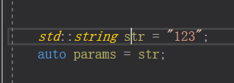
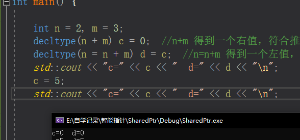

# C++11

由于之前一直使用的 11 之前的 c++ 语言，而 11 以后又是大发展趋势，因此，现在来学习一下C++ 11 。

目前主要参考：[C语言中文网](http://c.biancheng.net/view/6984.html)

## `auto`

### 概念

c++ 11 中，用它来做自动类型推导， 也就是说，使用了 auto 关键字以后，编译器会在编译期间自动**推导出变量的类型**，这样我们就不用手动指明变量的数据类型了。 

语法：

~~~c++
auto name = value;
~~~

**注意事项**：使用 auto 类型推导的变量必须马上初始化，这个很容易理解，因为 auto 在 C++11 中只是“占位符”，并非如 int 一样的真正的类型声明。  

~~~c++
int  x = 0;
auto *p1 = &x;   //p1 为 int *，auto 推导为 int
auto  p2 = &x;   //p2 为 int*，auto 推导为 int*
auto &r1  = x;   //r1 为 int&，auto 推导为 int
auto r2 = r1;    //r2 为  int，auto 推导为 int
~~~

### 应用

#### 简化书写

~~~c++
#include <vector>
using namespace std;

int main(){
    vector< vector<int> > v;
    vector< vector<int> >::iterator i = v.begin();
    // 简化
    auto i = v.begin();  //使用 auto 代替具体的类型
    return 0;
}
~~~

泛型编程

~~~c++
#include <iostream>
using namespace std;

class A{
public:
    static int get(void){
        return 100;
    }
};

class B{
public:
    static const char* get(void){
        return "http://c.biancheng.net/cplus/";
    }
};

template <typename T>
void func(void){
    auto val = T::get();
    cout << val << endl;
}

int main(void){
    func<A>();
    func<B>();

    return 0;
}
// A 和 B的 get 的返回值不一样，可以同样使用 auto 来推导

不使用 auto 的方式
//额外增加一个模板参数 T2
template <typename T1, typename T2> 
void func(void){
    T2 val = T1::get();
    cout << val << endl;
}
int main(void){
    //调用时也要手动给模板参数赋值
    func<A, int>();
    func<B, const char*>();
    return 0;
}
~~~

## `decltype`

>  `decltype` 是“declare type”的缩写，译为“声明类型”。 

虽然已经有auto了，但是 auto 是推断变量的类型，如果没有变量本身，那则 auto 就不能使用了，所以有了这个关键字 `decltype`

语法

~~~c++
auto varname = value;
decltype(exp) varname = value;
// 其中，varname 表示变量名，value 表示赋给变量的值，exp 表示一个表达式。
//auto 根据=右边的初始值 value 推导出变量的类型，而 decltype 根据 exp 表达式推导出变量的类型，跟=右边的 value 没有关系。

int a = 0;
decltype(a) b = 1;  //b 被推导成了 int
decltype(10.8) x = 5.5;  //x 被推导成了 double
decltype(x + 100) y;  //y 被推导成了 double
~~~

### 推导规则

- 如果 exp 是一个不被括号`( )`包围的表达式，或者是一个类成员访问表达式，或者是一个单独的变量，那么 `decltype(exp)` 的类型就和 `exp`一致，这是最普遍最常见的情况。
- 如果 exp 是函数调用，那么 `decltype(exp)` 的类型就和函数返回值的类型一致。
- 如果 exp 是一个左值，或者被括号`( )`包围，那么 `decltype(exp) `的类型就是` exp `的引用；假设 exp 的类型为 T，那么 `decltype(exp) `的类型就是 T&。

~~~c++
using namespace std;

class Base{
public:
    int x;
};

int main(){
    const Base obj;

    //带有括号的表达式
    decltype(obj.x) a = 0;  //obj.x 为类的成员访问表达式，符合推导规则一，a 的类型为 int
    decltype((obj.x)) b = a;  //obj.x 带有括号，符合推导规则三，b 的类型为 int&。

    //加法表达式
    int n = 0, m = 0;
    decltype(n + m) c = 0;  //n+m 得到一个右值，符合推导规则一，所以推导结果为 int
    decltype(n = n + m) d = c;  //n=n+m 得到一个左值，符号推导规则三，所以推导结果为 int&

    return 0;
}
~~~

左值和右值：左值是指那些在表达式执行结束后依然存在的数据，也就是持久性的数据；右值是指那些在表达式执行结束后不再存在的数据，也就是临时性的数据。 